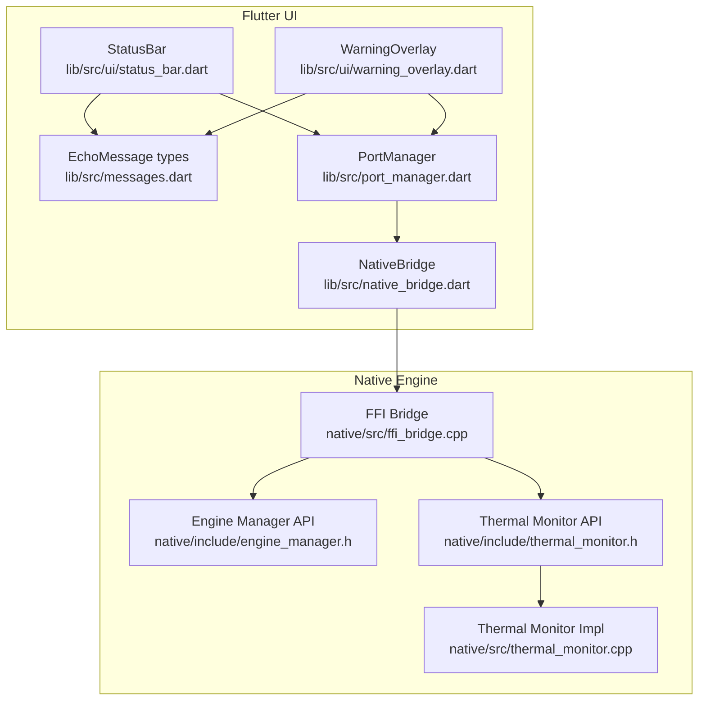
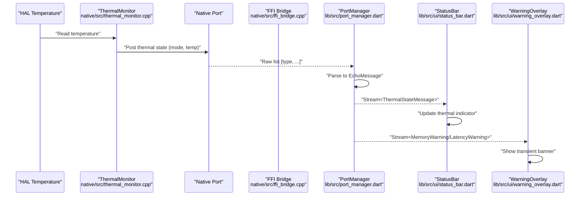
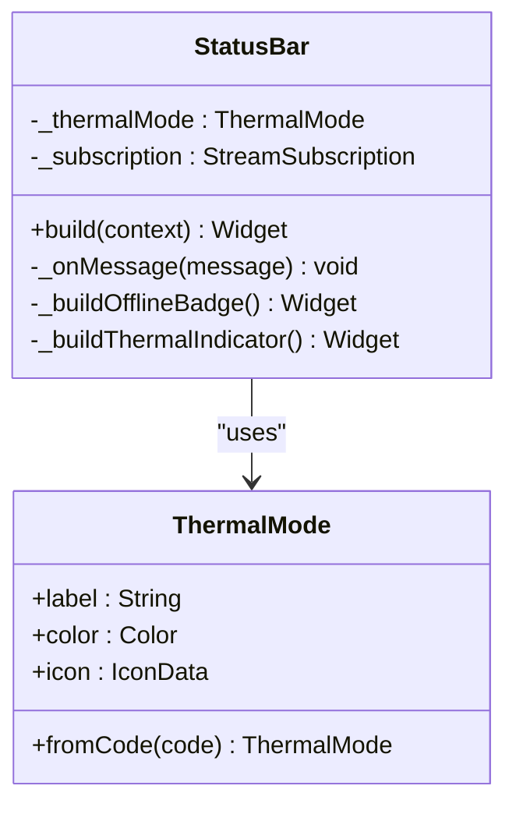
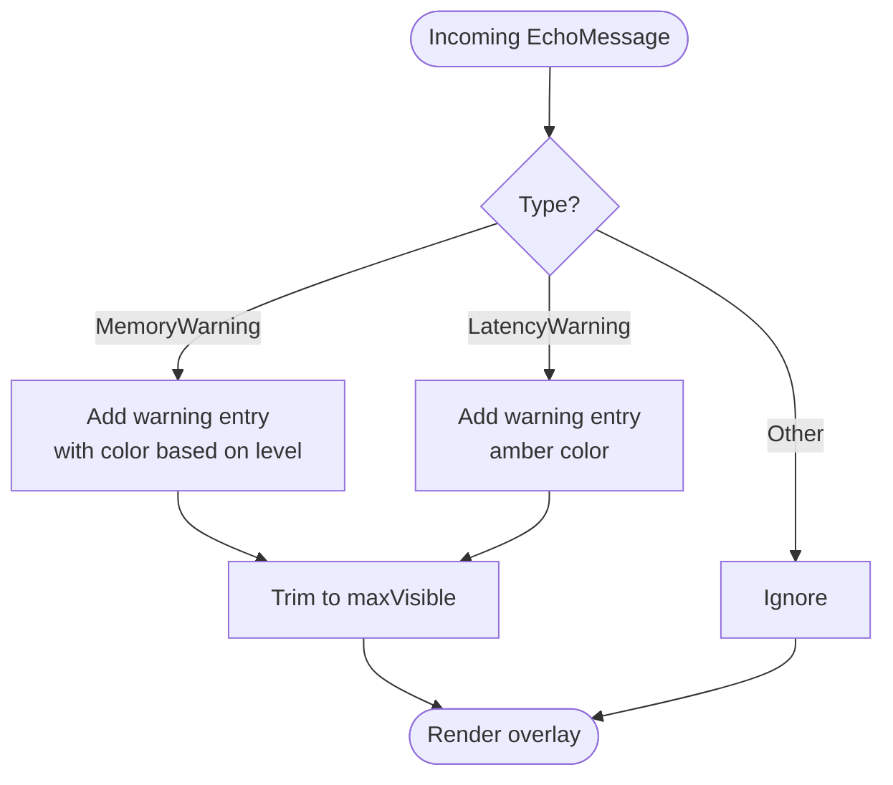
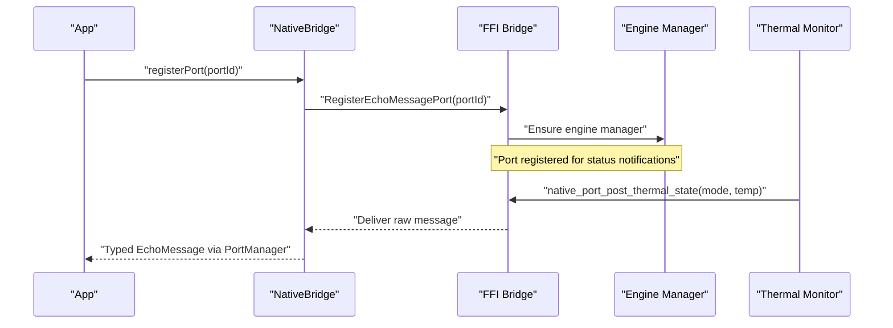
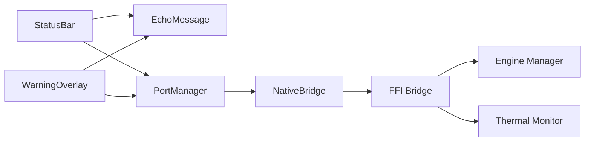

# Status Monitoring

<cite>
**Referenced Files in This Document**
- [status_bar.dart](file://lib/src/ui/status_bar.dart)
- [warning_overlay.dart](file://lib/src/ui/warning_overlay.dart)
- [messages.dart](file://lib/src/messages.dart)
- [port_manager.dart](file://lib/src/port_manager.dart)
- [native_bridge.dart](file://lib/src/native_bridge.dart)
- [ffi_bridge.cpp](file://native/src/ffi_bridge.cpp)
- [thermal_monitor.h](file://native/include/thermal_monitor.h)
- [thermal_monitor.cpp](file://native/src/thermal_monitor.cpp)
- [engine_manager.h](file://native/include/engine_manager.h)
- [status_bar_test.dart](file://test/ui/status_bar_test.dart)
</cite>

## Table of Contents
1. [Introduction](#introduction)
2. [Project Structure](#project-structure)
3. [Core Components](#core-components)
4. [Architecture Overview](#architecture-overview)
5. [Detailed Component Analysis](#detailed-component-analysis)
6. [Dependency Analysis](#dependency-analysis)
7. [Performance Considerations](#performance-considerations)
8. [Troubleshooting Guide](#troubleshooting-guide)
9. [Conclusion](#conclusion)

## Introduction
This document explains the StatusBar component and its ecosystem for real-time system health monitoring and user feedback. It covers:
- Offline indicator display
- Thermal status visualization with color coding (normal, warning/throttle, critical)
- Integration with native engine status via the EchoEngine facade and FFI bridge
- System resource monitoring integration (memory and latency warnings)
- Configuration options, custom status messages, and accessibility considerations
- Performance considerations for frequent updates and battery impact optimization

## Project Structure
The status monitoring stack spans Flutter UI components, a message bus, an FFI bridge to native code, and native thermal/resource monitors.

**Diagram sources**
- [status_bar.dart:101-123](file://lib/src/ui/status_bar.dart#L101-L123)
- [warning_overlay.dart:37-63](file://lib/src/ui/warning_overlay.dart#L37-L63)
- [messages.dart:1-49](file://lib/src/messages.dart#L1-L49)
- [port_manager.dart:18-33](file://lib/src/port_manager.dart#L18-L33)
- [native_bridge.dart:177-229](file://lib/src/native_bridge.dart#L177-L229)
- [ffi_bridge.cpp:108-123](file://native/src/ffi_bridge.cpp#L108-L123)
- [engine_manager.h:1-37](file://native/include/engine_manager.h#L1-L37)
- [thermal_monitor.h:1-33](file://native/include/thermal_monitor.h#L1-L33)
- [thermal_monitor.cpp:99-128](file://native/src/thermal_monitor.cpp#L99-L128)

**Section sources**
- [status_bar.dart:1-181](file://lib/src/ui/status_bar.dart#L1-L181)
- [warning_overlay.dart:1-201](file://lib/src/ui/warning_overlay.dart#L1-L201)
- [messages.dart:1-336](file://lib/src/messages.dart#L1-L336)
- [port_manager.dart:1-84](file://lib/src/port_manager.dart#L1-L84)
- [native_bridge.dart:58-93](file://lib/src/native_bridge.dart#L58-L93)
- [ffi_bridge.cpp:1-48](file://native/src/ffi_bridge.cpp#L1-L48)
- [engine_manager.h:1-37](file://native/include/engine_manager.h#L1-L37)
- [thermal_monitor.h:1-108](file://native/include/thermal_monitor.h#L1-L108)
- [thermal_monitor.cpp:41-189](file://native/src/thermal_monitor.cpp#L41-L189)

## Core Components
- StatusBar: Persistent top bar showing an always-visible OFFLINE badge and a thermal mode indicator that changes label, icon, and color based on native thermal state. It also hosts a WarningOverlay for transient notifications.
- WarningOverlay: Auto-dismissing banners for memory pressure and latency SLA violations.
- Message Bus: Typed EchoMessage classes and a broadcast Stream from PortManager that decodes raw lists into typed messages.
- Native Bridge and FFI: Dart NativeBridge calls into C++ FFI bridge which registers a port and forwards lifecycle operations to the Engine Manager.
- Thermal Monitor: Native module polling hardware temperature and emitting transitions to the UI via the native port.

Key responsibilities:
- StatusBar subscribes to the message stream and updates only on ThermalStateMessage events.
- WarningOverlay subscribes to the same stream and renders transient banners for MemoryWarningMessage and LatencyWarningMessage.
- PortManager owns ReceivePort registration and deserializes incoming lists into EchoMessage instances.
- NativeBridge exposes registerPort and other FFI-bound functions; FFI bridge maintains port registration and delegates to Engine Manager.

**Section sources**
- [status_bar.dart:64-99](file://lib/src/ui/status_bar.dart#L64-L99)
- [warning_overlay.dart:37-104](file://lib/src/ui/warning_overlay.dart#L37-L104)
- [messages.dart:8-49](file://lib/src/messages.dart#L8-L49)
- [port_manager.dart:18-84](file://lib/src/port_manager.dart#L18-L84)
- [native_bridge.dart:177-229](file://lib/src/native_bridge.dart#L177-L229)
- [ffi_bridge.cpp:108-123](file://native/src/ffi_bridge.cpp#L108-L123)
- [thermal_monitor.cpp:99-128](file://native/src/thermal_monitor.cpp#L99-L128)

## Architecture Overview
End-to-end flow from native thermal monitor to Flutter UI:

**Diagram sources**
- [thermal_monitor.cpp:99-128](file://native/src/thermal_monitor.cpp#L99-L128)
- [ffi_bridge.cpp:108-123](file://native/src/ffi_bridge.cpp#L108-L123)
- [port_manager.dart:76-84](file://lib/src/port_manager.dart#L76-L84)
- [status_bar.dart:90-99](file://lib/src/ui/status_bar.dart#L90-L99)
- [warning_overlay.dart:87-104](file://lib/src/ui/warning_overlay.dart#L87-L104)

## Detailed Component Analysis

### StatusBar
Responsibilities:
- Displays a persistent OFFLINE badge indicating air-gapped operation.
- Shows a thermal mode indicator with dynamic label, icon, and color.
- Hosts WarningOverlay for transient system warnings.

Behavior:
- Subscribes to the shared message stream.
- Updates internal thermal mode only when receiving ThermalStateMessage and only if the new mode differs from current.
- Renders SafeArea-based Row with offline badge and thermal indicator; overlays WarningOverlay.

Color coding and labels:
- Normal: green theme
- Throttle: orange theme
- Critical: red theme

Accessibility:
- The OFFLINE badge includes an icon and text suitable for screen readers by default.
- To improve accessibility, consider adding semantic labels or semantics properties around the thermal indicator to announce “Thermal: Normal/Throttle/Critical” to assistive technologies.

Configuration options:
- Currently no public configuration parameters are exposed on StatusBar itself.
- You can customize appearance by wrapping StatusBar in your own theme or by extending it with a subclass that overrides rendering logic.

Examples of status updates:
- Receiving ThermalStateMessage with mode 0 updates indicator to Normal.
- Mode 1 updates to Throttle.
- Mode 2 updates to Critical.
- Non-thermal messages do not change the thermal indicator.

**Section sources**
- [status_bar.dart:18-54](file://lib/src/ui/status_bar.dart#L18-L54)
- [status_bar.dart:64-99](file://lib/src/ui/status_bar.dart#L64-L99)
- [status_bar.dart:101-123](file://lib/src/ui/status_bar.dart#L101-L123)
- [status_bar.dart:125-180](file://lib/src/ui/status_bar.dart#L125-L180)
- [status_bar_test.dart:10-22](file://test/ui/status_bar_test.dart#L10-L22)
- [status_bar_test.dart:24-35](file://test/ui/status_bar_test.dart#L24-L35)
- [status_bar_test.dart:37-70](file://test/ui/status_bar_test.dart#L37-L70)
- [status_bar_test.dart:72-89](file://test/ui/status_bar_test.dart#L72-L89)

#### Class Diagram: StatusBar and ThermalMode

**Diagram sources**
- [status_bar.dart:18-54](file://lib/src/ui/status_bar.dart#L18-L54)
- [status_bar.dart:74-99](file://lib/src/ui/status_bar.dart#L74-L99)
- [status_bar.dart:101-180](file://lib/src/ui/status_bar.dart#L101-L180)

### WarningOverlay
Responsibilities:
- Listens to the same message stream and shows transient banners for memory and latency warnings.
- Auto-dismisses after a configurable duration and caps visible count.

Behavior:
- Adds entries with timestamps and durations.
- Periodically removes expired entries.
- Formats messages differently for memory vs latency warnings.

Configuration options:
- displayDuration: how long each warning remains visible before auto-dismissing.
- maxVisible: maximum number of concurrent warnings shown.
- clock: injectable time source for testing.

User notification patterns:
- Memory warnings use orange for moderate levels and red for critical levels.
- Latency warnings use amber.
- Banners fade out near expiration.

**Section sources**
- [warning_overlay.dart:37-63](file://lib/src/ui/warning_overlay.dart#L37-L63)
- [warning_overlay.dart:87-129](file://lib/src/ui/warning_overlay.dart#L87-L129)
- [warning_overlay.dart:131-141](file://lib/src/ui/warning_overlay.dart#L131-L141)
- [warning_overlay.dart:144-200](file://lib/src/ui/warning_overlay.dart#L144-L200)

#### Flowchart: Warning Overlay Processing

**Diagram sources**
- [warning_overlay.dart:87-119](file://lib/src/ui/warning_overlay.dart#L87-L119)

### Message Types and Parsing
- MessageType tags define integer identifiers for all native-to-Dart messages.
- EchoMessage.fromRawList parses raw lists into typed messages.
- ThermalStateMessage carries thermal mode and temperature.
- MemoryWarningMessage and LatencyWarningMessage drive WarningOverlay.

Integration points:
- PortManager listens to ReceivePort, converts raw lists to EchoMessage, and broadcasts them.
- StatusBar and WarningOverlay subscribe to this broadcast stream.

**Section sources**
- [messages.dart:8-49](file://lib/src/messages.dart#L8-L49)
- [messages.dart:226-256](file://lib/src/messages.dart#L226-L256)
- [messages.dart:258-287](file://lib/src/messages.dart#L258-L287)
- [messages.dart:289-313](file://lib/src/messages.dart#L289-L313)
- [port_manager.dart:76-84](file://lib/src/port_manager.dart#L76-L84)

### Native Engine Connection (EchoEngine Facade via FFI)
- Dart NativeBridge.registerPort calls into FFI function RegisterEchoMessagePort.
- FFI bridge stores the Dart port and forwards to native_port for dispatch.
- Thermal monitor polls temperature and posts thermal state via native port.
- Engine Manager provides lifecycle APIs used by FFI bridge.

**Diagram sources**
- [native_bridge.dart:177-229](file://lib/src/native_bridge.dart#L177-L229)
- [ffi_bridge.cpp:108-123](file://native/src/ffi_bridge.cpp#L108-L123)
- [engine_manager.h:1-37](file://native/include/engine_manager.h#L1-L37)
- [thermal_monitor.cpp:107-118](file://native/src/thermal_monitor.cpp#L107-L118)

**Section sources**
- [native_bridge.dart:177-229](file://lib/src/native_bridge.dart#L177-L229)
- [ffi_bridge.cpp:108-123](file://native/src/ffi_bridge.cpp#L108-L123)
- [engine_manager.h:1-37](file://native/include/engine_manager.h#L1-L37)
- [thermal_monitor.cpp:99-128](file://native/src/thermal_monitor.cpp#L99-L128)

## Dependency Analysis
High-level dependencies among key modules:

**Diagram sources**
- [status_bar.dart:101-123](file://lib/src/ui/status_bar.dart#L101-L123)
- [warning_overlay.dart:37-63](file://lib/src/ui/warning_overlay.dart#L37-L63)
- [port_manager.dart:18-33](file://lib/src/port_manager.dart#L18-L33)
- [native_bridge.dart:177-229](file://lib/src/native_bridge.dart#L177-L229)
- [ffi_bridge.cpp:108-123](file://native/src/ffi_bridge.cpp#L108-L123)
- [engine_manager.h:1-37](file://native/include/engine_manager.h#L1-L37)
- [thermal_monitor.h:1-33](file://native/include/thermal_monitor.h#L1-L33)

**Section sources**
- [status_bar.dart:101-123](file://lib/src/ui/status_bar.dart#L101-L123)
- [warning_overlay.dart:37-63](file://lib/src/ui/warning_overlay.dart#L37-L63)
- [port_manager.dart:18-33](file://lib/src/port_manager.dart#L18-L33)
- [native_bridge.dart:177-229](file://lib/src/native_bridge.dart#L177-L229)
- [ffi_bridge.cpp:108-123](file://native/src/ffi_bridge.cpp#L108-L123)
- [engine_manager.h:1-37](file://native/include/engine_manager.h#L1-L37)
- [thermal_monitor.h:1-33](file://native/include/thermal_monitor.h#L1-L33)

## Performance Considerations
- Minimize rebuilds: StatusBar only triggers setState when thermal mode actually changes, avoiding unnecessary re-renders.
- Debounce or coalesce rapid updates: If future features add high-frequency metrics, consider debouncing UI updates to reduce layout work.
- Avoid heavy computations in build: Keep widget builds lightweight; move formatting and parsing to message handlers or precomputed values.
- Battery impact:
  - Native thermal monitor runs at low priority and polls at a fixed interval, reducing CPU wakeups.
  - Keep WarningOverlay’s cleanup timer interval reasonable; avoid overly frequent timers.
- Stream management: Ensure subscriptions are canceled in dispose to prevent leaks and background processing after teardown.

[No sources needed since this section provides general guidance]

## Troubleshooting Guide
Common issues and resolutions:
- No thermal updates appear:
  - Verify that PortManager has registered a port and is listening.
  - Confirm FFI bridge has successfully stored the port and that native_port is active.
  - Check that the native thermal monitor thread is running and posting thermal state.
- Incorrect thermal mode mapping:
  - Ensure ThermalMode.fromCode handles unknown codes gracefully (fallback to normal).
  - Validate that MessageType.thermalState tag matches between Dart and native.
- Excessive UI churn:
  - Confirm StatusBar only updates on actual mode changes.
  - Review WarningOverlay’s maxVisible and displayDuration to control visual noise.
- Accessibility gaps:
  - Add semantic labels to the thermal indicator so screen readers announce current thermal state.

**Section sources**
- [port_manager.dart:42-50](file://lib/src/port_manager.dart#L42-L50)
- [ffi_bridge.cpp:108-123](file://native/src/ffi_bridge.cpp#L108-L123)
- [thermal_monitor.cpp:147-175](file://native/src/thermal_monitor.cpp#L147-L175)
- [status_bar.dart:90-99](file://lib/src/ui/status_bar.dart#L90-L99)
- [messages.dart:37-49](file://lib/src/messages.dart#L37-L49)

## Conclusion
The StatusBar component provides a clear, minimal, and efficient view of system health:
- A persistent OFFLINE badge confirms air-gapped operation.
- A thermal indicator reflects native thermal states with intuitive colors and icons.
- Transient warnings for memory and latency keep users informed without clutter.
The design cleanly separates UI concerns from AI logic, integrates with native engine status through a robust FFI bridge, and supports safe, performant updates suitable for frequent telemetry.

[No sources needed since this section summarizes without analyzing specific files]