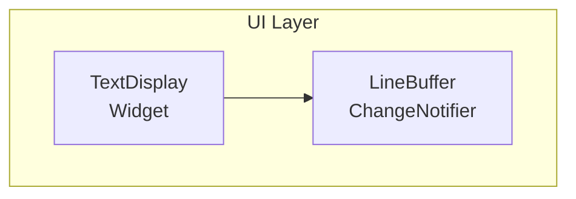
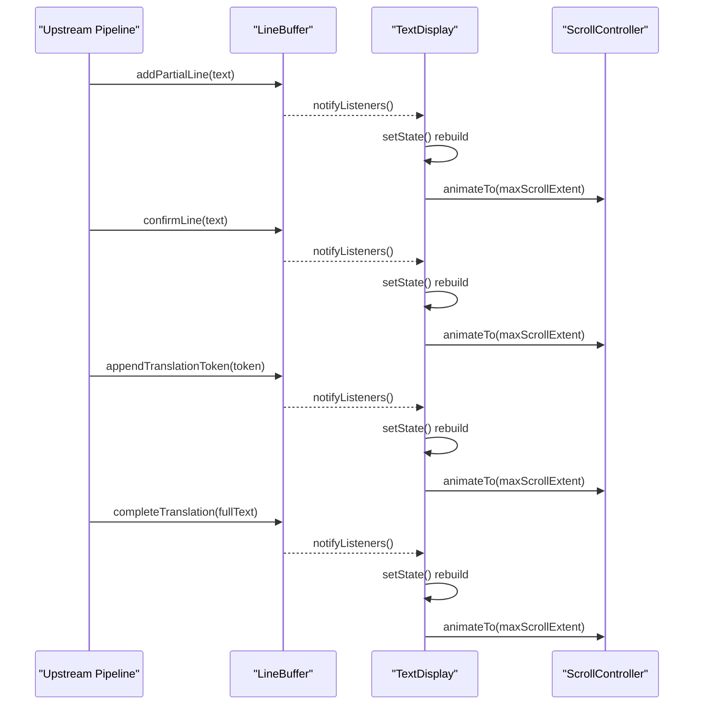
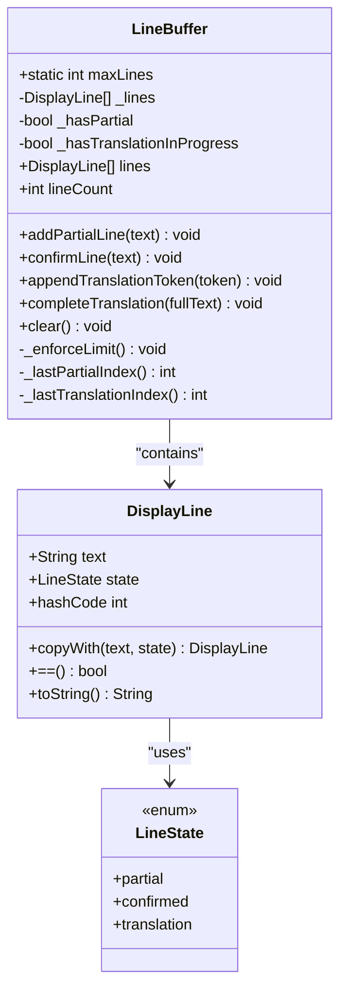
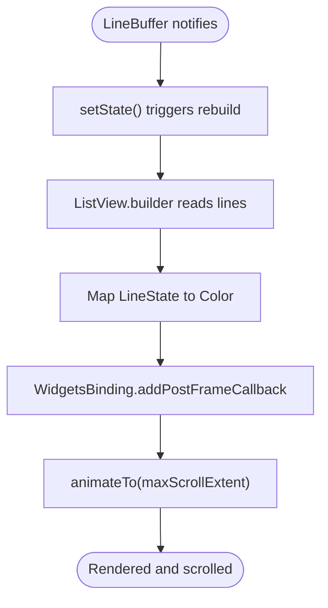
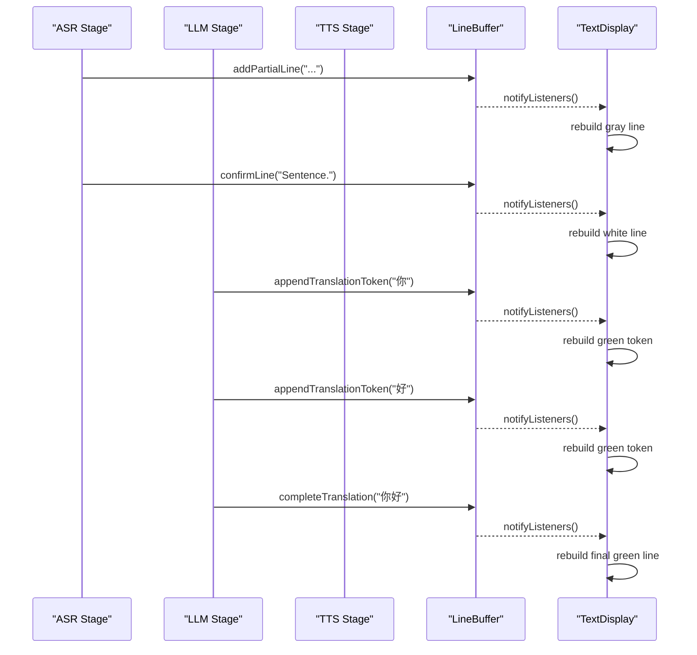
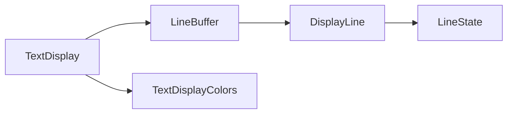

# Text Display System

<cite>
**Referenced Files in This Document**
- [text_display.dart](file://lib/src/ui/text_display.dart)
- [line_buffer.dart](file://lib/src/ui/line_buffer.dart)
- [text_display_test.dart](file://test/ui/text_display_test.dart)
- [line_buffer_test.dart](file://test/ui/line_buffer_test.dart)
</cite>

## Table of Contents
1. [Introduction](#introduction)
2. [Project Structure](#project-structure)
3. [Core Components](#core-components)
4. [Architecture Overview](#architecture-overview)
5. [Detailed Component Analysis](#detailed-component-analysis)
6. [Dependency Analysis](#dependency-analysis)
7. [Performance Considerations](#performance-considerations)
8. [Troubleshooting Guide](#troubleshooting-guide)
9. [Conclusion](#conclusion)
10. [Appendices](#appendices)

## Introduction
This document explains the text display subsystem responsible for real-time rendering of ASR and translation output. It focuses on two core components:
- LineBuffer: a memory-efficient, bounded buffer that manages lines with three visual states (partial ASR, confirmed ASR, streaming translation).
- TextDisplay: a Flutter widget that renders the buffer contents with auto-scrolling behavior and state-based coloring.

The system supports high-frequency updates typical of live transcription and streaming translation, while keeping memory usage predictable by enforcing a maximum line count.

## Project Structure
The text display subsystem is implemented in Dart under the UI layer:
- lib/src/ui/line_buffer.dart: data model and buffer logic
- lib/src/ui/text_display.dart: rendering widget and auto-scroll controller
- test/ui/line_buffer_test.dart: unit tests for buffer operations and limits
- test/ui/text_display_test.dart: widget tests for rendering and color mapping

**Diagram sources**
- [text_display.dart:1-123](file://lib/src/ui/text_display.dart#L1-L123)
- [line_buffer.dart:1-176](file://lib/src/ui/line_buffer.dart#L1-L176)

**Section sources**
- [text_display.dart:1-123](file://lib/src/ui/text_display.dart#L1-L123)
- [line_buffer.dart:1-176](file://lib/src/ui/line_buffer.dart#L1-L176)

## Core Components
- LineState: an enum representing three visual states used to determine text color.
- DisplayLine: an immutable value object holding text content and its LineState.
- LineBuffer: ChangeNotifier-backed buffer managing lines, enforcing a maximum line count, and exposing typed update methods for partial, confirmed, and translation text.
- TextDisplay: StatefulWidget listening to LineBuffer changes, rebuilding the list, and auto-scrolling to the bottom after each frame.

Key behaviors:
- Three-color state system:
  - Partial (gray): temporary ASR input being built
  - Confirmed (white): finalized ASR sentence
  - Translation (green): streaming translation tokens
- Auto-scrolling: scrolls to the bottom after new content is added or updated
- Bounded storage: enforces a fixed maximum number of lines; oldest are discarded when exceeded

**Section sources**
- [line_buffer.dart:1-176](file://lib/src/ui/line_buffer.dart#L1-L176)
- [text_display.dart:1-123](file://lib/src/ui/text_display.dart#L1-L123)

## Architecture Overview
The real-time rendering pipeline connects native stages (ASR, LLM, TTS) to the UI via message routing. For this document, we focus on the UI-side flow from LineBuffer to TextDisplay.

**Diagram sources**
- [text_display.dart:43-86](file://lib/src/ui/text_display.dart#L43-L86)
- [line_buffer.dart:70-143](file://lib/src/ui/line_buffer.dart#L70-L143)

## Detailed Component Analysis

### LineBuffer: Data Model and Buffer Logic
Responsibilities:
- Maintain a list of DisplayLine items with strict max-line enforcement
- Track whether a partial ASR line is active and whether a translation line is in progress
- Provide typed APIs:
  - addPartialLine(text): show/update gray partial line
  - confirmLine(text): finalize current partial into white confirmed line or append if none exists
  - appendTranslationToken(token): typewriter-style green translation token accumulation
  - completeTranslation(fullText): finalize translation line and reset in-progress flag
  - clear(): reset all lines and flags
- Notify listeners on every mutation so widgets can rebuild

Data structures and complexity:
- Internal storage: List<DisplayLine>
- Max lines: constant limit; when exceeded, oldest entries are removed
- Time complexity:
  - addPartialLine, confirmLine, appendTranslationToken, completeTranslation: O(1) amortized for appending/replacing last item; O(k) worst-case for truncation where k is number of excess lines
  - _lastPartialIndex, _lastTranslationIndex: O(n) scan from tail to find last matching state
- Space complexity: O(m) where m ≤ maxLines

Edge cases handled:
- Replacing existing partial line vs. creating a new one
- Starting a new translation line after completion
- Enforcing max lines regardless of operation type
- Clearing resets both internal flags and buffer

**Diagram sources**
- [line_buffer.dart:1-176](file://lib/src/ui/line_buffer.dart#L1-L176)

**Section sources**
- [line_buffer.dart:1-176](file://lib/src/ui/line_buffer.dart#L1-L176)
- [line_buffer_test.dart:1-206](file://test/ui/line_buffer_test.dart#L1-L206)

### TextDisplay: Rendering and Auto-Scroll
Responsibilities:
- Listen to LineBuffer changes and trigger rebuilds
- Render each DisplayLine with appropriate color based on LineState
- Auto-scroll to the bottom after each frame using a ScrollController

Auto-scroll strategy:
- On change, call setState to rebuild the ListView
- Use WidgetsBinding.addPostFrameCallback to scroll after layout completes
- Animate to maxScrollExtent with a short duration and easeOut curve

Customization options:
- fontSize: controls text size
- padding: controls spacing around the list

Color mapping:
- partial → gray
- confirmed → white
- translation → bright green

**Diagram sources**
- [text_display.dart:43-86](file://lib/src/ui/text_display.dart#L43-L86)
- [text_display.dart:88-122](file://lib/src/ui/text_display.dart#L88-L122)

**Section sources**
- [text_display.dart:1-123](file://lib/src/ui/text_display.dart#L1-L123)
- [text_display_test.dart:1-100](file://test/ui/text_display_test.dart#L1-L100)

### Real-Time Text Rendering Pipeline
End-to-end flow for live interpretation:
- ASR produces partial text frequently; LineBuffer.addPartialLine updates the gray line
- When ASR confirms a sentence, LineBuffer.confirmLine replaces it with a white line
- Translation begins streaming; LineBuffer.appendTranslationToken appends green tokens
- When translation is finalized, LineBuffer.completeTranslation sets the full green line

**Diagram sources**
- [line_buffer.dart:70-143](file://lib/src/ui/line_buffer.dart#L70-L143)
- [text_display.dart:43-86](file://lib/src/ui/text_display.dart#L43-L86)

## Dependency Analysis
- TextDisplay depends on LineBuffer for data and change notifications
- LineBuffer exposes an unmodifiable view of lines to prevent external mutation
- Tests validate:
  - Correct color mapping for each state
  - Behavior of partial replacement and confirmation
  - Translation token accumulation and completion
  - Max line enforcement and discarding of oldest lines

**Diagram sources**
- [text_display.dart:1-123](file://lib/src/ui/text_display.dart#L1-L123)
- [line_buffer.dart:1-176](file://lib/src/ui/line_buffer.dart#L1-L176)

**Section sources**
- [text_display_test.dart:1-100](file://test/ui/text_display_test.dart#L1-L100)
- [line_buffer_test.dart:1-206](file://test/ui/line_buffer_test.dart#L1-L206)

## Performance Considerations
- High-frequency updates:
  - Prefer batching updates at higher layers when possible to reduce notifyListeners frequency
  - Keep DisplayLine immutable and use copyWith to minimize allocations
- Memory efficiency:
  - Max line limit prevents unbounded growth; ensure producers respect semantic boundaries to avoid excessive churn
  - Avoid unnecessary string concatenations; prefer single-token appends only when needed
- Rendering optimization:
  - ListView.builder efficiently reuses widgets; keep itemBuilder lightweight
  - Auto-scroll uses a short animation to avoid jank during rapid updates
- Long conversations:
  - Oldest lines are discarded automatically; consumers should not rely on historical lines beyond the limit
- Edge case: rapid partial updates:
  - Ensure upstream throttles partial updates if necessary to maintain smooth scrolling and low CPU usage

[No sources needed since this section provides general guidance]

## Troubleshooting Guide
Common issues and resolutions:
- Lines not updating:
  - Verify that LineBuffer.notifyListeners is called after mutations
  - Confirm TextDisplay has subscribed to the same LineBuffer instance
- Auto-scroll not working:
  - Ensure the ScrollController is attached to the ListView and has clients before animating
  - Check that post-frame callback runs after layout completes
- Excessive memory usage:
  - Validate max line enforcement is active and no external code bypasses LineBuffer
  - Monitor long-running sessions for unexpected line retention
- Incorrect colors:
  - Confirm LineState values map correctly to TextDisplayColors constants
  - Review tests asserting color constants match expected values

**Section sources**
- [text_display.dart:43-86](file://lib/src/ui/text_display.dart#L43-L86)
- [text_display_test.dart:37-97](file://test/ui/text_display_test.dart#L37-L97)
- [line_buffer_test.dart:125-148](file://test/ui/line_buffer_test.dart#L125-L148)

## Conclusion
The text display subsystem provides a robust, efficient mechanism for rendering real-time ASR and translation output. The three-color state system clearly distinguishes partial, confirmed, and translation text. LineBuffer’s bounded design ensures predictable memory usage, while TextDisplay’s auto-scrolling delivers a smooth user experience even under high-frequency updates. Together, these components form a solid foundation for live interpretation interfaces.

[No sources needed since this section summarizes without analyzing specific files]

## Appendices

### API Reference Summary
- LineBuffer
  - addPartialLine(text): update or create gray partial line
  - confirmLine(text): finalize partial into white confirmed line or append if none
  - appendTranslationToken(token): append green token to translation line
  - completeTranslation(fullText): finalize green translation line
  - clear(): reset buffer and flags
  - lines: unmodifiable list of DisplayLine
  - lineCount: current number of lines
  - maxLines: enforced upper bound
- TextDisplay
  - Constructor parameters:
    - lineBuffer: required LineBuffer instance
    - fontSize: optional double
    - padding: optional EdgeInsetsGeometry
  - Behaviors:
    - Rebuilds on LineBuffer changes
    - Maps LineState to color
    - Auto-scrolls to bottom after frame render

**Section sources**
- [line_buffer.dart:48-176](file://lib/src/ui/line_buffer.dart#L48-L176)
- [text_display.dart:22-41](file://lib/src/ui/text_display.dart#L22-L41)
- [text_display.dart:88-122](file://lib/src/ui/text_display.dart#L88-L122)