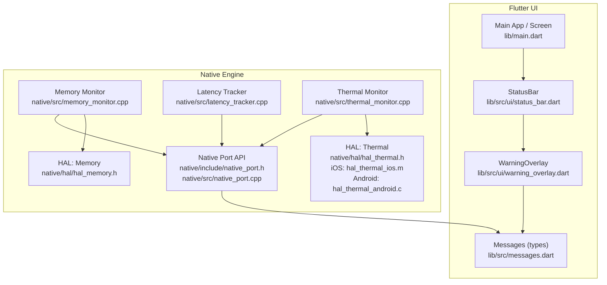
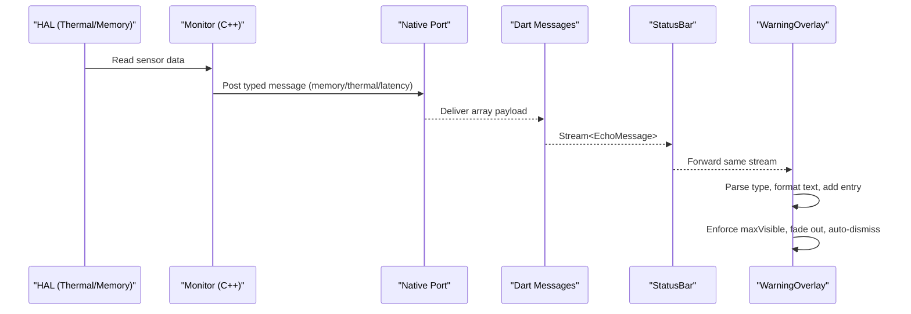
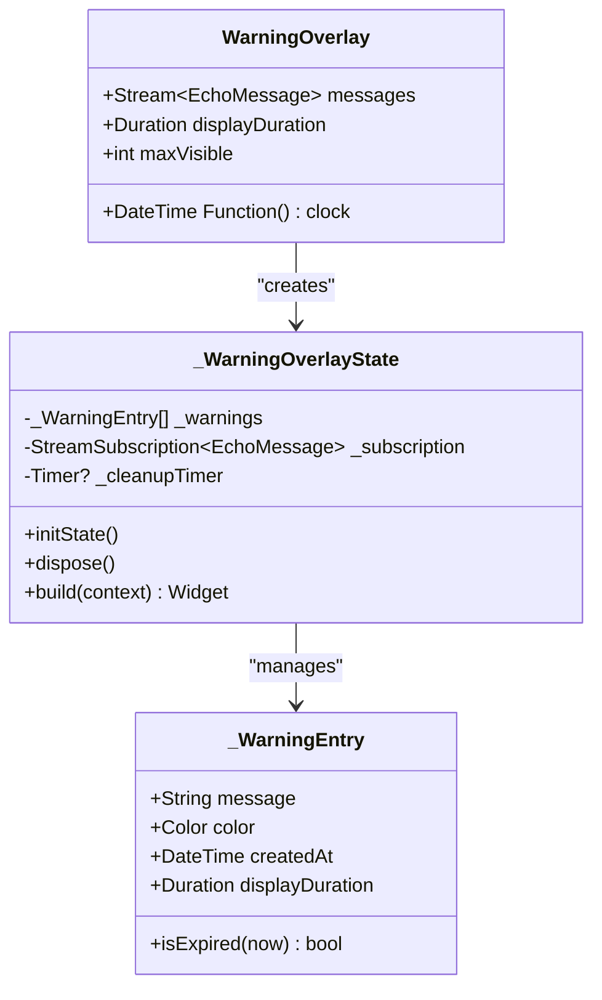
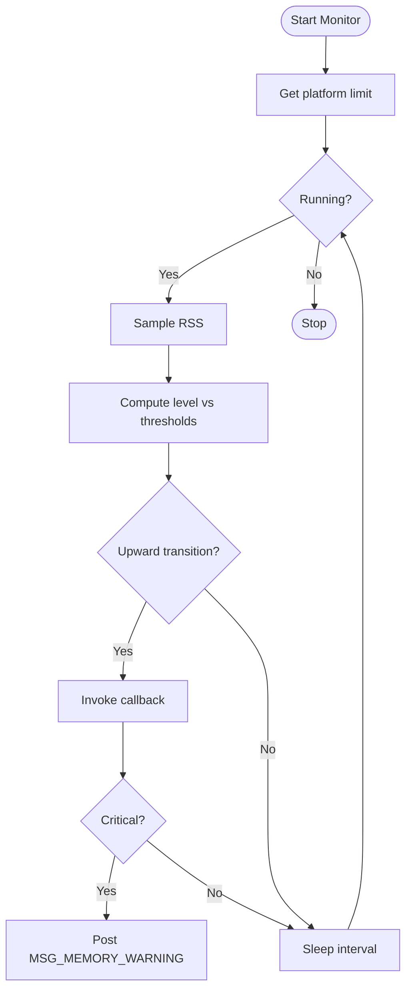
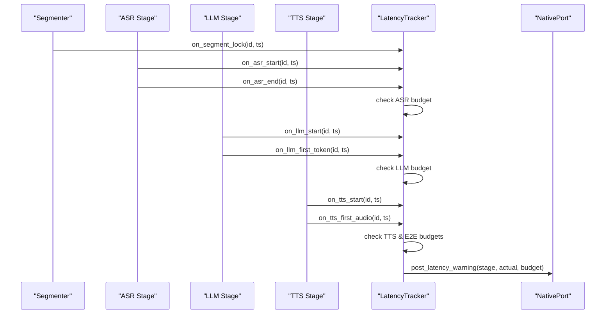
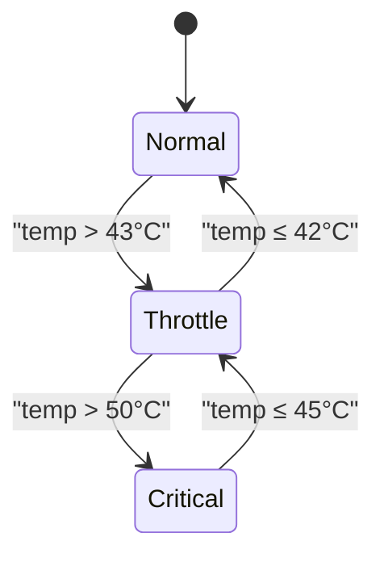
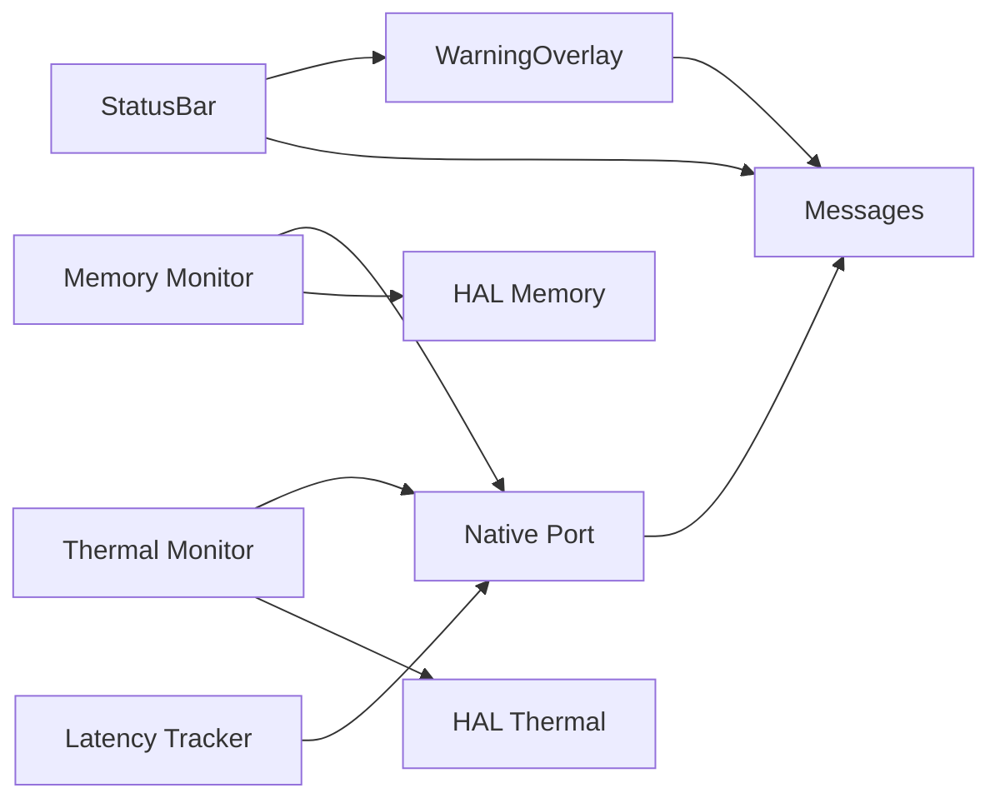

# Warning Overlay System

<cite>
**Referenced Files in This Document**
- [warning_overlay.dart](file://lib/src/ui/warning_overlay.dart)
- [messages.dart](file://lib/src/messages.dart)
- [status_bar.dart](file://lib/src/ui/status_bar.dart)
- [main.dart](file://lib/main.dart)
- [qwen_echo.dart](file://lib/qwen_echo.dart)
- [native_port.h](file://native/include/native_port.h)
- [native_port.cpp](file://native/src/native_port.cpp)
- [memory_monitor.h](file://native/include/memory_monitor.h)
- [memory_monitor.cpp](file://native/src/memory_monitor.cpp)
- [latency_tracker.h](file://native/include/latency_tracker.h)
- [latency_tracker.cpp](file://native/src/latency_tracker.cpp)
- [thermal_monitor.h](file://native/include/thermal_monitor.h)
- [thermal_monitor.cpp](file://native/src/thermal_monitor.cpp)
- [hal_thermal.h](file://native/hal/hal_thermal.h)
- [hal_thermal_ios.m](file://native/hal/ios/hal_thermal_ios.m)
- [hal_thermal_android.c](file://native/hal/android/hal_thermal_android.c)
- [hal_memory.h](file://native/hal/hal_memory.h)
- [pipeline_controller.cpp](file://native/src/pipeline_controller.cpp)
- [warning_overlay_test.dart](file://test/ui/warning_overlay_test.dart)
</cite>

## Table of Contents
1. Introduction
2. Project Structure
3. Core Components
4. Architecture Overview
5. Detailed Component Analysis
6. Dependency Analysis
7. Performance Considerations
8. Troubleshooting Guide
9. Conclusion
10. Appendices

## Introduction
This document explains the WarningOverlay system that surfaces transient, auto-dismissing warnings for memory pressure and latency SLA violations. It covers overlay positioning, animation transitions, dismissal behavior, integration with native monitoring subsystems (memory, thermal, latency), warning types and visuals, programmatic triggering, customization, user acknowledgment flows, accessibility considerations, multi-language support, and platform-specific behaviors on iOS and Android.

## Project Structure
The WarningOverlay is a Flutter widget that subscribes to a stream of typed messages from the native engine. It renders transient banners within a Stack overlay. The StatusBar integrates the WarningOverlay and shows persistent offline and thermal indicators. Native components monitor memory and thermal conditions and track latency; they post structured messages via the Native Port to the UI layer.

**Diagram sources**
- [warning_overlay.dart:1-200](file://lib/src/ui/warning_overlay.dart#L1-L200)
- [status_bar.dart:1-181](file://lib/src/ui/status_bar.dart#L1-L181)
- [messages.dart:1-336](file://lib/src/messages.dart#L1-L336)
- [main.dart:1-154](file://lib/main.dart#L1-L154)
- [memory_monitor.cpp:47-186](file://native/src/memory_monitor.cpp#L47-L186)
- [latency_tracker.cpp:1-130](file://native/src/latency_tracker.cpp#L1-L130)
- [thermal_monitor.cpp:41-189](file://native/src/thermal_monitor.cpp#L41-L189)
- [native_port.h:1-179](file://native/include/native_port.h#L1-L179)
- [native_port.cpp:241-281](file://native/src/native_port.cpp#L241-L281)
- [hal_thermal.h:1-52](file://native/hal/hal_thermal.h#L1-L52)
- [hal_thermal_ios.m:1-53](file://native/hal/ios/hal_thermal_ios.m#L1-L53)
- [hal_thermal_android.c:67-142](file://native/hal/android/hal_thermal_android.c#L67-L142)
- [hal_memory.h:1-43](file://native/hal/hal_memory.h#L1-L43)

**Section sources**
- [warning_overlay.dart:1-200](file://lib/src/ui/warning_overlay.dart#L1-L200)
- [status_bar.dart:1-181](file://lib/src/ui/status_bar.dart#L1-L181)
- [messages.dart:1-336](file://lib/src/messages.dart#L1-L336)
- [main.dart:1-154](file://lib/main.dart#L1-L154)

## Core Components
- WarningOverlay: Stateless entry point and stateful rendering of transient warnings. It listens to a Stream<EchoMessage>, maintains an internal list of entries with creation timestamps, enforces a maximum visible count, and auto-dismisses entries after a configurable duration using a periodic cleanup timer.
- Messages: Typed message classes for memory warnings, latency warnings, thermal state, and others. They include parsing from raw lists and helper properties (e.g., usage percentage).
- StatusBar: Hosts the WarningOverlay and displays persistent offline badge and thermal mode indicator.
- Native Port: Serializes and posts typed messages from native code to Dart via a registered port.
- Memory Monitor: Polls process RSS, compares against thresholds, and posts memory warnings at critical level.
- Latency Tracker: Records stage boundaries per segment, checks budgets, and posts latency warnings when exceeded.
- Thermal Monitor: Polls temperature via HAL, evaluates a state machine, and posts thermal state changes.

Key responsibilities:
- Pure UI logic in WarningOverlay (no AI processing).
- Clear separation between monitoring (native) and presentation (Flutter).
- Auto-dismissal and bounded visibility to avoid clutter.

**Section sources**
- [warning_overlay.dart:1-200](file://lib/src/ui/warning_overlay.dart#L1-L200)
- [messages.dart:1-336](file://lib/src/messages.dart#L1-L336)
- [status_bar.dart:1-181](file://lib/src/ui/status_bar.dart#L1-L181)
- [native_port.h:1-179](file://native/include/native_port.h#L1-L179)
- [native_port.cpp:241-281](file://native/src/native_port.cpp#L241-L281)
- [memory_monitor.h:44-81](file://native/include/memory_monitor.h#L44-L81)
- [memory_monitor.cpp:47-186](file://native/src/memory_monitor.cpp#L47-L186)
- [latency_tracker.h:1-224](file://native/include/latency_tracker.h#L1-L224)
- [latency_tracker.cpp:1-130](file://native/src/latency_tracker.cpp#L1-L130)
- [thermal_monitor.h:43-82](file://native/include/thermal_monitor.h#L43-L82)
- [thermal_monitor.cpp:41-189](file://native/src/thermal_monitor.cpp#L41-L189)

## Architecture Overview
End-to-end flow from hardware sensors to UI overlays:

**Diagram sources**
- [hal_thermal.h:1-52](file://native/hal/hal_thermal.h#L1-L52)
- [hal_memory.h:1-43](file://native/hal/hal_memory.h#L1-L43)
- [memory_monitor.cpp:47-186](file://native/src/memory_monitor.cpp#L47-L186)
- [latency_tracker.cpp:1-130](file://native/src/latency_tracker.cpp#L1-L130)
- [thermal_monitor.cpp:41-189](file://native/src/thermal_monitor.cpp#L41-L189)
- [native_port.cpp:241-281](file://native/src/native_port.cpp#L241-L281)
- [messages.dart:1-336](file://lib/src/messages.dart#L1-L336)
- [status_bar.dart:1-181](file://lib/src/ui/status_bar.dart#L1-L181)
- [warning_overlay.dart:1-200](file://lib/src/ui/warning_overlay.dart#L1-L200)

## Detailed Component Analysis

### WarningOverlay Widget
Responsibilities:
- Listen to EchoMessage stream.
- Convert specific messages into _WarningEntry items with color, formatted message, creation time, and display duration.
- Render a stacked column of banners with opacity-based fade-out near expiration.
- Enforce maxVisible by dropping oldest entries when limit reached.
- Periodically remove expired entries using a Timer.

Positioning and layout:
- Positioned below the status bar area using top offset based on MediaQuery padding plus a fixed margin.
- Left/right margins create horizontal spacing; Column stacks entries vertically.

Animation and dismissal:
- Opacity computed from remaining display time; smoothly fades during last second before removal.
- Auto-dismiss after displayDuration; periodic cleanup removes expired entries.

Dismissible alert patterns:
- Currently non-interactive; relies on auto-dismiss. If interactive dismissal is needed, wrap each banner with a gesture detector or InkWell and remove the entry on tap.

Customization points:
- displayDuration controls how long each warning remains visible.
- maxVisible caps concurrent warnings.
- clock injection enables deterministic testing and controlled animations.

Accessibility:
- Use semantic labels for screen readers if adding interactive dismiss actions.
- Ensure sufficient contrast for text and borders.

Multi-language support:
- Format strings are currently hardcoded. For localization, extract messages and use a localization delegate.

Platform-specific behaviors:
- Uses Flutter’s MediaQuery for safe area insets; consistent across iOS and Android.

**Diagram sources**
- [warning_overlay.dart:1-200](file://lib/src/ui/warning_overlay.dart#L1-L200)

**Section sources**
- [warning_overlay.dart:1-200](file://lib/src/ui/warning_overlay.dart#L1-L200)
- [warning_overlay_test.dart:1-200](file://test/ui/warning_overlay_test.dart#L1-L200)

### Message Types and Formatting
Supported warning types:
- MemoryWarningMessage: currentBytes, limitBytes, level. Usage percent derived from bytes.
- LatencyWarningMessage: stage, actualMs, budgetMs.
- ThermalStateMessage: thermalMode, temperatureC (used by StatusBar, not displayed as warnings).

Formatting:
- Memory warnings include percentage and critical label for high levels.
- Latency warnings include stage name, actual vs budget values.

Localization:
- Extract strings for “Memory warning”, “CRITICAL”, and stage labels to support multiple languages.

**Section sources**
- [messages.dart:258-313](file://lib/src/messages.dart#L258-L313)
- [messages.dart:226-256](file://lib/src/messages.dart#L226-L256)

### StatusBar Integration
- Subscribes to the same message stream and updates thermal mode indicator.
- Embeds WarningOverlay in a Stack so warnings appear above content but below the persistent status row.

**Section sources**
- [status_bar.dart:1-181](file://lib/src/ui/status_bar.dart#L1-L181)
- [main.dart:117-154](file://lib/main.dart#L117-L154)

### Native Monitoring and Messaging

#### Memory Monitoring
- Polls RSS every ~2 seconds and compares against thresholds (85% warning, 95% critical).
- On critical level, posts MSG_MEMORY_WARNING via Native Port.
- Platform limits defined in HAL.

**Diagram sources**
- [memory_monitor.cpp:47-186](file://native/src/memory_monitor.cpp#L47-L186)
- [hal_memory.h:1-43](file://native/hal/hal_memory.h#L1-L43)

**Section sources**
- [memory_monitor.h:44-81](file://native/include/memory_monitor.h#L44-L81)
- [memory_monitor.cpp:47-186](file://native/src/memory_monitor.cpp#L47-L186)
- [hal_memory.h:1-43](file://native/hal/hal_memory.h#L1-L43)

#### Latency Tracking
- Maintains per-segment records and checks stage budgets (ASR ≤200ms, LLM ≤450ms, TTS ≤100ms) and total E2E budgets (Normal 800ms, Throttle 1200ms).
- Posts MSG_LATENCY_WARNING when any budget is exceeded.

**Diagram sources**
- [latency_tracker.h:1-224](file://native/include/latency_tracker.h#L1-L224)
- [latency_tracker.cpp:1-130](file://native/src/latency_tracker.cpp#L1-L130)
- [native_port.h:162-166](file://native/include/native_port.h#L162-L166)

**Section sources**
- [latency_tracker.h:1-224](file://native/include/latency_tracker.h#L1-L224)
- [latency_tracker.cpp:1-130](file://native/src/latency_tracker.cpp#L1-L130)

#### Thermal Monitoring
- Polls temperature via HAL and evaluates a state machine (Normal ↔ Throttle ↔ Critical).
- Posts MSG_THERMAL_STATE on transitions.
- Pipeline controller reacts to thermal mode changes and adjusts budgets.

**Diagram sources**
- [thermal_monitor.cpp:59-92](file://native/src/thermal_monitor.cpp#L59-L92)
- [pipeline_controller.cpp:141-177](file://native/src/pipeline_controller.cpp#L141-L177)

**Section sources**
- [thermal_monitor.h:43-82](file://native/include/thermal_monitor.h#L43-L82)
- [thermal_monitor.cpp:41-189](file://native/src/thermal_monitor.cpp#L41-L189)
- [hal_thermal.h:1-52](file://native/hal/hal_thermal.h#L1-L52)
- [hal_thermal_ios.m:1-53](file://native/hal/ios/hal_thermal_ios.m#L1-L53)
- [hal_thermal_android.c:67-142](file://native/hal/android/hal_thermal_android.c#L67-L142)
- [pipeline_controller.cpp:141-177](file://native/src/pipeline_controller.cpp#L141-L177)

### Warning Types and Visual Representations
- Memory pressure:
  - Level 1 (warning): Shows usage percentage.
  - Level 2 (critical): Prominent “CRITICAL” label indicating potential pipeline stoppage.
- Latency spikes:
  - Displays stage name, actual latency, and budget.
- Thermal throttling:
  - Not shown as a transient warning; reflected in the persistent thermal indicator in StatusBar.

Colors and icons:
- Each warning uses a color and a warning icon; background tint and border alpha provide emphasis without overwhelming the UI.

**Section sources**
- [warning_overlay.dart:131-141](file://lib/src/ui/warning_overlay.dart#L131-L141)
- [warning_overlay.dart:168-196](file://lib/src/ui/warning_overlay.dart#L168-L196)
- [status_bar.dart:19-54](file://lib/src/ui/status_bar.dart#L19-L54)

### Programmatic Triggering Examples
- From tests, you can push messages directly onto the stream to simulate events:
  - MemoryWarningMessage with different levels.
  - LatencyWarningMessage with varying stages and budgets.
- In production, these messages originate from native monitors and are delivered via the Native Port.

**Section sources**
- [warning_overlay_test.dart:28-104](file://test/ui/warning_overlay_test.dart#L28-L104)
- [native_port.cpp:241-281](file://native/src/native_port.cpp#L241-L281)

### Customizing Appearance
- Adjust displayDuration to control visibility length.
- Change maxVisible to cap concurrent warnings.
- Modify colors and styles in the build method to match app theme.
- Replace default icon or add additional visual cues (e.g., severity stripes).

**Section sources**
- [warning_overlay.dart:51-63](file://lib/src/ui/warning_overlay.dart#L51-L63)
- [warning_overlay.dart:168-196](file://lib/src/ui/warning_overlay.dart#L168-L196)

### User Acknowledgment Flows
- Current implementation is non-interactive and auto-dismisses.
- To implement acknowledgment:
  - Wrap each banner with a gesture handler to remove the entry on tap.
  - Optionally show a brief confirmation or log acknowledgment.
  - Ensure accessibility semantics for touch targets and announcements.

[No sources needed since this section proposes enhancements beyond current implementation]

### Accessibility Considerations
- Provide accessible labels for warning banners if made interactive.
- Maintain sufficient color contrast for text and borders.
- Ensure focus order and keyboard navigation if applicable.
- Announce new warnings via accessibility APIs when appropriate.

[No sources needed since this section provides general guidance]

### Multi-Language Support
- Localize all user-facing strings (e.g., “Memory warning”, “CRITICAL”, stage names).
- Use a localization delegate and pluralization rules where necessary.
- Avoid hardcoding numbers in messages; prefer formatting helpers.

[No sources needed since this section provides general guidance]

### Platform-Specific Behaviors (iOS and Android)
- Thermal HAL:
  - iOS maps ProcessInfo thermal states to approximate Celsius values.
  - Android uses AThermal API with sysfs fallback.
- Memory HAL:
  - Provides RSS and platform-specific limits.
- UI overlay:
  - Uses Flutter’s MediaQuery for safe areas; consistent across platforms.

**Section sources**
- [hal_thermal_ios.m:1-53](file://native/hal/ios/hal_thermal_ios.m#L1-L53)
- [hal_thermal_android.c:67-142](file://native/hal/android/hal_thermal_android.c#L67-L142)
- [hal_memory.h:1-43](file://native/hal/hal_memory.h#L1-L43)
- [warning_overlay.dart:147-151](file://lib/src/ui/warning_overlay.dart#L147-L151)

## Dependency Analysis
High-level dependencies:
- WarningOverlay depends on messages.dart for typed messages.
- StatusBar composes WarningOverlay and also consumes messages.
- Native monitors depend on HAL interfaces and post via Native Port.
- Native Port serializes messages and delivers them to Dart.

**Diagram sources**
- [warning_overlay.dart:1-200](file://lib/src/ui/warning_overlay.dart#L1-L200)
- [status_bar.dart:1-181](file://lib/src/ui/status_bar.dart#L1-L181)
- [messages.dart:1-336](file://lib/src/messages.dart#L1-L336)
- [memory_monitor.cpp:47-186](file://native/src/memory_monitor.cpp#L47-L186)
- [latency_tracker.cpp:1-130](file://native/src/latency_tracker.cpp#L1-L130)
- [thermal_monitor.cpp:41-189](file://native/src/thermal_monitor.cpp#L41-L189)
- [native_port.cpp:241-281](file://native/src/native_port.cpp#L241-L281)
- [hal_thermal.h:1-52](file://native/hal/hal_thermal.h#L1-L52)
- [hal_memory.h:1-43](file://native/hal/hal_memory.h#L1-L43)

**Section sources**
- [qwen_echo.dart:1-16](file://lib/qwen_echo.dart#L1-L16)
- [main.dart:1-154](file://lib/main.dart#L1-L154)

## Performance Considerations
- Keep displayDuration short enough to avoid clutter but long enough to be read.
- Limit maxVisible to prevent excessive reflows.
- Use a periodic cleanup timer with a reasonable interval (e.g., 1 second) to balance responsiveness and overhead.
- Avoid heavy operations in message handlers; keep formatting minimal.
- Ensure native monitors run at low priority to avoid impacting real-time audio paths.

[No sources needed since this section provides general guidance]

## Troubleshooting Guide
Common issues and resolutions:
- Warnings not appearing:
  - Verify Native Port registration and message delivery.
  - Confirm message types are being parsed correctly in messages.dart.
- Too many warnings:
  - Reduce displayDuration or maxVisible.
- Auto-dismiss not working:
  - Check clock injection in tests; ensure periodic cleanup runs.
- Incorrect percentages or budgets:
  - Validate thresholds in memory monitor and latency tracker constants.

**Section sources**
- [warning_overlay_test.dart:140-173](file://test/ui/warning_overlay_test.dart#L140-L173)
- [memory_monitor.cpp:47-186](file://native/src/memory_monitor.cpp#L47-L186)
- [latency_tracker.h:34-49](file://native/include/latency_tracker.h#L34-L49)

## Conclusion
The WarningOverlay system provides a lightweight, testable, and extensible mechanism for surfacing performance-related warnings. It cleanly separates monitoring logic in native code from presentation in Flutter, supports auto-dismissal and bounded visibility, and integrates seamlessly with memory, thermal, and latency tracking subsystems. With minor enhancements, it can support interactive acknowledgment, localization, and richer accessibility features while maintaining strong performance characteristics.

## Appendices

### Quick Reference: Key Parameters
- displayDuration: Duration each warning stays visible before auto-dismiss.
- maxVisible: Maximum number of concurrent warnings shown.
- clock: Injected function for current time (useful for testing).

**Section sources**
- [warning_overlay.dart:51-63](file://lib/src/ui/warning_overlay.dart#L51-L63)