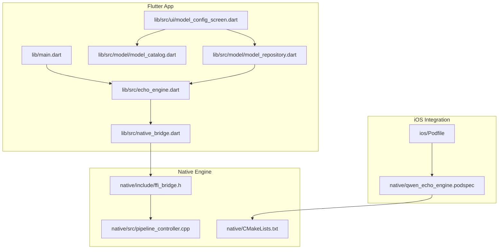
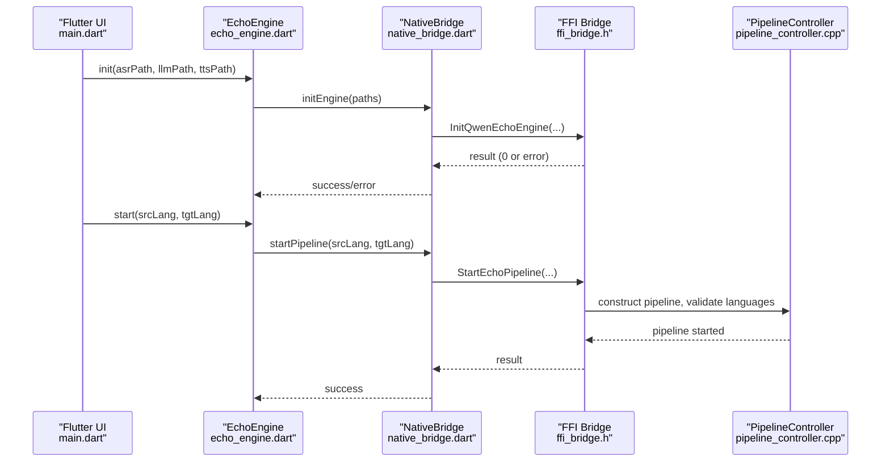
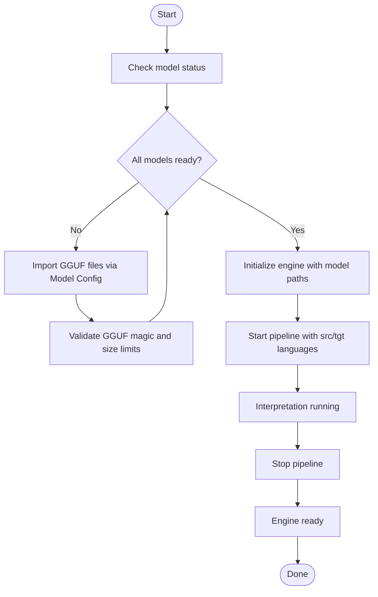
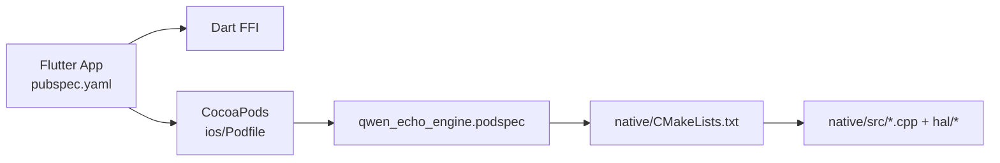

# Getting Started

<cite>
**Referenced Files in This Document**
- [README.md](file://README.md)
- [pubspec.yaml](file://pubspec.yaml)
- [native/CMakeLists.txt](file://native/CMakeLists.txt)
- [ios/Podfile](file://ios/Podfile)
- [native/qwen_echo_engine.podspec](file://native/qwen_echo_engine.podspec)
- [lib/main.dart](file://lib/main.dart)
- [lib/src/echo_engine.dart](file://lib/src/echo_engine.dart)
- [lib/src/native_bridge.dart](file://lib/src/native_bridge.dart)
- [lib/src/ui/model_config_screen.dart](file://lib/src/ui/model_config_screen.dart)
- [lib/src/model/model_catalog.dart](file://lib/src/model/model_catalog.dart)
- [lib/src/model/model_repository.dart](file://lib/src/model/model_repository.dart)
- [native/include/ffi_bridge.h](file://native/include/ffi_bridge.h)
- [native/src/pipeline_controller.cpp](file://native/src/pipeline_controller.cpp)
</cite>

## Table of Contents
1. Introduction
2. Project Structure
3. Core Components
4. Architecture Overview
5. Detailed Component Analysis
6. Dependency Analysis
7. Performance Considerations
8. Troubleshooting Guide
9. Conclusion

## Introduction
QwenEcho is an on-device, air-gapped simultaneous interpretation app that runs three AI models entirely offline on mobile hardware. It provides real-time bilateral translation between two speakers in a face-to-face setting: each person sees their own speech transcribed and hears/reads the translation from the other speaker. The app uses GGUF/INT4 quantized models for ASR (FunASR-Nano), LLM (Qwen3-4B-Instruct), and TTS (Qwen3-TTS-Streaming).

## Project Structure
The project consists of:
- Flutter UI shell (Dart) with FFI bindings and model provisioning UI
- C/C++ native engine with platform abstraction layer (HAL) for Android/iOS
- iOS CocoaPods integration to build the static native library into the Runner binary
- Build configuration for both native engine (CMake) and Flutter app

**Diagram sources**
- [lib/main.dart:1-154](file://lib/main.dart#L1-L154)
- [lib/src/echo_engine.dart:1-108](file://lib/src/echo_engine.dart#L1-L108)
- [lib/src/native_bridge.dart:132-175](file://lib/src/native_bridge.dart#L132-L175)
- [lib/src/ui/model_config_screen.dart:1-337](file://lib/src/ui/model_config_screen.dart#L1-L337)
- [lib/src/model/model_catalog.dart:1-80](file://lib/src/model/model_catalog.dart#L1-L80)
- [lib/src/model/model_repository.dart:1-256](file://lib/src/model/model_repository.dart#L1-L256)
- [native/include/ffi_bridge.h:1-84](file://native/include/ffi_bridge.h#L1-L84)
- [native/src/pipeline_controller.cpp:272-346](file://native/src/pipeline_controller.cpp#L272-L346)
- [native/CMakeLists.txt:1-126](file://native/CMakeLists.txt#L1-L126)
- [ios/Podfile:1-45](file://ios/Podfile#L1-L45)
- [native/qwen_echo_engine.podspec:1-50](file://native/qwen_echo_engine.podspec#L1-L50)

**Section sources**
- [README.md:1-189](file://README.md#L1-L189)
- [pubspec.yaml:1-26](file://pubspec.yaml#L1-L26)
- [native/CMakeLists.txt:1-126](file://native/CMakeLists.txt#L1-L126)
- [ios/Podfile:1-45](file://ios/Podfile#L1-L45)
- [native/qwen_echo_engine.podspec:1-50](file://native/qwen_echo_engine.podspec#L1-L50)

## Core Components
- Model catalog defines required GGUF/INT4 artifacts and size ceilings for ASR, LLM, and TTS.
- Model repository manages local provisioning: validates GGUF magic, enforces size limits, streams copy operations, and resolves sandbox paths.
- EchoEngine facade coordinates initialization, start/stop lifecycle, and message routing via Dart FFI.
- Native bridge exposes four C-linkage entry points to Dart and handles UTF-8 string lifetimes.
- Pipeline controller constructs the audio capture → ASR → LLM → TTS pipeline and validates supported language pairs.

Key responsibilities:
- Provisioning: import GGUF files into the app sandbox and validate them.
- Initialization: load models and register the native port.
- Runtime: start/stop pipeline, stream results back to UI.

**Section sources**
- [lib/src/model/model_catalog.dart:1-80](file://lib/src/model/model_catalog.dart#L1-L80)
- [lib/src/model/model_repository.dart:1-256](file://lib/src/model/model_repository.dart#L1-L256)
- [lib/src/echo_engine.dart:1-108](file://lib/src/echo_engine.dart#L1-L108)
- [lib/src/native_bridge.dart:132-175](file://lib/src/native_bridge.dart#L132-L175)
- [native/include/ffi_bridge.h:1-84](file://native/include/ffi_bridge.h#L1-L84)
- [native/src/pipeline_controller.cpp:272-346](file://native/src/pipeline_controller.cpp#L272-L346)

## Architecture Overview
High-level flow: Flutter UI calls EchoEngine, which uses NativeBridge to invoke the native engine via FFI. The native engine builds and runs the interpretation pipeline and sends messages back through a registered Native Port.

**Diagram sources**
- [lib/main.dart:1-154](file://lib/main.dart#L1-L154)
- [lib/src/echo_engine.dart:1-108](file://lib/src/echo_engine.dart#L1-L108)
- [lib/src/native_bridge.dart:132-175](file://lib/src/native_bridge.dart#L132-L175)
- [native/include/ffi_bridge.h:1-84](file://native/include/ffi_bridge.h#L1-L84)
- [native/src/pipeline_controller.cpp:272-346](file://native/src/pipeline_controller.cpp#L272-L346)

## Detailed Component Analysis

### Installation Requirements
- Android: API 30+, arm64-v8a, 4GB+ RAM recommended
- iOS: 16+, arm64, 4GB+ RAM recommended
- Disk space: ~2.6GB total for GGUF/INT4 models
- Build tools: CMake 3.20+, NDK r21+ (Android), Xcode 14+ (iOS), Flutter 3.16+

**Section sources**
- [README.md:95-101](file://README.md#L95-L101)
- [pubspec.yaml:6-8](file://pubspec.yaml#L6-L8)

### Model Provisioning (GGUF/INT4)
Required models and approximate sizes:
- ASR: FunASR-Nano (~150MB)
- LLM: Qwen3-4B-Instruct (~2.2GB)
- TTS: Qwen3-TTS-Streaming (~250MB)

Provisioning steps:
1. Open the app and tap the settings icon to open Model Configuration.
2. For each model, tap Import and select the corresponding .gguf file from device storage.
3. The app validates GGUF magic bytes and enforces maximum file sizes per model.
4. Once all three are ready, you can start interpretation.

Model catalog and repository enforce:
- Exact filenames stored in the app sandbox under models/
- Size ceilings per model
- GGUF magic validation before committing large copies
- Streaming copy with progress updates

**Section sources**
- [README.md:9-13](file://README.md#L9-L13)
- [lib/src/model/model_catalog.dart:54-76](file://lib/src/model/model_catalog.dart#L54-L76)
- [lib/src/ui/model_config_screen.dart:48-73](file://lib/src/ui/model_config_screen.dart#L48-L73)
- [lib/src/model/model_repository.dart:153-211](file://lib/src/model/model_repository.dart#L153-L211)

### Build Instructions

#### Native Engine (CMake)
- Configure and build locally:
  - Create build directory, run cmake with Release type, then build.
- Cross-compile for Android:
  - Provide toolchain file, ABI arm64-v8a, and android-30 platform.

Notes:
- Static library target is created when sources exist.
- Android-specific linker flags ensure compatibility with 16KB page devices.

**Section sources**
- [README.md:104-117](file://README.md#L104-L117)
- [native/CMakeLists.txt:1-68](file://native/CMakeLists.txt#L1-L68)

#### Flutter App
- Install dependencies and build:
  - Run pub get, then build APK for Android or iOS for release.

**Section sources**
- [README.md:119-125](file://README.md#L119-L125)
- [pubspec.yaml:10-18](file://pubspec.yaml#L10-L18)

#### iOS Integration
- Podfile configures iOS 16.0 deployment target and integrates the native engine as a static pod.
- The podspec compiles C/C++ sources and forces loading of symbols for Dart FFI.

**Section sources**
- [ios/Podfile:1-45](file://ios/Podfile#L1-L45)
- [native/qwen_echo_engine.podspec:1-50](file://native/qwen_echo_engine.podspec#L1-L50)

### Initial App Configuration and First Launch
- On first launch, open Model Configuration and import the three GGUF models.
- After all models are ready, return to the main screen.
- The app will initialize the engine with resolved model paths and register the native port.

**Section sources**
- [lib/src/ui/model_config_screen.dart:117-150](file://lib/src/ui/model_config_screen.dart#L117-L150)
- [lib/src/echo_engine.dart:60-75](file://lib/src/echo_engine.dart#L60-L75)

### Language Selection and Basic Usage (Face-to-Face Interpretation)
- Choose source and target languages using ISO 639-1 codes (e.g., zh, en).
- Start the pipeline; the app begins capturing audio and streaming ASR, translation tokens, and TTS events.
- Stop the pipeline when finished; resources are released and the engine returns to ready state.

Supported languages include common codes such as zh, en, ja, ko, fr, de, es, it, pt, ru, ar, hi, vi, th, id, ms, tl, my, km, lo, bn, ta, te, mr, gu, kn, ml, pa, ur, ne, si, tr, pl, uk, cs, sk, hu, ro, bg, hr, sr, sl, el, nl, sv, da, no, fi, et, lv, lt, he.

**Section sources**
- [lib/src/echo_engine.dart:77-98](file://lib/src/echo_engine.dart#L77-L98)
- [native/src/pipeline_controller.cpp:66-73](file://native/src/pipeline_controller.cpp#L66-L73)
- [native/src/pipeline_controller.cpp:272-346](file://native/src/pipeline_controller.cpp#L272-L346)

### End-to-End Setup Flow

**Diagram sources**
- [lib/src/model/model_repository.dart:125-143](file://lib/src/model/model_repository.dart#L125-L143)
- [lib/src/ui/model_config_screen.dart:48-73](file://lib/src/ui/model_config_screen.dart#L48-L73)
- [lib/src/echo_engine.dart:60-98](file://lib/src/echo_engine.dart#L60-L98)

## Dependency Analysis
- Flutter depends on ffi, path_provider, and file_picker for FFI, sandbox access, and file selection.
- iOS integration uses CocoaPods to embed the static native engine into the Runner binary.
- Native engine depends on platform HALs (AAudio/android, AVAudioEngine/ios) and optional accelerators.

**Diagram sources**
- [pubspec.yaml:10-18](file://pubspec.yaml#L10-L18)
- [ios/Podfile:29-38](file://ios/Podfile#L29-L38)
- [native/qwen_echo_engine.podspec:14-42](file://native/qwen_echo_engine.podspec#L14-L42)
- [native/CMakeLists.txt:29-68](file://native/CMakeLists.txt#L29-L68)

**Section sources**
- [pubspec.yaml:10-18](file://pubspec.yaml#L10-L18)
- [ios/Podfile:29-38](file://ios/Podfile#L29-L38)
- [native/qwen_echo_engine.podspec:14-42](file://native/qwen_echo_engine.podspec#L14-L42)
- [native/CMakeLists.txt:29-68](file://native/CMakeLists.txt#L29-L68)

## Performance Considerations
- Target latencies: ASR first-character ≤200ms, LLM first-token ≤450ms, TTS time-to-first-audio ≤100ms, end-to-end ≤800ms (normal), ≤1200ms (throttled).
- Thermal management reduces context and ASR sampling rate at higher temperatures; pipeline pauses at critical temperature.
- Memory budgets trigger cache releases and pipeline stop thresholds.

[No sources needed since this section provides general guidance]

## Troubleshooting Guide
Common setup issues and resolutions:
- Missing or invalid GGUF files:
  - Ensure files have correct names and pass GGUF magic validation.
  - Verify file sizes do not exceed per-model ceilings.
- Insufficient disk space:
  - Free up approximately 2.6GB for all three models.
- Platform requirements:
  - Android: API 30+, arm64-v8a; iOS: 16+, arm64.
  - Use Flutter 3.16+, CMake 3.20+, NDK r21+ (Android), Xcode 14+ (iOS).
- iOS build problems:
  - Confirm Podfile targets iOS 16.0 and includes the static engine pod.
  - Ensure use_frameworks! is not enabled so static symbols are available to Dart FFI.
- Unsupported language pair:
  - Use ISO 639-1 codes from the supported list.

**Section sources**
- [README.md:95-101](file://README.md#L95-L101)
- [README.md:104-117](file://README.md#L104-L117)
- [ios/Podfile:1-45](file://ios/Podfile#L1-L45)
- [native/qwen_echo_engine.podspec:36-42](file://native/qwen_echo_engine.podspec#L36-L42)
- [native/src/pipeline_controller.cpp:272-289](file://native/src/pipeline_controller.cpp#L272-L289)

## Conclusion
You now have everything needed to install, provision models, build, and run QwenEcho for face-to-face interpretation. Import the three GGUF/INT4 models, initialize the engine, choose your language pair, and start interpreting. If you encounter issues, consult the troubleshooting guide and verify platform/build requirements.