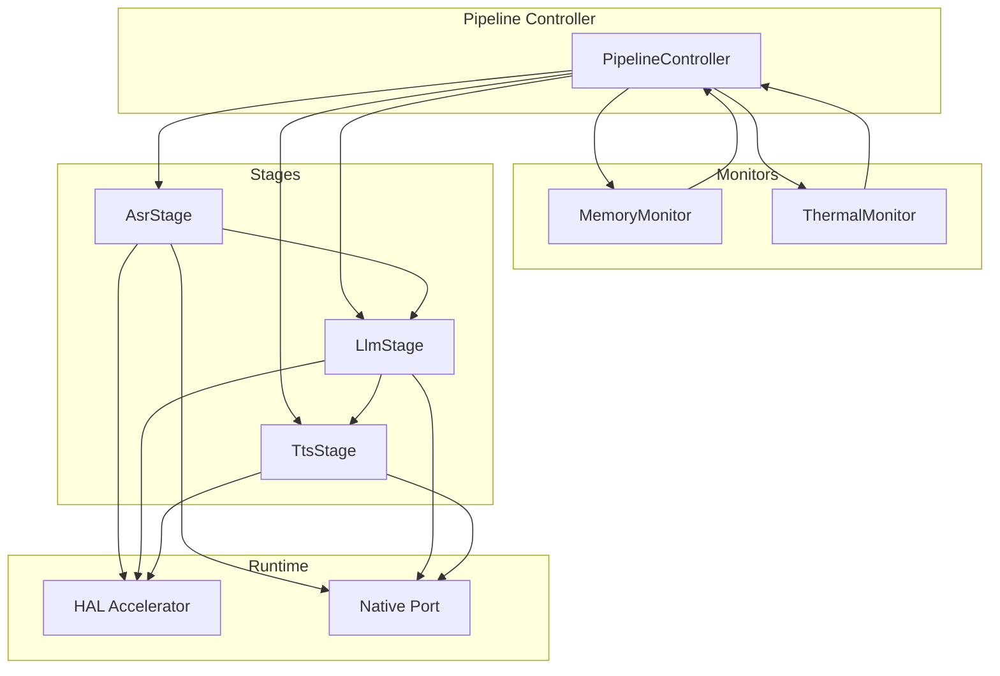
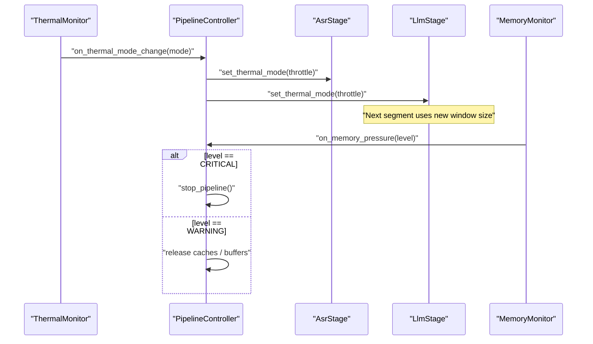
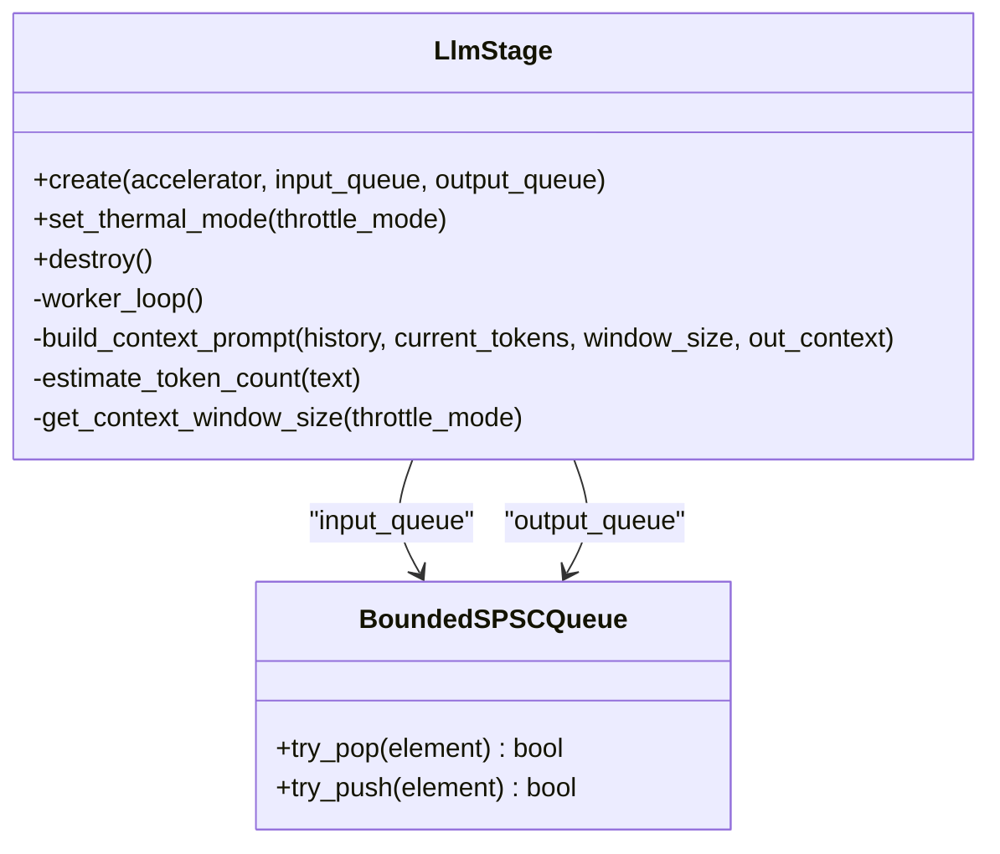
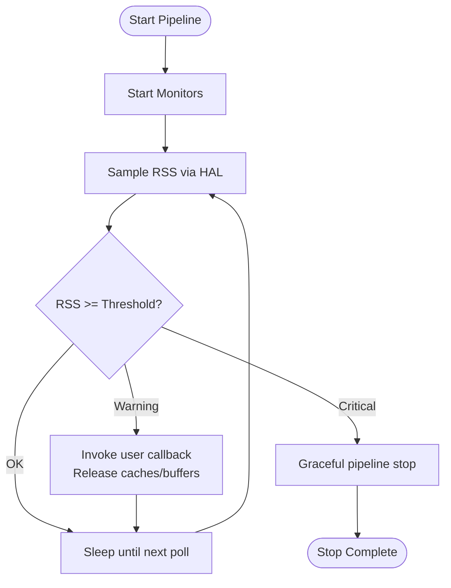
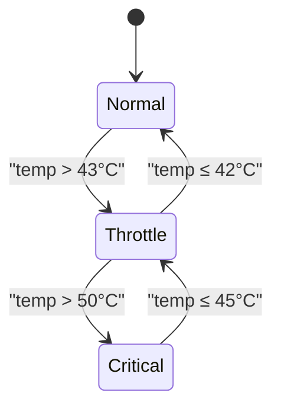
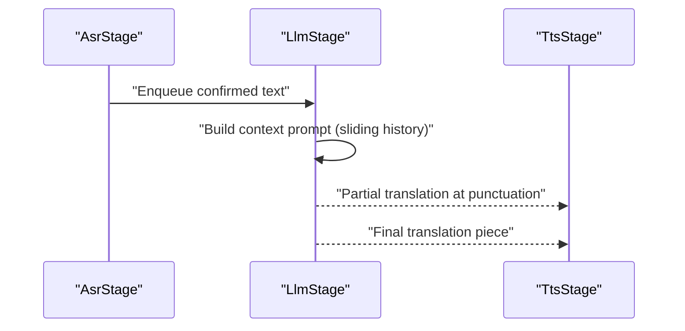
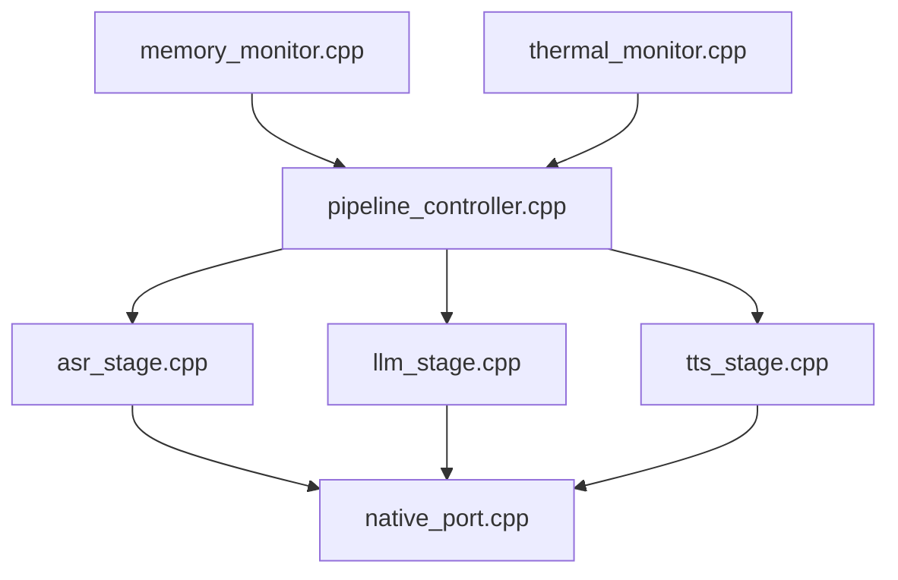

# Context Management

<cite>
**Referenced Files in This Document**
- [memory_monitor.h](file://native/include/memory_monitor.h)
- [memory_monitor.cpp](file://native/src/memory_monitor.cpp)
- [thermal_monitor.h](file://native/include/thermal_monitor.h)
- [thermal_monitor.cpp](file://native/src/thermal_monitor.cpp)
- [engine_manager.h](file://native/include/engine_manager.h)
- [engine_manager.cpp](file://native/src/engine_manager.cpp)
- [pipeline_controller.h](file://native/include/pipeline_controller.h)
- [pipeline_controller.cpp](file://native/src/pipeline_controller.cpp)
- [asr_stage.h](file://native/include/asr_stage.h)
- [asr_stage.cpp](file://native/src/asr_stage.cpp)
- [llm_stage.h](file://native/include/llm_stage.h)
- [llm_stage.cpp](file://native/src/llm_stage.cpp)
- [tts_stage.h](file://native/include/tts_stage.h)
- [tts_stage.cpp](file://native/src/tts_stage.cpp)
- [native_port.cpp](file://native/src/native_port.cpp)
</cite>

## Table of Contents
1. [Introduction](#introduction)
2. [Project Structure](#project-structure)
3. [Core Components](#core-components)
4. [Architecture Overview](#architecture-overview)
5. [Detailed Component Analysis](#detailed-component-analysis)
6. [Dependency Analysis](#dependency-analysis)
7. [Performance Considerations](#performance-considerations)
8. [Troubleshooting Guide](#troubleshooting-guide)
9. [Conclusion](#conclusion)

## Introduction
This document explains the dynamic context window management system in QwenEcho, focusing on how inference contexts are adjusted based on available memory, thermal state, and performance requirements. It covers the full lifecycle of context for each model type (ASR, LLM, TTS), including creation, configuration, and destruction. It also details memory budget enforcement mechanisms, automatic context resizing strategies, examples of configuration parameters, performance monitoring integration, adaptive scaling based on device capabilities, context sharing between processing stages, and memory pressure response strategies.

## Project Structure
QwenEcho’s native layer implements a streaming audio pipeline with three processing stages: ASR → LLM → TTS. Context management is primarily implemented within the LLM stage as a sliding context window that adapts to thermal mode. Memory and thermal monitors provide system-level signals that drive adaptation across stages. The Pipeline Controller orchestrates component lifecycle and wiring, while the Engine Manager controls high-level engine state and session boundaries.

**Diagram sources**
- [pipeline_controller.cpp:272-393](file://native/src/pipeline_controller.cpp#L272-L393)
- [memory_monitor.cpp:59-116](file://native/src/memory_monitor.cpp#L59-L116)
- [thermal_monitor.cpp:99-128](file://native/src/thermal_monitor.cpp#L99-L128)
- [asr_stage.cpp:167-271](file://native/src/asr_stage.cpp#L167-L271)
- [llm_stage.cpp:243-361](file://native/src/llm_stage.cpp#L243-L361)
- [tts_stage.cpp:191-272](file://native/src/tts_stage.cpp#L191-L272)
- [native_port.cpp:247-300](file://native/src/native_port.cpp#L247-L300)

**Section sources**
- [pipeline_controller.h:1-107](file://native/include/pipeline_controller.h#L1-L107)
- [engine_manager.h:1-104](file://native/include/engine_manager.h#L1-L104)

## Core Components
- Memory Monitor: Periodically samples process RSS via HAL and triggers two-level mitigation when usage approaches platform limits. Level 1 (warning) prompts cache/buffer release; Level 2 (critical) triggers graceful pipeline stop and UI notification.
- Thermal Monitor: Polls hardware temperature and drives a three-mode state machine with hysteresis. On transitions, it notifies the UI and invokes callbacks for engine adaptation.
- Pipeline Controller: Orchestrates creation, startup, and graceful shutdown of all pipeline components. It wires inter-stage queues and registers monitor callbacks to adapt behavior at runtime.
- Stages:
  - ASR Stage: Processes locked audio segments, streams partial tokens, enqueues confirmed text to LLM. Adapts sampling rate under thermal throttle.
  - LLM Stage: Maintains a sliding context window over recent translations, adjusts window size based on thermal mode, and performs cascade truncation to downstream TTS.
  - TTS Stage: Synthesizes speech from translated text, enforces TTFA SLA, and outputs PCM chunks.

Key responsibilities relevant to context management:
- LLM stage owns the dynamic context window and applies thermal-driven resizing.
- Pipeline controller propagates thermal mode changes to ASR and LLM stages.
- Memory monitor can trigger pipeline stop on critical memory pressure.

**Section sources**
- [memory_monitor.h:1-108](file://native/include/memory_monitor.h#L1-L108)
- [memory_monitor.cpp:1-187](file://native/src/memory_monitor.cpp#L1-L187)
- [thermal_monitor.h:1-109](file://native/include/thermal_monitor.h#L1-L109)
- [thermal_monitor.cpp:1-190](file://native/src/thermal_monitor.cpp#L1-L190)
- [pipeline_controller.cpp:134-177](file://native/src/pipeline_controller.cpp#L134-L177)
- [asr_stage.h:1-104](file://native/include/asr_stage.h#L1-L104)
- [llm_stage.h:1-93](file://native/include/llm_stage.h#L1-L93)
- [tts_stage.h:1-79](file://native/include/tts_stage.h#L1-L79)

## Architecture Overview
The dynamic context window is managed by the LLM stage and adapted by system monitors:
- Thermal Monitor evaluates temperature and transitions modes with hysteresis. Mode changes propagate to ASR and LLM stages via Pipeline Controller callbacks.
- LLM stage selects context window size based on current thermal mode and freezes the chosen window for the duration of an ongoing translation segment.
- Memory Monitor observes RSS against platform limits and can initiate graceful pipeline stop at critical levels.

**Diagram sources**
- [thermal_monitor.cpp:99-128](file://native/src/thermal_monitor.cpp#L99-L128)
- [pipeline_controller.cpp:145-177](file://native/src/pipeline_controller.cpp#L145-L177)
- [asr_stage.h:82-87](file://native/include/asr_stage.h#L82-L87)
- [llm_stage.h:68-76](file://native/include/llm_stage.h#L68-L76)
- [memory_monitor.cpp:59-116](file://native/src/memory_monitor.cpp#L59-L116)

## Detailed Component Analysis

### LLM Stage Context Window Lifecycle
The LLM stage maintains a sliding context window of previous translations and dynamically resizes it according to thermal mode.

- Creation:
  - Constructed with input/output bounded queues and accelerator context.
  - Initializes internal structures and reserves space for sliding history.
- Configuration:
  - Thermal mode determines active window size: Normal = larger window; Throttle = smaller window.
  - For each incoming ASR confirmation, the stage captures the current thermal mode and freezes the window size for that segment.
  - Builds a context prompt by prepending up to a fixed number of recent translations, truncated oldest-first if total tokens exceed the window limit.
- Processing:
  - Streams translation tokens to UI and applies cascade truncation at punctuation boundaries to enqueue partial results to TTS.
  - Updates sliding history after completion, maintaining a bounded count of entries.
- Destruction:
  - Stops worker thread and joins before freeing resources.

**Diagram sources**
- [llm_stage.cpp:68-87](file://native/src/llm_stage.cpp#L68-L87)
- [llm_stage.cpp:116-156](file://native/src/llm_stage.cpp#L116-L156)
- [llm_stage.cpp:243-361](file://native/src/llm_stage.cpp#L243-L361)
- [llm_stage.h:60-76](file://native/include/llm_stage.h#L60-L76)

**Section sources**
- [llm_stage.h:13-24](file://native/include/llm_stage.h#L13-L24)
- [llm_stage.cpp:43-51](file://native/src/llm_stage.cpp#L43-L51)
- [llm_stage.cpp:107-109](file://native/src/llm_stage.cpp#L107-L109)
- [llm_stage.cpp:257-270](file://native/src/llm_stage.cpp#L257-L270)
- [llm_stage.cpp:349-360](file://native/src/llm_stage.cpp#L349-L360)
- [llm_stage.cpp:397-409](file://native/src/llm_stage.cpp#L397-L409)

### ASR Stage Thermal Adaptation
- Thermal mode affects sampling rate: Normal uses 16kHz; Throttle resamples to 8kHz before inference.
- Partial tokens are streamed to UI; confirmed text is enqueued to LLM.
- No explicit context window; however, its output feeds the LLM context.

**Section sources**
- [asr_stage.h:12-16](file://native/include/asr_stage.h#L12-L16)
- [asr_stage.cpp:193-202](file://native/src/asr_stage.cpp#L193-L202)
- [asr_stage.cpp:297-318](file://native/src/asr_stage.cpp#L297-L318)
- [asr_stage.cpp:320-323](file://native/src/asr_stage.cpp#L320-L323)

### TTS Stage Behavior
- Operates independently on its own thread, consuming translated text from LLM→TTS queue.
- Enforces TTFA SLA and reports latency warnings.
- Does not manage context windows but benefits from cascade truncation provided by LLM.

**Section sources**
- [tts_stage.h:12-21](file://native/include/tts_stage.h#L12-L21)
- [tts_stage.cpp:191-272](file://native/src/tts_stage.cpp#L191-L272)

### Memory Budget Enforcement and Automatic Resizing
- Memory Monitor thresholds:
  - Warning (Level 1): ~85% of platform limit — triggers user callback for cache/buffer release.
  - Critical (Level 2): ~95% of platform limit — triggers graceful pipeline stop and UI warning.
- Automatic resizing strategy:
  - LLM stage reduces context window size when thermal mode switches to Throttle.
  - Memory pressure does not directly resize context; instead, it may stop the pipeline to prevent further allocation growth.

**Diagram sources**
- [memory_monitor.cpp:59-116](file://native/src/memory_monitor.cpp#L59-L116)
- [pipeline_controller.cpp:166-177](file://native/src/pipeline_controller.cpp#L166-L177)

**Section sources**
- [memory_monitor.h:25-29](file://native/include/memory_monitor.h#L25-L29)
- [memory_monitor.cpp:47-53](file://native/src/memory_monitor.cpp#L47-L53)
- [memory_monitor.cpp:73-116](file://native/src/memory_monitor.cpp#L73-L116)
- [pipeline_controller.cpp:166-177](file://native/src/pipeline_controller.cpp#L166-L177)

### Thermal State Machine and Adaptive Scaling
- Thermal Monitor state transitions with hysteresis:
  - Normal → Throttle when temp > 43°C
  - Throttle → Normal when temp ≤ 42°C
  - Throttle → Critical when temp > 50°C
  - Critical → Throttle when temp ≤ 45°C
- On transition, Pipeline Controller updates ASR and LLM stages:
  - ASR resampling rate adapts to reduce compute load.
  - LLM context window size adapts to reduce memory footprint.

**Diagram sources**
- [thermal_monitor.cpp:28-35](file://native/src/thermal_monitor.cpp#L28-L35)
- [thermal_monitor.cpp:59-92](file://native/src/thermal_monitor.cpp#L59-L92)
- [pipeline_controller.cpp:145-160](file://native/src/pipeline_controller.cpp#L145-L160)

**Section sources**
- [thermal_monitor.h:26-33](file://native/include/thermal_monitor.h#L26-L33)
- [thermal_monitor.cpp:99-128](file://native/src/thermal_monitor.cpp#L99-L128)
- [pipeline_controller.cpp:145-160](file://native/src/pipeline_controller.cpp#L145-L160)

### Context Sharing Between Stages
- ASR confirms text and enqueues into ASR→LLM queue.
- LLM builds context from sliding history and current input, then enqueues partial/final translations into LLM→TTS queue.
- Cascade truncation allows TTS to start synthesis early at punctuation boundaries, improving perceived latency.

**Diagram sources**
- [asr_stage.cpp:254-269](file://native/src/asr_stage.cpp#L254-L269)
- [llm_stage.cpp:267-274](file://native/src/llm_stage.cpp#L267-L274)
- [llm_stage.cpp:319-341](file://native/src/llm_stage.cpp#L319-L341)

**Section sources**
- [llm_stage.cpp:116-156](file://native/src/llm_stage.cpp#L116-L156)
- [llm_stage.cpp:319-341](file://native/src/llm_stage.cpp#L319-L341)

### Performance Monitoring Integration
- Latency budgets:
  - ASR first-character latency ≤ 200ms
  - LLM first-token latency ≤ 450ms
  - TTS TTFA ≤ 100ms
- Violations are reported via Native Port messages.
- E2E latency budget guidance is documented in Pipeline Controller comments.

**Section sources**
- [asr_stage.cpp:39-40](file://native/src/asr_stage.cpp#L39-L40)
- [asr_stage.cpp:232-242](file://native/src/asr_stage.cpp#L232-L242)
- [llm_stage.cpp:40-41](file://native/src/llm_stage.cpp#L40-L41)
- [llm_stage.cpp:304-317](file://native/src/llm_stage.cpp#L304-L317)
- [tts_stage.cpp:42-43](file://native/src/tts_stage.cpp#L42-L43)
- [tts_stage.cpp:228-236](file://native/src/tts_stage.cpp#L228-L236)
- [pipeline_controller.cpp:24-28](file://native/src/pipeline_controller.cpp#L24-L28)
- [native_port.cpp:283-300](file://native/src/native_port.cpp#L283-L300)

### Examples of Context Configuration Parameters
- LLM context window sizes:
  - Normal mode: larger window
  - Throttle mode: smaller window
- Sliding history count: fixed number of previous translations retained.
- Thermal mode propagation:
  - ASR resampling threshold
  - LLM window selection function

These parameters are defined in the LLM stage implementation and headers.

**Section sources**
- [llm_stage.h:13-24](file://native/include/llm_stage.h#L13-L24)
- [llm_stage.cpp:43-51](file://native/src/llm_stage.cpp#L43-L51)
- [llm_stage.cpp:107-109](file://native/src/llm_stage.cpp#L107-L109)
- [asr_stage.h:82-87](file://native/include/asr_stage.h#L82-L87)

### Memory Pressure Response Strategies
- Level 1 (Warning): User callback invoked to release caches/buffers (e.g., LLM KV caches, TTS output buffers).
- Level 2 (Critical): Graceful pipeline stop initiated by Pipeline Controller; UI notified via Native Port.

**Section sources**
- [memory_monitor.h:5-11](file://native/include/memory_monitor.h#L5-L11)
- [memory_monitor.cpp:94-105](file://native/src/memory_monitor.cpp#L94-L105)
- [pipeline_controller.cpp:166-177](file://native/src/pipeline_controller.cpp#L166-L177)
- [native_port.cpp:264-281](file://native/src/native_port.cpp#L264-L281)

## Dependency Analysis
The following diagram shows key dependencies among core modules involved in context management and adaptation.

**Diagram sources**
- [memory_monitor.cpp:59-116](file://native/src/memory_monitor.cpp#L59-L116)
- [thermal_monitor.cpp:99-128](file://native/src/thermal_monitor.cpp#L99-L128)
- [pipeline_controller.cpp:145-177](file://native/src/pipeline_controller.cpp#L145-L177)
- [asr_stage.cpp:214-242](file://native/src/asr_stage.cpp#L214-L242)
- [llm_stage.cpp:298-317](file://native/src/llm_stage.cpp#L298-L317)
- [tts_stage.cpp:214-236](file://native/src/tts_stage.cpp#L214-L236)
- [native_port.cpp:247-300](file://native/src/native_port.cpp#L247-L300)

**Section sources**
- [engine_manager.cpp:102-141](file://native/src/engine_manager.cpp#L102-L141)
- [pipeline_controller.cpp:272-393](file://native/src/pipeline_controller.cpp#L272-L393)

## Performance Considerations
- Thermal-driven adaptation reduces both compute and memory demands:
  - ASR resampling lowers CPU/GPU workload.
  - LLM context window reduction decreases memory footprint and token processing overhead.
- Cascade truncation improves perceived latency by enabling early TTS synthesis.
- Memory monitoring prevents runaway growth by stopping the pipeline under critical conditions.
- Latency tracking ensures SLA compliance and provides actionable warnings.

[No sources needed since this section provides general guidance]

## Troubleshooting Guide
- If context appears too large or small:
  - Check current thermal mode and verify that Pipeline Controller propagated mode changes to ASR and LLM stages.
  - Confirm LLM stage’s thermal mode setting and ensure segment processing respects frozen window size per segment.
- If pipeline stops unexpectedly:
  - Inspect memory monitor warnings and critical events; review UI notifications and logs.
  - Validate platform memory limit retrieval and thresholds.
- If latency warnings occur:
  - Review per-stage latency measurements and Native Port messages.
  - Consider reducing context window size or adjusting thermal mode.

**Section sources**
- [pipeline_controller.cpp:145-177](file://native/src/pipeline_controller.cpp#L145-L177)
- [llm_stage.cpp:257-270](file://native/src/llm_stage.cpp#L257-L270)
- [memory_monitor.cpp:94-105](file://native/src/memory_monitor.cpp#L94-L105)
- [native_port.cpp:283-300](file://native/src/native_port.cpp#L283-L300)

## Conclusion
QwenEcho’s dynamic context window management integrates thermal and memory monitoring to adapt inference contexts in real time. The LLM stage’s sliding context window scales down under thermal throttling, while memory pressure can trigger graceful pipeline stop to protect system stability. The Pipeline Controller coordinates these adaptations, ensuring consistent behavior across ASR, LLM, and TTS stages. Together, these mechanisms deliver responsive, resource-aware performance suitable for mobile devices.

[No sources needed since this section summarizes without analyzing specific files]