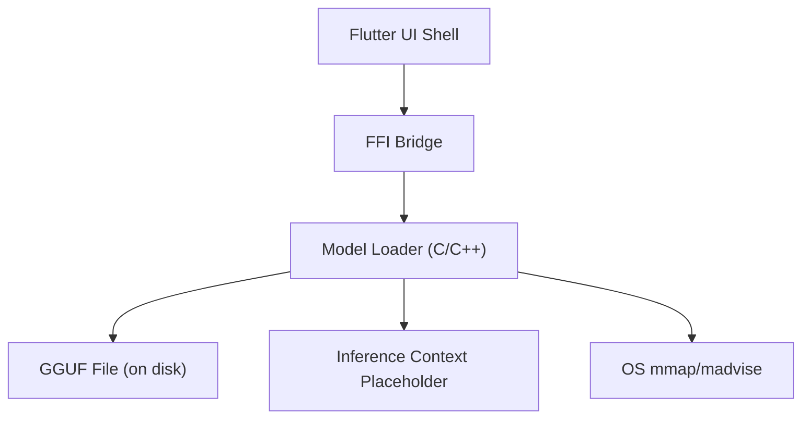
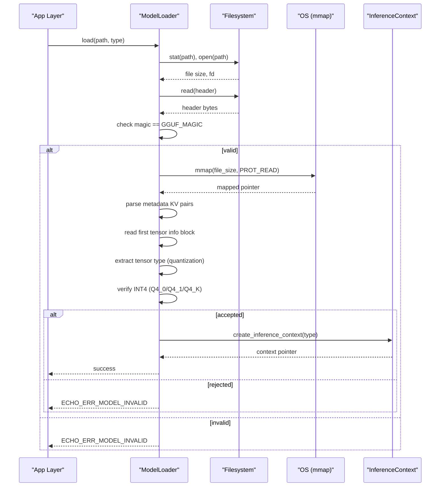
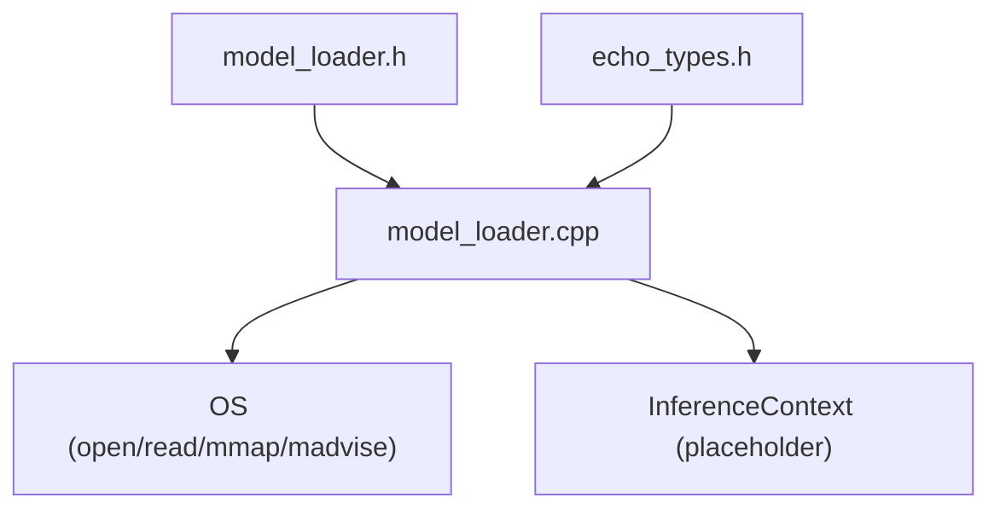

# GGUF Model Format

<cite>
**Referenced Files in This Document**
- [model_loader.h](file://native/include/model_loader.h)
- [model_loader.cpp](file://native/src/model_loader.cpp)
- [echo_types.h](file://native/include/echo_types.h)
- [test_model_loader.cpp](file://native/tests/test_model_loader.cpp)
- [README.md](file://README.md)
</cite>

## Table of Contents
1. [Introduction](#introduction)
2. [Project Structure](#project-structure)
3. [Core Components](#core-components)
4. [Architecture Overview](#architecture-overview)
5. [Detailed Component Analysis](#detailed-component-analysis)
6. [Dependency Analysis](#dependency-analysis)
7. [Performance Considerations](#performance-considerations)
8. [Troubleshooting Guide](#troubleshooting-guide)
9. [Conclusion](#conclusion)

## Introduction
This document explains the GGUF model format as used by QwenEcho, focusing on file structure, header fields, tensor storage layout, metadata key-value pairs, and INT4 quantization formats (Q4_0, Q4_1, Q4_K). It also documents validation procedures for model integrity checking, version compatibility, and quantization type verification, along with examples of parsing, header validation, and error handling for corrupted or incompatible models. Finally, it addresses performance considerations across different quantization levels and their accuracy vs. memory trade-offs.

## Project Structure
The GGUF-related logic is implemented in the native engine layer:
- Header definitions for GGUF magic bytes, quantization types, and header structure are declared in the public interface.
- The loader validates GGUF files, parses minimal metadata to locate the first tensor’s quantization type, memory-maps the file, and creates an inference context placeholder.
- Unit tests construct minimal GGUF binaries to validate behavior and error paths.

[No sources needed since this diagram shows conceptual workflow, not actual code structure]

**Section sources**
- [README.md:1-189](file://README.md#L1-L189)

## Core Components
- GGUF constants and structures:
  - Magic bytes constant for GGUF files.
  - Quantization type enumeration including INT4 variants Q4_0, Q4_1, Q4_K.
  - GGUF v3 header structure containing magic, version, tensor count, and metadata KV count.
- Model loader:
  - Validates file existence and permissions.
  - Reads and checks the GGUF header magic.
  - Parses metadata KV pairs to skip into the tensor info section.
  - Extracts the first tensor’s quantization type and verifies it is an accepted INT4 variant.
  - Memory-maps the file for efficient access and creates a lightweight inference context.
- Error reporting:
  - Uses standardized error codes for missing files, permission issues, invalid format, and memory errors.

**Section sources**
- [model_loader.h:26-60](file://native/include/model_loader.h#L26-L60)
- [model_loader.h:82-135](file://native/include/model_loader.h#L82-L135)
- [model_loader.cpp:46-54](file://native/src/model_loader.cpp#L46-L54)
- [model_loader.cpp:167-235](file://native/src/model_loader.cpp#L167-L235)
- [model_loader.cpp:284-379](file://native/src/model_loader.cpp#L284-L379)
- [echo_types.h:48-62](file://native/include/echo_types.h#L48-L62)

## Architecture Overview
The GGUF loading pipeline integrates with the broader engine lifecycle and platform abstractions.

**Diagram sources**
- [model_loader.cpp:284-379](file://native/src/model_loader.cpp#L284-L379)
- [model_loader.cpp:167-235](file://native/src/model_loader.cpp#L167-L235)
- [model_loader.cpp:241-265](file://native/src/model_loader.cpp#L241-L265)

## Detailed Component Analysis

### GGUF File Structure and Header Fields
- Magic bytes:
  - Defined as a little-endian constant representing “GGUF”.
- Header fields (v3):
  - magic: must match the defined constant.
  - version: supports GGUF v2/v3; implementation expects v3.
  - tensor_count: number of tensors stored in the file.
  - metadata_kv_count: number of key-value pairs preceding tensor descriptors.

These fields are used to validate the file early and to navigate into the metadata and tensor sections.

**Section sources**
- [model_loader.h:26-60](file://native/include/model_loader.h#L26-L60)
- [model_loader.cpp:329-340](file://native/src/model_loader.cpp#L329-L340)

### Metadata Key-Value Pairs
- Each metadata entry consists of:
  - Key length (uint64_t) followed by key bytes.
  - Value type (uint32_t) indicating scalar, string, or array.
  - Value payload:
    - Scalars have fixed sizes per type.
    - Strings include a uint64 length then bytes.
    - Arrays include element type, count, and repeated elements.
- The loader skips all metadata entries to reach the tensor descriptor section.

Parsing helpers:
- Value type enumeration includes integers, floats, booleans, strings, and arrays.
- Size lookup returns 0 for variable-length types (string/array).
- Skip function advances the offset safely with bounds checks.

**Section sources**
- [model_loader.cpp:80-165](file://native/src/model_loader.cpp#L80-L165)

### Tensor Storage Layout
- After metadata, each tensor descriptor contains:
  - name_len (uint64_t) + name bytes.
  - n_dims (uint32_t).
  - dims[n_dims] array of uint64_t dimensions.
  - type (uint32_t) representing the quantization type.
  - offset (uint64_t) pointing to the tensor data region.
- The loader reads the first tensor descriptor to obtain its type for validation.

Note: In production, iterating all tensors would be preferred; the current approach uses the first tensor as representative.

**Section sources**
- [model_loader.cpp:167-235](file://native/src/model_loader.cpp#L167-L235)

### INT4 Quantization Formats (Q4_0, Q4_1, Q4_K)
- Accepted INT4 variants:
  - Q4_0: block-wise INT4 without offset.
  - Q4_1: block-wise INT4 with offset.
  - Q4_K: K-quants family INT4 variant.
- Validation:
  - The loader checks that the first tensor’s type matches one of these three values.
  - Non-INT4 types (e.g., FP16) are rejected.

Memory layout optimizations:
- Block-wise packing reduces memory footprint compared to FP16/FP32.
- Q4_1 adds per-block offsets to improve reconstruction fidelity while retaining compactness.
- Q4_K provides enhanced compression strategies within the K-quants family.

**Section sources**
- [model_loader.h:35-49](file://native/include/model_loader.h#L35-L49)
- [model_loader.cpp:46-54](file://native/src/model_loader.cpp#L46-L54)
- [model_loader.cpp:352-361](file://native/src/model_loader.cpp#L352-L361)

### Validation Procedures
- Integrity checks:
  - File existence and non-zero size.
  - Readability and regular file mode.
  - Header magic equals the GGUF constant.
  - Sufficient file size to contain at least the header.
- Version compatibility:
  - Expects GGUF v3; header version field is present.
- Quantization type verification:
  - Parse metadata KV pairs to reach tensor descriptors.
  - Read first tensor’s type and ensure it is Q4_0, Q4_1, or Q4_K.
- Error categorization:
  - Missing file → specific error code.
  - Permission denied → specific error code.
  - Invalid format (bad magic or unsupported quantization) → specific error code.
  - Memory mapping failure → memory error code.

**Section sources**
- [model_loader.cpp:284-379](file://native/src/model_loader.cpp#L284-L379)
- [echo_types.h:48-62](file://native/include/echo_types.h#L48-L62)

### Examples of Parsing, Header Validation, and Error Handling
- Minimal GGUF binary construction:
  - Tests build a minimal GGUF file with correct magic, version 3, one tensor, zero metadata, and padding.
- Valid INT4 GGUF test:
  - Creates a file with Q4_0 quantization and loads successfully.
- Bad magic test:
  - Corrupts the magic field and expects invalid format error.
- Non-INT4 quantization test:
  - Constructs a file with FP16 quantization and expects invalid format error.

These tests demonstrate expected behaviors for successful loads and common corruption/incompatibility scenarios.

**Section sources**
- [test_model_loader.cpp:26-120](file://native/tests/test_model_loader.cpp#L26-L120)
- [test_model_loader.cpp:98-120](file://native/tests/test_model_loader.cpp#L98-L120)

## Dependency Analysis
The GGUF loader depends on:
- Public headers defining GGUF constants and structures.
- Shared engine types for error codes and model types.
- Platform APIs for file I/O, memory mapping, and process advice.

**Diagram sources**
- [model_loader.h:26-60](file://native/include/model_loader.h#L26-L60)
- [model_loader.cpp:9-18](file://native/src/model_loader.cpp#L9-L18)
- [echo_types.h:48-62](file://native/include/echo_types.h#L48-L62)

**Section sources**
- [model_loader.h:26-60](file://native/include/model_loader.h#L26-L60)
- [model_loader.cpp:9-18](file://native/src/model_loader.cpp#L9-L18)
- [echo_types.h:48-62](file://native/include/echo_types.h#L48-L62)

## Performance Considerations
- Quantization impact:
  - INT4 quantization significantly reduces memory usage compared to FP16/FP32, enabling larger models on mobile devices.
  - Q4_0 offers the smallest footprint but may sacrifice some fidelity.
  - Q4_1 improves reconstruction via per-block offsets, balancing quality and size.
  - Q4_K provides advanced compression strategies within the K-quants family, often yielding better quality at similar bitrates.
- Accuracy vs. memory trade-offs:
  - Lower-bit quantizations reduce memory bandwidth and cache pressure, improving throughput on constrained hardware.
  - Higher-fidelity quantizations (e.g., Q4_1/Q4_K) can maintain acceptable accuracy while still being substantially smaller than FP16.
- System-level optimizations:
  - Memory mapping leverages the OS page cache, reducing explicit copies and improving startup time.
  - Sequential access hints help the kernel optimize prefetching for large model files.

[No sources needed since this section provides general guidance]

## Troubleshooting Guide
Common errors and their causes:
- Model missing:
  - Path does not exist or is not a directory; file cannot be opened.
- Permission denied:
  - File exists but lacks read permissions or is outside allowed sandbox paths.
- Invalid format:
  - Magic bytes do not match GGUF constant.
  - File too small to contain a valid header.
  - First tensor’s quantization type is not an accepted INT4 variant.
- Memory error:
  - mmap fails due to insufficient address space or resource limits.

Diagnostic steps:
- Verify file path and permissions.
- Confirm the file begins with the GGUF magic constant.
- Ensure the model uses INT4 quantization (Q4_0/Q4_1/Q4_K).
- Check system memory availability if mmap fails.

**Section sources**
- [model_loader.cpp:284-379](file://native/src/model_loader.cpp#L284-L379)
- [echo_types.h:48-62](file://native/include/echo_types.h#L48-L62)

## Conclusion
QwenEcho’s GGUF integration focuses on robust validation and efficient loading of INT4-quantized models. By enforcing strict checks on magic bytes, header fields, metadata traversal, and quantization types, the loader ensures only compatible and safe models are loaded. The use of memory mapping and sequential access hints optimizes performance on mobile platforms. INT4 quantization variants provide a practical balance between memory usage and accuracy, enabling real-time offline interpretation on-device.