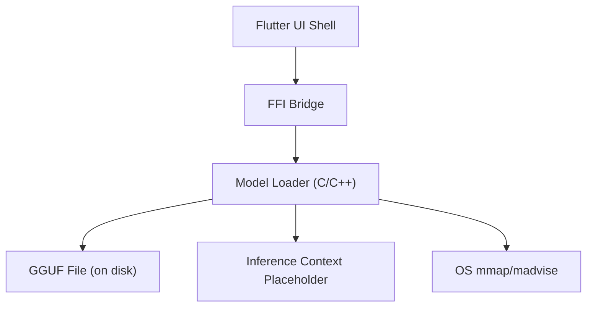
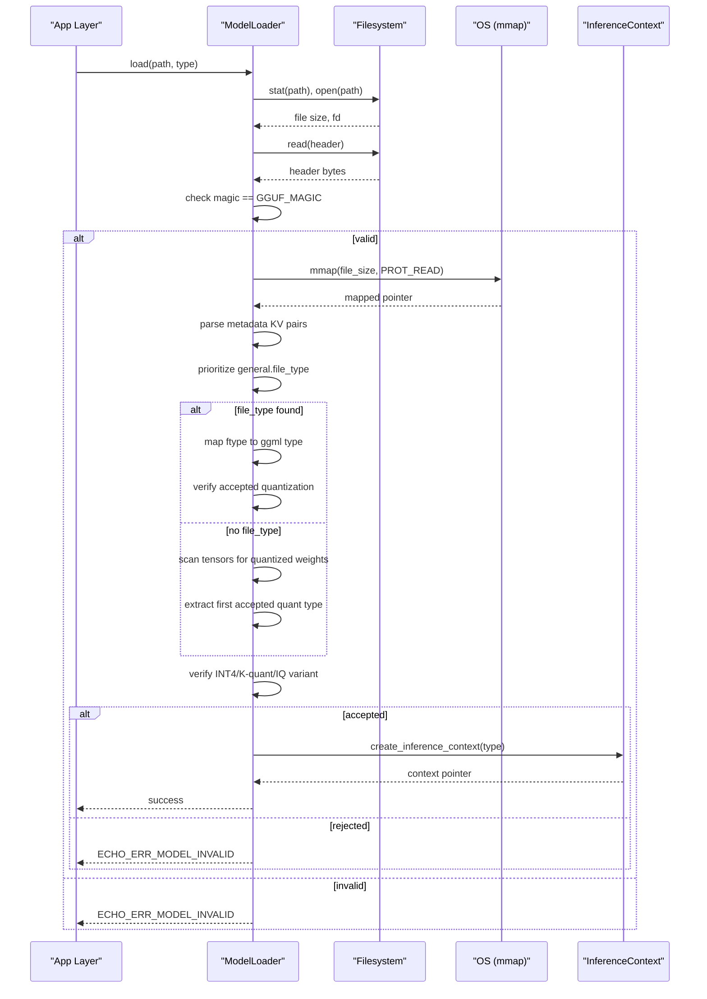
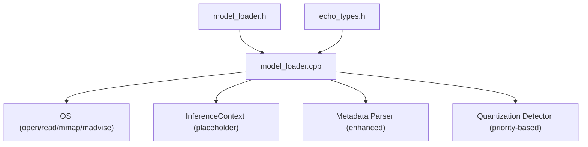

# GGUF Model Format

<cite>
**Referenced Files in This Document**
- [model_loader.h](file://native/include/model_loader.h)
- [model_loader.cpp](file://native/src/model_loader.cpp)
- [echo_types.h](file://native/include/echo_types.h)
- [test_model_loader.cpp](file://native/tests/test_model_loader.cpp)
- [README.md](file://README.md)
</cite>

## Update Summary
**Changes Made**
- Updated quantization type enumeration to include K-quants (Q3_K, Q4_K, Q5_K, Q6_K) and IQ variants (IQ4_NL, IQ4_XS)
- Enhanced quantization detection algorithm with priority-based approach using general.file_type metadata
- Improved compatibility with various GGUF conversion tools through ftype_to_ggml_type mapping
- Updated validation procedures to support expanded quantization formats
- Added comprehensive test coverage for new quantization types

## Table of Contents
1. [Introduction](#introduction)
2. [Project Structure](#project-structure)
3. [Core Components](#core-components)
4. [Architecture Overview](#architecture-overview)
5. [Detailed Component Analysis](#detailed-component-analysis)
6. [Dependency Analysis](#dependency-analysis)
7. [Performance Considerations](#performance-considerations)
8. [Troubleshooting Guide](#troubleshooting-guide)
9. [Conclusion](#conclusion)

## Introduction
This document explains the GGUF model format as used by QwenEcho, focusing on file structure, header fields, tensor storage layout, metadata key-value pairs, and enhanced quantization formats including legacy INT4 (Q4_0, Q4_1), K-quants (Q3_K, Q4_K, Q5_K, Q6_K), and IQ variants (IQ4_NL, IQ4_XS). It documents the improved validation procedures for model integrity checking, version compatibility, and quantization type verification, along with examples of parsing, header validation, and error handling for corrupted or incompatible models. Finally, it addresses performance considerations across different quantization levels and their accuracy vs. memory trade-offs.

## Project Structure
The GGUF-related logic is implemented in the native engine layer:
- Header definitions for GGUF magic bytes, quantization types, and header structure are declared in the public interface.
- The loader validates GGUF files, parses minimal metadata to locate the first tensor's quantization type, memory-maps the file, and creates an inference context placeholder.
- Unit tests construct minimal GGUF binaries to validate behavior and error paths.

[No sources needed since this diagram shows conceptual workflow, not actual code structure]

**Section sources**
- [README.md:1-189](file://README.md#L1-L189)

## Core Components
- **Enhanced GGUF constants and structures**:
  - Magic bytes constant for GGUF files.
  - Expanded quantization type enumeration including legacy INT4 variants (Q4_0, Q4_1), K-quants family (Q3_K, Q4_K, Q5_K, Q6_K), and IQ variants (IQ4_NL, IQ4_XS).
  - GGUF v3 header structure containing magic, version, tensor count, and metadata KV count.
- **Advanced Model loader**:
  - Validates file existence and permissions.
  - Reads and checks the GGUF header magic.
  - Parses metadata KV pairs with priority-based quantization detection using general.file_type field.
  - Falls back to tensor descriptor scanning for mixed-precision models.
  - Extracts representative quantization type and verifies it matches accepted formats.
  - Memory-maps the file for efficient access and creates a lightweight inference context.
- **Error reporting**:
  - Uses standardized error codes for missing files, permission issues, invalid format, and memory errors.

**Section sources**
- [model_loader.h:26-60](file://native/include/model_loader.h#L26-L60)
- [model_loader.h:82-135](file://native/include/model_loader.h#L82-L135)
- [model_loader.cpp:54-79](file://native/src/model_loader.cpp#L54-79)
- [model_loader.cpp:231-320](file://native/src/model_loader.cpp#L231-320)
- [model_loader.cpp:370-475](file://native/src/model_loader.cpp#L370-475)
- [echo_types.h:48-62](file://native/include/echo_types.h#L48-62)

## Architecture Overview
The GGUF loading pipeline integrates with the broader engine lifecycle and platform abstractions, featuring enhanced quantization detection capabilities.

**Diagram sources**
- [model_loader.cpp:231-320](file://native/src/model_loader.cpp#L231-320)
- [model_loader.cpp:370-475](file://native/src/model_loader.cpp#L370-475)
- [model_loader.cpp:203-211](file://native/src/model_loader.cpp#L203-211)

## Detailed Component Analysis

### GGUF File Structure and Header Fields
- **Magic bytes**:
  - Defined as a little-endian constant representing "GGUF".
- **Header fields (v3)**:
  - magic: must match the defined constant.
  - version: supports GGUF v2/v3; implementation expects v3.
  - tensor_count: number of tensors stored in the file.
  - metadata_kv_count: number of key-value pairs preceding tensor descriptors.

These fields are used to validate the file early and to navigate into the metadata and tensor sections.

**Section sources**
- [model_loader.h:26-60](file://native/include/model_loader.h#L26-L60)
- [model_loader.cpp:415-426](file://native/src/model_loader.cpp#L415-426)

### Enhanced Metadata Key-Value Pairs
- Each metadata entry consists of:
  - Key length (uint64_t) followed by key bytes.
  - Value type (uint32_t) indicating scalar, string, or array.
  - Value payload:
    - Scalars have fixed sizes per type.
    - Strings include a uint64 length then bytes.
    - Arrays include element type, count, and repeated elements.
- **Priority-based parsing**:
  - First searches for `general.file_type` metadata field (canonical quantization indicator).
  - Falls back to tensor descriptor scanning if file_type is absent (mixed-precision models).
  - Skips all metadata entries to reach the tensor descriptor section.

Parsing helpers:
- Value type enumeration includes integers, floats, booleans, strings, and arrays.
- Size lookup returns 0 for variable-length types (string/array).
- Skip function advances the offset safely with bounds checks.

**Section sources**
- [model_loader.cpp:108-190](file://native/src/model_loader.cpp#L108-190)
- [model_loader.cpp:241-275](file://native/src/model_loader.cpp#L241-275)

### Tensor Storage Layout
- After metadata, each tensor descriptor contains:
  - name_len (uint64_t) + name bytes.
  - n_dims (uint32_t).
  - dims[n_dims] array of uint64_t dimensions.
  - type (uint32_t) representing the quantization type.
  - offset (uint64_t) pointing to the tensor data region.
- **Enhanced scanning**:
  - Iterates through tensors to find the first quantized weight tensor.
  - Automatically skips non-quantized tensors (F32/F16 norm & bias).
  - Returns the first accepted quantization type found.

Note: In production, iterating all tensors would be preferred; the current approach uses the first quantized tensor as representative.

**Section sources**
- [model_loader.cpp:279-320](file://native/src/model_loader.cpp#L279-320)

### Enhanced Quantization Formats Support

#### Legacy INT4 Variants
- **Q4_0**: Block-wise INT4 without offset (~4 bits per weight).
- **Q4_1**: Block-wise INT4 with offset (~4 bits per weight, improved fidelity).

#### K-Quant Family
- **Q3_K**: ~3.4 bits per word, optimized for mobile deployment.
- **Q4_K**: ~4.5 bits per word, excellent quality-to-size ratio.
- **Q5_K**: ~5.5 bits per word, higher fidelity option.
- **Q6_K**: ~6.6 bits per word, near-FP16 quality with significant compression.

#### IQ Variants (Importance Matrix Quantization)
- **IQ4_NL**: ~4.5 bits per word, importance-matrix based quantization.
- **IQ4_XS**: ~4.25 bits per word, extreme compression variant.

**Updated** Enhanced quantization detection now supports the complete K-quants family and IQ variants, providing better compatibility with modern GGUF conversion tools while maintaining mobile-friendly memory constraints.

**Section sources**
- [model_loader.h:35-52](file://native/include/model_loader.h#L35-52)
- [model_loader.cpp:54-79](file://native/src/model_loader.cpp#L54-79)

### Advanced Quantization Detection Algorithm

#### Priority-Based Detection Strategy
The enhanced detection algorithm implements a two-phase approach:

1. **Primary Detection**: Parse `general.file_type` metadata field
   - Canonical field set by conversion tools (llama.cpp, unsloth, bartowski)
   - Maps llama.cpp ftype enum to ggml type via `ftype_to_ggml_type()`
   - Handles K-quant variants (Q3_K_S/M/L → Q3_K, Q4_K_S/M → Q4_K, etc.)

2. **Fallback Detection**: Scan tensor descriptors
   - Used for mixed-precision models (ASR/TTS) that omit file_type
   - Finds first quantized weight tensor automatically
   - Skips non-quantized tensors (norm, bias, embeddings)

#### FType to GGML Type Mapping
The `ftype_to_ggml_type()` function handles the complex mapping between llama.cpp ftype values and ggml quantization types:
- ftype 11/12/13 (Q3_K_S/M/L) → GGUF_QUANT_Q3_K
- ftype 14/15 (Q4_K_S/M) → GGUF_QUANT_Q4_K  
- ftype 16/17 (Q5_K_S/M) → GGUF_QUANT_Q5_K
- ftype 18 (Q6_K) → GGUF_QUANT_Q6_K
- Other values pass through unchanged

**Section sources**
- [model_loader.cpp:192-211](file://native/src/model_loader.cpp#L192-211)
- [model_loader.cpp:231-320](file://native/src/model_loader.cpp#L231-320)

### Validation Procedures
- **Integrity checks**:
  - File existence and non-zero size.
  - Readability and regular file mode.
  - Header magic equals the GGUF constant.
  - Sufficient file size to contain at least the header.
- **Version compatibility**:
  - Expects GGUF v3; header version field is present.
- **Enhanced quantization type verification**:
  - Primary: Parse `general.file_type` metadata when available.
  - Fallback: Scan tensor descriptors for first quantized weight.
  - Verify against expanded accepted list: Q4_0, Q4_1, Q3_K, Q4_K, Q5_K, Q6_K, IQ4_NL, IQ4_XS.
- **Error categorization**:
  - Missing file → specific error code.
  - Permission denied → specific error code.
  - Invalid format (bad magic or unsupported quantization) → specific error code.
  - Memory mapping failure → memory error code.

**Section sources**
- [model_loader.cpp:370-475](file://native/src/model_loader.cpp#L370-475)
- [echo_types.h:48-62](file://native/include/echo_types.h#L48-62)

### Examples of Parsing, Header Validation, and Error Handling
- **Minimal GGUF binary construction**:
  - Tests build a minimal GGUF file with correct magic, version 3, one tensor, zero metadata, and padding.
- **Valid quantization tests**:
  - Creates files with Q4_0, Q4_1, and Q4_K quantization and loads successfully.
- **Bad magic test**:
  - Corrupts the magic field and expects invalid format error.
- **Non-accepted quantization test**:
  - Constructs a file with FP16 quantization and expects invalid format error.

**Updated** Test coverage now includes validation for K-quants and IQ variants, ensuring compatibility with the expanded quantization support.

**Section sources**
- [test_model_loader.cpp:26-120](file://native/tests/test_model_loader.cpp#L26-L120)
- [test_model_loader.cpp:231-257](file://native/tests/test_model_loader.cpp#L231-257)

## Dependency Analysis
The GGUF loader depends on:
- Public headers defining GGUF constants and structures.
- Shared engine types for error codes and model types.
- Platform APIs for file I/O, memory mapping, and process advice.

**Diagram sources**
- [model_loader.h:26-60](file://native/include/model_loader.h#L26-60)
- [model_loader.cpp:9-18](file://native/src/model_loader.cpp#L9-18)
- [echo_types.h:48-62](file://native/include/echo_types.h#L48-62)

**Section sources**
- [model_loader.h:26-60](file://native/include/model_loader.h#L26-60)
- [model_loader.cpp:9-18](file://native/src/model_loader.cpp#L9-18)
- [echo_types.h:48-62](file://native/include/echo_types.h#L48-62)

## Performance Considerations
- **Enhanced quantization impact**:
  - **Legacy INT4 (Q4_0/Q4_1)**: Smallest footprint, good baseline quality.
  - **K-quants family**: Progressive quality improvements from Q3_K (~3.4 bpw) to Q6_K (~6.6 bpw).
  - **IQ variants**: Importance-matrix quantization provides superior quality at similar bitrates.
  - All quantizations significantly reduce memory usage compared to FP16/FP32, enabling larger models on mobile devices.
- **Accuracy vs. memory trade-offs**:
  - Lower-bit quantizations (Q3_K, IQ4_XS) maximize memory efficiency but may sacrifice some fidelity.
  - Higher-fidelity options (Q5_K, Q6_K, IQ4_NL) maintain better accuracy while still being substantially smaller than FP16.
  - K-quants provide optimal balance for mobile deployment with excellent quality-to-size ratios.
- **System-level optimizations**:
  - Memory mapping leverages the OS page cache, reducing explicit copies and improving startup time.
  - Sequential access hints help the kernel optimize prefetching for large model files.
  - Enhanced quantization detection reduces parsing overhead through priority-based approach.

## Troubleshooting Guide
Common errors and their causes:
- **Model missing**:
  - Path does not exist or is not a directory; file cannot be opened.
- **Permission denied**:
  - File exists but lacks read permissions or is outside allowed sandbox paths.
- **Invalid format**:
  - Magic bytes do not match GGUF constant.
  - File too small to contain a valid header.
  - No accepted quantization found (not Q4_0/Q4_1/Q3_K/Q4_K/Q5_K/Q6_K/IQ4_NL/IQ4_XS).
  - Mixed-precision model without proper quantized tensors.
- **Memory error**:
  - mmap fails due to insufficient address space or resource limits.

**Updated** Diagnostic steps now include verification of supported quantization types beyond basic INT4.

Diagnostic steps:
- Verify file path and permissions.
- Confirm the file begins with the GGUF magic constant.
- Ensure the model uses an accepted quantization format (Q4_0/Q4_1/Q3_K/Q4_K/Q5_K/Q6_K/IQ4_NL/IQ4_XS).
- Check for presence of `general.file_type` metadata for better compatibility.
- Verify system memory availability if mmap fails.

**Section sources**
- [model_loader.cpp:370-475](file://native/src/model_loader.cpp#L370-475)
- [echo_types.h:48-62](file://native/include/echo_types.h#L48-62)

## Conclusion
QwenEcho's enhanced GGUF integration provides robust validation and efficient loading of advanced quantized models. By supporting the complete K-quants family (Q3_K, Q4_K, Q5_K, Q6_K) and IQ variants (IQ4_NL, IQ4_XS) alongside legacy INT4 formats, the loader ensures compatibility with modern GGUF conversion tools while maintaining mobile-friendly memory constraints. The priority-based quantization detection algorithm, which prefers the canonical `general.file_type` metadata field before falling back to tensor scanning, provides improved compatibility with various GGUF generation pipelines. The use of memory mapping and sequential access hints optimizes performance on mobile platforms, while the expanded quantization options provide practical balances between memory usage and accuracy for real-time offline interpretation on-device.