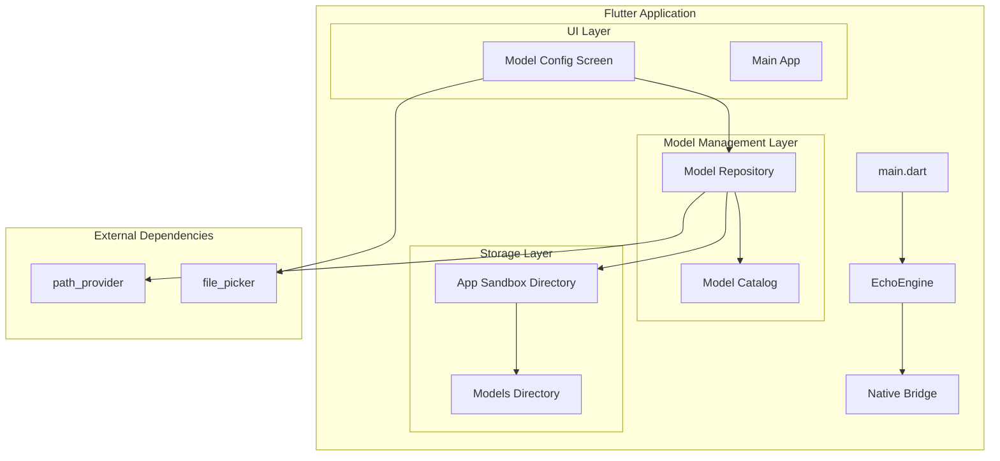
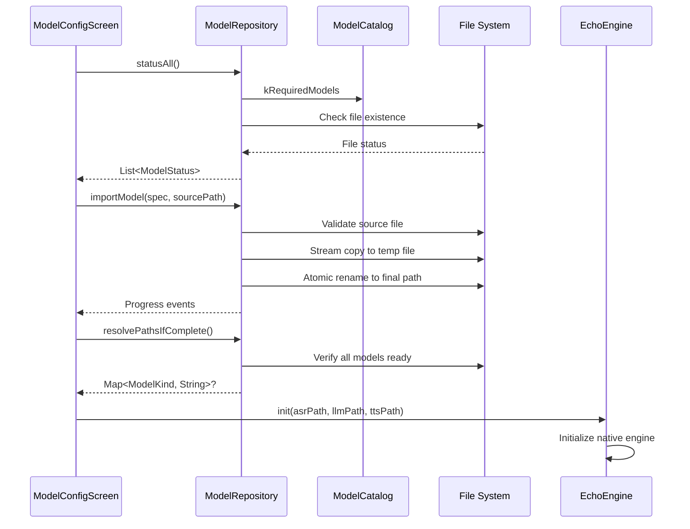
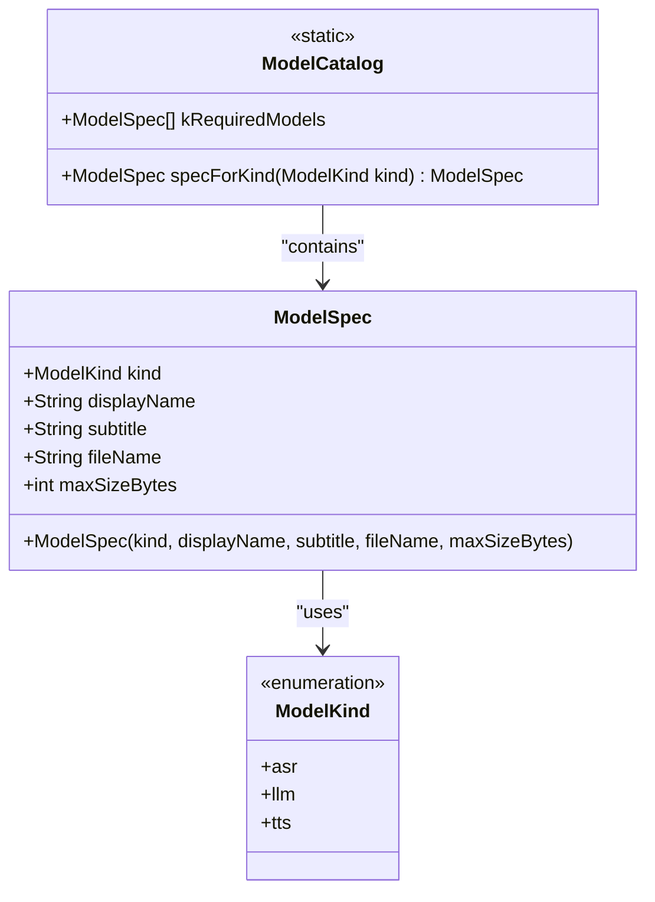
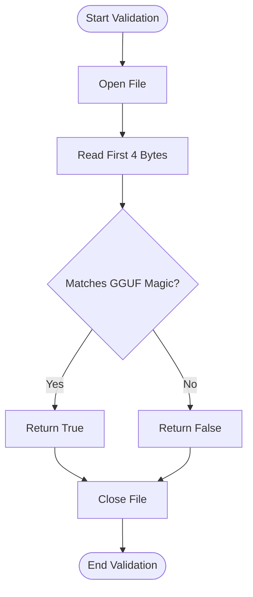
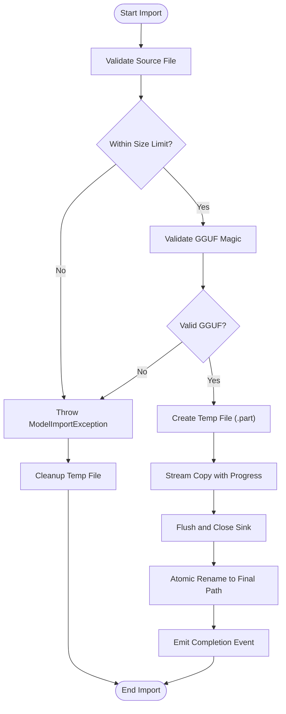
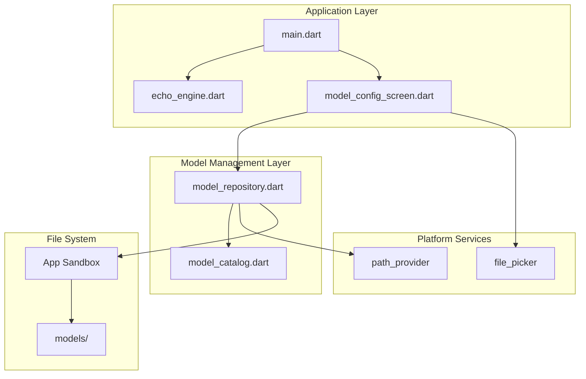

# Model Catalog and Repository

<cite>
**Referenced Files in This Document**
- [model_catalog.dart](file://lib/src/model/model_catalog.dart)
- [model_repository.dart](file://lib/src/model/model_repository.dart)
- [model_config_screen.dart](file://lib/src/ui/model_config_screen.dart)
- [echo_engine.dart](file://lib/src/echo_engine.dart)
- [main.dart](file://lib/main.dart)
- [pubspec.yaml](file://pubspec.yaml)
- [README.md](file://README.md)
</cite>

## Table of Contents
1. [Introduction](#introduction)
2. [Project Structure](#project-structure)
3. [Core Components](#core-components)
4. [Architecture Overview](#architecture-overview)
5. [Detailed Component Analysis](#detailed-component-analysis)
6. [Dependency Analysis](#dependency-analysis)
7. [Performance Considerations](#performance-considerations)
8. [Troubleshooting Guide](#troubleshooting-guide)
9. [Conclusion](#conclusion)
10. [Appendices](#appendices)

## Introduction

QwenEcho is an on-device, air-gapped simultaneous interpretation application that runs three AI models entirely offline on mobile hardware. The Flutter-side model catalog and repository system provides the foundation for managing these models without any network connectivity, ensuring complete privacy and security.

The system consists of two primary components: **ModelCatalog**, which defines the required models and their specifications, and **ModelRepository**, which handles file-based storage management, validation, and provisioning of GGUF model files. This documentation explains how these components work together to provide a robust, offline-first model management solution for ASR (Automatic Speech Recognition), LLM (Large Language Model), and TTS (Text-to-Speech) components.

## Project Structure

The model catalog and repository system is organized within the Flutter application structure as follows:

**Diagram sources**
- [main.dart:1-154](file://lib/main.dart#L1-L154)
- [model_catalog.dart:1-81](file://lib/src/model/model_catalog.dart#L1-L81)
- [model_repository.dart:1-256](file://lib/src/model/model_repository.dart#L1-L256)
- [model_config_screen.dart:1-337](file://lib/src/ui/model_config_screen.dart#L1-L337)

**Section sources**
- [main.dart:1-154](file://lib/main.dart#L1-L154)
- [pubspec.yaml:1-26](file://pubspec.yaml#L1-L26)

## Core Components

### ModelCatalog: Static Model Definition System

The ModelCatalog serves as the authoritative source of truth for all required models in the QwenEcho pipeline. It defines immutable specifications for each model including metadata, file requirements, and size constraints.

#### Key Features:
- **ModelKind Enumeration**: Defines the three model types (ASR, LLM, TTS) matching native engine ordering
- **ModelSpec Class**: Immutable description containing display metadata, filename, and size limits
- **kRequiredModels List**: Centralized definition of all three required models in pipeline order
- **specForKind Function**: Utility for looking up model specifications by type

#### Model Specifications:
- **ASR Model**: Qwen3-ASR-0.6B (~600MB limit) - Speech recognition supporting 52 languages
- **LLM Model**: Qwen3.5-4B (~2.6GB limit) - Bilingual translation with context
- **TTS Model**: Qwen3-TTS-Streaming (~350MB limit) - Streaming text-to-speech synthesis

**Section sources**
- [model_catalog.dart:1-81](file://lib/src/model/model_catalog.dart#L1-L81)

### ModelRepository: File-Based Storage Management

The ModelRepository implements a comprehensive file-based storage system for managing GGUF model files within the application sandbox. It provides zero-network I/O operations, adhering to QwenEcho's air-gapped policy.

#### Core Responsibilities:
- **Directory Management**: Resolves and creates the app sandbox `models/` directory
- **File Validation**: Validates GGUF magic bytes and enforces size constraints
- **Import Operations**: Streams large model files with progress reporting
- **Status Monitoring**: Provides real-time status information for all models
- **Lifecycle Management**: Handles model deletion and cleanup operations

#### Data Structures:
- **ModelStatus**: Represents the current state of a model including presence, validity, and size
- **ModelImportProgress**: Tracks import progress with copied/total byte counts
- **ModelImportException**: Custom exception type for import failures

**Section sources**
- [model_repository.dart:1-256](file://lib/src/model/model_repository.dart#L1-L256)

## Architecture Overview

The model management architecture follows a clean separation of concerns with clear interfaces between components:

**Diagram sources**
- [model_config_screen.dart:48-73](file://lib/src/ui/model_config_screen.dart#L48-L73)
- [model_repository.dart:145-211](file://lib/src/model/model_repository.dart#L145-L211)
- [echo_engine.dart:66-75](file://lib/src/echo_engine.dart#L66-L75)

## Detailed Component Analysis

### ModelCatalog Implementation

The ModelCatalog component provides a static, compile-time defined catalog of required models. This approach ensures consistency across the application and eliminates runtime configuration errors.

#### Design Patterns:
- **Immutable Configuration**: All model specifications are const constructors
- **Centralized Definition**: Single source of truth for model requirements
- **Type Safety**: Strong typing through ModelKind enumeration
- **Extensibility**: Easy addition of new models through list extension

#### Complexity Analysis:
- **Time Complexity**: O(1) for spec lookups using firstWhere
- **Space Complexity**: O(1) for constant number of models (3)
- **Memory Usage**: Minimal overhead for static data structures

**Diagram sources**
- [model_catalog.dart:15-50](file://lib/src/model/model_catalog.dart#L15-L50)
- [model_catalog.dart:54-76](file://lib/src/model/model_catalog.dart#L54-L76)

**Section sources**
- [model_catalog.dart:1-81](file://lib/src/model/model_catalog.dart#L1-L81)

### ModelRepository Implementation

The ModelRepository implements a sophisticated file management system with comprehensive validation and error handling.

#### Key Algorithms:

##### GGUF Magic Byte Validation
The repository validates GGUF files by checking the first 4 bytes against the expected magic sequence "GGUF" (0x46475547).

**Diagram sources**
- [model_repository.dart:225-240](file://lib/src/model/model_repository.dart#L225-L240)

##### Atomic File Import Process
The import process uses atomic operations to ensure data integrity during large file transfers.

**Diagram sources**
- [model_repository.dart:153-211](file://lib/src/model/model_repository.dart#L153-L211)

#### Error Handling Strategy:
- **Validation Errors**: Immediate exceptions for invalid inputs
- **I/O Errors**: Comprehensive try-catch blocks with cleanup
- **Progress Tracking**: Real-time feedback during long operations
- **Atomic Operations**: Prevent partial writes through temp file strategy

**Section sources**
- [model_repository.dart:1-256](file://lib/src/model/model_repository.dart#L1-256)

### UI Integration Pattern

The ModelConfigScreen demonstrates proper integration of the model management system with Flutter's reactive UI paradigm.

#### State Management:
- **Reactive Updates**: Uses setState for UI updates after repository operations
- **Progress Tracking**: Maintains per-model import progress in local state
- **Error Display**: Shows user-friendly error messages via SnackBars
- **Confirmation Dialogs**: Prevents accidental model deletion

#### User Experience Features:
- **Visual Status Indicators**: Color-coded dots showing model readiness
- **Progress Bars**: Real-time import progress visualization
- **Summary Header**: Overall completion status at a glance
- **Refresh Capability**: Pull-to-refresh for status updates

**Section sources**
- [model_config_screen.dart:1-337](file://lib/src/ui/model_config_screen.dart#L1-L337)

## Dependency Analysis

The model management system has well-defined dependencies and clear separation of concerns:

**Diagram sources**
- [main.dart:1-154](file://lib/main.dart#L1-L154)
- [model_repository.dart:11-17](file://lib/src/model/model_repository.dart#L11-L17)
- [model_config_screen.dart:8-14](file://lib/src/ui/model_config_screen.dart#L8-L14)

### External Dependencies:
- **path_provider**: Resolves application sandbox directories
- **file_picker**: Provides file selection interface for model imports
- **dart:io**: Low-level file system operations
- **dart:async**: Asynchronous operations and streams

### Internal Dependencies:
- **ModelRepository → ModelCatalog**: Uses model specifications for validation
- **ModelConfigScreen → Both**: Consumes both catalog and repository APIs
- **EchoEngine → Repository**: Receives resolved model paths for initialization

**Section sources**
- [pubspec.yaml:10-17](file://pubspec.yaml#L10-L17)
- [model_repository.dart:11-17](file://lib/src/model/model_repository.dart#L11-L17)
- [model_config_screen.dart:8-14](file://lib/src/ui/model_config_screen.dart#L8-L14)

## Performance Considerations

### Memory Efficiency:
- **Streaming Imports**: Large model files are streamed chunk-by-chunk to avoid memory overflow
- **Lazy Directory Resolution**: App sandbox directory is cached after first access
- **Minimal State**: Repository maintains only essential cached state

### I/O Optimization:
- **Atomic Operations**: Prevents partial writes and corruption
- **Efficient Validation**: Only reads first 4 bytes for GGUF validation
- **Parallel Status Checks**: Uses Future.wait for concurrent model status checks

### Scalability:
- **O(1) Lookups**: Model catalog operations are constant time
- **Linear Scaling**: Repository operations scale linearly with file size
- **Thread Safety**: Dart's single-threaded event loop prevents race conditions

## Troubleshooting Guide

### Common Issues and Solutions:

#### Model Import Failures:
- **Empty Files**: Ensure source files are non-empty before import
- **Invalid Format**: Verify files are valid GGUF format with correct magic bytes
- **Size Limits**: Check if files exceed maximum allowed sizes
- **Permission Issues**: Ensure app has read/write permissions to target directories

#### Storage Problems:
- **Insufficient Space**: Verify adequate free space in app sandbox
- **Corrupted Files**: Delete and re-import corrupted model files
- **Path Resolution**: Check app sandbox directory accessibility

#### UI State Issues:
- **Stale Status**: Use refresh functionality to update model status
- **Import Stuck**: Cancel and restart import if progress stalls
- **Memory Warnings**: Monitor device memory during large file imports

### Debugging Techniques:
- **Status Inspection**: Use `statusAll()` to check current model states
- **Path Verification**: Log resolved paths for troubleshooting
- **Progress Monitoring**: Subscribe to import progress streams
- **Exception Handling**: Catch and log ModelImportException details

**Section sources**
- [model_repository.dart:68-74](file://lib/src/model/model_repository.dart#L68-L74)
- [model_config_screen.dart:66-73](file://lib/src/ui/model_config_screen.dart#L66-L73)

## Conclusion

The Flutter-side model catalog and repository system in QwenEcho provides a robust, offline-first solution for managing AI models across ASR, LLM, and TTS components. The design emphasizes:

- **Air-Gapped Operation**: Zero network dependencies ensure complete privacy
- **Data Integrity**: Comprehensive validation and atomic operations prevent corruption
- **User Experience**: Intuitive UI with real-time feedback and error handling
- **Performance**: Efficient streaming and minimal memory footprint
- **Maintainability**: Clean separation of concerns and extensible architecture

This system successfully addresses the challenges of offline model management while providing a solid foundation for future enhancements such as version management, automatic updates, and additional model support.

## Appendices

### Adding New Language Packs

To add support for new language packs:

1. **Update Model Catalog**: Add new ModelSpec entries to kRequiredModels list
2. **Define Metadata**: Include appropriate display names, subtitles, and size limits
3. **Update UI**: Modify ModelConfigScreen to handle new model types
4. **Test Integration**: Verify import, validation, and engine initialization workflows

### Implementing Model Update Checks

For implementing update verification:

1. **Version Tracking**: Add version fields to ModelSpec definitions
2. **Integrity Checking**: Implement checksum validation for downloaded models
3. **Migration Logic**: Handle schema changes between model versions
4. **Rollback Support**: Maintain backup copies for safe updates

### Offline-First Design Patterns

Key patterns implemented:

- **Local-First Storage**: All data stored in app sandbox
- **Sync-on-Demand**: Network operations only when explicitly requested
- **Graceful Degradation**: App functions fully offline with local models
- **State Persistence**: Model status persists across app restarts