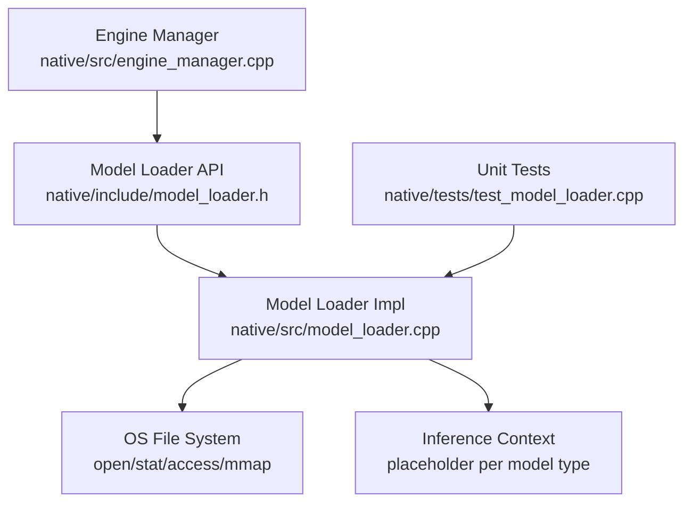
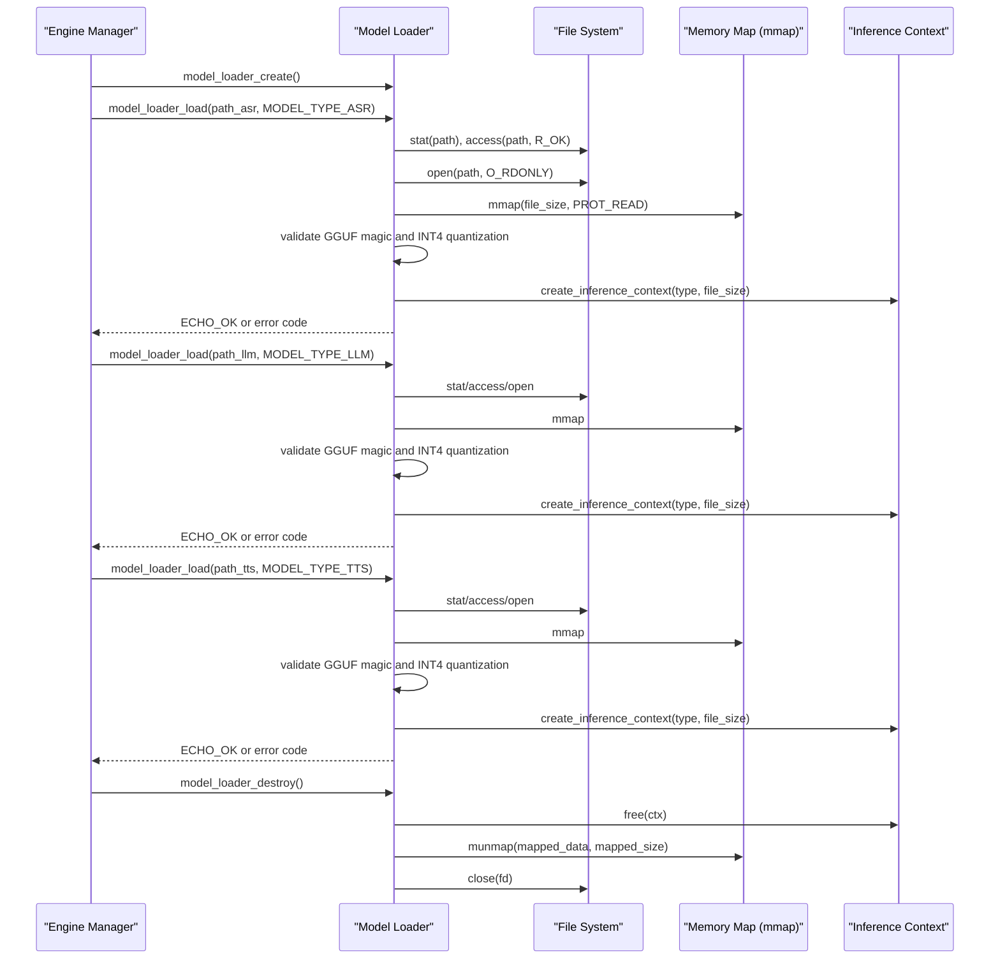
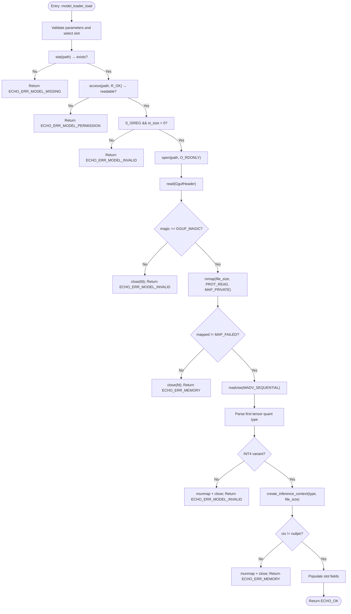
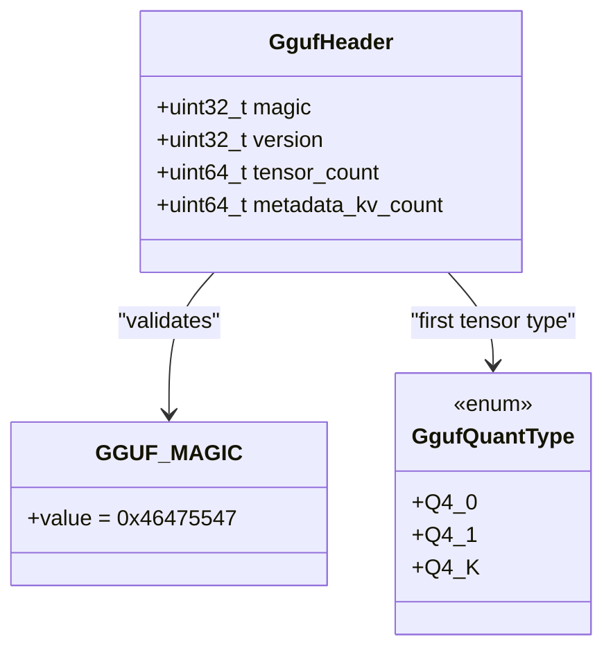
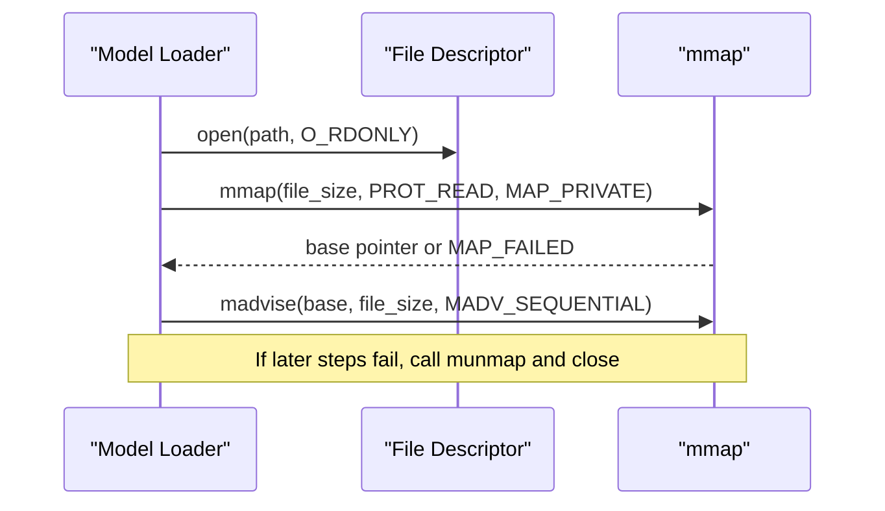
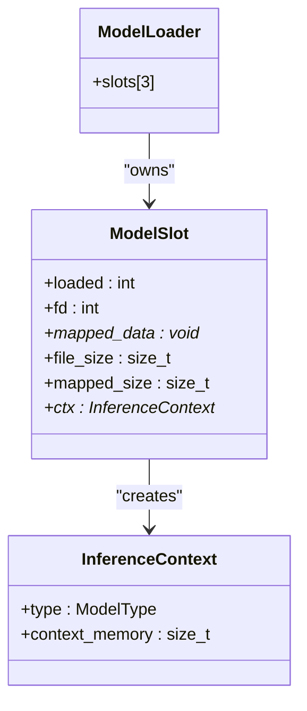
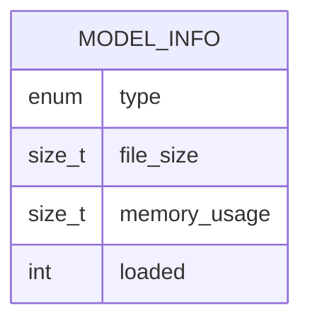
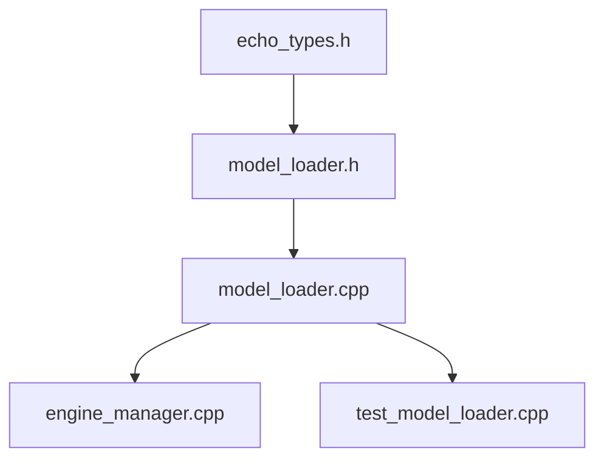

# Model Loader Core

<cite>
**Referenced Files in This Document**
- [model_loader.h](file://native/include/model_loader.h)
- [model_loader.cpp](file://native/src/model_loader.cpp)
- [echo_types.h](file://native/include/echo_types.h)
- [engine_manager.cpp](file://native/src/engine_manager.cpp)
- [test_model_loader.cpp](file://native/tests/test_model_loader.cpp)
</cite>

## Table of Contents
1. [Introduction](#introduction)
2. [Project Structure](#project-structure)
3. [Core Components](#core-components)
4. [Architecture Overview](#architecture-overview)
5. [Detailed Component Analysis](#detailed-component-analysis)
6. [Dependency Analysis](#dependency-analysis)
7. [Performance Considerations](#performance-considerations)
8. [Troubleshooting Guide](#troubleshooting-guide)
9. [Conclusion](#conclusion)

## Introduction
This document explains the Model Loader core functionality focused on GGUF model loading and validation. It details the multi-step validation performed by model_loader_load(), including file existence checks, permission verification, magic byte validation, quantization format verification, memory-mapped file access via mmap for OS page cache optimization, and inference context creation for ASR, LLM, and TTS models. It also documents resource cleanup patterns, error handling strategies, and the ModelInfo structure used for per-model status reporting and memory consumption tracking.

## Project Structure
The Model Loader is implemented as a small C/C++ component with a clear separation between interface (header) and implementation:
- Interface: native/include/model_loader.h defines public API, data structures, and constants.
- Implementation: native/src/model_loader.cpp implements validation, mmap-based loading, and inference context management.
- Integration: native/src/engine_manager.cpp uses the loader to load ASR, LLM, and TTS models during engine initialization.
- Tests: native/tests/test_model_loader.cpp validates behavior across success and failure paths.

**Diagram sources**
- [engine_manager.cpp:60-100](file://native/src/engine_manager.cpp#L60-L100)
- [model_loader.h:1-142](file://native/include/model_loader.h#L1-L142)
- [model_loader.cpp:269-460](file://native/src/model_loader.cpp#L269-L460)
- [test_model_loader.cpp:128-373](file://native/tests/test_model_loader.cpp#L128-L373)

**Section sources**
- [model_loader.h:1-142](file://native/include/model_loader.h#L1-L142)
- [model_loader.cpp:1-460](file://native/src/model_loader.cpp#L1-L460)
- [engine_manager.cpp:60-100](file://native/src/engine_manager.cpp#L60-L100)
- [test_model_loader.cpp:128-373](file://native/tests/test_model_loader.cpp#L128-L373)

## Core Components
- ModelLoader: Aggregate that owns three slots (ASR, LLM, TTS), each holding file descriptor, mapped region, size, and an inference context pointer.
- ModelSlot: Per-model state including loaded flag, fd, mapped_data, file_size, mapped_size, and InferenceContext*.
- InferenceContext: Placeholder for per-model inference buffers; tracks estimated memory usage by model type.
- ModelInfo: Public reportable struct containing model type, file size, total memory usage (mmap + context), and loaded flag.
- GGUF header and quantization types: Constants and enums define expected magic bytes and accepted INT4 variants.

Key responsibilities:
- Validate GGUF files before use.
- Memory-map files for efficient access leveraging OS page cache.
- Create and manage inference contexts per model type.
- Provide safe lifecycle APIs: create, load, get_info, get_context, unload, destroy.

**Section sources**
- [model_loader.h:26-75](file://native/include/model_loader.h#L26-L75)
- [model_loader.cpp:24-42](file://native/src/model_loader.cpp#L24-L42)
- [model_loader.cpp:241-265](file://native/src/model_loader.cpp#L241-L265)
- [model_loader.h:109-135](file://native/include/model_loader.h#L109-L135)

## Architecture Overview
The Model Loader integrates into the engine initialization flow. The Engine Manager creates a ModelLoader instance and loads ASR, LLM, and TTS models sequentially. Each successful load maps the GGUF file and constructs an inference context. Errors are propagated back to the manager, which transitions to an error state and cleans up resources.

**Diagram sources**
- [engine_manager.cpp:60-100](file://native/src/engine_manager.cpp#L60-L100)
- [model_loader.cpp:284-380](file://native/src/model_loader.cpp#L284-L380)
- [model_loader.cpp:419-459](file://native/src/model_loader.cpp#L419-L459)

## Detailed Component Analysis

### model_loader_load() Multi-Step Validation Flow
The function performs a strict sequence of checks and operations:
1. Parameter validation and slot selection.
2. File existence check using stat; returns missing if not found.
3. Permission verification using access(R_OK); returns permission denied if unreadable.
4. Regular file and non-zero size validation.
5. Open file descriptor and read GGUF header; verify magic bytes.
6. Memory-map the entire file with PROT_READ and MAP_PRIVATE; advise sequential access.
7. Parse first tensor metadata to extract quantization type; accept only INT4 variants.
8. Create inference context for the requested model type.
9. Populate slot fields and return success.

**Diagram sources**
- [model_loader.cpp:284-380](file://native/src/model_loader.cpp#L284-L380)

**Section sources**
- [model_loader.cpp:284-380](file://native/src/model_loader.cpp#L284-L380)

### GGUF Header and Quantization Validation
- Magic constant: GGUF_MAGIC defined as little-endian “GGUF”.
- Accepted INT4 quantization types: Q4_0, Q4_1, Q4_K.
- Parser skips metadata key-value pairs and reads the first tensor’s type field to determine quantization.

**Diagram sources**
- [model_loader.h:26-49](file://native/include/model_loader.h#L26-L49)
- [model_loader.cpp:175-235](file://native/src/model_loader.cpp#L175-L235)

**Section sources**
- [model_loader.h:26-49](file://native/include/model_loader.h#L26-L49)
- [model_loader.cpp:175-235](file://native/src/model_loader.cpp#L175-L235)

### Memory-Mapped File Access via mmap
- The file is opened read-only and memory-mapped with PROT_READ and MAP_PRIVATE.
- madvise(MADV_SEQUENTIAL) hints sequential access to optimize OS page cache behavior.
- On any error path after mapping, munmap and close are called to avoid leaks.

**Diagram sources**
- [model_loader.cpp:316-351](file://native/src/model_loader.cpp#L316-L351)

**Section sources**
- [model_loader.cpp:316-351](file://native/src/model_loader.cpp#L316-L351)

### Inference Context Creation and Management
- create_inference_context allocates an InferenceContext and estimates memory usage based on model type:
  - ASR: ~64 MB
  - LLM: ~128 MB
  - TTS: ~32 MB
- These values are placeholders for real ggml buffer allocations and are included in memory_usage reporting.

**Diagram sources**
- [model_loader.cpp:24-42](file://native/src/model_loader.cpp#L24-L42)
- [model_loader.cpp:241-265](file://native/src/model_loader.cpp#L241-L265)

**Section sources**
- [model_loader.cpp:241-265](file://native/src/model_loader.cpp#L241-L265)

### Resource Cleanup Patterns
- model_loader_unload frees the inference context, unmaps the file, closes the file descriptor, and resets slot state.
- model_loader_destroy iterates all slots and calls unload, then frees the loader.
- Error paths in model_loader_load ensure consistent cleanup (munmap/close/free) before returning errors.

**Diagram sources**
- [model_loader.cpp:419-448](file://native/src/model_loader.cpp#L419-L448)
- [model_loader.cpp:450-459](file://native/src/model_loader.cpp#L450-L459)

**Section sources**
- [model_loader.cpp:419-459](file://native/src/model_loader.cpp#L419-L459)

### ModelInfo Structure for Status Reporting and Memory Tracking
- Fields:
  - type: ModelType (ASR, LLM, TTS)
  - file_size: Size of the model file on disk
  - memory_usage: Sum of mapped region size plus inference context memory
  - loaded: 1 if loaded and ready, 0 otherwise
- model_loader_get_info populates these fields safely even when the model is not loaded.

**Diagram sources**
- [model_loader.h:70-75](file://native/include/model_loader.h#L70-L75)
- [model_loader.cpp:382-404](file://native/src/model_loader.cpp#L382-L404)

**Section sources**
- [model_loader.h:70-75](file://native/include/model_loader.h#L70-L75)
- [model_loader.cpp:382-404](file://native/src/model_loader.cpp#L382-L404)

### Concrete Usage Examples from the Codebase
- Engine Manager initialization loads ASR, LLM, and TTS models sequentially and handles errors by destroying the loader and transitioning to error state.
- Unit tests cover:
  - Successful loading of valid INT4 GGUF files
  - Rejection of bad magic bytes
  - Rejection of non-INT4 quantization (e.g., FP16)
  - Permission denial scenarios
  - Independent loading of all three model types
  - Memory usage reporting correctness
  - Reloading same slot replaces previous model without leaking
  - Empty file rejection
  - get_context returning NULL for unloaded models

These examples demonstrate proper workflows, error categorization, and resource cleanup.

**Section sources**
- [engine_manager.cpp:60-100](file://native/src/engine_manager.cpp#L60-L100)
- [test_model_loader.cpp:128-373](file://native/tests/test_model_loader.cpp#L128-L373)

## Dependency Analysis
- Internal dependencies:
  - model_loader.cpp depends on echo_types.h for ModelType and EchoErrorCode definitions.
  - model_loader.cpp uses POSIX APIs (stat, access, open, mmap, madvise, munmap, close).
- External integration:
  - engine_manager.cpp orchestrates model loading across ASR, LLM, TTS.
  - Stages (ASR, LLM, TTS) will consume inference contexts via model_loader_get_context in production flows.

**Diagram sources**
- [echo_types.h:48-62](file://native/include/echo_types.h#L48-L62)
- [model_loader.h:1-142](file://native/include/model_loader.h#L1-L142)
- [model_loader.cpp:1-460](file://native/src/model_loader.cpp#L1-L460)
- [engine_manager.cpp:60-100](file://native/src/engine_manager.cpp#L60-L100)
- [test_model_loader.cpp:128-373](file://native/tests/test_model_loader.cpp#L128-L373)

**Section sources**
- [echo_types.h:48-62](file://native/include/echo_types.h#L48-L62)
- [model_loader.h:1-142](file://native/include/model_loader.h#L1-L142)
- [model_loader.cpp:1-460](file://native/src/model_loader.cpp#L1-L460)
- [engine_manager.cpp:60-100](file://native/src/engine_manager.cpp#L60-L100)
- [test_model_loader.cpp:128-373](file://native/tests/test_model_loader.cpp#L128-L373)

## Performance Considerations
- mmap with PROT_READ and MAP_PRIVATE enables zero-copy access to model weights while leveraging the OS page cache.
- madvise(MADV_SEQUENTIAL) hints sequential access patterns to improve prefetching and reduce page faults.
- Memory usage reported includes both the mapped region and inference context buffers; this aids runtime monitoring and capacity planning.
- Placeholder inference context sizes provide conservative estimates; production should measure actual ggml allocations.

[No sources needed since this section provides general guidance]

## Troubleshooting Guide
Common error categories and their causes:
- ECHO_ERR_MODEL_MISSING: File does not exist or cannot be accessed due to path issues.
- ECHO_ERR_MODEL_PERMISSION: File exists but is not readable (permission denied).
- ECHO_ERR_MODEL_INVALID: File is not a regular file, empty, lacks correct GGUF magic, or has unsupported quantization (non-INT4).
- ECHO_ERR_MEMORY: mmap fails or inference context allocation fails.

Diagnostic tips:
- Verify file path and permissions before calling model_loader_load.
- Ensure the GGUF file contains correct magic bytes and INT4 quantization.
- Check system limits for memory mapping and available virtual address space.
- Use model_loader_get_info to inspect file_size and memory_usage after load attempts.

**Section sources**
- [model_loader.cpp:284-380](file://native/src/model_loader.cpp#L284-L380)
- [model_loader.cpp:382-404](file://native/src/model_loader.cpp#L382-L404)
- [echo_types.h:48-62](file://native/include/echo_types.h#L48-L62)

## Conclusion
The Model Loader provides robust GGUF model validation, efficient memory-mapped access, and per-model inference context management for ASR, LLM, and TTS. Its multi-step validation ensures early detection of invalid or inaccessible models, while mmap leverages OS page cache for performance. The ModelInfo structure offers clear visibility into model status and memory consumption. Comprehensive unit tests validate success and error paths, and the Engine Manager demonstrates proper integration and resource cleanup.