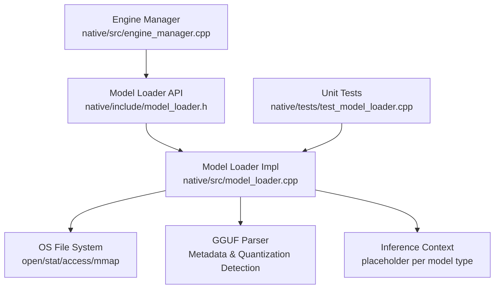
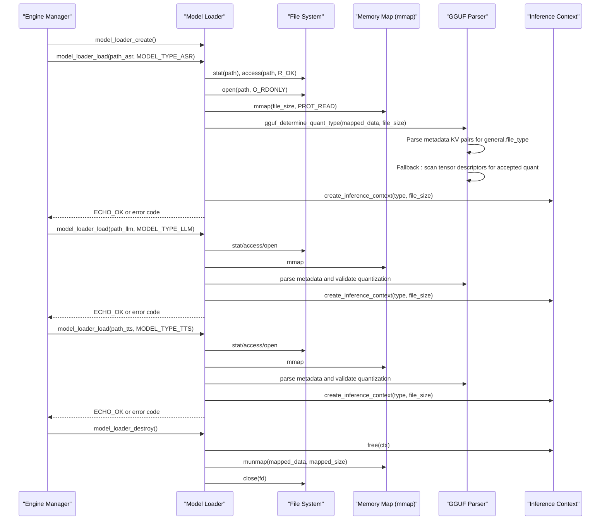
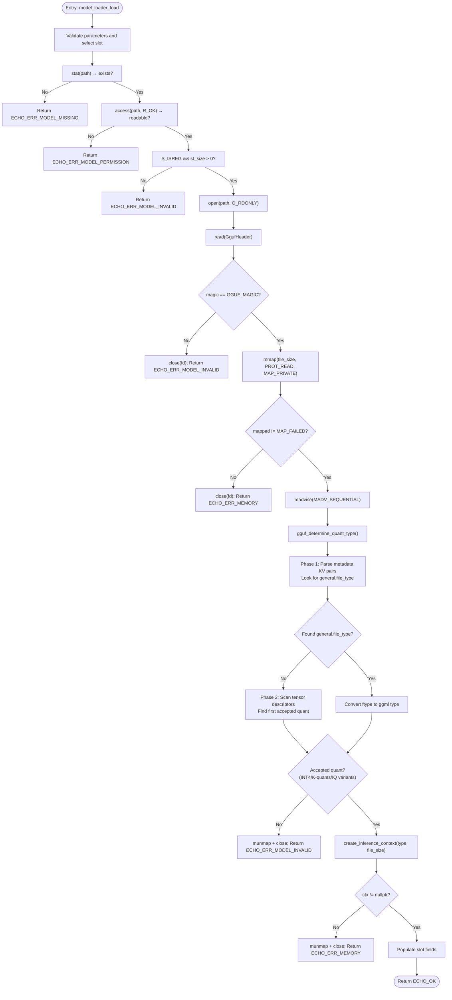
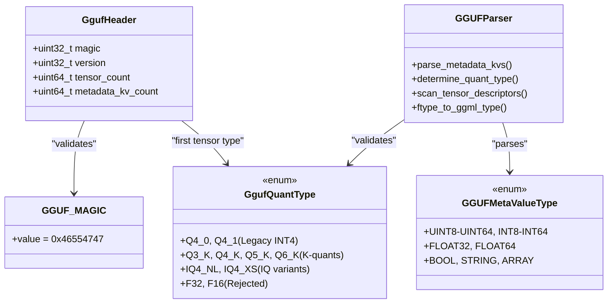
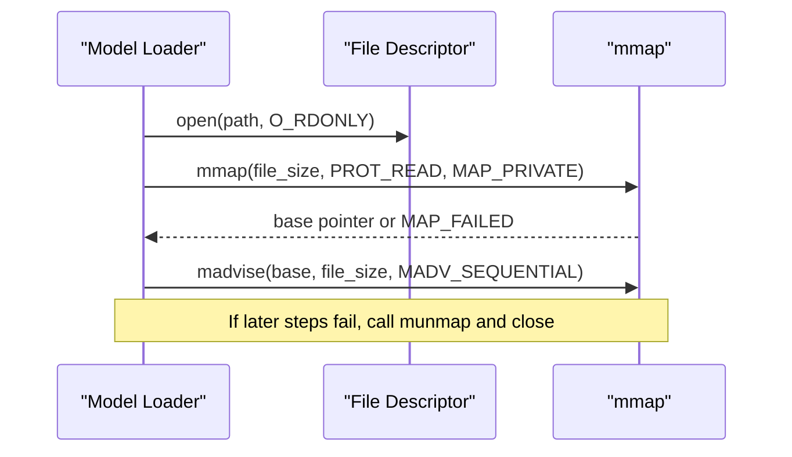
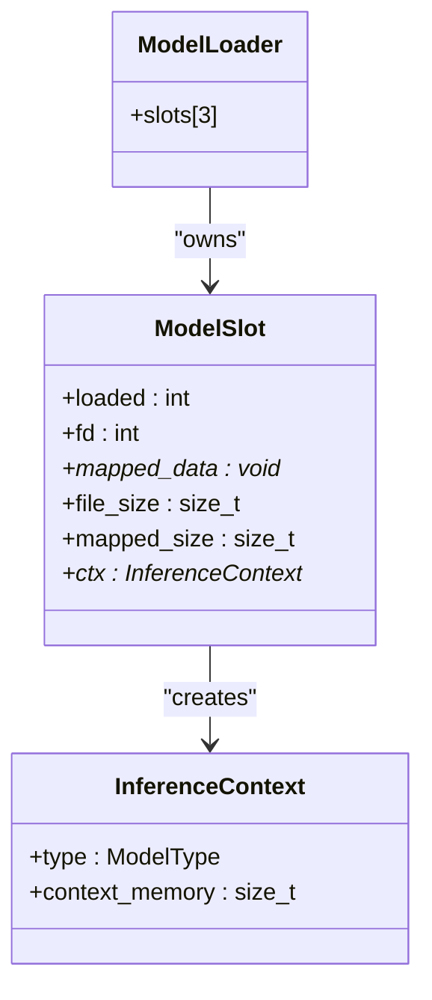
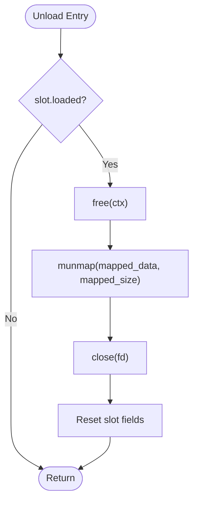
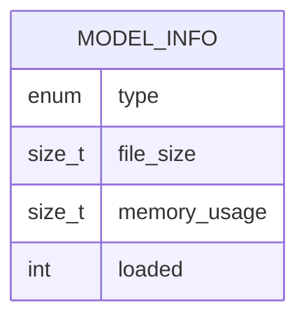
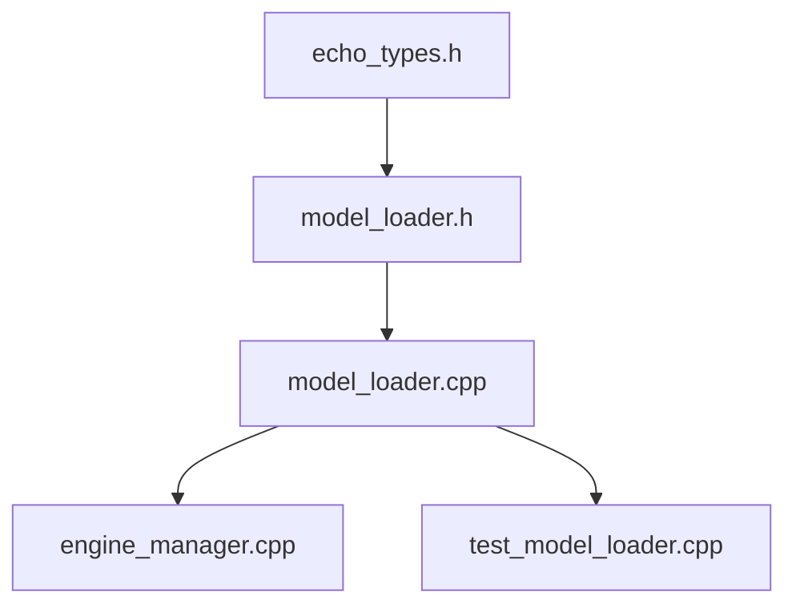

# Model Loader Core

<cite>
**Referenced Files in This Document**
- [model_loader.h](file://native/include/model_loader.h)
- [model_loader.cpp](file://native/src/model_loader.cpp)
- [echo_types.h](file://native/include/echo_types.h)
- [engine_manager.cpp](file://native/src/engine_manager.cpp)
- [test_model_loader.cpp](file://native/tests/test_model_loader.cpp)
</cite>

## Update Summary
**Changes Made**
- Updated quantization validation section to reflect expanded support for modern GGUF specifications
- Enhanced GGUF header parsing documentation to cover comprehensive metadata KV pair processing
- Added detailed coverage of advanced quantization type detection and compatibility validation
- Updated model loading flow diagrams to show sophisticated quantization determination logic
- Expanded error handling documentation for various quantization scheme failures

## Table of Contents
1. [Introduction](#introduction)
2. [Project Structure](#project-structure)
3. [Core Components](#core-components)
4. [Architecture Overview](#architecture-overview)
5. [Detailed Component Analysis](#detailed-component-analysis)
6. [Dependency Analysis](#dependency-analysis)
7. [Performance Considerations](#performance-considerations)
8. [Troubleshooting Guide](#troubleshooting-guide)
9. [Conclusion](#conclusion)

## Introduction
This document explains the Model Loader core functionality focused on GGUF model loading and validation. It details the multi-step validation performed by model_loader_load(), including file existence checks, permission verification, magic byte validation, comprehensive quantization format verification supporting modern GGUF specifications, memory-mapped file access via mmap for OS page cache optimization, and inference context creation for ASR, LLM, and TTS models. The loader now provides robust support for legacy INT4 formats, K-quants, and importance-matrix quantization schemes with sophisticated metadata parsing and fallback mechanisms.

## Project Structure
The Model Loader is implemented as a small C/C++ component with a clear separation between interface (header) and implementation:
- Interface: native/include/model_loader.h defines public API, data structures, and constants.
- Implementation: native/src/model_loader.cpp implements validation, mmap-based loading, and inference context management.
- Integration: native/src/engine_manager.cpp uses the loader to load ASR, LLM, and TTS models during engine initialization.
- Tests: native/tests/test_model_loader.cpp validates behavior across success and failure paths.



**Diagram sources**
- [engine_manager.cpp:60-100](file://native/src/engine_manager.cpp#L60-L100)
- [model_loader.h:1-157](file://native/include/model_loader.h#L1-L157)
- [model_loader.cpp:370-475](file://native/src/model_loader.cpp#L370-L475)
- [test_model_loader.cpp:128-373](file://native/tests/test_model_loader.cpp#L128-L373)

**Section sources**
- [model_loader.h:1-157](file://native/include/model_loader.h#L1-L157)
- [model_loader.cpp:1-569](file://native/src/model_loader.cpp#L1-L569)
- [engine_manager.cpp:60-100](file://native/src/engine_manager.cpp#L60-L100)
- [test_model_loader.cpp:128-373](file://native/tests/test_model_loader.cpp#L128-L373)

## Core Components
- ModelLoader: Aggregate that owns three slots (ASR, LLM, TTS), each holding file descriptor, mapped region, size, and an inference context pointer.
- ModelSlot: Per-model state including loaded flag, fd, mapped_data, file_size, mapped_size, and InferenceContext*.
- InferenceContext: Placeholder for per-model inference buffers; tracks estimated memory usage by model type.
- ModelInfo: Public reportable struct containing model type, file size, total memory usage (mmap + context), and loaded flag.
- Advanced GGUF parser: Comprehensive metadata KV pair processor with general.file_type extraction and tensor descriptor scanning.
- Quantization validator: Sophisticated system supporting legacy INT4, K-quants, and IQ variants with proper type mapping.

Key responsibilities:
- Validate GGUF files against modern specifications with comprehensive quantization support.
- Parse GGUF metadata KV pairs to extract canonical quantization information.
- Memory-map files for efficient access leveraging OS page cache.
- Create and manage inference contexts per model type.
- Provide safe lifecycle APIs: create, load, get_info, get_context, unload, destroy.

**Section sources**
- [model_loader.h:68-78](file://native/include/model_loader.h#L68-L78)
- [model_loader.cpp:31-50](file://native/src/model_loader.cpp#L31-L50)
- [model_loader.cpp:326-350](file://native/src/model_loader.cpp#L326-L350)
- [model_loader.h:70-78](file://native/include/model_loader.h#L70-L78)

## Architecture Overview
The Model Loader integrates into the engine initialization flow. The Engine Manager creates a ModelLoader instance and loads ASR, LLM, and TTS models sequentially. Each successful load maps the GGUF file, performs comprehensive quantization validation, and constructs an inference context. Errors are propagated back to the manager, which transitions to an error state and cleans up resources.



**Diagram sources**
- [engine_manager.cpp:60-100](file://native/src/engine_manager.cpp#L60-L100)
- [model_loader.cpp:370-475](file://native/src/model_loader.cpp#L370-L475)
- [model_loader.cpp:231-320](file://native/src/model_loader.cpp#L231-L320)
- [model_loader.cpp:527-568](file://native/src/model_loader.cpp#L527-L568)

## Detailed Component Analysis

### model_loader_load() Multi-Step Validation Flow
The function performs a strict sequence of checks and operations with enhanced GGUF specification support:
1. Parameter validation and slot selection.
2. File existence check using stat; returns missing if not found.
3. Permission verification using access(R_OK); returns permission denied if unreadable.
4. Regular file and non-zero size validation.
5. Open file descriptor and read GGUF header; verify magic bytes.
6. Memory-map the entire file with PROT_READ and MAP_PRIVATE; advise sequential access.
7. **Enhanced**: Parse GGUF metadata KV pairs to extract general.file_type or scan tensor descriptors for quantization type.
8. **Enhanced**: Validate quantization against comprehensive acceptance criteria (legacy INT4, K-quants, IQ variants).
9. Create inference context for the requested model type.
10. Populate slot fields and return success.



**Diagram sources**
- [model_loader.cpp:370-475](file://native/src/model_loader.cpp#L370-L475)
- [model_loader.cpp:231-320](file://native/src/model_loader.cpp#L231-L320)

**Section sources**
- [model_loader.cpp:370-475](file://native/src/model_loader.cpp#L370-L475)

### Enhanced GGUF Header and Quantization Validation
The system now provides comprehensive GGUF specification support with multiple quantization schemes:

**Supported Quantization Types:**
- **Legacy INT4**: Q4_0, Q4_1 (block-wise quantization)
- **K-quants**: Q3_K (~3.4 bpw), Q4_K (~4.5 bpw), Q5_K (~5.5 bpw), Q6_K (~6.6 bpw)
- **IQ Variants**: IQ4_NL (~4.5 bpw), IQ4_XS (~4.25 bpw) (importance-matrix quantization)

**Advanced Parsing Strategy:**
1. **Primary Method**: Parse metadata KV pairs to extract `general.file_type` - the canonical field set by conversion tools
2. **Fallback Method**: Scan tensor descriptors to find the first accepted quantization type
3. **Type Mapping**: Convert llama.cpp ftype values to ggml types using ftype_to_ggml_type()



**Diagram sources**
- [model_loader.h:26-63](file://native/include/model_loader.h#L26-L63)
- [model_loader.cpp:108-122](file://native/src/model_loader.cpp#L108-L122)
- [model_loader.cpp:231-320](file://native/src/model_loader.cpp#L231-L320)

**Section sources**
- [model_loader.h:32-52](file://native/include/model_loader.h#L32-L52)
- [model_loader.cpp:54-79](file://native/src/model_loader.cpp#L54-L79)
- [model_loader.cpp:231-320](file://native/src/model_loader.cpp#L231-L320)

### Comprehensive GGUF Metadata Parsing
The enhanced parser implements full GGUF v2/v3 specification compliance:

**Metadata Value Type Support:**
- Scalar types: UINT8, INT8, UINT16, INT16, UINT32, INT32, UINT64, INT64
- Floating point: FLOAT32, FLOAT64
- Special types: BOOL, STRING, ARRAY (with recursive element parsing)

**Two-Phase Quantization Detection:**
1. **Metadata Phase**: Iterate through all KV pairs looking for `general.file_type`
2. **Tensor Scanning Phase**: If metadata is absent, scan tensor descriptors for first accepted quant

**Robust Error Handling:**
- Boundary checking for all buffer accesses
- Graceful fallback when metadata is incomplete
- Rejection of unsupported quantization schemes

```mermaid
sequenceDiagram
participant GP as "GGUF Parser"
participant Data as "Mapped File Data"
GP->>Data : Read header (magic, version, counts)
GP->>Data : Iterate metadata_kv_count times
loop For each KV pair
GP->>Data : Read key length + key bytes
GP->>Data : Read value type (uint32)
alt Key is "general.file_type" AND value is UINT32
GP->>GP : Extract file_type value
GP->>GP : Convert ftype to ggml type
GP->>GP : Store as representative quant
end
GP->>Data : Skip value based on type
end
alt No general.file_type found
GP->>Data : Iterate tensor_count tensors
loop For each tensor
GP->>Data : Read name_len + name
GP->>Data : Read n_dims + dims array
GP->>Data : Read tensor_type
alt tensor_type is accepted quant
GP->>GP : Use tensor_type as representative
return success
end
end
end
```

**Diagram sources**
- [model_loader.cpp:231-320](file://native/src/model_loader.cpp#L231-L320)
- [model_loader.cpp:154-190](file://native/src/model_loader.cpp#L154-L190)

**Section sources**
- [model_loader.cpp:108-122](file://native/src/model_loader.cpp#L108-L122)
- [model_loader.cpp:154-190](file://native/src/model_loader.cpp#L154-L190)
- [model_loader.cpp:231-320](file://native/src/model_loader.cpp#L231-L320)

### Memory-Mapped File Access via mmap
- The file is opened read-only and memory-mapped with PROT_READ and MAP_PRIVATE.
- madvise(MADV_SEQUENTIAL) hints sequential access to optimize OS page cache behavior.
- On any error path after mapping, munmap and close are called to avoid leaks.



**Diagram sources**
- [model_loader.cpp:428-436](file://native/src/model_loader.cpp#L428-L436)

**Section sources**
- [model_loader.cpp:428-436](file://native/src/model_loader.cpp#L428-L436)

### Inference Context Creation and Management
- create_inference_context allocates an InferenceContext and estimates memory usage based on model type:
  - ASR: ~64 MB
  - LLM: ~128 MB  
  - TTS: ~32 MB
- These values are placeholders for real ggml buffer allocations and are included in memory_usage reporting.



**Diagram sources**
- [model_loader.cpp:31-50](file://native/src/model_loader.cpp#L31-L50)
- [model_loader.cpp:326-350](file://native/src/model_loader.cpp#L326-L350)

**Section sources**
- [model_loader.cpp:326-350](file://native/src/model_loader.cpp#L326-L350)

### Resource Cleanup Patterns
- model_loader_unload frees the inference context, unmaps the file, closes the file descriptor, and resets slot state.
- model_loader_destroy iterates all slots and calls unload, then frees the loader.
- Error paths in model_loader_load ensure consistent cleanup (munmap/close/free) before returning errors.



**Diagram sources**
- [model_loader.cpp:527-557](file://native/src/model_loader.cpp#L527-L557)
- [model_loader.cpp:559-568](file://native/src/model_loader.cpp#L559-L568)

**Section sources**
- [model_loader.cpp:527-568](file://native/src/model_loader.cpp#L527-L568)

### ModelInfo Structure for Status Reporting and Memory Tracking
- Fields:
  - type: ModelType (ASR, LLM, TTS)
  - file_size: Size of the model file on disk
  - memory_usage: Sum of mapped region size plus inference context memory
  - loaded: 1 if loaded and ready, 0 otherwise
- model_loader_get_info populates these fields safely even when the model is not loaded.



**Diagram sources**
- [model_loader.h:70-78](file://native/include/model_loader.h#L70-L78)
- [model_loader.cpp:477-499](file://native/src/model_loader.cpp#L477-L499)

**Section sources**
- [model_loader.h:70-78](file://native/include/model_loader.h#L70-L78)
- [model_loader.cpp:477-499](file://native/src/model_loader.cpp#L477-L499)

### Concrete Usage Examples from the Codebase
- Engine Manager initialization loads ASR, LLM, and TTS models sequentially and handles errors by destroying the loader and transitioning to error state.
- Unit tests cover:
  - Successful loading of valid INT4 GGUF files
  - Rejection of bad magic bytes
  - Rejection of non-accepted quantization (e.g., FP16, Q2_K)
  - Permission denial scenarios
  - Independent loading of all three model types
  - Memory usage reporting correctness
  - Reloading same slot replaces previous model without leaking
  - Empty file rejection
  - get_context returning NULL for unloaded models
  - **New**: Support for K-quants (Q4_K) and IQ variants

These examples demonstrate proper workflows, error categorization, and resource cleanup with comprehensive quantization support.

**Section sources**
- [engine_manager.cpp:60-100](file://native/src/engine_manager.cpp#L60-100)
- [test_model_loader.cpp:128-373](file://native/tests/test_model_loader.cpp#L128-373)

## Dependency Analysis
- Internal dependencies:
  - model_loader.cpp depends on echo_types.h for ModelType and EchoErrorCode definitions.
  - model_loader.cpp uses POSIX APIs (stat, access, open, mmap, madvise, munmap, close).
- External integration:
  - engine_manager.cpp orchestrates model loading across ASR, LLM, TTS.
  - Stages (ASR, LLM, TTS) will consume inference contexts via model_loader_get_context in production flows.



**Diagram sources**
- [echo_types.h:48-62](file://native/include/echo_types.h#L48-L62)
- [model_loader.h:1-157](file://native/include/model_loader.h#L1-L157)
- [model_loader.cpp:1-569](file://native/src/model_loader.cpp#L1-L569)
- [engine_manager.cpp:60-100](file://native/src/engine_manager.cpp#L60-L100)
- [test_model_loader.cpp:128-373](file://native/tests/test_model_loader.cpp#L128-L373)

**Section sources**
- [echo_types.h:48-62](file://native/include/echo_types.h#L48-L62)
- [model_loader.h:1-157](file://native/include/model_loader.h#L1-L157)
- [model_loader.cpp:1-569](file://native/src/model_loader.cpp#L1-L569)
- [engine_manager.cpp:60-100](file://native/src/engine_manager.cpp#L60-L100)
- [test_model_loader.cpp:128-373](file://native/tests/test_model_loader.cpp#L128-L373)

## Performance Considerations
- mmap with PROT_READ and MAP_PRIVATE enables zero-copy access to model weights while leveraging the OS page cache.
- madvise(MADV_SEQUENTIAL) hints sequential access patterns to improve prefetching and reduce page faults.
- Memory usage reported includes both the mapped region and inference context buffers; this aids runtime monitoring and capacity planning.
- Placeholder inference context sizes provide conservative estimates; production should measure actual ggml allocations.
- **Enhanced**: Comprehensive quantization validation occurs during load time, preventing runtime failures and ensuring optimal performance for supported quantization schemes.

## Troubleshooting Guide
Common error categories and their causes:
- ECHO_ERR_MODEL_MISSING: File does not exist or cannot be accessed due to path issues.
- ECHO_ERR_MODEL_PERMISSION: File exists but is not readable (permission denied).
- ECHO_ERR_MODEL_INVALID: File is not a regular file, empty, lacks correct GGUF magic, or has unsupported quantization (non-accepted schemes like F32/F16/Q2_K).
- ECHO_ERR_MEMORY: mmap fails or inference context allocation fails.

**Enhanced Quantization-Specific Issues:**
- Models with only F32/F16 quantization are rejected as too large for mobile deployment.
- Q2_K quantization is rejected due to quality degradation for real-time interpretation.
- Mixed-precision models without general.file_type metadata fall back to tensor descriptor scanning.

Diagnostic tips:
- Verify file path and permissions before calling model_loader_load.
- Ensure the GGUF file contains correct magic bytes and accepted quantization (INT4, K-quants, or IQ variants).
- Check system limits for memory mapping and available virtual address space.
- Use model_loader_get_info to inspect file_size and memory_usage after load attempts.
- **New**: Verify GGUF files contain either general.file_type metadata or properly quantized tensors.

**Section sources**
- [model_loader.cpp:370-475](file://native/src/model_loader.cpp#L370-L475)
- [model_loader.cpp:477-499](file://native/src/model_loader.cpp#L477-L499)
- [echo_types.h:48-62](file://native/include/echo_types.h#L48-L62)

## Conclusion
The Model Loader provides robust GGUF model validation with comprehensive support for modern quantization specifications, efficient memory-mapped access, and per-model inference context management for ASR, LLM, and TTS. Its enhanced multi-step validation ensures early detection of invalid or inaccessible models while supporting legacy INT4, K-quants, and IQ variants through sophisticated metadata parsing and tensor descriptor scanning. The mmap-based approach leverages OS page cache for optimal performance, and the ModelInfo structure offers clear visibility into model status and memory consumption. Comprehensive unit tests validate success and error paths across all supported quantization schemes, and the Engine Manager demonstrates proper integration and resource cleanup patterns.