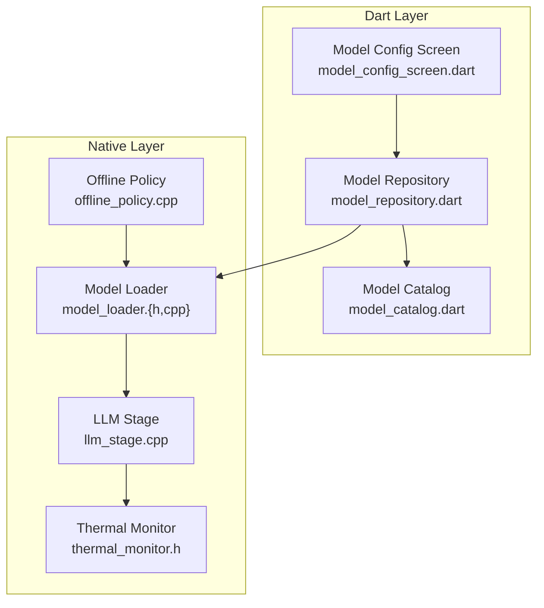
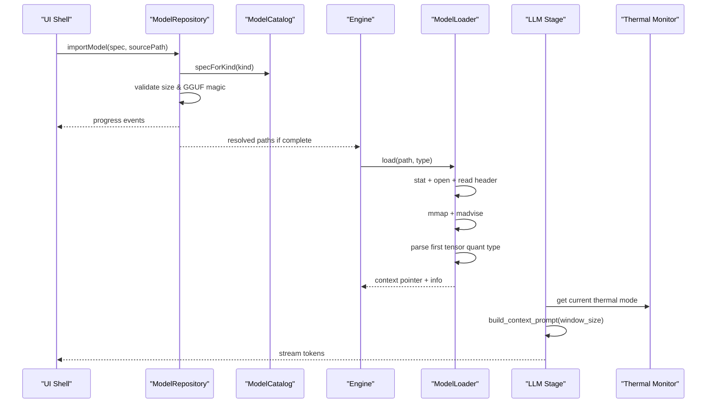
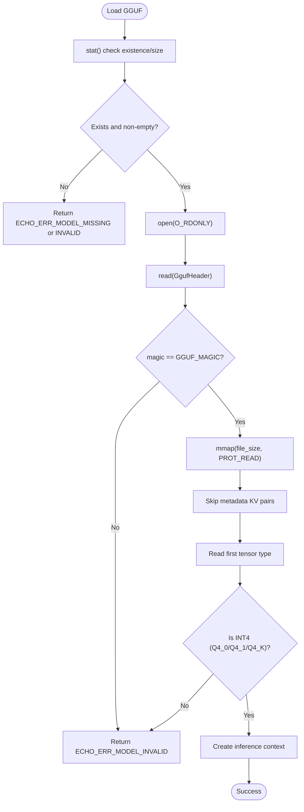
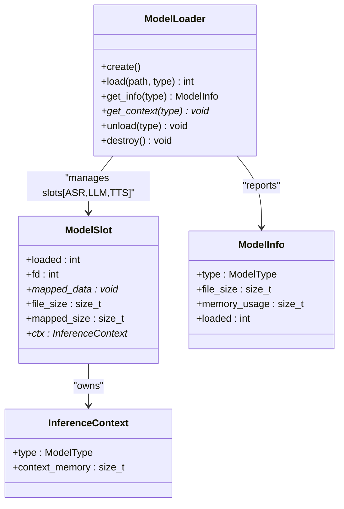
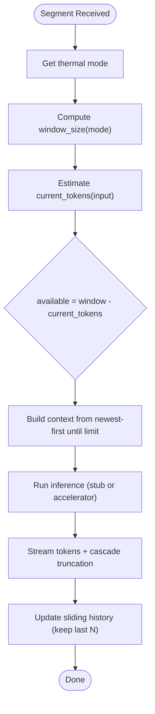
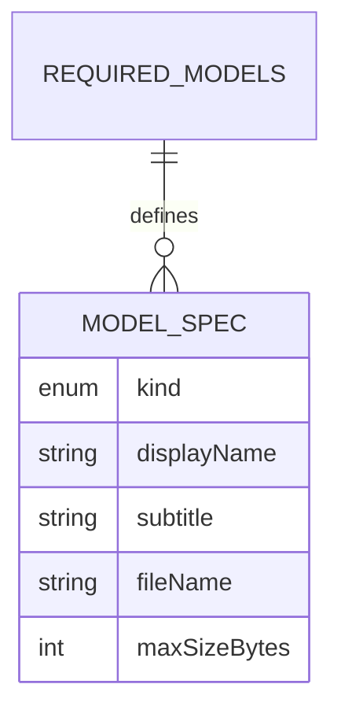
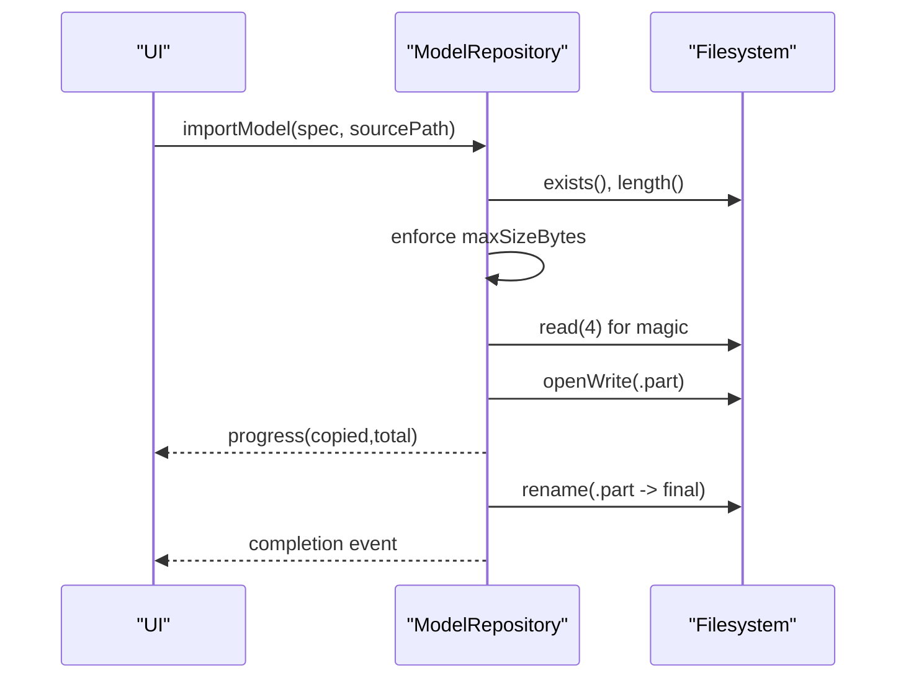
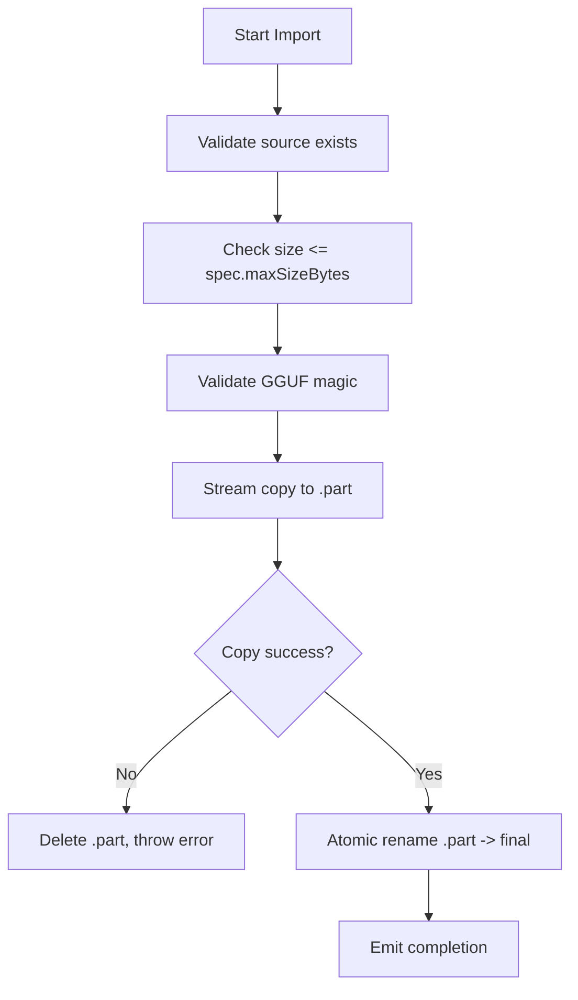
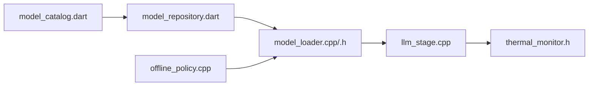

# Model Management System

<cite>
**Referenced Files in This Document**
- [model_loader.h](file://native/include/model_loader.h)
- [model_loader.cpp](file://native/src/model_loader.cpp)
- [test_model_loader.cpp](file://native/tests/test_model_loader.cpp)
- [echo_types.h](file://native/include/echo_types.h)
- [llm_stage.cpp](file://native/src/llm_stage.cpp)
- [thermal_monitor.h](file://native/include/thermal_monitor.h)
- [offline_policy.cpp](file://native/src/offline_policy.cpp)
- [model_catalog.dart](file://lib/src/model/model_catalog.dart)
- [model_repository.dart](file://lib/src/model/model_repository.dart)
- [model_config_screen.dart](file://lib/src/ui/model_config_screen.dart)
</cite>

## Table of Contents
1. [Introduction](#introduction)
2. [Project Structure](#project-structure)
3. [Core Components](#core-components)
4. [Architecture Overview](#architecture-overview)
5. [Detailed Component Analysis](#detailed-component-analysis)
6. [Dependency Analysis](#dependency-analysis)
7. [Performance Considerations](#performance-considerations)
8. [Troubleshooting Guide](#troubleshooting-guide)
9. [Conclusion](#conclusion)
10. [Appendices](#appendices)

## Introduction
This document explains QwenEcho’s model management system with a focus on GGUF model loading and validation, context window management for performance, and the model catalog/repository for metadata and version control. It covers:
- GGUF/INT4 quantized model format structure and validation procedures
- The native Model Loader’s file parsing, verification, and memory-mapped loading mechanisms
- Dynamic context window adjustment for LLM inference based on thermal state
- Model Catalog metadata and Model Repository provisioning workflows
- Examples for adding new models, validating integrity, managing storage, and implementing update workflows
- Security, integrity checking, and rollback strategies

## Project Structure
The model management system spans Dart (Flutter) and C++ native layers:
- Dart layer: Model Catalog (metadata), Model Repository (provisioning and validation), UI screen (configuration)
- Native layer: Model Loader (GGUF parsing, mmap, inference contexts), LLM Stage (dynamic context window), Thermal Monitor (mode transitions), Offline Policy (security checks)

**Diagram sources**
- [model_catalog.dart:1-81](file://lib/src/model/model_catalog.dart#L1-L81)
- [model_repository.dart:1-256](file://lib/src/model/model_repository.dart#L1-L256)
- [model_config_screen.dart:117-221](file://lib/src/ui/model_config_screen.dart#L117-L221)
- [model_loader.h:1-142](file://native/include/model_loader.h#L1-L142)
- [model_loader.cpp:1-460](file://native/src/model_loader.cpp#L1-L460)
- [llm_stage.cpp:1-412](file://native/src/llm_stage.cpp#L1-L412)
- [thermal_monitor.h:1-46](file://native/include/thermal_monitor.h#L1-L46)
- [offline_policy.cpp:33-218](file://native/src/offline_policy.cpp#L33-L218)

**Section sources**
- [model_catalog.dart:1-81](file://lib/src/model/model_catalog.dart#L1-L81)
- [model_repository.dart:1-256](file://lib/src/model/model_repository.dart#L1-L256)
- [model_loader.h:1-142](file://native/include/model_loader.h#L1-L142)
- [model_loader.cpp:1-460](file://native/src/model_loader.cpp#L1-L460)
- [llm_stage.cpp:1-412](file://native/src/llm_stage.cpp#L1-L412)
- [thermal_monitor.h:1-46](file://native/include/thermal_monitor.h#L1-L46)
- [offline_policy.cpp:33-218](file://native/src/offline_policy.cpp#L33-L218)

## Core Components
- Model Catalog: Defines required models, filenames, display metadata, and size ceilings.
- Model Repository: Manages sandboxed storage, imports GGUF files safely, validates magic bytes, reports status, and resolves paths for the engine.
- Model Loader: Validates GGUF headers, verifies INT4 quantization, memory-maps files, and creates per-model inference contexts.
- LLM Stage: Maintains sliding context history and dynamically adjusts context window size based on thermal mode.
- Thermal Monitor: Drives Normal/Throttle/Critical modes; LLM stage adapts context accordingly.
- Offline Policy: Enforces sandbox path constraints and absence of network libraries.

Key responsibilities and interactions are detailed in subsequent sections.

**Section sources**
- [model_catalog.dart:1-81](file://lib/src/model/model_catalog.dart#L1-L81)
- [model_repository.dart:1-256](file://lib/src/model/model_repository.dart#L1-L256)
- [model_loader.h:1-142](file://native/include/model_loader.h#L1-L142)
- [model_loader.cpp:1-460](file://native/src/model_loader.cpp#L1-L460)
- [llm_stage.cpp:1-412](file://native/src/llm_stage.cpp#L1-L412)
- [thermal_monitor.h:1-46](file://native/include/thermal_monitor.h#L1-L46)
- [offline_policy.cpp:33-218](file://native/src/offline_policy.cpp#L33-L218)

## Architecture Overview
End-to-end flow from user action to model execution:
- User selects a GGUF file via UI
- Model Repository validates and copies into sandbox atomically
- Engine requests model paths only when all models are ready
- Native Model Loader validates GGUF header, quantization, maps file, and initializes inference contexts
- LLM Stage builds prompts using sliding context and dynamic window sizing based on thermal mode

**Diagram sources**
- [model_repository.dart:145-211](file://lib/src/model/model_repository.dart#L145-L211)
- [model_catalog.dart:54-76](file://lib/src/model/model_catalog.dart#L54-L76)
- [model_loader.cpp:284-379](file://native/src/model_loader.cpp#L284-L379)
- [llm_stage.cpp:116-156](file://native/src/llm_stage.cpp#L116-L156)
- [thermal_monitor.h:1-46](file://native/include/thermal_monitor.h#L1-L46)

## Detailed Component Analysis

### GGUF/INT4 Format and Validation
- Magic bytes: Little-endian “GGUF” (0x46475547).
- Header fields include version, tensor count, and metadata KV count.
- Quantization types supported for acceptance include Q4_0, Q4_1, and Q4_K (INT4 variants).
- Validation procedure:
  - Check existence and permissions
  - Read header and verify magic
  - Parse metadata KV pairs to reach tensor descriptors
  - Read first tensor’s type field and ensure it is an accepted INT4 variant
  - Memory-map the file and create inference context

**Diagram sources**
- [model_loader.cpp:284-379](file://native/src/model_loader.cpp#L284-L379)
- [model_loader.h:26-60](file://native/include/model_loader.h#L26-L60)

**Section sources**
- [model_loader.h:26-60](file://native/include/model_loader.h#L26-L60)
- [model_loader.cpp:167-235](file://native/src/model_loader.cpp#L167-L235)
- [test_model_loader.cpp:26-120](file://native/tests/test_model_loader.cpp#L26-L120)

### Model Loader Implementation Details
- File descriptor lifecycle: opened once per slot, closed on unload/destroy
- Memory mapping: uses MAP_PRIVATE | PROT_READ; optional MADV_SEQUENTIAL hint
- Inference context: placeholder allocation sized by model type; actual ggml integration point
- Error categorization: missing, permission denied, invalid format, memory errors
- Per-model info: file size, mapped size, total memory usage (mapped + context)

**Diagram sources**
- [model_loader.h:65-75](file://native/include/model_loader.h#L65-L75)
- [model_loader.cpp:24-42](file://native/src/model_loader.cpp#L24-L42)

**Section sources**
- [model_loader.h:65-135](file://native/include/model_loader.h#L65-L135)
- [model_loader.cpp:269-459](file://native/src/model_loader.cpp#L269-L459)

### Context Management and Dynamic Window Adjustment
- Sliding context history keeps last N translations (default 3)
- Token estimation heuristic used to bound context within active window
- Active window size depends on thermal mode:
  - Normal: larger window
  - Throttle: smaller window
- On thermal transition mid-segment, the segment continues with its original window; next segment applies new window

**Diagram sources**
- [llm_stage.cpp:116-156](file://native/src/llm_stage.cpp#L116-L156)
- [llm_stage.cpp:243-361](file://native/src/llm_stage.cpp#L243-L361)
- [thermal_monitor.h:26-46](file://native/include/thermal_monitor.h#L26-L46)

**Section sources**
- [llm_stage.cpp:43-51](file://native/src/llm_stage.cpp#L43-L51)
- [llm_stage.cpp:107-156](file://native/src/llm_stage.cpp#L107-L156)
- [llm_stage.cpp:243-361](file://native/src/llm_stage.cpp#L243-L361)
- [thermal_monitor.h:26-46](file://native/include/thermal_monitor.h#L26-L46)

### Model Catalog Metadata and Version Control
- ModelSpec defines kind, display name, subtitle, filename, and maximum allowed size
- kRequiredModels enumerates ASR, LLM, TTS artifacts with expected filenames and ceilings
- specForKind provides lookup by pipeline stage

**Diagram sources**
- [model_catalog.dart:26-76](file://lib/src/model/model_catalog.dart#L26-L76)

**Section sources**
- [model_catalog.dart:1-81](file://lib/src/model/model_catalog.dart#L1-L81)

### Model Repository Provisioning and Integrity Checks
- Sandbox directory resolution under application support
- Import workflow:
  - Validate source exists and non-empty
  - Enforce size ceiling from catalog
  - Validate GGUF magic before copying
  - Stream copy to temp file, then atomic rename
  - Emit progress events
- Status queries: present, size, validGguf, completeness across all models
- Path resolution returns map of kind→path only when all models are ready

**Diagram sources**
- [model_repository.dart:145-211](file://lib/src/model/model_repository.dart#L145-L211)
- [model_repository.dart:225-240](file://lib/src/model/model_repository.dart#L225-L240)

**Section sources**
- [model_repository.dart:76-256](file://lib/src/model/model_repository.dart#L76-L256)

### Security, Integrity Checking, and Rollback Strategies
- Security:
  - Paths validated to be within app sandbox
  - No network libraries loaded at runtime
- Integrity:
  - GGUF magic validation both in Dart and native layers
  - Size ceilings enforced per model spec
- Rollback:
  - Atomic rename ensures partial imports do not corrupt final model files
  - Delete operation is safe even if absent

**Diagram sources**
- [model_repository.dart:145-211](file://lib/src/model/model_repository.dart#L145-L211)
- [offline_policy.cpp:164-183](file://native/src/offline_policy.cpp#L164-L183)

**Section sources**
- [offline_policy.cpp:33-218](file://native/src/offline_policy.cpp#L33-L218)
- [model_repository.dart:145-211](file://lib/src/model/model_repository.dart#L145-L211)

## Dependency Analysis
High-level dependencies between components:

**Diagram sources**
- [model_catalog.dart:1-81](file://lib/src/model/model_catalog.dart#L1-L81)
- [model_repository.dart:1-256](file://lib/src/model/model_repository.dart#L1-L256)
- [model_loader.h:1-142](file://native/include/model_loader.h#L1-L142)
- [model_loader.cpp:1-460](file://native/src/model_loader.cpp#L1-L460)
- [llm_stage.cpp:1-412](file://native/src/llm_stage.cpp#L1-L412)
- [thermal_monitor.h:1-46](file://native/include/thermal_monitor.h#L1-L46)
- [offline_policy.cpp:33-218](file://native/src/offline_policy.cpp#L33-L218)

**Section sources**
- [model_catalog.dart:1-81](file://lib/src/model/model_catalog.dart#L1-L81)
- [model_repository.dart:1-256](file://lib/src/model/model_repository.dart#L1-L256)
- [model_loader.h:1-142](file://native/include/model_loader.h#L1-L142)
- [model_loader.cpp:1-460](file://native/src/model_loader.cpp#L1-L460)
- [llm_stage.cpp:1-412](file://native/src/llm_stage.cpp#L1-L412)
- [thermal_monitor.h:1-46](file://native/include/thermal_monitor.h#L1-L46)
- [offline_policy.cpp:33-218](file://native/src/offline_policy.cpp#L33-L218)

## Performance Considerations
- Memory-mapped access leverages OS page cache; sequential access hint improves prefetch behavior
- Context window reduction in throttle mode reduces token processing and memory pressure
- Streaming copy avoids large in-memory buffers during import
- Placeholder inference context sizes can be tuned per model family for accurate reporting

[No sources needed since this section provides general guidance]

## Troubleshooting Guide
Common issues and diagnostics:
- Missing or unreadable model files: loader returns specific error codes; repository status shows present=false
- Invalid GGUF format: magic mismatch or unsupported quantization leads to invalid format error
- Permission errors: sandbox path validation fails or file lacks read permission
- Memory errors: mmap failures or insufficient resources
- Partial imports: .part files indicate interrupted copy; delete and retry

Operational tips:
- Use repository statusAll to inspect readiness across all models
- Verify sandbox paths and absence of external libraries via offline policy checks
- For reloads, loader automatically unloads previous model in the same slot

**Section sources**
- [model_loader.cpp:284-379](file://native/src/model_loader.cpp#L284-L379)
- [test_model_loader.cpp:150-202](file://native/tests/test_model_loader.cpp#L150-L202)
- [offline_policy.cpp:164-183](file://native/src/offline_policy.cpp#L164-L183)
- [model_repository.dart:101-143](file://lib/src/model/model_repository.dart#L101-L143)

## Conclusion
QwenEcho’s model management system integrates robust GGUF validation, efficient memory-mapped loading, adaptive context windows, and secure, sandboxed provisioning. The catalog-driven approach simplifies updates and rollbacks while maintaining strict security and integrity guarantees.

[No sources needed since this section summarizes without analyzing specific files]

## Appendices

### Adding a New Model
- Define a new ModelSpec in the catalog with filename and size ceiling
- Ensure the artifact follows GGUF v2/v3 with INT4 quantization
- Provide a test case that constructs a minimal valid GGUF binary and exercises loader paths

**Section sources**
- [model_catalog.dart:54-76](file://lib/src/model/model_catalog.dart#L54-L76)
- [test_model_loader.cpp:26-120](file://native/tests/test_model_loader.cpp#L26-L120)

### Validating Model Integrity
- Validate GGUF magic early in Dart layer
- Enforce size limits per catalog
- Native loader performs deeper validation including quantization type

**Section sources**
- [model_repository.dart:145-211](file://lib/src/model/model_repository.dart#L145-L211)
- [model_loader.cpp:167-235](file://native/src/model_loader.cpp#L167-L235)

### Managing Model Storage
- Use repository methods to resolve paths, import, and delete models
- Prefer atomic operations to avoid partial states

**Section sources**
- [model_repository.dart:84-143](file://lib/src/model/model_repository.dart#L84-L143)

### Implementing Model Update Workflows
- Replace existing model by deleting and re-importing
- Use atomic rename to ensure consistency
- Re-check completeness before restarting engine

**Section sources**
- [model_repository.dart:213-219](file://lib/src/model/model_repository.dart#L213-L219)
- [model_repository.dart:136-143](file://lib/src/model/model_repository.dart#L136-L143)

### Model Security and Rollback
- Enforce sandbox-only paths and no network libraries
- Atomic import and safe delete provide reliable rollback semantics

**Section sources**
- [offline_policy.cpp:164-183](file://native/src/offline_policy.cpp#L164-L183)
- [model_repository.dart:145-211](file://lib/src/model/model_repository.dart#L145-L211)