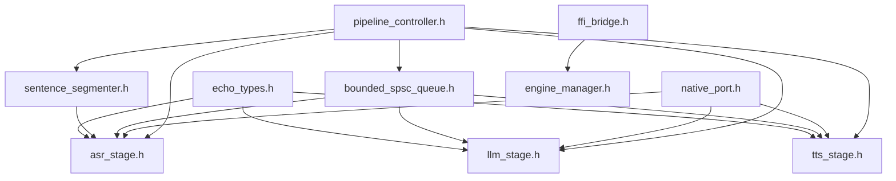
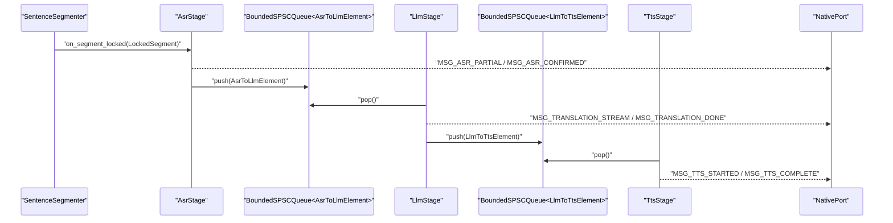
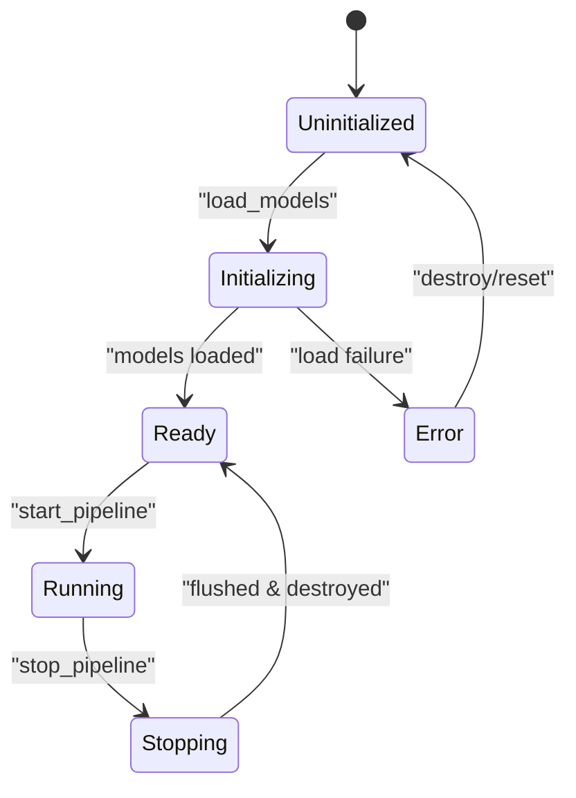
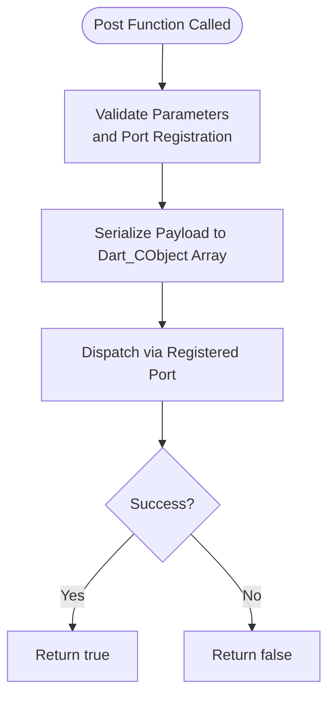
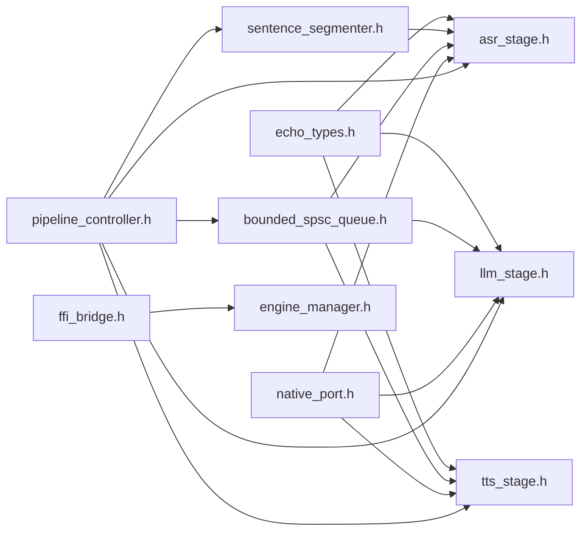

# Echo Types System

<cite>
**Referenced Files in This Document**
- [echo_types.h](file://native/include/echo_types.h)
- [sentence_segmenter.h](file://native/include/sentence_segmenter.h)
- [bounded_spsc_queue.h](file://native/include/bounded_spsc_queue.h)
- [asr_stage.h](file://native/include/asr_stage.h)
- [llm_stage.h](file://native/include/llm_stage.h)
- [tts_stage.h](file://native/include/tts_stage.h)
- [native_port.h](file://native/include/native_port.h)
- [ffi_bridge.h](file://native/include/ffi_bridge.h)
- [engine_manager.h](file://native/include/engine_manager.h)
- [pipeline_controller.h](file://native/include/pipeline_controller.h)
- [pipeline_controller.cpp](file://native/src/pipeline_controller.cpp)
- [test_echo_types.cpp](file://native/tests/test_echo_types.cpp)
</cite>

## Table of Contents
1. [Introduction](#introduction)
2. [Project Structure](#project-structure)
3. [Core Components](#core-components)
4. [Architecture Overview](#architecture-overview)
5. [Detailed Component Analysis](#detailed-component-analysis)
6. [Dependency Analysis](#dependency-analysis)
7. [Performance Considerations](#performance-considerations)
8. [Troubleshooting Guide](#troubleshooting-guide)
9. [Conclusion](#conclusion)
10. [Appendices](#appendices)

## Introduction
This document describes the EchoTypes system: the shared data structures and type definitions used across the native engine for inter-stage communication, lifecycle management, error reporting, and UI messaging. It focuses on core enums (EngineState, MessageType, EchoErrorCode), complex data structures (LockedSegment, AsrToLlmElement, LlmToTtsElement), memory layout and alignment considerations, lifetime rules, validation patterns, conversion utilities, platform compatibility, and threading implications.

## Project Structure
The EchoTypes system is centered around a small set of C/C++ headers that define the cross-component contracts:
- Core types and enums are defined in echo_types.h.
- Inter-stage elements and segmenting primitives are defined in sentence_segmenter.h and bounded_spsc_queue.h.
- Stage interfaces consume and produce these types in asr_stage.h, llm_stage.h, tts_stage.h.
- NativePort provides typed message dispatch to the Flutter UI using MessageType tags.
- FFI bridge exposes C-linkage entry points that orchestrate lifecycle and port registration.
- Engine manager and pipeline controller coordinate creation, wiring, and graceful shutdown.

**Diagram sources**
- [echo_types.h:1-136](file://native/include/echo_types.h#L1-L136)
- [sentence_segmenter.h:1-142](file://native/include/sentence_segmenter.h#L1-L142)
- [bounded_spsc_queue.h:1-145](file://native/include/bounded_spsc_queue.h#L1-L145)
- [asr_stage.h:1-104](file://native/include/asr_stage.h#L1-L104)
- [llm_stage.h:1-93](file://native/include/llm_stage.h#L1-L93)
- [tts_stage.h:1-79](file://native/include/tts_stage.h#L1-L79)
- [native_port.h:1-179](file://native/include/native_port.h#L1-L179)
- [ffi_bridge.h:1-84](file://native/include/ffi_bridge.h#L1-L84)
- [engine_manager.h:1-104](file://native/include/engine_manager.h#L1-L104)
- [pipeline_controller.h:1-107](file://native/include/pipeline_controller.h#L1-L107)

**Section sources**
- [echo_types.h:1-136](file://native/include/echo_types.h#L1-L136)
- [sentence_segmenter.h:1-142](file://native/include/sentence_segmenter.h#L1-L142)
- [bounded_spsc_queue.h:1-145](file://native/include/bounded_spsc_queue.h#L1-L145)
- [asr_stage.h:1-104](file://native/include/asr_stage.h#L1-L104)
- [llm_stage.h:1-93](file://native/include/llm_stage.h#L1-L93)
- [tts_stage.h:1-79](file://native/include/tts_stage.h#L1-L79)
- [native_port.h:1-179](file://native/include/native_port.h#L1-L179)
- [ffi_bridge.h:1-84](file://native/include/ffi_bridge.h#L1-L84)
- [engine_manager.h:1-104](file://native/include/engine_manager.h#L1-L104)
- [pipeline_controller.h:1-107](file://native/include/pipeline_controller.h#L1-L107)

## Core Components
This section documents the central enums and data structures that form the EchoTypes system.

### Enums
- EngineState: Lifecycle states for the engine with transitions documented in comments. Valid values include Uninitialized, Initializing, Ready, Running, Stopping, Error.
- MessageType: Tags for messages sent from the engine to the UI shell via Native Port. Includes ASR partial/confirmed, translation stream/done, TTS started/completed, error, thermal state, memory warning, latency warning, sample drop.
- EchoErrorCode: Standardized return codes for all C-linkage entry points; 0 indicates success, negative values indicate specific errors such as not initialized, already initialized, model missing/invalid/permission, memory issues, unsupported language, session active/no session, no port, engine not ready, thermal critical.

Usage contexts:
- EngineState is used by the engine manager to enforce lifecycle guards and report status.
- MessageType is consumed by the UI layer after being serialized and posted through Native Port.
- EchoErrorCode is returned by FFI entry points and internal APIs to signal outcomes.

**Section sources**
- [echo_types.h:17-62](file://native/include/echo_types.h#L17-L62)
- [engine_manager.h:1-104](file://native/include/engine_manager.h#L1-L104)
- [ffi_bridge.h:1-84](file://native/include/ffi_bridge.h#L1-L84)

### Data Structures
- LockedSegment: Represents a locked audio segment produced by the Sentence Segmenter. Contains pointers to PCM samples, sample count, segment ID, speaker ID, and timestamp. Ownership and lifetime are governed by the segmenter callback contract.
- AsrToLlmElement: Inter-stage element from ASR to LLM containing segment ID, speaker ID, confirmed UTF-8 text buffer, length, and timestamp.
- LlmToTtsElement: Inter-stage element from LLM to TTS containing segment ID, speaker ID, translated UTF-8 text buffer, length, and timestamp.
- EngineConfig: Configuration structure provided at initialization, including model paths, pipeline parameters, ring buffer capacity, thermal thresholds, memory limits, LLM context sizes, sentence segmenter thresholds, and audio sample rates.

Validation and usage:
- LockedSegment is passed into ASR processing; it must be treated as read-only during the callback scope unless explicitly copied.
- AsrToLlmElement and LlmToTtsElement are enqueued into bounded SPSC queues and consumed asynchronously by downstream stages. Text buffers are null-terminated UTF-8 strings.
- EngineConfig fields must remain valid for the lifetime of the engine; defaults are documented in comments and validated by tests.

**Section sources**
- [sentence_segmenter.h:40-58](file://native/include/sentence_segmenter.h#L40-L58)
- [echo_types.h:64-129](file://native/include/echo_types.h#L64-L129)
- [asr_stage.h:58-79](file://native/include/asr_stage.h#L58-L79)
- [llm_stage.h:48-62](file://native/include/llm_stage.h#L48-L62)
- [tts_stage.h:45-59](file://native/include/tts_stage.h#L45-L59)

## Architecture Overview
EchoTypes underpins the end-to-end pipeline: Audio Collector → Ring Buffer → Sentence Segmenter → ASR → LLM → TTS → Audio Output. The inter-stage queues carry AsrToLlmElement and LlmToTtsElement between stages. NativePort posts MessageType-tagged events to the UI.

**Diagram sources**
- [sentence_segmenter.h:52-58](file://native/include/sentence_segmenter.h#L52-L58)
- [asr_stage.h:58-79](file://native/include/asr_stage.h#L58-L79)
- [bounded_spsc_queue.h:29-145](file://native/include/bounded_spsc_queue.h#L29-L145)
- [llm_stage.h:48-62](file://native/include/llm_stage.h#L48-L62)
- [tts_stage.h:45-59](file://native/include/tts_stage.h#L45-L59)
- [native_port.h:100-172](file://native/include/native_port.h#L100-L172)

## Detailed Component Analysis

### EngineState and Lifecycle Guards
- States: Uninitialized, Initializing, Ready, Running, Stopping, Error.
- Transitions:
  - Uninitialized → Initializing → Ready (success) or Error (failure).
  - Ready → Running (start pipeline).
  - Running → Stopping → Ready (graceful stop).
  - Error → Uninitialized (reset/destroy).
- Guards enforced by engine manager:
  - Load models only when Uninitialized; otherwise return ECHO_ERR_ALREADY_INIT.
  - Start pipeline only when Ready; otherwise return ECHO_ERR_ENGINE_NOT_READY.
  - Prevent concurrent sessions; return ECHO_ERR_SESSION_ACTIVE if running.
  - Stop pipeline returns ECHO_OK even if no session is active (no-op).

**Diagram sources**
- [engine_manager.h:6-16](file://native/include/engine_manager.h#L6-L16)
- [engine_manager.h:53-81](file://native/include/engine_manager.h#L53-L81)

**Section sources**
- [engine_manager.h:1-104](file://native/include/engine_manager.h#L1-L104)
- [echo_types.h:17-24](file://native/include/echo_types.h#L17-L24)

### MessageType and NativePort Messaging
- Message types include ASR partial/confirmed, translation stream/done, TTS started/completed, error, thermal state, memory warning, latency warning, sample drop.
- Each post function serializes a Dart_CObject array and posts via the registered port.
- Usage patterns:
  - ASR stage streams partial tokens and confirms final text.
  - LLM stage streams translation tokens and signals completion.
  - TTS stage signals start and completion per segment.
  - Monitors post warnings and state changes.

**Diagram sources**
- [native_port.h:100-172](file://native/include/native_port.h#L100-L172)

**Section sources**
- [native_port.h:1-179](file://native/include/native_port.h#L1-L179)
- [echo_types.h:30-42](file://native/include/echo_types.h#L30-L42)

### EchoErrorCode and Error Handling
- All C-linkage entry points return int32_t where 0 is success and negative values map to specific errors.
- Common errors:
  - Not initialized, already initialized, model missing/invalid/permission.
  - Memory allocation failures.
  - Unsupported language codes.
  - Session active/no session.
  - No port registered.
  - Engine not ready.
  - Thermal critical.

Error handling examples:
- FFI bridge checks port registration before starting/stopping pipeline and returns ECHO_ERR_NO_PORT if missing.
- Pipeline controller validates language codes against supported list and returns ECHO_ERR_UNSUPPORTED_LANG if invalid.

**Section sources**
- [echo_types.h:48-62](file://native/include/echo_types.h#L48-L62)
- [ffi_bridge.h:30-77](file://native/include/ffi_bridge.h#L30-L77)
- [pipeline_controller.cpp:272-289](file://native/src/pipeline_controller.cpp#L272-L289)

### LockedSegment: Ownership and Lifetime
- Produced by Sentence Segmenter when a segment is locked.
- Callback contract: pointer is valid only during the callback invocation; consumers must copy or enqueue data if needed beyond the callback scope.
- Fields:
  - audio_data: pointer to PCM 16-bit samples.
  - sample_count: number of samples.
  - segment_id: auto-incrementing identifier.
  - speaker_id: speaker identifier (0 or 1).
  - timestamp_ms: lock timestamp in milliseconds.

Proper usage:
- ASR stage receives LockedSegment and processes it asynchronously; it may resample in throttle mode and stream partial results while preserving the original segment’s integrity.

**Section sources**
- [sentence_segmenter.h:40-58](file://native/include/sentence_segmenter.h#L40-L58)
- [asr_stage.h:58-79](file://native/include/asr_stage.h#L58-L79)

### AsrToLlmElement and LlmToTtsElement: Inter-Stage Contracts
- AsrToLlmElement:
  - segment_id: links to the original segment.
  - speaker_id: carries speaker identity downstream.
  - text[2048]: UTF-8 confirmed text, null-terminated.
  - text_len: length of text.
  - timestamp_ms: segment lock timestamp.
- LlmToTtsElement:
  - segment_id: same linkage.
  - speaker_id: preserved.
  - text[4096]: UTF-8 translated text, null-terminated.
  - text_len: length of text.
  - timestamp_ms: propagation timestamp.

Validation patterns:
- Ensure text_len does not exceed buffer size minus one for null terminator.
- Verify UTF-8 validity before further processing.
- Use segment_id and speaker_id to correlate events across stages.

Conversion utilities:
- When posting to NativePort, convert text_len and text to appropriate Dart_CObject fields.
- Map timestamps to UI display formats.

**Section sources**
- [echo_types.h:64-86](file://native/include/echo_types.h#L64-L86)
- [asr_stage.h:58-79](file://native/include/asr_stage.h#L58-L79)
- [llm_stage.h:48-62](file://native/include/llm_stage.h#L48-L62)
- [tts_stage.h:45-59](file://native/include/tts_stage.h#L45-L59)

### BoundedSPSCQueue: Concurrency and Overflow Semantics
- Lock-free bounded queue with overflow-drop semantics.
- Capacity must be power of two; slots use sequence numbers to track occupancy.
- try_push never blocks; on overflow, drops oldest element and pushes new item.
- try_pop returns true if an item was dequeued, false if empty.
- Head and tail aligned on 64-byte cache lines to avoid false sharing.
- Uses acquire/release memory ordering for atomic operations.

Threading implications:
- Producer writes tail_ exclusively; consumer advances head_.
- On overflow, producer may advance head_ via CAS to discard oldest.
- Consumers must handle empty cases gracefully and avoid busy-wait loops.

Memory layout:
- Slot contains atomic sequence and data; ensure T is trivially copyable for performance.
- Capacity constraints enforced at compile time.

**Section sources**
- [bounded_spsc_queue.h:1-145](file://native/include/bounded_spsc_queue.h#L1-L145)

### EngineConfig: Initialization and Defaults
- Model paths: asr_model_path, llm_model_path, tts_model_path.
- Pipeline parameters: source_lang, target_lang (ISO 639-1).
- Ring buffer capacity: default 2^20 samples.
- Thermal thresholds: throttle_temp, normal_temp, critical_temp, resume_temp.
- Memory limits: memory_limit, memory_warn_pct, memory_critical_pct.
- LLM context: llm_context_normal, llm_context_throttle, llm_sliding_history.
- Sentence segmenter: silence_threshold_ms, min_speech_ms, max_segment_ms.
- Audio: asr_sample_rate, tts_sample_rate.

Lifetime requirements:
- All string pointers must remain valid for the lifetime of the engine.
- Defaults are validated by unit tests.

**Section sources**
- [echo_types.h:88-129](file://native/include/echo_types.h#L88-L129)
- [test_echo_types.cpp:65-87](file://native/tests/test_echo_types.cpp#L65-L87)

## Dependency Analysis
EchoTypes dependencies:
- echo_types.h is included by stage headers and managers.
- sentence_segmenter.h defines LockedSegment used by ASR stage.
- bounded_spsc_queue.h defines the queue template used by pipeline controller to wire stages.
- native_port.h depends on MessageType for UI messaging.
- ffi_bridge.h and engine_manager.h depend on EchoErrorCode and EngineState for lifecycle control.
- pipeline_controller.h orchestrates components and uses EchoTypes throughout.

**Diagram sources**
- [echo_types.h:1-136](file://native/include/echo_types.h#L1-L136)
- [sentence_segmenter.h:1-142](file://native/include/sentence_segmenter.h#L1-L142)
- [bounded_spsc_queue.h:1-145](file://native/include/bounded_spsc_queue.h#L1-L145)
- [asr_stage.h:1-104](file://native/include/asr_stage.h#L1-L104)
- [llm_stage.h:1-93](file://native/include/llm_stage.h#L1-L93)
- [tts_stage.h:1-79](file://native/include/tts_stage.h#L1-L79)
- [native_port.h:1-179](file://native/include/native_port.h#L1-L179)
- [ffi_bridge.h:1-84](file://native/include/ffi_bridge.h#L1-L84)
- [engine_manager.h:1-104](file://native/include/engine_manager.h#L1-L104)
- [pipeline_controller.h:1-107](file://native/include/pipeline_controller.h#L1-L107)

**Section sources**
- [pipeline_controller.cpp:107-126](file://native/src/pipeline_controller.cpp#L107-L126)

## Performance Considerations
- Queue capacity and overflow: BoundedSPSCQueue capacity should be sized to prevent excessive dropping under bursty conditions; overflow drops oldest items to maintain throughput.
- Cache line alignment: Head and tail are aligned to 64 bytes to reduce false sharing between producer and consumer threads.
- Latency budgets:
  - ASR first-character latency ≤200ms.
  - LLM first-token latency ≤450ms.
  - TTS TTFA ≤100ms.
  - End-to-end budget: Normal mode ≤800ms; Throttle mode ≤1200ms.
- Thermal modes:
  - ASR resamples to 8kHz in throttle mode to reduce compute.
  - LLM reduces context window in throttle mode.
- Memory pressure: Critical level triggers graceful pipeline stop to protect system stability.

[No sources needed since this section provides general guidance]

## Troubleshooting Guide
Common issues and resolutions:
- ECHO_ERR_NOT_INITIALIZED: Ensure InitQwenEchoEngine has been called successfully before starting the pipeline.
- ECHO_ERR_ALREADY_INIT: Do not call load_models again; destroy and recreate the engine if necessary.
- ECHO_ERR_MODEL_MISSING/INVALID/PERMISSION: Verify model file paths exist and are readable; check permissions.
- ECHO_ERR_MEMORY: Inspect available memory; reduce ring buffer capacity or model sizes; monitor memory warnings.
- ECHO_ERR_UNSUPPORTED_LANG: Validate ISO 639-1 codes against supported list.
- ECHO_ERR_SESSION_ACTIVE: Stop the current pipeline before starting a new one.
- ECHO_ERR_NO_PORT: Register a Native Port before starting or stopping the pipeline.
- ECHO_ERR_ENGINE_NOT_READY: Wait until engine reaches Ready state.
- ECHO_ERR_THERMAL_CRITICAL: Reduce workload or allow device to cool; consider throttle mode adjustments.

Validation patterns:
- Always check return codes from FFI entry points and internal APIs.
- Validate text lengths and UTF-8 encoding before posting to NativePort.
- Ensure EngineConfig strings remain valid for the engine lifetime.

**Section sources**
- [ffi_bridge.h:30-77](file://native/include/ffi_bridge.h#L30-L77)
- [native_port.h:100-172](file://native/include/native_port.h#L100-L172)
- [echo_types.h:48-62](file://native/include/echo_types.h#L48-L62)

## Conclusion
The EchoTypes system provides a robust foundation for inter-stage communication, lifecycle management, and UI messaging within the native engine. By adhering to the defined contracts—enum values, struct layouts, lifetime rules, and concurrency semantics—developers can build reliable, high-performance pipelines that meet strict latency and resource constraints. Proper validation, error handling, and awareness of platform-specific considerations ensure consistent behavior across devices and operating systems.

[No sources needed since this section summarizes without analyzing specific files]

## Appendices

### Example Usage Patterns
- Creating and configuring the engine:
  - Initialize with model paths and validate EngineConfig defaults.
  - Register NativePort before starting the pipeline.
- Processing segments:
  - Feed audio to Sentence Segmenter; handle LockedSegment in callback.
  - Enqueue AsrToLlmElement and LlmToTtsElement into bounded queues.
- Posting messages:
  - Use typed NativePort functions to send MessageType-tagged events to UI.

**Section sources**
- [test_echo_types.cpp:10-87](file://native/tests/test_echo_types.cpp#L10-L87)
- [pipeline_controller.cpp:272-393](file://native/src/pipeline_controller.cpp#L272-L393)
- [native_port.h:100-172](file://native/include/native_port.h#L100-L172)