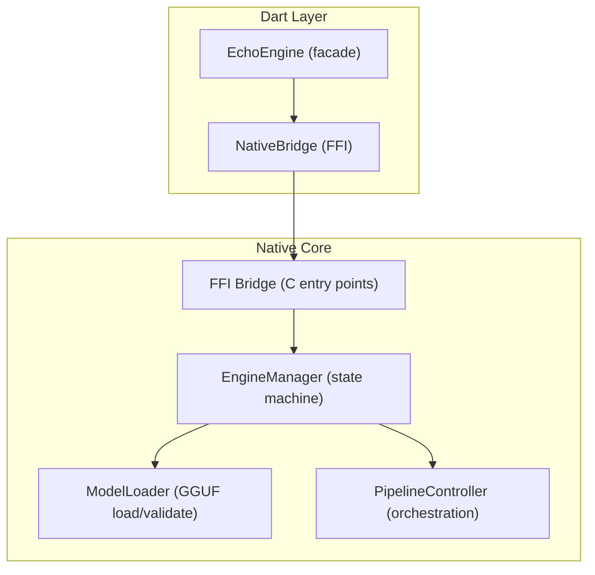
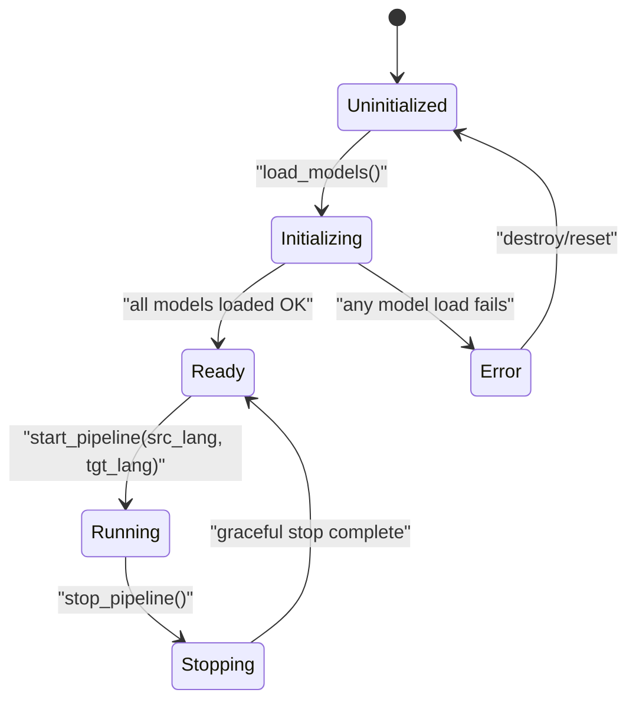
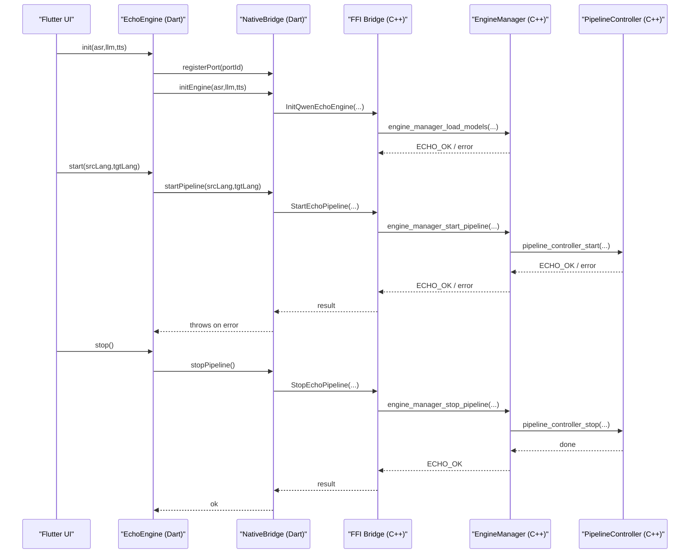
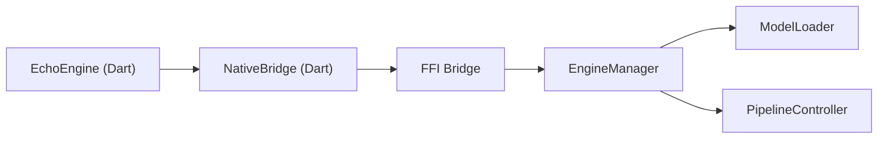
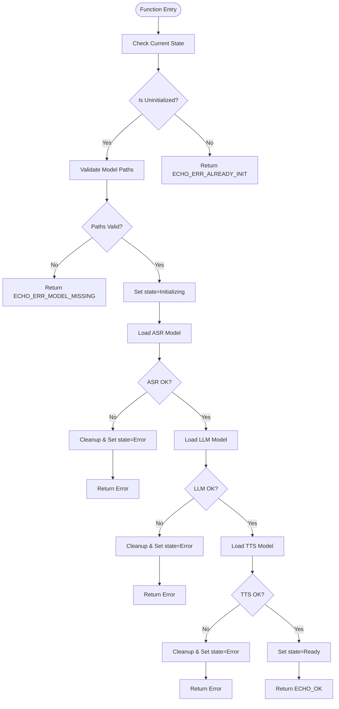

# Engine Manager

<cite>
**Referenced Files in This Document**
- [engine_manager.h](file://native/include/engine_manager.h)
- [engine_manager.cpp](file://native/src/engine_manager.cpp)
- [echo_types.h](file://native/include/echo_types.h)
- [model_loader.h](file://native/include/model_loader.h)
- [pipeline_controller.h](file://native/include/pipeline_controller.h)
- [ffi_bridge.h](file://native/include/ffi_bridge.h)
- [ffi_bridge.cpp](file://native/src/ffi_bridge.cpp)
- [native_bridge.dart](file://lib/src/native_bridge.dart)
- [echo_engine.dart](file://lib/src/echo_engine.dart)
- [test_engine_manager.cpp](file://native/tests/test_engine_manager.cpp)
</cite>

## Table of Contents
1. [Introduction](#introduction)
2. [Project Structure](#project-structure)
3. [Core Components](#core-components)
4. [Architecture Overview](#architecture-overview)
5. [Detailed Component Analysis](#detailed-component-analysis)
6. [Dependency Analysis](#dependency-analysis)
7. [Performance Considerations](#performance-considerations)
8. [Troubleshooting Guide](#troubleshooting-guide)
9. [Conclusion](#conclusion)
10. [Appendices](#appendices)

## Introduction
This document provides comprehensive documentation for the EngineManager component, focusing on engine lifecycle management and state machine orchestration. It explains the five-state state machine (Uninitialized → Initializing → Ready → Running → Stopping), the three-phase initialization process (model loading, validation, resource allocation), session management patterns for starting and stopping interpretation pipelines with language pair configuration, error handling strategies, proper usage patterns, resource cleanup procedures, and integration with the Flutter layer through FFI bindings.

## Project Structure
The EngineManager is implemented in native C/C++ and exposed to Dart via an FFI bridge. The key layers are:
- Native core: EngineManager orchestrates model loading and pipeline control.
- Model loader: Validates and loads GGUF models (ASR, LLM, TTS).
- Pipeline controller: Manages audio capture, ASR→LLM→TTS stages, and graceful shutdown.
- FFI bridge: Exposes a minimal C API consumed by Dart.
- Dart layer: Provides typed bindings and a high-level facade for UI integration.

**Diagram sources**
- [engine_manager.h:1-104](file://native/include/engine_manager.h#L1-L104)
- [engine_manager.cpp:1-202](file://native/src/engine_manager.cpp#L1-L202)
- [model_loader.h:1-142](file://native/include/model_loader.h#L1-L142)
- [pipeline_controller.h:1-107](file://native/include/pipeline_controller.h#L1-L107)
- [ffi_bridge.h:1-84](file://native/include/ffi_bridge.h#L1-L84)
- [ffi_bridge.cpp:1-124](file://native/src/ffi_bridge.cpp#L1-L124)
- [native_bridge.dart:1-230](file://lib/src/native_bridge.dart#L1-L230)
- [echo_engine.dart:1-108](file://lib/src/echo_engine.dart#L1-L108)

**Section sources**
- [engine_manager.h:1-104](file://native/include/engine_manager.h#L1-L104)
- [engine_manager.cpp:1-202](file://native/src/engine_manager.cpp#L1-L202)
- [ffi_bridge.h:1-84](file://native/include/ffi_bridge.h#L1-L84)
- [ffi_bridge.cpp:1-124](file://native/src/ffi_bridge.cpp#L1-L124)
- [native_bridge.dart:1-230](file://lib/src/native_bridge.dart#L1-L230)
- [echo_engine.dart:1-108](file://lib/src/echo_engine.dart#L1-L108)

## Core Components
- EngineManager: Central coordinator for lifecycle, state transitions, model loading, and pipeline orchestration.
- ModelLoader: Loads and validates GGUF models (magic header, quantization checks), memory maps files, and creates inference contexts per model type.
- PipelineController: Creates and manages the full audio processing pipeline (ring buffer, queues, stages, monitors) and enforces graceful stop semantics.
- FFI Bridge: Thin C-linkage layer that delegates to EngineManager and tracks port registration for async messaging.
- Dart Bindings: Type-safe wrappers over FFI functions and a high-level EchoEngine facade for UI integration.

Key responsibilities and interactions:
- EngineManager owns ModelLoader and PipelineController instances and serializes all state mutations with a mutex.
- FFI Bridge maintains a global EngineManager instance and ensures a Native Port is registered before allowing pipeline start/stop.
- Dart EchoEngine coordinates port registration, calls into NativeBridge, and exposes a simple init/start/stop lifecycle.

**Section sources**
- [engine_manager.cpp:19-25](file://native/src/engine_manager.cpp#L19-L25)
- [model_loader.h:1-142](file://native/include/model_loader.h#L1-L142)
- [pipeline_controller.h:1-107](file://native/include/pipeline_controller.h#L1-L107)
- [ffi_bridge.cpp:22-48](file://native/src/ffi_bridge.cpp#L22-L48)
- [native_bridge.dart:99-126](file://lib/src/native_bridge.dart#L99-L126)
- [echo_engine.dart:37-58](file://lib/src/echo_engine.dart#L37-L58)

## Architecture Overview
The EngineManager implements a strict state machine governing lifecycle transitions and guards against invalid operations.

**Diagram sources**
- [engine_manager.h:6-16](file://native/include/engine_manager.h#L6-L16)
- [engine_manager.cpp:44-100](file://native/src/engine_manager.cpp#L44-L100)
- [engine_manager.cpp:102-168](file://native/src/engine_manager.cpp#L102-L168)

## Detailed Component Analysis

### State Machine and Lifecycle Rules
- States:
  - Uninitialized: Created but no models loaded.
  - Initializing: Models being loaded; may transition to Ready or Error.
  - Ready: All models loaded; pipeline can be started.
  - Running: Active interpretation session.
  - Stopping: Graceful shutdown in progress; returns to Ready.
  - Error: Initialization failure; requires reset/destroy to return to Uninitialized.
- Guards:
  - load_models must be called only when Uninitialized; otherwise returns ECHO_ERR_ALREADY_INIT.
  - start_pipeline requires Ready state and no active session; otherwise returns ECHO_ERR_ENGINE_NOT_READY or ECHO_ERR_SESSION_ACTIVE.
  - stop_pipeline is a no-op if no session is active; returns ECHO_OK.
- Concurrency:
  - All state transitions are serialized under a mutex inside EngineManager.
  - State reads are safe without lock for query purposes; mutations are protected.

Transition rules and error conditions:
- Uninitialized → Initializing: On successful entry to load_models.
- Initializing → Ready: After all three models (ASR, LLM, TTS) load successfully.
- Initializing → Error: If any model load fails or memory allocation fails.
- Ready → Running: After successful pipeline start with valid language pair.
- Running → Stopping → Ready: On stop_pipeline; processes locked segments and discards unlocked audio within a bounded time.
- Error → Uninitialized: On destroy/reset.

**Section sources**
- [engine_manager.h:6-16](file://native/include/engine_manager.h#L6-L16)
- [engine_manager.cpp:44-100](file://native/src/engine_manager.cpp#L44-L100)
- [engine_manager.cpp:102-168](file://native/src/engine_manager.cpp#L102-L168)
- [engine_manager.cpp:170-201](file://native/src/engine_manager.cpp#L170-L201)
- [test_engine_manager.cpp:122-174](file://native/tests/test_engine_manager.cpp#L122-L174)

### Three-Phase Initialization Process
Initialization occurs in three phases during load_models:
1. Model Loading:
   - Create ModelLoader instance.
   - Load ASR, LLM, and TTS models sequentially.
2. Validation:
   - Each model undergoes GGUF magic header check and quantization validation.
   - Errors include missing file, permission denied, invalid format, or unsupported quantization.
3. Resource Allocation:
   - Memory-mapped file access and inference context creation per model.
   - On success, transition to Ready; on failure, transition to Error and clean up partial resources.

Error handling specifics:
- Missing paths or empty strings yield ECHO_ERR_MODEL_MISSING.
- Any model load failure triggers immediate cleanup and transition to Error.
- Memory allocation failures return ECHO_ERR_MEMORY.

**Section sources**
- [engine_manager.cpp:44-100](file://native/src/engine_manager.cpp#L44-L100)
- [model_loader.h:84-100](file://native/include/model_loader.h#L84-L100)

### Session Management Patterns
Starting a pipeline:
- Requires engine in Ready state and no active session.
- Validates source and target language codes; unsupported codes return ECHO_ERR_UNSUPPORTED_LANG.
- Creates PipelineController if not present, then starts it with the language pair.
- Transitions to Running and marks session_active.

Stopping a pipeline:
- Gracefully stops the pipeline: signals AudioCollector to stop, flushes locked segments, destroys threads, clears ring buffer, and releases resources within a bounded time.
- Transitions to Stopping then back to Ready; sets session_active false.
- No-op if no session is active.

Language pair configuration:
- ISO 639-1 codes validated against supported set; unknown codes rejected.

**Section sources**
- [engine_manager.cpp:102-141](file://native/src/engine_manager.cpp#L102-L141)
- [engine_manager.cpp:143-168](file://native/src/engine_manager.cpp#L143-L168)
- [pipeline_controller.h:48-82](file://native/include/pipeline_controller.h#L48-L82)

### Error Handling Strategies
Common errors and their causes:
- ECHO_ERR_NOT_INITIALIZED: Calls made on NULL engine handle.
- ECHO_ERR_ALREADY_INIT: load_models called when not Uninitialized.
- ECHO_ERR_MODEL_MISSING: Null or empty model paths.
- ECHO_ERR_MODEL_INVALID: Invalid GGUF header or unsupported quantization.
- ECHO_ERR_MODEL_PERMISSION: File exists but unreadable.
- ECHO_ERR_MEMORY: Allocation failure during model or pipeline setup.
- ECHO_ERR_ENGINE_NOT_READY: start_pipeline called when not Ready.
- ECHO_ERR_SESSION_ACTIVE: start_pipeline called while session already running.
- ECHO_ERR_UNSUPPORTED_LANG: Invalid or unsupported ISO 639-1 codes.
- ECHO_ERR_NO_PORT: FFI layer requires a registered Native Port before start/stop.

Concurrent access prevention:
- EngineManager uses a mutex to serialize all state transitions and resource changes.
- FFI Bridge uses its own mutex to protect global EngineManager and port registration.

**Section sources**
- [echo_types.h:48-62](file://native/include/echo_types.h#L48-L62)
- [engine_manager.cpp:44-100](file://native/src/engine_manager.cpp#L44-L100)
- [engine_manager.cpp:102-168](file://native/src/engine_manager.cpp#L102-L168)
- [ffi_bridge.cpp:71-106](file://native/src/ffi_bridge.cpp#L71-L106)

### Integration with Flutter Layer via FFI Bindings
Dart-side flow:
- EchoEngine.init registers a Native Port, then calls NativeBridge.initEngine which invokes InitQwenEchoEngine.
- EchoEngine.start calls StartEchoPipeline with ISO 639-1 codes.
- EchoEngine.stop calls StopEchoPipeline.
- EchoEngine.dispose cleans up Dart-side resources (port manager); does not stop the native engine automatically.

FFI Bridge behavior:
- Ensures a global EngineManager exists lazily.
- Requires a registered Native Port before allowing start/stop; otherwise returns ECHO_ERR_NO_PORT.
- Delegates lifecycle calls to EngineManager.

**Diagram sources**
- [echo_engine.dart:66-98](file://lib/src/echo_engine.dart#L66-L98)
- [native_bridge.dart:132-185](file://lib/src/native_bridge.dart#L132-L185)
- [ffi_bridge.cpp:56-106](file://native/src/ffi_bridge.cpp#L56-L106)
- [engine_manager.cpp:44-168](file://native/src/engine_manager.cpp#L44-L168)
- [pipeline_controller.h:48-82](file://native/include/pipeline_controller.h#L48-L82)

### Proper Usage Patterns and Resource Cleanup
Recommended lifecycle pattern:
- Create EchoEngine.
- Register Native Port (done internally by EchoEngine.init).
- Initialize engine with model paths.
- Start pipeline with valid language pair.
- Listen to messages stream for ASR, translation, TTS events.
- Stop pipeline when done.
- Dispose Dart-side resources; ensure stop was called first if a session was active.

Resource cleanup procedures:
- EngineManager.destroy stops any active session, destroys ModelLoader and PipelineController, resets state to Uninitialized, and frees memory.
- PipelineController.stop guarantees graceful shutdown within a bounded time, flushing locked segments and discarding unlocked audio.

**Section sources**
- [echo_engine.dart:66-107](file://lib/src/echo_engine.dart#L66-L107)
- [engine_manager.cpp:170-201](file://native/src/engine_manager.cpp#L170-L201)
- [pipeline_controller.h:66-82](file://native/include/pipeline_controller.h#L66-L82)

## Dependency Analysis
Component relationships and coupling:
- EngineManager depends on ModelLoader and PipelineController.
- FFI Bridge depends on EngineManager and Native Port module; maintains global EngineManager and port registration.
- Dart NativeBridge depends on FFI symbols; EchoEngine composes NativeBridge and PortManager.

**Diagram sources**
- [engine_manager.cpp:9-11](file://native/src/engine_manager.cpp#L9-L11)
- [ffi_bridge.cpp:9-12](file://native/src/ffi_bridge.cpp#L9-L12)
- [native_bridge.dart:109-126](file://lib/src/native_bridge.dart#L109-L126)
- [echo_engine.dart:37-58](file://lib/src/echo_engine.dart#L37-L58)

**Section sources**
- [engine_manager.cpp:9-11](file://native/src/engine_manager.cpp#L9-L11)
- [ffi_bridge.cpp:9-12](file://native/src/ffi_bridge.cpp#L9-L12)
- [native_bridge.dart:109-126](file://lib/src/native_bridge.dart#L109-L126)
- [echo_engine.dart:37-58](file://lib/src/echo_engine.dart#L37-L58)

## Performance Considerations
- Model loading uses memory-mapped files to leverage OS page cache and reduce copy overhead.
- Per-model inference contexts are created independently, enabling efficient resource isolation.
- Pipeline stop is designed to complete within a bounded time, ensuring responsive UI and preventing long hangs.
- Avoid repeated initialization; reuse a single EngineManager instance across sessions.

[No sources needed since this section provides general guidance]

## Troubleshooting Guide
Common issues and resolutions:
- Engine not initialized: Ensure initEngine is called before startPipeline; verify port registration.
- Already initialized: Do not call load_models again after transitioning out of Uninitialized; create a new EngineManager if needed.
- Model missing or invalid: Check file paths, permissions, and GGUF format/quantization compatibility.
- Unsupported language: Validate ISO 639-1 codes against supported set.
- Session active: Stop the current pipeline before starting another.
- No port registered: Register a Native Port before calling startPipeline or stopPipeline.

Diagnostic tips:
- Use EchoErrorCode.describe to map error codes to human-readable messages.
- Monitor messages stream for error notifications and diagnostics from the engine.

**Section sources**
- [native_bridge.dart:43-75](file://lib/src/native_bridge.dart#L43-L75)
- [ffi_bridge.cpp:71-106](file://native/src/ffi_bridge.cpp#L71-L106)
- [engine_manager.cpp:44-100](file://native/src/engine_manager.cpp#L44-L100)

## Conclusion
The EngineManager provides a robust, thread-safe state machine for managing the QwenEcho engine lifecycle. Its clear transitions, strict guards, and comprehensive error handling enable reliable integration with Flutter via FFI. By following the recommended usage patterns and understanding the initialization and session management flows, developers can build responsive, high-quality simultaneous interpretation experiences.

[No sources needed since this section summarizes without analyzing specific files]

## Appendices

### State Transition Flowchart

**Diagram sources**
- [engine_manager.cpp:44-100](file://native/src/engine_manager.cpp#L44-L100)