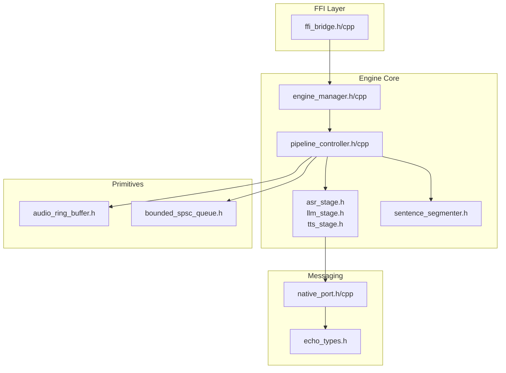
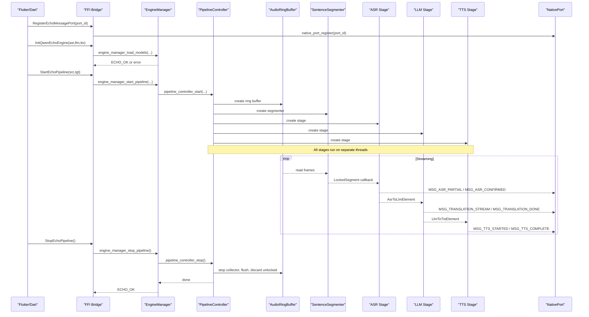
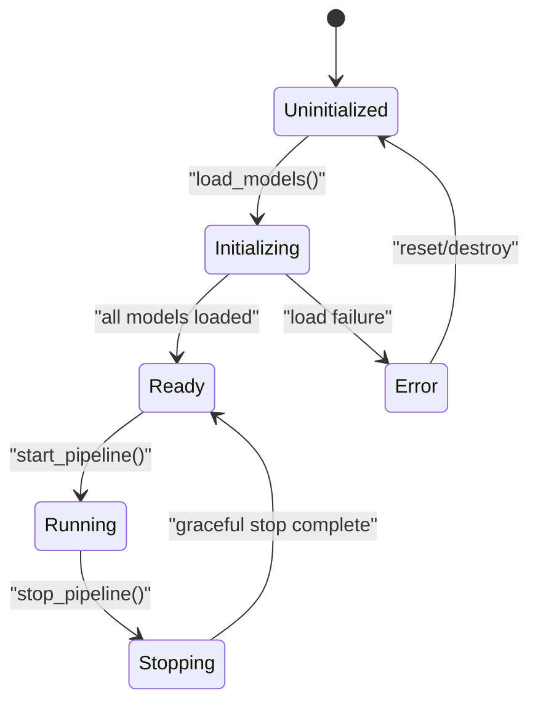
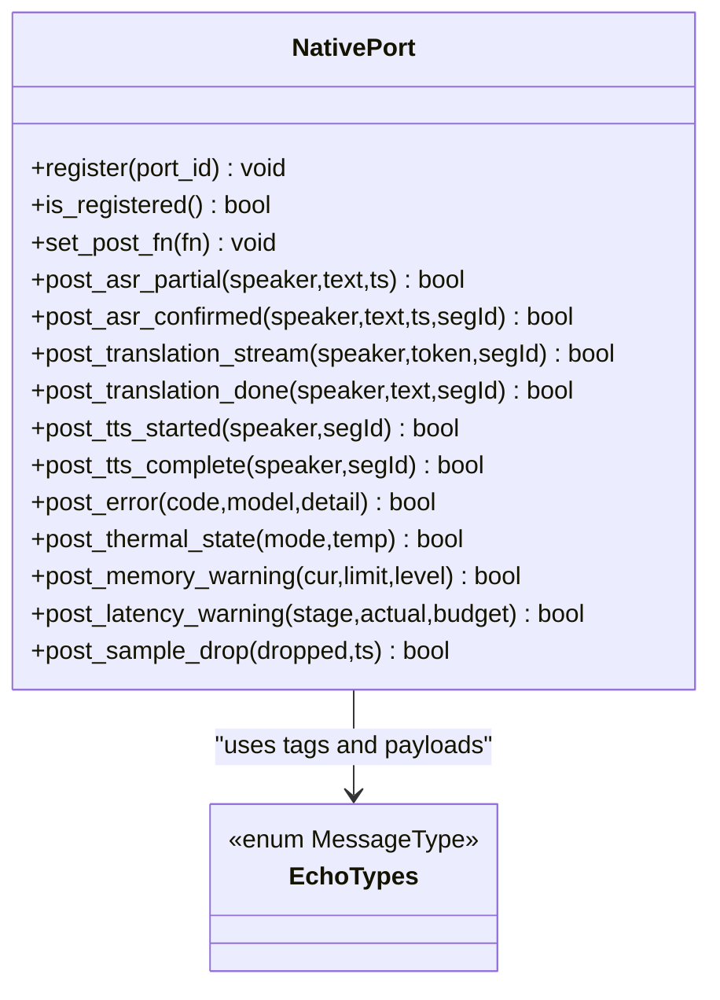
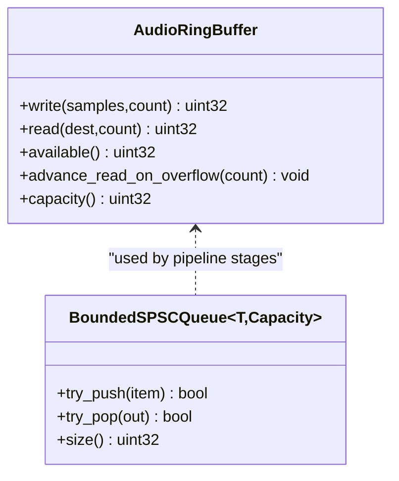
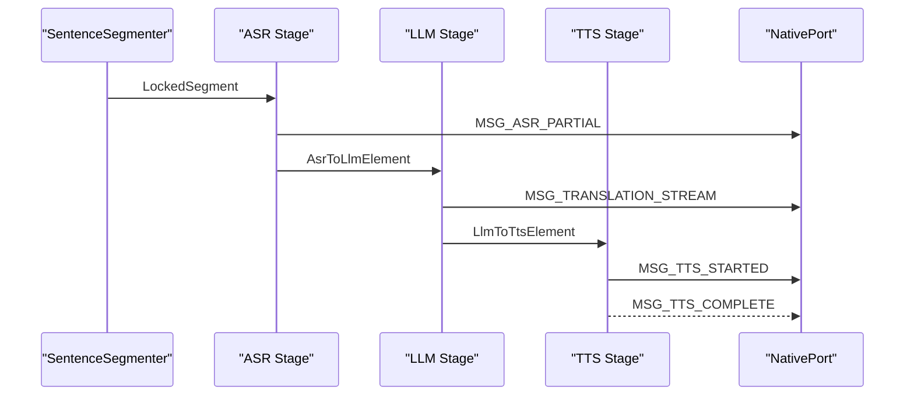
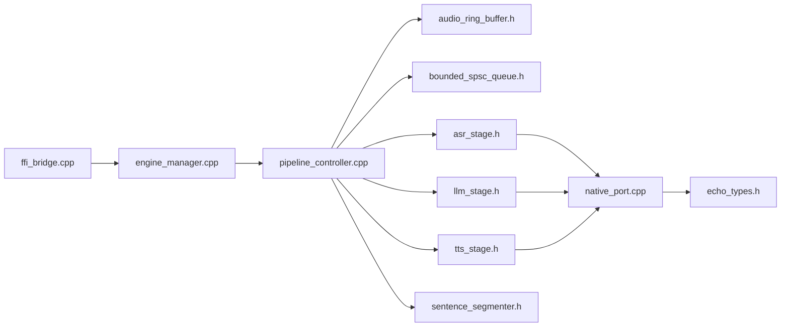

# Native Engine Core

<cite>
**Referenced Files in This Document**
- [engine_manager.h](file://native/include/engine_manager.h)
- [engine_manager.cpp](file://native/src/engine_manager.cpp)
- [pipeline_controller.h](file://native/include/pipeline_controller.h)
- [pipeline_controller.cpp](file://native/src/pipeline_controller.cpp)
- [native_port.h](file://native/include/native_port.h)
- [native_port.cpp](file://native/src/native_port.cpp)
- [echo_types.h](file://native/include/echo_types.h)
- [bounded_spsc_queue.h](file://native/include/bounded_spsc_queue.h)
- [audio_ring_buffer.h](file://native/include/audio_ring_buffer.h)
- [ffi_bridge.h](file://native/include/ffi_bridge.h)
- [ffi_bridge.cpp](file://native/src/ffi_bridge.cpp)
- [asr_stage.h](file://native/include/asr_stage.h)
- [llm_stage.h](file://native/include/llm_stage.h)
- [tts_stage.h](file://native/include/tts_stage.h)
- [sentence_segmenter.h](file://native/include/sentence_segmenter.h)
</cite>

## Table of Contents
1. [Introduction](#introduction)
2. [Project Structure](#project-structure)
3. [Core Components](#core-components)
4. [Architecture Overview](#architecture-overview)
5. [Detailed Component Analysis](#detailed-component-analysis)
6. [Dependency Analysis](#dependency-analysis)
7. [Performance Considerations](#performance-considerations)
8. [Troubleshooting Guide](#troubleshooting-guide)
9. [Conclusion](#conclusion)
10. [Appendices](#appendices)

## Introduction
This document explains the high-performance audio processing pipeline in QwenEcho’s C/C++ native engine core. It focuses on:
- EngineManager lifecycle state machine and session control
- PipelineController orchestration of sequential stages with lock-free communication
- NativePort asynchronous Dart-to-native message delivery
- EchoTypes shared data structures
- Error handling, resource management, threading models
- Extensibility for custom stages and new AI models
- Performance, memory management, and debugging techniques

## Project Structure
The native layer is organized into headers under include/ and implementations under src/. Key modules:
- FFI bridge exposes a minimal C API to Flutter via Dart FFI
- EngineManager coordinates model loading and pipeline lifecycle
- PipelineController constructs and manages all pipeline components and threads
- Stages (ASR, LLM, TTS) perform inference and stream results
- Lock-free primitives (ring buffer, bounded SPSC queue) connect stages
- NativePort posts typed messages back to Dart asynchronously

**Diagram sources**
- [ffi_bridge.h:1-84](file://native/include/ffi_bridge.h#L1-L84)
- [ffi_bridge.cpp:1-124](file://native/src/ffi_bridge.cpp#L1-L124)
- [engine_manager.h:1-104](file://native/include/engine_manager.h#L1-L104)
- [engine_manager.cpp:1-202](file://native/src/engine_manager.cpp#L1-L202)
- [pipeline_controller.h:1-107](file://native/include/pipeline_controller.h#L1-L107)
- [pipeline_controller.cpp:1-488](file://native/src/pipeline_controller.cpp#L1-L488)
- [asr_stage.h:1-104](file://native/include/asr_stage.h#L1-L104)
- [llm_stage.h:1-93](file://native/include/llm_stage.h#L1-L93)
- [tts_stage.h:1-79](file://native/include/tts_stage.h#L1-L79)
- [sentence_segmenter.h:1-142](file://native/include/sentence_segmenter.h#L1-L142)
- [audio_ring_buffer.h:1-192](file://native/include/audio_ring_buffer.h#L1-L192)
- [bounded_spsc_queue.h:1-145](file://native/include/bounded_spsc_queue.h#L1-L145)
- [native_port.h:1-179](file://native/include/native_port.h#L1-L179)
- [native_port.cpp:1-320](file://native/src/native_port.cpp#L1-L320)
- [echo_types.h:1-136](file://native/include/echo_types.h#L1-L136)

**Section sources**
- [ffi_bridge.h:1-84](file://native/include/ffi_bridge.h#L1-L84)
- [ffi_bridge.cpp:1-124](file://native/src/ffi_bridge.cpp#L1-L124)
- [engine_manager.h:1-104](file://native/include/engine_manager.h#L1-L104)
- [engine_manager.cpp:1-202](file://native/src/engine_manager.cpp#L1-L202)
- [pipeline_controller.h:1-107](file://native/include/pipeline_controller.h#L1-L107)
- [pipeline_controller.cpp:1-488](file://native/src/pipeline_controller.cpp#L1-L488)
- [asr_stage.h:1-104](file://native/include/asr_stage.h#L1-L104)
- [llm_stage.h:1-93](file://native/include/llm_stage.h#L1-L93)
- [tts_stage.h:1-79](file://native/include/tts_stage.h#L1-L79)
- [sentence_segmenter.h:1-142](file://native/include/sentence_segmenter.h#L1-L142)
- [audio_ring_buffer.h:1-192](file://native/include/audio_ring_buffer.h#L1-L192)
- [bounded_spsc_queue.h:1-145](file://native/include/bounded_spsc_queue.h#L1-L145)
- [native_port.h:1-179](file://native/include/native_port.h#L1-L179)
- [native_port.cpp:1-320](file://native/src/native_port.cpp#L1-L320)
- [echo_types.h:1-136](file://native/include/echo_types.h#L1-L136)

## Core Components
- EngineManager: Central coordinator for lifecycle, model loading, and pipeline orchestration. Implements a strict state machine and guards invalid transitions.
- PipelineController: Orchestrates creation, startup, and graceful shutdown of all pipeline components; wires ring buffer, queues, stages, monitors, and ensures cascade truncation for low latency.
- NativePort: Asynchronous Dart-to-native messaging system that serializes typed messages and posts them via a registered Dart port.
- EchoTypes: Shared enums and structs for engine states, error codes, inter-stage elements, and configuration.
- Lock-free Primitives: AudioRingBuffer (SPSC circular buffer) and BoundedSPSCQueue (overflow-drop semantics) provide non-blocking communication between stages.

Key responsibilities and interactions are detailed in subsequent sections.

**Section sources**
- [engine_manager.h:1-104](file://native/include/engine_manager.h#L1-L104)
- [engine_manager.cpp:1-202](file://native/src/engine_manager.cpp#L1-L202)
- [pipeline_controller.h:1-107](file://native/include/pipeline_controller.h#L1-L107)
- [pipeline_controller.cpp:1-488](file://native/src/pipeline_controller.cpp#L1-L488)
- [native_port.h:1-179](file://native/include/native_port.h#L1-L179)
- [native_port.cpp:1-320](file://native/src/native_port.cpp#L1-L320)
- [echo_types.h:1-136](file://native/include/echo_types.h#L1-L136)
- [audio_ring_buffer.h:1-192](file://native/include/audio_ring_buffer.h#L1-L192)
- [bounded_spsc_queue.h:1-145](file://native/include/bounded_spsc_queue.h#L1-L145)

## Architecture Overview
The pipeline follows a cascaded, overlapped execution model:
- AudioCollector writes PCM into AudioRingBuffer
- SentenceSegmenter consumes from the ring buffer and locks segments
- ASR stage processes locked segments, streams partials, enqueues confirmed text
- LLM stage translates and emits partial tokens at punctuation boundaries
- TTS stage synthesizes streaming audio chunks
- Monitors observe thermal and memory conditions and adjust behavior
- LatencyTracker measures per-segment and E2E latencies

**Diagram sources**
- [ffi_bridge.h:1-84](file://native/include/ffi_bridge.h#L1-L84)
- [ffi_bridge.cpp:1-124](file://native/src/ffi_bridge.cpp#L1-L124)
- [engine_manager.h:1-104](file://native/include/engine_manager.h#L1-L104)
- [engine_manager.cpp:1-202](file://native/src/engine_manager.cpp#L1-L202)
- [pipeline_controller.h:1-107](file://native/include/pipeline_controller.h#L1-L107)
- [pipeline_controller.cpp:1-488](file://native/src/pipeline_controller.cpp#L1-L488)
- [audio_ring_buffer.h:1-192](file://native/include/audio_ring_buffer.h#L1-L192)
- [sentence_segmenter.h:1-142](file://native/include/sentence_segmenter.h#L1-L142)
- [asr_stage.h:1-104](file://native/include/asr_stage.h#L1-L104)
- [llm_stage.h:1-93](file://native/include/llm_stage.h#L1-L93)
- [tts_stage.h:1-79](file://native/include/tts_stage.h#L1-L79)
- [native_port.h:1-179](file://native/include/native_port.h#L1-L179)
- [native_port.cpp:1-320](file://native/src/native_port.cpp#L1-L320)

## Detailed Component Analysis

### EngineManager State Machine and Lifecycle
- States: Uninitialized → Initializing → Ready → Running → Stopping → Ready; error path: Initializing → Error; Error → Uninitialized on reset/destroy.
- Guards:
  - Load models only when Uninitialized
  - Start pipeline only when Ready and no active session
  - Stop pipeline is a no-op if not running
- Responsibilities:
  - Own ModelLoader and PipelineController instances
  - Enforce state transitions and session flags
  - Ensure safe destruction order and mutex lifetime

**Diagram sources**
- [engine_manager.h:1-104](file://native/include/engine_manager.h#L1-L104)
- [engine_manager.cpp:1-202](file://native/src/engine_manager.cpp#L1-L202)

**Section sources**
- [engine_manager.h:1-104](file://native/include/engine_manager.h#L1-L104)
- [engine_manager.cpp:1-202](file://native/src/engine_manager.cpp#L1-L202)

### PipelineController Orchestration and Graceful Shutdown
- Creates and starts: ring buffer, bounded queues, audio collector, sentence segmenter, ASR/LLM/TTS stages, thermal/memory monitors, latency tracker.
- Cascade truncation:
  - ASR→LLM queue delivers confirmed text immediately; LLM begins translation without waiting for full segment capture.
  - LLM→TTS queue receives partial translations at punctuation; TTS begins synthesis while LLM continues.
- Graceful stop sequence:
  1) Stop AudioCollector
  2) Wait for locked segments to flush through ASR→LLM→TTS within 2 seconds
  3) Destroy all stages and threads
  4) Discard unlocked audio in ring buffer
  5) Release resources

**Diagram sources**
- [pipeline_controller.h:1-107](file://native/include/pipeline_controller.h#L1-L107)
- [pipeline_controller.cpp:1-488](file://native/src/pipeline_controller.cpp#L1-L488)

**Section sources**
- [pipeline_controller.h:1-107](file://native/include/pipeline_controller.h#L1-L107)
- [pipeline_controller.cpp:1-488](file://native/src/pipeline_controller.cpp#L1-L488)

### NativePort System for Asynchronous Dart-to-Native Messaging
- Registration:
  - FFI bridge stores Dart port ID and forwards to NativePort
  - Only the most recently registered port receives messages
- Message dispatch:
  - Each post function builds a Dart_CObject array with a type tag and payload
  - Uses atomic state for port registration and runtime-set post function pointer
- Supported messages include ASR partial/confirmed, translation stream/done, TTS started/complete, errors, thermal state, memory warnings, latency warnings, sample drops

**Diagram sources**
- [native_port.h:1-179](file://native/include/native_port.h#L1-L179)
- [native_port.cpp:1-320](file://native/src/native_port.cpp#L1-L320)
- [echo_types.h:1-136](file://native/include/echo_types.h#L1-L136)

**Section sources**
- [native_port.h:1-179](file://native/include/native_port.h#L1-L179)
- [native_port.cpp:1-320](file://native/src/native_port.cpp#L1-L320)
- [echo_types.h:1-136](file://native/include/echo_types.h#L1-L136)

### EchoTypes Shared Data Structures
- EngineState: lifecycle states used by EngineManager
- MessageType: tags for NativePort messages
- EchoErrorCode: standardized return codes across FFI entry points
- Inter-stage elements:
  - AsrToLlmElement: segment_id, speaker_id, text, length, timestamp
  - LlmToTtsElement: segment_id, speaker_id, translated text, length, timestamp
- EngineConfig: model paths, pipeline parameters, thresholds, and defaults

These types ensure consistent contracts between stages and messaging.

**Section sources**
- [echo_types.h:1-136](file://native/include/echo_types.h#L1-L136)

### Lock-Free Communication Primitives
- AudioRingBuffer:
  - SPSC circular buffer for PCM samples
  - Overwrite policy: advances read pointer on overflow to avoid blocking producer
  - Cache-line alignment for write/read positions to prevent false sharing
- BoundedSPSCQueue:
  - Fixed capacity power-of-two with bitmask indexing
  - Sequence/turn protocol for occupancy tracking
  - Overflow-drop semantics: drops oldest element when full, never blocks producer
  - Atomic head/tail with acquire/release ordering

**Diagram sources**
- [audio_ring_buffer.h:1-192](file://native/include/audio_ring_buffer.h#L1-L192)
- [bounded_spsc_queue.h:1-145](file://native/include/bounded_spsc_queue.h#L1-L145)

**Section sources**
- [audio_ring_buffer.h:1-192](file://native/include/audio_ring_buffer.h#L1-L192)
- [bounded_spsc_queue.h:1-145](file://native/include/bounded_spsc_queue.h#L1-L145)

### Stages and Segmenter
- SentenceSegmenter:
  - Energy-based VAD and FSMN-VAD simulation
  - State machine: Idle → Accumulating → Locking → Idle
  - Lock conditions: silence threshold, punctuation notification, max duration
- ASR Stage:
  - Processes locked segments, streams partials, enqueues confirmed text
  - Thermal mode affects resampling (16kHz → 8kHz)
- LLM Stage:
  - Context window management (normal/throttle), sliding history
  - Emits partial tokens at punctuation for cascade truncation
- TTS Stage:
  - Synthesizes streaming audio chunks, reports start/complete events
  - SLA monitoring for TTFA

**Diagram sources**
- [sentence_segmenter.h:1-142](file://native/include/sentence_segmenter.h#L1-L142)
- [asr_stage.h:1-104](file://native/include/asr_stage.h#L1-L104)
- [llm_stage.h:1-93](file://native/include/llm_stage.h#L1-L93)
- [tts_stage.h:1-79](file://native/include/tts_stage.h#L1-L79)
- [native_port.h:1-179](file://native/include/native_port.h#L1-L179)

**Section sources**
- [sentence_segmenter.h:1-142](file://native/include/sentence_segmenter.h#L1-L142)
- [asr_stage.h:1-104](file://native/include/asr_stage.h#L1-L104)
- [llm_stage.h:1-93](file://native/include/llm_stage.h#L1-L93)
- [tts_stage.h:1-79](file://native/include/tts_stage.h#L1-L79)

## Dependency Analysis
- FFI Bridge depends on EngineManager and NativePort
- EngineManager depends on ModelLoader and PipelineController
- PipelineController composes all stages and primitives
- Stages depend on HAL accelerator and NativePort for messaging
- NativePort depends on EchoTypes for message tags and payloads

**Diagram sources**
- [ffi_bridge.cpp:1-124](file://native/src/ffi_bridge.cpp#L1-L124)
- [engine_manager.cpp:1-202](file://native/src/engine_manager.cpp#L1-L202)
- [pipeline_controller.cpp:1-488](file://native/src/pipeline_controller.cpp#L1-L488)
- [audio_ring_buffer.h:1-192](file://native/include/audio_ring_buffer.h#L1-L192)
- [bounded_spsc_queue.h:1-145](file://native/include/bounded_spsc_queue.h#L1-L145)
- [asr_stage.h:1-104](file://native/include/asr_stage.h#L1-L104)
- [llm_stage.h:1-93](file://native/include/llm_stage.h#L1-L93)
- [tts_stage.h:1-79](file://native/include/tts_stage.h#L1-L79)
- [sentence_segmenter.h:1-142](file://native/include/sentence_segmenter.h#L1-L142)
- [native_port.cpp:1-320](file://native/src/native_port.cpp#L1-L320)
- [echo_types.h:1-136](file://native/include/echo_types.h#L1-L136)

**Section sources**
- [ffi_bridge.cpp:1-124](file://native/src/ffi_bridge.cpp#L1-L124)
- [engine_manager.cpp:1-202](file://native/src/engine_manager.cpp#L1-L202)
- [pipeline_controller.cpp:1-488](file://native/src/pipeline_controller.cpp#L1-L488)
- [native_port.cpp:1-320](file://native/src/native_port.cpp#L1-L320)
- [echo_types.h:1-136](file://native/include/echo_types.h#L1-L136)

## Performance Considerations
- Lock-free design:
  - AudioRingBuffer and BoundedSPSCQueue avoid contention and block-free operation
  - Cache-line alignment reduces false sharing
- Cascade truncation:
  - Early downstream activation reduces end-to-end latency
- Threading model:
  - Each stage runs on its own thread; monitors operate independently
- SLAs:
  - ASR first-character ≤200ms
  - LLM first-token ≤450ms, throughput ≥35 tokens/sec
  - TTS TTFA ≤100ms
  - E2E budgets: normal ≤800ms, throttle ≤1200ms
- Resource limits:
  - Ring buffer capacity ~65.5s at 16kHz
  - Graceful stop within 2 seconds
- Memory management:
  - Explicit destroy sequences and RAII-like patterns for C++ members
  - Safe NULL handling and placement-new for raw allocations

[No sources needed since this section provides general guidance]

## Troubleshooting Guide
Common issues and strategies:
- No port registered:
  - Ensure RegisterEchoMessagePort is called before starting pipeline
  - Verify native_port_is_registered returns true
- Session conflicts:
  - Starting pipeline while already running returns session active error
  - Stop pipeline before restart
- Unsupported languages:
  - Validate ISO 639-1 codes against supported list
- Thermal and memory pressure:
  - Monitor thermal state and memory warning messages
  - Critical memory may trigger automatic pipeline stop
- Latency violations:
  - Inspect latency warning messages for specific stages
- Debugging techniques:
  - Use NativePort messages to trace pipeline events
  - Check EngineManager state transitions and session flags
  - Validate ring buffer size and queue sizes during load spikes

**Section sources**
- [native_port.h:1-179](file://native/include/native_port.h#L1-L179)
- [native_port.cpp:1-320](file://native/src/native_port.cpp#L1-L320)
- [engine_manager.h:1-104](file://native/include/engine_manager.h#L1-L104)
- [engine_manager.cpp:1-202](file://native/src/engine_manager.cpp#L1-L202)
- [pipeline_controller.h:1-107](file://native/include/pipeline_controller.h#L1-L107)
- [pipeline_controller.cpp:1-488](file://native/src/pipeline_controller.cpp#L1-L488)
- [echo_types.h:1-136](file://native/include/echo_types.h#L1-L136)

## Conclusion
QwenEcho’s native engine core implements a robust, high-performance audio processing pipeline using lock-free primitives, staged inference, and asynchronous messaging. The EngineManager enforces a clear lifecycle, while PipelineController orchestrates overlapping execution for low-latency streaming. NativePort enables reliable Dart-to-native communication, and EchoTypes standardize contracts across modules. With careful attention to performance, memory management, and error handling, the system scales across platforms and supports extensibility for new models and stages.

[No sources needed since this section summarizes without analyzing specific files]

## Appendices

### Extending the Pipeline with Custom Stages
- Add a new stage header and implementation following existing stage interfaces
- Integrate with BoundedSPSCQueue for input/output
- Use NativePort to emit typed messages
- Wire the stage in PipelineController’s create/start/stop flows
- Update language validation and configuration if needed

[No sources needed since this section doesn't analyze specific files]

### Integrating New AI Models
- Provide new GGUF model paths via EngineManager initialization
- Ensure HAL accelerator supports the model type
- Adjust context windows and thermal modes in stage configurations
- Validate SLAs and update latency tracking thresholds accordingly

[No sources needed since this section doesn't analyze specific files]