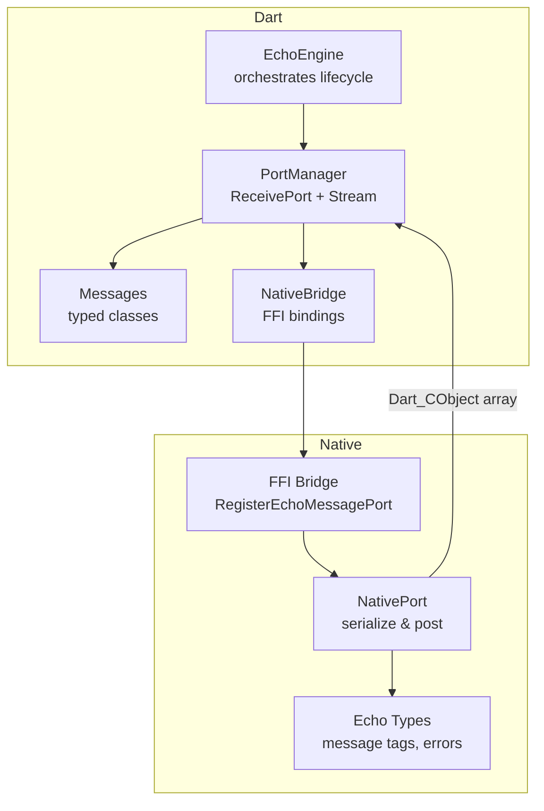
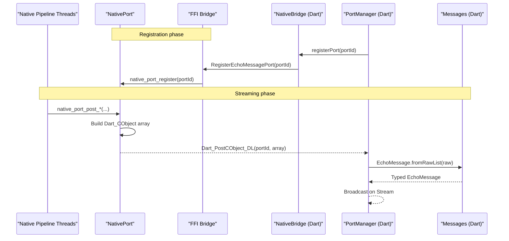
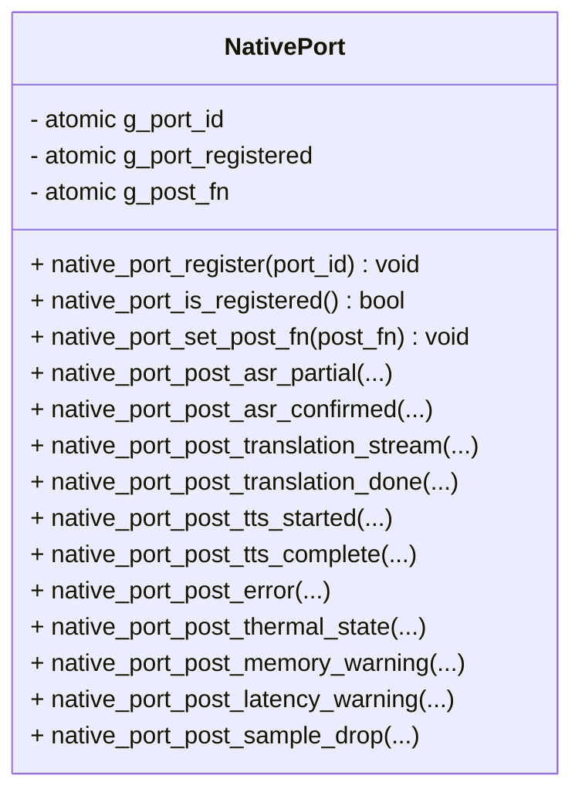
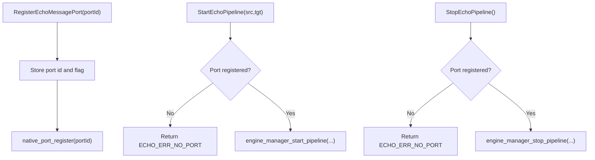
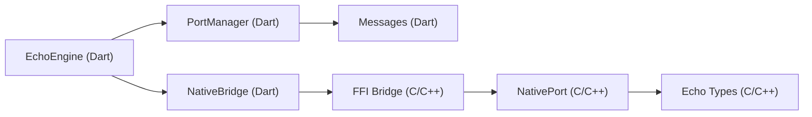

# Native Port System

<cite>
**Referenced Files in This Document**
- [native_port.h](file://native/include/native_port.h)
- [native_port.cpp](file://native/src/native_port.cpp)
- [echo_types.h](file://native/include/echo_types.h)
- [ffi_bridge.h](file://native/include/ffi_bridge.h)
- [ffi_bridge.cpp](file://native/src/ffi_bridge.cpp)
- [port_manager.dart](file://lib/src/port_manager.dart)
- [messages.dart](file://lib/src/messages.dart)
- [native_bridge.dart](file://lib/src/native_bridge.dart)
- [echo_engine.dart](file://lib/src/echo_engine.dart)
- [test_native_port.cpp](file://native/tests/test_native_port.cpp)
</cite>

## Table of Contents
1. [Introduction](#introduction)
2. [Project Structure](#project-structure)
3. [Core Components](#core-components)
4. [Architecture Overview](#architecture-overview)
5. [Detailed Component Analysis](#detailed-component-analysis)
6. [Dependency Analysis](#dependency-analysis)
7. [Performance Considerations](#performance-considerations)
8. [Troubleshooting Guide](#troubleshooting-guide)
9. [Conclusion](#conclusion)

## Introduction
This document explains the NativePort system that delivers asynchronous, non-blocking messages from C++ pipeline threads to Dart via a Dart Native Port. It covers:
- The port-based communication architecture and lifecycle
- Message serialization format and event types
- Thread safety guarantees and memory management across the language boundary
- Backpressure behavior and performance considerations
- Practical guidance for implementing custom handlers in Dart and sending events from native code
- Debugging techniques for message delivery issues

## Project Structure
The NativePort spans both native (C/C++) and Dart layers:
- Native side: FFI bridge exposes entry points; NativePort serializes and posts typed messages; shared types define message tags and error codes.
- Dart side: FFI bindings load the native library; PortManager registers a ReceivePort and transforms raw lists into typed messages; EchoEngine orchestrates lifecycle and exposes a broadcast Stream.

**Diagram sources**
- [echo_engine.dart:37-108](file://lib/src/echo_engine.dart#L37-L108)
- [port_manager.dart:18-85](file://lib/src/port_manager.dart#L18-L85)
- [messages.dart:8-49](file://lib/src/messages.dart#L8-L49)
- [native_bridge.dart:103-230](file://lib/src/native_bridge.dart#L103-L230)
- [ffi_bridge.h:30-77](file://native/include/ffi_bridge.h#L30-L77)
- [ffi_bridge.cpp:108-121](file://native/src/ffi_bridge.cpp#L108-L121)
- [native_port.h:65-173](file://native/include/native_port.h#L65-L173)
- [native_port.cpp:36-75](file://native/src/native_port.cpp#L36-L75)
- [echo_types.h:30-42](file://native/include/echo_types.h#L30-L42)

**Section sources**
- [echo_engine.dart:37-108](file://lib/src/echo_engine.dart#L37-L108)
- [port_manager.dart:18-85](file://lib/src/port_manager.dart#L18-L85)
- [messages.dart:8-49](file://lib/src/messages.dart#L8-L49)
- [native_bridge.dart:103-230](file://lib/src/native_bridge.dart#L103-L230)
- [ffi_bridge.h:30-77](file://native/include/ffi_bridge.h#L30-L77)
- [ffi_bridge.cpp:108-121](file://native/src/ffi_bridge.cpp#L108-L121)
- [native_port.h:65-173](file://native/include/native_port.h#L65-L173)
- [native_port.cpp:36-75](file://native/src/native_port.cpp#L36-L75)
- [echo_types.h:30-42](file://native/include/echo_types.h#L30-L42)

## Core Components
- NativePort (C/C++): Serializes typed messages as Dart_CObject arrays and posts them to the registered Dart port. Uses atomics for thread-safe access to port state and dispatch function pointer.
- FFI Bridge (C/C++): Exposes four entry points to Dart, including RegisterEchoMessagePort, which forwards registration to NativePort.
- Echo Types (C/C++): Defines message type tags and engine error codes used by both sides.
- NativeBridge (Dart): Loads the native library and wraps FFI functions with typed Dart methods and exception handling.
- PortManager (Dart): Creates a ReceivePort, registers it with the engine, and broadcasts typed EchoMessage objects on a Stream.
- Messages (Dart): Provides a sealed hierarchy of typed message classes and a factory to parse raw lists into specific message types.
- EchoEngine (Dart): Facade that initializes the engine, starts/stops the pipeline, and exposes the message stream.

Key responsibilities:
- Non-blocking delivery: NativePort posts directly to the Dart port without queuing on the native side.
- Type safety: Message tags are consistent between C and Dart; Dart deserializes into strongly-typed classes.
- Lifecycle gating: Pipeline start/stop require a registered port; otherwise, an error is returned.

**Section sources**
- [native_port.h:65-173](file://native/include/native_port.h#L65-L173)
- [native_port.cpp:36-75](file://native/src/native_port.cpp#L36-L75)
- [echo_types.h:30-42](file://native/include/echo_types.h#L30-L42)
- [ffi_bridge.h:30-77](file://native/include/ffi_bridge.h#L30-L77)
- [ffi_bridge.cpp:108-121](file://native/src/ffi_bridge.cpp#L108-L121)
- [native_bridge.dart:103-230](file://lib/src/native_bridge.dart#L103-L230)
- [port_manager.dart:18-85](file://lib/src/port_manager.dart#L18-L85)
- [messages.dart:8-49](file://lib/src/messages.dart#L8-L49)
- [echo_engine.dart:37-108](file://lib/src/echo_engine.dart#L37-L108)

## Architecture Overview
End-to-end flow from native to Dart:

**Diagram sources**
- [port_manager.dart:42-50](file://lib/src/port_manager.dart#L42-L50)
- [native_bridge.dart:182-185](file://lib/src/native_bridge.dart#L182-L185)
- [ffi_bridge.cpp:108-121](file://native/src/ffi_bridge.cpp#L108-L121)
- [native_port.cpp:36-75](file://native/src/native_port.cpp#L36-L75)
- [messages.dart:14-33](file://lib/src/messages.dart#L14-L33)

## Detailed Component Analysis

### NativePort (C/C++)
Responsibilities:
- Maintain a single registered Dart port ID and a runtime-dispatchable post function.
- Serialize payloads into Dart_CObject arrays with a leading type tag.
- Provide typed posting functions for each event category.

Thread safety:
- Global state (port ID, registration flag, post function pointer) is stored in atomics with acquire/release semantics to ensure visibility across pipeline threads.

Memory model:
- Strings are passed as const char* pointers; Dart copies them during deserialization. No explicit heap allocation/deallocation is performed by NativePort for strings.
- Arrays of Dart_CObject elements are stack-allocated per call; ownership remains local to the posting function.

Serialization format:
- Each message is a Dart_CObject array where element[0] is the integer type tag followed by payload fields.

Error behavior:
- If no port is registered or no post function is set, posting returns false silently.

**Diagram sources**
- [native_port.h:65-173](file://native/include/native_port.h#L65-L173)
- [native_port.cpp:36-75](file://native/src/native_port.cpp#L36-L75)

**Section sources**
- [native_port.h:65-173](file://native/include/native_port.h#L65-L173)
- [native_port.cpp:36-75](file://native/src/native_port.cpp#L36-L75)

### FFI Bridge (C/C++)
Responsibilities:
- Expose four C-linkage entry points to Dart.
- Enforce preconditions such as port registration before starting/stopping the pipeline.
- Forward port registration to NativePort.

Lifecycle checks:
- StartEchoPipeline and StopEchoPipeline return ECHO_ERR_NO_PORT if no port is registered.

**Diagram sources**
- [ffi_bridge.h:30-77](file://native/include/ffi_bridge.h#L30-L77)
- [ffi_bridge.cpp:72-121](file://native/src/ffi_bridge.cpp#L72-L121)

**Section sources**
- [ffi_bridge.h:30-77](file://native/include/ffi_bridge.h#L30-L77)
- [ffi_bridge.cpp:72-121](file://native/src/ffi_bridge.cpp#L72-L121)

### Echo Types (C/C++)
Defines:
- MessageType enum values used as the first element in every message array.
- EchoErrorCode enum for FFI return codes.

These constants must remain synchronized with Dart-side MessageType and EchoErrorCode.

**Section sources**
- [echo_types.h:30-62](file://native/include/echo_types.h#L30-L62)

### NativeBridge (Dart)
Responsibilities:
- Load platform-specific native library.
- Lookup and bind FFI functions.
- Wrap calls with UTF-8 string conversion and error throwing based on EchoErrorCode.

Key method:
- registerPort(int portId) invokes RegisterEchoMessagePort and throws EchoEngineException on failure.

**Section sources**
- [native_bridge.dart:103-230](file://lib/src/native_bridge.dart#L103-L230)

### PortManager (Dart)
Responsibilities:
- Create a ReceivePort and register it with the engine.
- Transform incoming raw lists into typed EchoMessage instances.
- Expose a broadcast Stream<EchoMessage>.

Behavior:
- register() closes any existing port, creates a new ReceivePort, registers it, and begins listening.
- unregister() cancels subscription and closes the port.
- dispose() closes resources and the controller.

**Section sources**
- [port_manager.dart:18-85](file://lib/src/port_manager.dart#L18-L85)

### Messages (Dart)
Responsibilities:
- Define MessageType constants matching native tags.
- Provide a sealed base EchoMessage and concrete subclasses for each event.
- Parse raw lists into typed messages using a switch on the type tag.

Supported events and formats:
- ASR partial: [type, speaker_id, text, timestamp_ms]
- ASR confirmed: [type, speaker_id, text, timestamp_ms, segment_id]
- Translation stream token: [type, speaker_id, token, segment_id]
- Translation done: [type, speaker_id, full_text, segment_id]
- TTS started: [type, speaker_id, segment_id]
- TTS complete: [type, speaker_id, segment_id]
- Error: [type, error_code, model_name, detail]
- Thermal state: [type, thermal_mode, temperature_c]
- Memory warning: [type, current_bytes, limit_bytes, level]
- Latency warning: [type, stage, actual_ms, budget_ms]
- Sample drop: [type, dropped_samples, timestamp_ms]

**Section sources**
- [messages.dart:8-49](file://lib/src/messages.dart#L8-L49)
- [messages.dart:51-336](file://lib/src/messages.dart#L51-L336)

### EchoEngine (Dart)
Responsibilities:
- Combine NativeBridge and PortManager into a simple facade.
- Manage lifecycle states: uninitialized → ready → running.
- Expose messages stream for consumers.

Usage pattern:
- init(): Registers port, initializes engine, transitions to ready.
- start(): Starts pipeline with language pair.
- stop(): Stops pipeline and returns to ready.
- dispose(): Cleans up Dart resources.

**Section sources**
- [echo_engine.dart:37-108](file://lib/src/echo_engine.dart#L37-L108)

## Dependency Analysis
High-level dependencies:
- EchoEngine depends on NativeBridge and PortManager.
- PortManager depends on NativeBridge and Messages.
- NativeBridge depends on the native library exposing FFI entry points.
- FFI Bridge depends on Engine Manager and NativePort.
- NativePort depends on Echo Types for message tags.

**Diagram sources**
- [echo_engine.dart:37-108](file://lib/src/echo_engine.dart#L37-L108)
- [port_manager.dart:18-85](file://lib/src/port_manager.dart#L18-L85)
- [messages.dart:8-49](file://lib/src/messages.dart#L8-L49)
- [native_bridge.dart:103-230](file://lib/src/native_bridge.dart#L103-L230)
- [ffi_bridge.cpp:108-121](file://native/src/ffi_bridge.cpp#L108-L121)
- [native_port.cpp:36-75](file://native/src/native_port.cpp#L36-L75)
- [echo_types.h:30-42](file://native/include/echo_types.h#L30-L42)

**Section sources**
- [echo_engine.dart:37-108](file://lib/src/echo_engine.dart#L37-L108)
- [port_manager.dart:18-85](file://lib/src/port_manager.dart#L18-L85)
- [messages.dart:8-49](file://lib/src/messages.dart#L8-L49)
- [native_bridge.dart:103-230](file://lib/src/native_bridge.dart#L103-L230)
- [ffi_bridge.cpp:108-121](file://native/src/ffi_bridge.cpp#L108-L121)
- [native_port.cpp:36-75](file://native/src/native_port.cpp#L36-L75)
- [echo_types.h:30-42](file://native/include/echo_types.h#L30-L42)

## Performance Considerations
- Zero-copy intent: NativePort constructs small Dart_CObject arrays on the stack and posts them immediately. There is no native-side queueing; backpressure is handled by the Dart VM’s port buffering.
- Serialization cost: Each post allocates a small array of Dart_CObject pointers and sets their types/values. Keep payloads minimal and avoid excessively large strings in high-frequency events.
- String handling: Strings are passed as const char*; Dart will copy them when constructing its own String objects. Avoid very long strings in streaming tokens.
- Threading: NativePort uses atomics for port state and dispatch function pointer, minimizing contention. Ensure callers serialize expensive work before posting to keep the hot path fast.
- Event rate: For high-frequency events (e.g., translation tokens), consider coalescing or throttling on the native side if UI becomes saturated.

[No sources needed since this section provides general guidance]

## Troubleshooting Guide
Common issues and remedies:
- No messages received:
  - Verify that PortManager.register() was called before starting the pipeline.
  - Confirm that RegisterEchoMessagePort succeeded and did not throw EchoEngineException.
  - Check that the ReceivePort is still open and subscribed.
- Errors returned from FFI:
  - ECHO_ERR_NO_PORT indicates missing port registration before start/stop.
  - Other codes map to descriptive messages via EchoErrorCode.describe().
- Incorrect message parsing:
  - Ensure MessageType constants match native tags.
  - Validate raw list length and element types before casting.
- Missing post function:
  - In tests, setting the post function to nullptr causes posting to fail silently. In production, ensure the VM-provided post function is available.

Validation references:
- Unit tests verify message shapes, port replacement behavior, and registration checks.

**Section sources**
- [native_bridge.dart:224-228](file://lib/src/native_bridge.dart#L224-L228)
- [ffi_bridge.cpp:82-106](file://native/src/ffi_bridge.cpp#L82-L106)
- [test_native_port.cpp:105-140](file://native/tests/test_native_port.cpp#L105-L140)
- [test_native_port.cpp:153-204](file://native/tests/test_native_port.cpp#L153-L204)
- [test_native_port.cpp:280-334](file://native/tests/test_native_port.cpp#L280-L334)

## Conclusion
The NativePort system provides a lightweight, thread-safe, and non-blocking channel for delivering structured events from C++ pipeline threads to Dart. By synchronizing message tags and using a consistent array-based serialization format, it enables robust, typed event handling on the Dart side while keeping the native hot path efficient. Proper lifecycle management—registering the port before starting the pipeline—and careful attention to payload size and event frequency ensure reliable performance under real-world conditions.