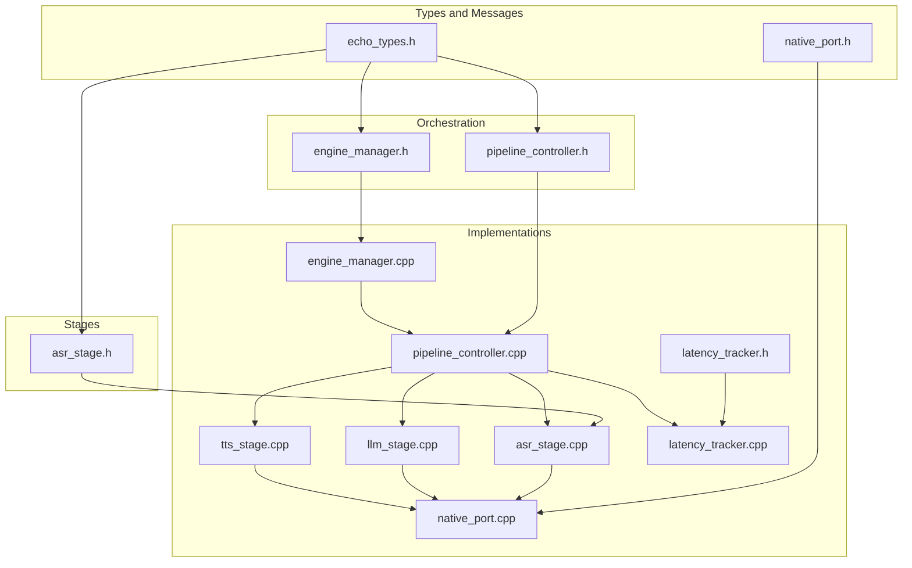
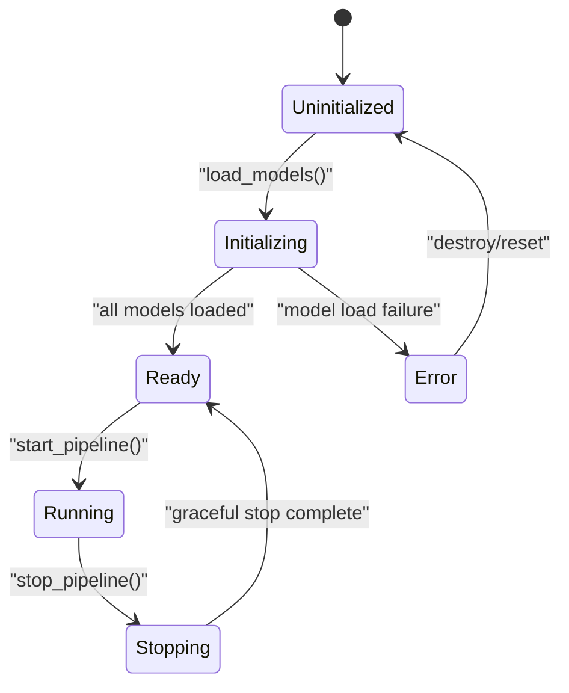
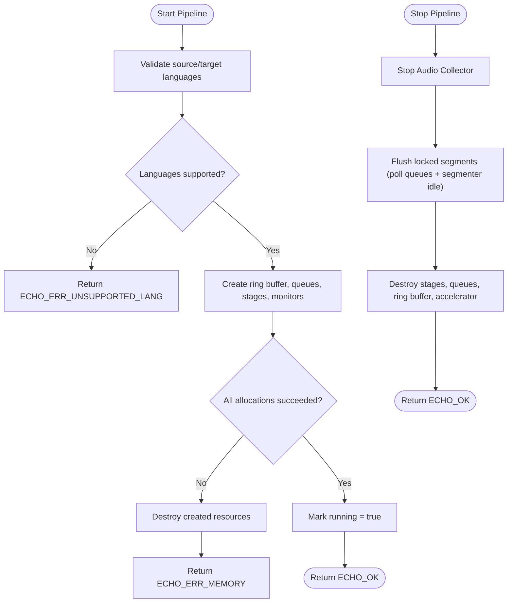
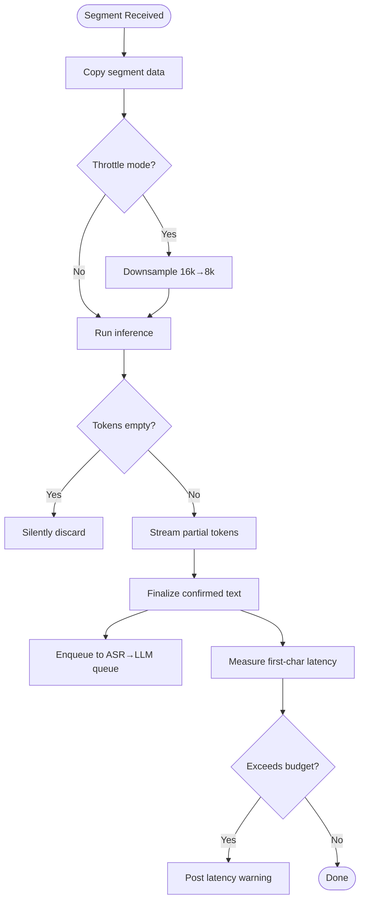
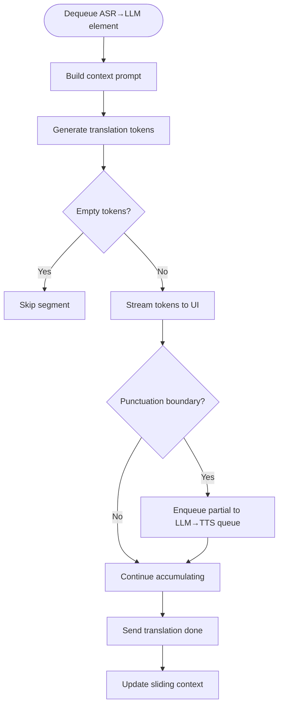
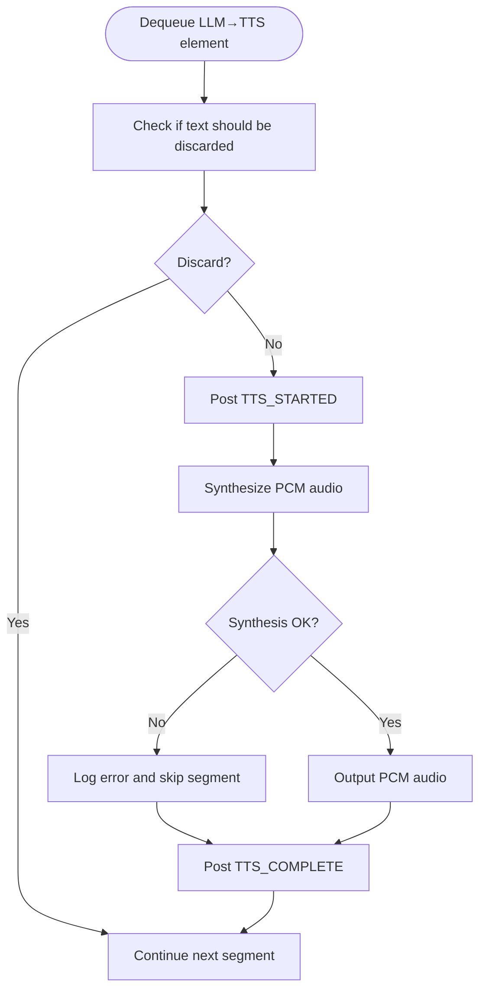
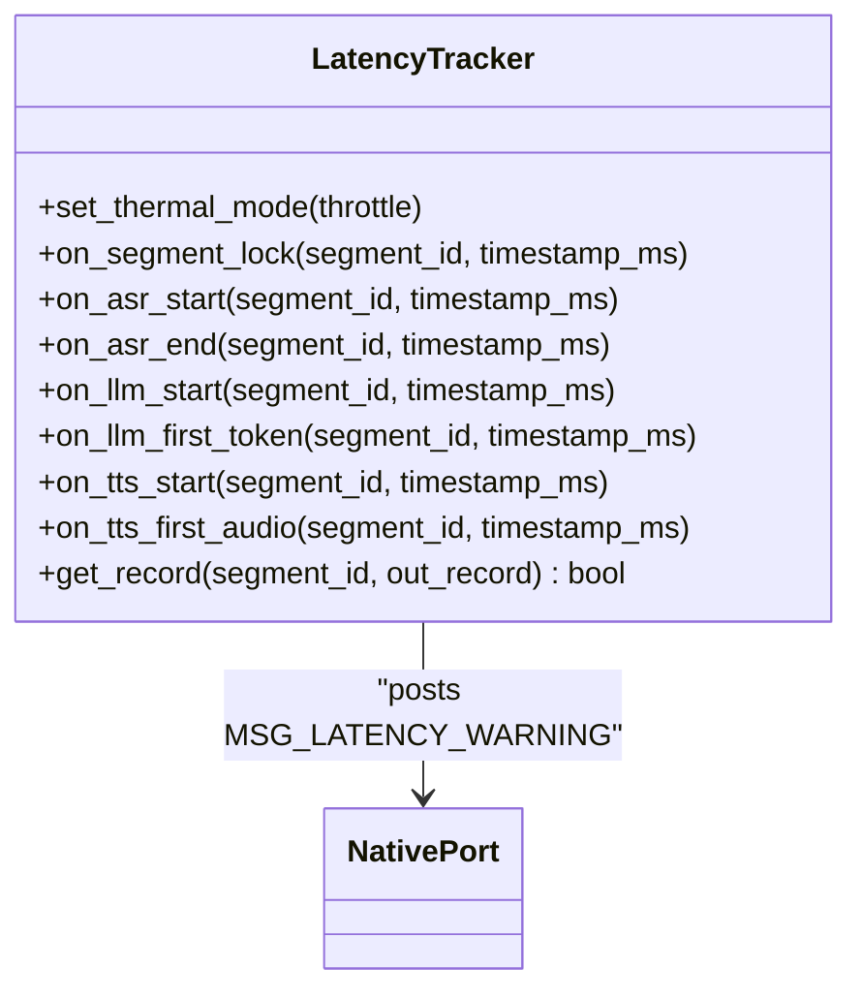
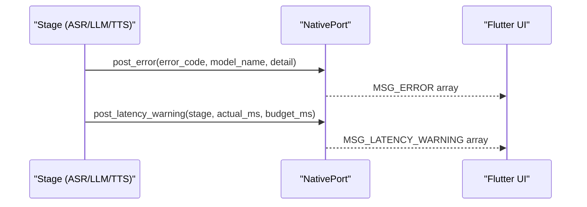
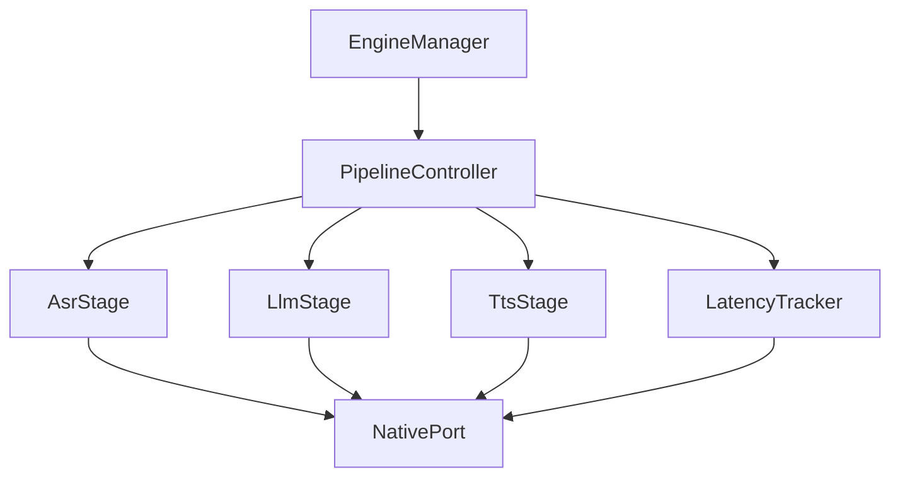

# Error Handling and Propagation

<cite>
**Referenced Files in This Document**
- [echo_types.h](file://native/include/echo_types.h)
- [pipeline_controller.h](file://native/include/pipeline_controller.h)
- [pipeline_controller.cpp](file://native/src/pipeline_controller.cpp)
- [asr_stage.h](file://native/include/asr_stage.h)
- [asr_stage.cpp](file://native/src/asr_stage.cpp)
- [llm_stage.cpp](file://native/src/llm_stage.cpp)
- [tts_stage.cpp](file://native/src/tts_stage.cpp)
- [native_port.h](file://native/include/native_port.h)
- [native_port.cpp](file://native/src/native_port.cpp)
- [latency_tracker.h](file://native/include/latency_tracker.h)
- [latency_tracker.cpp](file://native/src/latency_tracker.cpp)
- [engine_manager.h](file://native/include/engine_manager.h)
- [engine_manager.cpp](file://native/src/engine_manager.cpp)
- [test_echo_types.cpp](file://native/tests/test_echo_types.cpp)
</cite>

## Table of Contents
1. [Introduction](#introduction)
2. [Project Structure](#project-structure)
3. [Core Components](#core-components)
4. [Architecture Overview](#architecture-overview)
5. [Detailed Component Analysis](#detailed-component-analysis)
6. [Dependency Analysis](#dependency-analysis)
7. [Performance Considerations](#performance-considerations)
8. [Troubleshooting Guide](#troubleshooting-guide)
9. [Conclusion](#conclusion)

## Introduction
This document explains how errors are defined, propagated, and reported across the audio processing pipeline stages (ASR → LLM → TTS). It covers:
- The error code system used by C-linkage entry points
- How different error types are handled at each pipeline level
- Recovery strategies, retry mechanisms, and graceful degradation patterns
- Logging and debugging support for diagnosis
- Examples of handling specific error scenarios and implementing custom error handlers

The goal is to provide a clear mental model of where failures can occur, how they surface to callers, and how the system maintains stability under adverse conditions.

## Project Structure
Error handling spans multiple layers:
- Core type definitions and error codes
- Pipeline orchestration and lifecycle management
- Stage-level processing with per-stage SLA monitoring
- Cross-cutting latency tracking and native messaging to the UI
- Engine state machine controlling initialization and session lifecycle



**Diagram sources**
- [echo_types.h:1-136](file://native/include/echo_types.h#L1-L136)
- [native_port.h:1-179](file://native/include/native_port.h#L1-L179)
- [engine_manager.h:1-104](file://native/include/engine_manager.h#L1-L104)
- [pipeline_controller.h:1-107](file://native/include/pipeline_controller.h#L1-L107)
- [asr_stage.h:1-104](file://native/include/asr_stage.h#L1-L104)
- [engine_manager.cpp:1-202](file://native/src/engine_manager.cpp#L1-L202)
- [pipeline_controller.cpp:1-488](file://native/src/pipeline_controller.cpp#L1-L488)
- [asr_stage.cpp:1-341](file://native/src/asr_stage.cpp#L1-L341)
- [llm_stage.cpp:1-412](file://native/src/llm_stage.cpp#L1-L412)
- [tts_stage.cpp:1-315](file://native/src/tts_stage.cpp#L1-L315)
- [native_port.cpp:1-320](file://native/src/native_port.cpp#L1-L320)
- [latency_tracker.h:1-224](file://native/include/latency_tracker.h#L1-L224)
- [latency_tracker.cpp:1-285](file://native/src/latency_tracker.cpp#L1-L285)

**Section sources**
- [echo_types.h:1-136](file://native/include/echo_types.h#L1-L136)
- [native_port.h:1-179](file://native/include/native_port.h#L1-L179)
- [engine_manager.h:1-104](file://native/include/engine_manager.h#L1-L104)
- [pipeline_controller.h:1-107](file://native/include/pipeline_controller.h#L1-L107)
- [asr_stage.h:1-104](file://native/include/asr_stage.h#L1-L104)

## Core Components
- Error codes and message tags:
  - EchoErrorCode defines return values for all C-linkage entry points; zero indicates success, negative values indicate specific failure categories.
  - MessageType enumerates cross-layer messages including MSG_ERROR for asynchronous error notifications.
- Native Port:
  - Provides typed functions to post structured messages to the Flutter UI, including error and warning messages.
- Latency Tracker:
  - Records timestamps at stage boundaries and posts latency warnings when budgets are exceeded.
- Pipeline Controller:
  - Orchestrates creation, startup, and graceful shutdown of all components; validates inputs and returns standardized error codes.
- Engine Manager:
  - Implements engine lifecycle state transitions and guards invalid operations with appropriate error codes.
- Stages (ASR, LLM, TTS):
  - Each stage runs on its own thread, processes data asynchronously, and reports SLA violations via latency warnings.

**Section sources**
- [echo_types.h:44-62](file://native/include/echo_types.h#L44-L62)
- [native_port.h:141-172](file://native/include/native_port.h#L141-L172)
- [latency_tracker.h:34-49](file://native/include/latency_tracker.h#L34-L49)
- [pipeline_controller.h:48-82](file://native/include/pipeline_controller.h#L48-L82)
- [engine_manager.h:6-16](file://native/include/engine_manager.h#L6-L16)

## Architecture Overview
End-to-end error propagation combines synchronous return codes and asynchronous messages:
- Synchronous path:
  - Initialization and start calls return EchoErrorCode values indicating configuration or resource issues.
- Asynchronous path:
  - Runtime events (thermal changes, memory pressure, latency violations, synthesis failures) are posted as typed messages to the UI via Native Port.

```mermaid
sequenceDiagram
participant Caller as "Caller"
participant EM as "EngineManager"
participant PC as "PipelineController"
participant ASR as "AsrStage"
participant LLM as "LlmStage"
participant TTS as "TtsStage"
participant NP as "NativePort"
Caller->>EM : load_models(paths)
EM-->>Caller : EchoErrorCode
Caller->>EM : start_pipeline(src, tgt)
EM->>PC : start(src, tgt)
PC-->>EM : EchoErrorCode
EM-->>Caller : EchoErrorCode
Note over ASR,LLM,TTS : During runtime, stages may report warnings/errors via NativePort
ASR->>NP : MSG_LATENCY_WARNING / MSG_ASR_*
LLM->>NP : MSG_LATENCY_WARNING / MSG_TRANSLATION_*
TTS->>NP : MSG_LATENCY_WARNING / MSG_TTS_* / MSG_ERROR
```

**Diagram sources**
- [engine_manager.cpp:44-141](file://native/src/engine_manager.cpp#L44-L141)
- [pipeline_controller.cpp:272-393](file://native/src/pipeline_controller.cpp#L272-L393)
- [asr_stage.cpp:214-241](file://native/src/asr_stage.cpp#L214-L241)
- [llm_stage.cpp:298-316](file://native/src/llm_stage.cpp#L298-L316)
- [tts_stage.cpp:234-251](file://native/src/tts_stage.cpp#L234-L251)
- [native_port.cpp:283-300](file://native/src/native_port.cpp#L283-L300)

## Detailed Component Analysis

### Error Code System (EchoErrorCode and MessageType)
- EchoErrorCode:
  - Zero means success; negative integers represent distinct error categories such as uninitialized state, already initialized, missing/invalid models, memory issues, unsupported language, active session, no session, no port, engine not ready, and thermal critical.
- MessageType:
  - Includes MSG_ERROR for general error notifications and other operational messages like thermal state, memory warnings, latency warnings, and sample drops.

Usage patterns:
- All C-linkage entry points return EchoErrorCode for immediate caller feedback.
- Asynchronous runtime events use Native Port message types to inform the UI without blocking pipeline threads.

**Section sources**
- [echo_types.h:44-62](file://native/include/echo_types.h#L44-L62)
- [echo_types.h:26-42](file://native/include/echo_types.h#L26-L42)
- [test_echo_types.cpp:36-51](file://native/tests/test_echo_types.cpp#L36-L51)

### Engine Manager State Machine and Error Propagation
- State transitions:
  - Uninitialized → Initializing → Ready (success)
  - Uninitialized → Initializing → Error (failure during model loading)
  - Ready → Running (start pipeline)
  - Running → Stopping → Ready (stop pipeline)
- Error propagation:
  - Invalid states or duplicate sessions return specific error codes.
  - Model loading failures transition to Error and propagate the underlying error code.



**Diagram sources**
- [engine_manager.h:6-16](file://native/include/engine_manager.h#L6-L16)
- [engine_manager.cpp:44-100](file://native/src/engine_manager.cpp#L44-L100)
- [engine_manager.cpp:102-168](file://native/src/engine_manager.cpp#L102-L168)

**Section sources**
- [engine_manager.h:6-16](file://native/include/engine_manager.h#L6-L16)
- [engine_manager.cpp:44-100](file://native/src/engine_manager.cpp#L44-L100)
- [engine_manager.cpp:102-168](file://native/src/engine_manager.cpp#L102-L168)

### Pipeline Controller: Validation, Resource Errors, and Graceful Stop
- Input validation:
  - Language pair validation returns unsupported language error.
  - Duplicate session detection returns active session error.
- Resource allocation:
  - Allocation failures return memory error; partial cleanup occurs before returning.
- Graceful stop:
  - Stops audio capture, flushes locked segments, waits until queues drain within a deadline, then destroys resources.



**Diagram sources**
- [pipeline_controller.cpp:272-393](file://native/src/pipeline_controller.cpp#L272-L393)
- [pipeline_controller.cpp:395-469](file://native/src/pipeline_controller.cpp#L395-L469)

**Section sources**
- [pipeline_controller.h:48-82](file://native/include/pipeline_controller.h#L48-L82)
- [pipeline_controller.cpp:272-393](file://native/src/pipeline_controller.cpp#L272-L393)
- [pipeline_controller.cpp:395-469](file://native/src/pipeline_controller.cpp#L395-L469)

### ASR Stage: Error Handling and Degradation
- Processing flow:
  - Enqueues locked segments for async processing.
  - In throttle mode, resamples audio to reduce compute.
  - Streams partial tokens and finalizes confirmed text.
- Error handling:
  - Noise-only/unintelligible segments are silently discarded (no downstream effects).
  - First-character latency measured; if exceeded, posts latency warning.
- Degradation:
  - Throttle mode reduces sample rate to meet performance constraints.



**Diagram sources**
- [asr_stage.cpp:167-271](file://native/src/asr_stage.cpp#L167-L271)
- [asr_stage.cpp:297-318](file://native/src/asr_stage.cpp#L297-L318)

**Section sources**
- [asr_stage.h:58-97](file://native/include/asr_stage.h#L58-L97)
- [asr_stage.cpp:167-271](file://native/src/asr_stage.cpp#L167-L271)
- [asr_stage.cpp:297-318](file://native/src/asr_stage.cpp#L297-L318)

### LLM Stage: Context Management and Latency Reporting
- Processing flow:
  - Polls input queue for confirmed ASR text.
  - Builds context from sliding history and current segment.
  - Streams translation tokens and enqueues partial results at punctuation boundaries.
- Error handling:
  - Empty token streams are skipped.
  - First-token latency measured; if exceeded, posts latency warning.
- Degradation:
  - Context window size adapts based on thermal mode.



**Diagram sources**
- [llm_stage.cpp:243-361](file://native/src/llm_stage.cpp#L243-L361)

**Section sources**
- [llm_stage.cpp:243-361](file://native/src/llm_stage.cpp#L243-L361)

### TTS Stage: Synthesis Failures and Lifecycle Consistency
- Processing flow:
  - Discards whitespace/punctuation-only segments without starting synthesis.
  - Posts TTS_STARTED, synthesizes audio, posts TTS_COMPLETE.
- Error handling:
  - On synthesis failure, logs an error, skips segment, but still posts TTS_COMPLETE to maintain lifecycle consistency.
- Degradation:
  - Stub synthesis caps output length to avoid excessive memory usage.



**Diagram sources**
- [tts_stage.cpp:191-272](file://native/src/tts_stage.cpp#L191-L272)

**Section sources**
- [tts_stage.cpp:191-272](file://native/src/tts_stage.cpp#L191-L272)

### Latency Tracker: SLA Monitoring and Warning Reporting
- Tracks timestamps at key boundaries and checks per-stage and E2E budgets.
- When budgets are exceeded, posts latency warnings identifying the offending stage and actual vs. budgeted latency.
- Adapts E2E budget based on thermal mode.



**Diagram sources**
- [latency_tracker.h:107-217](file://native/include/latency_tracker.h#L107-L217)
- [latency_tracker.cpp:122-128](file://native/src/latency_tracker.cpp#L122-L128)

**Section sources**
- [latency_tracker.h:34-49](file://native/include/latency_tracker.h#L34-L49)
- [latency_tracker.cpp:122-128](file://native/src/latency_tracker.cpp#L122-L128)
- [latency_tracker.cpp:240-267](file://native/src/latency_tracker.cpp#L240-L267)

### Native Port: Asynchronous Error and Warning Messaging
- Provides typed functions to post structured messages to the Flutter UI.
- Error reporting:
  - MSG_ERROR carries error_code, model_name, and detail_string.
  - MSG_LATENCY_WARNING carries stage name, actual_ms, and budget_ms.
- Robustness:
  - Posting functions check registration and function pointer availability; return false if unavailable.



**Diagram sources**
- [native_port.h:141-172](file://native/include/native_port.h#L141-L172)
- [native_port.cpp:228-245](file://native/src/native_port.cpp#L228-L245)
- [native_port.cpp:283-300](file://native/src/native_port.cpp#L283-L300)

**Section sources**
- [native_port.h:141-172](file://native/include/native_port.h#L141-L172)
- [native_port.cpp:228-245](file://native/src/native_port.cpp#L228-L245)
- [native_port.cpp:283-300](file://native/src/native_port.cpp#L283-L300)

## Dependency Analysis
- Coupling:
  - Stages depend on Native Port for asynchronous messaging and on bounded queues for inter-stage communication.
  - Pipeline Controller depends on all stages and monitors; it orchestrates lifecycle and resource management.
  - Engine Manager depends on Pipeline Controller and Model Loader; it enforces state transitions and guards invalid operations.
- Cohesion:
  - Each stage encapsulates its own worker thread and processing logic, improving modularity.
- External dependencies:
  - HAL Accelerator may be null in stub mode; stages handle this gracefully.
  - Dart Native Port requires registration and a posting function; otherwise, messages are dropped safely.



**Diagram sources**
- [engine_manager.cpp:102-141](file://native/src/engine_manager.cpp#L102-L141)
- [pipeline_controller.cpp:272-393](file://native/src/pipeline_controller.cpp#L272-L393)
- [asr_stage.cpp:214-241](file://native/src/asr_stage.cpp#L214-L241)
- [llm_stage.cpp:298-316](file://native/src/llm_stage.cpp#L298-L316)
- [tts_stage.cpp:234-251](file://native/src/tts_stage.cpp#L234-L251)
- [latency_tracker.cpp:122-128](file://native/src/latency_tracker.cpp#L122-L128)

**Section sources**
- [engine_manager.cpp:102-141](file://native/src/engine_manager.cpp#L102-L141)
- [pipeline_controller.cpp:272-393](file://native/src/pipeline_controller.cpp#L272-L393)

## Performance Considerations
- SLA budgets:
  - ASR first-character ≤200ms, LLM first-token ≤450ms, TTS time-to-first-audio ≤100ms.
  - E2E budgets: Normal ≤800ms, Throttle ≤1200ms.
- Cascade truncation:
  - Early TTS start at punctuation boundaries reduces perceived latency.
- Thermal adaptation:
  - Lower sample rates and smaller context windows mitigate performance pressure.
- Memory limits:
  - Critical memory pressure triggers graceful pipeline stop to prevent instability.

[No sources needed since this section provides general guidance]

## Troubleshooting Guide
Common error scenarios and recommended actions:
- Initialization failures:
  - Check model paths and permissions; ensure models exist and are readable.
  - If already initialized, reset or destroy the manager before reloading.
- Unsupported language:
  - Verify ISO 639-1 codes against supported list; adjust configuration accordingly.
- Session conflicts:
  - Ensure previous sessions are stopped before starting a new one.
- Latency violations:
  - Inspect MSG_LATENCY_WARNING payloads to identify offending stages; consider enabling throttle mode or reducing workload.
- Synthesis failures:
  - Review stderr logs for TTS errors; confirm audio output path availability; continue processing next segments.
- No port registered:
  - Ensure Native Port is registered and posting function is set; otherwise, messages will be dropped.

Recovery strategies:
- Graceful stop:
  - Stop audio capture, flush locked segments, wait for queues to drain, then destroy resources.
- Degradation:
  - Switch to throttle mode to reduce resource consumption while maintaining operation.
- Retry mechanisms:
  - For transient errors (e.g., temporary I/O issues), implement caller-side retries with backoff; stages themselves do not auto-retry heavy operations.

**Section sources**
- [pipeline_controller.cpp:395-469](file://native/src/pipeline_controller.cpp#L395-L469)
- [tts_stage.cpp:241-251](file://native/src/tts_stage.cpp#L241-L251)
- [native_port.cpp:62-75](file://native/src/native_port.cpp#L62-L75)

## Conclusion
The QwenEcho pipeline employs a layered error handling strategy combining synchronous return codes and asynchronous messaging. Error codes clearly communicate configuration and resource issues to callers, while Native Port messages keep the UI informed about runtime conditions. Stages degrade gracefully under pressure, and the latency tracker ensures SLA compliance. By following the documented recovery strategies and leveraging the provided APIs, developers can implement robust error handling and extend functionality through custom handlers.

[No sources needed since this section summarizes without analyzing specific files]