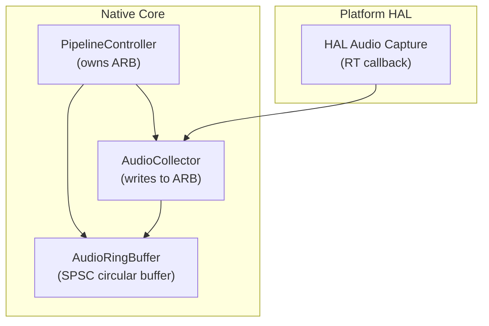
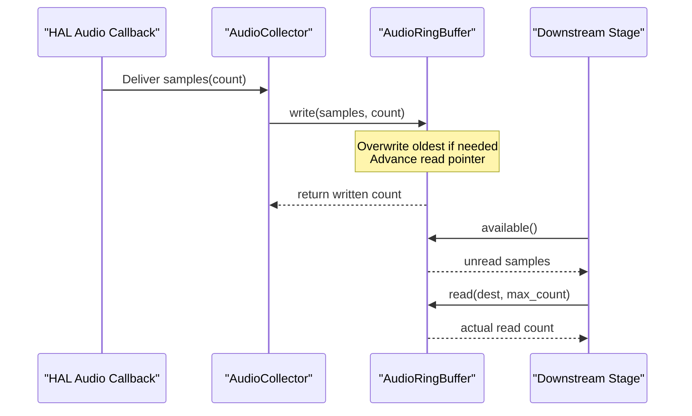
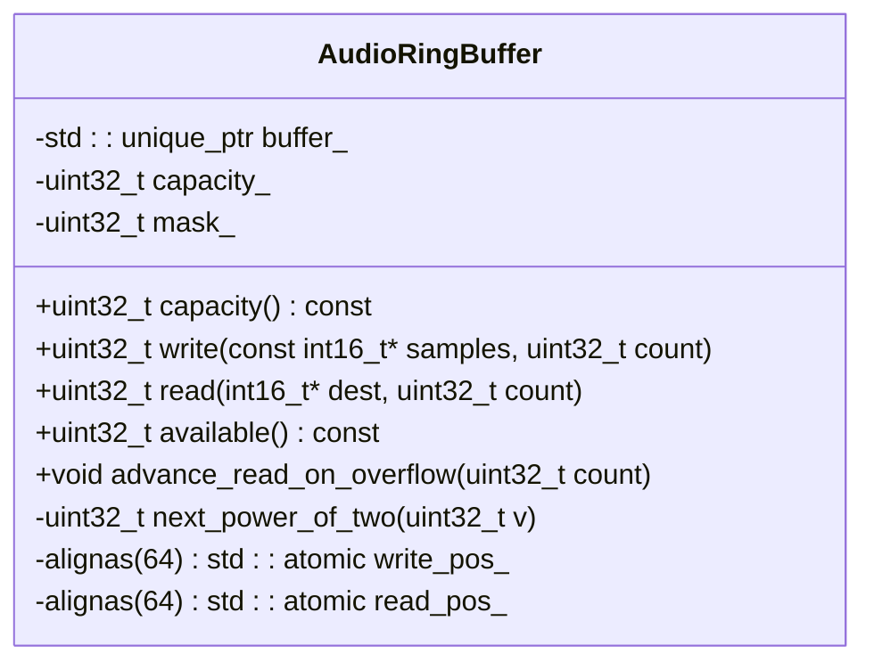
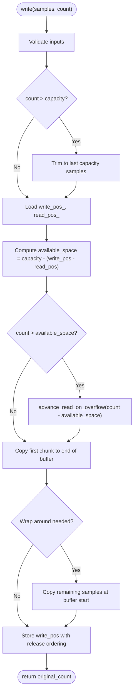
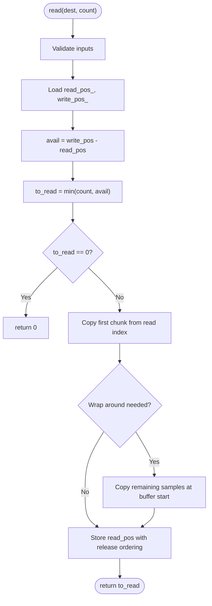
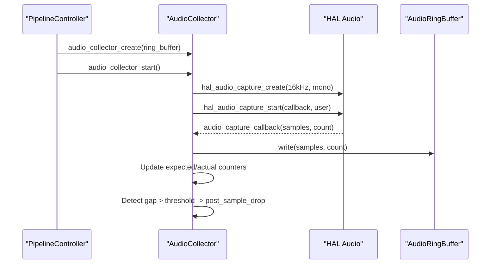
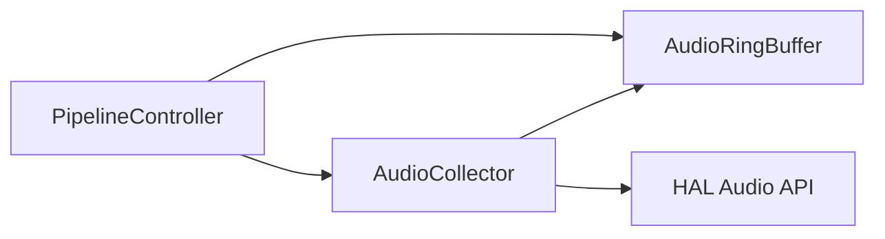

# AudioRingBuffer Implementation

<cite>
**Referenced Files in This Document**
- [audio_ring_buffer.h](file://native/include/audio_ring_buffer.h)
- [audio_collector.h](file://native/include/audio_collector.h)
- [audio_collector.cpp](file://native/src/audio_collector.cpp)
- [pipeline_controller.cpp](file://native/src/pipeline_controller.cpp)
- [test_audio_collector.cpp](file://native/tests/test_audio_collector.cpp)
</cite>

## Table of Contents
1. [Introduction](#introduction)
2. [Project Structure](#project-structure)
3. [Core Components](#core-components)
4. [Architecture Overview](#architecture-overview)
5. [Detailed Component Analysis](#detailed-component-analysis)
6. [Dependency Analysis](#dependency-analysis)
7. [Performance Considerations](#performance-considerations)
8. [Troubleshooting Guide](#troubleshooting-guide)
9. [Conclusion](#conclusion)
10. [Appendices](#appendices)

## Introduction
This document provides a comprehensive technical overview of the AudioRingBuffer component, a lock-free Single-Producer Single-Consumer (SPSC) circular buffer designed for real-time audio processing. It explains the ring buffer architecture optimized for continuous PCM streaming, memory management strategies for large buffers, and thread synchronization mechanisms that ensure safe concurrent read/write operations. The documentation also covers buffer wrapping behavior, overflow handling, integration with platform-specific audio APIs via the AudioCollector, performance optimizations such as cache-line alignment and efficient memory access patterns, and practical examples for initialization, data I/O, and utilization monitoring.

## Project Structure
The AudioRingBuffer is implemented as a C++ class and integrated into the native pipeline:
- Header definition: native/include/audio_ring_buffer.h
- Integration points:
  - Pipeline controller allocates and owns the ring buffer instance
  - AudioCollector writes captured audio samples into the ring buffer from a real-time HAL callback
- Tests validate end-to-end behavior including write/read and availability checks

**Diagram sources**
- [audio_ring_buffer.h](file://native/include/audio_ring_buffer.h)
- [audio_collector.cpp](file://native/src/audio_collector.cpp)
- [pipeline_controller.cpp](file://native/src/pipeline_controller.cpp)

**Section sources**
- [audio_ring_buffer.h](file://native/include/audio_ring_buffer.h)
- [audio_collector.h](file://native/include/audio_collector.h)
- [audio_collector.cpp](file://native/src/audio_collector.cpp)
- [pipeline_controller.cpp](file://native/src/pipeline_controller.cpp)

## Core Components
- AudioRingBuffer: Lock-free SPSC circular buffer for int16_t PCM samples with power-of-two capacity, atomic head/tail indices, and cache-line aligned positions to avoid false sharing.
- AudioCollector: Real-time audio capture component that writes samples into the shared ring buffer from a platform HAL callback and monitors sample drops.
- PipelineController: Owns the ring buffer lifecycle and coordinates creation/start/stop of components.

Key responsibilities:
- AudioRingBuffer: Provide non-blocking write/read, available count, and overflow handling by advancing the read pointer when necessary.
- AudioCollector: Configure platform audio capture at 16kHz mono, set real-time priority, and deliver samples to the ring buffer without blocking or allocating memory in the callback.
- PipelineController: Allocate the ring buffer with a large capacity (~2^20 samples), create and start the collector, and manage graceful shutdown.

**Section sources**
- [audio_ring_buffer.h](file://native/include/audio_ring_buffer.h)
- [audio_collector.h](file://native/include/audio_collector.h)
- [audio_collector.cpp](file://native/src/audio_collector.cpp)
- [pipeline_controller.cpp](file://native/src/pipeline_controller.cpp)

## Architecture Overview
The system uses a producer-consumer pattern where the producer is the platform HAL audio callback invoked on a real-time thread, and the consumer is typically a downstream stage (e.g., sentence segmenter or ASR) reading from the ring buffer. The ring buffer ensures low-latency, deterministic throughput by avoiding locks and using atomic indices with appropriate memory ordering.

**Diagram sources**
- [audio_collector.cpp](file://native/src/audio_collector.cpp)
- [audio_ring_buffer.h](file://native/include/audio_ring_buffer.h)

## Detailed Component Analysis

### AudioRingBuffer Class
The AudioRingBuffer implements a circular buffer optimized for real-time audio:
- Capacity: Power-of-two enforced; mask_ used for fast modulo via bitwise AND.
- Indices: Atomic uint32_t write_pos_ and read_pos_ with acquire/release semantics for visibility across threads.
- Alignment: Both indices are cache-line aligned (64 bytes) to prevent false sharing between producer and consumer.
- Overflow policy: If writing would exceed available space, advance_read_on_overflow() moves the read pointer forward to discard oldest samples, ensuring the producer never blocks.
- Memory layout: Buffer stored in a unique_ptr<int16_t[]>; zero-initialized at construction.

**Diagram sources**
- [audio_ring_buffer.h](file://native/include/audio_ring_buffer.h)

#### Write Flow

**Diagram sources**
- [audio_ring_buffer.h](file://native/include/audio_ring_buffer.h)

#### Read Flow

**Diagram sources**
- [audio_ring_buffer.h](file://native/include/audio_ring_buffer.h)

**Section sources**
- [audio_ring_buffer.h](file://native/include/audio_ring_buffer.h)

### AudioCollector Integration
The AudioCollector bridges platform audio capture to the ring buffer:
- Creation: Receives a non-owning pointer to an existing AudioRingBuffer.
- Start: Sets real-time priority, creates HAL capture (16kHz mono), initializes counters, marks running, and starts capture.
- Callback: Runs on RT thread; writes directly to the ring buffer, updates counters, computes expected vs actual samples, and posts sample drop events when gaps exceed threshold.
- Stop: Signals stop, halts capture, and cleans up resources.

**Diagram sources**
- [audio_collector.cpp](file://native/src/audio_collector.cpp)
- [audio_collector.h](file://native/include/audio_collector.h)
- [pipeline_controller.cpp](file://native/src/pipeline_controller.cpp)

**Section sources**
- [audio_collector.h](file://native/include/audio_collector.h)
- [audio_collector.cpp](file://native/src/audio_collector.cpp)
- [pipeline_controller.cpp](file://native/src/pipeline_controller.cpp)

### Pipeline Controller Ownership
The PipelineController manages the ring buffer lifecycle:
- Allocation: Creates AudioRingBuffer with a large capacity (~2^20 samples).
- Integration: Passes the ring buffer to AudioCollector during creation.
- Shutdown: Stops the collector before draining other stages; discards unlocked audio implicitly by destroying the ring buffer.

**Section sources**
- [pipeline_controller.cpp](file://native/src/pipeline_controller.cpp)

## Dependency Analysis
The following diagram shows key dependencies among components involved in audio streaming:

**Diagram sources**
- [pipeline_controller.cpp](file://native/src/pipeline_controller.cpp)
- [audio_collector.cpp](file://native/src/audio_collector.cpp)
- [audio_ring_buffer.h](file://native/include/audio_ring_buffer.h)

**Section sources**
- [pipeline_controller.cpp](file://native/src/pipeline_controller.cpp)
- [audio_collector.cpp](file://native/src/audio_collector.cpp)
- [audio_ring_buffer.h](file://native/include/audio_ring_buffer.h)

## Performance Considerations
- Cache-line alignment: write_pos_ and read_pos_ are aligned to 64 bytes to prevent false sharing between producer and consumer threads.
- Power-of-two capacity: Enables efficient modulo via bitmask (mask_), reducing division overhead.
- Lock-free design: Uses atomic indices with acquire/release ordering to ensure visibility without mutexes.
- Zero-copy considerations: Data is copied via memcpy in chunks; while not strictly zero-copy, it minimizes copies by splitting only when wrap-around occurs. For further optimization, consider DMA-friendly buffers or scatter-gather approaches depending on platform capabilities.
- Efficient memory access: Sequential memcpy operations align well with CPU prefetchers; keep chunk sizes reasonable to balance latency and throughput.
- Overflow handling: Producer advances read pointer to overwrite oldest samples, preventing backpressure and maintaining steady-state throughput.

[No sources needed since this section provides general guidance]

## Troubleshooting Guide
Common issues and diagnostics:
- No samples appear in the ring buffer:
  - Verify AudioCollector is started and running flag is true.
  - Ensure HAL capture was created and started successfully.
  - Check that the callback is invoked and writes to the ring buffer.
- Sample drops detected:
  - Monitor expected vs actual sample counts; gaps exceeding threshold trigger MSG_SAMPLE_DROP.
  - Investigate platform audio scheduling or CPU contention affecting RT thread.
- Ring buffer underutilization:
  - Use available() to monitor unread samples; adjust consumer processing rate or buffer size accordingly.
- Double-start errors:
  - Starting the collector twice returns an error code; ensure single start per lifecycle.

Validation references:
- Tests assert available() counts and read correctness after callbacks.
- Tests verify stop behavior and ignored callbacks after stop.

**Section sources**
- [test_audio_collector.cpp](file://native/tests/test_audio_collector.cpp)
- [audio_collector.cpp](file://native/src/audio_collector.cpp)

## Conclusion
The AudioRingBuffer provides a robust, lock-free foundation for real-time audio streaming within the QwenEcho pipeline. Its design emphasizes deterministic performance through cache-line alignment, power-of-two capacity, and minimal synchronization overhead. Integrated with the AudioCollector and managed by the PipelineController, it supports continuous audio capture and consumption with clear overflow semantics and straightforward monitoring via available(). Proper usage and monitoring enable high-quality, low-latency audio processing suitable for real-time applications.

[No sources needed since this section summarizes without analyzing specific files]

## Appendices

### Usage Examples (by reference)
- Initialization:
  - Create the ring buffer with a power-of-two capacity in the pipeline controller.
  - Reference path: [pipeline_controller.cpp](file://native/src/pipeline_controller.cpp)
- Writing audio data:
  - AudioCollector’s HAL callback writes samples to the ring buffer.
  - Reference path: [audio_collector.cpp](file://native/src/audio_collector.cpp)
- Reading audio data:
  - Downstream stages call read() with destination buffers and desired counts.
  - Reference path: [audio_ring_buffer.h](file://native/include/audio_ring_buffer.h)
- Monitoring utilization:
  - Call available() to check unread samples for QA and tuning.
  - Reference path: [audio_ring_buffer.h](file://native/include/audio_ring_buffer.h)

**Section sources**
- [pipeline_controller.cpp](file://native/src/pipeline_controller.cpp)
- [audio_collector.cpp](file://native/src/audio_collector.cpp)
- [audio_ring_buffer.h](file://native/include/audio_ring_buffer.h)