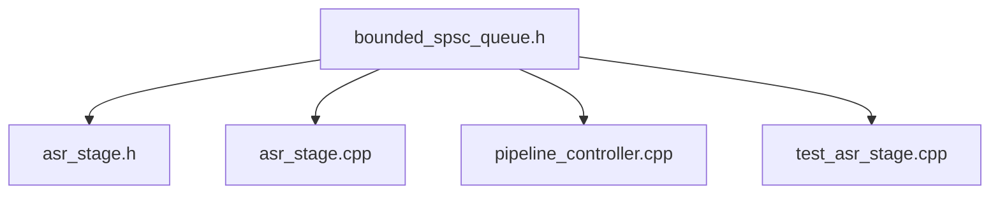
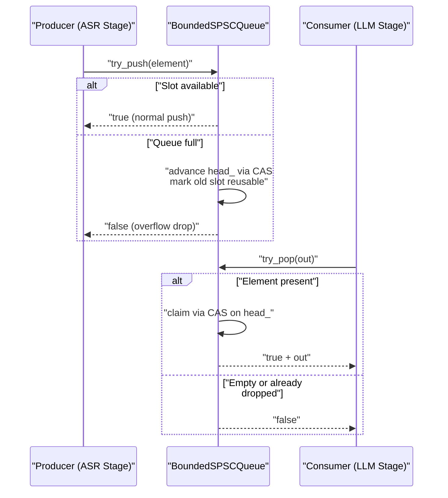
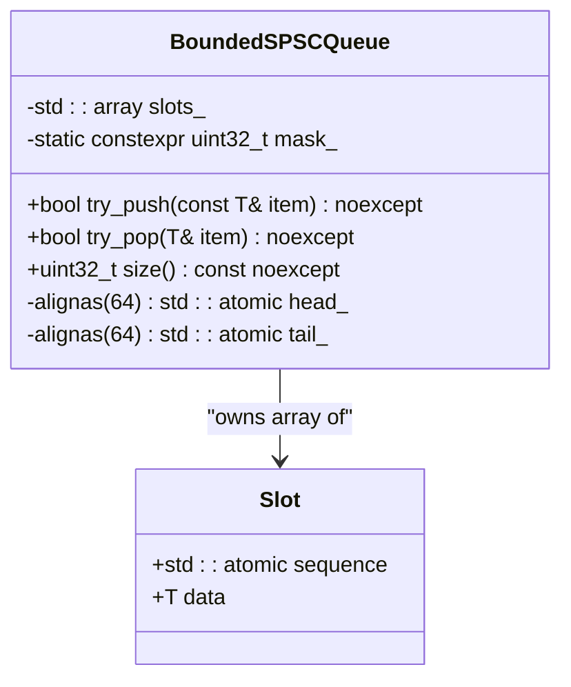
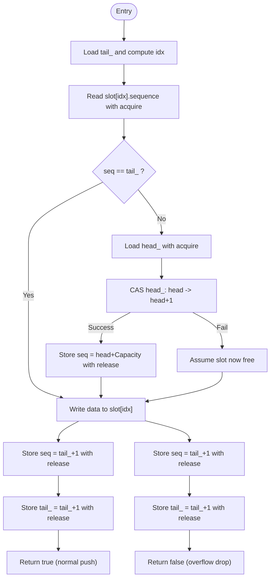
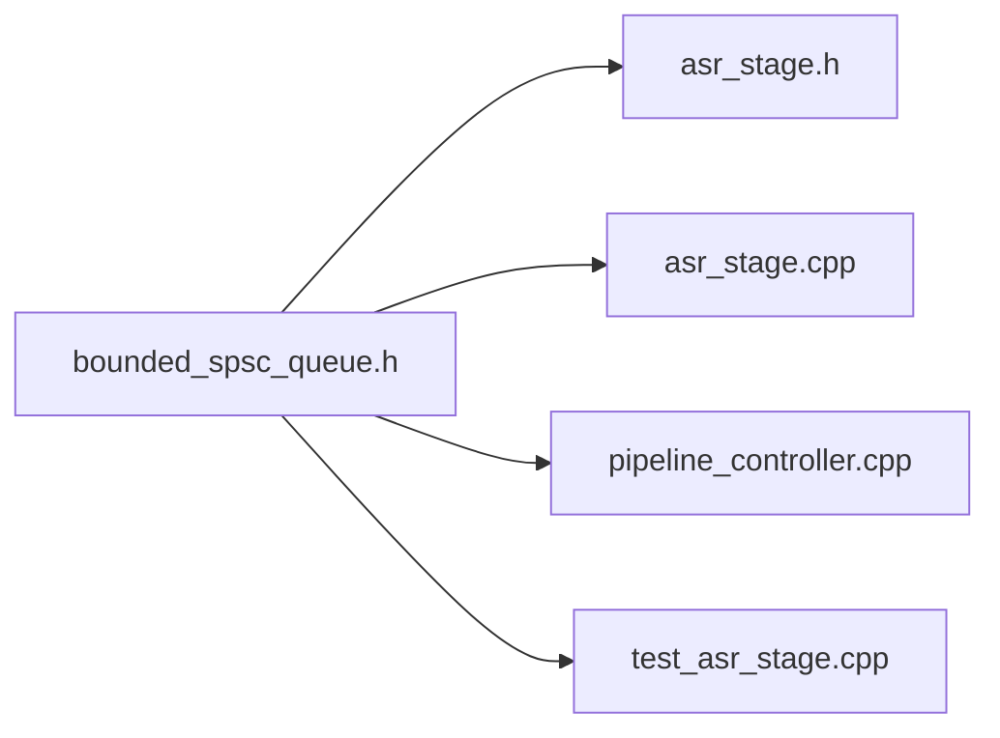

# BoundedSPSCQueue Implementation

<cite>
**Referenced Files in This Document**
- [bounded_spsc_queue.h](file://native/include/bounded_spsc_queue.h)
- [asr_stage.h](file://native/include/asr_stage.h)
- [asr_stage.cpp](file://native/src/asr_stage.cpp)
- [pipeline_controller.cpp](file://native/src/pipeline_controller.cpp)
- [test_asr_stage.cpp](file://native/tests/test_asr_stage.cpp)
</cite>

## Table of Contents
1. [Introduction](#introduction)
2. [Project Structure](#project-structure)
3. [Core Components](#core-components)
4. [Architecture Overview](#architecture-overview)
5. [Detailed Component Analysis](#detailed-component-analysis)
6. [Dependency Analysis](#dependency-analysis)
7. [Performance Considerations](#performance-considerations)
8. [Troubleshooting Guide](#troubleshooting-guide)
9. [Conclusion](#conclusion)
10. [Appendices](#appendices)

## Introduction
This document explains the lock-free, bounded, single-producer/single-consumer (SPSC) queue component used across the native pipeline. The queue provides:
- Fixed capacity with power-of-two requirement for efficient bitmask indexing
- Slot-based storage with per-slot sequence numbers to track occupancy and ownership
- Overflow-drop semantics: when full, the oldest element is dropped to make room for the new one; operations never block
- Atomic claim mechanism for safe concurrent access between producer and consumer
- Memory ordering using acquire/release/acq_rel to ensure correct visibility across threads
- Cache line alignment of head/tail indices to prevent false sharing

The queue is used as a high-throughput bridge between processing stages (e.g., ASR → LLM → TTS).

## Project Structure
The queue is implemented as a header-only template and is consumed by multiple components in the native layer.

**Diagram sources**
- [bounded_spsc_queue.h:1-145](file://native/include/bounded_spsc_queue.h#L1-L145)
- [asr_stage.h:20-54](file://native/include/asr_stage.h#L20-L54)
- [asr_stage.cpp:18-22](file://native/src/asr_stage.cpp#L18-L22)
- [pipeline_controller.cpp:40-52](file://native/src/pipeline_controller.cpp#L40-L52)
- [test_asr_stage.cpp:24-26](file://native/tests/test_asr_stage.cpp#L24-L26)

**Section sources**
- [bounded_spsc_queue.h:1-145](file://native/include/bounded_spsc_queue.h#L1-L145)
- [asr_stage.h:20-54](file://native/include/asr_stage.h#L20-L54)
- [asr_stage.cpp:18-22](file://native/src/asr_stage.cpp#L18-L22)
- [pipeline_controller.cpp:40-52](file://native/src/pipeline_controller.cpp#L40-L52)
- [test_asr_stage.cpp:24-26](file://native/tests/test_asr_stage.cpp#L24-L26)

## Core Components
- BoundedSPSCQueue<T, Capacity>: Lock-free SPSC queue with overflow-drop semantics.
  - Capacity must be a power of two and at least 2.
  - Uses a circular buffer of slots indexed via bitmask.
  - Each slot has an atomic sequence number and a data field.
  - Head and tail are aligned on separate cache lines to avoid false sharing.
  - Methods:
    - try_push(item): non-blocking push with overflow-drop behavior; returns true if normal push, false if overflow occurred.
    - try_pop(out): non-blocking pop; returns true if item was dequeued, false if empty or already dropped due to overflow.
    - size(): approximate current length (0..Capacity).

Key design highlights:
- Sequence/turn protocol ensures that producers and consumers only access slots when they are ready.
- On overflow, the producer attempts to advance head_ via CAS to discard the oldest element before writing the new one.
- Consumers claim elements by advancing head_ via CAS; if CAS fails, it means the element was already dropped by overflow.

**Section sources**
- [bounded_spsc_queue.h:8-28](file://native/include/bounded_spsc_queue.h#L8-L28)
- [bounded_spsc_queue.h:29-39](file://native/include/bounded_spsc_queue.h#L29-L39)
- [bounded_spsc_queue.h:51-85](file://native/include/bounded_spsc_queue.h#L51-L85)
- [bounded_spsc_queue.h:93-116](file://native/include/bounded_spsc_queue.h#L93-L116)
- [bounded_spsc_queue.h:123-128](file://native/include/bounded_spsc_queue.h#L123-L128)
- [bounded_spsc_queue.h:130-142](file://native/include/bounded_spsc_queue.h#L130-L142)

## Architecture Overview
The queue connects processing stages in a unidirectional flow:
- Producer stage writes items into the queue (e.g., ASR stage enqueues confirmed text elements).
- Consumer stage reads items from the queue (e.g., LLM stage consumes ASR outputs).

**Diagram sources**
- [bounded_spsc_queue.h:51-85](file://native/include/bounded_spsc_queue.h#L51-L85)
- [bounded_spsc_queue.h:93-116](file://native/include/bounded_spsc_queue.h#L93-L116)
- [asr_stage.h:48-54](file://native/include/asr_stage.h#L48-L54)
- [asr_stage.cpp:64-82](file://native/src/asr_stage.cpp#L64-L82)
- [pipeline_controller.cpp:107-126](file://native/src/pipeline_controller.cpp#L107-L126)

## Detailed Component Analysis

### Class and Data Layout
The queue uses a simple class with private state and public methods. Internally, each slot holds an atomic sequence counter and user data.

**Diagram sources**
- [bounded_spsc_queue.h:29-39](file://native/include/bounded_spsc_queue.h#L29-L39)
- [bounded_spsc_queue.h:130-142](file://native/include/bounded_spsc_queue.h#L130-L142)

**Section sources**
- [bounded_spsc_queue.h:29-39](file://native/include/bounded_spsc_queue.h#L29-L39)
- [bounded_spsc_queue.h:130-142](file://native/include/bounded_spsc_queue.h#L130-L142)

### Concurrency Model and Ownership
- tail_ is exclusively written by the producer in try_push().
- head_ is advanced by both the consumer (try_pop) and the producer (on overflow), using compare_exchange_strong to safely coordinate.
- Per-slot sequence numbers implement a turn protocol:
  - Producers write data then publish a sequence indicating readiness for consumption.
  - Consumers read data only when the sequence indicates readiness, then update the sequence to mark the slot reusable.

**Diagram sources**
- [bounded_spsc_queue.h:51-85](file://native/include/bounded_spsc_queue.h#L51-L85)

**Section sources**
- [bounded_spsc_queue.h:51-85](file://native/include/bounded_spsc_queue.h#L51-L85)

### try_push() Overflow Handling Strategy
- If the target slot is empty (sequence equals tail_), perform a normal push and return true.
- If full:
  - Attempt to advance head_ via CAS to discard the oldest element.
  - On success, mark the discarded slot’s sequence to allow reuse.
  - Regardless of CAS outcome, proceed to write the new item and update tail_.
  - Return false to signal that an overflow drop occurred.

Operational guarantees:
- Never blocks.
- Oldest element is dropped to accommodate the new one.
- The returned boolean allows callers to detect drops.

**Section sources**
- [bounded_spsc_queue.h:51-85](file://native/include/bounded_spsc_queue.h#L51-L85)

### try_pop() Atomic Claim Mechanism
- Load head_ and check the corresponding slot’s sequence.
- If not ready (queue empty or already consumed), return false.
- Otherwise, attempt to claim the slot by advancing head_ via CAS.
- If CAS fails, the element was already dropped by overflow; return false.
- If successful, copy data out, mark the slot reusable, and return true.

**Section sources**
- [bounded_spsc_queue.h:93-116](file://native/include/bounded_spsc_queue.h#L93-L116)

### Memory Ordering and Cache Line Alignment
- Memory ordering:
  - Loads use memory_order_acquire to synchronize with prior releases.
  - Stores use memory_order_release to publish data and index updates.
  - CAS uses memory_order_acq_rel for success path and memory_order_acquire for failure path.
- False sharing prevention:
  - head_ and tail_ are aligned to 64-byte cache lines to avoid contention due to false sharing.

Practical implications:
- Correct synchronization without heavy barriers.
- Reduced cross-core cache invalidation traffic.

**Section sources**
- [bounded_spsc_queue.h:18-28](file://native/include/bounded_spsc_queue.h#L18-L28)
- [bounded_spsc_queue.h:138-142](file://native/include/bounded_spsc_queue.h#L138-L142)

### Template Usage and Capacity Configuration
- Default capacity is 64; can be customized via the template parameter.
- Capacity must be a power of two and at least 2.
- Typical usage pattern:
  - Create a queue instance with desired type and capacity.
  - Producer calls try_push(); consumer calls try_pop().
  - Use size() for diagnostics or backpressure decisions.

Examples in this codebase:
- ASR stage integrates with a BoundedSPSCQueue to deliver confirmed text to downstream stages.
- Pipeline controller manages queues between stages.

**Section sources**
- [bounded_spsc_queue.h:29-32](file://native/include/bounded_spsc_queue.h#L29-L32)
- [asr_stage.h:48-54](file://native/include/asr_stage.h#L48-L54)
- [pipeline_controller.cpp:107-126](file://native/src/pipeline_controller.cpp#L107-L126)

### Performance Characteristics Under Different Loads
- Low load (producer slower than consumer):
  - Most pushes succeed normally; minimal CAS activity; low latency.
- Balanced load (producer ≈ consumer):
  - Occasional overflow events; occasional CAS retries; throughput remains high.
- High producer pressure (producer faster than consumer):
  - Frequent overflow drops; CAS attempts to advance head_; still non-blocking but higher contention.
- Power-of-two capacity enables fast modulo via bitwise AND, reducing overhead.

[No sources needed since this section provides general guidance]

## Dependency Analysis
The queue is a header-only dependency consumed by multiple modules.

**Diagram sources**
- [bounded_spsc_queue.h:1-145](file://native/include/bounded_spsc_queue.h#L1-L145)
- [asr_stage.h:20-54](file://native/include/asr_stage.h#L20-L54)
- [asr_stage.cpp:18-22](file://native/src/asr_stage.cpp#L18-L22)
- [pipeline_controller.cpp:40-52](file://native/src/pipeline_controller.cpp#L40-L52)
- [test_asr_stage.cpp:24-26](file://native/tests/test_asr_stage.cpp#L24-L26)

**Section sources**
- [bounded_spsc_queue.h:1-145](file://native/include/bounded_spsc_queue.h#L1-L145)
- [asr_stage.h:20-54](file://native/include/asr_stage.h#L20-L54)
- [asr_stage.cpp:18-22](file://native/src/asr_stage.cpp#L18-L22)
- [pipeline_controller.cpp:40-52](file://native/src/pipeline_controller.cpp#L40-L52)
- [test_asr_stage.cpp:24-26](file://native/tests/test_asr_stage.cpp#L24-L26)

## Performance Considerations
- Prefer capacities that are powers of two to leverage bitmask indexing.
- Choose capacity based on expected burstiness and average throughput to minimize overflow drops.
- Keep payload sizes reasonable; large objects may increase memory bandwidth pressure.
- Monitor size() for backpressure strategies if needed.
- Ensure producer/consumer workloads are balanced to reduce contention on head_/tail_.

[No sources needed since this section provides general guidance]

## Troubleshooting Guide
Common issues and checks:
- Incorrect capacity:
  - Compilation will fail if capacity is not a power of two or less than 2.
- Unexpected empty pops:
  - Verify that try_pop is called after try_push returns true or that size() > 0.
  - Remember that under overflow, previously pushed items may be dropped.
- Overhead spikes:
  - Excessive overflow drops indicate producer too fast; consider increasing capacity or throttling.
- False sharing symptoms:
  - Confirm head_ and tail_ remain aligned; do not add fields between them.

**Section sources**
- [bounded_spsc_queue.h:31-32](file://native/include/bounded_spsc_queue.h#L31-L32)
- [bounded_spsc_queue.h:138-142](file://native/include/bounded_spsc_queue.h#L138-L142)

## Conclusion
BoundedSPSCQueue provides a high-performance, lock-free SPSC queue tailored for real-time pipelines. Its slot-based architecture with sequence numbers, power-of-two capacity, and careful memory ordering delivers predictable, non-blocking behavior even under overload, while cache line alignment minimizes contention. It is well-integrated into the native pipeline, enabling robust communication between ASR, LLM, and TTS stages.

[No sources needed since this section summarizes without analyzing specific files]

## Appendices

### API Reference Summary
- bool try_push(const T& item) noexcept
  - Non-blocking push with overflow-drop semantics.
  - Returns true on normal push; false if overflow occurred.
- bool try_pop(T& item) noexcept
  - Non-blocking pop with atomic claim.
  - Returns true if item was dequeued; false if empty or already dropped.
- uint32_t size() const noexcept
  - Approximate number of items currently in the queue.

**Section sources**
- [bounded_spsc_queue.h:51-85](file://native/include/bounded_spsc_queue.h#L51-L85)
- [bounded_spsc_queue.h:93-116](file://native/include/bounded_spsc_queue.h#L93-L116)
- [bounded_spsc_queue.h:123-128](file://native/include/bounded_spsc_queue.h#L123-L128)

### Integration Examples in Codebase
- ASR stage creates and uses a BoundedSPSCQueue to pass confirmed text to downstream stages.
- Pipeline controller allocates and owns queues between stages.
- Tests exercise queue usage alongside stage lifecycle.

**Section sources**
- [asr_stage.h:48-54](file://native/include/asr_stage.h#L48-L54)
- [pipeline_controller.cpp:107-126](file://native/src/pipeline_controller.cpp#L107-L126)
- [test_asr_stage.cpp:92-98](file://native/tests/test_asr_stage.cpp#L92-L98)