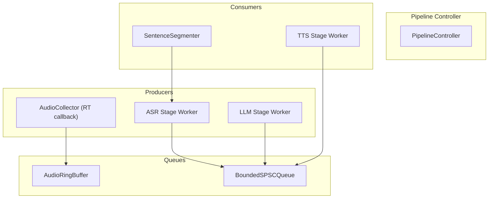
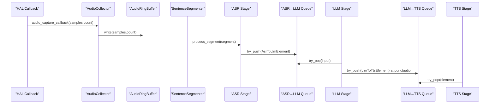
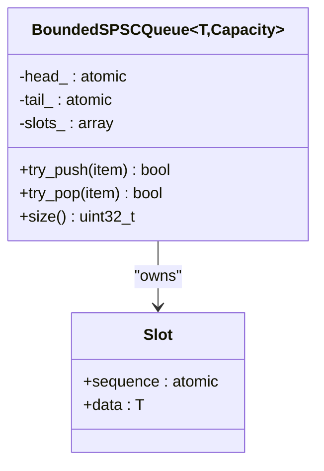
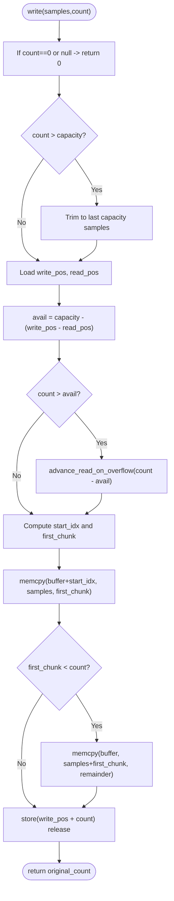
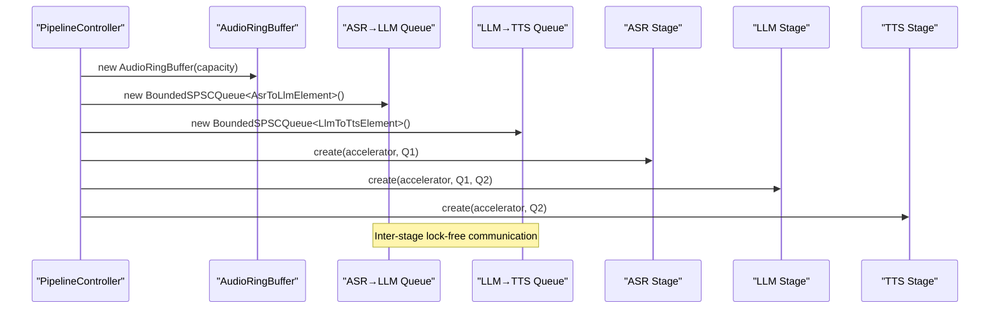
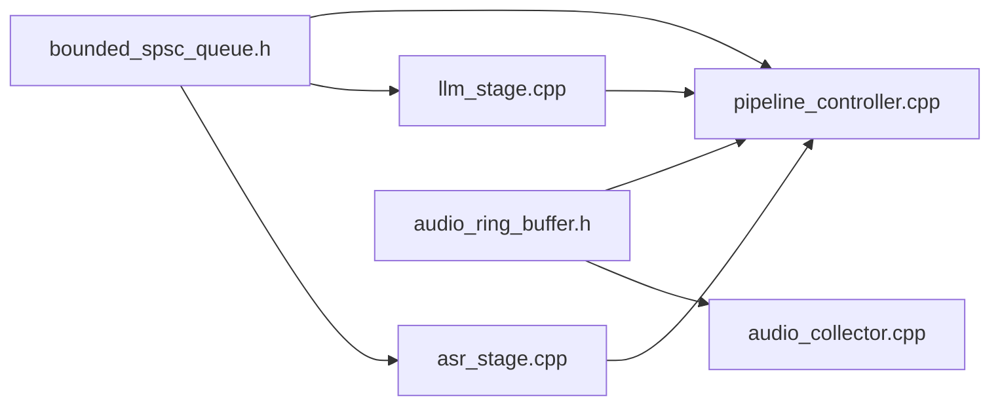

# Lock-free Queue System

<cite>
**Referenced Files in This Document**
- [bounded_spsc_queue.h](file://native/include/bounded_spsc_queue.h)
- [audio_ring_buffer.h](file://native/include/audio_ring_buffer.h)
- [pipeline_controller.cpp](file://native/src/pipeline_controller.cpp)
- [audio_collector.cpp](file://native/src/audio_collector.cpp)
- [asr_stage.cpp](file://native/src/asr_stage.cpp)
- [llm_stage.cpp](file://native/src/llm_stage.cpp)
- [test_asr_stage.cpp](file://native/tests/test_asr_stage.cpp)
</cite>

## Table of Contents
1. [Introduction](#introduction)
2. [Project Structure](#project-structure)
3. [Core Components](#core-components)
4. [Architecture Overview](#architecture-overview)
5. [Detailed Component Analysis](#detailed-component-analysis)
6. [Dependency Analysis](#dependency-analysis)
7. [Performance Considerations](#performance-considerations)
8. [Troubleshooting Guide](#troubleshooting-guide)
9. [Conclusion](#conclusion)
10. [Appendices](#appendices)

## Introduction
This document explains the lock-free queue system used for inter-stage communication in the audio processing pipeline, focusing on two core components:
- BoundedSPSCQueue: a bounded, single-producer/single-consumer (SPSC), lock-free queue with overflow-drop semantics and backpressure via dropping oldest elements.
- AudioRingBuffer: a lock-free SPSC circular buffer for PCM audio samples with overwrite-on-overflow policy.

The documentation covers producer-consumer patterns, memory management strategies, thread synchronization without locks, capacity management, overflow handling, backpressure mechanisms, performance characteristics, and practical guidance for implementing custom queues and debugging bottlenecks.

## Project Structure
The lock-free queue system is implemented as C++ headers and integrated into the native audio pipeline. The key files are:
- Header-only queue implementation: BoundedSPSCQueue
- Header-only ring buffer implementation: AudioRingBuffer
- Pipeline orchestration wiring these components together
- Producer/consumer stages that use these primitives

**Diagram sources**
- [pipeline_controller.cpp:297-315](file://native/src/pipeline_controller.cpp#L297-L315)
- [audio_collector.cpp:135-155](file://native/src/audio_collector.cpp#L135-L155)
- [asr_stage.cpp:277-293](file://native/src/asr_stage.cpp#L277-L293)
- [llm_stage.cpp:367-388](file://native/src/llm_stage.cpp#L367-L388)

**Section sources**
- [pipeline_controller.cpp:297-315](file://native/src/pipeline_controller.cpp#L297-L315)
- [audio_collector.cpp:135-155](file://native/src/audio_collector.cpp#L135-L155)
- [asr_stage.cpp:277-293](file://native/src/asr_stage.cpp#L277-L293)
- [llm_stage.cpp:367-388](file://native/src/llm_stage.cpp#L367-L388)

## Core Components
- BoundedSPSCQueue<T, Capacity>: A fixed-capacity, power-of-two queue using bitmask indexing and a sequence/turn protocol per slot to coordinate producers and consumers without locks. On overflow, it drops the oldest element and pushes the new one; never blocks.
- AudioRingBuffer: A fixed-capacity, power-of-two circular buffer for int16_t PCM samples. On overflow, it advances the read pointer to discard oldest samples and continues writing; never blocks the producer.

Key design features:
- Power-of-two capacity for efficient modulo via bitwise AND mask.
- Cache-line alignment of head/tail or write/read positions to avoid false sharing.
- Atomic indices with acquire/release ordering for safe publication.
- Overflow policies tailored to real-time audio and streaming text: drop oldest or overwrite oldest.

**Section sources**
- [bounded_spsc_queue.h:1-145](file://native/include/bounded_spsc_queue.h#L1-L145)
- [audio_ring_buffer.h:1-192](file://native/include/audio_ring_buffer.h#L1-L192)

## Architecture Overview
The pipeline uses lock-free queues between stages to achieve low-latency, overlapped execution:
- AudioCollector writes PCM samples into AudioRingBuffer from an RT-safe HAL callback.
- SentenceSegmenter reads from the ring buffer and dispatches locked segments to ASR.
- ASR stage produces confirmed text into the ASR→LLM BoundedSPSCQueue.
- LLM stage consumes confirmed text, streams tokens, and enqueues partial translations at punctuation boundaries into the LLM→TTS BoundedSPSCQueue.
- TTS stage consumes partial translations and synthesizes audio.

**Diagram sources**
- [audio_collector.cpp:93-128](file://native/src/audio_collector.cpp#L93-L128)
- [asr_stage.cpp:268-270](file://native/src/asr_stage.cpp#L268-L270)
- [llm_stage.cpp:218-237](file://native/src/llm_stage.cpp#L218-L237)
- [llm_stage.cpp:243-252](file://native/src/llm_stage.cpp#L243-L252)

## Detailed Component Analysis

### BoundedSPSCQueue<T, Capacity>
Design highlights:
- Fixed capacity enforced by static_assert to be a power of two and at least 2.
- Slot-based storage with atomic sequence numbers per slot. Sequence indicates readiness for reading/writing at a logical position.
- Head and tail are aligned to separate cache lines to prevent false sharing.
- Memory ordering:
  - Relaxed loads for local index computation.
  - Acquire/release for visibility across threads.
  - Compare-and-exchange (CAS) for safe advancement of head during overflow and consumption.

Overflow behavior:
- If the target slot is not ready (queue full), the producer attempts to advance head via CAS to discard the oldest element, marks the slot available, then writes the new item and advances tail. Never blocks.

Consumer behavior:
- Checks if the current slot’s sequence indicates data availability.
- Uses CAS to claim the slot; if CAS fails due to producer’s overflow advancing head past this slot, the consumer sees an empty queue from the new head.

Capacity and size:
- size() returns the number of items currently in the queue, clamped to capacity.

Complexity:
- O(1) push/pop operations.
- Constant memory usage proportional to Capacity * sizeof(Slot).

Memory layout:
- Slots array of struct { atomic<uint32_t> sequence; T data; }.
- head_ and tail_ aligned to 64 bytes.

**Diagram sources**
- [bounded_spsc_queue.h:29-142](file://native/include/bounded_spsc_queue.h#L29-L142)

**Section sources**
- [bounded_spsc_queue.h:1-145](file://native/include/bounded_spsc_queue.h#L1-L145)

### AudioRingBuffer
Design highlights:
- Power-of-two capacity rounded up if needed; mask_ enables fast modulo.
- Separate atomic indices for write_pos_ and read_pos_, each aligned to 64-byte cache lines.
- Overwrite policy: when write would overflow, advance read pointer to discard oldest samples, then write.
- Read path copies up to min(count, available) samples, handling wrap-around safely.

Overflow behavior:
- Producer computes available_space = capacity - (write_pos - read_pos).
- If count > available_space, advances read pointer by count - available_space to make room.
- Writes may wrap around buffer boundary using two memcpy calls.

Thread safety:
- Exactly one producer thread calls write().
- Exactly one consumer thread calls read()/available().
- Producer may call advance_read_on_overflow() only during overflow handling.

Complexity:
- O(n) for write/read where n is the number of samples copied.
- Constant overhead for index math and atomic operations.

Memory usage:
- Buffer stores capacity_ int16_t samples.
- Additional small state: capacity_, mask_, and two atomics.

**Diagram sources**
- [audio_ring_buffer.h:52-91](file://native/include/audio_ring_buffer.h#L52-L91)
- [audio_ring_buffer.h:152-155](file://native/include/audio_ring_buffer.h#L152-L155)

**Section sources**
- [audio_ring_buffer.h:1-192](file://native/include/audio_ring_buffer.h#L1-L192)

### Integration in the Pipeline
- PipelineController constructs and wires:
  - AudioRingBuffer for raw PCM capture.
  - Two BoundedSPSCQueues: AsrToLlmElement and LlmToTtsElement.
- AudioCollector writes PCM into the ring buffer from an RT callback.
- ASR stage processes segments and pushes confirmed text into the ASR→LLM queue.
- LLM stage pulls confirmed text, streams tokens, and enqueues partial translations at punctuation boundaries into the LLM→TTS queue.
- TTS stage consumes partial translations.

**Diagram sources**
- [pipeline_controller.cpp:297-315](file://native/src/pipeline_controller.cpp#L297-L315)
- [asr_stage.cpp:277-293](file://native/src/asr_stage.cpp#L277-L293)
- [llm_stage.cpp:367-388](file://native/src/llm_stage.cpp#L367-L388)

**Section sources**
- [pipeline_controller.cpp:297-315](file://native/src/pipeline_controller.cpp#L297-L315)

## Dependency Analysis
- BoundedSPSCQueue depends on:
  - std::atomic, std::array, and basic types.
  - No external libraries; header-only.
- AudioRingBuffer depends on:
  - std::atomic, std::unique_ptr, std::algorithm, and standard library utilities.
  - No external libraries; header-only.
- Stages depend on:
  - BoundedSPSCQueue for inter-stage messaging.
  - AudioRingBuffer for audio buffering.
  - Native port and HAL abstractions for I/O and platform services.

**Diagram sources**
- [bounded_spsc_queue.h:1-145](file://native/include/bounded_spsc_queue.h#L1-L145)
- [audio_ring_buffer.h:1-192](file://native/include/audio_ring_buffer.h#L1-L192)
- [asr_stage.cpp:1-341](file://native/src/asr_stage.cpp#L1-L341)
- [llm_stage.cpp:1-412](file://native/src/llm_stage.cpp#L1-L412)
- [audio_collector.cpp:1-245](file://native/src/audio_collector.cpp#L1-L245)
- [pipeline_controller.cpp:1-488](file://native/src/pipeline_controller.cpp#L1-L488)

**Section sources**
- [bounded_spsc_queue.h:1-145](file://native/include/bounded_spsc_queue.h#L1-L145)
- [audio_ring_buffer.h:1-192](file://native/include/audio_ring_buffer.h#L1-L192)
- [asr_stage.cpp:1-341](file://native/src/asr_stage.cpp#L1-L341)
- [llm_stage.cpp:1-412](file://native/src/llm_stage.cpp#L1-L412)
- [audio_collector.cpp:1-245](file://native/src/audio_collector.cpp#L1-L245)
- [pipeline_controller.cpp:1-488](file://native/src/pipeline_controller.cpp#L1-L488)

## Performance Considerations
- Lock-free guarantees:
  - No mutexes or condition variables in the hot paths of BoundedSPSCQueue and AudioRingBuffer.
  - Minimal contention expected under SPSC constraints.
- Cache locality and false sharing:
  - Head/tail and write/read positions are aligned to 64-byte cache lines to reduce cross-core invalidation.
- Memory allocation:
  - Both components allocate once at construction; no dynamic allocations in hot paths.
- CPU cost:
  - Push/pop and read/write are O(1) or O(n) for sample copy respectively, with minimal branching.
- Backpressure:
  - BoundedSPSCQueue drops oldest on overflow; suitable for streaming text where freshness matters more than completeness.
  - AudioRingBuffer overwrites oldest samples; ensures continuous audio flow at the cost of discarding old frames.
- Real-time safety:
  - AudioCollector’s HAL callback performs only lock-free writes and atomic updates, avoiding blocking operations.

[No sources needed since this section provides general guidance]

## Troubleshooting Guide
Common issues and diagnostics:
- Queue overflow detection:
  - For BoundedSPSCQueue, monitor size() periodically to detect near-full conditions and adjust upstream pacing if necessary.
  - For AudioRingBuffer, track available() to understand backlog and latency implications.
- Latency warnings:
  - Stages report SLA violations when first-token latencies exceed budgets; correlate with queue sizes to identify bottlenecks.
- Sample drops:
  - AudioCollector detects gaps between expected and actual samples and posts drop events; investigate platform scheduling or CPU pressure.
- Graceful stop:
  - PipelineController polls queues and segmenter state to ensure flush before teardown; verify queues drain within deadlines.

Practical debugging steps:
- Instrument size() and available() counters in tests or logging hooks.
- Use unit tests to validate queue behavior under bursty workloads.
- Validate overflow scenarios by pushing beyond capacity and confirming oldest-dropped semantics.

**Section sources**
- [pipeline_controller.cpp:427-448](file://native/src/pipeline_controller.cpp#L427-L448)
- [audio_collector.cpp:116-127](file://native/src/audio_collector.cpp#L116-L127)
- [test_asr_stage.cpp:106-137](file://native/tests/test_asr_stage.cpp#L106-L137)

## Conclusion
The lock-free queue system provides robust, low-latency inter-stage communication for the audio pipeline:
- BoundedSPSCQueue offers non-blocking, overflow-dropping semantics ideal for streaming text.
- AudioRingBuffer ensures continuous audio capture with overwrite-on-overflow semantics.
- Together, they enable overlapped execution across stages while maintaining predictable memory usage and avoiding locks in hot paths.

[No sources needed since this section summarizes without analyzing specific files]

## Appendices

### Implementing Custom Queues
Guidelines for creating a custom lock-free SPSC queue:
- Enforce power-of-two capacity and assert at compile time.
- Use a slot-based structure with an atomic sequence field to implement a turn protocol.
- Align head/tail indices to separate cache lines.
- Use relaxed loads for local index computation and acquire/release for cross-thread visibility.
- Implement CAS-based head advancement for overflow handling.
- Provide try_push/try_pop returning boolean status and a size() query.

Example references:
- See BoundedSPSCQueue implementation for slot layout and sequence protocol.
- See AudioRingBuffer for circular buffer index math and wrap-around handling.

**Section sources**
- [bounded_spsc_queue.h:29-142](file://native/include/bounded_spsc_queue.h#L29-L142)
- [audio_ring_buffer.h:34-91](file://native/include/audio_ring_buffer.h#L34-L91)

### Debugging Queue-Related Bottlenecks
- Measure queue sizes and available counts to identify backpressure points.
- Correlate latency warnings with queue saturation.
- Simulate bursts in tests to validate overflow behavior and recovery.
- Ensure proper thread priorities and avoid blocking operations in RT callbacks.

**Section sources**
- [test_asr_stage.cpp:241-271](file://native/tests/test_asr_stage.cpp#L241-L271)
- [pipeline_controller.cpp:427-448](file://native/src/pipeline_controller.cpp#L427-L448)