# Pipeline Controller

<cite>
**Referenced Files in This Document**
- [pipeline_controller.h](file://native/include/pipeline_controller.h)
- [pipeline_controller.cpp](file://native/src/pipeline_controller.cpp)
- [bounded_spsc_queue.h](file://native/include/bounded_spsc_queue.h)
- [audio_collector.h](file://native/include/audio_collector.h)
- [audio_collector.cpp](file://native/src/audio_collector.cpp)
- [audio_ring_buffer.h](file://native/include/audio_ring_buffer.h)
- [asr_stage.h](file://native/include/asr_stage.h)
- [asr_stage.cpp](file://native/src/asr_stage.cpp)
- [llm_stage.h](file://native/include/llm_stage.h)
- [llm_stage.cpp](file://native/src/llm_stage.cpp)
- [tts_stage.h](file://native/include/tts_stage.h)
- [tts_stage.cpp](file://native/src/tts_stage.cpp)
- [sentence_segmenter.h](file://native/include/sentence_segmenter.h)
- [latency_tracker.h](file://native/include/latency_tracker.h)
- [echo_types.h](file://native/include/echo_types.h)
</cite>

## Table of Contents
1. [Introduction](#introduction)
2. [Project Structure](#project-structure)
3. [Core Components](#core-components)
4. [Architecture Overview](#architecture-overview)
5. [Detailed Component Analysis](#detailed-component-analysis)
6. [Dependency Analysis](#dependency-analysis)
7. [Performance Considerations](#performance-considerations)
8. [Troubleshooting Guide](#troubleshooting-guide)
9. [Conclusion](#conclusion)
10. [Appendices](#appendices)

## Introduction
This document explains the PipelineController component that orchestrates a sequential, multi-stage audio processing pipeline: AudioCollector → SentenceSegmenter → ASR → LLM → TTS. It focuses on how the controller manages the producer-consumer chain, the lock-free queue system for inter-stage communication, thread synchronization, stage instantiation and parameter passing, error propagation, and monitoring capabilities including latency tracking and performance metrics. It also provides guidance for extending the pipeline with custom stages and debugging bottlenecks.

## Project Structure
The PipelineController is implemented in native C++ and coordinates several components:
- Data capture and buffering: AudioCollector and AudioRingBuffer
- Segmentation: SentenceSegmenter
- Processing stages: AsrStage, LlmStage, TtsStage
- Inter-stage queues: BoundedSPSCQueue (ASR→LLM, LLM→TTS)
- Monitoring: LatencyTracker, ThermalMonitor, MemoryMonitor
- Shared configuration and types: echo_types.h

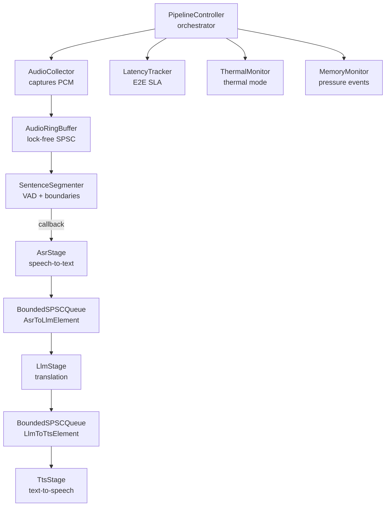

**Diagram sources**
- [pipeline_controller.cpp:291-393](file://native/src/pipeline_controller.cpp#L291-L393)
- [audio_collector.cpp:157-200](file://native/src/audio_collector.cpp#L157-L200)
- [audio_ring_buffer.h:27-192](file://native/include/audio_ring_buffer.h#L27-L192)
- [sentence_segmenter.h:72-128](file://native/include/sentence_segmenter.h#L72-L128)
- [asr_stage.h:52-97](file://native/include/asr_stage.h#L52-L97)
- [bounded_spsc_queue.h:29-145](file://native/include/bounded_spsc_queue.h#L29-L145)
- [llm_stage.h:60-86](file://native/include/llm_stage.h#L60-L86)
- [tts_stage.h:58-72](file://native/include/tts_stage.h#L58-L72)
- [latency_tracker.h:97-119](file://native/include/latency_tracker.h#L97-L119)

**Section sources**
- [pipeline_controller.h:1-107](file://native/include/pipeline_controller.h#L1-L107)
- [pipeline_controller.cpp:1-127](file://native/src/pipeline_controller.cpp#L1-L127)

## Core Components
- PipelineController: Creates, starts, and stops all pipeline resources; validates language codes; wires components; implements graceful stop with a 2-second deadline; exposes lifecycle APIs.
- AudioCollector: Captures PCM at 16kHz mono via HAL, writes to ring buffer, detects sample drops, runs at real-time priority.
- AudioRingBuffer: Lock-free SPSC circular buffer with overwrite-on-overflow policy and cache-line alignment.
- SentenceSegmenter: VAD + sentence boundary detection; emits LockedSegment callbacks when segments are locked.
- AsrStage: Processes locked segments, streams partial tokens, enqueues confirmed text into ASR→LLM queue.
- LlmStage: Dequeues confirmed text, maintains sliding context window, streams translation tokens, enqueues translated text into LLM→TTS queue at punctuation boundaries.
- TtsStage: Dequeues translated text, synthesizes streaming PCM chunks, reports TTFA SLA.
- BoundedSPSCQueue: Lock-free bounded queue with overflow-drop semantics used between stages.
- LatencyTracker: Records timestamps at stage boundaries and checks per-stage and E2E budgets.

Key responsibilities and interactions:
- Producer-consumer chain: AudioCollector → Ring Buffer → Segmenter → ASR → LLM → TTS.
- Cascade truncation: LLM emits partial results at punctuation; TTS begins synthesis early.
- Error propagation: Failures during resource creation return specific error codes; runtime errors are reported via messages; memory pressure can trigger graceful stop.

**Section sources**
- [pipeline_controller.cpp:248-393](file://native/src/pipeline_controller.cpp#L248-L393)
- [audio_collector.h:48-88](file://native/include/audio_collector.h#L48-L88)
- [audio_ring_buffer.h:27-192](file://native/include/audio_ring_buffer.h#L27-L192)
- [sentence_segmenter.h:72-128](file://native/include/sentence_segmenter.h#L72-L128)
- [asr_stage.h:52-97](file://native/include/asr_stage.h#L52-L97)
- [llm_stage.h:60-86](file://native/include/llm_stage.h#L60-L86)
- [tts_stage.h:58-72](file://native/include/tts_stage.h#L58-L72)
- [bounded_spsc_queue.h:29-145](file://native/include/bounded_spsc_queue.h#L29-L145)
- [latency_tracker.h:97-119](file://native/include/latency_tracker.h#L97-L119)

## Architecture Overview
The PipelineController constructs the full pipeline in a deterministic order, ensures monitors start first, then starts the collector, and marks the session running. The inter-stage queues provide backpressure and decoupling. Graceful stop halts collection, flushes locked segments, destroys stages, and clears buffers within a strict deadline.

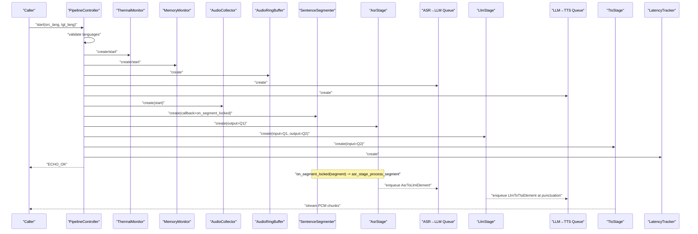

**Diagram sources**
- [pipeline_controller.cpp:291-393](file://native/src/pipeline_controller.cpp#L291-L393)
- [pipeline_controller.cpp:134-139](file://native/src/pipeline_controller.cpp#L134-L139)
- [asr_stage.h:79-97](file://native/include/asr_stage.h#L79-L97)
- [llm_stage.h:60-86](file://native/include/llm_stage.h#L60-L86)
- [tts_stage.h:58-72](file://native/include/tts_stage.h#L58-L72)

## Detailed Component Analysis

### PipelineController Lifecycle and Orchestration
- Creation and initialization: Allocates internal state, initializes mutex and atomic flags, sets pointers to null.
- Start sequence:
  - Validates source/target language codes against supported list.
  - Creates accelerator context (may be null in stub).
  - Creates ring buffer and two bounded queues.
  - Creates AudioCollector, SentenceSegmenter (with callback), AsrStage, LlmStage, TtsStage, ThermalMonitor, MemoryMonitor, LatencyTracker.
  - Starts monitors, then AudioCollector; marks running.
- Stop sequence:
  - Stops AudioCollector.
  - Polls until segmenter idle and both queues drained or deadline reached.
  - Destroys stages and resources in reverse order.
  - Marks stopped.
- Concurrency: Uses a mutex to guard lifecycle transitions; uses atomics for running flag.

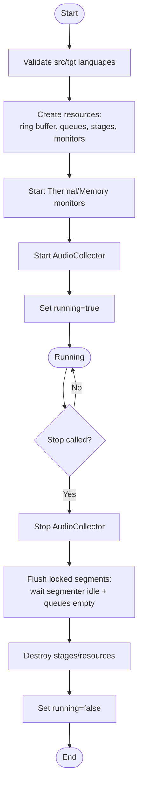

**Diagram sources**
- [pipeline_controller.cpp:272-393](file://native/src/pipeline_controller.cpp#L272-L393)
- [pipeline_controller.cpp:395-469](file://native/src/pipeline_controller.cpp#L395-L469)

**Section sources**
- [pipeline_controller.h:46-100](file://native/include/pipeline_controller.h#L46-L100)
- [pipeline_controller.cpp:248-393](file://native/src/pipeline_controller.cpp#L248-L393)
- [pipeline_controller.cpp:395-469](file://native/src/pipeline_controller.cpp#L395-L469)

### Lock-Free Queue System (BoundedSPSCQueue)
- Design: Fixed capacity power-of-two, slot-based with sequence numbers, head/tail aligned to separate cache lines.
- Overflow behavior: Drops oldest element and pushes new one; never blocks.
- Concurrency model: Tail owned by producer; head advanced by consumer and producer (on overflow) using CAS; sequence/turn protocol ensures safe access.
- API: try_push(item) returns true if normal push, false if overflow occurred; try_pop(out) returns true if item dequeued; size() returns current occupancy.

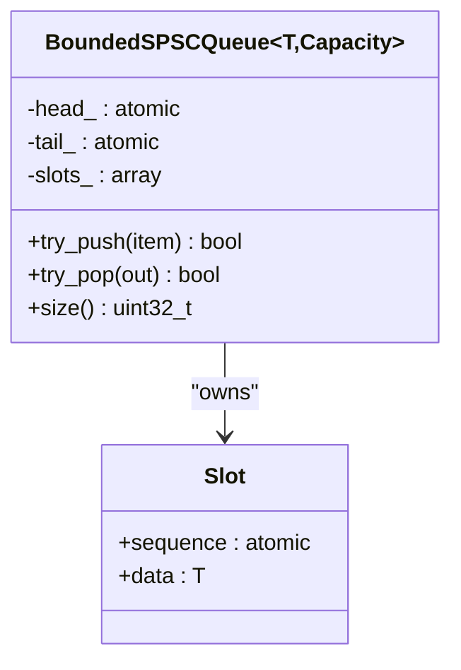

**Diagram sources**
- [bounded_spsc_queue.h:29-145](file://native/include/bounded_spsc_queue.h#L29-L145)

**Section sources**
- [bounded_spsc_queue.h:1-145](file://native/include/bounded_spsc_queue.h#L1-L145)

### Audio Collector and Ring Buffer
- AudioCollector:
  - Sets real-time priority, creates platform capture, starts callback-driven loop.
  - Writes samples to ring buffer, tracks expected vs actual samples, reports MSG_SAMPLE_DROP on significant gaps.
- AudioRingBuffer:
  - Lock-free SPSC with overwrite-on-overflow; write advances read pointer when needed.
  - Cache-line aligned positions to avoid false sharing.

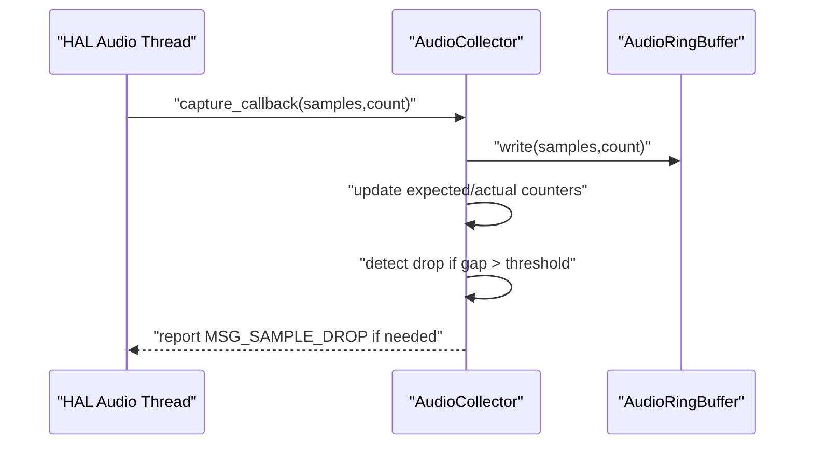

**Diagram sources**
- [audio_collector.cpp:93-128](file://native/src/audio_collector.cpp#L93-L128)
- [audio_ring_buffer.h:52-91](file://native/include/audio_ring_buffer.h#L52-L91)

**Section sources**
- [audio_collector.h:48-88](file://native/include/audio_collector.h#L48-L88)
- [audio_collector.cpp:157-200](file://native/src/audio_collector.cpp#L157-L200)
- [audio_ring_buffer.h:27-192](file://native/include/audio_ring_buffer.h#L27-L192)

### Sentence Segmenter Integration
- State machine: Idle → Accumulating → Locking → Idle.
- Lock conditions: Silence after speech, punctuation notification, or max duration.
- Callback: on_segment_locked invokes asr_stage_process_segment with the locked segment.

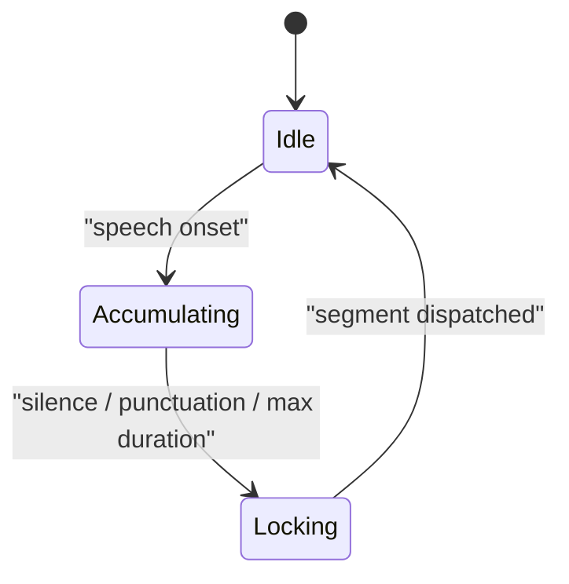

**Diagram sources**
- [sentence_segmenter.h:34-50](file://native/include/sentence_segmenter.h#L34-L50)
- [pipeline_controller.cpp:134-139](file://native/src/pipeline_controller.cpp#L134-L139)

**Section sources**
- [sentence_segmenter.h:72-128](file://native/include/sentence_segmenter.h#L72-L128)
- [pipeline_controller.cpp:134-139](file://native/src/pipeline_controller.cpp#L134-L139)

### ASR Stage
- Worker thread processes queued segments asynchronously.
- Optional resampling in throttle mode; streams partial tokens; enqueues confirmed text into ASR→LLM queue.
- SLA: First-character latency ≤200ms.

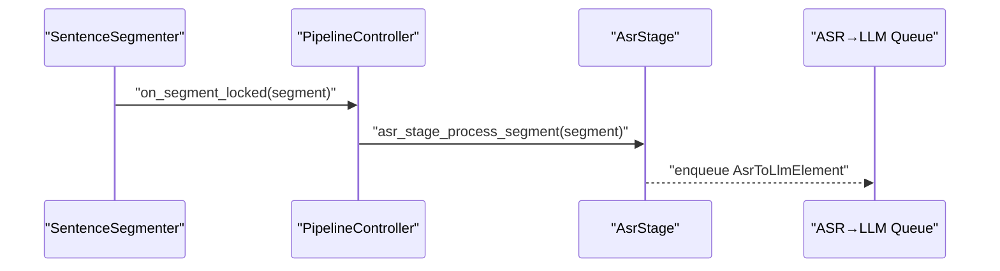

**Diagram sources**
- [pipeline_controller.cpp:134-139](file://native/src/pipeline_controller.cpp#L134-L139)
- [asr_stage.h:79-97](file://native/include/asr_stage.h#L79-L97)

**Section sources**
- [asr_stage.h:1-104](file://native/include/asr_stage.h#L1-L104)
- [asr_stage.cpp:167-200](file://native/src/asr_stage.cpp#L167-L200)

### LLM Stage
- Dequeues confirmed ASR text, maintains sliding context window, streams translation tokens, enqueues translated text at punctuation boundaries.
- Context window sizes differ in normal vs throttle modes.

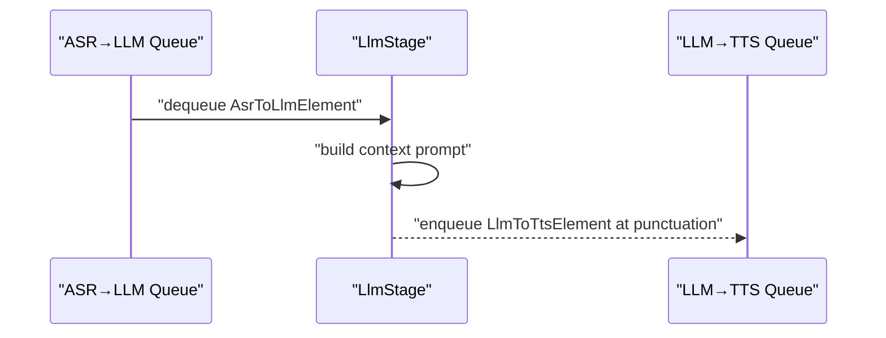

**Diagram sources**
- [llm_stage.cpp:116-156](file://native/src/llm_stage.cpp#L116-L156)
- [llm_stage.h:60-86](file://native/include/llm_stage.h#L60-L86)

**Section sources**
- [llm_stage.h:1-93](file://native/include/llm_stage.h#L1-L93)
- [llm_stage.cpp:1-200](file://native/src/llm_stage.cpp#L1-L200)

### TTS Stage
- Dequeues translated text, discards whitespace/punctuation-only segments, synthesizes streaming PCM, reports TTFA SLA.

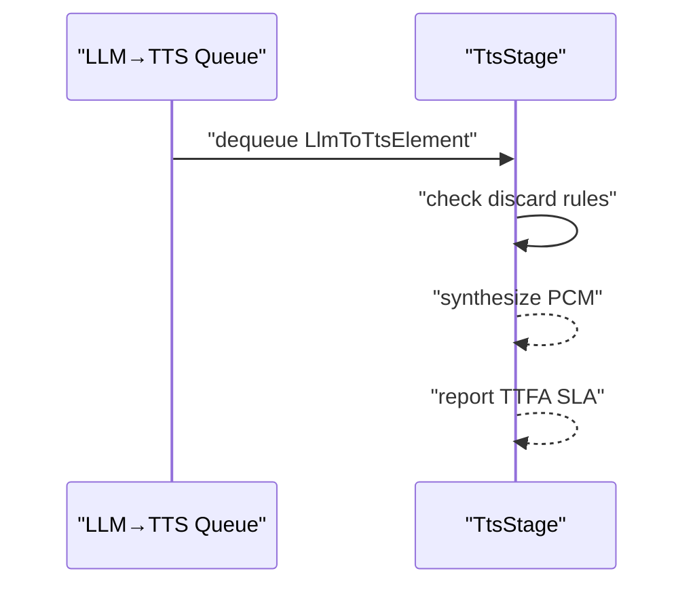

**Diagram sources**
- [tts_stage.cpp:191-200](file://native/src/tts_stage.cpp#L191-L200)
- [tts_stage.h:58-72](file://native/include/tts_stage.h#L58-L72)

**Section sources**
- [tts_stage.h:1-79](file://native/include/tts_stage.h#L1-L79)
- [tts_stage.cpp:1-200](file://native/src/tts_stage.cpp#L1-L200)

### Parameter Passing Between Stages
- Inter-stage elements:
  - AsrToLlmElement: segment_id, speaker_id, text, text_len, timestamp_ms.
  - LlmToTtsElement: segment_id, speaker_id, text, text_len, timestamp_ms.
- These structures flow through BoundedSPSCQueue instances connecting ASR→LLM and LLM→TTS.

**Section sources**
- [echo_types.h:68-86](file://native/include/echo_types.h#L68-L86)
- [bounded_spsc_queue.h:29-145](file://native/include/bounded_spsc_queue.h#L29-L145)

### Error Propagation and Resilience
- Resource creation failures return ECHO_ERR_MEMORY; duplicate sessions return ECHO_ERR_SESSION_ACTIVE; unsupported languages return ECHO_ERR_UNSUPPORTED_LANG.
- Runtime errors:
  - Sample drops reported via MSG_SAMPLE_DROP.
  - Latency violations reported via MSG_LATENCY_WARNING.
  - Memory pressure level 2 triggers graceful stop.
- Stage-level resilience:
  - TTS skips failed segments and continues.
  - ASR discards noise/unintelligible segments without confirmed messages.

**Section sources**
- [pipeline_controller.cpp:272-393](file://native/src/pipeline_controller.cpp#L272-L393)
- [audio_collector.cpp:117-128](file://native/src/audio_collector.cpp#L117-L128)
- [tts_stage.cpp:191-200](file://native/src/tts_stage.cpp#L191-L200)
- [echo_types.h:48-62](file://native/include/echo_types.h#L48-L62)

### Monitoring, Latency Tracking, and Performance Metrics
- LatencyTracker records timestamps at key boundaries and checks budgets:
  - Per-stage: ASR ≤200ms, LLM ≤450ms, TTS ≤100ms.
  - E2E: Normal ≤800ms, Throttle ≤1200ms.
- ThermalMonitor and MemoryMonitor integrate with the controller to adjust thermal mode and respond to memory pressure.

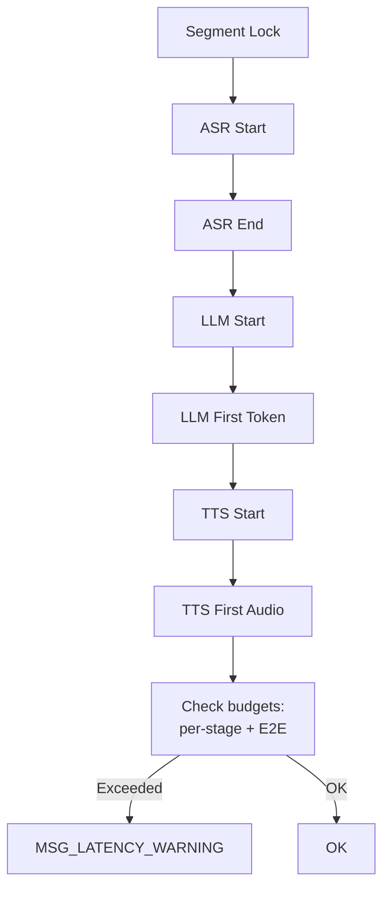

**Diagram sources**
- [latency_tracker.h:34-49](file://native/include/latency_tracker.h#L34-L49)
- [latency_tracker.h:131-203](file://native/include/latency_tracker.h#L131-L203)

**Section sources**
- [latency_tracker.h:1-224](file://native/include/latency_tracker.h#L1-L224)
- [pipeline_controller.cpp:145-177](file://native/src/pipeline_controller.cpp#L145-L177)

## Dependency Analysis
The PipelineController depends on multiple subsystems and composes them into a cohesive pipeline. The following diagram shows direct dependencies among core components.

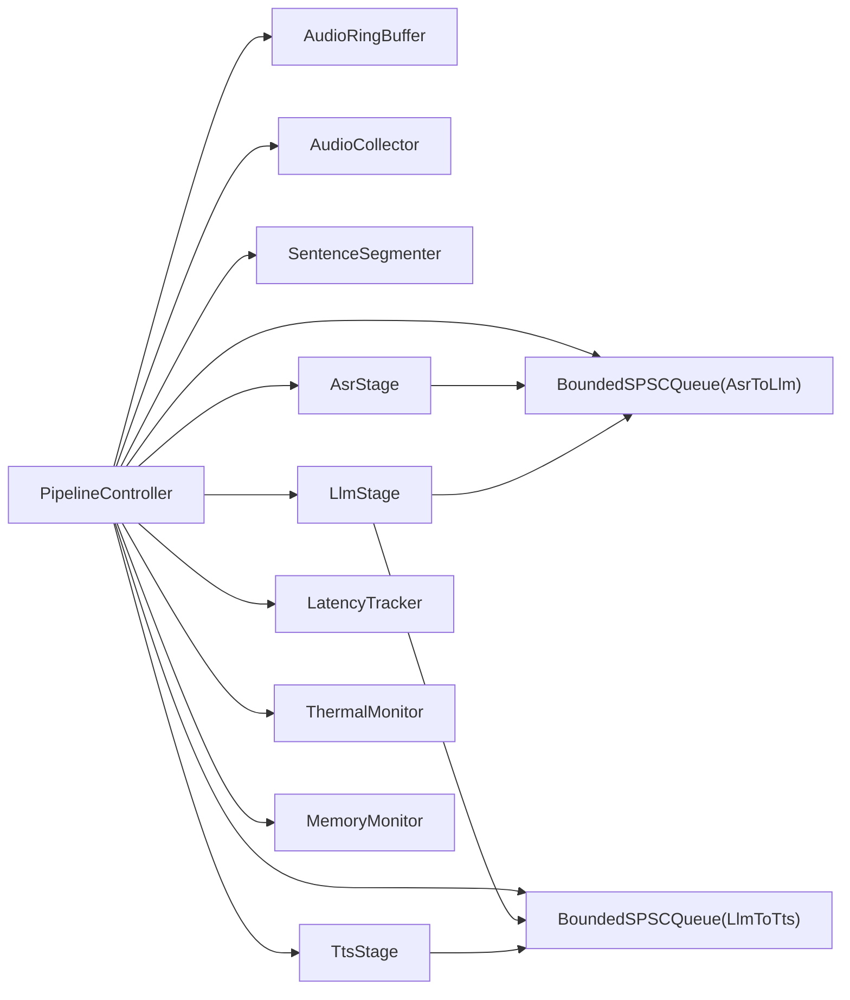

**Diagram sources**
- [pipeline_controller.cpp:291-393](file://native/src/pipeline_controller.cpp#L291-L393)
- [asr_stage.h:52-97](file://native/include/asr_stage.h#L52-L97)
- [llm_stage.h:60-86](file://native/include/llm_stage.h#L60-L86)
- [tts_stage.h:58-72](file://native/include/tts_stage.h#L58-L72)
- [bounded_spsc_queue.h:29-145](file://native/include/bounded_spsc_queue.h#L29-L145)

**Section sources**
- [pipeline_controller.cpp:291-393](file://native/src/pipeline_controller.cpp#L291-L393)

## Performance Considerations
- Lock-free design:
  - AudioRingBuffer and BoundedSPSCQueue minimize contention and avoid blocking producers/consumers.
  - Cache-line alignment reduces false sharing.
- Overlap and cascade truncation:
  - Each stage runs on its own thread; LLM emits partial results at punctuation; TTS starts early, reducing end-to-end latency.
- Backpressure:
  - Bounded queues with overflow-drop ensure stability under load; monitor queue sizes during stop to drain in-flight work.
- Real-time audio path:
  - AudioCollector operates at RT priority; callback avoids allocations and blocking operations.
- Thermal and memory adaptation:
  - Throttle mode adjusts sampling/context windows; memory pressure can trigger graceful stop to protect system stability.

[No sources needed since this section provides general guidance]

## Troubleshooting Guide
Common issues and diagnostics:
- No audio input:
  - Verify AudioCollector started successfully and ring buffer receives data.
  - Check MSG_SAMPLE_DROP frequency; high rates indicate platform audio issues.
- High latency:
  - Inspect LatencyTracker warnings for per-stage and E2E violations.
  - Confirm thermal mode and context window settings.
- Pipeline not stopping:
  - Ensure stop sequence completes within deadline; check segmenter state and queue sizes.
- Memory pressure:
  - Monitor memory warnings; consider reducing ring buffer capacity or enabling throttle mode earlier.

Actionable steps:
- Use pipeline_controller_is_running to verify state.
- Review latency records via latency_tracker_get_record for recent segments.
- Adjust thresholds in sentence_segmenter_configure if segmentation timing is off.

**Section sources**
- [audio_collector.cpp:117-128](file://native/src/audio_collector.cpp#L117-L128)
- [latency_tracker.h:215-217](file://native/include/latency_tracker.h#L215-L217)
- [sentence_segmenter.h:84-87](file://native/include/sentence_segmenter.h#L84-L87)
- [pipeline_controller.cpp:395-469](file://native/src/pipeline_controller.cpp#L395-L469)

## Conclusion
The PipelineController provides a robust, low-latency orchestration layer for an audio processing pipeline. Its use of lock-free queues, careful resource management, and integrated monitoring enables reliable operation under varying thermal and memory conditions. The modular stage design supports extension and customization while maintaining clear interfaces and predictable error handling.

[No sources needed since this section summarizes without analyzing specific files]

## Appendices

### Extending the Pipeline with Custom Stages
- Define a new stage with create/destroy APIs and a worker thread consuming from an input queue and producing to an output queue.
- Introduce a new inter-stage element type in echo_types.h if needed.
- Wire the stage in PipelineController::pipeline_controller_start:
  - Create the stage with appropriate input/output queues.
  - Start it before marking the pipeline running.
- Update graceful stop if the stage holds in-flight work requiring flushing.
- Add latency tracking hooks to LatencyTracker for SLA enforcement.

**Section sources**
- [echo_types.h:68-86](file://native/include/echo_types.h#L68-L86)
- [pipeline_controller.cpp:291-393](file://native/src/pipeline_controller.cpp#L291-L393)
- [latency_tracker.h:131-203](file://native/include/latency_tracker.h#L131-L203)

### Debugging Pipeline Bottlenecks
- Instrument queue sizes:
  - Use BoundedSPSCQueue::size() to detect backpressure points.
- Measure per-stage latencies:
  - Record timestamps at stage entry/exit and compare with budgets.
- Analyze thermal and memory impacts:
  - Correlate latency spikes with thermal mode changes and memory warnings.
- Validate audio integrity:
  - Track sample drops and ring buffer availability to identify capture or consumption stalls.

**Section sources**
- [bounded_spsc_queue.h:123-128](file://native/include/bounded_spsc_queue.h#L123-L128)
- [latency_tracker.h:34-49](file://native/include/latency_tracker.h#L34-L49)
- [audio_collector.cpp:117-128](file://native/src/audio_collector.cpp#L117-L128)