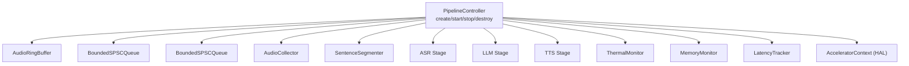
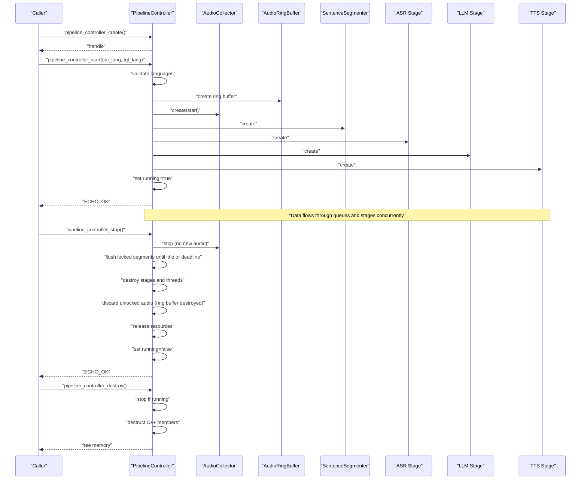
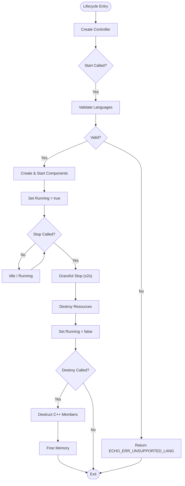
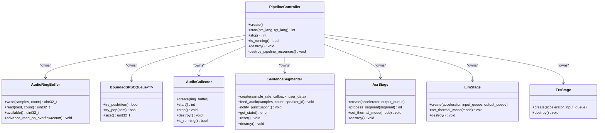

# Pipeline Lifecycle Management

<cite>
**Referenced Files in This Document**
- [pipeline_controller.h](file://native/include/pipeline_controller.h)
- [pipeline_controller.cpp](file://native/src/pipeline_controller.cpp)
- [echo_types.h](file://native/include/echo_types.h)
- [audio_collector.h](file://native/include/audio_collector.h)
- [sentence_segmenter.h](file://native/include/sentence_segmenter.h)
- [asr_stage.h](file://native/include/asr_stage.h)
- [llm_stage.h](file://native/include/llm_stage.h)
- [tts_stage.h](file://native/include/tts_stage.h)
- [audio_ring_buffer.h](file://native/include/audio_ring_buffer.h)
- [bounded_spsc_queue.h](file://native/include/bounded_spsc_queue.h)
</cite>

## Table of Contents
1. [Introduction](#introduction)
2. [Project Structure](#project-structure)
3. [Core Components](#core-components)
4. [Architecture Overview](#architecture-overview)
5. [Detailed Component Analysis](#detailed-component-analysis)
6. [Dependency Analysis](#dependency-analysis)
7. [Performance Considerations](#performance-considerations)
8. [Troubleshooting Guide](#troubleshooting-guide)
9. [Conclusion](#conclusion)

## Introduction
This document explains the lifecycle management of the audio processing pipeline via the PipelineController, focusing on creation, initialization (start), and destruction (stop/destroy). It details the create-start-stop-destroy pattern, resource ownership semantics, graceful shutdown with a 2-second timeout constraint, error handling strategies per phase, state validation mechanisms, and common lifecycle errors with resolution steps. The goal is to provide both high-level understanding and code-level traceability for safe and predictable pipeline operation.

## Project Structure
The PipelineController orchestrates the full audio processing pipeline by creating, wiring, starting, and destroying components such as the ring buffer, inter-stage queues, audio collector, sentence segmenter, ASR stage, LLM stage, TTS stage, thermal monitor, memory monitor, and latency tracker. It also manages an optional HAL accelerator context shared across stages.

**Diagram sources**
- [pipeline_controller.cpp:107-126](file://native/src/pipeline_controller.cpp#L107-L126)
- [pipeline_controller.cpp:291-374](file://native/src/pipeline_controller.cpp#L291-L374)

**Section sources**
- [pipeline_controller.h:1-107](file://native/include/pipeline_controller.h#L1-L107)
- [pipeline_controller.cpp:1-126](file://native/src/pipeline_controller.cpp#L1-L126)

## Core Components
- PipelineController: Opaque handle managing lifecycle, state, and resources; provides create, start, stop, is_running, destroy.
- AudioRingBuffer: Lock-free SPSC circular buffer for PCM samples with overwrite-on-overflow policy.
- BoundedSPSCQueue: Lock-free bounded queue with overflow-drop semantics used between stages.
- AudioCollector: Captures PCM audio and writes into the ring buffer; supports start/stop/destroy.
- SentenceSegmenter: VAD + sentence boundary detection; emits locked segments via callback.
- ASR Stage: Processes locked segments, streams partials, enqueues confirmed text to ASR→LLM queue.
- LLM Stage: Translates confirmed text, streams tokens, enqueues translated text to LLM→TTS queue.
- TTS Stage: Synthesizes speech from translated text and outputs streaming PCM chunks.
- ThermalMonitor/MemoryMonitor/LatencyTracker: Observers that influence behavior and report events.

Key responsibilities during lifecycle:
- Creation: Allocate controller and initialize C++ members.
- Start: Validate language pair, create and start all components, mark running.
- Stop: Graceful shutdown within 2 seconds, flush in-flight work, discard unlocked audio, release resources.
- Destroy: Ensure stop if running, destruct C++ members, free memory.

**Section sources**
- [pipeline_controller.h:33-100](file://native/include/pipeline_controller.h#L33-L100)
- [pipeline_controller.cpp:248-270](file://native/src/pipeline_controller.cpp#L248-L270)
- [audio_ring_buffer.h:27-189](file://native/include/audio_ring_buffer.h#L27-L189)
- [bounded_spsc_queue.h:29-142](file://native/include/bounded_spsc_queue.h#L29-L142)
- [audio_collector.h:36-88](file://native/include/audio_collector.h#L36-L88)
- [sentence_segmenter.h:31-135](file://native/include/sentence_segmenter.h#L31-L135)
- [asr_stage.h:34-97](file://native/include/asr_stage.h#L34-L97)
- [llm_stage.h:40-86](file://native/include/llm_stage.h#L40-L86)
- [tts_stage.h:37-72](file://native/include/tts_stage.h#L37-L72)

## Architecture Overview
The pipeline follows a cascade truncation model where downstream stages begin before upstream completes:
- Audio Collector → Ring Buffer → Sentence Segmenter → ASR → LLM → TTS → Audio Output
- Inter-stage queues (ASR→LLM, LLM→TTS) enable overlapped execution with backpressure handled by bounded queues.

**Diagram sources**
- [pipeline_controller.cpp:272-393](file://native/src/pipeline_controller.cpp#L272-L393)
- [pipeline_controller.cpp:395-469](file://native/src/pipeline_controller.cpp#L395-L469)
- [pipeline_controller.cpp:476-487](file://native/src/pipeline_controller.cpp#L476-L487)

## Detailed Component Analysis

### Create Phase
- Allocates the opaque PipelineController structure using calloc and constructs C++ members (mutex, atomic bool) via placement-new.
- Initializes all component pointers to null to ensure safe cleanup paths.
- Returns NULL only on allocation failure.

Resource management semantics:
- Ownership: PipelineController owns all created components and will destroy them during stop/destroy.
- Failure handling: Any early failure triggers destroy_pipeline_resources to avoid leaks.

Validation:
- No explicit validation at create time beyond allocation success.

**Section sources**
- [pipeline_controller.cpp:248-270](file://native/src/pipeline_controller.cpp#L248-L270)

### Start Phase
- Guards against duplicate sessions: returns ECHO_ERR_SESSION_ACTIVE if already running.
- Validates source and target language codes against supported ISO 639-1 list; returns ECHO_ERR_UNSUPPORTED_LANG for invalid codes.
- Creates and starts components in order:
  - HAL accelerator (optional)
  - AudioRingBuffer (capacity ~2^20 samples ≈ 65.5s at 16kHz)
  - BoundedSPSCQueue<AsrToLlmElement>, BoundedSPSCQueue<LlmToTtsElement>
  - AudioCollector (writes to ring buffer)
  - ASR Stage (reads from segmenter, writes to ASR→LLM queue)
  - SentenceSegmenter (reads from ring buffer, dispatches locked segments via callback)
  - LLM Stage (reads from ASR→LLM queue, writes to LLM→TTS queue)
  - TTS Stage (reads from LLM→TTS queue, outputs audio)
  - ThermalMonitor, MemoryMonitor, LatencyTracker
- Starts monitors first, then audio collector, marks running=true.

Error handling:
- Any allocation or start failure calls destroy_pipeline_resources and returns ECHO_ERR_MEMORY.

State transitions:
- Uninitialized → Running (on successful start)

**Section sources**
- [pipeline_controller.cpp:272-393](file://native/src/pipeline_controller.cpp#L272-L393)
- [pipeline_controller.h:48-64](file://native/include/pipeline_controller.h#L48-L64)
- [echo_types.h:48-62](file://native/include/echo_types.h#L48-L62)

### Stop Phase (Graceful Shutdown)
- Idempotent: If not running, returns ECHO_OK immediately.
- Enforces a 2-second deadline for complete shutdown.
- Sequence:
  1. Stop AudioCollector to prevent new audio entering the ring buffer.
  2. Wait for SentenceSegmenter to flush locked segments through ASR→LLM→TTS:
     - Polls segmenter state and inter-stage queue sizes.
     - Breaks when segmenter is idle and both queues are empty.
     - Uses a polling interval to avoid busy-waiting.
  3. Destroy all pipeline stages and threads (each destroy joins its worker thread).
  4. Discard unlocked audio remaining in the ring buffer (implicit via destruction).
  5. Release all pipeline resources.
  6. Mark running=false.

Timeout constraint:
- All cleanup must complete within kStopDeadlineMs (2000ms).

State transitions:
- Running → Stopping → Ready (after stop completes)

**Section sources**
- [pipeline_controller.cpp:395-469](file://native/src/pipeline_controller.cpp#L395-L469)
- [pipeline_controller.h:66-82](file://native/include/pipeline_controller.h#L66-L82)

### Destroy Phase
- Ensures pipeline is stopped if still running by calling stop.
- Explicitly destructs C++ members (mutex, atomic<bool>) before freeing raw memory.
- Safely ignores NULL handles.

Resource cleanup patterns:
- Reverse-pipeline order destruction ensures dependencies are released safely.
- Each stage’s destroy function waits for its worker thread to finish.

**Section sources**
- [pipeline_controller.cpp:476-487](file://native/src/pipeline_controller.cpp#L476-L487)

### State Validation Mechanisms
- Running flag: Atomic boolean guarded by mutex during transitions; queried via is_running.
- Language validation: Supported ISO 639-1 codes enforced before start.
- Session guard: Prevents concurrent sessions by rejecting start when already running.

**Section sources**
- [pipeline_controller.cpp:272-290](file://native/src/pipeline_controller.cpp#L272-L290)
- [pipeline_controller.cpp:471-474](file://native/src/pipeline_controller.cpp#L471-L474)

### Error Handling Strategies
- Not initialized: Passing NULL handle returns ECHO_ERR_NOT_INITIALIZED.
- Unsupported language: Returns ECHO_ERR_UNSUPPORTED_LANG.
- Session active: Returns ECHO_ERR_SESSION_ACTIVE if start called while running.
- Memory allocation failures: Return ECHO_ERR_MEMORY; ensure partial resources are cleaned up.
- Graceful stop: Always returns ECHO_OK; no-op if not running; guarantees completion within 2 seconds.

**Section sources**
- [echo_types.h:48-62](file://native/include/echo_types.h#L48-L62)
- [pipeline_controller.cpp:272-393](file://native/src/pipeline_controller.cpp#L272-L393)
- [pipeline_controller.cpp:395-469](file://native/src/pipeline_controller.cpp#L395-L469)

### Resource Cleanup Patterns
- Centralized destroy_pipeline_resources:
  - Destroys stages in reverse order (TTS → LLM → ASR).
  - Destroys segmenter, audio collector, monitors, queues, ring buffer, and accelerator.
  - Nullifies pointers after destruction to prevent double-frees.
- Safe destruction:
  - pipeline_controller_destroy calls stop if running, then destructs C++ members and frees memory.

**Section sources**
- [pipeline_controller.cpp:182-244](file://native/src/pipeline_controller.cpp#L182-L244)
- [pipeline_controller.cpp:476-487](file://native/src/pipeline_controller.cpp#L476-L487)

### Common Lifecycle Errors and Resolution Steps
- Error: ECHO_ERR_NOT_INITIALIZED
  - Cause: Called start/stop with NULL handle.
  - Resolution: Ensure pipeline_controller_create succeeded before use.
- Error: ECHO_ERR_SESSION_ACTIVE
  - Cause: Start called while pipeline is already running.
  - Resolution: Call stop first or avoid redundant start calls.
- Error: ECHO_ERR_UNSUPPORTED_LANG
  - Cause: Invalid ISO 639-1 language code(s).
  - Resolution: Use supported codes from the internal list.
- Error: ECHO_ERR_MEMORY
  - Cause: Allocation failure during start.
  - Resolution: Check system memory; verify component creation succeeds; ensure proper cleanup path is taken.
- Graceful shutdown timeout risk
  - Cause: Long-running segments or slow consumers delay flush.
  - Resolution: Monitor queue sizes and segmenter state; tune thresholds; ensure downstream stages drain promptly.

**Section sources**
- [echo_types.h:48-62](file://native/include/echo_types.h#L48-L62)
- [pipeline_controller.cpp:272-393](file://native/src/pipeline_controller.cpp#L272-L393)
- [pipeline_controller.cpp:395-469](file://native/src/pipeline_controller.cpp#L395-L469)

### Conceptual Overview

[No sources needed since this diagram shows conceptual workflow, not actual code structure]

## Dependency Analysis
The PipelineController depends on multiple subsystems and data structures. The following diagram maps key dependencies and relationships among core components involved in lifecycle management.

**Diagram sources**
- [pipeline_controller.cpp:107-126](file://native/src/pipeline_controller.cpp#L107-L126)
- [audio_ring_buffer.h:27-189](file://native/include/audio_ring_buffer.h#L27-L189)
- [bounded_spsc_queue.h:29-142](file://native/include/bounded_spsc_queue.h#L29-L142)
- [audio_collector.h:36-88](file://native/include/audio_collector.h#L36-L88)
- [sentence_segmenter.h:31-135](file://native/include/sentence_segmenter.h#L31-L135)
- [asr_stage.h:34-97](file://native/include/asr_stage.h#L34-L97)
- [llm_stage.h:40-86](file://native/include/llm_stage.h#L40-L86)
- [tts_stage.h:37-72](file://native/include/tts_stage.h#L37-L72)

**Section sources**
- [pipeline_controller.cpp:107-126](file://native/src/pipeline_controller.cpp#L107-L126)
- [audio_ring_buffer.h:27-189](file://native/include/audio_ring_buffer.h#L27-L189)
- [bounded_spsc_queue.h:29-142](file://native/include/bounded_spsc_queue.h#L29-L142)
- [audio_collector.h:36-88](file://native/include/audio_collector.h#L36-L88)
- [sentence_segmenter.h:31-135](file://native/include/sentence_segmenter.h#L31-L135)
- [asr_stage.h:34-97](file://native/include/asr_stage.h#L34-L97)
- [llm_stage.h:40-86](file://native/include/llm_stage.h#L40-L86)
- [tts_stage.h:37-72](file://native/include/tts_stage.h#L37-L72)

## Performance Considerations
- Overlapped execution: Each stage runs on its own worker thread consuming from input queues without blocking upstream, enabling cascade truncation and reduced end-to-end latency.
- Backpressure: Bounded queues drop oldest elements on overflow to maintain throughput and avoid stalls.
- Ring buffer overwrite policy: Oldest samples are overwritten to prevent producer blocking, ensuring real-time capture continuity.
- Monitoring: Thermal and memory monitors can trigger throttling or graceful stop to preserve stability under pressure.

[No sources needed since this section provides general guidance]

## Troubleshooting Guide
- Symptom: Start fails with unsupported language error
  - Action: Verify ISO 639-1 codes against supported list; adjust configuration accordingly.
- Symptom: Start fails due to session active
  - Action: Ensure previous session is fully stopped; call stop before start.
- Symptom: Out-of-memory during start
  - Action: Inspect allocation points; reduce buffer capacities or defer heavy operations; confirm cleanup path executed.
- Symptom: Stop takes too long or hangs
  - Action: Check segmenter state and queue sizes; ensure downstream stages drain; review polling intervals and deadlines.
- Symptom: Data loss concerns during stop
  - Action: Understand that unlocked audio may be discarded; rely on graceful flush for locked segments; design application logic to tolerate minor losses within deadline.

**Section sources**
- [pipeline_controller.cpp:272-393](file://native/src/pipeline_controller.cpp#L272-L393)
- [pipeline_controller.cpp:395-469](file://native/src/pipeline_controller.cpp#L395-L469)

## Conclusion
The PipelineController implements a robust create-start-stop-destroy lifecycle with clear resource ownership, strong state validation, and comprehensive error handling. Its graceful shutdown sequence prioritizes flushing in-flight locked segments while enforcing a 2-second deadline, ensuring predictable termination and minimal data loss. By adhering to the documented patterns and troubleshooting steps, developers can integrate and operate the audio processing pipeline reliably across diverse environments.