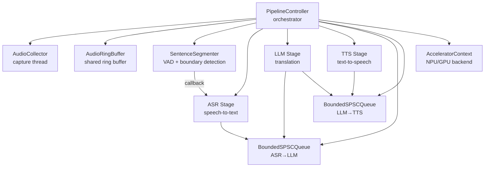
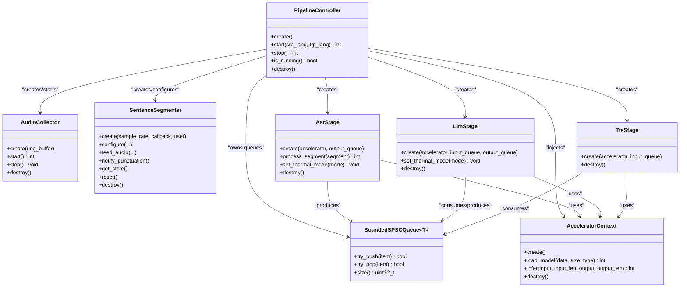
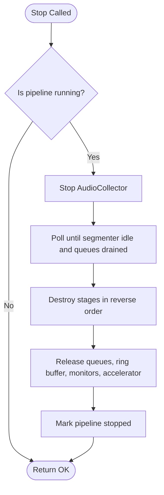

# Stage Instantiation and Configuration

<cite>
**Referenced Files in This Document**
- [pipeline_controller.h](file://native/include/pipeline_controller.h)
- [pipeline_controller.cpp](file://native/src/pipeline_controller.cpp)
- [audio_collector.h](file://native/include/audio_collector.h)
- [sentence_segmenter.h](file://native/include/sentence_segmenter.h)
- [asr_stage.h](file://native/include/asr_stage.h)
- [llm_stage.h](file://native/include/llm_stage.h)
- [tts_stage.h](file://native/include/tts_stage.h)
- [bounded_spsc_queue.h](file://native/include/bounded_spsc_queue.h)
- [echo_types.h](file://native/include/echo_types.h)
- [hal_accelerator.h](file://native/hal/hal_accelerator.h)
</cite>

## Table of Contents
1. [Introduction](#introduction)
2. [Project Structure](#project-structure)
3. [Core Components](#core-components)
4. [Architecture Overview](#architecture-overview)
5. [Detailed Component Analysis](#detailed-component-analysis)
6. [Dependency Analysis](#dependency-analysis)
7. [Performance Considerations](#performance-considerations)
8. [Troubleshooting Guide](#troubleshooting-guide)
9. [Conclusion](#conclusion)
10. [Appendices](#appendices)

## Introduction
This document explains how the PipelineController creates and configures individual processing stages (AudioCollector, SentenceSegmenter, ASR, LLM, TTS). It focuses on:
- The factory-style creation pattern used for each stage
- Parameter passing between stages via bounded queues and shared resources
- Dependency injection mechanisms (e.g., HAL accelerator context)
- Configuration options available per stage type
- Language pair validation and its effect on initialization
- How to extend the pipeline with custom stages
- Debugging stage initialization failures

The system implements a cascade-truncation pipeline where downstream stages begin before upstream completes, enabling low-latency streaming across ASR → LLM → TTS.

## Project Structure
At a high level, the native layer provides:
- A controller that orchestrates lifecycle and wiring
- Stage modules with public C/C++ interfaces
- Shared primitives like bounded SPSC queues and types
- Hardware abstraction for inference acceleration



**Diagram sources**
- [pipeline_controller.cpp:291-393](file://native/src/pipeline_controller.cpp#L291-L393)
- [bounded_spsc_queue.h:29-145](file://native/include/bounded_spsc_queue.h#L29-L145)
- [hal_accelerator.h:42-74](file://native/hal/hal_accelerator.h#L42-L74)

**Section sources**
- [pipeline_controller.h:1-107](file://native/include/pipeline_controller.h#L1-L107)
- [pipeline_controller.cpp:1-127](file://native/src/pipeline_controller.cpp#L1-L127)

## Core Components
- PipelineController: Creates, wires, starts, and stops all components; validates language codes; manages graceful shutdown.
- AudioCollector: Captures PCM audio at 16kHz mono and writes into the ring buffer.
- SentenceSegmenter: Performs VAD and sentence boundary detection; dispatches locked segments to ASR via callback.
- ASR Stage: Processes locked segments, streams partials, enqueues confirmed text to ASR→LLM queue.
- LLM Stage: Translates confirmed text, maintains sliding context, emits partials at punctuation boundaries to LLM→TTS queue.
- TTS Stage: Synthesizes speech from translated text, outputs PCM chunks.
- BoundedSPSCQueue: Lock-free bounded queue with overflow-drop semantics used between stages.
- AcceleratorContext: Platform-specific NPU/GPU inference backend injected into stages.

Key configuration and data contracts are defined in echo_types.h (message types, error codes, inter-stage elements, engine-level parameters).

**Section sources**
- [pipeline_controller.cpp:272-393](file://native/src/pipeline_controller.cpp#L272-L393)
- [audio_collector.h:42-89](file://native/include/audio_collector.h#L42-L89)
- [sentence_segmenter.h:64-135](file://native/include/sentence_segmenter.h#L64-L135)
- [asr_stage.h:42-97](file://native/include/asr_stage.h#L42-L97)
- [llm_stage.h:45-86](file://native/include/llm_stage.h#L45-L86)
- [tts_stage.h:45-72](file://native/include/tts_stage.h#L45-L72)
- [bounded_spsc_queue.h:29-145](file://native/include/bounded_spsc_queue.h#L29-L145)
- [echo_types.h:26-129](file://native/include/echo_types.h#L26-L129)

## Architecture Overview
The controller constructs a cascade pipeline with explicit dependency injection:
- HAL accelerator is created once and passed to ASR, LLM, and TTS stages.
- Inter-stage communication uses two bounded SPSC queues: ASR→LLM and LLM→TTS.
- SentenceSegmenter drives ASR through a callback when a segment is locked.
- Monitors (thermal, memory, latency) observe and influence behavior without blocking data flow.

```mermaid
sequenceDiagram
participant App as "Caller"
participant PC as "PipelineController"
participant HAL as "AcceleratorContext"
participant RB as "AudioRingBuffer"
participant AC as "AudioCollector"
participant SS as "SentenceSegmenter"
participant ASR as "AsrStage"
participant LLM as "LlmStage"
participant TTS as "TtsStage"
participant Q1 as "ASR→LLM Queue"
participant Q2 as "LLM→TTS Queue"
App->>PC : start(src_lang, tgt_lang)
PC->>HAL : create()
PC->>RB : new(capacity)
PC->>Q1 : new(BoundedSPSCQueue)
PC->>Q2 : new(BoundedSPSCQueue)
PC->>AC : create(RB), start()
PC->>SS : create(sample_rate, on_segment_locked, user=PC)
PC->>ASR : create(HAL, Q1)
PC->>LLM : create(HAL, Q1, Q2)
PC->>TTS : create(HAL, Q2)
SS-->>ASR : on_segment_locked(segment)
ASR-->>Q1 : push(AsrToLlmElement)
LLM-->>Q2 : push(LlmToTtsElement)
Note over PC : monitors started; running flag set
```

**Diagram sources**
- [pipeline_controller.cpp:291-393](file://native/src/pipeline_controller.cpp#L291-L393)
- [asr_stage.h:52-53](file://native/include/asr_stage.h#L52-L53)
- [llm_stage.h:60-62](file://native/include/llm_stage.h#L60-L62)
- [tts_stage.h:58-59](file://native/include/tts_stage.h#L58-L59)
- [bounded_spsc_queue.h:29-145](file://native/include/bounded_spsc_queue.h#L29-L145)
- [hal_accelerator.h:42-42](file://native/hal/hal_accelerator.h#L42-L42)

## Detailed Component Analysis

### Factory Pattern and Dependency Injection
Each stage follows a consistent factory pattern:
- Create function accepts dependencies (accelerator context, input/output queues, or ring buffer).
- Stages own their worker threads and internal state.
- Destroy functions stop threads and release resources safely.

Examples:
- AsrStage* asr_stage_create(AcceleratorContext*, BoundedSPSCQueue<AsrToLlmElement>*)
- LlmStage* llm_stage_create(AcceleratorContext*, BoundedSPSCQueue<AsrToLlmElement>*, BoundedSPSCQueue<LlmToTtsElement>*)
- TtsStage* tts_stage_create(AcceleratorContext*, BoundedSPSCQueue<LlmToTtsElement>*)
- AudioCollector* audio_collector_create(AudioRingBuffer*)
- SentenceSegmenter* sentence_segmenter_create(uint32_t, callback, void*)

Dependency injection points:
- HAL accelerator context is injected into ASR, LLM, TTS.
- Queues are injected to connect producers/consumers.
- Ring buffer is injected into AudioCollector.
- Callback and user pointer are injected into SentenceSegmenter.

**Section sources**
- [asr_stage.h:52-53](file://native/include/asr_stage.h#L52-L53)
- [llm_stage.h:60-62](file://native/include/llm_stage.h#L60-L62)
- [tts_stage.h:58-59](file://native/include/tts_stage.h#L58-L59)
- [audio_collector.h:42-48](file://native/include/audio_collector.h#L42-L48)
- [sentence_segmenter.h:72-74](file://native/include/sentence_segmenter.h#L72-L74)
- [pipeline_controller.cpp:324-353](file://native/src/pipeline_controller.cpp#L324-L353)

### Parameter Passing Between Stages
- ASR→LLM: Confirmed text elements (segment_id, speaker_id, UTF-8 text, length, timestamp) are pushed into a bounded queue.
- LLM→TTS: Translated text elements (same structure) are pushed into a second bounded queue.
- SentenceSegmenter passes LockedSegment pointers via callback to ASR; ASR copies internally for safe async processing.
- AudioCollector writes PCM samples into the shared ring buffer consumed by the segmenter.

Overflow behavior:
- BoundedSPSCQueue drops oldest items on overflow to keep throughput and avoid blocking.

**Section sources**
- [echo_types.h:68-86](file://native/include/echo_types.h#L68-L86)
- [bounded_spsc_queue.h:41-85](file://native/include/bounded_spsc_queue.h#L41-L85)
- [sentence_segmenter.h:43-49](file://native/include/sentence_segmenter.h#L43-L49)
- [asr_stage.h:59-79](file://native/include/asr_stage.h#L59-L79)

### Language Pair Validation and Initialization Effects
- On start, both source and target ISO 639-1 codes are validated against a supported list.
- If either code is unsupported, start returns an error indicating unsupported language.
- Only after successful validation does the controller allocate and initialize all pipeline resources.

Implications:
- Early failure prevents resource allocation and avoids partially-initialized states.
- Downstream stages do not receive invalid language contexts because they are only created post-validation.

**Section sources**
- [pipeline_controller.cpp:272-289](file://native/src/pipeline_controller.cpp#L272-L289)
- [pipeline_controller.h:49-64](file://native/include/pipeline_controller.h#L49-L64)

### Configuration Options Per Stage Type
- AudioCollector
  - Operates at 16kHz mono; first samples within 50ms of start; real-time priority.
  - No runtime configuration beyond ring buffer reference.
- SentenceSegmenter
  - Configurable thresholds: silence threshold, minimum speech duration, maximum segment duration.
  - Punctuation notification can force immediate lock.
- ASR Stage
  - Thermal mode: Normal (16kHz) vs Throttle (resample to 8kHz).
  - SLA: ≤200ms first partial.
- LLM Stage
  - Thermal mode affects context window size (Normal: larger, Throttle: smaller).
  - Sliding context history maintained; cascade truncation emits partials at punctuation.
  - SLA: ≤450ms first token.
- TTS Stage
  - Outputs PCM 24kHz, 16-bit, mono; TTFA ≤100ms.
  - Discards whitespace-only or punctuation-only segments.

Global/engine-level parameters (for reference):
- Model paths, ring buffer capacity, thermal/memory thresholds, LLM context sizes, segmenter thresholds, sample rates.

**Section sources**
- [audio_collector.h:4-16](file://native/include/audio_collector.h#L4-L16)
- [sentence_segmenter.h:77-87](file://native/include/sentence_segmenter.h#L77-L87)
- [asr_stage.h:12-17](file://native/include/asr_stage.h#L12-L17)
- [llm_stage.h:13-23](file://native/include/llm_stage.h#L13-L23)
- [tts_stage.h:12-21](file://native/include/tts_stage.h#L12-L21)
- [echo_types.h:92-129](file://native/include/echo_types.h#L92-L129)

### Extending the Pipeline With Custom Stages
To add a new stage (e.g., PostProcessor):
1. Define a factory interface similar to existing stages:
   - create(accelerator, input_queue, output_queue)
   - process_element(element)
   - set_thermal_mode(mode)
   - destroy(stage)
2. Inject dependencies:
   - Pass AcceleratorContext if inference is needed.
   - Connect via BoundedSPSCQueue instances for input/output.
3. Wire into PipelineController:
   - Allocate the new queue(s).
   - Create the stage with dependencies.
   - Start it alongside other stages.
   - Ensure reverse-order destruction in cleanup.
4. Maintain SLA and monitoring:
   - Report latency warnings if exceeding budgets.
   - Respect thermal mode changes.

Best practices:
- Keep stage workers non-blocking; use try_push/try_pop semantics.
- Copy incoming data if needed to ensure safety across threads.
- Use atomic flags and condition variables for clean shutdown.

[No sources needed since this section provides general guidance]

### Debugging Stage Initialization Failures
Common failure modes and diagnostics:
- Unsupported language: start returns an error immediately; verify ISO 639-1 codes against supported list.
- Memory allocation failures: any stage create returning NULL indicates insufficient memory; check return codes and logs.
- Duplicate session: starting while already running returns an active-session error; stop first.
- Resource ordering: ensure monitors and collectors are started before dependent stages; controller handles order but custom extensions must follow.

Practical steps:
- Inspect return values from create/start calls.
- Validate queue capacities and ring buffer size for expected workloads.
- Confirm HAL accelerator availability; stages handle NULL gracefully in stub mode but may degrade performance.
- Use latency warnings and monitor callbacks to detect bottlenecks during warm-up.

**Section sources**
- [pipeline_controller.cpp:272-393](file://native/src/pipeline_controller.cpp#L272-L393)
- [echo_types.h:48-62](file://native/include/echo_types.h#L48-L62)

## Dependency Analysis
The following diagram maps key dependencies among core components and their interactions.



**Diagram sources**
- [pipeline_controller.cpp:107-126](file://native/src/pipeline_controller.cpp#L107-L126)
- [asr_stage.h:52-53](file://native/include/asr_stage.h#L52-L53)
- [llm_stage.h:60-62](file://native/include/llm_stage.h#L60-L62)
- [tts_stage.h:58-59](file://native/include/tts_stage.h#L58-L59)
- [bounded_spsc_queue.h:29-145](file://native/include/bounded_spsc_queue.h#L29-L145)
- [hal_accelerator.h:42-74](file://native/hal/hal_accelerator.h#L42-L74)

**Section sources**
- [pipeline_controller.cpp:107-126](file://native/src/pipeline_controller.cpp#L107-L126)
- [bounded_spsc_queue.h:29-145](file://native/include/bounded_spsc_queue.h#L29-L145)

## Performance Considerations
- Cascade truncation reduces end-to-end latency by allowing downstream stages to begin early.
- Bounded queues prevent backpressure-induced stalls; overflow drops oldest items to maintain throughput.
- Thermal throttling adapts model resolution/context windows to preserve responsiveness under heat constraints.
- LatencyTracker and per-stage SLAs help identify bottlenecks and enforce budgets.

[No sources needed since this section provides general guidance]

## Troubleshooting Guide
- Language validation errors: confirm ISO 639-1 codes; unsupported codes cause immediate start failure.
- Memory issues: inspect allocation returns from create calls; reduce queue/ring buffer sizes if necessary.
- Session conflicts: ensure stop is called before start; duplicate sessions are rejected.
- Partial initialization: rely on reverse-order destroy to guarantee cleanup even after partial success.
- Monitor-driven shutdown: critical memory pressure triggers graceful stop; investigate memory limits and usage patterns.

**Section sources**
- [pipeline_controller.cpp:272-393](file://native/src/pipeline_controller.cpp#L272-L393)
- [echo_types.h:48-62](file://native/include/echo_types.h#L48-L62)

## Conclusion
The PipelineController employs a clear factory-based approach to instantiate and wire stages, using dependency injection for shared resources and bounded queues for inter-stage communication. Language validation ensures robust initialization, while thermal and memory monitors provide adaptive control. Following the documented patterns enables safe extension with custom stages and simplifies debugging of initialization and runtime issues.

[No sources needed since this section summarizes without analyzing specific files]

## Appendices

### Graceful Stop Sequence


**Diagram sources**
- [pipeline_controller.cpp:395-469](file://native/src/pipeline_controller.cpp#L395-L469)