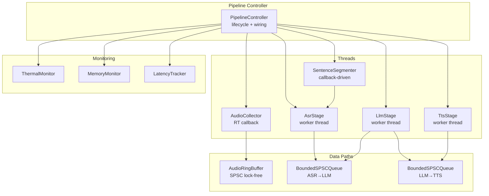
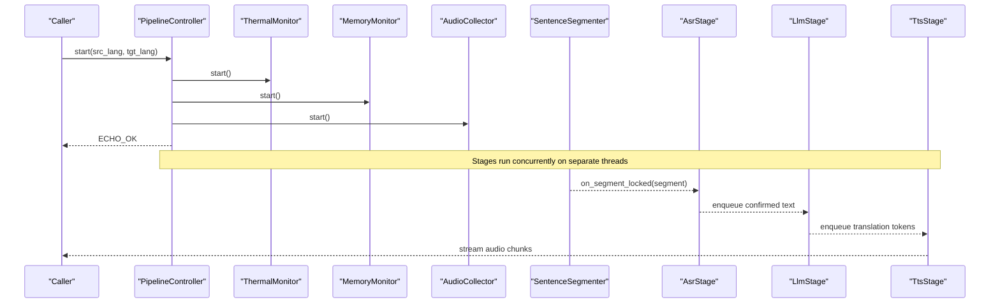
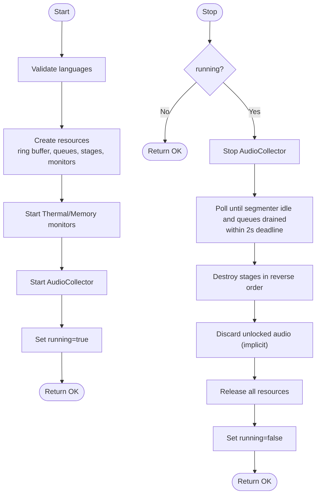
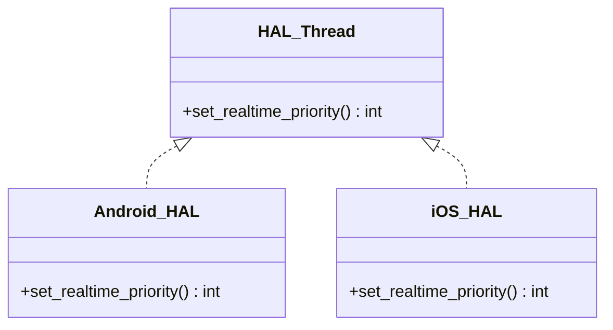
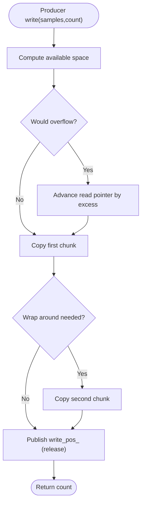
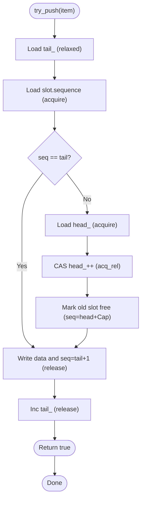
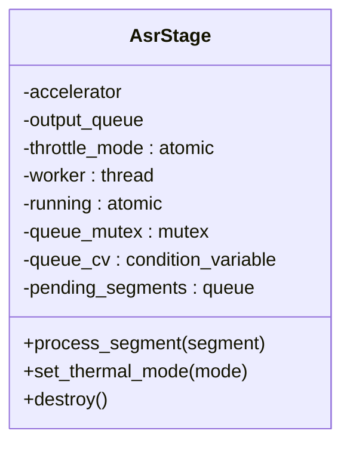
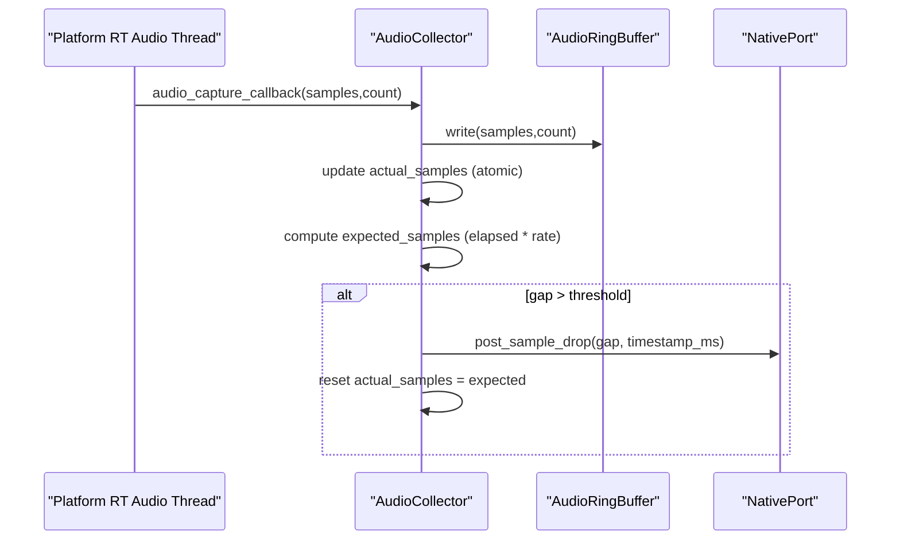
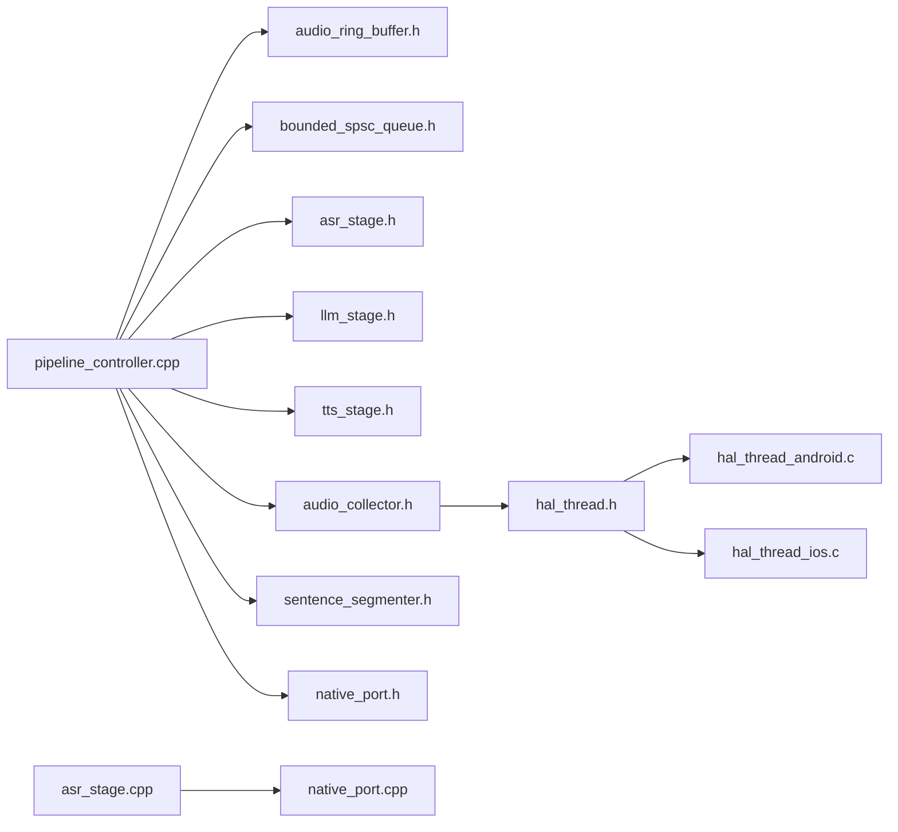

# Thread Synchronization and Coordination

<cite>
**Referenced Files in This Document**
- [pipeline_controller.h](file://native/include/pipeline_controller.h)
- [pipeline_controller.cpp](file://native/src/pipeline_controller.cpp)
- [hal_thread.h](file://native/hal/hal_thread.h)
- [hal_thread_android.c](file://native/hal/android/hal_thread_android.c)
- [hal_thread_ios.c](file://native/hal/ios/hal_thread_ios.c)
- [bounded_spsc_queue.h](file://native/include/bounded_spsc_queue.h)
- [audio_ring_buffer.h](file://native/include/audio_ring_buffer.h)
- [asr_stage.h](file://native/include/asr_stage.h)
- [asr_stage.cpp](file://native/src/asr_stage.cpp)
- [llm_stage.h](file://native/include/llm_stage.h)
- [tts_stage.h](file://native/include/tts_stage.h)
- [audio_collector.h](file://native/include/audio_collector.h)
- [audio_collector.cpp](file://native/src/audio_collector.cpp)
- [sentence_segmenter.h](file://native/include/sentence_segmenter.h)
- [native_port.h](file://native/include/native_port.h)
- [native_port.cpp](file://native/src/native_port.cpp)
</cite>

## Table of Contents
1. [Introduction](#introduction)
2. [Project Structure](#project-structure)
3. [Core Components](#core-components)
4. [Architecture Overview](#architecture-overview)
5. [Detailed Component Analysis](#detailed-component-analysis)
6. [Dependency Analysis](#dependency-analysis)
7. [Performance Considerations](#performance-considerations)
8. [Troubleshooting Guide](#troubleshooting-guide)
9. [Conclusion](#conclusion)
10. [Appendices](#appendices)

## Introduction
This document explains the threading model and synchronization mechanisms used by the pipeline controller to coordinate multiple processing threads safely and efficiently. It covers thread creation, priority management, lifecycle coordination, inter-thread communication via lock-free queues and ring buffers, condition variables for worker loops, and atomic operations for shared state. It also provides best practices for extending the threading model and guidance for debugging thread-related issues.

## Project Structure
The native layer implements a multi-stage audio processing pipeline with dedicated threads per stage:
- Audio Collector captures PCM at 16 kHz and writes to a lock-free ring buffer.
- Sentence Segmenter classifies speech and locks segments for ASR.
- ASR Stage transcribes locked segments and enqueues confirmed text.
- LLM Stage translates confirmed text and emits partial results.
- TTS Stage synthesizes translated text into streaming audio.
- Monitors (thermal, memory, latency) observe system state and can trigger graceful stop.

**Diagram sources**
- [pipeline_controller.cpp:107-126](file://native/src/pipeline_controller.cpp#L107-L126)
- [audio_ring_buffer.h:27-42](file://native/include/audio_ring_buffer.h#L27-L42)
- [bounded_spsc_queue.h:29-39](file://native/include/bounded_spsc_queue.h#L29-L39)
- [asr_stage.h:42-53](file://native/include/asr_stage.h#L42-L53)
- [llm_stage.h:49-62](file://native/include/llm_stage.h#L49-L62)
- [tts_stage.h:46-59](file://native/include/tts_stage.h#L46-L59)
- [audio_collector.h:36-48](file://native/include/audio_collector.h#L36-L48)
- [sentence_segmenter.h:64-74](file://native/include/sentence_segmenter.h#L64-L74)

**Section sources**
- [pipeline_controller.h:1-107](file://native/include/pipeline_controller.h#L1-L107)
- [pipeline_controller.cpp:1-126](file://native/src/pipeline_controller.cpp#L1-L126)

## Core Components
- PipelineController: orchestrates resource creation, starts monitors and collector, sets running flag, and coordinates graceful stop with a deadline.
- AudioRingBuffer: SPSC lock-free circular buffer with overwrite-on-overflow policy and cache-line alignment.
- BoundedSPSCQueue: lock-free bounded queue with overflow-drop semantics and sequence-based slot protocol.
- AsrStage/LlmStage/TtsStage: each owns a worker thread, uses internal queues and condition variables, and communicates via bounded queues or callbacks.
- AudioCollector: runs on platform RT audio thread; writes to ring buffer and detects sample drops using atomic counters.
- NativePort: lock-free message posting to Flutter UI using atomics for port registration and function pointer.

Key synchronization primitives:
- std::atomic<bool> for running flags and state queries.
- std::mutex + std::condition_variable for stage worker loops.
- Lock-free data structures for high-throughput paths (ring buffer, SPSC queues).
- Platform HAL for real-time thread priority elevation.

**Section sources**
- [pipeline_controller.cpp:248-393](file://native/src/pipeline_controller.cpp#L248-L393)
- [audio_ring_buffer.h:27-91](file://native/include/audio_ring_buffer.h#L27-L91)
- [bounded_spsc_queue.h:29-142](file://native/include/bounded_spsc_queue.h#L29-L142)
- [asr_stage.cpp:64-82](file://native/src/asr_stage.cpp#L64-L82)
- [audio_collector.cpp:47-74](file://native/src/audio_collector.cpp#L47-L74)
- [native_port.cpp:19-30](file://native/src/native_port.cpp#L19-L30)

## Architecture Overview
The pipeline is a cascade of stages with overlapped execution. Each stage runs on its own thread and communicates through lock-free queues or callbacks. The controller ensures correct startup order and coordinated shutdown within a strict deadline.

**Diagram sources**
- [pipeline_controller.cpp:376-393](file://native/src/pipeline_controller.cpp#L376-L393)
- [asr_stage.h:58-79](file://native/include/asr_stage.h#L58-L79)
- [llm_stage.h:49-62](file://native/include/llm_stage.h#L49-L62)
- [tts_stage.h:46-59](file://native/include/tts_stage.h#L46-L59)

## Detailed Component Analysis

### PipelineController Threading Model
- Lifecycle: create → start → stop → destroy. Start validates language codes, creates resources, starts monitors and collector, then marks running. Stop performs a graceful sequence with a 2-second deadline, flushing locked segments and destroying stages in reverse order.
- Concurrency control: uses a mutex to guard start/stop transitions and an atomic bool for running state.
- Priority: relies on platform HAL to elevate the audio collector’s thread priority.

**Diagram sources**
- [pipeline_controller.cpp:272-393](file://native/src/pipeline_controller.cpp#L272-L393)
- [pipeline_controller.cpp:395-469](file://native/src/pipeline_controller.cpp#L395-L469)

**Section sources**
- [pipeline_controller.h:33-100](file://native/include/pipeline_controller.h#L33-L100)
- [pipeline_controller.cpp:107-126](file://native/src/pipeline_controller.cpp#L107-L126)
- [pipeline_controller.cpp:248-393](file://native/src/pipeline_controller.cpp#L248-L393)
- [pipeline_controller.cpp:395-469](file://native/src/pipeline_controller.cpp#L395-L469)

### Real-Time Thread Priority Management
- HAL interface abstracts platform-specific priority elevation.
- Android: attempts SCHED_FIFO with elevated priority, falls back to lower priority or SCHED_RR if denied.
- iOS: sets QOS_CLASS_USER_INTERACTIVE for highest available application QoS.

**Diagram sources**
- [hal_thread.h:17-28](file://native/hal/hal_thread.h#L17-L28)
- [hal_thread_android.c:48-103](file://native/hal/android/hal_thread_android.c#L48-L103)
- [hal_thread_ios.c:20-43](file://native/hal/ios/hal_thread_ios.c#L20-L43)

**Section sources**
- [hal_thread.h:1-35](file://native/hal/hal_thread.h#L1-L35)
- [hal_thread_android.c:1-106](file://native/hal/android/hal_thread_android.c#L1-L106)
- [hal_thread_ios.c:1-46](file://native/hal/ios/hal_thread_ios.c#L1-L46)

### Inter-Thread Communication Primitives

#### AudioRingBuffer (SPSC lock-free)
- Single producer (audio callback), single consumer (segmenter).
- Overwrite-on-overflow by advancing read pointer; never blocks producer.
- Uses atomic positions with acquire/release ordering and cache-line alignment to avoid false sharing.

**Diagram sources**
- [audio_ring_buffer.h:52-91](file://native/include/audio_ring_buffer.h#L52-L91)
- [audio_ring_buffer.h:152-155](file://native/include/audio_ring_buffer.h#L152-L155)

**Section sources**
- [audio_ring_buffer.h:27-192](file://native/include/audio_ring_buffer.h#L27-L192)

#### BoundedSPSCQueue (lock-free with overflow drop)
- Fixed capacity power-of-two; bitmask indexing.
- Sequence/turn protocol per slot to track occupancy.
- try_push returns true on normal push, false on overflow (oldest dropped).
- try_pop claims slots via CAS on head.

**Diagram sources**
- [bounded_spsc_queue.h:51-85](file://native/include/bounded_spsc_queue.h#L51-L85)
- [bounded_spsc_queue.h:93-116](file://native/include/bounded_spsc_queue.h#L93-L116)

**Section sources**
- [bounded_spsc_queue.h:1-145](file://native/include/bounded_spsc_queue.h#L1-L145)

### Worker Threads and Condition Variables

#### AsrStage
- Owns a worker thread that waits on a condition variable for pending segments.
- Processes segments sequentially: optional resampling, inference, streaming partials, enqueueing confirmed text.
- Uses atomic throttle_mode and running flags.

**Diagram sources**
- [asr_stage.h:42-97](file://native/include/asr_stage.h#L42-L97)
- [asr_stage.cpp:64-82](file://native/src/asr_stage.cpp#L64-L82)

**Section sources**
- [asr_stage.h:1-104](file://native/include/asr_stage.h#L1-L104)
- [asr_stage.cpp:167-200](file://native/src/asr_stage.cpp#L167-L200)

#### LlmStage and TtsStage
- Both own worker threads polling input queues and producing output via bounded queues.
- LLM emits partial results at punctuation boundaries for cascade truncation.
- TTS outputs streaming PCM chunks and reports SLA violations.

**Section sources**
- [llm_stage.h:49-86](file://native/include/llm_stage.h#L49-L86)
- [tts_stage.h:46-72](file://native/include/tts_stage.h#L46-L72)

### AudioCollector and Sample Drop Detection
- Runs on platform RT audio thread; writes directly to ring buffer without blocking.
- Maintains expected vs actual sample counts using atomics; reports MSG_SAMPLE_DROP when gaps exceed threshold.

**Diagram sources**
- [audio_collector.cpp:93-128](file://native/src/audio_collector.cpp#L93-L128)
- [native_port.h:169-172](file://native/include/native_port.h#L169-L172)

**Section sources**
- [audio_collector.h:36-88](file://native/include/audio_collector.h#L36-L88)
- [audio_collector.cpp:157-200](file://native/src/audio_collector.cpp#L157-L200)

### Graceful Shutdown Coordination
- Stops collector to prevent new data.
- Polls segmenter state and queue sizes until both are idle/drain within a deadline.
- Destroys stages in reverse order; destroys ring buffer to discard unlocked audio; releases all resources.

**Section sources**
- [pipeline_controller.cpp:395-469](file://native/src/pipeline_controller.cpp#L395-L469)

## Dependency Analysis
The following diagram shows key dependencies among components involved in threading and synchronization.

**Diagram sources**
- [pipeline_controller.cpp:40-52](file://native/src/pipeline_controller.cpp#L40-L52)
- [audio_collector.cpp:16-21](file://native/src/audio_collector.cpp#L16-L21)
- [asr_stage.cpp:18-22](file://native/src/asr_stage.cpp#L18-L22)
- [native_port.cpp:9-12](file://native/src/native_port.cpp#L9-L12)

**Section sources**
- [pipeline_controller.cpp:40-52](file://native/src/pipeline_controller.cpp#L40-L52)
- [audio_collector.cpp:16-21](file://native/src/audio_collector.cpp#L16-L21)
- [asr_stage.cpp:18-22](file://native/src/asr_stage.cpp#L18-L22)
- [native_port.cpp:9-12](file://native/src/native_port.cpp#L9-L12)

## Performance Considerations
- Prefer lock-free paths for hot loops: ring buffer and SPSC queues avoid contention and blocking.
- Use acquire/release memory ordering consistently to publish visibility across threads.
- Align frequently accessed atomics on cache lines to reduce false sharing.
- Keep RT callbacks minimal: no allocations, no blocking I/O; use atomic counters and non-blocking posts.
- Monitor SLA budgets per stage and report warnings early to detect regressions.

[No sources needed since this section provides general guidance]

## Troubleshooting Guide
Common thread-related issues and diagnostics:
- Deadlocks during shutdown: ensure stop sequence respects deadlines and avoids holding locks while waiting on other threads. Verify that destroy functions join worker threads before releasing resources.
- Missed messages: confirm that NativePort has been registered and post function set; check g_port_registered and g_post_fn atomics.
- Sample drops: inspect MSG_SAMPLE_DROP events and compare expected vs actual samples; verify ring buffer capacity and consumer throughput.
- Priority failures: on Android, falling back from SCHED_FIFO may occur due to permissions; validate hal_thread_set_realtime_priority return codes.

Actionable checks:
- Query pipeline status via is_running and monitor thermal/memory events.
- Inspect queue sizes during stop to ensure draining completes within deadline.
- Log first-character latencies for ASR/LLM/TTS to identify bottlenecks.

**Section sources**
- [native_port.cpp:62-75](file://native/src/native_port.cpp#L62-L75)
- [audio_collector.cpp:116-128](file://native/src/audio_collector.cpp#L116-L128)
- [pipeline_controller.cpp:395-469](file://native/src/pipeline_controller.cpp#L395-L469)

## Conclusion
The pipeline employs a robust threading model combining real-time audio capture, lock-free data structures, and condition-variable-driven worker threads. The controller coordinates lifecycle and graceful shutdown with clear deadlines. Extending the model should follow established patterns: isolate per-stage workers, communicate via bounded SPSC queues or callbacks, use atomics for shared flags, and keep RT paths minimal and non-blocking.

[No sources needed since this section summarizes without analyzing specific files]

## Appendices

### Best Practices for Extending the Threading Model
- Add new stages as independent worker threads consuming from input queues and producing to output queues.
- Use BoundedSPSCQueue for producer-consumer links; prefer overflow-drop semantics to maintain latency.
- Protect internal state with mutexes and wake workers via condition variables; avoid busy-waiting.
- Elevate critical thread priorities via HAL only where necessary (e.g., audio capture).
- Integrate monitoring hooks (thermal, memory, latency) to adapt behavior dynamically.

[No sources needed since this section provides general guidance]

### Example: Adding a New Stage to the Pipeline
Conceptual steps:
- Define a new stage header with create/destroy and configuration APIs.
- Implement a worker loop using a mutex + condition variable to process items from an input queue.
- Wire the stage in the controller: create instance, connect input/output queues, start it after monitors and collector.
- Ensure destroy joins the worker thread and releases resources.
- Add any necessary monitoring or latency tracking.

[No sources needed since this section provides general guidance]