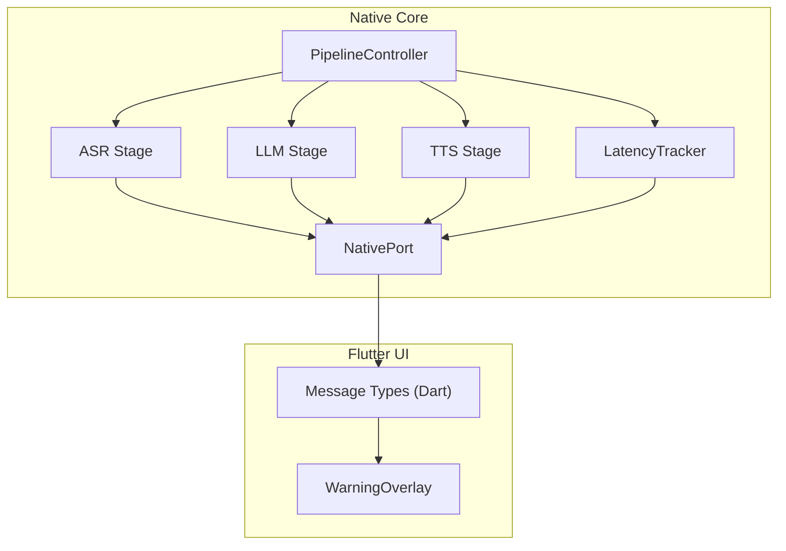
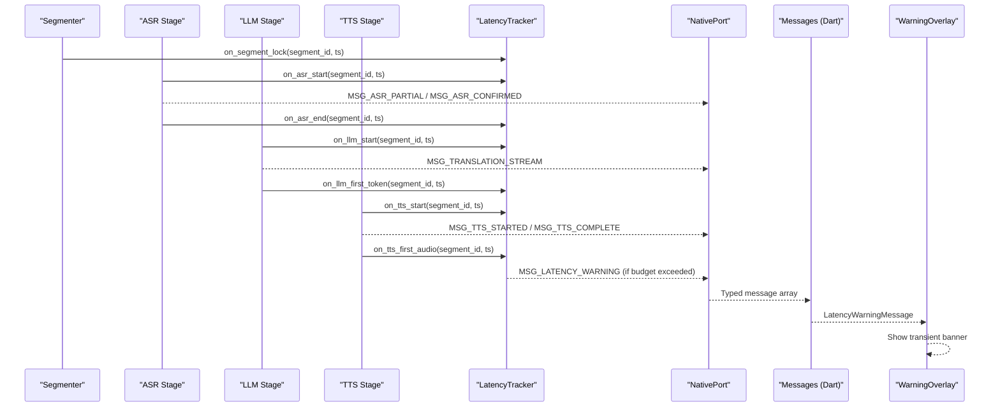
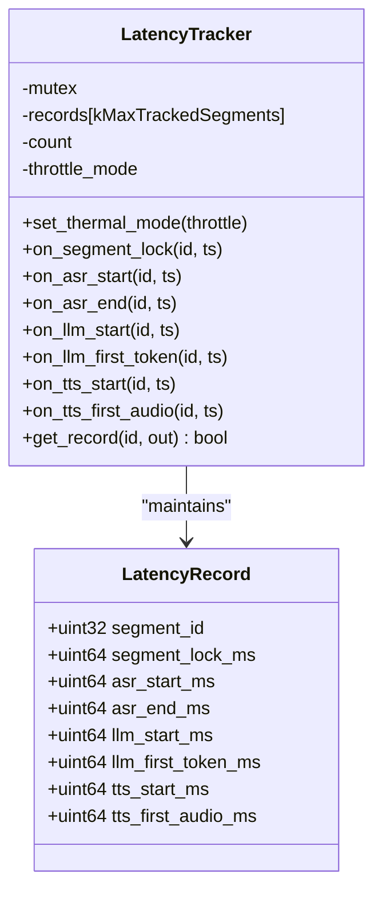
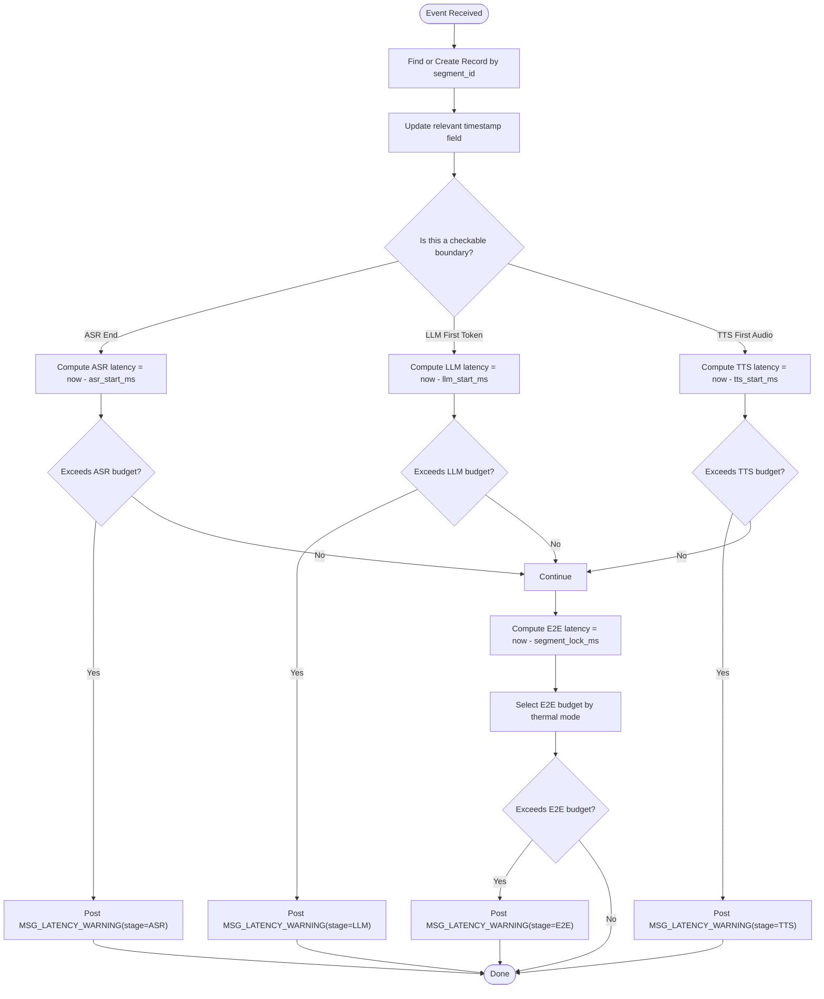
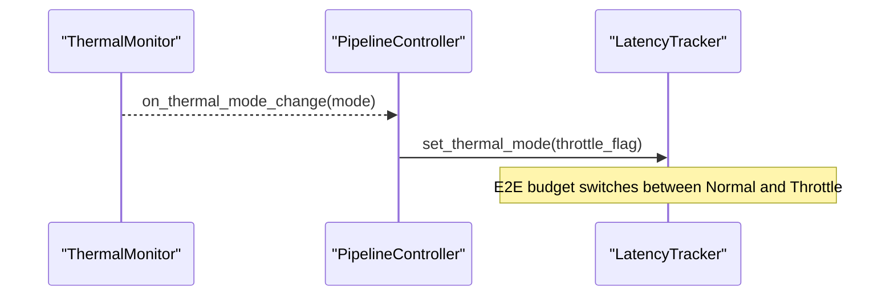
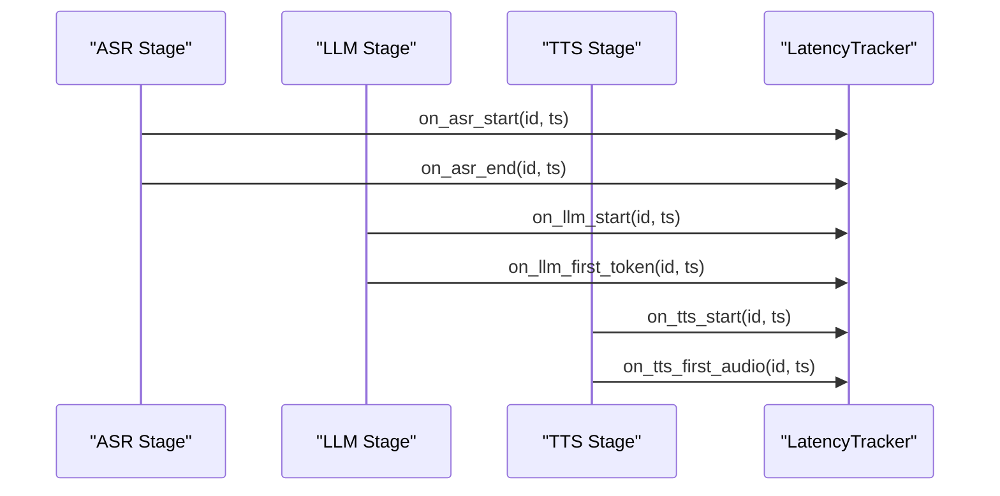
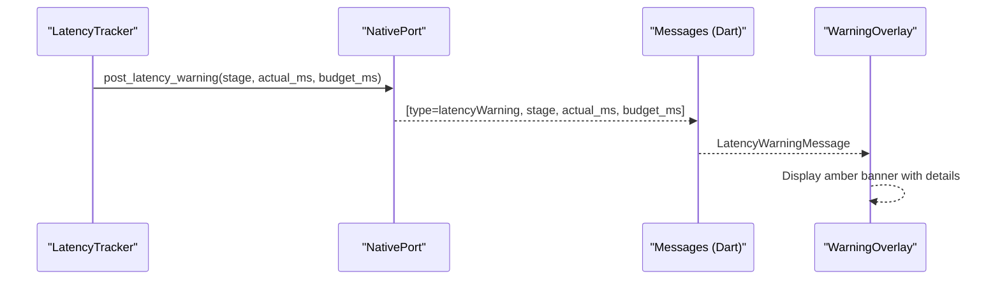
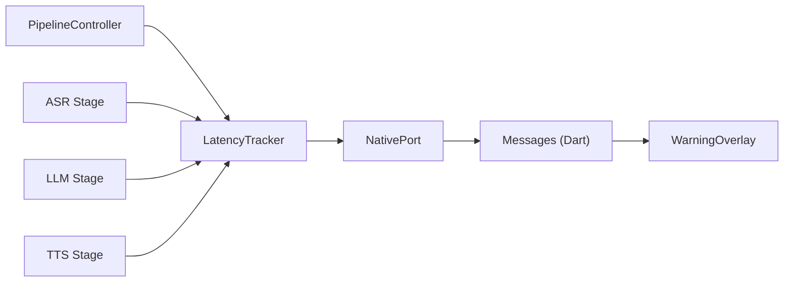

# Latency Tracking System

<cite>
**Referenced Files in This Document**
- [latency_tracker.h](file://native/include/latency_tracker.h)
- [latency_tracker.cpp](file://native/src/latency_tracker.cpp)
- [native_port.h](file://native/include/native_port.h)
- [native_port.cpp](file://native/src/native_port.cpp)
- [pipeline_controller.cpp](file://native/src/pipeline_controller.cpp)
- [asr_stage.cpp](file://native/src/asr_stage.cpp)
- [llm_stage.cpp](file://native/src/llm_stage.cpp)
- [tts_stage.cpp](file://native/src/tts_stage.cpp)
- [messages.dart](file://lib/src/messages.dart)
- [warning_overlay.dart](file://lib/src/ui/warning_overlay.dart)
</cite>

## Table of Contents
1. [Introduction](#introduction)
2. [Project Structure](#project-structure)
3. [Core Components](#core-components)
4. [Architecture Overview](#architecture-overview)
5. [Detailed Component Analysis](#detailed-component-analysis)
6. [Dependency Analysis](#dependency-analysis)
7. [Performance Considerations](#performance-considerations)
8. [Troubleshooting Guide](#troubleshooting-guide)
9. [Conclusion](#conclusion)
10. [Appendices](#appendices)

## Introduction
This document explains QwenEcho’s end-to-end latency tracking system. It covers timestamp-based measurement across all pipeline stages from audio capture to speech output, the latency calculation algorithms, statistical aggregation and reporting, performance threshold detection, and integration with the UI layer for real-time display and user feedback. It also provides guidance on configuring latency budgets, collecting metrics, identifying bottlenecks, and implementing custom latency reporting mechanisms.

## Project Structure
The latency tracking system spans native C/C++ components and Flutter UI:
- Native core: LatencyTracker records per-segment timestamps and checks SLA budgets; Native Port posts typed messages to Dart; Pipeline Controller wires stages and thermal mode changes; Stage implementations emit events and integrate with the tracker.
- Flutter UI: Message types are parsed and displayed via a warning overlay that shows transient notifications for latency warnings.

**Diagram sources**
- [pipeline_controller.cpp:248-393](file://native/src/pipeline_controller.cpp#L248-L393)
- [latency_tracker.cpp:132-285](file://native/src/latency_tracker.cpp#L132-L285)
- [native_port.cpp:283-300](file://native/src/native_port.cpp#L283-L300)
- [messages.dart:289-313](file://lib/src/messages.dart#L289-L313)
- [warning_overlay.dart:87-141](file://lib/src/ui/warning_overlay.dart#L87-L141)

**Section sources**
- [pipeline_controller.cpp:248-393](file://native/src/pipeline_controller.cpp#L248-L393)
- [latency_tracker.h:34-50](file://native/include/latency_tracker.h#L34-L50)
- [latency_tracker.cpp:132-285](file://native/src/latency_tracker.cpp#L132-L285)
- [native_port.h:162-166](file://native/include/native_port.h#L162-L166)
- [native_port.cpp:283-300](file://native/src/native_port.cpp#L283-L300)
- [messages.dart:289-313](file://lib/src/messages.dart#L289-L313)
- [warning_overlay.dart:87-141](file://lib/src/ui/warning_overlay.dart#L87-L141)

## Core Components
- LatencyTracker: Maintains per-segment timestamps and computes stage-level and E2E latencies. It enforces budgets and posts warnings when exceeded.
- NativePort: Serializes typed messages and dispatches them to the Dart VM over a registered port.
- PipelineController: Creates and starts all pipeline components, including LatencyTracker, and propagates thermal mode changes to adjust E2E budget selection.
- Stages (ASR/LLM/TTS): Emit lifecycle events and integrate with LatencyTracker at key boundaries.
- Flutter Messages and WarningOverlay: Parse incoming messages and render transient latency warnings to users.

Key responsibilities:
- Timestamp recording at segment lock, ASR start/end, LLM start/first-token, TTS start/first-audio.
- Budget enforcement with thermal-mode-aware E2E thresholds.
- Real-time messaging to UI for immediate feedback.

**Section sources**
- [latency_tracker.h:52-80](file://native/include/latency_tracker.h#L52-L80)
- [latency_tracker.cpp:156-267](file://native/src/latency_tracker.cpp#L156-L267)
- [native_port.h:162-166](file://native/include/native_port.h#L162-L166)
- [native_port.cpp:283-300](file://native/src/native_port.cpp#L283-L300)
- [pipeline_controller.cpp:145-160](file://native/src/pipeline_controller.cpp#L145-L160)
- [messages.dart:289-313](file://lib/src/messages.dart#L289-L313)
- [warning_overlay.dart:87-141](file://lib/src/ui/warning_overlay.dart#L87-L141)

## Architecture Overview
End-to-end flow:
- Audio capture and segmentation produce segments with unique IDs.
- Each stage emits boundary events used by LatencyTracker to compute latencies.
- When any stage or E2E exceeds its budget, LatencyTracker posts a latency warning message through NativePort.
- Flutter parses the message and displays a transient banner via WarningOverlay.

**Diagram sources**
- [latency_tracker.h:123-203](file://native/include/latency_tracker.h#L123-L203)
- [latency_tracker.cpp:156-267](file://native/src/latency_tracker.cpp#L156-L267)
- [native_port.cpp:283-300](file://native/src/native_port.cpp#L283-L300)
- [messages.dart:289-313](file://lib/src/messages.dart#L289-L313)
- [warning_overlay.dart:87-141](file://lib/src/ui/warning_overlay.dart#L87-L141)

## Detailed Component Analysis

### LatencyTracker: Data Model and Algorithms
- Data model: Per-segment record stores timestamps for each stage boundary.
- Algorithm highlights:
  - Record creation/update under mutex protection.
  - Stage latency computed as difference between paired timestamps.
  - E2E latency computed as time from segment lock to TTS first audio.
  - Thermal mode selects E2E budget (Normal vs Throttle).
  - On violation, posts a latency warning via NativePort.

**Diagram sources**
- [latency_tracker.h:52-80](file://native/include/latency_tracker.h#L52-L80)
- [latency_tracker.cpp:47-54](file://native/src/latency_tracker.cpp#L47-L54)

**Section sources**
- [latency_tracker.h:34-50](file://native/include/latency_tracker.h#L34-L50)
- [latency_tracker.cpp:122-128](file://native/src/latency_tracker.cpp#L122-L128)
- [latency_tracker.cpp:156-267](file://native/src/latency_tracker.cpp#L156-L267)

### Latency Calculation Flow

**Diagram sources**
- [latency_tracker.cpp:180-267](file://native/src/latency_tracker.cpp#L180-L267)
- [latency_tracker.h:34-50](file://native/include/latency_tracker.h#L34-L50)

**Section sources**
- [latency_tracker.cpp:180-267](file://native/src/latency_tracker.cpp#L180-L267)
- [latency_tracker.h:34-50](file://native/include/latency_tracker.h#L34-L50)

### Thermal Mode and E2E Budget Selection
- Normal mode: E2E budget is stricter.
- Throttle mode: E2E budget is relaxed.
- The PipelineController updates the tracker’s thermal mode whenever thermal state changes.

**Diagram sources**
- [pipeline_controller.cpp:145-160](file://native/src/pipeline_controller.cpp#L145-L160)
- [latency_tracker.h:109-119](file://native/include/latency_tracker.h#L109-L119)

**Section sources**
- [pipeline_controller.cpp:145-160](file://native/src/pipeline_controller.cpp#L145-L160)
- [latency_tracker.h:109-119](file://native/include/latency_tracker.h#L109-L119)

### Integration Points in Stages
- ASR: Emits partial and confirmed text; integrates with LatencyTracker at ASR start/end.
- LLM: Streams tokens; integrates at LLM start and first token.
- TTS: Synthesizes audio; integrates at TTS start and first audio.

**Diagram sources**
- [latency_tracker.h:123-203](file://native/include/latency_tracker.h#L123-L203)
- [asr_stage.cpp:228-258](file://native/src/asr_stage.cpp#L228-L258)
- [llm_stage.cpp:1-200](file://native/src/llm_stage.cpp#L1-L200)
- [tts_stage.cpp:1-200](file://native/src/tts_stage.cpp#L1-L200)

**Section sources**
- [asr_stage.cpp:228-258](file://native/src/asr_stage.cpp#L228-L258)
- [llm_stage.cpp:1-200](file://native/src/llm_stage.cpp#L1-L200)
- [tts_stage.cpp:1-200](file://native/src/tts_stage.cpp#L1-L200)
- [latency_tracker.h:123-203](file://native/include/latency_tracker.h#L123-L203)

### Messaging and UI Integration
- NativePort serializes MSG_LATENCY_WARNING into a typed array and posts it to Dart.
- Flutter parses the message into LatencyWarningMessage and renders a transient banner.

**Diagram sources**
- [native_port.cpp:283-300](file://native/src/native_port.cpp#L283-L300)
- [messages.dart:289-313](file://lib/src/messages.dart#L289-L313)
- [warning_overlay.dart:87-141](file://lib/src/ui/warning_overlay.dart#L87-L141)

**Section sources**
- [native_port.h:162-166](file://native/include/native_port.h#L162-L166)
- [native_port.cpp:283-300](file://native/src/native_port.cpp#L283-L300)
- [messages.dart:289-313](file://lib/src/messages.dart#L289-L313)
- [warning_overlay.dart:87-141](file://lib/src/ui/warning_overlay.dart#L87-L141)

## Dependency Analysis
- LatencyTracker depends on NativePort to report violations.
- PipelineController creates and configures LatencyTracker and propagates thermal mode changes.
- Stages call LatencyTracker APIs at defined boundaries.
- Flutter UI depends on message parsing and overlay rendering.

**Diagram sources**
- [latency_tracker.cpp:132-285](file://native/src/latency_tracker.cpp#L132-L285)
- [native_port.cpp:283-300](file://native/src/native_port.cpp#L283-L300)
- [pipeline_controller.cpp:369-374](file://native/src/pipeline_controller.cpp#L369-L374)
- [messages.dart:289-313](file://lib/src/messages.dart#L289-L313)
- [warning_overlay.dart:87-141](file://lib/src/ui/warning_overlay.dart#L87-L141)

**Section sources**
- [latency_tracker.cpp:132-285](file://native/src/latency_tracker.cpp#L132-L285)
- [native_port.cpp:283-300](file://native/src/native_port.cpp#L283-L300)
- [pipeline_controller.cpp:369-374](file://native/src/pipeline_controller.cpp#L369-L374)
- [messages.dart:289-313](file://lib/src/messages.dart#L289-L313)
- [warning_overlay.dart:87-141](file://lib/src/ui/warning_overlay.dart#L87-L141)

## Performance Considerations
- Cascade processing reduces perceived latency by overlapping stages:
  - LLM begins translation upon ASR confirmation.
  - TTS begins synthesis at punctuation boundaries while LLM continues.
- Thread-per-stage design avoids blocking upstream stages.
- Bounded queues provide backpressure and prevent unbounded memory growth.
- Thermal mode adapts E2E budget to device conditions.

[No sources needed since this section provides general guidance]

## Troubleshooting Guide
Common issues and diagnostics:
- Frequent ASR/LLM/TTS/E2E warnings indicate stage-specific bottlenecks.
- Elevated E2E warnings in Normal mode may require switching to Throttle mode or optimizing upstream stages.
- Missing warnings can occur if NativePort is not registered or if messages are dropped due to queue saturation.

Actions:
- Inspect which stage triggers warnings to focus optimization efforts.
- Verify thermal mode transitions and ensure PipelineController updates LatencyTracker accordingly.
- Confirm Flutter UI receives and displays warnings; validate message parsing and overlay configuration.

**Section sources**
- [latency_tracker.cpp:122-128](file://native/src/latency_tracker.cpp#L122-L128)
- [native_port.cpp:62-75](file://native/src/native_port.cpp#L62-L75)
- [pipeline_controller.cpp:145-160](file://native/src/pipeline_controller.cpp#L145-L160)
- [warning_overlay.dart:87-141](file://lib/src/ui/warning_overlay.dart#L87-L141)

## Conclusion
QwenEcho’s latency tracking system provides precise, timestamp-based measurements across the entire pipeline, enforces per-stage and E2E budgets with thermal-mode awareness, and surfaces actionable insights to users via real-time UI warnings. Its modular design allows easy extension for additional metrics and custom reporting mechanisms.

[No sources needed since this section summarizes without analyzing specific files]

## Appendices

### Configuring Latency Budgets
- Per-stage budgets are defined in the header constants. Adjust these values to align with product requirements.
- E2E budgets differ by thermal mode; update both Normal and Throttle values consistently.

**Section sources**
- [latency_tracker.h:34-50](file://native/include/latency_tracker.h#L34-L50)

### Collecting Performance Metrics
- Use the query API to retrieve the most recent LatencyRecord for a segment and compute derived statistics (e.g., percentiles) in your analytics pipeline.
- Aggregate warnings by stage to identify recurring hotspots.

**Section sources**
- [latency_tracker.h:205-217](file://native/include/latency_tracker.h#L205-L217)
- [latency_tracker.cpp:269-285](file://native/src/latency_tracker.cpp#L269-L285)

### Identifying Bottlenecks
- Focus on stages with frequent violations:
  - ASR: consider resampling strategy or faster inference path.
  - LLM: reduce context window size in Throttle mode or optimize prompt construction.
  - TTS: tune synthesis parameters or pre-warm buffers.
- Correlate E2E spikes with thermal mode transitions.

**Section sources**
- [llm_stage.cpp:1-200](file://native/src/llm_stage.cpp#L1-L200)
- [tts_stage.cpp:1-200](file://native/src/tts_stage.cpp#L1-L200)
- [asr_stage.cpp:1-200](file://native/src/asr_stage.cpp#L1-L200)

### Implementing Custom Latency Reporting
- Extend NativePort with a new typed message type for custom metrics.
- In LatencyTracker, add a reporting hook after budget checks to emit custom telemetry.
- On the Flutter side, parse the new message and route it to your analytics service or dashboard.

**Section sources**
- [native_port.h:162-166](file://native/include/native_port.h#L162-L166)
- [native_port.cpp:283-300](file://native/src/native_port.cpp#L283-L300)
- [latency_tracker.cpp:122-128](file://native/src/latency_tracker.cpp#L122-L128)
- [messages.dart:289-313](file://lib/src/messages.dart#L289-L313)