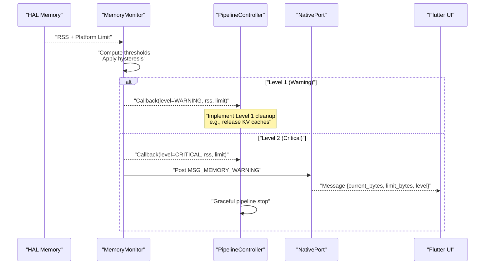
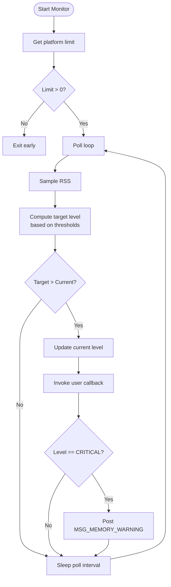
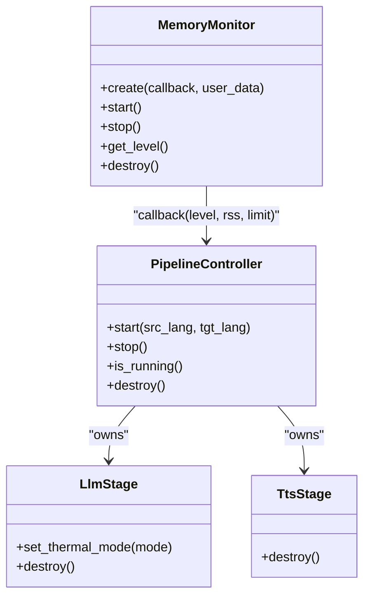
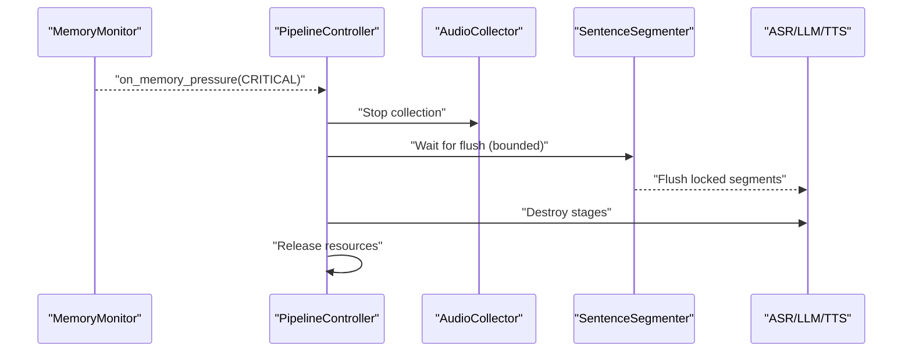
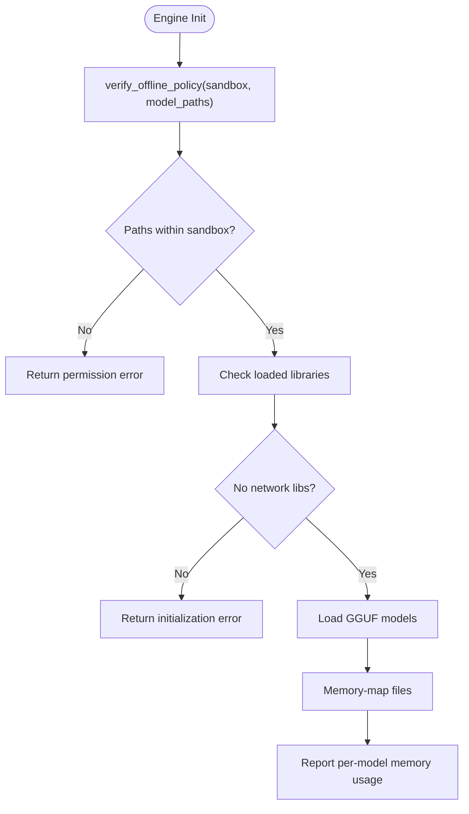
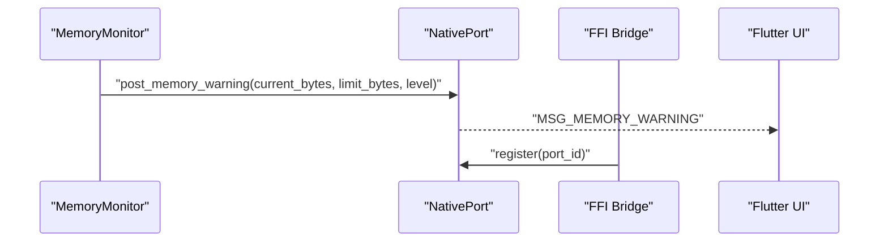
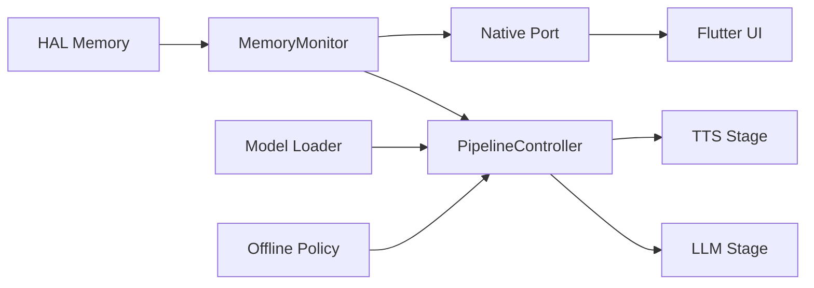

# Memory Management System

<cite>
**Referenced Files in This Document**
- [memory_monitor.h](file://native/include/memory_monitor.h)
- [memory_monitor.cpp](file://native/src/memory_monitor.cpp)
- [hal_memory.h](file://native/hal/hal_memory.h)
- [pipeline_controller.h](file://native/include/pipeline_controller.h)
- [pipeline_controller.cpp](file://native/src/pipeline_controller.cpp)
- [llm_stage.h](file://native/include/llm_stage.h)
- [tts_stage.h](file://native/include/tts_stage.h)
- [model_loader.h](file://native/include/model_loader.h)
- [offline_policy.h](file://native/include/offline_policy.h)
- [offline_policy.cpp](file://native/src/offline_policy.cpp)
- [native_port.h](file://native/include/native_port.h)
- [ffi_bridge.cpp](file://native/src/ffi_bridge.cpp)
</cite>

## Table of Contents
1. [Introduction](#introduction)
2. [Project Structure](#project-structure)
3. [Core Components](#core-components)
4. [Architecture Overview](#architecture-overview)
5. [Detailed Component Analysis](#detailed-component-analysis)
6. [Dependency Analysis](#dependency-analysis)
7. [Performance Considerations](#performance-considerations)
8. [Troubleshooting Guide](#troubleshooting-guide)
9. [Conclusion](#conclusion)
10. [Appendices](#appendices)

## Introduction
This document explains QwenEcho’s memory management system with a focus on progressive cleanup strategies and resource optimization. It details the two-level intervention system:
- Level 1 (KV cache release): moderate memory pressure handling via user callbacks
- Level 2 (pipeline stop): critical situations handled by graceful pipeline shutdown

It also covers the Memory Monitor’s RSS monitoring, automatic cleanup triggers, integration with the offline policy system, and how memory constraints affect model loading and processing stages. Finally, it provides guidance for configuring memory budgets, monitoring usage patterns, implementing custom cleanup strategies, and responding to memory pressure events through the callback system.

## Project Structure
The memory management system spans several modules:
- HAL layer for platform-specific memory metrics
- Memory Monitor for periodic sampling and level transitions
- Pipeline Controller for orchestrating components and reacting to critical memory pressure
- Stages (LLM/TTS) that own KV caches and output buffers
- Model Loader for GGUF validation and memory-mapped access
- Offline Policy enforcement ensuring no network dependencies during operation
- Native Port for messaging to the UI when critical conditions occur

```mermaid
graph TB
subgraph "HAL"
HAL["hal_memory.h"]
end
subgraph "Monitoring"
MMH["memory_monitor.h"]
MMS["memory_monitor.cpp"]
end
subgraph "Pipeline"
PCH["pipeline_controller.h"]
PCS["pipeline_controller.cpp"]
LLMH["llm_stage.h"]
TTSH["tts_stage.h"]
end
subgraph "Models"
MLH["model_loader.h"]
OP_H["offline_policy.h"]
OP_S["offline_policy.cpp"]
end
subgraph "Messaging"
NP_H["native_port.h"]
FFI["ffi_bridge.cpp"]
end
HAL --> MMS
MMH --> MMS
MMS --> NP_H
PCS --> MMH
PCS --> LLMH
PCS --> TTSH
FFI --> NP_H
MLH --> PCS
OP_H --> OP_S
```

**Diagram sources**
- [hal_memory.h:1-44](file://native/hal/hal_memory.h#L1-L44)
- [memory_monitor.h:1-107](file://native/include/memory_monitor.h#L1-L107)
- [memory_monitor.cpp:1-186](file://native/src/memory_monitor.cpp#L1-L186)
- [pipeline_controller.h:1-107](file://native/include/pipeline_controller.h#L1-L107)
- [pipeline_controller.cpp:1-488](file://native/src/pipeline_controller.cpp#L1-L488)
- [llm_stage.h:1-93](file://native/include/llm_stage.h#L1-L93)
- [tts_stage.h:1-79](file://native/include/tts_stage.h#L1-L79)
- [model_loader.h:1-142](file://native/include/model_loader.h#L1-L142)
- [offline_policy.h:1-121](file://native/include/offline_policy.h#L1-L121)
- [offline_policy.cpp:1-219](file://native/src/offline_policy.cpp#L1-L219)
- [native_port.h:1-179](file://native/include/native_port.h#L1-L179)
- [ffi_bridge.cpp:1-124](file://native/src/ffi_bridge.cpp#L1-L124)

**Section sources**
- [memory_monitor.h:1-107](file://native/include/memory_monitor.h#L1-L107)
- [memory_monitor.cpp:1-186](file://native/src/memory_monitor.cpp#L1-L186)
- [hal_memory.h:1-44](file://native/hal/hal_memory.h#L1-L44)
- [pipeline_controller.h:1-107](file://native/include/pipeline_controller.h#L1-L107)
- [pipeline_controller.cpp:1-488](file://native/src/pipeline_controller.cpp#L1-L488)
- [llm_stage.h:1-93](file://native/include/llm_stage.h#L1-L93)
- [tts_stage.h:1-79](file://native/include/tts_stage.h#L1-L79)
- [model_loader.h:1-142](file://native/include/model_loader.h#L1-L142)
- [offline_policy.h:1-121](file://native/include/offline_policy.h#L1-L121)
- [offline_policy.cpp:1-219](file://native/src/offline_policy.cpp#L1-L219)
- [native_port.h:1-179](file://native/include/native_port.h#L1-L179)
- [ffi_bridge.cpp:1-124](file://native/src/ffi_bridge.cpp#L1-L124)

## Core Components
- Memory Monitor
  - Periodically samples process RSS via HAL and computes thresholds based on platform limits.
  - Implements upward-only hysteresis to avoid flapping between levels.
  - Invokes user-provided callbacks on level transitions and posts UI warnings at critical levels.
- HAL Memory Interface
  - Provides RSS and platform limit values across Android and iOS.
- Pipeline Controller
  - Creates and manages all pipeline components including the Memory Monitor.
  - Reacts to critical memory pressure by initiating a graceful stop sequence.
- LLM Stage and TTS Stage
  - Own KV caches and output buffers; suitable targets for Level 1 cleanup actions.
- Model Loader
  - Validates GGUF models and uses memory mapping to leverage OS page cache.
  - Reports per-model memory usage to inform budgeting decisions.
- Offline Policy
  - Ensures zero network dependencies at runtime and validates model paths within sandbox.
- Native Port
  - Posts structured messages to the Flutter UI, including memory warnings.

**Section sources**
- [memory_monitor.h:1-107](file://native/include/memory_monitor.h#L1-L107)
- [memory_monitor.cpp:1-186](file://native/src/memory_monitor.cpp#L1-L186)
- [hal_memory.h:1-44](file://native/hal/hal_memory.h#L1-L44)
- [pipeline_controller.h:1-107](file://native/include/pipeline_controller.h#L1-L107)
- [pipeline_controller.cpp:1-488](file://native/src/pipeline_controller.cpp#L1-L488)
- [llm_stage.h:1-93](file://native/include/llm_stage.h#L1-L93)
- [tts_stage.h:1-79](file://native/include/tts_stage.h#L1-L79)
- [model_loader.h:1-142](file://native/include/model_loader.h#L1-L142)
- [offline_policy.h:1-121](file://native/include/offline_policy.h#L1-L121)
- [offline_policy.cpp:1-219](file://native/src/offline_policy.cpp#L1-L219)
- [native_port.h:1-179](file://native/include/native_port.h#L1-L179)

## Architecture Overview
The memory management architecture integrates monitoring, mitigation, and messaging:



**Diagram sources**
- [memory_monitor.cpp:59-116](file://native/src/memory_monitor.cpp#L59-L116)
- [pipeline_controller.cpp:166-177](file://native/src/pipeline_controller.cpp#L166-L177)
- [native_port.h:154-159](file://native/include/native_port.h#L154-L159)

## Detailed Component Analysis

### Memory Monitor
- Responsibilities
  - Poll RSS every fixed interval using HAL.
  - Compute warning and critical thresholds from platform limit.
  - Maintain current level with upward-only hysteresis.
  - Invoke user callback on transitions and post UI warning at critical level.
- Key behaviors
  - Thresholds are computed once per run based on platform limit.
  - Hysteresis prevents repeated firing of the same level and avoids downgrades.
  - Critical level triggers both callback and native port message.



**Diagram sources**
- [memory_monitor.cpp:59-116](file://native/src/memory_monitor.cpp#L59-L116)

**Section sources**
- [memory_monitor.h:1-107](file://native/include/memory_monitor.h#L1-L107)
- [memory_monitor.cpp:1-186](file://native/src/memory_monitor.cpp#L1-L186)
- [hal_memory.h:1-44](file://native/hal/hal_memory.h#L1-L44)

### Two-Level Intervention System
- Level 1 (Warning at ~85%)
  - Action: Release LLM KV caches and TTS output buffers.
  - Mechanism: User callback invoked with MEM_LEVEL_WARNING; implementers should free non-essential caches/buffers.
- Level 2 (Critical at ~95%)
  - Action: Graceful pipeline stop and UI notification.
  - Mechanism: User callback invoked with MEM_LEVEL_CRITICAL; pipeline controller initiates stop; native port posts memory warning.



**Diagram sources**
- [memory_monitor.h:1-107](file://native/include/memory_monitor.h#L1-L107)
- [pipeline_controller.h:1-107](file://native/include/pipeline_controller.h#L1-L107)
- [llm_stage.h:1-93](file://native/include/llm_stage.h#L1-L93)
- [tts_stage.h:1-79](file://native/include/tts_stage.h#L1-L79)

**Section sources**
- [memory_monitor.h:25-42](file://native/include/memory_monitor.h#L25-L42)
- [memory_monitor.cpp:79-106](file://native/src/memory_monitor.cpp#L79-L106)
- [pipeline_controller.cpp:166-177](file://native/src/pipeline_controller.cpp#L166-L177)

### Pipeline Controller Integration
- Creation and startup
  - Pipeline controller creates and starts the Memory Monitor with an on-memory-pressure callback.
- Critical response
  - On MEM_LEVEL_CRITICAL, the controller performs a graceful stop sequence:
    - Stop audio collection
    - Flush locked segments through ASR→LLM→TTS
    - Destroy stages and threads
    - Discard unlocked audio
    - Complete within a bounded deadline



**Diagram sources**
- [pipeline_controller.cpp:166-177](file://native/src/pipeline_controller.cpp#L166-L177)
- [pipeline_controller.cpp:395-469](file://native/src/pipeline_controller.cpp#L395-L469)

**Section sources**
- [pipeline_controller.h:1-107](file://native/include/pipeline_controller.h#L1-L107)
- [pipeline_controller.cpp:1-488](file://native/src/pipeline_controller.cpp#L1-L488)

### Model Loader and Offline Policy Integration
- Model Loader
  - Validates GGUF headers and quantization types.
  - Uses memory mapping to leverage OS page cache.
  - Reports per-model memory usage to inform memory budgeting.
- Offline Policy
  - Verifies model paths reside within application sandbox.
  - Checks for absence of network libraries/symbols at runtime.
  - Enforces compile-time poisoning of networking symbols when policy is enabled.



**Diagram sources**
- [offline_policy.cpp:155-218](file://native/src/offline_policy.cpp#L155-L218)
- [model_loader.h:85-128](file://native/include/model_loader.h#L85-L128)

**Section sources**
- [model_loader.h:1-142](file://native/include/model_loader.h#L1-L142)
- [offline_policy.h:1-121](file://native/include/offline_policy.h#L1-L121)
- [offline_policy.cpp:1-219](file://native/src/offline_policy.cpp#L1-L219)

### Messaging and UI Integration
- Native Port
  - Posts typed messages including memory warnings with current bytes, limit bytes, and level.
- FFI Bridge
  - Registers Dart port and forwards lifecycle calls to Engine Manager.



**Diagram sources**
- [native_port.h:154-159](file://native/include/native_port.h#L154-L159)
- [ffi_bridge.cpp:108-121](file://native/src/ffi_bridge.cpp#L108-L121)

**Section sources**
- [native_port.h:1-179](file://native/include/native_port.h#L1-179)
- [ffi_bridge.cpp:1-124](file://native/src/ffi_bridge.cpp#L1-124)

## Dependency Analysis
Key dependencies and relationships:
- Memory Monitor depends on HAL for RSS and platform limit.
- Pipeline Controller owns and coordinates stages and monitors.
- LLM and TTS stages manage KV caches and output buffers targeted by Level 1 cleanup.
- Model Loader interacts with filesystem and memory mapping; reports usage.
- Offline Policy enforces sandboxed model paths and absence of network dependencies.
- Native Port bridges engine state to Flutter UI.



**Diagram sources**
- [hal_memory.h:1-44](file://native/hal/hal_memory.h#L1-L44)
- [memory_monitor.cpp:1-186](file://native/src/memory_monitor.cpp#L1-L186)
- [pipeline_controller.cpp:1-488](file://native/src/pipeline_controller.cpp#L1-L488)
- [llm_stage.h:1-93](file://native/include/llm_stage.h#L1-L93)
- [tts_stage.h:1-79](file://native/include/tts_stage.h#L1-L79)
- [model_loader.h:1-142](file://native/include/model_loader.h#L1-L142)
- [offline_policy.h:1-121](file://native/include/offline_policy.h#L1-L121)
- [native_port.h:1-179](file://native/include/native_port.h#L1-L179)

**Section sources**
- [memory_monitor.cpp:1-186](file://native/src/memory_monitor.cpp#L1-L186)
- [pipeline_controller.cpp:1-488](file://native/src/pipeline_controller.cpp#L1-L488)
- [llm_stage.h:1-93](file://native/include/llm_stage.h#L1-L93)
- [tts_stage.h:1-79](file://native/include/tts_stage.h#L1-L79)
- [model_loader.h:1-142](file://native/include/model_loader.h#L1-L142)
- [offline_policy.h:1-121](file://native/include/offline_policy.h#L1-L121)
- [native_port.h:1-179](file://native/include/native_port.h#L1-L179)

## Performance Considerations
- Monitoring overhead
  - The monitor thread runs at normal priority and polls every fixed interval, minimizing CPU impact.
- Hysteresis benefits
  - Upward-only transitions reduce callback churn and stabilize mitigation behavior.
- Graceful stop bounds
  - Pipeline stop includes a bounded flush window to ensure timely shutdown without blocking indefinitely.
- Memory mapping
  - Using mmap leverages OS page cache, reducing redundant copies and improving load performance.
- Throttling modes
  - Thermal throttling reduces context windows and processing intensity, indirectly aiding memory stability under pressure.

[No sources needed since this section provides general guidance]

## Troubleshooting Guide
Common issues and resolutions:
- Memory pressure not triggering
  - Ensure the monitor is started and a valid platform limit is returned by HAL.
  - Verify callback registration and that the pipeline is running when critical events occur.
- Pipeline does not stop on critical memory pressure
  - Confirm the on-memory-pressure callback checks MEM_LEVEL_CRITICAL and invokes pipeline stop.
  - Validate that the running flag prevents recursive stops and that destroy routines are called.
- UI not receiving memory warnings
  - Ensure a Dart port is registered before starting the pipeline and that native port posting succeeds.
- Model loading failures due to offline policy
  - Verify model paths are within the application sandbox and no network libraries are linked or dynamically loaded.

**Section sources**
- [memory_monitor.cpp:59-116](file://native/src/memory_monitor.cpp#L59-L116)
- [pipeline_controller.cpp:166-177](file://native/src/pipeline_controller.cpp#L166-L177)
- [native_port.h:154-159](file://native/include/native_port.h#L154-L159)
- [offline_policy.cpp:155-218](file://native/src/offline_policy.cpp#L155-L218)

## Conclusion
QwenEcho’s memory management system employs a robust two-level intervention strategy backed by continuous RSS monitoring and clear escalation paths. Level 1 enables targeted cache and buffer releases via callbacks, while Level 2 ensures safe shutdown through graceful pipeline termination and UI notifications. Integration with the offline policy system guarantees secure, sandboxed model operations without network dependencies. By leveraging memory mapping and bounded stop sequences, the system balances responsiveness with stability under memory pressure.

[No sources needed since this section summarizes without analyzing specific files]

## Appendices

### Configuring Memory Budgets
- Platform limits
  - Use HAL functions to obtain platform-specific memory budgets.
- Thresholds
  - Warning threshold at approximately 85% of limit; critical threshold at approximately 95%.
- Customizing behavior
  - Implement Level 1 cleanup in the memory action callback to release KV caches and TTS buffers.
  - For Level 2, rely on pipeline controller’s graceful stop or extend with additional teardown steps.

**Section sources**
- [hal_memory.h:26-37](file://native/hal/hal_memory.h#L26-L37)
- [memory_monitor.h:25-42](file://native/include/memory_monitor.h#L25-L42)
- [memory_monitor.cpp:68-85](file://native/src/memory_monitor.cpp#L68-L85)

### Monitoring Memory Usage Patterns
- Query current level
  - Use the monitor’s get-level API to observe pressure state from any thread.
- Observe RSS trends
  - Track RSS reported in callbacks and UI messages to identify spikes and sustained growth.
- Correlate with stage activity
  - Align memory changes with ASR→LLM→TTS segment processing to pinpoint high-consumption phases.

**Section sources**
- [memory_monitor.h:84-91](file://native/include/memory_monitor.h#L84-L91)
- [native_port.h:154-159](file://native/include/native_port.h#L154-L159)

### Implementing Custom Cleanup Strategies
- Level 1 implementation
  - In the memory action callback, detect MEM_LEVEL_WARNING and trigger cache eviction in LLM/TTS stages.
- Level 2 extension
  - While the pipeline controller handles graceful stop, you can add pre-stop hooks to persist state or notify higher layers.

**Section sources**
- [pipeline_controller.cpp:166-177](file://native/src/pipeline_controller.cpp#L166-L177)
- [llm_stage.h:68-76](file://native/include/llm_stage.h#L68-L76)
- [tts_stage.h:64-72](file://native/include/tts_stage.h#L64-L72)

### Responding to Memory Pressure Events via Callback System
- Register callback
  - Provide a function matching the memory action callback signature when creating the monitor.
- Handle transitions
  - Act only on upward transitions due to hysteresis; avoid redundant work.
- Notify UI
  - Rely on native port messages for critical events; optionally log additional diagnostics.

**Section sources**
- [memory_monitor.h:39-42](file://native/include/memory_monitor.h#L39-L42)
- [memory_monitor.cpp:94-106](file://native/src/memory_monitor.cpp#L94-L106)
- [native_port.h:154-159](file://native/include/native_port.h#L154-L159)