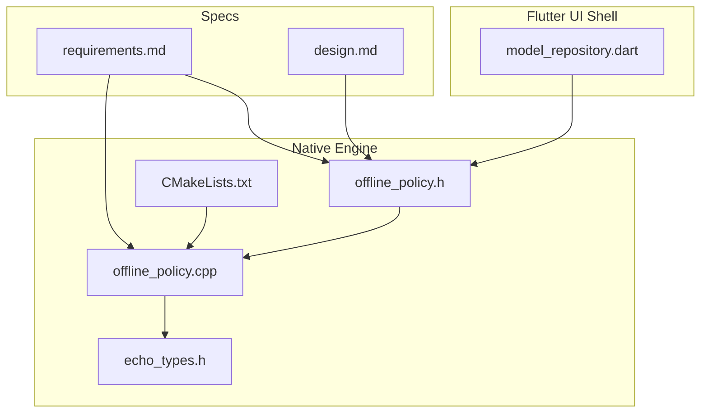
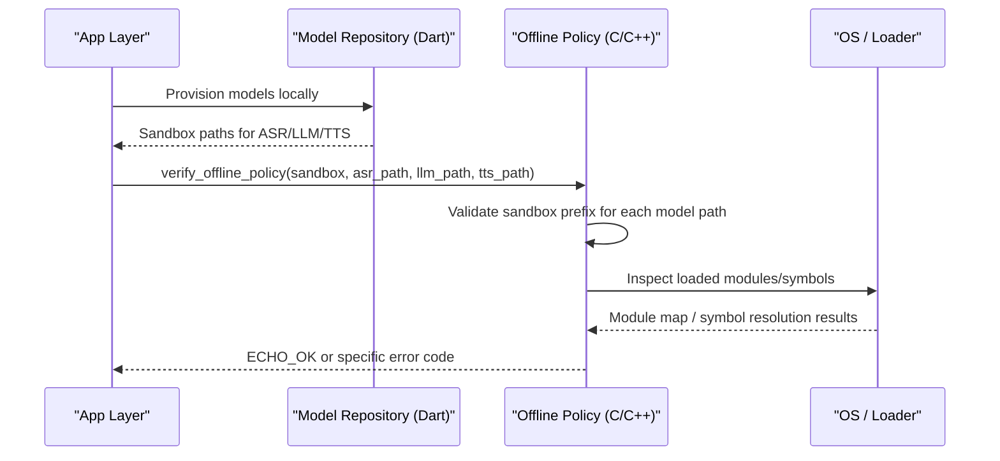
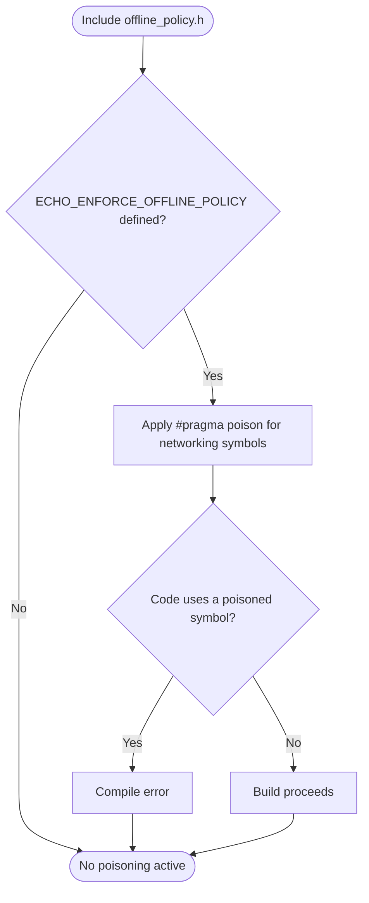
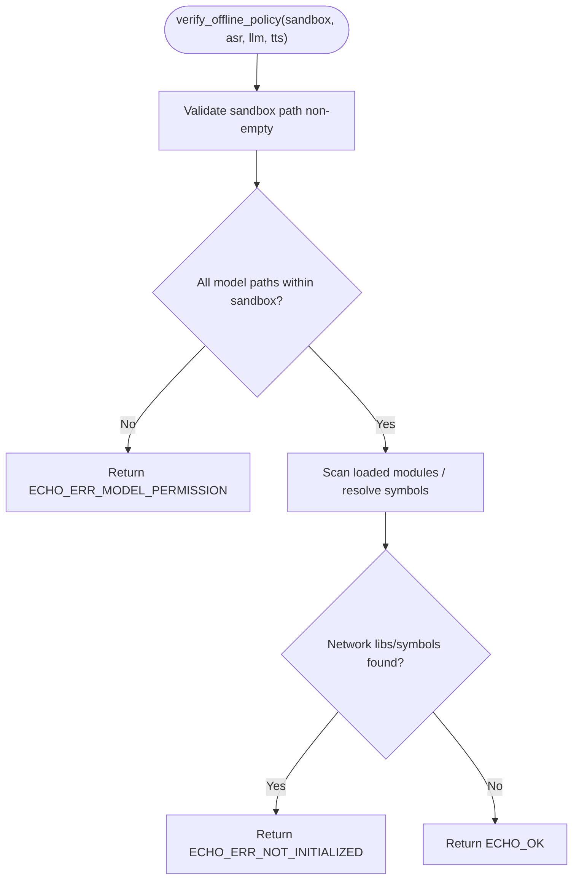
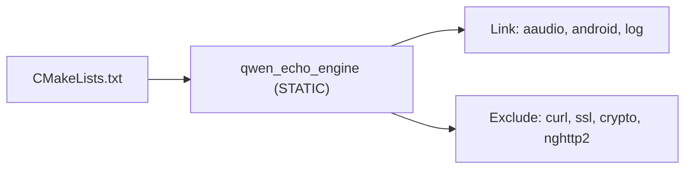
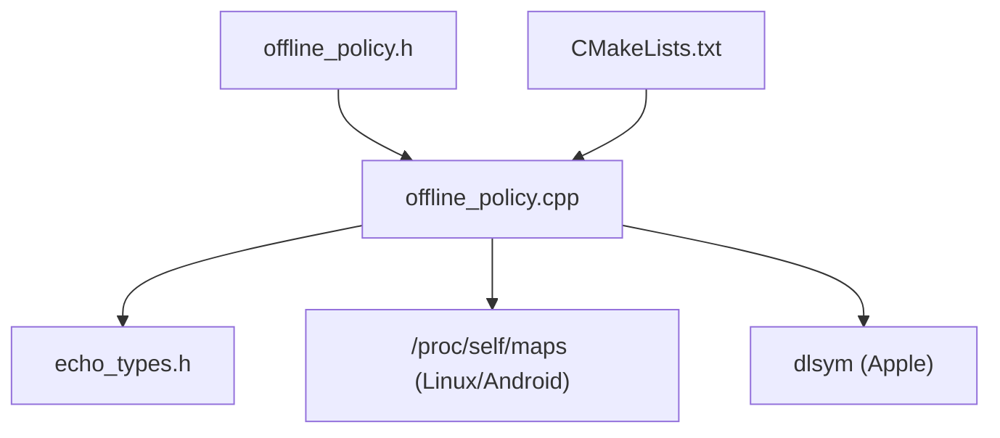

# Offline Policy System

<cite>
**Referenced Files in This Document**
- [offline_policy.h](file://native/include/offline_policy.h)
- [offline_policy.cpp](file://native/src/offline_policy.cpp)
- [echo_types.h](file://native/include/echo_types.h)
- [CMakeLists.txt](file://native/CMakeLists.txt)
- [requirements.md](file://.kiro/specs/qwen-echo/requirements.md)
- [design.md](file://.kiro/specs/qwen-echo/design.md)
- [model_repository.dart](file://lib/src/model/model_repository.dart)
</cite>

## Table of Contents
1. [Introduction](#introduction)
2. [Project Structure](#project-structure)
3. [Core Components](#core-components)
4. [Architecture Overview](#architecture-overview)
5. [Detailed Component Analysis](#detailed-component-analysis)
6. [Dependency Analysis](#dependency-analysis)
7. [Performance Considerations](#performance-considerations)
8. [Troubleshooting Guide](#troubleshooting-guide)
9. [Conclusion](#conclusion)
10. [Appendices](#appendices)

## Introduction
This document explains QwenEcho’s offline policy system that enforces a strict air-gapped operation by combining compile-time symbol poisoning with runtime verification to prevent any network access. The goal is zero-knowledge operation: after models are provisioned locally, the engine must never initiate or depend on network operations, telemetry, analytics, crash reporting, or update checks.

The policy spans multiple layers:
- Build-time constraints (no network libraries linked)
- Compile-time symbol poisoning (hard errors if networking symbols are used)
- Runtime verification (process inspection and sandbox path validation)
- Platform configuration requirements (manifest/plist and entitlements)

These mechanisms collectively ensure that the engine launches and operates without network interfaces present.

## Project Structure
The offline policy system is implemented in the native C/C++ layer and integrated into the build pipeline. Key locations:
- Policy header and implementation: native/include/offline_policy.h, native/src/offline_policy.cpp
- Error codes and types: native/include/echo_types.h
- Build configuration: native/CMakeLists.txt
- Requirements and design context: .kiro/specs/qwen-echo/requirements.md, .kiro/specs/qwen-echo/design.md
- Local model provisioning (Dart): lib/src/model/model_repository.dart

**Diagram sources**
- [offline_policy.h:1-120](file://native/include/offline_policy.h#L1-L120)
- [offline_policy.cpp:1-219](file://native/src/offline_policy.cpp#L1-L219)
- [echo_types.h:44-62](file://native/include/echo_types.h#L44-L62)
- [CMakeLists.txt:1-126](file://native/CMakeLists.txt#L1-L126)
- [model_repository.dart:1-48](file://lib/src/model/model_repository.dart#L1-L48)
- [requirements.md:195-210](file://.kiro/specs/qwen-echo/requirements.md#L195-L210)
- [design.md:1-14](file://.kiro/specs/qwen-echo/design.md#L1-L14)

**Section sources**
- [offline_policy.h:1-120](file://native/include/offline_policy.h#L1-L120)
- [offline_policy.cpp:1-219](file://native/src/offline_policy.cpp#L1-L219)
- [echo_types.h:44-62](file://native/include/echo_types.h#L44-L62)
- [CMakeLists.txt:1-126](file://native/CMakeLists.txt#L1-L126)
- [requirements.md:195-210](file://.kiro/specs/qwen-echo/requirements.md#L195-L210)
- [design.md:1-14](file://.kiro/specs/qwen-echo/design.md#L1-L14)
- [model_repository.dart:1-48](file://lib/src/model/model_repository.dart#L1-L48)

## Core Components
- Compile-time symbol poisoning: A guarded header activates compiler-specific poison pragmas for known networking symbols when the offline policy is enforced. This prevents accidental inclusion or usage of networking APIs at compile time.
- Runtime verification function: A public API validates that model paths reside within the application sandbox and inspects the process to detect loaded network-related libraries or symbols. It returns standardized error codes from echo_types.h.
- Build-time linkage constraints: The CMake configuration links only against minimal platform libraries and excludes network stacks, reinforcing the policy at link time.
- Dart-side local provisioning: The Flutter layer provides an air-gapped model repository that copies GGUF files into the app sandbox and reports status without any network I/O.

Key responsibilities:
- Prevent compilation of code using networking APIs
- Detect presence of network dependencies at runtime
- Enforce sandbox-only model storage
- Provide clear error signaling via EchoErrorCode values

**Section sources**
- [offline_policy.h:40-84](file://native/include/offline_policy.h#L40-L84)
- [offline_policy.cpp:155-218](file://native/src/offline_policy.cpp#L155-L218)
- [echo_types.h:44-62](file://native/include/echo_types.h#L44-L62)
- [CMakeLists.txt:52-68](file://native/CMakeLists.txt#L52-L68)
- [model_repository.dart:1-48](file://lib/src/model/model_repository.dart#L1-L48)

## Architecture Overview
The offline policy architecture integrates three enforcement points:
- Build-time: Linker does not include network libraries
- Compile-time: Poisoned identifiers cause hard errors if referenced
- Runtime: Process inspection and sandbox path checks confirm isolation

**Diagram sources**
- [offline_policy.cpp:155-218](file://native/src/offline_policy.cpp#L155-L218)
- [offline_policy.h:90-114](file://native/include/offline_policy.h#L90-L114)
- [model_repository.dart:1-48](file://lib/src/model/model_repository.dart#L1-L48)

## Detailed Component Analysis

### Compile-Time Symbol Poisoning
- Activation: When the offline policy flag is defined, the header enables compiler-specific poison directives for BSD socket functions and common HTTP client symbols.
- Effect: Any subsequent use of poisoned identifiers triggers a hard compile error, preventing accidental integration of networking code.
- Portability: Uses GCC/Clang poison pragmas and MSVC deprecated pragma fallback.

**Diagram sources**
- [offline_policy.h:53-84](file://native/include/offline_policy.h#L53-L84)

**Section sources**
- [offline_policy.h:40-84](file://native/include/offline_policy.h#L40-L84)

### Runtime Verification Function
- Purpose: Confirm offline compliance at engine initialization.
- Checks performed:
  - Sandbox path validation: Ensures all model paths start with the provided sandbox prefix.
  - Network library detection: Scans loaded modules or resolves symbols to detect network dependencies.
  - Telemetry absence: Relies on compile-time poisoning and absence of network libraries; no explicit telemetry entry points exist in the engine.
- Return values: Uses EchoErrorCode constants for success or failure modes.

**Diagram sources**
- [offline_policy.cpp:155-218](file://native/src/offline_policy.cpp#L155-L218)
- [echo_types.h:44-62](file://native/include/echo_types.h#L44-L62)

**Section sources**
- [offline_policy.cpp:44-49](file://native/src/offline_policy.cpp#L44-L49)
- [offline_policy.cpp:70-102](file://native/src/offline_policy.cpp#L70-L102)
- [offline_policy.cpp:118-139](file://native/src/offline_policy.cpp#L118-L139)
- [offline_policy.cpp:155-218](file://native/src/offline_policy.cpp#L155-L218)
- [echo_types.h:44-62](file://native/include/echo_types.h#L44-L62)

### Build-Time Constraints
- Linkage: The native library links only against essential platform libraries and explicitly avoids network stacks.
- Android specifics: Links aaudio, android, log; applies page-size alignment options where required.
- iOS/macOS specifics: No network frameworks are linked; entitlements should not grant network client capabilities.

**Diagram sources**
- [CMakeLists.txt:45-68](file://native/CMakeLists.txt#L45-L68)

**Section sources**
- [CMakeLists.txt:45-68](file://native/CMakeLists.txt#L45-L68)

### Dart-Side Air-Gapped Model Provisioning
- Responsibility: Resolve sandbox directory, copy GGUF files into private storage, validate magic bytes, report per-model readiness.
- Constraint: Zero network I/O; strictly local file operations.

**Section sources**
- [model_repository.dart:1-48](file://lib/src/model/model_repository.dart#L1-L48)

## Dependency Analysis
The offline policy depends on:
- echo_types.h for error codes
- Platform loader introspection APIs (e.g., /proc/self/maps on Linux/Android, dlsym on Apple platforms)
- Build configuration that restricts linking to non-network libraries

**Diagram sources**
- [offline_policy.h:90-114](file://native/include/offline_policy.h#L90-L114)
- [offline_policy.cpp:70-102](file://native/src/offline_policy.cpp#L70-L102)
- [offline_policy.cpp:118-139](file://native/src/offline_policy.cpp#L118-L139)
- [echo_types.h:44-62](file://native/include/echo_types.h#L44-L62)
- [CMakeLists.txt:45-68](file://native/CMakeLists.txt#L45-L68)

**Section sources**
- [offline_policy.cpp:70-102](file://native/src/offline_policy.cpp#L70-L102)
- [offline_policy.cpp:118-139](file://native/src/offline_policy.cpp#L118-L139)
- [echo_types.h:44-62](file://native/include/echo_types.h#L44-L62)
- [CMakeLists.txt:45-68](file://native/CMakeLists.txt#L45-L68)

## Performance Considerations
- Compile-time poisoning adds negligible overhead; it prevents unwanted code paths early.
- Runtime verification runs once at engine init:
  - Path prefix checks are O(n) over model paths with short string comparisons.
  - Module scanning reads a small text file (/proc/self/maps) or performs a few symbol lookups; cost is minimal compared to model loading.
- Overall impact is acceptable given the security benefit and infrequent execution.

[No sources needed since this section provides general guidance]

## Troubleshooting Guide
Common issues and resolutions:
- Compilation fails due to poisoned symbols:
  - Cause: Accidental use of networking APIs after including the policy header with enforcement enabled.
  - Resolution: Remove or refactor calls to forbidden symbols; ensure networking code is excluded from the engine build.
- Runtime returns permission error:
  - Cause: One or more model paths do not start with the sandbox prefix.
  - Resolution: Ensure models are copied into the app sandbox and pass correct sandbox path to the verification function.
- Runtime returns initialization error:
  - Cause: Network-related libraries or symbols detected in the process image.
  - Resolution: Audit dependencies and remove network libraries; verify linker settings exclude them.
- Android manifest includes network permissions:
  - Cause: Manifest declares INTERNET or ACCESS_NETWORK_STATE permissions.
  - Resolution: Remove these permissions to enforce OS-level blocking of network sockets.
- iOS Info.plist or entitlements allow network:
  - Cause: NSAppTransportSecurity exceptions or network client entitlements present.
  - Resolution: Remove exceptions and avoid granting network client capabilities.

**Section sources**
- [offline_policy.h:14-28](file://native/include/offline_policy.h#L14-L28)
- [offline_policy.cpp:155-218](file://native/src/offline_policy.cpp#L155-L218)
- [echo_types.h:44-62](file://native/include/echo_types.h#L44-L62)

## Conclusion
QwenEcho’s offline policy system combines compile-time symbol poisoning, build-time linkage restrictions, and runtime verification to guarantee air-gapped operation. By enforcing strict sandbox-only model storage and detecting network dependencies early, the system ensures zero-knowledge behavior and robust isolation across platforms.

[No sources needed since this section summarizes without analyzing specific files]

## Appendices

### Security Requirements Alignment
- Offline operation and zero network requests after provisioning
- Sandbox-only model storage
- Absence of telemetry/analytics/crash-reporting/update-check functionality
- Operation without network interfaces present

**Section sources**
- [requirements.md:195-210](file://.kiro/specs/qwen-echo/requirements.md#L195-L210)
- [design.md:1-14](file://.kiro/specs/qwen-echo/design.md#L1-L14)

### Verifying Offline Compliance
- Build with offline policy enforcement enabled to trigger compile-time failures if networking symbols are used.
- Call the runtime verification function during engine initialization and assert success before proceeding.
- Inspect the final binary/linker output to confirm no network libraries are linked.
- On Android, verify the manifest lacks network permissions; on iOS, ensure no ATS exceptions or network entitlements.

**Section sources**
- [offline_policy.h:90-114](file://native/include/offline_policy.h#L90-L114)
- [offline_policy.cpp:155-218](file://native/src/offline_policy.cpp#L155-L218)
- [CMakeLists.txt:45-68](file://native/CMakeLists.txt#L45-L68)

### Testing Network Isolation
- Unit tests can mock sandbox paths and invoke the verification function to assert expected error codes for invalid inputs.
- Property-based tests can generate random paths and verify rejection when outside the sandbox.
- Integration tests can attempt to load a test binary that references a poisoned symbol and assert build failure.

**Section sources**
- [echo_types.h:44-62](file://native/include/echo_types.h#L44-L62)
- [offline_policy.cpp:155-218](file://native/src/offline_policy.cpp#L155-L218)

### Extending the Policy System
- Add new platform-specific checks by extending the module inspection logic for additional OSes.
- Expand the list of poisoned symbols to cover emerging networking APIs.
- Integrate static analysis rules to detect forbidden imports or dynamic loading patterns.
- Enhance Dart-side provisioning to produce audit logs of model placement and checksums.

**Section sources**
- [offline_policy.h:53-84](file://native/include/offline_policy.h#L53-L84)
- [offline_policy.cpp:70-102](file://native/src/offline_policy.cpp#L70-L102)
- [offline_policy.cpp:118-139](file://native/src/offline_policy.cpp#L118-L139)
- [model_repository.dart:1-48](file://lib/src/model/model_repository.dart#L1-L48)