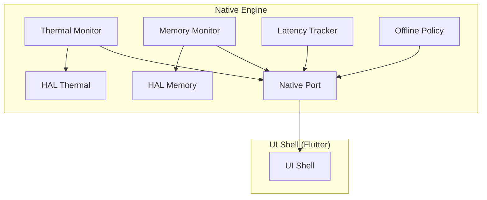
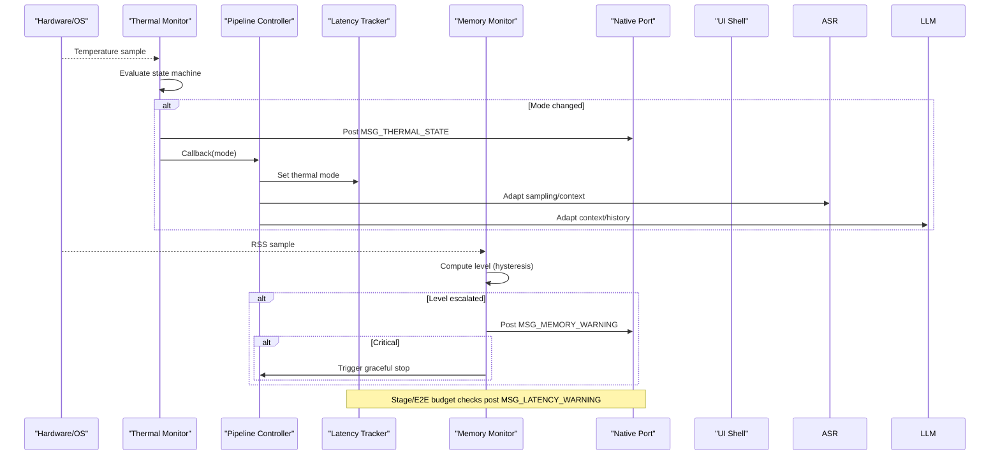
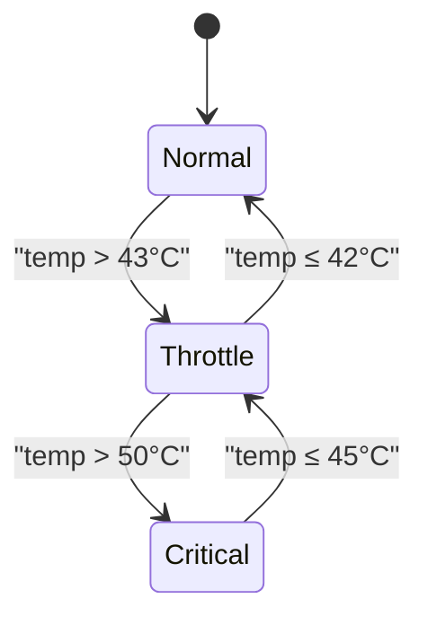
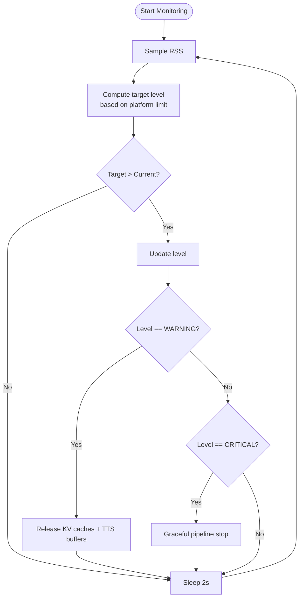
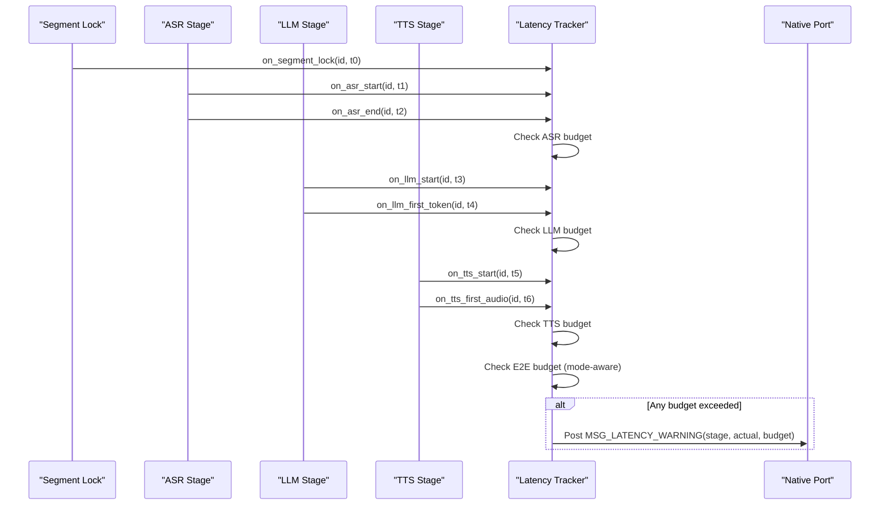
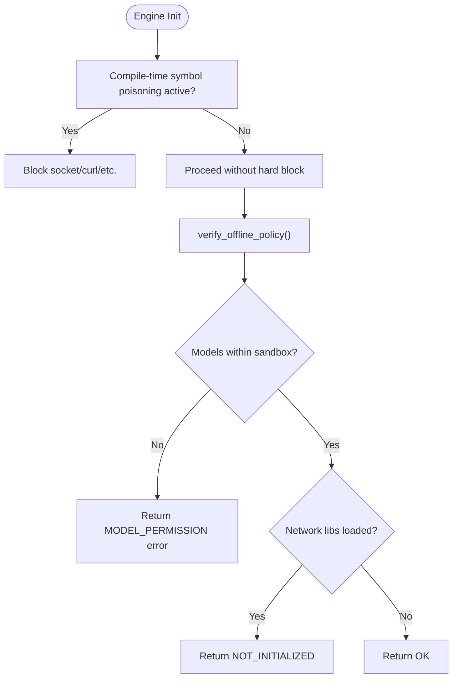
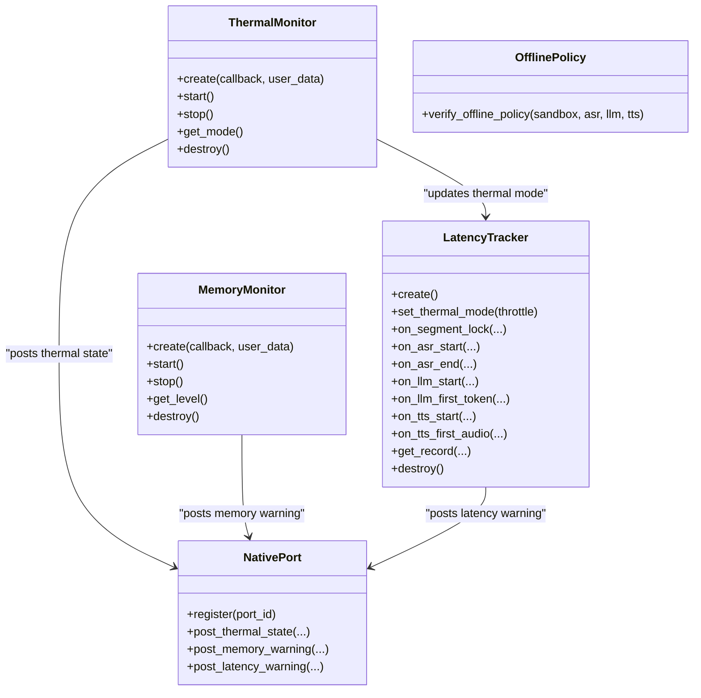
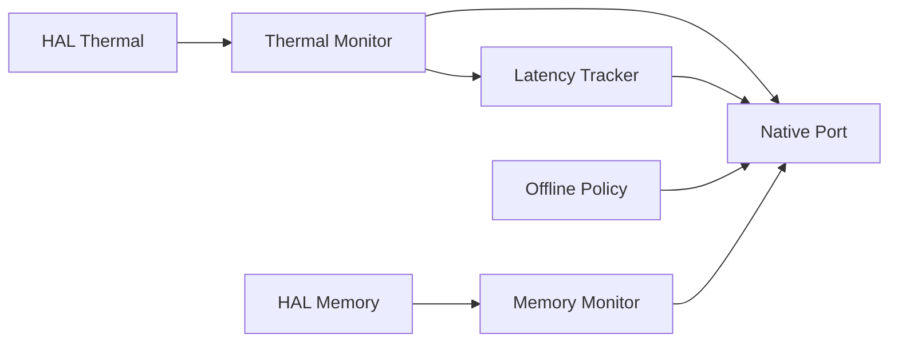

# Performance Management Systems

<cite>
**Referenced Files in This Document**
- [thermal_monitor.h](file://native/include/thermal_monitor.h)
- [thermal_monitor.cpp](file://native/src/thermal_monitor.cpp)
- [hal_thermal.h](file://native/hal/hal_thermal.h)
- [memory_monitor.h](file://native/include/memory_monitor.h)
- [memory_monitor.cpp](file://native/src/memory_monitor.cpp)
- [hal_memory.h](file://native/hal/hal_memory.h)
- [latency_tracker.h](file://native/include/latency_tracker.h)
- [latency_tracker.cpp](file://native/src/latency_tracker.cpp)
- [offline_policy.h](file://native/include/offline_policy.h)
- [offline_policy.cpp](file://native/src/offline_policy.cpp)
- [native_port.h](file://native/include/native_port.h)
- [native_port.cpp](file://native/src/native_port.cpp)
- [echo_types.h](file://native/include/echo_types.h)
- [pipeline_controller.cpp](file://native/src/pipeline_controller.cpp)
</cite>

## Table of Contents
1. [Introduction](#introduction)
2. [Project Structure](#project-structure)
3. [Core Components](#core-components)
4. [Architecture Overview](#architecture-overview)
5. [Detailed Component Analysis](#detailed-component-analysis)
6. [Dependency Analysis](#dependency-analysis)
7. [Performance Considerations](#performance-considerations)
8. [Troubleshooting Guide](#troubleshooting-guide)
9. [Conclusion](#conclusion)
10. [Appendices](#appendices)

## Introduction
This document explains QwenEcho’s performance management systems with a focus on adaptive throttling and resource optimization. It covers:
- The three-mode thermal state machine (Normal, Throttle, Critical) with hysteresis thresholds and behavior changes.
- The Memory Monitor’s progressive cleanup strategies (Level 1: KV cache release; Level 2: pipeline stop).
- The Latency Tracker’s end-to-end performance monitoring and SLA violation reporting.
- The Offline Policy system’s compile-time symbol poisoning and runtime verification to prevent network access.
- Practical guidance for configuring performance budgets, monitoring system health, and implementing custom throttling policies.

## Project Structure
The performance subsystem is implemented in native C/C++ components that interact via a Native Port messaging layer to the Flutter UI Shell. Key modules:
- Thermal Monitor: polls device temperature and drives adaptive throttling.
- Memory Monitor: samples RSS and triggers progressive mitigation.
- Latency Tracker: measures per-stage and E2E latency against budgets.
- Offline Policy: enforces air-gapped operation at build and run time.
- Native Port: typed message dispatch from native to Dart.

**Diagram sources**
- [thermal_monitor.cpp:99-128](file://native/src/thermal_monitor.cpp#L99-L128)
- [memory_monitor.cpp:59-116](file://native/src/memory_monitor.cpp#L59-L116)
- [latency_tracker.cpp:122-128](file://native/src/latency_tracker.cpp#L122-L128)
- [native_port.cpp:247-300](file://native/src/native_port.cpp#L247-L300)
- [hal_thermal.h:34-46](file://native/hal/hal_thermal.h#L34-L46)
- [hal_memory.h:26-37](file://native/hal/hal_memory.h#L26-L37)

**Section sources**
- [thermal_monitor.h:1-109](file://native/include/thermal_monitor.h#L1-L109)
- [memory_monitor.h:1-108](file://native/include/memory_monitor.h#L1-L108)
- [latency_tracker.h:1-224](file://native/include/latency_tracker.h#L1-L224)
- [offline_policy.h:1-121](file://native/include/offline_policy.h#L1-L121)
- [native_port.h:1-179](file://native/include/native_port.h#L1-L179)

## Core Components
- Thermal Monitor: A low-priority polling thread reads platform temperature and transitions between Normal, Throttle, and Critical modes using hysteresis. On each transition, it posts a thermal state message and invokes an engine callback to adapt stages.
- Memory Monitor: A background thread samples process RSS every 2 seconds and applies upward-only hysteresis to escalate pressure levels. Level 1 warns and releases caches; Level 2 stops the pipeline and notifies the UI.
- Latency Tracker: Maintains per-segment timestamps across ASR, LLM, and TTS boundaries, checks stage-level and E2E budgets based on current thermal mode, and posts SLA warnings when exceeded.
- Offline Policy: Uses compile-time symbol poisoning to block networking APIs and performs runtime checks to ensure models are within the sandbox and no network libraries are loaded.

**Section sources**
- [thermal_monitor.cpp:28-92](file://native/src/thermal_monitor.cpp#L28-L92)
- [memory_monitor.cpp:29-116](file://native/src/memory_monitor.cpp#L29-L116)
- [latency_tracker.h:34-49](file://native/include/latency_tracker.h#L34-L49)
- [latency_tracker.cpp:122-128](file://native/src/latency_tracker.cpp#L122-L128)
- [offline_policy.h:53-84](file://native/include/offline_policy.h#L53-84)
- [offline_policy.cpp:155-218](file://native/src/offline_policy.cpp#L155-L218)

## Architecture Overview
The performance management system integrates hardware signals (temperature, memory) with policy enforcement and observability:
- Thermal Monitor adapts pipeline behavior by notifying the engine and UI.
- Memory Monitor escalates pressure responses and can halt the pipeline under critical conditions.
- Latency Tracker validates SLAs and reports violations.
- Offline Policy ensures strict offline operation.

**Diagram sources**
- [thermal_monitor.cpp:99-128](file://native/src/thermal_monitor.cpp#L99-L128)
- [pipeline_controller.cpp:141-177](file://native/src/pipeline_controller.cpp#L141-L177)
- [memory_monitor.cpp:59-116](file://native/src/memory_monitor.cpp#L59-L116)
- [latency_tracker.cpp:240-267](file://native/src/latency_tracker.cpp#L240-L267)
- [native_port.cpp:247-300](file://native/src/native_port.cpp#L247-L300)

## Detailed Component Analysis

### Thermal State Machine (Normal / Throttle / Critical)
The Thermal Monitor implements a three-mode state machine with hysteresis to avoid oscillation near thresholds. Transitions occur only when crossing defined bounds, and on each change the monitor:
- Posts a thermal state message to the UI shell.
- Invokes a user-supplied callback to adapt engine behavior (e.g., adjust ASR/TTS sampling rates, LLM context size).

**Diagram sources**
- [thermal_monitor.h:6-16](file://native/include/thermal_monitor.h#L6-L16)
- [thermal_monitor.cpp:28-92](file://native/src/thermal_monitor.cpp#L28-L92)

Behavior changes driven by transitions:
- Pipeline Controller propagates throttle mode to ASR, LLM, and Latency Tracker.
- ASR may reduce sampling rate; LLM reduces context or sliding history; TTS adapts synthesis parameters.

**Section sources**
- [thermal_monitor.h:26-41](file://native/include/thermal_monitor.h#L26-L41)
- [thermal_monitor.cpp:99-128](file://native/src/thermal_monitor.cpp#L99-L128)
- [pipeline_controller.cpp:141-160](file://native/src/pipeline_controller.cpp#L141-L160)

### Memory Monitor: Progressive Cleanup Strategies
The Memory Monitor samples RSS and uses upward-only hysteresis to escalate pressure levels:
- Level 1 (85%): Warning; release LLM KV caches and TTS output buffers.
- Level 2 (95%): Critical; trigger graceful pipeline stop and notify UI.

**Diagram sources**
- [memory_monitor.cpp:59-116](file://native/src/memory_monitor.cpp#L59-L116)
- [memory_monitor.h:22-29](file://native/include/memory_monitor.h#L22-L29)

Key details:
- Platform limits are obtained from HAL (Android ~2.5 GB, iOS ~2.0 GB).
- At critical level, a memory warning message is posted to the UI shell.

**Section sources**
- [memory_monitor.h:22-42](file://native/include/memory_monitor.h#L22-L42)
- [memory_monitor.cpp:61-116](file://native/src/memory_monitor.cpp#L61-L116)
- [hal_memory.h:26-37](file://native/hal/hal_memory.h#L26-L37)

### Latency Tracker: End-to-End Monitoring and Metrics
The Latency Tracker records timestamps at key pipeline boundaries and checks both stage-level and E2E budgets:
- Stage budgets: ASR first-character, LLM first-token, TTS first-audio.
- E2E budget depends on thermal mode: Normal (tighter) vs Throttle (relaxed).
- Violations are reported via a latency warning message.

**Diagram sources**
- [latency_tracker.h:34-49](file://native/include/latency_tracker.h#L34-L49)
- [latency_tracker.cpp:156-267](file://native/src/latency_tracker.cpp#L156-L267)
- [native_port.cpp:283-300](file://native/src/native_port.cpp#L283-L300)

Notes:
- Cascade processing enables sub-budget E2E latencies by overlapping stages.
- E2E budget selection switches with thermal mode set by the Thermal Monitor.

**Section sources**
- [latency_tracker.h:107-119](file://native/include/latency_tracker.h#L107-L119)
- [latency_tracker.cpp:240-267](file://native/src/latency_tracker.cpp#L240-L267)

### Offline Policy: Compile-Time Poisoning and Runtime Verification
QwenEcho enforces strict offline operation:
- Compile-time: Symbol poisoning blocks known networking APIs when the offline policy flag is enabled.
- Runtime: Verifies model paths reside within the application sandbox and scans for network-related libraries/symbols.

**Diagram sources**
- [offline_policy.h:53-84](file://native/include/offline_policy.h#L53-84)
- [offline_policy.cpp:155-218](file://native/src/offline_policy.cpp#L155-L218)

Platform notes:
- Android: No INTERNET permission; engine links only against minimal system libraries.
- iOS: No ATS exceptions; no URLSession/CFNetwork usage in engine code.

**Section sources**
- [offline_policy.h:14-28](file://native/include/offline_policy.h#L14-L28)
- [offline_policy.cpp:51-149](file://native/src/offline_policy.cpp#L51-L149)

### Integration Points and Control Flow
- Thermal Monitor updates Latency Tracker’s thermal mode and informs Pipeline Controller to adapt ASR/LLM/TTS behavior.
- Memory Monitor can trigger graceful pipeline stop at critical pressure.
- All monitors use Native Port to send structured messages to the UI shell.

**Diagram sources**
- [thermal_monitor.h:59-102](file://native/include/thermal_monitor.h#L59-L102)
- [memory_monitor.h:59-101](file://native/include/memory_monitor.h#L59-L101)
- [latency_tracker.h:97-217](file://native/include/latency_tracker.h#L97-L217)
- [native_port.h:149-166](file://native/include/native_port.h#L149-L166)
- [offline_policy.h:111-114](file://native/include/offline_policy.h#L111-L114)

**Section sources**
- [pipeline_controller.cpp:141-177](file://native/src/pipeline_controller.cpp#L141-L177)
- [native_port.cpp:247-300](file://native/src/native_port.cpp#L247-L300)

## Dependency Analysis
- Thermal Monitor depends on HAL Thermal and Native Port.
- Memory Monitor depends on HAL Memory and Native Port.
- Latency Tracker depends on Native Port and receives thermal mode from Thermal Monitor via Pipeline Controller.
- Offline Policy is self-contained but interacts with the engine lifecycle during initialization.

**Diagram sources**
- [thermal_monitor.cpp:18-21](file://native/src/thermal_monitor.cpp#L18-L21)
- [memory_monitor.cpp:16-21](file://native/src/memory_monitor.cpp#L16-L21)
- [latency_tracker.cpp:25-26](file://native/src/latency_tracker.cpp#L25-L26)
- [native_port.cpp:9-10](file://native/src/native_port.cpp#L9-L10)

**Section sources**
- [echo_types.h:27-42](file://native/include/echo_types.h#L27-L42)

## Performance Considerations
- Polling intervals: Thermal Monitor every 5 seconds; Memory Monitor every 2 seconds. These balance responsiveness and CPU overhead.
- Hysteresis: Prevents thrashing around thresholds for both thermal and memory states.
- Cascade processing: Enables sub-budget E2E latency by overlapping stages and streaming tokens/audio.
- Budget tuning: Adjust stage and E2E budgets according to device capabilities and user experience goals.
- Resource scaling: Reduce ASR sampling rate and LLM context in Throttle mode to maintain responsiveness.

[No sources needed since this section provides general guidance]

## Troubleshooting Guide
Common issues and diagnostics:
- Thermal oscillation: Ensure hysteresis thresholds are appropriate for your device profile; verify callbacks update engine parameters consistently.
- Memory leaks causing escalation: Investigate KV cache growth and TTS buffer retention; confirm Level 1 actions are executed promptly.
- Frequent latency warnings: Review cascade timing and queue backpressure; consider relaxing budgets or optimizing stage throughput.
- Offline policy failures: Confirm model paths are within the app sandbox and that no network libraries are linked; validate manifest/plist configurations.

**Section sources**
- [thermal_monitor.cpp:99-128](file://native/src/thermal_monitor.cpp#L99-L128)
- [memory_monitor.cpp:59-116](file://native/src/memory_monitor.cpp#L59-L116)
- [latency_tracker.cpp:122-128](file://native/src/latency_tracker.cpp#L122-L128)
- [offline_policy.cpp:155-218](file://native/src/offline_policy.cpp#L155-L218)

## Conclusion
QwenEcho’s performance management system combines adaptive throttling, progressive memory mitigation, precise latency tracking, and strict offline enforcement. By leveraging hysteresis, cascade processing, and clear policy boundaries, the engine maintains responsive user experiences while protecting device resources and privacy.

[No sources needed since this section summarizes without analyzing specific files]

## Appendices

### Configuring Performance Budgets
- Thermal thresholds: Configure throttle, normal, critical, and resume temperatures via engine configuration fields.
- Memory budgets: Set platform-specific limits and percentage thresholds for warning and critical levels.
- Latency budgets: Adjust stage and E2E budgets based on desired responsiveness and device capability.

**Section sources**
- [echo_types.h:105-129](file://native/include/echo_types.h#L105-L129)
- [latency_tracker.h:34-49](file://native/include/latency_tracker.h#L34-L49)

### Monitoring System Health
- Observe thermal state messages to track mode transitions and temperatures.
- Watch memory warning messages for pressure events and potential pipeline stops.
- Inspect latency warning messages to identify bottlenecks and SLA violations.

**Section sources**
- [native_port.h:149-166](file://native/include/native_port.h#L149-L166)
- [native_port.cpp:247-300](file://native/src/native_port.cpp#L247-L300)

### Implementing Custom Throttling Policies
- Register a thermal mode callback to adapt ASR/LLM/TTS parameters dynamically.
- Handle memory pressure callbacks to perform targeted cache releases or pipeline adjustments.
- Use Latency Tracker queries to retrieve recent segment records for analytics and policy refinement.

**Section sources**
- [thermal_monitor.h:35-41](file://native/include/thermal_monitor.h#L35-L41)
- [memory_monitor.h:32-42](file://native/include/memory_monitor.h#L32-L42)
- [latency_tracker.h:207-217](file://native/include/latency_tracker.h#L207-L217)