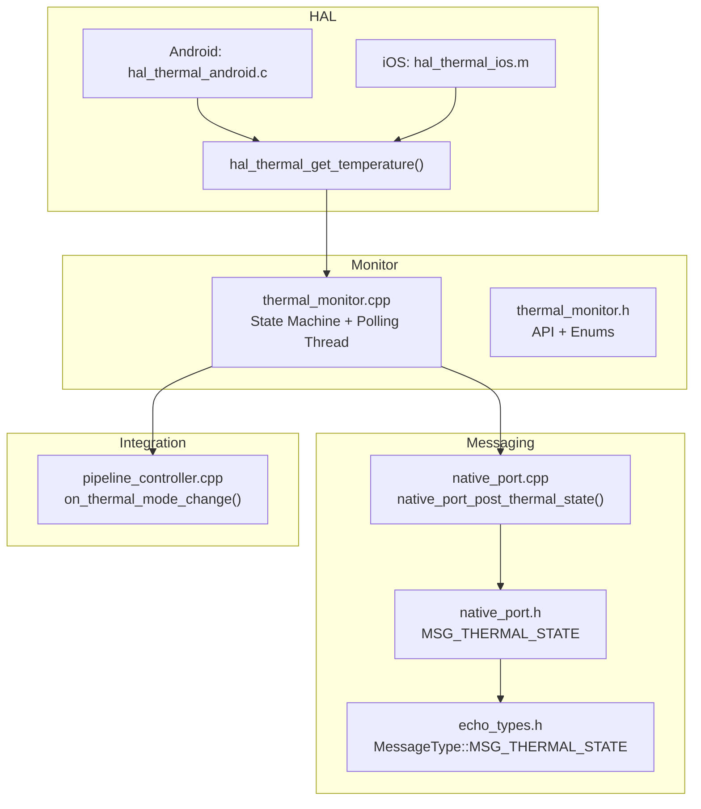
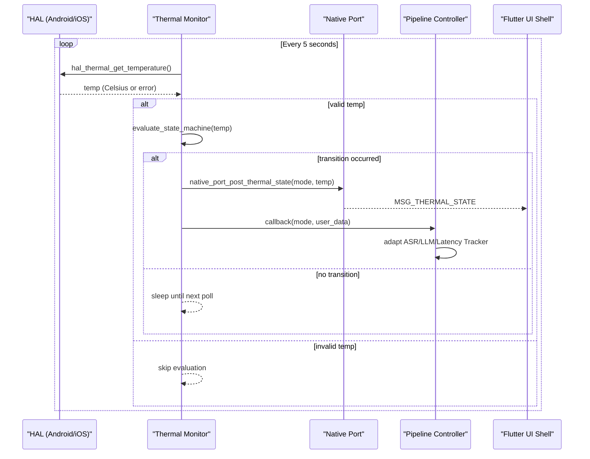
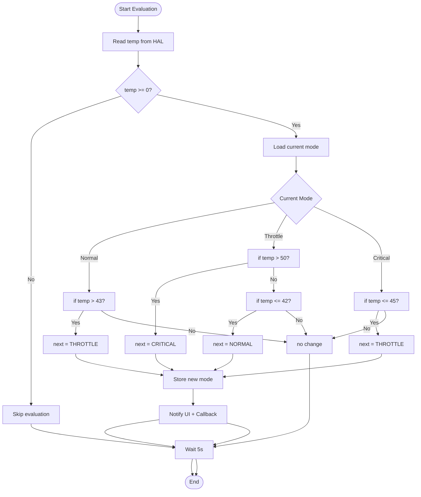
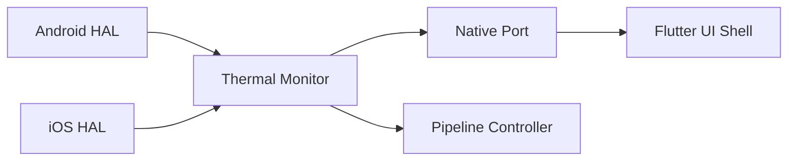

# Thermal Management System

<cite>
**Referenced Files in This Document**
- [thermal_monitor.h](file://native/include/thermal_monitor.h)
- [thermal_monitor.cpp](file://native/src/thermal_monitor.cpp)
- [hal_thermal.h](file://native/hal/hal_thermal.h)
- [hal_thermal_android.c](file://native/hal/android/hal_thermal_android.c)
- [hal_thermal_ios.m](file://native/hal/ios/hal_thermal_ios.m)
- [native_port.h](file://native/include/native_port.h)
- [native_port.cpp](file://native/src/native_port.cpp)
- [echo_types.h](file://native/include/echo_types.h)
- [pipeline_controller.cpp](file://native/src/pipeline_controller.cpp)
</cite>

## Table of Contents
1. [Introduction](#introduction)
2. [Project Structure](#project-structure)
3. [Core Components](#core-components)
4. [Architecture Overview](#architecture-overview)
5. [Detailed Component Analysis](#detailed-component-analysis)
6. [Dependency Analysis](#dependency-analysis)
7. [Performance Considerations](#performance-considerations)
8. [Troubleshooting Guide](#troubleshooting-guide)
9. [Conclusion](#conclusion)
10. [Appendices](#appendices)

## Introduction
This document explains QwenEcho’s thermal management system centered on a three-mode thermal state machine with hysteresis. It covers the temperature thresholds, transition rules, the ThermalMode enum, callback mechanism for engine adaptation, the low-priority polling thread, and the MSG_THERMAL_STATE notification to the UI shell. It also provides guidance for implementing custom thermal callbacks, configuring thresholds, and handling transitions within the Engine Manager context.

## Project Structure
The thermal subsystem spans platform abstraction (HAL), monitoring logic, and cross-layer messaging:
- HAL layer abstracts platform-specific temperature reading (Android AThermal/sysfs; iOS ProcessInfo).
- Thermal Monitor implements the state machine and polling loop.
- Native Port posts thermal state updates to the Flutter UI Shell.
- Pipeline Controller integrates the monitor into the running pipeline and adapts stages based on thermal mode.

**Diagram sources**
- [thermal_monitor.cpp:1-128](file://native/src/thermal_monitor.cpp#L1-L128)
- [thermal_monitor.h:1-109](file://native/include/thermal_monitor.h#L1-L109)
- [hal_thermal.h:1-53](file://native/hal/hal_thermal.h#L1-L53)
- [hal_thermal_android.c:1-207](file://native/hal/android/hal_thermal_android.c#L1-L207)
- [hal_thermal_ios.m:1-113](file://native/hal/ios/hal_thermal_ios.m#L1-L113)
- [native_port.cpp:247-262](file://native/src/native_port.cpp#L247-L262)
- [native_port.h:148-152](file://native/include/native_port.h#L148-L152)
- [echo_types.h:30-42](file://native/include/echo_types.h#L30-L42)
- [pipeline_controller.cpp:140-160](file://native/src/pipeline_controller.cpp#L140-L160)

**Section sources**
- [thermal_monitor.h:1-109](file://native/include/thermal_monitor.h#L1-L109)
- [thermal_monitor.cpp:1-128](file://native/src/thermal_monitor.cpp#L1-L128)
- [hal_thermal.h:1-53](file://native/hal/hal_thermal.h#L1-L53)
- [hal_thermal_android.c:1-207](file://native/hal/android/hal_thermal_android.c#L1-L207)
- [hal_thermal_ios.m:1-113](file://native/hal/ios/hal_thermal_ios.m#L1-L113)
- [native_port.h:148-152](file://native/include/native_port.h#L148-L152)
- [native_port.cpp:247-262](file://native/src/native_port.cpp#L247-L262)
- [echo_types.h:30-42](file://native/include/echo_types.h#L30-L42)
- [pipeline_controller.cpp:140-160](file://native/src/pipeline_controller.cpp#L140-L160)

## Core Components
- ThermalMode enum defines three operating modes: THERMAL_NORMAL, THERMAL_THROTTLE, THERMAL_CRITICAL.
- Thermal Monitor API exposes create/start/stop/get_mode/destroy functions and a user callback for adaptation.
- HAL interface abstracts temperature acquisition across Android and iOS.
- Native Port posts MSG_THERMAL_STATE messages to the UI shell.
- Pipeline Controller integrates the monitor and propagates thermal mode to ASR/LLM/Latency Tracker.

Key responsibilities:
- Temperature acquisition via HAL.
- State evaluation with hysteresis.
- Cross-layer notifications (UI and engine adaptation).
- Low-priority background polling.

**Section sources**
- [thermal_monitor.h:26-46](file://native/include/thermal_monitor.h#L26-L46)
- [thermal_monitor.h:59-102](file://native/include/thermal_monitor.h#L59-L102)
- [hal_thermal.h:26-46](file://native/hal/hal_thermal.h#L26-L46)
- [native_port.h:148-152](file://native/include/native_port.h#L148-L152)
- [pipeline_controller.cpp:140-160](file://native/src/pipeline_controller.cpp#L140-L160)

## Architecture Overview
The thermal system follows a layered architecture:
- HAL provides platform-specific temperature readings.
- Thermal Monitor runs a dedicated low-priority thread that polls every 5 seconds, evaluates the state machine, and triggers side effects on transitions.
- Side effects include posting MSG_THERMAL_STATE to the UI shell and invoking the user-supplied callback for engine adaptation.

**Diagram sources**
- [thermal_monitor.cpp:99-128](file://native/src/thermal_monitor.cpp#L99-L128)
- [native_port.cpp:247-262](file://native/src/native_port.cpp#L247-L262)
- [pipeline_controller.cpp:140-160](file://native/src/pipeline_controller.cpp#L140-L160)

## Detailed Component Analysis

### Three-Mode Thermal State Machine and Hysteresis
The state machine enforces hysteresis to avoid oscillation near thresholds:
- Normal → Throttle when temp > 43°C
- Throttle → Normal when temp ≤ 42°C
- Throttle → Critical when temp > 50°C
- Critical → Throttle when temp ≤ 45°C

Implementation details:
- Thresholds are defined as constants and used in the evaluation function.
- The current mode is stored atomically for lock-free reads.
- Transitions update the internal mode and return the new mode for side effects.

**Diagram sources**
- [thermal_monitor.cpp:28-35](file://native/src/thermal_monitor.cpp#L28-L35)
- [thermal_monitor.cpp:59-92](file://native/src/thermal_monitor.cpp#L59-L92)
- [thermal_monitor.cpp:99-128](file://native/src/thermal_monitor.cpp#L99-L128)

**Section sources**
- [thermal_monitor.cpp:28-35](file://native/src/thermal_monitor.cpp#L28-L35)
- [thermal_monitor.cpp:59-92](file://native/src/thermal_monitor.cpp#L59-L92)
- [thermal_monitor.cpp:99-128](file://native/src/thermal_monitor.cpp#L99-L128)

### ThermalMode Enum and Callback Mechanism
- ThermalMode values: THERMAL_NORMAL, THERMAL_THROTTLE, THERMAL_CRITICAL.
- User callback signature accepts the new mode and a user-provided context pointer.
- The callback is invoked only when a transition occurs, enabling targeted engine adaptation.

Usage pattern:
- Create the monitor with a callback and user data.
- Start the monitor; it will call back on each transition.
- In the callback, adjust engine behavior (e.g., sample rate, model context size).

**Section sources**
- [thermal_monitor.h:26-46](file://native/include/thermal_monitor.h#L26-L46)
- [thermal_monitor.h:59-60](file://native/include/thermal_monitor.h#L59-L60)
- [thermal_monitor.cpp:114-116](file://native/src/thermal_monitor.cpp#L114-L116)

### Low-Priority Polling Thread and Interval
- A dedicated thread runs at default priority (non-real-time).
- Polling interval is fixed at 5 seconds using an interruptible wait.
- Stop signaling uses a condition variable to wake early if needed.

Operational notes:
- Starting an already-running monitor is a no-op.
- Stopping sets a flag, notifies the condition variable, joins the thread, and resets running state.

**Section sources**
- [thermal_monitor.cpp:34-35](file://native/src/thermal_monitor.cpp#L34-L35)
- [thermal_monitor.cpp:99-128](file://native/src/thermal_monitor.cpp#L99-L128)
- [thermal_monitor.cpp:147-175](file://native/src/thermal_monitor.cpp#L147-L175)

### MSG_THERMAL_STATE Notification to UI Shell
- On each transition, the monitor posts a message containing the thermal mode and temperature.
- The message type is MSG_THERMAL_STATE.
- The payload is serialized as a Dart_CObject array and dispatched via the registered port.

Message format:
- Elements: [type, thermal_mode, temperature_c]

**Section sources**
- [native_port.h:148-152](file://native/include/native_port.h#L148-L152)
- [native_port.cpp:247-262](file://native/src/native_port.cpp#L247-L262)
- [echo_types.h:30-42](file://native/include/echo_types.h#L30-L42)
- [thermal_monitor.cpp:108-116](file://native/src/thermal_monitor.cpp#L108-L116)

### Platform HAL Implementations
- Android: Uses AThermal API when available (API level 30+); otherwise falls back to sysfs thermal zone. Headroom is mapped to approximate Celsius with clamping.
- iOS: Maps NSProcessInfo thermal states to representative Celsius values aligned with the state machine thresholds.

Error handling:
- If temperature read fails, the monitor skips evaluation for that cycle.

**Section sources**
- [hal_thermal.h:26-46](file://native/hal/hal_thermal.h#L26-L46)
- [hal_thermal_android.c:159-181](file://native/hal/android/hal_thermal_android.c#L159-L181)
- [hal_thermal_ios.m:46-51](file://native/hal/ios/hal_thermal_ios.m#L46-L51)
- [thermal_monitor.cpp:104-107](file://native/src/thermal_monitor.cpp#L104-L107)

### Integration with Pipeline Controller and Engine Adaptation
- The Pipeline Controller creates the Thermal Monitor and registers a callback.
- The callback maps the thermal mode to a throttle flag and applies it to ASR, LLM, and Latency Tracker stages.
- This enables dynamic adaptation such as adjusting sampling rates or model context sizes based on thermal conditions.

**Section sources**
- [pipeline_controller.cpp:140-160](file://native/src/pipeline_controller.cpp#L140-L160)
- [pipeline_controller.cpp:355-360](file://native/src/pipeline_controller.cpp#L355-L360)

## Dependency Analysis
The thermal system exhibits clear separation of concerns:
- HAL depends on platform APIs.
- Thermal Monitor depends on HAL and Native Port.
- Pipeline Controller depends on Thermal Monitor and stage modules.
- Native Port depends on Dart runtime integration.

**Diagram sources**
- [hal_thermal_android.c:1-207](file://native/hal/android/hal_thermal_android.c#L1-L207)
- [hal_thermal_ios.m:1-113](file://native/hal/ios/hal_thermal_ios.m#L1-L113)
- [thermal_monitor.cpp:1-128](file://native/src/thermal_monitor.cpp#L1-L128)
- [native_port.cpp:247-262](file://native/src/native_port.cpp#L247-L262)
- [pipeline_controller.cpp:140-160](file://native/src/pipeline_controller.cpp#L140-L160)

**Section sources**
- [thermal_monitor.cpp:1-128](file://native/src/thermal_monitor.cpp#L1-L128)
- [native_port.cpp:247-262](file://native/src/native_port.cpp#L247-L262)
- [pipeline_controller.cpp:140-160](file://native/src/pipeline_controller.cpp#L140-L160)

## Performance Considerations
- Polling frequency: Fixed at 5 seconds to balance responsiveness and CPU usage.
- Thread priority: Default (low) priority avoids contention with audio and inference threads.
- Atomic reads: Mode is atomic to minimize overhead for queries.
- Conditional notifications: Only post and callback on actual transitions to reduce overhead.

[No sources needed since this section provides general guidance]

## Troubleshooting Guide
Common issues and checks:
- No UI updates: Ensure Native Port is registered and the post function is set before starting the monitor.
- No engine adaptation: Verify the callback is provided during monitor creation and that the user context is correctly cast in the callback.
- Stuck in one mode: Confirm HAL returns valid temperatures; negative values cause evaluation to be skipped.
- Thread not stopping: Validate stop_requested flag and condition variable notification path.

**Section sources**
- [native_port.cpp:62-75](file://native/src/native_port.cpp#L62-L75)
- [thermal_monitor.cpp:104-107](file://native/src/thermal_monitor.cpp#L104-L107)
- [thermal_monitor.cpp:158-175](file://native/src/thermal_monitor.cpp#L158-L175)

## Conclusion
QwenEcho’s thermal management system provides a robust, platform-agnostic approach to thermal-aware operation. The three-mode state machine with hysteresis ensures stable transitions, while the low-priority polling thread minimizes impact on performance. Notifications to the UI shell and callbacks for engine adaptation enable responsive, user-friendly behavior under varying thermal conditions.

[No sources needed since this section summarizes without analyzing specific files]

## Appendices

### Example: Implementing Custom Thermal Callbacks
- Register a callback when creating the Thermal Monitor.
- In the callback, inspect the new mode and adjust engine parameters accordingly (e.g., sample rate, model context size).
- Use the user_data pointer to pass your Engine Manager instance or configuration object.

**Section sources**
- [thermal_monitor.h:59-60](file://native/include/thermal_monitor.h#L59-L60)
- [pipeline_controller.cpp:140-160](file://native/src/pipeline_controller.cpp#L140-L160)

### Example: Configuring Temperature Thresholds
- The implementation defines thresholds as constants; adjust them by editing the relevant file.
- Alternatively, extend the API to accept configurable thresholds at creation time if dynamic tuning is required.

**Section sources**
- [thermal_monitor.cpp:28-35](file://native/src/thermal_monitor.cpp#L28-L35)

### Example: Handling Thermal State Transitions in Engine Manager
- While the Engine Manager manages lifecycle, the Pipeline Controller demonstrates how to propagate thermal mode to stages.
- Integrate similar logic in your Engine Manager wrapper to apply global policies (e.g., pause non-critical tasks in critical mode).

**Section sources**
- [pipeline_controller.cpp:140-160](file://native/src/pipeline_controller.cpp#L140-L160)