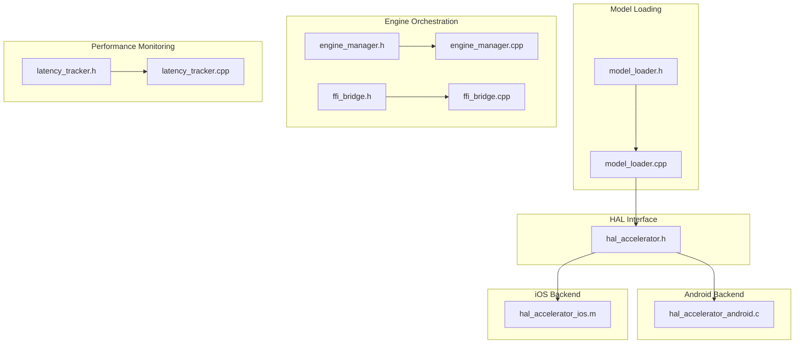
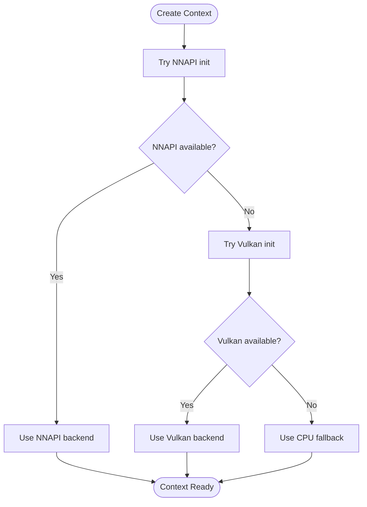
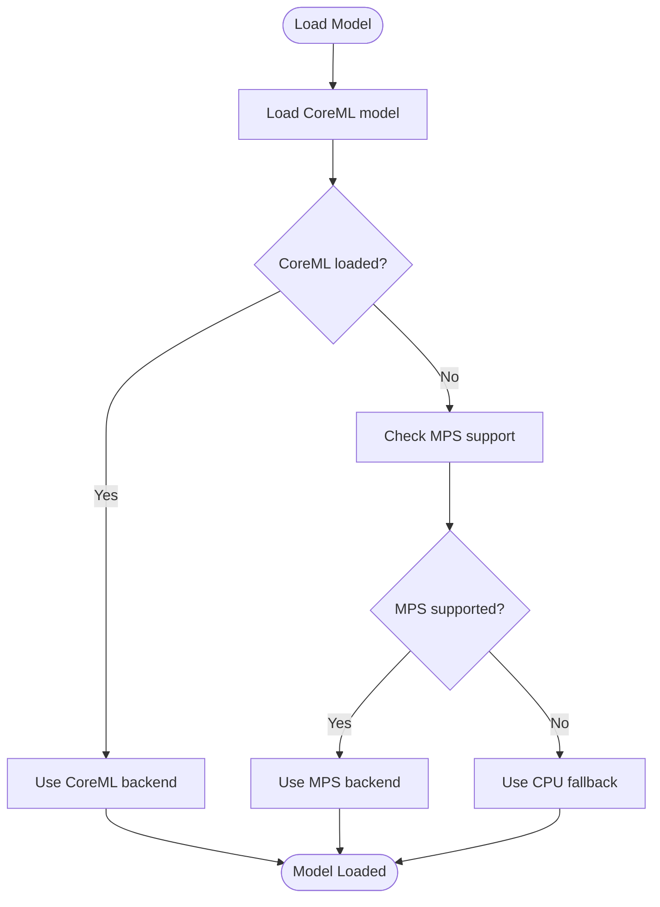
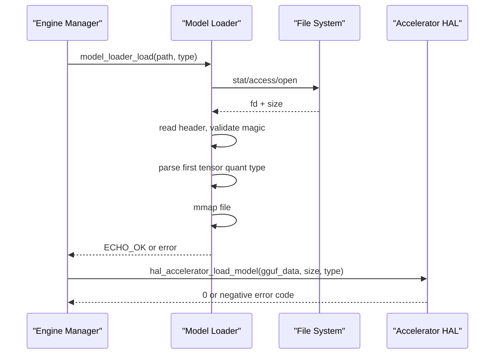
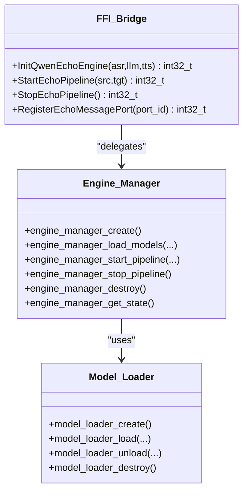
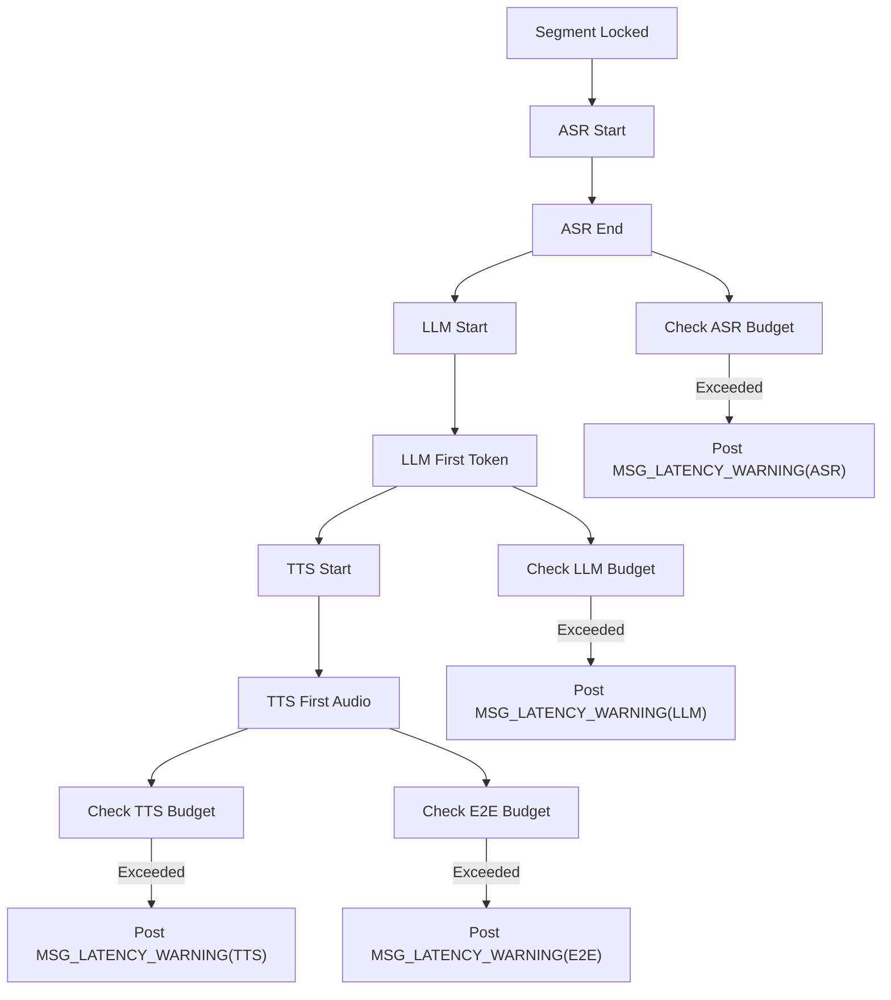
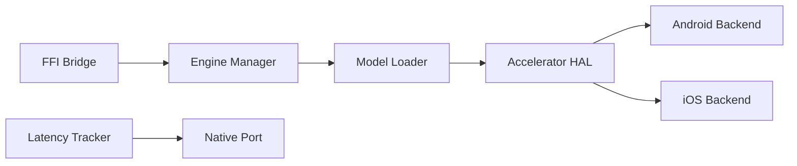

# Accelerator HAL Implementation

<cite>
**Referenced Files in This Document**
- [hal_accelerator.h](file://native/hal/hal_accelerator.h)
- [hal_accelerator_android.c](file://native/hal/android/hal_accelerator_android.c)
- [hal_accelerator_ios.m](file://native/hal/ios/hal_accelerator_ios.m)
- [model_loader.h](file://native/include/model_loader.h)
- [model_loader.cpp](file://native/src/model_loader.cpp)
- [engine_manager.h](file://native/include/engine_manager.h)
- [engine_manager.cpp](file://native/src/engine_manager.cpp)
- [ffi_bridge.h](file://native/include/ffi_bridge.h)
- [ffi_bridge.cpp](file://native/src/ffi_bridge.cpp)
- [latency_tracker.h](file://native/include/latency_tracker.h)
- [latency_tracker.cpp](file://native/src/latency_tracker.cpp)
</cite>

## Table of Contents
1. [Introduction](#introduction)
2. [Project Structure](#project-structure)
3. [Core Components](#core-components)
4. [Architecture Overview](#architecture-overview)
5. [Detailed Component Analysis](#detailed-component-analysis)
6. [Dependency Analysis](#dependency-analysis)
7. [Performance Considerations](#performance-considerations)
8. [Troubleshooting Guide](#troubleshooting-guide)
9. [Conclusion](#conclusion)

## Introduction
This document describes the Accelerator HAL component that provides hardware acceleration for AI inference across Android and iOS. It covers:
- The unified C interface for NPU/GPU acceleration and CPU fallback
- Android implementation using NNAPI with Vulkan compute as a secondary path and CPU fallback
- iOS implementation using CoreML (NPU) with Metal Performance Shaders (MPS) GPU fallback and CPU fallback
- Model loading integration, availability detection, and error handling
- Performance benchmarking and latency monitoring utilities integrated into the pipeline

The goal is to enable efficient inference for ASR, LLM, and TTS models while ensuring robust fallback behavior on devices without suitable accelerators.

## Project Structure
The Accelerator HAL is implemented under native/hal with platform-specific backends and a shared header defining the public API. Integration points include model loading and engine lifecycle management.



**Diagram sources**
- [hal_accelerator.h:1-81](file://native/hal/hal_accelerator.h#L1-L81)
- [hal_accelerator_android.c:1-496](file://native/hal/android/hal_accelerator_android.c#L1-L496)
- [hal_accelerator_ios.m:1-401](file://native/hal/ios/hal_accelerator_ios.m#L1-L401)
- [model_loader.h:1-142](file://native/include/model_loader.h#L1-L142)
- [model_loader.cpp:1-460](file://native/src/model_loader.cpp#L1-L460)
- [engine_manager.h:1-104](file://native/include/engine_manager.h#L1-L104)
- [engine_manager.cpp:1-202](file://native/src/engine_manager.cpp#L1-L202)
- [ffi_bridge.h:1-84](file://native/include/ffi_bridge.h#L1-L84)
- [ffi_bridge.cpp:1-124](file://native/src/ffi_bridge.cpp#L1-L124)
- [latency_tracker.h:1-224](file://native/include/latency_tracker.h#L1-L224)
- [latency_tracker.cpp:1-285](file://native/src/latency_tracker.cpp#L1-L285)

**Section sources**
- [hal_accelerator.h:1-81](file://native/hal/hal_accelerator.h#L1-L81)
- [hal_accelerator_android.c:1-496](file://native/hal/android/hal_accelerator_android.c#L1-L496)
- [hal_accelerator_ios.m:1-401](file://native/hal/ios/hal_accelerator_ios.m#L1-L401)
- [model_loader.h:1-142](file://native/include/model_loader.h#L1-L142)
- [model_loader.cpp:1-460](file://native/src/model_loader.cpp#L1-L460)
- [engine_manager.h:1-104](file://native/include/engine_manager.h#L1-L104)
- [engine_manager.cpp:1-202](file://native/src/engine_manager.cpp#L1-L202)
- [ffi_bridge.h:1-84](file://native/include/ffi_bridge.h#L1-L84)
- [ffi_bridge.cpp:1-124](file://native/src/ffi_bridge.cpp#L1-L124)
- [latency_tracker.h:1-224](file://native/include/latency_tracker.h#L1-L224)
- [latency_tracker.cpp:1-285](file://native/src/latency_tracker.cpp#L1-L285)

## Core Components
- Accelerator HAL API: Defines model types, context lifecycle, model loading, inference, and destruction.
- Android backend: Dynamically loads NNAPI and Vulkan; selects best available backend; falls back to CPU.
- iOS backend: Uses CoreML when available; falls back to MPS GPU; finally CPU.
- Model loader: Validates GGUF files, memory-maps them, and prepares inference contexts.
- Engine manager and FFI bridge: Orchestrate model loading and pipeline lifecycle exposed to Flutter via Dart FFI.
- Latency tracker: Measures per-stage and E2E latency and reports SLA violations.

Key responsibilities:
- Availability detection and backend selection
- Robust fallback mechanisms
- Consistent error codes and resource cleanup
- Integration with model validation and engine lifecycle
- Performance monitoring hooks

**Section sources**
- [hal_accelerator.h:1-81](file://native/hal/hal_accelerator.h#L1-L81)
- [hal_accelerator_android.c:1-496](file://native/hal/android/hal_accelerator_android.c#L1-L496)
- [hal_accelerator_ios.m:1-401](file://native/hal/ios/hal_accelerator_ios.m#L1-L401)
- [model_loader.h:1-142](file://native/include/model_loader.h#L1-L142)
- [model_loader.cpp:1-460](file://native/src/model_loader.cpp#L1-L460)
- [engine_manager.h:1-104](file://native/include/engine_manager.h#L1-L104)
- [engine_manager.cpp:1-202](file://native/src/engine_manager.cpp#L1-L202)
- [ffi_bridge.h:1-84](file://native/include/ffi_bridge.h#L1-L84)
- [ffi_bridge.cpp:1-124](file://native/src/ffi_bridge.cpp#L1-L124)
- [latency_tracker.h:1-224](file://native/include/latency_tracker.h#L1-L224)
- [latency_tracker.cpp:1-285](file://native/src/latency_tracker.cpp#L1-L285)

## Architecture Overview
The Accelerator HAL abstracts platform differences behind a single C interface. At runtime, it detects available accelerators and chooses the optimal backend. If acceleration fails or is unavailable, it falls back to CPU execution.

```mermaid
sequenceDiagram
participant App as "Flutter App"
participant FFI as "FFI Bridge"
participant EM as "Engine Manager"
participant ML as "Model Loader"
participant HAL as "Accelerator HAL"
participant AND as "Android Backend"
participant IOS as "iOS Backend"
App->>FFI : InitQwenEchoEngine(asr,llm,tts)
FFI->>EM : engine_manager_load_models(...)
EM->>ML : model_loader_load(..., MODEL_TYPE_ASR/LLM/TTS)
ML-->>EM : ECHO_OK or error
EM-->>FFI : ECHO_OK or error
FFI-->>App : int32_t result
App->>FFI : StartEchoPipeline(src,tgt)
FFI->>EM : engine_manager_start_pipeline(...)
EM->>HAL : hal_accelerator_create()
alt Android
HAL->>AND : nnapi_init / vulkan_init
AND-->>HAL : selected backend (NNAPI/Vulkan/CPU)
else iOS
HAL->>IOS : load_coreml_model / metal fallback / cpu fallback
IOS-->>HAL : selected backend (CoreML/MPS/CPU)
end
EM-->>FFI : ECHO_OK or error
FFI-->>App : int32_t result
```

**Diagram sources**
- [ffi_bridge.cpp:54-124](file://native/src/ffi_bridge.cpp#L54-L124)
- [engine_manager.cpp:44-141](file://native/src/engine_manager.cpp#L44-L141)
- [model_loader.cpp:284-380](file://native/src/model_loader.cpp#L284-L380)
- [hal_accelerator_android.c:282-309](file://native/hal/android/hal_accelerator_android.c#L282-L309)
- [hal_accelerator_ios.m:203-221](file://native/hal/ios/hal_accelerator_ios.m#L203-L221)

## Detailed Component Analysis

### Accelerator HAL API
The HAL defines a minimal, portable interface:
- Model type enumeration for ASR, LLM, TTS
- Context creation and destruction
- Model loading from in-memory GGUF data
- Inference with float input/output buffers
- Error signaling via negative return codes

Lifecycle:
- Create context → Load model(s) → Run inference → Destroy context

Error handling:
- Invalid inputs, missing model, backend initialization failures, and execution errors are reported consistently.

**Section sources**
- [hal_accelerator.h:1-81](file://native/hal/hal_accelerator.h#L1-L81)

### Android Backend (NNAPI → Vulkan → CPU)
Key behaviors:
- Dynamic loading of libneuralnetworks.so and libvulkan.so
- Device enumeration and accelerator presence checks
- Model compilation and execution paths for NNAPI
- Minimal Vulkan instance setup for compute capability detection
- CPU fallback with logging

Backend selection:
- Prefer NNAPI if available
- Fall back to Vulkan if NNAPI fails
- Always fall back to CPU if neither is usable

Model loading:
- Validates GGUF magic bytes
- Creates NNAPI model and compilation objects
- Logs and falls back on failure

Inference:
- Executes via NNAPI when available
- Provides placeholders for Vulkan compute dispatch
- CPU path logs readiness for ggml-based computation

Resource cleanup:
- Frees NNAPI model/compilation and shuts down libraries
- Shuts down Vulkan instance and closes library handles



**Diagram sources**
- [hal_accelerator_android.c:282-309](file://native/hal/android/hal_accelerator_android.c#L282-L309)

**Section sources**
- [hal_accelerator_android.c:1-496](file://native/hal/android/hal_accelerator_android.c#L1-L496)

### iOS Backend (CoreML → MPS → CPU)
Key behaviors:
- Attempts to load a precompiled CoreML model (.mlmodelc) based on model type
- Configures compute units for optimal device utilization
- Falls back to Metal Performance Shaders if CoreML not available
- Last resort: CPU fallback

Model loading:
- Maps model names to bundled .mlmodelc resources
- Loads via MLModel with configuration
- Records backend choice and model metadata

Inference:
- CoreML path builds MLMultiArray inputs and extracts outputs
- MPS path demonstrates buffer creation and command queue usage
- CPU path acts as a passthrough placeholder



**Diagram sources**
- [hal_accelerator_ios.m:203-221](file://native/hal/ios/hal_accelerator_ios.m#L203-L221)

**Section sources**
- [hal_accelerator_ios.m:1-401](file://native/hal/ios/hal_accelerator_ios.m#L1-L401)

### Model Loader Integration
Responsibilities:
- Validate GGUF file existence, permissions, and format
- Memory-map files for efficient access
- Verify quantization type (INT4 variants accepted)
- Provide inference context placeholders and memory usage reporting

Integration with HAL:
- The HAL expects in-memory GGUF data for loading
- The model loader validates and maps files before passing data to higher layers
- Error codes propagate up through the engine manager



**Diagram sources**
- [model_loader.cpp:284-380](file://native/src/model_loader.cpp#L284-L380)
- [hal_accelerator_android.c:311-400](file://native/hal/android/hal_accelerator_android.c#L311-L400)
- [hal_accelerator_ios.m:203-221](file://native/hal/ios/hal_accelerator_ios.m#L203-L221)

**Section sources**
- [model_loader.h:1-142](file://native/include/model_loader.h#L1-L142)
- [model_loader.cpp:1-460](file://native/src/model_loader.cpp#L1-L460)

### Engine Manager and FFI Bridge
- FFI exposes InitQwenEchoEngine, StartEchoPipeline, StopEchoPipeline, RegisterEchoMessagePort
- Engine Manager coordinates model loading and pipeline lifecycle
- State transitions ensure correct ordering and guard against invalid calls



**Diagram sources**
- [ffi_bridge.h:1-84](file://native/include/ffi_bridge.h#L1-L84)
- [ffi_bridge.cpp:1-124](file://native/src/ffi_bridge.cpp#L1-L124)
- [engine_manager.h:1-104](file://native/include/engine_manager.h#L1-L104)
- [engine_manager.cpp:1-202](file://native/src/engine_manager.cpp#L1-L202)
- [model_loader.h:1-142](file://native/include/model_loader.h#L1-L142)

**Section sources**
- [ffi_bridge.h:1-84](file://native/include/ffi_bridge.h#L1-L84)
- [ffi_bridge.cpp:1-124](file://native/src/ffi_bridge.cpp#L1-L124)
- [engine_manager.h:1-104](file://native/include/engine_manager.h#L1-L104)
- [engine_manager.cpp:1-202](file://native/src/engine_manager.cpp#L1-L202)

### Performance Benchmarking and Latency Tracking
Latency Tracker:
- Maintains per-segment timestamps at stage boundaries
- Checks stage-level budgets (ASR ≤200ms, LLM ≤450ms, TTS ≤100ms)
- Enforces E2E budgets (Normal ≤800ms, Throttle ≤1200ms)
- Posts MSG_LATENCY_WARNING with stage name, actual ms, and budget

Integration:
- Stages call tracker APIs at key events
- Native port delivers warnings to Flutter UI for diagnostics



**Diagram sources**
- [latency_tracker.h:34-49](file://native/include/latency_tracker.h#L34-L49)
- [latency_tracker.cpp:180-267](file://native/src/latency_tracker.cpp#L180-L267)

**Section sources**
- [latency_tracker.h:1-224](file://native/include/latency_tracker.h#L1-L224)
- [latency_tracker.cpp:1-285](file://native/src/latency_tracker.cpp#L1-L285)

## Dependency Analysis
Component relationships:
- FFI depends on Engine Manager
- Engine Manager depends on Model Loader and Pipeline Controller
- Model Loader depends on OS file APIs and optionally integrates with HAL for inference contexts
- HAL implementations depend on platform frameworks (NNAPI/Vulkan/CoreML/MPS)
- Latency Tracker depends on Native Port for messaging

Potential coupling:
- HAL is decoupled from engine orchestration via clear C interfaces
- Model Loader is independent of HAL but can provide data to it
- Latency Tracker is orthogonal and only observes timing events

External dependencies:
- Android: libneuralnetworks.so, libvulkan.so
- iOS: CoreML, Metal, MetalPerformanceShaders



**Diagram sources**
- [ffi_bridge.cpp:1-124](file://native/src/ffi_bridge.cpp#L1-L124)
- [engine_manager.cpp:1-202](file://native/src/engine_manager.cpp#L1-L202)
- [model_loader.cpp:1-460](file://native/src/model_loader.cpp#L1-L460)
- [hal_accelerator_android.c:1-496](file://native/hal/android/hal_accelerator_android.c#L1-L496)
- [hal_accelerator_ios.m:1-401](file://native/hal/ios/hal_accelerator_ios.m#L1-L401)
- [latency_tracker.cpp:1-285](file://native/src/latency_tracker.cpp#L1-L285)

**Section sources**
- [ffi_bridge.cpp:1-124](file://native/src/ffi_bridge.cpp#L1-L124)
- [engine_manager.cpp:1-202](file://native/src/engine_manager.cpp#L1-L202)
- [model_loader.cpp:1-460](file://native/src/model_loader.cpp#L1-L460)
- [hal_accelerator_android.c:1-496](file://native/hal/android/hal_accelerator_android.c#L1-L496)
- [hal_accelerator_ios.m:1-401](file://native/hal/ios/hal_accelerator_ios.m#L1-L401)
- [latency_tracker.cpp:1-285](file://native/src/latency_tracker.cpp#L1-L285)

## Performance Considerations
- Backend selection prioritizes NPU acceleration where available; otherwise uses GPU compute or CPU
- Memory mapping reduces copy overhead and leverages OS page cache
- Quantization validation ensures compatibility with optimized kernels
- Latency tracking enables continuous monitoring and alerting for SLA violations
- Thermal mode affects E2E budget thresholds to balance performance and thermals

[No sources needed since this section provides general guidance]

## Troubleshooting Guide
Common issues and resolutions:
- Missing or unreadable model files: Ensure paths exist and are readable; check ECHO_ERR_MODEL_MISSING and ECHO_ERR_MODEL_PERMISSION
- Invalid GGUF format: Verify magic bytes and quantization type; check ECHO_ERR_MODEL_INVALID
- Backend initialization failures: Inspect logs for NNAPI/Vulkan/CoreML/MPS availability; confirm device supports required features
- Inference errors: Review negative return codes from hal_accelerator_infer and corresponding backend logs
- Latency SLA violations: Monitor MSG_LATENCY_WARNING messages and adjust thermal mode or pipeline parameters

Operational tips:
- Confirm backend selection by checking logs during create/load phases
- Validate model packaging (e.g., .mlmodelc on iOS) and resource naming
- Use latency tracker queries to inspect recent records for diagnostics

**Section sources**
- [model_loader.cpp:284-380](file://native/src/model_loader.cpp#L284-L380)
- [hal_accelerator_android.c:311-400](file://native/hal/android/hal_accelerator_android.c#L311-L400)
- [hal_accelerator_ios.m:203-221](file://native/hal/ios/hal_accelerator_ios.m#L203-L221)
- [latency_tracker.cpp:180-267](file://native/src/latency_tracker.cpp#L180-L267)

## Conclusion
The Accelerator HAL provides a clean abstraction over heterogeneous hardware accelerators, enabling efficient AI inference on Android and iOS with robust fallbacks. Integrated model validation, engine orchestration, and latency tracking ensure reliable operation and actionable performance insights. Future enhancements may include deeper model graph construction for NNAPI/Vulkan, expanded MPS kernel coverage, and richer benchmarking utilities.