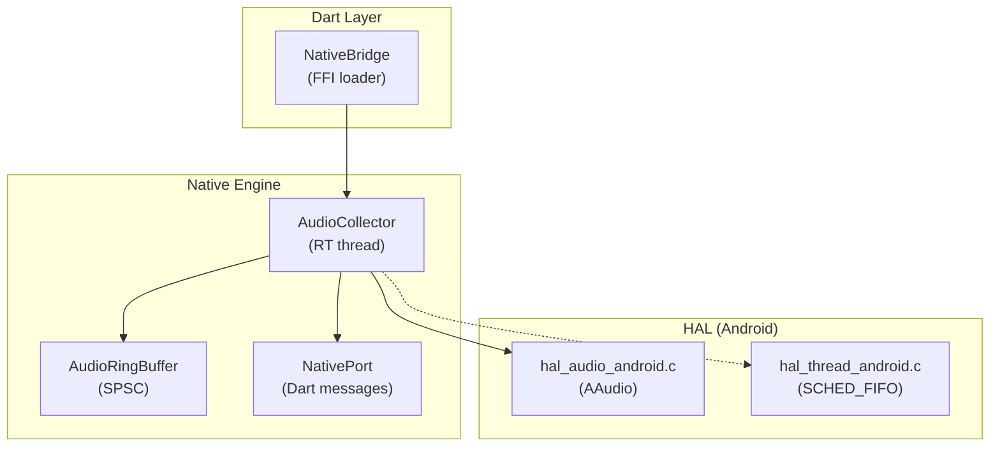
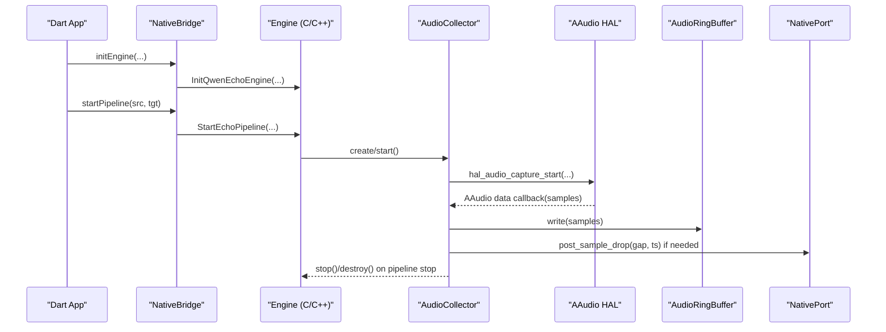
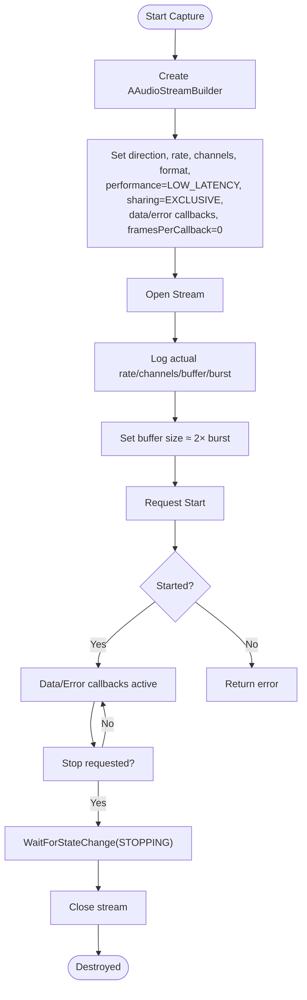
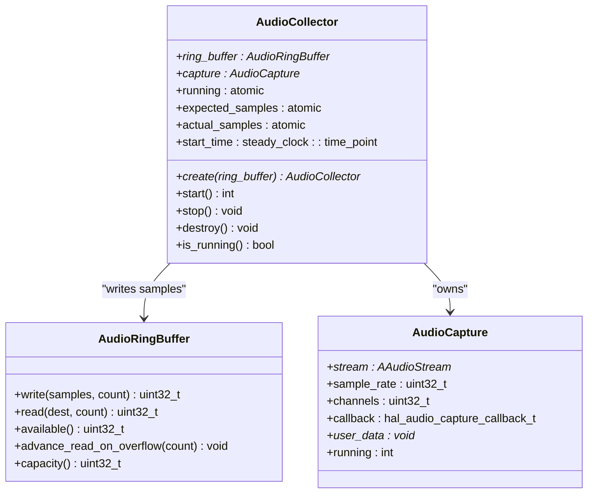
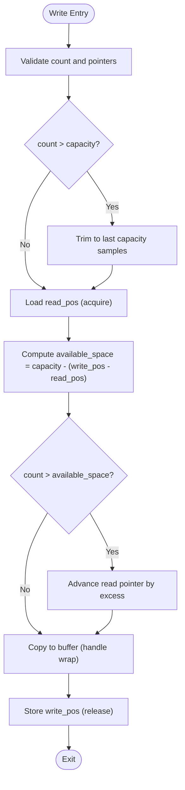
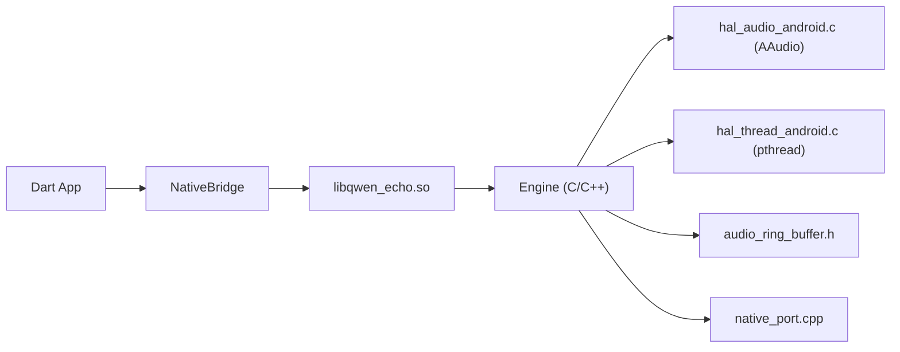

# Android Audio Implementation

<cite>
**Referenced Files in This Document**
- [hal_audio_android.c](file://native/hal/android/hal_audio_android.c)
- [hal_audio.h](file://native/hal/hal_audio.h)
- [audio_collector.cpp](file://native/src/audio_collector.cpp)
- [audio_collector.h](file://native/include/audio_collector.h)
- [audio_ring_buffer.h](file://native/include/audio_ring_buffer.h)
- [hal_thread.h](file://native/hal/hal_thread.h)
- [hal_thread_android.c](file://native/hal/android/hal_thread_android.c)
- [native_port.cpp](file://native/src/native_port.cpp)
- [CMakeLists.txt](file://native/CMakeLists.txt)
- [native_bridge.dart](file://lib/src/native_bridge.dart)
</cite>

## Table of Contents
1. [Introduction](#introduction)
2. [Project Structure](#project-structure)
3. [Core Components](#core-components)
4. [Architecture Overview](#architecture-overview)
5. [Detailed Component Analysis](#detailed-component-analysis)
6. [Dependency Analysis](#dependency-analysis)
7. [Performance Considerations](#performance-considerations)
8. [Troubleshooting Guide](#troubleshooting-guide)
9. [Conclusion](#conclusion)
10. [Appendices](#appendices)

## Introduction
This document explains the Android audio capture implementation with a focus on AAudio low-latency integration. It covers the platform-specific HAL, the real-time collector pipeline, ring buffer usage, callback mechanics, error handling, thread safety, and configuration for optimal latency. It also addresses Android-specific concerns such as permissions, device compatibility, power management considerations, debugging techniques, and performance profiling approaches.

## Project Structure
The Android audio path is implemented in C/C++ under the native layer and integrated into the Flutter app via FFI:
- Platform HAL (Android): AAudio-based input stream setup and callbacks
- Collector: Real-time thread that writes samples to a lock-free ring buffer and monitors drops
- Ring Buffer: Lock-free SPSC buffer for PCM data
- Thread Priority HAL: SCHED_FIFO/QoS elevation for RT threads
- Native Port: Message dispatch to Dart via FFI
- Build: CMake links AAudio and sets Android-specific options
- Dart Bridge: Loads the native library and exposes engine lifecycle methods

**Diagram sources**
- [native_bridge.dart:191-207](file://lib/src/native_bridge.dart#L191-L207)
- [audio_collector.cpp:157-201](file://native/src/audio_collector.cpp#L157-L201)
- [hal_audio_android.c:86-175](file://native/hal/android/hal_audio_android.c#L86-L175)
- [hal_thread_android.c:48-103](file://native/hal/android/hal_thread_android.c#L48-L103)
- [audio_ring_buffer.h:27-91](file://native/include/audio_ring_buffer.h#L27-L91)
- [native_port.cpp:302-317](file://native/src/native_port.cpp#L302-L317)

**Section sources**
- [CMakeLists.txt:37-67](file://native/CMakeLists.txt#L37-L67)
- [native_bridge.dart:191-207](file://lib/src/native_bridge.dart#L191-L207)

## Core Components
- Android HAL (AAudio): Creates an input stream with low-latency performance mode, configures format and sharing, registers data/error callbacks, opens and starts the stream, and manages lifecycle.
- Audio Collector: Runs at elevated priority, initializes AAudio capture, writes samples to a lock-free ring buffer, tracks expected vs actual samples to detect drops, and posts diagnostic messages.
- Ring Buffer: Power-of-two capacity, cache-line aligned head/tail, overwrite policy on overflow, non-blocking write/read.
- Thread Priority HAL: Elevates calling thread to SCHED_FIFO or fallback policies on Android.
- Native Port: Serializes typed messages and posts them to Dart via FFI.

Key responsibilities and interactions are defined across these modules, ensuring minimal latency and deterministic behavior.

**Section sources**
- [hal_audio_android.c:26-33](file://native/hal/android/hal_audio_android.c#L26-L33)
- [hal_audio_android.c:110-175](file://native/hal/android/hal_audio_android.c#L110-L175)
- [audio_collector.cpp:47-74](file://native/src/audio_collector.cpp#L47-L74)
- [audio_collector.cpp:93-128](file://native/src/audio_collector.cpp#L93-L128)
- [audio_ring_buffer.h:27-91](file://native/include/audio_ring_buffer.h#L27-L91)
- [hal_thread_android.c:48-103](file://native/hal/android/hal_thread_android.c#L48-L103)
- [native_port.cpp:302-317](file://native/src/native_port.cpp#L302-L317)

## Architecture Overview
The runtime flow begins with Dart loading the native library and starting the pipeline. The native side creates an AudioCollector, which elevates thread priority, constructs an AAudio stream via the HAL, and begins receiving PCM frames in a real-time callback. Samples are written to the ring buffer; drop detection logic posts diagnostics to Dart.

**Diagram sources**
- [native_bridge.dart:191-207](file://lib/src/native_bridge.dart#L191-L207)
- [audio_collector.cpp:157-201](file://native/src/audio_collector.cpp#L157-L201)
- [hal_audio_android.c:110-175](file://native/hal/android/hal_audio_android.c#L110-L175)
- [audio_ring_buffer.h:52-91](file://native/include/audio_ring_buffer.h#L52-L91)
- [native_port.cpp:302-317](file://native/src/native_port.cpp#L302-L317)

## Detailed Component Analysis

### Android HAL: AAudio Low-Latency Integration
- Stream builder configuration:
  - Direction: input
  - Sample rate and channel count set from requested parameters
  - Format: PCM I16
  - Performance mode: LOW_LATENCY
  - Sharing mode: EXCLUSIVE
  - Data and error callbacks registered
  - Frames per callback left to system selection
- Stream lifecycle:
  - Open stream, log actual parameters (rate, channels, buffer size, burst size)
  - Set buffer size to approximately two times burst size for stability
  - Start/stop/close with proper state transitions and logging
- Callback contract:
  - Data callback runs on a real-time thread; forwards int16_t PCM directly to user callback without blocking
  - Error callback logs AAudio errors and indicates potential recovery paths

**Diagram sources**
- [hal_audio_android.c:110-175](file://native/hal/android/hal_audio_android.c#L110-L175)
- [hal_audio_android.c:177-211](file://native/hal/android/hal_audio_android.c#L177-L211)

**Section sources**
- [hal_audio_android.c:26-33](file://native/hal/android/hal_audio_android.c#L26-L33)
- [hal_audio_android.c:45-82](file://native/hal/android/hal_audio_android.c#L45-L82)
- [hal_audio_android.c:86-175](file://native/hal/android/hal_audio_android.c#L86-L175)
- [hal_audio_android.c:177-211](file://native/hal/android/hal_audio_android.c#L177-L211)

### Audio Collector: Real-Time Pipeline and Drop Detection
- Responsibilities:
  - Elevate thread priority via HAL
  - Create and start AAudio capture with a user callback
  - Write incoming PCM to the ring buffer
  - Track expected vs actual sample counts to detect gaps
  - Post MSG_SAMPLE_DROP when gap exceeds threshold
- Threading model:
  - Collector initialization runs on a caller thread; sets RT priority
  - AAudio callback executes on platform RT thread
  - All operations in callback are lock-free and allocation-free
- Drop detection:
  - Expected samples computed from elapsed time using fixed sample rate
  - If expected significantly exceeds actual, report drop and reset actual to expected to avoid repeated reports

**Diagram sources**
- [audio_collector.cpp:47-74](file://native/src/audio_collector.cpp#L47-L74)
- [audio_collector.cpp:157-201](file://native/src/audio_collector.cpp#L157-L201)
- [audio_ring_buffer.h:27-91](file://native/include/audio_ring_buffer.h#L27-L91)
- [hal_audio.h:34-34](file://native/hal/hal_audio.h#L34-L34)

**Section sources**
- [audio_collector.cpp:157-201](file://native/src/audio_collector.cpp#L157-L201)
- [audio_collector.cpp:93-128](file://native/src/audio_collector.cpp#L93-L128)
- [audio_collector.h:1-16](file://native/include/audio_collector.h#L1-L16)

### Lock-Free Ring Buffer: Design and Complexity
- Capacity: power-of-two; uses bitmask for modulo
- Indices: atomic head/tail with acquire/release ordering; 64-byte alignment to prevent false sharing
- Overflow policy: producer advances read pointer to overwrite oldest samples (never blocks)
- Operations:
  - write(): O(n) memory copy bounded by capacity; constant overhead beyond memcpy
  - read(): O(n) memory copy bounded by available; constant overhead beyond memcpy
  - available(): O(1)
  - advance_read_on_overflow(): O(1)

**Diagram sources**
- [audio_ring_buffer.h:52-91](file://native/include/audio_ring_buffer.h#L52-L91)

**Section sources**
- [audio_ring_buffer.h:27-91](file://native/include/audio_ring_buffer.h#L27-L91)

### Thread Priority and Real-Time Behavior
- Android HAL thread priority:
  - Attempts SCHED_FIFO with highest safe priority
  - Falls back to lower priority or SCHED_RR if denied
- Purpose: ensure deterministic scheduling for the collector thread and minimize jitter/drops

**Section sources**
- [hal_thread.h:17-28](file://native/hal/hal_thread.h#L17-L28)
- [hal_thread_android.c:48-103](file://native/hal/android/hal_thread_android.c#L48-L103)

### Native Port: Diagnostics and Messaging
- Posts typed messages to Dart including sample drop events
- Uses atomic port registration and function pointer storage for thread-safe dispatch

**Section sources**
- [native_port.cpp:302-317](file://native/src/native_port.cpp#L302-L317)

## Dependency Analysis
- Build-time dependencies:
  - Android HAL sources included conditionally
  - Links against aaudio, android, log
  - Sets max-page-size option for Android 15+ compatibility
- Runtime dependencies:
  - Dart bridge loads libqwen_echo.so on Android
  - Native code depends on AAudio APIs and pthread scheduling

**Diagram sources**
- [CMakeLists.txt:37-67](file://native/CMakeLists.txt#L37-L67)
- [native_bridge.dart:191-207](file://lib/src/native_bridge.dart#L191-L207)

**Section sources**
- [CMakeLists.txt:37-67](file://native/CMakeLists.txt#L37-L67)
- [native_bridge.dart:191-207](file://lib/src/native_bridge.dart#L191-L207)

## Performance Considerations
- Latency tuning:
  - Use AAudio LOW_LATENCY performance mode and EXCLUSIVE sharing
  - Let system choose frames-per-callback; set buffer size to ~2× burst for stability
  - Prefer mono, 16-bit PCM at 16 kHz for ASR pipelines
- Throughput and drops:
  - Ensure collector thread runs at SCHED_FIFO or equivalent
  - Keep callback free of allocations and blocking calls
  - Use lock-free ring buffer with overwrite policy to avoid stalls
- Power management:
  - Avoid unnecessary wake-ups; keep pipeline short-lived
  - Monitor thermal warnings and reduce processing if needed
- Compatibility:
  - Link with max-page-size=16KB for Android 15+ devices
  - Handle permission failures gracefully with fallback scheduling policies

[No sources needed since this section provides general guidance]

## Troubleshooting Guide
- AAudio stream open/start failures:
  - Inspect error codes and human-readable text from AAudio
  - Verify requested sample rate/channels/format are supported
  - Confirm EXCLUSIVE sharing is allowed on the device
- No audio or frequent drops:
  - Check thread priority settings and whether SCHED_FIFO was granted
  - Validate ring buffer capacity and consumer throughput
  - Review MSG_SAMPLE_DROP messages and timestamps
- Device compatibility:
  - On Android 15+, ensure 16KB page alignment is linked
  - Test on multiple devices to confirm AAudio behavior differences
- Logging and diagnostics:
  - Enable LOGI/LOGW/LOGE outputs from HAL
  - Observe native port messages for latency and thermal warnings

**Section sources**
- [hal_audio_android.c:110-175](file://native/hal/android/hal_audio_android.c#L110-L175)
- [hal_thread_android.c:64-94](file://native/hal/android/hal_thread_android.c#L64-L94)
- [native_port.cpp:302-317](file://native/src/native_port.cpp#L302-L317)

## Conclusion
The Android audio capture path leverages AAudio’s low-latency capabilities, a real-time collector thread, and a lock-free ring buffer to deliver stable, low-jitter PCM streams suitable for ASR and interpretation pipelines. Proper configuration of performance mode, buffer sizing, and thread priority ensures robust operation across diverse Android devices. Comprehensive logging and message passing enable effective debugging and performance monitoring.

[No sources needed since this section summarizes without analyzing specific files]

## Appendices

### Configuration Parameters Summary
- AAudio stream builder:
  - Direction: input
  - Sample rate: e.g., 16000 Hz
  - Channels: 1 (mono)
  - Format: PCM I16
  - Performance mode: LOW_LATENCY
  - Sharing mode: EXCLUSIVE
  - Frames per callback: 0 (system-selected)
  - Buffer size: approximately 2× burst size
- Thread priority:
  - SCHED_FIFO with highest safe priority; fallbacks to lower priority or SCHED_RR
- Build flags:
  - Link aaudio, android, log
  - Set max-page-size=16384 for Android 15+

**Section sources**
- [hal_audio_android.c:110-175](file://native/hal/android/hal_audio_android.c#L110-L175)
- [hal_thread_android.c:48-103](file://native/hal/android/hal_thread_android.c#L48-L103)
- [CMakeLists.txt:53-67](file://native/CMakeLists.txt#L53-L67)