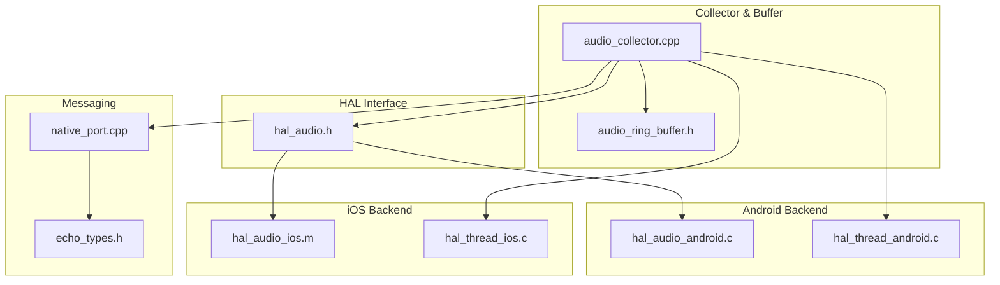
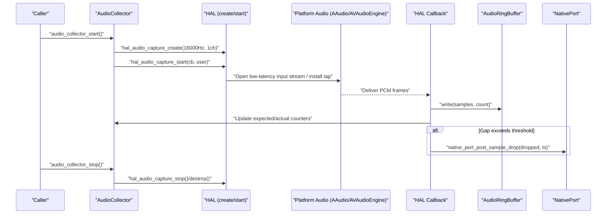
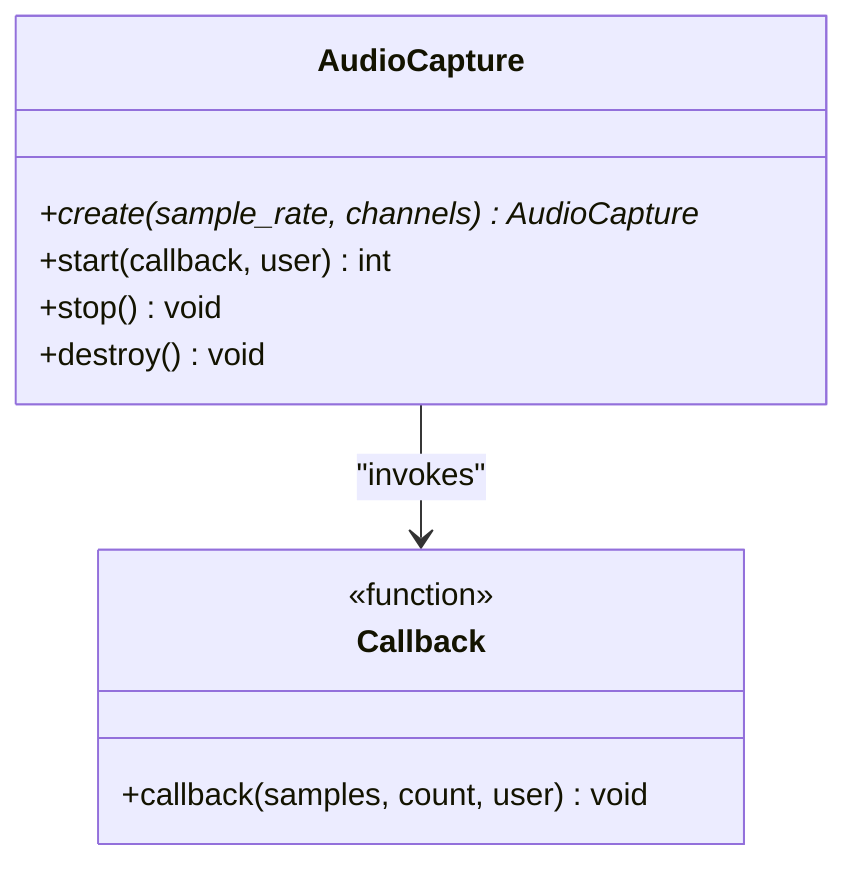
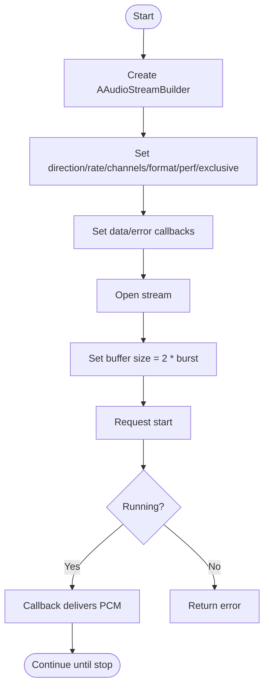
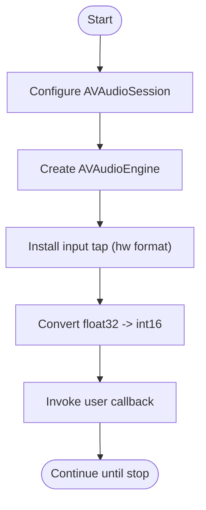
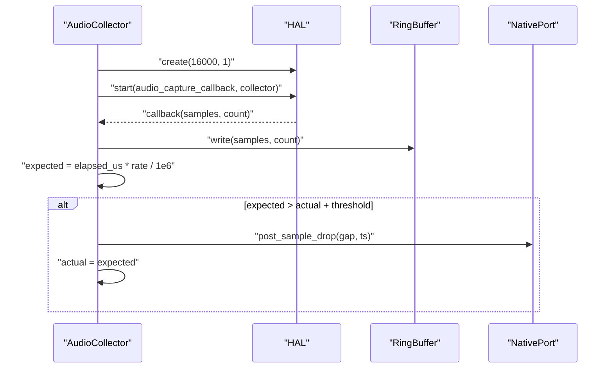
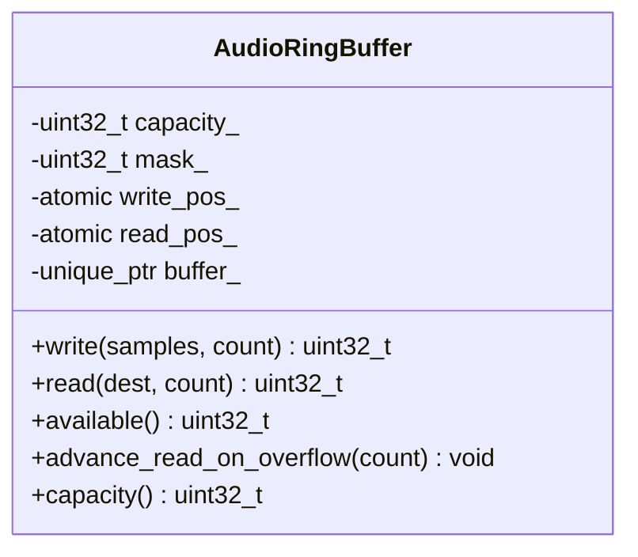
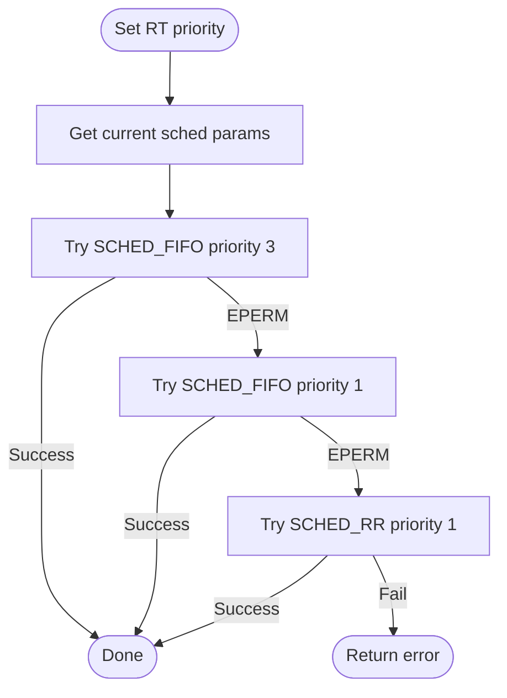
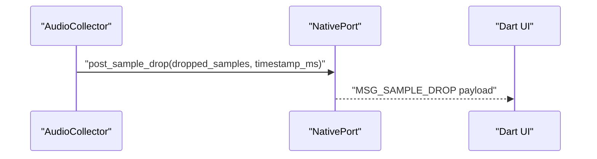
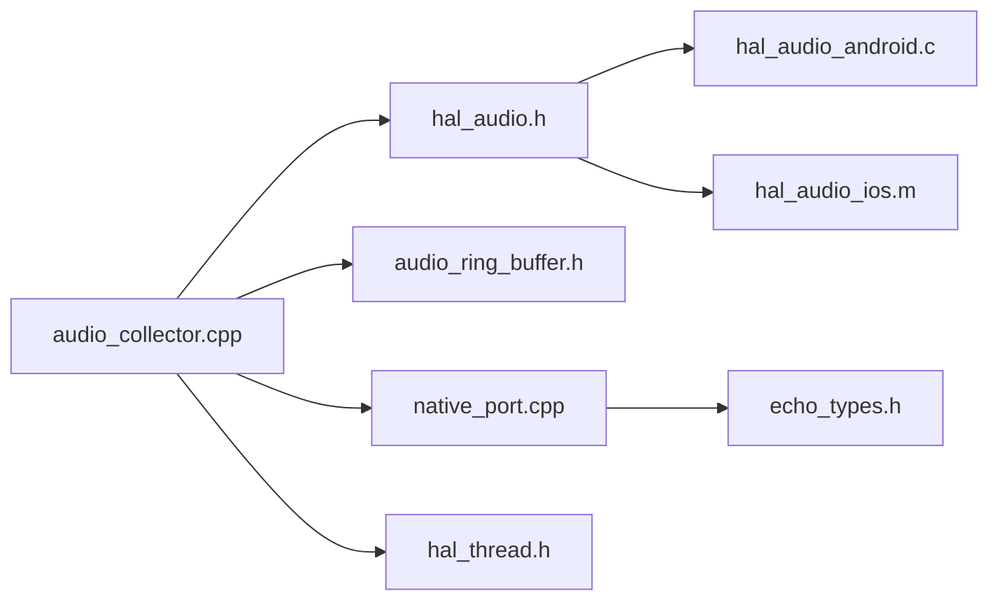

# Audio HAL Implementation

<cite>
**Referenced Files in This Document**
- [hal_audio.h](file://native/hal/hal_audio.h)
- [hal_audio_android.c](file://native/hal/android/hal_audio_android.c)
- [hal_audio_ios.m](file://native/hal/ios/hal_audio_ios.m)
- [audio_collector.h](file://native/include/audio_collector.h)
- [audio_collector.cpp](file://native/src/audio_collector.cpp)
- [audio_ring_buffer.h](file://native/include/audio_ring_buffer.h)
- [native_port.h](file://native/include/native_port.h)
- [native_port.cpp](file://native/src/native_port.cpp)
- [echo_types.h](file://native/include/echo_types.h)
- [hal_thread.h](file://native/hal/hal_thread.h)
- [hal_thread_android.c](file://native/hal/android/hal_thread_android.c)
- [hal_thread_ios.c](file://native/hal/ios/hal_thread_ios.c)
</cite>

## Table of Contents
1. [Introduction](#introduction)
2. [Project Structure](#project-structure)
3. [Core Components](#core-components)
4. [Architecture Overview](#architecture-overview)
5. [Detailed Component Analysis](#detailed-component-analysis)
6. [Dependency Analysis](#dependency-analysis)
7. [Performance Considerations](#performance-considerations)
8. [Troubleshooting Guide](#troubleshooting-guide)
9. [Conclusion](#conclusion)

## Introduction
This document describes the cross-platform Audio HAL component for microphone capture. It focuses on:
- The unified AudioCapture interface with create/start/stop/destroy lifecycle methods
- Android implementation using AAudio low-latency mode for real-time audio processing, including buffer management and callback handling
- iOS implementation using AVAudioEngine input taps for microphone access
- Sample rate configuration, channel management, error handling, and performance considerations for real-time audio processing

The design ensures a consistent C API across platforms while leveraging platform-specific low-latency APIs to deliver PCM samples to a lock-free ring buffer for downstream processing.

## Project Structure
The Audio HAL is implemented as a thin abstraction layer over platform audio subsystems. Key files:
- Unified interface header: hal_audio.h
- Android backend: hal_audio_android.c
- iOS backend: hal_audio_ios.m
- Collector orchestration: audio_collector.h and audio_collector.cpp
- Lock-free ring buffer: audio_ring_buffer.h
- Real-time thread priority: hal_thread.h and platform implementations
- Message dispatch for sample drops: native_port.h/cpp and echo_types.h

**Diagram sources**
- [hal_audio.h:1-78](file://native/hal/hal_audio.h#L1-L78)
- [hal_audio_android.c:1-214](file://native/hal/android/hal_audio_android.c#L1-L214)
- [hal_audio_ios.m:1-297](file://native/hal/ios/hal_audio_ios.m#L1-L297)
- [audio_collector.cpp:1-245](file://native/src/audio_collector.cpp#L1-L245)
- [audio_ring_buffer.h:1-192](file://native/include/audio_ring_buffer.h#L1-L192)
- [native_port.cpp:1-320](file://native/src/native_port.cpp#L1-L320)
- [echo_types.h:1-136](file://native/include/echo_types.h#L1-L136)
- [hal_thread_android.c:1-106](file://native/hal/android/hal_thread_android.c#L1-L106)
- [hal_thread_ios.c:1-46](file://native/hal/ios/hal_thread_ios.c#L1-L46)

**Section sources**
- [hal_audio.h:1-78](file://native/hal/hal_audio.h#L1-L78)
- [audio_collector.h:1-95](file://native/include/audio_collector.h#L1-L95)

## Core Components
- Unified HAL interface (C API):
  - AudioCapture opaque handle
  - Callback signature delivering int16_t PCM samples
  - Lifecycle: create(sample_rate, channels), start(callback, user), stop(), destroy()
- Platform backends:
  - Android: AAudio stream builder configured for low-latency input, exclusive sharing, PCM I16 format, callback-driven delivery
  - iOS: AVAudioEngine with input node tap, float-to-int16 conversion, session configuration for low latency
- Collector:
  - Sets real-time thread priority
  - Creates HAL instance at fixed 16kHz mono
  - Writes samples into a lock-free SPSC ring buffer
  - Detects sample drops by comparing expected vs actual counts and posts MSG_SAMPLE_DROP via native port
- Ring buffer:
  - Power-of-two capacity, atomic head/tail, overwrite policy on overflow
  - Cache-line aligned positions to avoid false sharing
- Messaging:
  - Typed message posting to Dart via Native Port
  - MSG_SAMPLE_DROP carries dropped_samples and timestamp_ms

**Section sources**
- [hal_audio.h:19-78](file://native/hal/hal_audio.h#L19-L78)
- [hal_audio_android.c:24-214](file://native/hal/android/hal_audio_android.c#L24-L214)
- [hal_audio_ios.m:21-297](file://native/hal/ios/hal_audio_ios.m#L21-L297)
- [audio_collector.cpp:27-245](file://native/src/audio_collector.cpp#L27-L245)
- [audio_ring_buffer.h:10-192](file://native/include/audio_ring_buffer.h#L10-L192)
- [native_port.h:168-173](file://native/include/native_port.h#L168-L173)
- [native_port.cpp:302-317](file://native/src/native_port.cpp#L302-L317)
- [echo_types.h:30-42](file://native/include/echo_types.h#L30-L42)

## Architecture Overview
The audio pipeline runs on real-time threads and uses a lock-free ring buffer to decouple capture from consumption.

**Diagram sources**
- [audio_collector.cpp:157-201](file://native/src/audio_collector.cpp#L157-L201)
- [hal_audio_android.c:101-175](file://native/hal/android/hal_audio_android.c#L101-L175)
- [hal_audio_ios.m:147-274](file://native/hal/ios/hal_audio_ios.m#L147-L274)
- [audio_ring_buffer.h:52-91](file://native/include/audio_ring_buffer.h#L52-L91)
- [native_port.cpp:302-317](file://native/src/native_port.cpp#L302-L317)

## Detailed Component Analysis

### Unified AudioCapture Interface
- Purpose: Provide a single C API for cross-platform microphone capture.
- Methods:
  - create(sample_rate, channels): allocate and initialize context
  - start(callback, user): open platform audio, set up callbacks, begin streaming
  - stop(): halt streaming and release resources
  - destroy(): free memory and ensure cleanup
- Callback contract:
  - Delivered from a real-time audio thread
  - Parameters: pointer to int16_t PCM samples, number of samples, user context
  - Must not block or perform allocations

**Diagram sources**
- [hal_audio.h:19-78](file://native/hal/hal_audio.h#L19-L78)

**Section sources**
- [hal_audio.h:19-78](file://native/hal/hal_audio.h#L19-L78)

### Android Implementation (AAudio Low-Latency)
Key behaviors:
- Uses AAudioStreamBuilder to configure input direction, sample rate, channel count, PCM I16 format, low-latency performance mode, and exclusive sharing.
- Data callback forwards raw int16_t frames directly to the user-provided callback without blocking.
- Error callback logs stream errors; production code may restart or switch devices.
- Buffering:
  - Frames per callback left to system default
  - Stream buffer size set to 2x burst size for balance between latency and stability
- Lifecycle:
  - Start opens stream, sets buffer size, requests start, marks running
  - Stop requests stop, waits for state change, then closes
  - Destroy stops if needed, closes stream, frees memory

**Diagram sources**
- [hal_audio_android.c:101-175](file://native/hal/android/hal_audio_android.c#L101-L175)

**Section sources**
- [hal_audio_android.c:24-214](file://native/hal/android/hal_audio_android.c#L24-L214)

### iOS Implementation (AVAudioEngine Input Tap)
Key behaviors:
- Configures AVAudioSession for PlayAndRecord category, preferred sample rate, and minimal IO buffer duration.
- Installs an input tap on the engine’s input node with hardware-native format; converts float32 samples to int16_t before invoking the user callback.
- Buffer sizing targets approximately 10ms per tap callback for low latency.
- Lifecycle:
  - Create initializes engine and session
  - Start installs tap, prepares and starts engine, marks running
  - Stop removes tap, stops engine, clears references
  - Destroy ensures stop and releases engine

**Diagram sources**
- [hal_audio_ios.m:42-86](file://native/hal/ios/hal_audio_ios.m#L42-L86)
- [hal_audio_ios.m:147-274](file://native/hal/ios/hal_audio_ios.m#L147-L274)

**Section sources**
- [hal_audio_ios.m:21-297](file://native/hal/ios/hal_audio_ios.m#L21-L297)

### Audio Collector Orchestration
Responsibilities:
- Elevates calling thread to real-time priority
- Creates HAL instance at 16kHz mono
- Initializes counters and start time for drop detection
- Starts HAL with collector callback
- In callback:
  - Writes samples to ring buffer
  - Updates actual sample count
  - Computes expected sample count based on elapsed time
  - If gap exceeds threshold, posts MSG_SAMPLE_DROP and resets actual to expected

**Diagram sources**
- [audio_collector.cpp:157-201](file://native/src/audio_collector.cpp#L157-L201)
- [audio_collector.cpp:93-128](file://native/src/audio_collector.cpp#L93-L128)
- [native_port.cpp:302-317](file://native/src/native_port.cpp#L302-L317)

**Section sources**
- [audio_collector.cpp:27-245](file://native/src/audio_collector.cpp#L27-L245)
- [audio_collector.h:1-95](file://native/include/audio_collector.h#L1-L95)

### Lock-Free Ring Buffer
Design highlights:
- Single-producer/single-consumer circular buffer for int16_t PCM
- Power-of-two capacity with bitmask for modulo operations
- Atomic head/tail with acquire/release ordering
- Overwrite policy: advance read pointer when producer would overflow
- Cache-line alignment to prevent false sharing

**Diagram sources**
- [audio_ring_buffer.h:27-192](file://native/include/audio_ring_buffer.h#L27-L192)

**Section sources**
- [audio_ring_buffer.h:10-192](file://native/include/audio_ring_buffer.h#L10-L192)

### Real-Time Thread Priority
Purpose:
- Ensure the collector thread runs at high priority to minimize jitter and sample drops
- Android: SCHED_FIFO with fallback to lower priorities or SCHED_RR
- iOS: QOS_CLASS_USER_INTERACTIVE

**Diagram sources**
- [hal_thread_android.c:48-103](file://native/hal/android/hal_thread_android.c#L48-L103)
- [hal_thread_ios.c:20-43](file://native/hal/ios/hal_thread_ios.c#L20-L43)

**Section sources**
- [hal_thread.h:17-28](file://native/hal/hal_thread.h#L17-L28)
- [hal_thread_android.c:1-106](file://native/hal/android/hal_thread_android.c#L1-106)
- [hal_thread_ios.c:1-46](file://native/hal/ios/hal_thread_ios.c#L1-L46)

### Messaging and Sample Drop Reporting
- When expected samples significantly exceed actual samples, the collector posts MSG_SAMPLE_DROP with dropped sample count and timestamp
- Native port serializes messages and dispatches them to the registered Dart port

**Diagram sources**
- [native_port.cpp:302-317](file://native/src/native_port.cpp#L302-L317)
- [echo_types.h:30-42](file://native/include/echo_types.h#L30-L42)

**Section sources**
- [native_port.h:168-173](file://native/include/native_port.h#L168-L173)
- [native_port.cpp:1-320](file://native/src/native_port.cpp#L1-L320)
- [echo_types.h:30-42](file://native/include/echo_types.h#L30-L42)

## Dependency Analysis
High-level dependencies:
- audio_collector depends on hal_audio, audio_ring_buffer, native_port, and hal_thread
- Android/iOS HAL backends depend on their respective platform APIs
- Native port depends on echo_types for message tags

**Diagram sources**
- [audio_collector.cpp:1-245](file://native/src/audio_collector.cpp#L1-L245)
- [hal_audio.h:1-78](file://native/hal/hal_audio.h#L1-L78)
- [hal_audio_android.c:1-214](file://native/hal/android/hal_audio_android.c#L1-L214)
- [hal_audio_ios.m:1-297](file://native/hal/ios/hal_audio_ios.m#L1-L297)
- [native_port.cpp:1-320](file://native/src/native_port.cpp#L1-L320)
- [echo_types.h:1-136](file://native/include/echo_types.h#L1-L136)

**Section sources**
- [audio_collector.cpp:1-245](file://native/src/audio_collector.cpp#L1-L245)
- [hal_audio.h:1-78](file://native/hal/hal_audio.h#L1-L78)

## Performance Considerations
- Latency minimization:
  - Android: AAudio low-latency performance mode, small buffer sizes (2x burst), callback-driven delivery
  - iOS: Small IO buffer duration (~5ms), ~10ms tap buffers, direct float-to-int16 conversion
- Throughput and stability:
  - Exclusive sharing on Android reduces contention
  - Overwrite policy in ring buffer prevents producer stalls
- Real-time scheduling:
  - Elevate collector thread priority; fall back gracefully if permissions are restricted
- Memory safety:
  - Avoid allocations in callbacks; use stack buffers where possible (iOS path)
- Monitoring:
  - Sample drop detection with threshold-based reporting helps identify timing issues

[No sources needed since this section provides general guidance]

## Troubleshooting Guide
Common issues and remedies:
- No audio captured:
  - Verify HAL start returns success and that platform audio session/stream opened successfully
  - Check platform logs for session/category or stream open failures
- High latency or glitches:
  - Reduce buffer sizes (Android: adjust frames-per-burst multiplier; iOS: reduce IO buffer duration)
  - Ensure exclusive sharing on Android and correct sample rate/channel settings
- Sample drops:
  - Inspect MSG_SAMPLE_DROP events; consider increasing ring buffer capacity or improving consumer throughput
  - Validate real-time thread priority was applied; check fallback behavior on Android
- Permission errors:
  - On Android, SCHED_FIFO may be restricted; verify fallback to lower priority or SCHED_RR
  - On iOS, ensure app entitlements allow required QoS classes

**Section sources**
- [hal_audio_android.c:110-175](file://native/hal/android/hal_audio_android.c#L110-L175)
- [hal_audio_ios.m:42-86](file://native/hal/ios/hal_audio_ios.m#L42-L86)
- [audio_collector.cpp:116-128](file://native/src/audio_collector.cpp#L116-L128)
- [hal_thread_android.c:64-93](file://native/hal/android/hal_thread_android.c#L64-L93)
- [hal_thread_ios.c:32-40](file://native/hal/ios/hal_thread_ios.c#L32-L40)

## Conclusion
The Audio HAL provides a robust, cross-platform microphone capture solution with a clean C API. Android leverages AAudio low-latency streams, while iOS uses AVAudioEngine input taps. The collector orchestrates real-time capture, writes to a lock-free ring buffer, and monitors for sample drops. With careful buffer sizing, real-time scheduling, and monitoring, the system achieves low-latency, stable audio capture suitable for real-time pipelines.