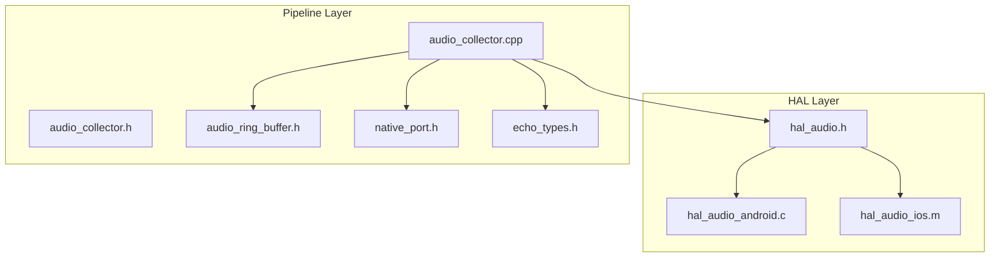
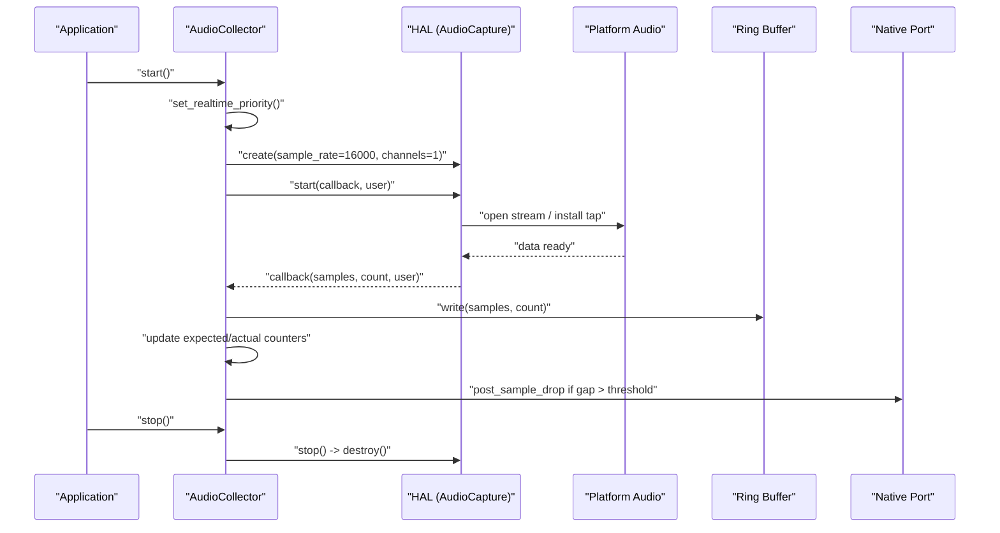
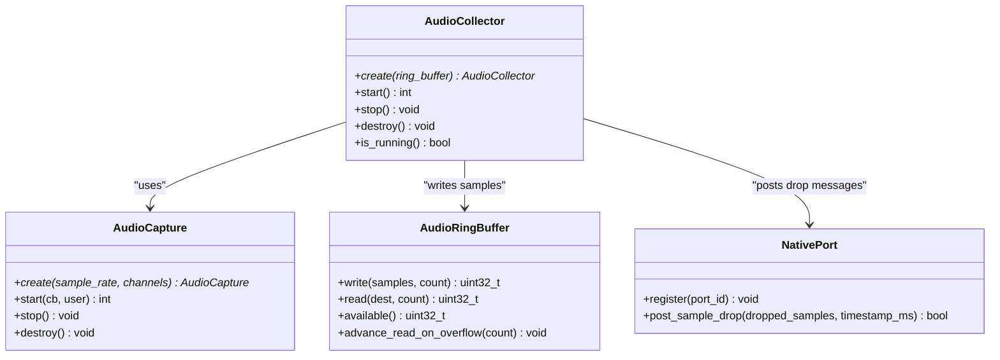

# Audio HAL Interface

<cite>
**Referenced Files in This Document**
- [hal_audio.h](file://native/hal/hal_audio.h)
- [hal_audio_android.c](file://native/hal/android/hal_audio_android.c)
- [hal_audio_ios.m](file://native/hal/ios/hal_audio_ios.m)
- [audio_collector.h](file://native/include/audio_collector.h)
- [audio_collector.cpp](file://native/src/audio_collector.cpp)
- [audio_ring_buffer.h](file://native/include/audio_ring_buffer.h)
- [native_port.h](file://native/include/native_port.h)
- [echo_types.h](file://native/include/echo_types.h)
- [test_audio_collector.cpp](file://native/tests/test_audio_collector.cpp)
</cite>

## Table of Contents
1. [Introduction](#introduction)
2. [Project Structure](#project-structure)
3. [Core Components](#core-components)
4. [Architecture Overview](#architecture-overview)
5. [Detailed Component Analysis](#detailed-component-analysis)
6. [Dependency Analysis](#dependency-analysis)
7. [Performance Considerations](#performance-considerations)
8. [Troubleshooting Guide](#troubleshooting-guide)
9. [Conclusion](#conclusion)
10. [Appendices](#appendices)

## Introduction
This document describes the unified cross-platform microphone capture API exposed by the Audio HAL and its integration with the higher-level audio processing pipeline. The HAL abstracts platform-specific input (Android AAudio, iOS AVAudioEngine) behind a single C interface centered on an opaque handle AudioCapture. It provides a callback-based real-time data path that delivers 16-bit PCM samples to user code without blocking or allocating memory.

The AudioCollector component demonstrates how to integrate the HAL into a low-latency pipeline: it configures capture at 16 kHz mono, writes samples into a lock-free ring buffer, and monitors for sample drops using expected vs. actual counts.

## Project Structure
The Audio HAL is implemented as a thin abstraction over platform backends:
- Public HAL header defines the opaque handle and lifecycle functions.
- Android backend uses AAudio with low-latency mode.
- iOS backend uses AVAudioEngine input taps with float-to-int16 conversion.
- AudioCollector composes the HAL with a ring buffer and drop detection.

**Diagram sources**
- [hal_audio.h:1-78](file://native/hal/hal_audio.h#L1-L78)
- [hal_audio_android.c:1-214](file://native/hal/android/hal_audio_android.c#L1-L214)
- [hal_audio_ios.m:1-297](file://native/hal/ios/hal_audio_ios.m#L1-L297)
- [audio_collector.h:1-95](file://native/include/audio_collector.h#L1-L95)
- [audio_collector.cpp:1-245](file://native/src/audio_collector.cpp#L1-L245)
- [audio_ring_buffer.h:1-192](file://native/include/audio_ring_buffer.h#L1-L192)
- [native_port.h:1-179](file://native/include/native_port.h#L1-L179)
- [echo_types.h:1-136](file://native/include/echo_types.h#L1-L136)

**Section sources**
- [hal_audio.h:1-78](file://native/hal/hal_audio.h#L1-L78)
- [hal_audio_android.c:1-214](file://native/hal/android/hal_audio_android.c#L1-L214)
- [hal_audio_ios.m:1-297](file://native/hal/ios/hal_audio_ios.m#L1-L297)
- [audio_collector.h:1-95](file://native/include/audio_collector.h#L1-L95)
- [audio_collector.cpp:1-245](file://native/src/audio_collector.cpp#L1-L245)
- [audio_ring_buffer.h:1-192](file://native/include/audio_ring_buffer.h#L1-L192)
- [native_port.h:1-179](file://native/include/native_port.h#L1-L179)
- [echo_types.h:1-136](file://native/include/echo_types.h#L1-L136)

## Core Components
- Opaque handle: AudioCapture represents a platform-specific capture session.
- Callback type: hal_audio_capture_callback_t receives int16_t PCM frames from a real-time thread.
- Lifecycle: create, start, stop, destroy.
- Platform backends:
  - Android: AAudio stream builder configured for low-latency input; callback forwards frames directly.
  - iOS: AVAudioEngine input tap installs a block that converts float32 to int16 and invokes the callback.
- Integration: AudioCollector sets real-time priority, creates HAL instance, starts capture, writes to ring buffer, detects drops, and posts messages via native port.

Key responsibilities:
- HAL: manage platform resources, deliver samples via callback, ensure non-blocking behavior.
- AudioCollector: orchestrate lifecycle, enforce RT constraints, provide monitoring and messaging.

**Section sources**
- [hal_audio.h:19-71](file://native/hal/hal_audio.h#L19-L71)
- [hal_audio_android.c:24-214](file://native/hal/android/hal_audio_android.c#L24-L214)
- [hal_audio_ios.m:21-297](file://native/hal/ios/hal_audio_ios.m#L21-L297)
- [audio_collector.cpp:47-245](file://native/src/audio_collector.cpp#L47-L245)

## Architecture Overview
The capture flow is strictly real-time:
- Application calls AudioCollector.start(), which elevates thread priority and initializes HAL.
- HAL opens platform audio and begins invoking the user-provided callback on a real-time thread.
- The callback writes samples to a lock-free ring buffer and updates counters for drop detection.
- If a gap exceeds threshold, a sample drop message is posted to the UI layer.

**Diagram sources**
- [audio_collector.cpp:157-222](file://native/src/audio_collector.cpp#L157-L222)
- [hal_audio_android.c:101-175](file://native/hal/android/hal_audio_android.c#L101-L175)
- [hal_audio_ios.m:147-274](file://native/hal/ios/hal_audio_ios.m#L147-L274)
- [audio_ring_buffer.h:52-91](file://native/include/audio_ring_buffer.h#L52-L91)
- [native_port.h:169-172](file://native/include/native_port.h#L169-L172)
- [echo_types.h:30-42](file://native/include/echo_types.h#L30-L42)

## Detailed Component Analysis

### AudioCapture Handle and Lifecycle
- Create: Allocates and initializes platform-specific state. Returns NULL on failure.
- Start: Configures platform audio, registers callback, starts capture. Returns negative error codes on failure.
- Stop: Halts capture and ensures no further callbacks are delivered.
- Destroy: Stops if running, releases platform resources, frees handle.

Constraints:
- Callback runs on a real-time audio thread. Do not allocate, block, or perform I/O inside the callback.
- Sample format is int16_t PCM. Count is number of samples (frames × channels).

Error handling patterns:
- Negative integer return codes indicate specific failures during start.
- Null pointer checks guard against misuse.
- Platform backends log errors and may attempt graceful recovery (e.g., logging device disconnects).

Memory safety:
- All allocations occur outside the callback.
- Ownership semantics: caller owns the handle returned by create and must call destroy.
- Stop and destroy are idempotent-safe where applicable.

Usage example paths:
- Initialization and lifecycle: [audio_collector.cpp:157-222](file://native/src/audio_collector.cpp#L157-L222)
- Mock usage in tests: [test_audio_collector.cpp:75-123](file://native/tests/test_audio_collector.cpp#L75-L123)

**Section sources**
- [hal_audio.h:31-71](file://native/hal/hal_audio.h#L31-L71)
- [hal_audio_android.c:86-214](file://native/hal/android/hal_audio_android.c#L86-L214)
- [hal_audio_ios.m:90-143](file://native/hal/ios/hal_audio_ios.m#L90-L143)
- [audio_collector.cpp:157-222](file://native/src/audio_collector.cpp#L157-L222)
- [test_audio_collector.cpp:75-123](file://native/tests/test_audio_collector.cpp#L75-L123)

### Callback-Based Real-Time Data Path
Callback signature:
- Parameters: const int16_t* samples, uint32_t count, void* user.
- Thread context: real-time audio thread managed by platform.
- Performance constraints:
  - No dynamic allocation.
  - No blocking operations (no mutexes, no I/O).
  - Prefer direct writes to lock-free structures.

Implementation notes:
- Android: AAudio callback forwards raw int16_t frames directly to user callback.
- iOS: Input tap delivers float32; implementation converts to int16_t with saturation before invoking user callback.

Integration pattern:
- User callback should write to a lock-free ring buffer and update atomic counters for monitoring.

Example paths:
- Android forwarding: [hal_audio_android.c:45-64](file://native/hal/android/hal_audio_android.c#L45-L64)
- iOS conversion and delivery: [hal_audio_ios.m:196-256](file://native/hal/ios/hal_audio_ios.m#L196-L256)
- Collector callback writing to ring buffer and drop detection: [audio_collector.cpp:93-128](file://native/src/audio_collector.cpp#L93-L128)

**Section sources**
- [hal_audio.h:20-29](file://native/hal/hal_audio.h#L20-L29)
- [hal_audio_android.c:45-64](file://native/hal/android/hal_audio_android.c#L45-L64)
- [hal_audio_ios.m:196-256](file://native/hal/ios/hal_audio_ios.m#L196-L256)
- [audio_collector.cpp:93-128](file://native/src/audio_collector.cpp#L93-L128)

### Configuration Options: Sample Rate and Channels
- Sample rate:
  - Android: requested via stream builder; actual rate logged after open.
  - iOS: preferred sample rate set on audio session; hardware format may differ but conversion occurs in tap.
- Channels:
  - Mono/stereo supported; default pipeline uses mono (channels = 1).
  - iOS hardware format inspection is performed; conversion handles differences.

Configuration paths:
- Android configuration: [hal_audio_android.c:118-137](file://native/hal/android/hal_audio_android.c#L118-L137)
- iOS session and format setup: [hal_audio_ios.m:42-86](file://native/hal/ios/hal_audio_ios.m#L42-L86), [hal_audio_ios.m:166-182](file://native/hal/ios/hal_audio_ios.m#L166-L182)

**Section sources**
- [hal_audio_android.c:118-155](file://native/hal/android/hal_audio_android.c#L118-L155)
- [hal_audio_ios.m:42-86](file://native/hal/ios/hal_audio_ios.m#L42-L86)
- [hal_audio_ios.m:166-182](file://native/hal/ios/hal_audio_ios.m#L166-L182)

### Error Handling Patterns
- Return codes:
  - Start returns negative values for various failures (invalid parameters, already running, platform open/start errors).
- Logging:
  - Android logs detailed AAudio errors and stream parameters.
  - iOS logs session and engine errors.
- Recovery:
  - Android error callback logs device disconnection events; production would restart stream or switch devices.
  - iOS removes tap and stops engine on start failure.

Paths:
- Android error callback and logging: [hal_audio_android.c:70-82](file://native/hal/android/hal_audio_android.c#L70-L82)
- iOS error handling: [hal_audio_ios.m:259-268](file://native/hal/ios/hal_audio_ios.m#L259-L268)

**Section sources**
- [hal_audio_android.c:70-82](file://native/hal/android/hal_audio_android.c#L70-L82)
- [hal_audio_ios.m:259-268](file://native/hal/ios/hal_audio_ios.m#L259-L268)

### Memory Safety Considerations
- Allocation policy:
  - All allocations happen outside the callback.
  - iOS conversion uses stack buffer for small sizes and heap only when necessary; heap buffers are freed immediately after use.
- Ownership:
  - Caller owns AudioCapture; destroy must be called exactly once.
  - AudioCollector does not own the ring buffer; it is passed in and remains valid for the collector’s lifetime.
- Concurrency:
  - Ring buffer is lock-free SPSC; one producer (HAL callback) and one consumer (pipeline reader).
  - Atomic counters used for expected/actual sample tracking.

Paths:
- iOS conversion buffer management: [hal_audio_ios.m:219-256](file://native/hal/ios/hal_audio_ios.m#L219-L256)
- Ring buffer design and overflow policy: [audio_ring_buffer.h:10-26](file://native/include/audio_ring_buffer.h#L10-L26), [audio_ring_buffer.h:52-91](file://native/include/audio_ring_buffer.h#L52-L91)
- Collector ownership model: [audio_collector.h:12-16](file://native/include/audio_collector.h#L12-L16)

**Section sources**
- [hal_audio_ios.m:219-256](file://native/hal/ios/hal_audio_ios.m#L219-L256)
- [audio_ring_buffer.h:10-26](file://native/include/audio_ring_buffer.h#L10-L26)
- [audio_ring_buffer.h:52-91](file://native/include/audio_ring_buffer.h#L52-L91)
- [audio_collector.h:12-16](file://native/include/audio_collector.h#L12-L16)

### Threading Model
- Real-time priority:
  - AudioCollector sets real-time priority on the calling thread before starting capture.
- Callback thread:
  - Managed by platform (AAudio/AVAudioEngine); runs at high priority.
- Drop detection:
  - Uses steady clock to compute expected samples based on elapsed time; compares with actual received samples.
  - Posts MSG_SAMPLE_DROP when gap exceeds threshold.

Paths:
- RT priority elevation: [audio_collector.cpp:167-170](file://native/src/audio_collector.cpp#L167-L170)
- Expected/actual counting and drop detection: [audio_collector.cpp:109-127](file://native/src/audio_collector.cpp#L109-L127)
- Message type definition: [echo_types.h:30-42](file://native/include/echo_types.h#L30-L42)
- Native port posting function: [native_port.h:169-172](file://native/include/native_port.h#L169-L172)

**Section sources**
- [audio_collector.cpp:167-170](file://native/src/audio_collector.cpp#L167-L170)
- [audio_collector.cpp:109-127](file://native/src/audio_collector.cpp#L109-L127)
- [echo_types.h:30-42](file://native/include/echo_types.h#L30-L42)
- [native_port.h:169-172](file://native/include/native_port.h#L169-L172)

### Buffer Size Considerations
- Android:
  - Frames per callback left to system; buffer size set to 2× burst size for latency/glitch balance.
- iOS:
  - Tap buffer size configured to ~10ms worth of samples.
- Ring buffer:
  - Overwrite policy discards oldest samples when full; capacity typically power-of-two for performance.

Paths:
- Android buffer sizing: [hal_audio_android.c:150-161](file://native/hal/android/hal_audio_android.c#L150-L161)
- iOS tap buffer size: [hal_audio_ios.m:186-188](file://native/hal/ios/hal_audio_ios.m#L186-L188)
- Ring buffer overwrite policy: [audio_ring_buffer.h:18-26](file://native/include/audio_ring_buffer.h#L18-L26)

**Section sources**
- [hal_audio_android.c:150-161](file://native/hal/android/hal_audio_android.c#L150-L161)
- [hal_audio_ios.m:186-188](file://native/hal/ios/hal_audio_ios.m#L186-L188)
- [audio_ring_buffer.h:18-26](file://native/include/audio_ring_buffer.h#L18-L26)

### Integration Patterns with Higher-Level Pipeline
- AudioCollector integrates HAL with ring buffer and monitoring:
  - Creates HAL instance with fixed configuration (16 kHz, mono).
  - Starts capture and writes samples to ring buffer.
  - Monitors for drops and posts messages via native port.
- Consumer stages read from ring buffer and process audio downstream.

Paths:
- Collector composition: [audio_collector.cpp:172-201](file://native/src/audio_collector.cpp#L172-L201)
- Ring buffer write path: [audio_ring_buffer.h:52-91](file://native/include/audio_ring_buffer.h#L52-L91)
- Message posting: [native_port.h:169-172](file://native/include/native_port.h#L169-L172)

**Section sources**
- [audio_collector.cpp:172-201](file://native/src/audio_collector.cpp#L172-L201)
- [audio_ring_buffer.h:52-91](file://native/include/audio_ring_buffer.h#L52-L91)
- [native_port.h:169-172](file://native/include/native_port.h#L169-L172)

## Dependency Analysis
The following diagram shows key dependencies among components involved in microphone capture.

**Diagram sources**
- [hal_audio.h:31-71](file://native/hal/hal_audio.h#L31-L71)
- [audio_collector.h:36-88](file://native/include/audio_collector.h#L36-L88)
- [audio_ring_buffer.h:27-155](file://native/include/audio_ring_buffer.h#L27-L155)
- [native_port.h:169-172](file://native/include/native_port.h#L169-L172)

**Section sources**
- [hal_audio.h:31-71](file://native/hal/hal_audio.h#L31-L71)
- [audio_collector.h:36-88](file://native/include/audio_collector.h#L36-L88)
- [audio_ring_buffer.h:27-155](file://native/include/audio_ring_buffer.h#L27-L155)
- [native_port.h:169-172](file://native/include/native_port.h#L169-L172)

## Performance Considerations
- Keep callback work minimal:
  - Directly write to ring buffer.
  - Avoid allocations and blocking.
- Choose appropriate buffer sizes:
  - Android: 2× burst size balances latency and stability.
  - iOS: ~10ms tap buffer reduces latency while preventing glitches.
- Use lock-free ring buffer:
  - Power-of-two capacity and bitmask indexing reduce overhead.
  - Overwrite policy prevents producer stalls.
- Monitor for drops:
  - Track expected vs. actual samples; report gaps exceeding threshold.

[No sources needed since this section provides general guidance]

## Troubleshooting Guide
Common issues and diagnostics:
- Start failures:
  - Check return codes from start; verify parameters and platform availability.
  - Inspect platform logs for detailed error messages.
- Device disconnections:
  - Android error callback logs stream errors; consider restarting stream or switching devices.
- Late callbacks after stop:
  - Ensure callback checks running flag and exits early.
- Drop detection:
  - Validate ring buffer capacity and consumer throughput; adjust buffer sizes if frequent drops occur.

Relevant paths:
- Android error callback: [hal_audio_android.c:70-82](file://native/hal/android/hal_audio_android.c#L70-L82)
- iOS start error handling: [hal_audio_ios.m:259-268](file://native/hal/ios/hal_audio_ios.m#L259-L268)
- Collector stop behavior: [audio_collector.cpp:203-222](file://native/src/audio_collector.cpp#L203-L222)

**Section sources**
- [hal_audio_android.c:70-82](file://native/hal/android/hal_audio_android.c#L70-L82)
- [hal_audio_ios.m:259-268](file://native/hal/ios/hal_audio_ios.m#L259-L268)
- [audio_collector.cpp:203-222](file://native/src/audio_collector.cpp#L203-L222)

## Conclusion
The Audio HAL provides a clean, cross-platform microphone capture API with a well-defined lifecycle and strict real-time constraints. By adhering to the callback contract—non-blocking, allocation-free—and integrating with a lock-free ring buffer, the pipeline achieves low-latency audio capture with robust monitoring and error handling. The provided examples and tests demonstrate proper initialization, callback implementation, and resource cleanup.

[No sources needed since this section summarizes without analyzing specific files]

## Appendices

### Usage Examples Paths
- Proper initialization and lifecycle:
  - [audio_collector.cpp:157-222](file://native/src/audio_collector.cpp#L157-L222)
- Callback implementation (collector):
  - [audio_collector.cpp:93-128](file://native/src/audio_collector.cpp#L93-L128)
- Resource cleanup:
  - [audio_collector.cpp:203-234](file://native/src/audio_collector.cpp#L203-L234)
- Test-driven validation:
  - [test_audio_collector.cpp:129-379](file://native/tests/test_audio_collector.cpp#L129-L379)

**Section sources**
- [audio_collector.cpp:93-128](file://native/src/audio_collector.cpp#L93-L128)
- [audio_collector.cpp:157-234](file://native/src/audio_collector.cpp#L157-L234)
- [test_audio_collector.cpp:129-379](file://native/tests/test_audio_collector.cpp#L129-L379)