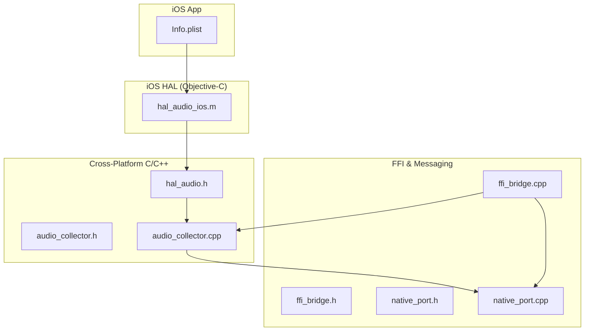
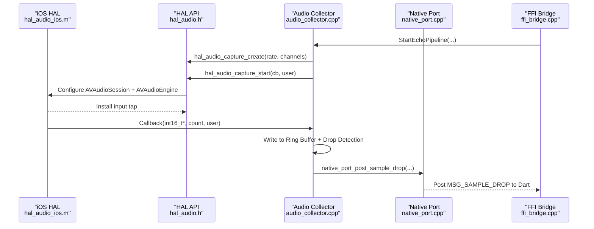
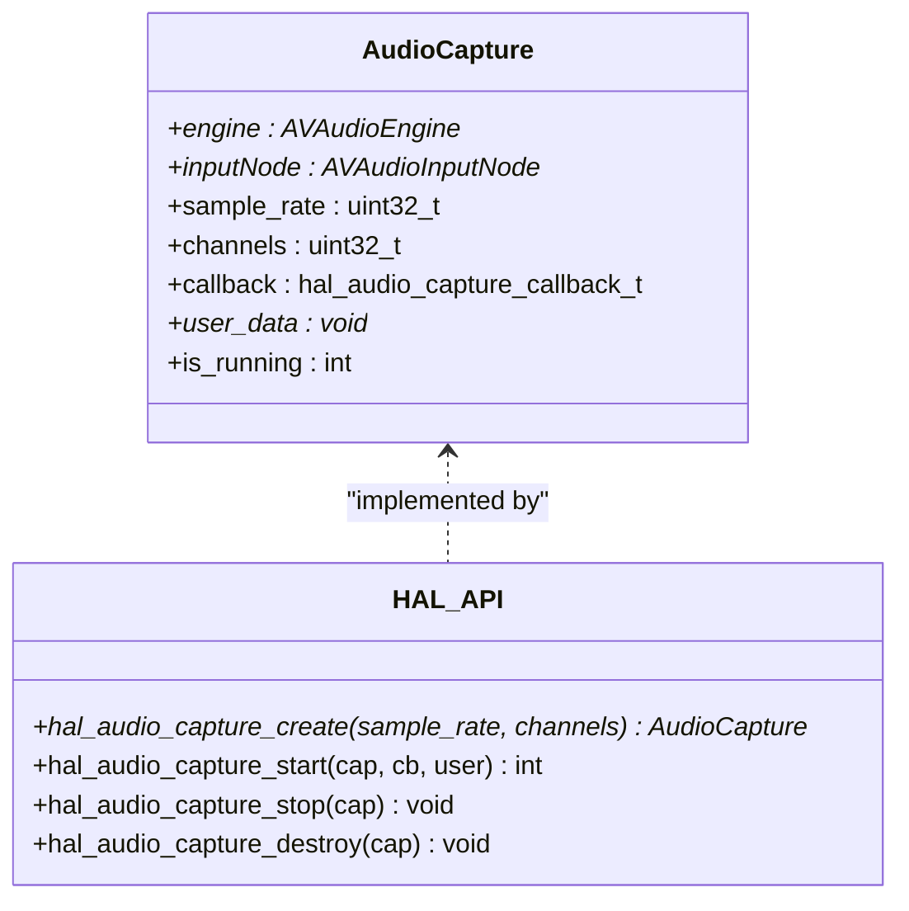
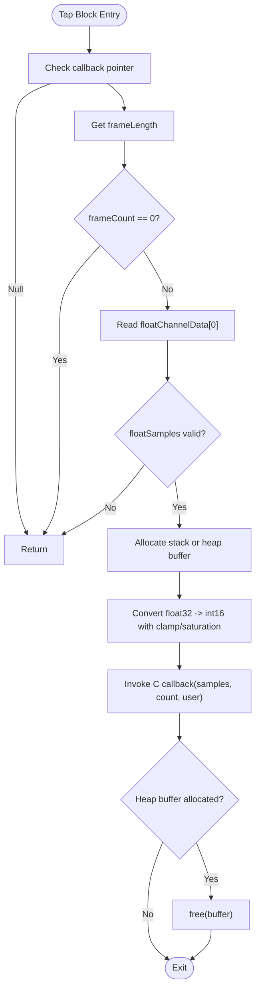
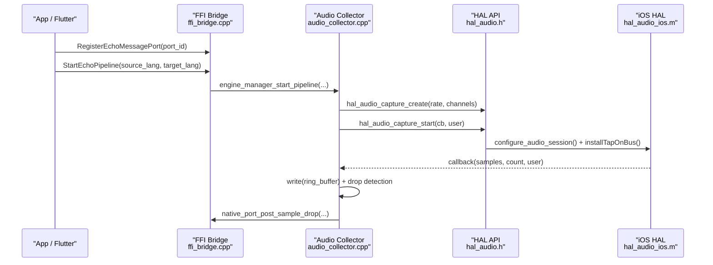
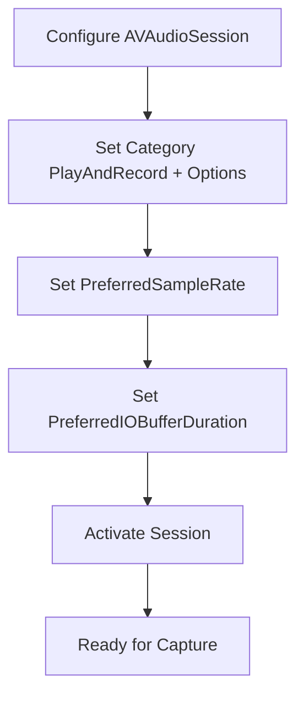
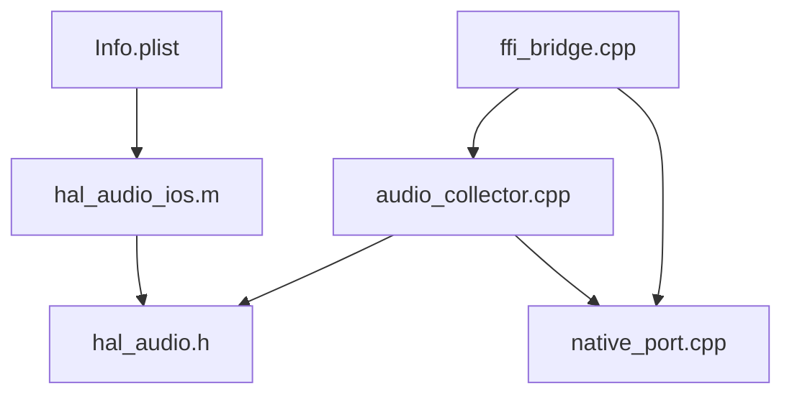

# iOS Audio Implementation

<cite>
**Referenced Files in This Document**
- [hal_audio_ios.m](file://native/hal/ios/hal_audio_ios.m)
- [hal_audio.h](file://native/hal/hal_audio.h)
- [audio_collector.cpp](file://native/src/audio_collector.cpp)
- [audio_collector.h](file://native/include/audio_collector.h)
- [ffi_bridge.h](file://native/include/ffi_bridge.h)
- [ffi_bridge.cpp](file://native/src/ffi_bridge.cpp)
- [native_port.h](file://native/include/native_port.h)
- [native_port.cpp](file://native/src/native_port.cpp)
- [Info.plist](file://ios/Runner/Info.plist)
</cite>

## Table of Contents
1. [Introduction](#introduction)
2. [Project Structure](#project-structure)
3. [Core Components](#core-components)
4. [Architecture Overview](#architecture-overview)
5. [Detailed Component Analysis](#detailed-component-analysis)
6. [Dependency Analysis](#dependency-analysis)
7. [Performance Considerations](#performance-considerations)
8. [Troubleshooting Guide](#troubleshooting-guide)
9. [Conclusion](#conclusion)

## Introduction
This document explains the iOS audio implementation for real-time microphone capture and integration with a cross-platform C/C++ pipeline. It focuses on:
- The iOS-specific AudioCapture structure and AVAudioEngine setup for microphone access
- Input tap callback mechanics, including AVAudioPCMBuffer handling, sample rate conversion considerations, and channel management
- The Objective-C bridge layer between Swift/Objective-C audio APIs and the C HAL interface
- iOS-specific configuration for low-latency audio, session management, and background audio handling
- iOS audio session categories, interruption handling, and device orientation changes
- Memory management patterns, ARC considerations, and performance optimization for real-time processing
- Debugging strategies using Instruments and Xcode audio tools

## Project Structure
The iOS audio path spans three layers:
- iOS HAL (Objective-C): Implements platform-specific capture via AVAudioEngine input taps
- Cross-platform C/C++: Provides a unified HAL API and an audio collector that writes to a ring buffer
- FFI Bridge and Native Port: Expose stable C entry points and deliver messages to Dart

**Diagram sources**
- [hal_audio_ios.m:1-296](file://native/hal/ios/hal_audio_ios.m#L1-L296)
- [hal_audio.h:1-78](file://native/hal/hal_audio.h#L1-L78)
- [audio_collector.h:1-95](file://native/include/audio_collector.h#L1-L95)
- [audio_collector.cpp:1-245](file://native/src/audio_collector.cpp#L1-L245)
- [ffi_bridge.h:1-84](file://native/include/ffi_bridge.h#L1-L84)
- [ffi_bridge.cpp:1-124](file://native/src/ffi_bridge.cpp#L1-L124)
- [native_port.h:1-179](file://native/include/native_port.h#L1-L179)
- [native_port.cpp:1-320](file://native/src/native_port.cpp#L1-L320)
- [Info.plist:1-71](file://ios/Runner/Info.plist#L1-L71)

**Section sources**
- [hal_audio_ios.m:1-296](file://native/hal/ios/hal_audio_ios.m#L1-L296)
- [hal_audio.h:1-78](file://native/hal/hal_audio.h#L1-L78)
- [audio_collector.h:1-95](file://native/include/audio_collector.h#L1-L95)
- [audio_collector.cpp:1-245](file://native/src/audio_collector.cpp#L1-L245)
- [ffi_bridge.h:1-84](file://native/include/ffi_bridge.h#L1-L84)
- [ffi_bridge.cpp:1-124](file://native/src/ffi_bridge.cpp#L1-L124)
- [native_port.h:1-179](file://native/include/native_port.h#L1-L179)
- [native_port.cpp:1-320](file://native/src/native_port.cpp#L1-L320)
- [Info.plist:1-71](file://ios/Runner/Info.plist#L1-L71)

## Core Components
- iOS HAL (Objective-C): Implements the platform-specific capture using AVAudioEngine and AVAudioInputNode input taps. It configures AVAudioSession for low-latency recording and converts float PCM to int16 before invoking the C callback.
- HAL API (C header): Defines the cross-platform capture interface used by the rest of the engine.
- Audio Collector (C++): Owns the lifecycle of capture, sets real-time priority, and writes samples into a lock-free ring buffer while monitoring for sample drops.
- FFI Bridge (C++): Exposes stable C entry points for initialization and pipeline control; enforces port registration before starting.
- Native Port (C++): Serializes typed messages and posts them to Dart via a registered port.

Key responsibilities:
- iOS HAL: AVAudioSession configuration, AVAudioEngine setup, input tap installation, format conversion, and callback dispatch
- Audio Collector: Real-time thread context, ring buffer writes, drop detection, and lifecycle coordination
- FFI Bridge: Global state guard, port registration enforcement, and delegation to Engine Manager
- Native Port: Message serialization and delivery to Dart

**Section sources**
- [hal_audio_ios.m:24-35](file://native/hal/ios/hal_audio_ios.m#L24-L35)
- [hal_audio.h:15-78](file://native/hal/hal_audio.h#L15-L78)
- [audio_collector.h:1-95](file://native/include/audio_collector.h#L1-L95)
- [audio_collector.cpp:47-74](file://native/src/audio_collector.cpp#L47-L74)
- [ffi_bridge.h:17-84](file://native/include/ffi_bridge.h#L17-L84)
- [ffi_bridge.cpp:22-46](file://native/src/ffi_bridge.cpp#L22-L46)
- [native_port.h:65-179](file://native/include/native_port.h#L65-L179)
- [native_port.cpp:19-30](file://native/src/native_port.cpp#L19-L30)

## Architecture Overview
The data flow from microphone to Dart is as follows:
- AVAudioEngine input node delivers float PCM buffers at hardware format
- iOS HAL converts to int16 and invokes the C callback
- Audio Collector writes to a ring buffer and detects sample drops
- Native Port posts structured messages to Dart
- FFI Bridge exposes high-level start/stop operations and enforces port registration

**Diagram sources**
- [hal_audio_ios.m:42-86](file://native/hal/ios/hal_audio_ios.m#L42-L86)
- [hal_audio_ios.m:147-274](file://native/hal/ios/hal_audio_ios.m#L147-L274)
- [hal_audio.h:43-71](file://native/hal/hal_audio.h#L43-L71)
- [audio_collector.cpp:157-201](file://native/src/audio_collector.cpp#L157-L201)
- [audio_collector.cpp:93-128](file://native/src/audio_collector.cpp#L93-L128)
- [native_port.cpp:302-317](file://native/src/native_port.cpp#L302-L317)
- [ffi_bridge.cpp:72-88](file://native/src/ffi_bridge.cpp#L72-L88)

## Detailed Component Analysis

### iOS HAL: AudioCapture and AVAudioEngine Setup
- AudioCapture struct holds AVAudioEngine, AVAudioInputNode, target sample rate, channel count, callback pointer, user data, and running flag.
- Session configuration sets category PlayAndRecord with options for speaker output and Bluetooth HFP, requests preferred sample rate, sets low IO buffer duration, and activates the session.
- Capture start installs an input tap on bus 0 using the hardware format, computes a small buffer size (~10ms), and starts the engine.
- The tap block converts float32 samples to int16 with clamping and saturation, then calls the C callback.

**Diagram sources**
- [hal_audio_ios.m:24-35](file://native/hal/ios/hal_audio_ios.m#L24-L35)
- [hal_audio.h:31-71](file://native/hal/hal_audio.h#L31-L71)

**Section sources**
- [hal_audio_ios.m:24-35](file://native/hal/ios/hal_audio_ios.m#L24-L35)
- [hal_audio_ios.m:42-86](file://native/hal/ios/hal_audio_ios.m#L42-L86)
- [hal_audio_ios.m:90-126](file://native/hal/ios/hal_audio_ios.m#L90-L126)
- [hal_audio_ios.m:147-274](file://native/hal/ios/hal_audio_ios.m#L147-L274)
- [hal_audio.h:31-71](file://native/hal/hal_audio.h#L31-L71)

### Input Tap Callback Mechanism and AVAudioPCMBuffer Handling
- The tap receives AVAudioPCMBuffer with floatChannelData[0] containing float32 samples in [-1.0, 1.0].
- Conversion loop clamps values and scales to int16 range, writing to either a stack buffer or heap buffer depending on frame count.
- The callback is invoked with int16 samples and count; no blocking or allocation should occur inside the callback.

**Diagram sources**
- [hal_audio_ios.m:196-256](file://native/hal/ios/hal_audio_ios.m#L196-L256)

**Section sources**
- [hal_audio_ios.m:196-256](file://native/hal/ios/hal_audio_ios.m#L196-L256)

### Sample Rate Conversion and Channel Management
- Desired format is constructed with target sample rate and channel count; however, the tap uses the hardware input node’s native format.
- Manual conversion handles float32 to int16; explicit resampling is not implemented in the tap block.
- Channel management assumes mono output in the current callback path (reads first channel).

Recommendations:
- If hardware sample rate differs from target, implement resampling in the tap block or use AVAudioConverter to convert to desired format.
- For stereo or multi-channel, interleave channels or select appropriate channel data based on target channels.

**Section sources**
- [hal_audio_ios.m:166-182](file://native/hal/ios/hal_audio_ios.m#L166-L182)
- [hal_audio_ios.m:214-247](file://native/hal/ios/hal_audio_ios.m#L214-L247)

### Objective-C Bridge Layer Between Swift/Objective-C and C HAL
- The iOS HAL implements the C HAL API defined in hal_audio.h, exposing create/start/stop/destroy functions.
- The AudioCollector (C++) calls these HAL functions and provides a real-time callback that writes to a ring buffer and reports sample drops.
- The FFI Bridge exposes higher-level entry points (InitQwenEchoEngine, StartEchoPipeline, StopEchoPipeline, RegisterEchoMessagePort) and enforces port registration before starting the pipeline.

**Diagram sources**
- [ffi_bridge.cpp:108-121](file://native/src/ffi_bridge.cpp#L108-L121)
- [ffi_bridge.cpp:72-88](file://native/src/ffi_bridge.cpp#L72-L88)
- [audio_collector.cpp:157-201](file://native/src/audio_collector.cpp#L157-L201)
- [hal_audio.h:43-71](file://native/hal/hal_audio.h#L43-L71)
- [hal_audio_ios.m:90-126](file://native/hal/ios/hal_audio_ios.m#L90-L126)
- [hal_audio_ios.m:147-274](file://native/hal/ios/hal_audio_ios.m#L147-L274)

**Section sources**
- [ffi_bridge.h:17-84](file://native/include/ffi_bridge.h#L17-L84)
- [ffi_bridge.cpp:22-46](file://native/src/ffi_bridge.cpp#L22-L46)
- [audio_collector.cpp:157-201](file://native/src/audio_collector.cpp#L157-L201)
- [hal_audio.h:43-71](file://native/hal/hal_audio.h#L43-L71)
- [hal_audio_ios.m:90-126](file://native/hal/ios/hal_audio_ios.m#L90-L126)
- [hal_audio_ios.m:147-274](file://native/hal/ios/hal_audio_ios.m#L147-L274)

### iOS-Specific Configuration: Low-Latency Audio, Session Management, Background Handling
- Category: AVAudioSessionCategoryPlayAndRecord with DefaultToSpeaker and AllowBluetoothHFP enables simultaneous record/playback and routes audio to speaker and Bluetooth devices.
- Preferred sample rate and IO buffer duration are set to minimize latency; activation is required for settings to take effect.
- Background audio: The app supports multiple orientations and scene configuration but does not explicitly declare background modes in Info.plist. To support background recording, add UIBackgroundModes with audio key and ensure session remains active when app moves to background.

**Diagram sources**
- [hal_audio_ios.m:42-86](file://native/hal/ios/hal_audio_ios.m#L42-L86)
- [Info.plist:56-68](file://ios/Runner/Info.plist#L56-L68)

**Section sources**
- [hal_audio_ios.m:42-86](file://native/hal/ios/hal_audio_ios.m#L42-L86)
- [Info.plist:56-68](file://ios/Runner/Info.plist#L56-L68)

### Interruption Handling and Device Orientation Changes
- Interruption handling: The current iOS HAL does not register AVAudioSession.interruptionNotification observers. Add handlers to pause/resume capture and reconfigure session if needed.
- Device orientation changes: The app declares supported orientations in Info.plist. While orientation changes typically do not affect audio capture, ensure any UI-dependent audio routing decisions account for orientation.

Best practices:
- Observe interruption notifications to gracefully handle phone calls, system prompts, and other interruptions.
- Re-activate the session after interruption ends and resume capture if necessary.

**Section sources**
- [hal_audio_ios.m:42-86](file://native/hal/ios/hal_audio_ios.m#L42-L86)
- [Info.plist:56-68](file://ios/Runner/Info.plist#L56-L68)

### Memory Management Patterns and ARC Considerations
- Objective-C objects (AVAudioEngine, AVAudioInputNode) are managed by ARC; they are assigned to properties and nil-ed out during destroy.
- C-side memory (AudioCapture) is allocated with calloc and freed with free.
- In the tap block, small buffers are allocated on the stack; larger buffers are heap-allocated and must be freed before returning.
- Avoid allocations and I/O in the real-time callback; only perform minimal work like ring buffer writes and atomic updates.

Guidelines:
- Keep the tap block strictly non-blocking and allocation-free where possible.
- Use @autoreleasepool blocks around Objective-C object creation to manage autorelease pools efficiently on the audio thread.

**Section sources**
- [hal_audio_ios.m:128-143](file://native/hal/ios/hal_audio_ios.m#L128-L143)
- [hal_audio_ios.m:219-256](file://native/hal/ios/hal_audio_ios.m#L219-L256)
- [audio_collector.cpp:93-128](file://native/src/audio_collector.cpp#L93-L128)

### Performance Optimization for Real-Time Audio Processing
- Prefer stack buffers for small frames to avoid heap allocation overhead.
- Minimize work in the tap block; delegate heavy processing to offloaded threads.
- Ensure ring buffer write is lock-free and never blocks.
- Tune IO buffer duration and tap buffer size for lowest latency without underruns.

**Section sources**
- [hal_audio_ios.m:188-256](file://native/hal/ios/hal_audio_ios.m#L188-L256)
- [audio_collector.cpp:93-128](file://native/src/audio_collector.cpp#L93-L128)

## Dependency Analysis
The following diagram shows dependencies among core modules involved in audio capture and messaging.

**Diagram sources**
- [hal_audio_ios.m:1-296](file://native/hal/ios/hal_audio_ios.m#L1-L296)
- [hal_audio.h:1-78](file://native/hal/hal_audio.h#L1-L78)
- [audio_collector.cpp:1-245](file://native/src/audio_collector.cpp#L1-L245)
- [native_port.cpp:1-320](file://native/src/native_port.cpp#L1-L320)
- [ffi_bridge.cpp:1-124](file://native/src/ffi_bridge.cpp#L1-L124)
- [Info.plist:1-71](file://ios/Runner/Info.plist#L1-L71)

**Section sources**
- [hal_audio_ios.m:1-296](file://native/hal/ios/hal_audio_ios.m#L1-L296)
- [hal_audio.h:1-78](file://native/hal/hal_audio.h#L1-L78)
- [audio_collector.cpp:1-245](file://native/src/audio_collector.cpp#L1-L245)
- [native_port.cpp:1-320](file://native/src/native_port.cpp#L1-L320)
- [ffi_bridge.cpp:1-124](file://native/src/ffi_bridge.cpp#L1-L124)
- [Info.plist:1-71](file://ios/Runner/Info.plist#L1-L71)

## Performance Considerations
- Latency tuning: Prefer small IO buffer durations and tap buffer sizes; monitor for underruns and adjust accordingly.
- CPU usage: Keep the tap block minimal; avoid string operations, logging, or heavy math.
- Memory pressure: Reuse buffers where possible; prefer stack allocation for small frames; avoid frequent malloc/free in the callback.
- Threading: Ensure ring buffer writes are lock-free and fast; consider batching writes if downstream consumers can tolerate it.

[No sources needed since this section provides general guidance]

## Troubleshooting Guide
Common issues and debugging strategies:
- No audio capture: Verify AVAudioSession category and activation; check logs for errors during session configuration and engine start.
- High latency or glitches: Reduce IO buffer duration and tap buffer size; ensure no blocking operations in the callback.
- Sample drops: Monitor MSG_SAMPLE_DROP messages; investigate ring buffer capacity and consumer throughput.
- Interruptions: Implement interruption handlers to pause/resume capture and reconfigure session.
- Orientation-related routing: Confirm supported orientations and test audio routing across orientations.

Tools:
- Instruments: Use Allocations, Leaks, and Time Profiler to detect memory issues and hotspots in the tap block.
- Xcode Diagnostics: Enable “Profile with Address Sanitizer” and “Thread Sanitizer” to catch concurrency issues.
- Log analysis: Review NSLog outputs from the iOS HAL for session configuration and engine status.

**Section sources**
- [hal_audio_ios.m:42-86](file://native/hal/ios/hal_audio_ios.m#L42-L86)
- [hal_audio_ios.m:258-274](file://native/hal/ios/hal_audio_ios.m#L258-L274)
- [audio_collector.cpp:116-128](file://native/src/audio_collector.cpp#L116-L128)
- [native_port.cpp:302-317](file://native/src/native_port.cpp#L302-L317)

## Conclusion
The iOS audio implementation leverages AVAudioEngine input taps to deliver low-latency microphone samples to a cross-platform C/C++ pipeline. The iOS HAL manages AVAudioSession configuration, AVAudioEngine lifecycle, and format conversion, while the Audio Collector ensures real-time delivery to a ring buffer and monitors for sample drops. The FFI Bridge and Native Port provide stable interfaces and message delivery to Dart. For production readiness, implement interruption handling, consider background audio support, and optimize the tap block for minimal latency and memory pressure.

[No sources needed since this section summarizes without analyzing specific files]