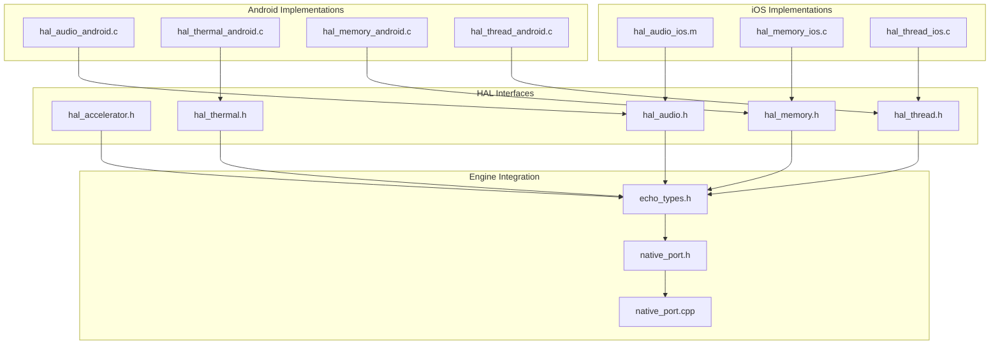
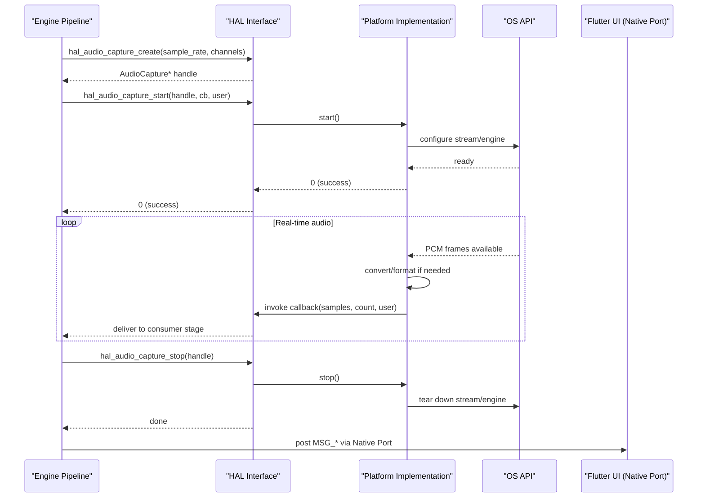
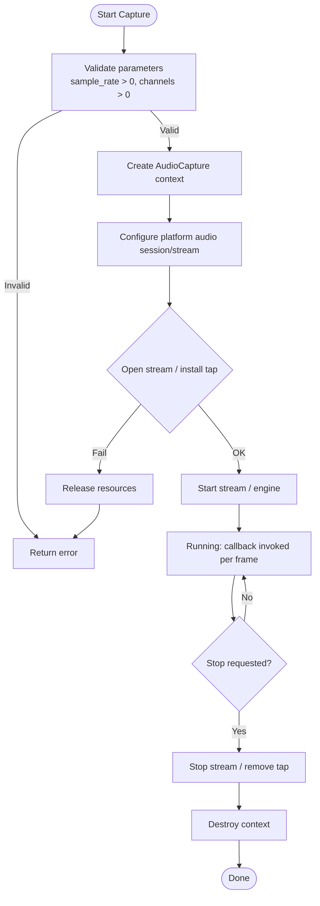
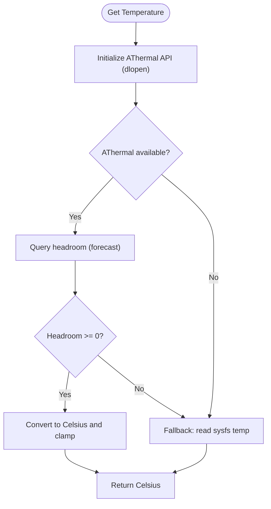
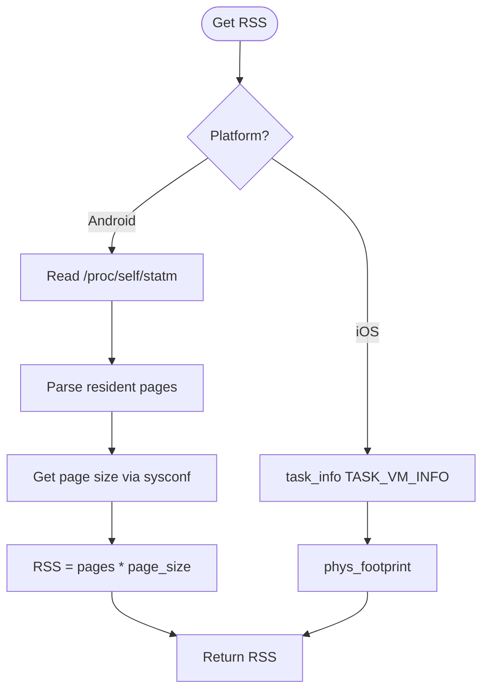
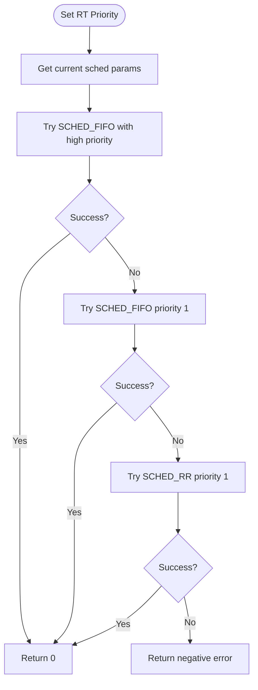
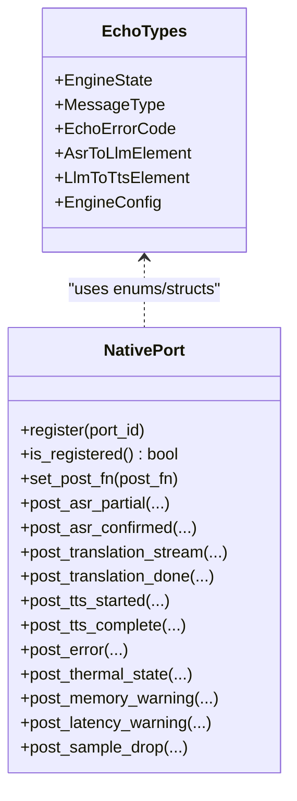
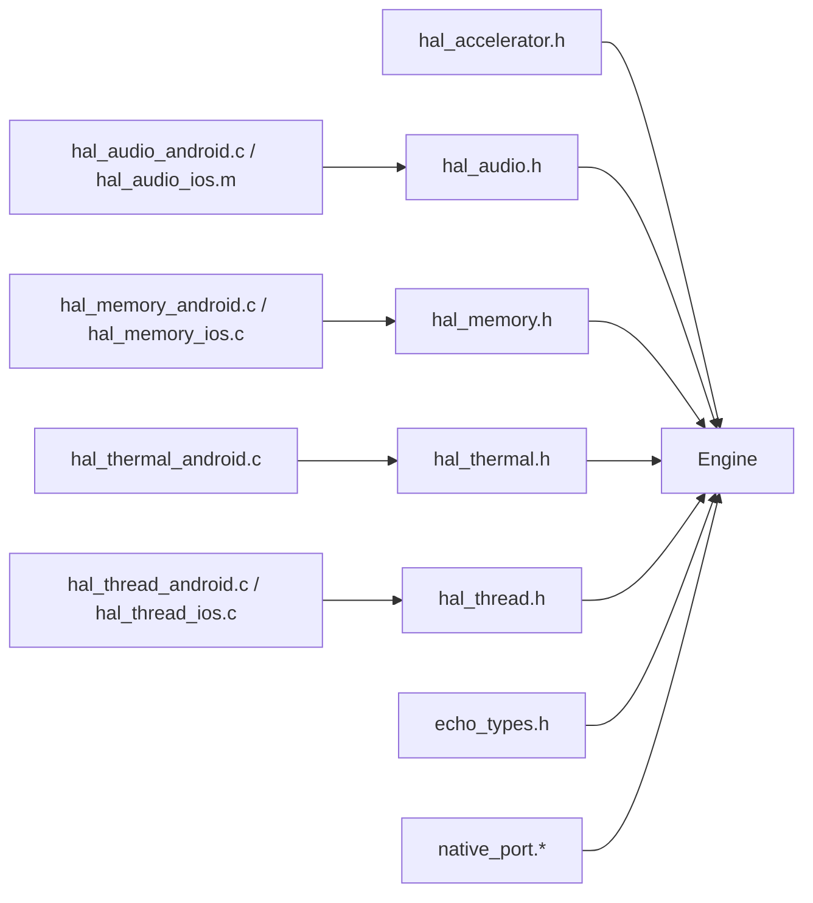

# HAL Architecture Design

<cite>
**Referenced Files in This Document**
- [hal_accelerator.h](file://native/hal/hal_accelerator.h)
- [hal_audio.h](file://native/hal/hal_audio.h)
- [hal_memory.h](file://native/hal/hal_memory.h)
- [hal_thermal.h](file://native/hal/hal_thermal.h)
- [hal_thread.h](file://native/hal/hal_thread.h)
- [hal_audio_android.c](file://native/hal/android/hal_audio_android.c)
- [hal_audio_ios.m](file://native/hal/ios/hal_audio_ios.m)
- [hal_thread_android.c](file://native/hal/android/hal_thread_android.c)
- [hal_thread_ios.c](file://native/hal/ios/hal_thread_ios.c)
- [hal_memory_android.c](file://native/hal/android/hal_memory_android.c)
- [hal_memory_ios.c](file://native/hal/ios/hal_memory_ios.c)
- [hal_thermal_android.c](file://native/hal/android/hal_thermal_android.c)
- [echo_types.h](file://native/include/echo_types.h)
- [native_port.h](file://native/include/native_port.h)
- [native_port.cpp](file://native/src/native_port.cpp)
- [design.md](file://.kiro/specs/qwen-echo/design.md)
- [requirements.md](file://.kiro/specs/qwen-echo/requirements.md)
</cite>

## Table of Contents
1. Introduction
2. Project Structure
3. Core Components
4. Architecture Overview
5. Detailed Component Analysis
6. Dependency Analysis
7. Performance Considerations
8. Troubleshooting Guide
9. Conclusion
10. Appendices

## Introduction
This document explains the Hardware Abstraction Layer (HAL) architecture design principles for QwenEcho. It focuses on the unified interface pattern used across all platform abstractions, including opaque handles, callback-based APIs, and consistent error handling strategies. It also documents design decisions behind C-linkage interfaces, memory management conventions, and thread safety guarantees, and provides guidance for integrating new HAL components into the system.

## Project Structure
The HAL is organized as a set of thin C headers under native/hal that define uniform interfaces, with platform-specific implementations under native/hal/android and native/hal/ios. The engine core uses these HALs to abstract OS-specific features such as audio capture, thermal monitoring, memory usage, thread priority, and hardware acceleration.

**Diagram sources**
- [hal_accelerator.h:1-81](file://native/hal/hal_accelerator.h#L1-L81)
- [hal_audio.h:1-78](file://native/hal/hal_audio.h#L1-L78)
- [hal_memory.h:1-44](file://native/hal/hal_memory.h#L1-L44)
- [hal_thermal.h:1-53](file://native/hal/hal_thermal.h#L1-L53)
- [hal_thread.h:1-35](file://native/hal/hal_thread.h#L1-L35)
- [hal_audio_android.c:1-214](file://native/hal/android/hal_audio_android.c#L1-L214)
- [hal_audio_ios.m:1-297](file://native/hal/ios/hal_audio_ios.m#L1-L297)
- [hal_memory_android.c:1-83](file://native/hal/android/hal_memory_android.c#L1-L83)
- [hal_memory_ios.c:1-58](file://native/hal/ios/hal_memory_ios.c#L1-L58)
- [hal_thermal_android.c:1-207](file://native/hal/android/hal_thermal_android.c#L1-L207)
- [hal_thread_android.c:1-106](file://native/hal/android/hal_thread_android.c#L1-L106)
- [hal_thread_ios.c:1-46](file://native/hal/ios/hal_thread_ios.c#L1-L46)
- [echo_types.h:1-136](file://native/include/echo_types.h#L1-L136)
- [native_port.h:1-179](file://native/include/native_port.h#L1-L179)
- [native_port.cpp:1-320](file://native/src/native_port.cpp#L1-L320)

**Section sources**
- [design.md:404-444](file://.kiro/specs/qwen-echo/design.md#L404-L444)
- [requirements.md:166-179](file://.kiro/specs/qwen-echo/requirements.md#L166-L179)

## Core Components
The HAL exposes five primary modules with consistent patterns:
- Opaque handle types for resource ownership (e.g., AcceleratorContext, AudioCapture).
- Create/start/stop/destroy lifecycle functions.
- Callback-based asynchronous delivery where appropriate (audio samples, thermal events).
- Uniform integer return codes: 0 for success, negative for errors.
- Pure C linkage via extern "C" to ensure FFI compatibility.

Key responsibilities:
- Accelerator: model loading and inference abstraction over NNAPI/Vulkan/CoreML/Metal.
- Audio: low-latency microphone capture with real-time callbacks.
- Memory: RSS sampling and platform-specific budget limits.
- Thermal: temperature polling and optional callback registration.
- Thread: setting real-time scheduling priorities for critical threads.

**Section sources**
- [hal_accelerator.h:19-74](file://native/hal/hal_accelerator.h#L19-L74)
- [hal_audio.h:19-71](file://native/hal/hal_audio.h#L19-L71)
- [hal_memory.h:19-37](file://native/hal/hal_memory.h#L19-L37)
- [hal_thermal.h:17-46](file://native/hal/hal_thermal.h#L17-L46)
- [hal_thread.h:17-28](file://native/hal/hal_thread.h#L17-L28)

## Architecture Overview
The HAL sits between the engine pipeline and platform APIs. All HAL interfaces are pure C with default symbol visibility and extern "C" guards. Platform-specific files implement these interfaces using Android or iOS APIs. The engine integrates HAL results and communicates status/events to the Flutter UI via Native Port messages.

**Diagram sources**
- [hal_audio.h:36-71](file://native/hal/hal_audio.h#L36-L71)
- [hal_audio_android.c:86-175](file://native/hal/android/hal_audio_android.c#L86-L175)
- [hal_audio_ios.m:90-274](file://native/hal/ios/hal_audio_ios.m#L90-L274)
- [native_port.h:96-172](file://native/include/native_port.h#L96-L172)
- [native_port.cpp:116-317](file://native/src/native_port.cpp#L116-L317)

## Detailed Component Analysis

### Unified Interface Pattern
Common patterns across HAL modules:
- Opaque handles: struct declarations without definitions exposed to callers; lifetime managed by create/destroy pairs.
- Callback-based APIs: audio capture and thermal state use function pointers with a user context pointer.
- Error codes: 0 for success, negative integers for failures; NULL returns for object creation failures.
- C linkage: extern "C" guards ensure stable ABI for Dart FFI and cross-language integration.
- Idempotent destroy: destroy functions safely ignore NULL handles.

Examples:
- Accelerator: create/load/infer/destroy with opaque AcceleratorContext.
- Audio: create/start/stop/destroy with opaque AudioCapture and sample callback.
- Memory: simple getters returning size_t values.
- Thermal: getter plus callback registration.
- Thread: single function to elevate calling thread priority.

**Section sources**
- [hal_accelerator.h:29-74](file://native/hal/hal_accelerator.h#L29-L74)
- [hal_audio.h:31-71](file://native/hal/hal_audio.h#L31-L71)
- [hal_memory.h:19-37](file://native/hal/hal_memory.h#L19-L37)
- [hal_thermal.h:17-46](file://native/hal/hal_thermal.h#L17-L46)
- [hal_thread.h:17-28](file://native/hal/hal_thread.h#L17-L28)

### Audio Capture HAL
Responsibilities:
- Configure low-latency input streams.
- Deliver PCM samples via callback from a real-time thread.
- Ensure minimal allocations and no blocking in callbacks.

Android implementation highlights:
- Uses AAudio with low-latency performance mode and exclusive sharing.
- Data callback forwards int16 PCM directly to user callback.
- Error callback logs stream errors; production code may restart stream or switch device.

iOS implementation highlights:
- Uses AVAudioEngine input tap with preferred IO buffer duration for low latency.
- Converts float PCM to int16 before invoking user callback.
- Manages engine lifecycle and tap installation/removal.

Thread safety and real-time constraints:
- Callback runs on platform-managed audio thread; avoid blocking and heap allocation.
- On iOS, captures are stored in block-safe variables before invoking user callback.

**Diagram sources**
- [hal_audio_android.c:101-175](file://native/hal/android/hal_audio_android.c#L101-L175)
- [hal_audio_ios.m:147-274](file://native/hal/ios/hal_audio_ios.m#L147-L274)

**Section sources**
- [hal_audio.h:36-71](file://native/hal/hal_audio.h#L36-L71)
- [hal_audio_android.c:24-82](file://native/hal/android/hal_audio_android.c#L24-L82)
- [hal_audio_android.c:86-211](file://native/hal/android/hal_audio_android.c#L86-L211)
- [hal_audio_ios.m:24-35](file://native/hal/ios/hal_audio_ios.m#L24-L35)
- [hal_audio_ios.m:90-143](file://native/hal/ios/hal_audio_ios.m#L90-L143)
- [hal_audio_ios.m:147-294](file://native/hal/ios/hal_audio_ios.m#L147-L294)

### Thermal Monitoring HAL
Responsibilities:
- Provide current temperature in Celsius.
- Allow registering a callback for thermal state changes.
- Gracefully fall back when advanced APIs are unavailable.

Android specifics:
- Attempts to load AThermal API at runtime via dlopen/dlsym.
- Falls back to sysfs thermal zone reading if AThermal is unavailable or returns errors.
- Converts headroom forecast to approximate Celsius with clamping.

iOS specifics:
- Uses ProcessInfo thermal state notifications conceptually; polling implemented in engine layer.

**Diagram sources**
- [hal_thermal_android.c:159-181](file://native/hal/android/hal_thermal_android.c#L159-L181)
- [hal_thermal_android.c:102-142](file://native/hal/android/hal_thermal_android.c#L102-L142)
- [hal_thermal_android.c:80-94](file://native/hal/android/hal_thermal_android.c#L80-L94)

**Section sources**
- [hal_thermal.h:17-46](file://native/hal/hal_thermal.h#L17-L46)
- [hal_thermal_android.c:159-204](file://native/hal/android/hal_thermal_android.c#L159-L204)

### Memory Monitoring HAL
Responsibilities:
- Report process RSS in bytes.
- Provide platform-specific memory budget limit.

Android specifics:
- Reads /proc/self/statm resident pages and multiplies by page size.
- Returns fixed Android budget (2.5 GB).

iOS specifics:
- Uses task_info TASK_VM_INFO phys_footprint metric.
- Returns fixed iOS budget (2.0 GB).

**Diagram sources**
- [hal_memory_android.c:42-76](file://native/hal/android/hal_memory_android.c#L42-L76)
- [hal_memory_ios.c:30-51](file://native/hal/ios/hal_memory_ios.c#L30-L51)

**Section sources**
- [hal_memory.h:19-37](file://native/hal/hal_memory.h#L19-L37)
- [hal_memory_android.c:42-80](file://native/hal/android/hal_memory_android.c#L42-L80)
- [hal_memory_ios.c:30-55](file://native/hal/ios/hal_memory_ios.c#L30-L55)

### Thread Priority HAL
Responsibilities:
- Elevate calling thread to highest available real-time priority class.

Android specifics:
- Sets SCHED_FIFO with elevated priority; falls back to lower priority or SCHED_RR if denied.

iOS specifics:
- Sets QOS_CLASS_USER_INTERACTIVE via pthread QoS extension.

**Diagram sources**
- [hal_thread_android.c:48-103](file://native/hal/android/hal_thread_android.c#L48-L103)

**Section sources**
- [hal_thread.h:17-28](file://native/hal/hal_thread.h#L17-L28)
- [hal_thread_android.c:48-103](file://native/hal/android/hal_thread_android.c#L48-L103)
- [hal_thread_ios.c:20-43](file://native/hal/ios/hal_thread_ios.c#L20-L43)

### Accelerator HAL
Responsibilities:
- Abstract NPU/GPU inference across platforms.
- Manage model loading and inference sessions with opaque contexts.

Design notes:
- Supports multiple model types (ASR, LLM, TTS).
- Provides create/load/infer/destroy lifecycle.
- CPU fallback strategy is documented in comments.

**Section sources**
- [hal_accelerator.h:19-74](file://native/hal/hal_accelerator.h#L19-L74)

### Engine Integration and Messaging
The engine coordinates HAL usage and posts structured messages to the Flutter UI via Native Port. Message types and payloads are defined centrally and serialized consistently.

**Diagram sources**
- [echo_types.h:17-129](file://native/include/echo_types.h#L17-L129)
- [native_port.h:69-172](file://native/include/native_port.h#L69-L172)
- [native_port.cpp:38-75](file://native/src/native_port.cpp#L38-L75)

**Section sources**
- [echo_types.h:17-129](file://native/include/echo_types.h#L17-L129)
- [native_port.h:69-172](file://native/include/native_port.h#L69-L172)
- [native_port.cpp:116-317](file://native/src/native_port.cpp#L116-L317)

## Dependency Analysis
HAL modules depend only on their public headers and platform SDKs. The engine depends on HAL headers and uses them through opaque handles. Messaging depends on echo_types and native_port.

**Diagram sources**
- [hal_accelerator.h:1-81](file://native/hal/hal_accelerator.h#L1-L81)
- [hal_audio.h:1-78](file://native/hal/hal_audio.h#L1-L78)
- [hal_memory.h:1-44](file://native/hal/hal_memory.h#L1-L44)
- [hal_thermal.h:1-53](file://native/hal/hal_thermal.h#L1-L53)
- [hal_thread.h:1-35](file://native/hal/hal_thread.h#L1-L35)
- [hal_audio_android.c:1-214](file://native/hal/android/hal_audio_android.c#L1-L214)
- [hal_audio_ios.m:1-297](file://native/hal/ios/hal_audio_ios.m#L1-L297)
- [hal_memory_android.c:1-83](file://native/hal/android/hal_memory_android.c#L1-L83)
- [hal_memory_ios.c:1-58](file://native/hal/ios/hal_memory_ios.c#L1-L58)
- [hal_thermal_android.c:1-207](file://native/hal/android/hal_thermal_android.c#L1-L207)
- [hal_thread_android.c:1-106](file://native/hal/android/hal_thread_android.c#L1-L106)
- [hal_thread_ios.c:1-46](file://native/hal/ios/hal_thread_ios.c#L1-L46)
- [echo_types.h:1-136](file://native/include/echo_types.h#L1-L136)
- [native_port.h:1-179](file://native/include/native_port.h#L1-L179)
- [native_port.cpp:1-320](file://native/src/native_port.cpp#L1-L320)

**Section sources**
- [design.md:404-444](file://.kiro/specs/qwen-echo/design.md#L404-L444)

## Performance Considerations
- Real-time audio path avoids blocking and heap allocation in callbacks; prefer stack buffers for small conversions.
- Use lock-free ring buffers and bounded queues for inter-stage communication to minimize contention.
- Prefer low-latency platform modes (AAudio low-latency, AVAudioEngine short IO buffer).
- Apply real-time scheduling to audio collector threads to reduce jitter.
- Monitor memory and thermal conditions to adapt performance (context window size, sample rate).

[No sources needed since this section provides general guidance]

## Troubleshooting Guide
Common issues and diagnostics:
- Audio capture failures: check stream open/start errors and callback invocation; verify permissions and device availability.
- Thermal readings unavailable: confirm AThermal availability and sysfs access; inspect fallback behavior.
- Memory pressure: compare RSS against platform limits; trigger mitigation levels as specified.
- Thread priority elevation: handle permission denials gracefully and log fallbacks.
- Messaging not received: ensure Native Port is registered and post function is set.

**Section sources**
- [hal_audio_android.c:70-82](file://native/hal/android/hal_audio_android.c#L70-L82)
- [hal_audio_android.c:143-175](file://native/hal/android/hal_audio_android.c#L143-L175)
- [hal_thermal_android.c:169-181](file://native/hal/android/hal_thermal_android.c#L169-L181)
- [hal_memory_android.c:44-76](file://native/hal/android/hal_memory_android.c#L44-L76)
- [hal_thread_android.c:64-99](file://native/hal/android/hal_thread_android.c#L64-L99)
- [native_port.cpp:62-75](file://native/src/native_port.cpp#L62-L75)

## Conclusion
QwenEcho’s HAL design emphasizes simplicity, portability, and predictability:
- Uniform C-linkage interfaces with opaque handles and callback-driven data flow.
- Consistent error reporting and idempotent lifecycle management.
- Clear separation between platform-specific implementations and engine logic.
- Robust fallbacks and graceful degradation for robustness across devices.

Adhering to these patterns ensures maintainable extensions and reliable operation on Android and iOS.

[No sources needed since this section summarizes without analyzing specific files]

## Appendices

### Design Decisions Summary
- C-linkage interfaces: enable direct FFI integration and cross-language stability.
- Opaque handles: encapsulate platform details and enforce RAII-like lifecycle via explicit create/destroy.
- Callback-based APIs: decouple producers and consumers while maintaining low latency.
- Negative integer error codes: provide clear, portable error signaling.
- Memory management: caller owns objects returned by create functions; destroy releases resources; NULL-safe destroy.
- Thread safety: callbacks run on platform-managed real-time threads; avoid blocking and allocate minimally.

**Section sources**
- [hal_accelerator.h:15-17](file://native/hal/hal_accelerator.h#L15-L17)
- [hal_audio.h:15-17](file://native/hal/hal_audio.h#L15-L17)
- [hal_memory.h:15-17](file://native/hal/hal_memory.h#L15-L17)
- [hal_thermal.h:13-15](file://native/hal/hal_thermal.h#L13-L15)
- [hal_thread.h:13-15](file://native/hal/hal_thread.h#L13-L15)

### How to Add a New HAL Component
Steps:
1. Define a header under native/hal with:
   - extern "C" guards.
   - Opaque handle typedef (if applicable).
   - Function prototypes following create/start/stop/destroy or query patterns.
   - Consistent error codes (0 success, negative failure).
2. Implement platform-specific files:
   - native/hal/android/<component>_android.c
   - native/hal/ios/<component>_ios.c
   - Include the shared header and implement functions.
3. Integrate into the engine:
   - Use opaque handles and follow lifecycle rules.
   - Post events via Native Port if needed.
4. Update build configuration:
   - Add source files to Android/iOS builds.
   - Ensure symbols are exported with default visibility.

Guidelines:
- Keep callbacks non-blocking and free of heavy allocations.
- Provide safe NULL handling in destroy functions.
- Log platform-specific errors for diagnostics.
- Test both Android and iOS paths thoroughly.

**Section sources**
- [hal_audio.h:36-71](file://native/hal/hal_audio.h#L36-L71)
- [hal_accelerator.h:29-74](file://native/hal/hal_accelerator.h#L29-L74)
- [hal_thermal.h:17-46](file://native/hal/hal_thermal.h#L17-L46)
- [hal_memory.h:19-37](file://native/hal/hal_memory.h#L19-L37)
- [hal_thread.h:17-28](file://native/hal/hal_thread.h#L17-L28)
- [native_port.h:69-172](file://native/include/native_port.h#L69-L172)