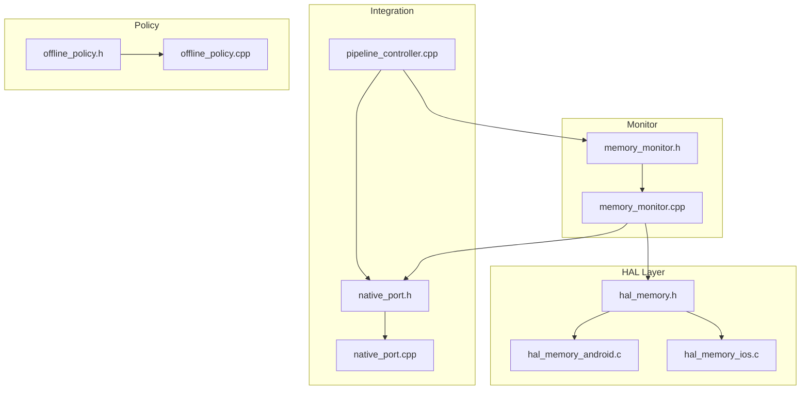
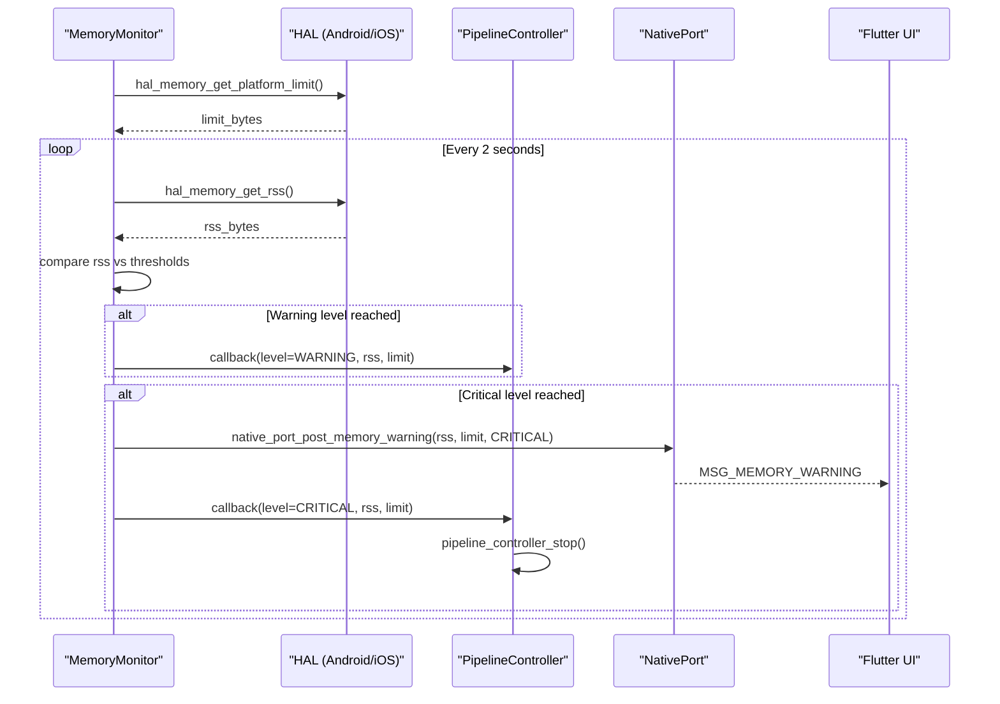
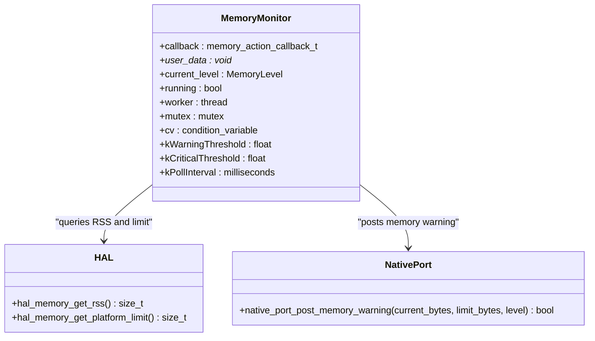
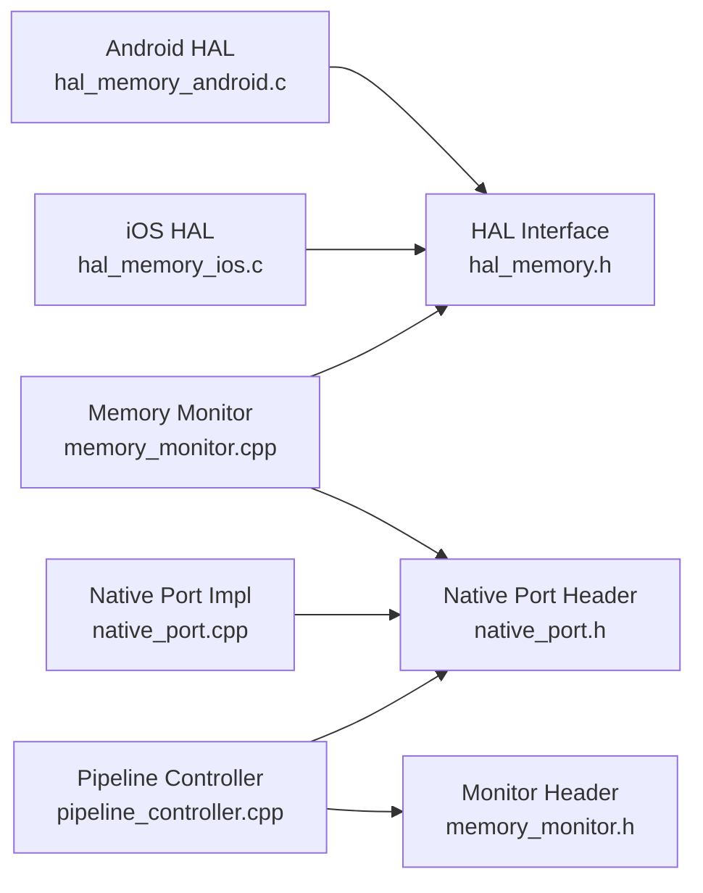

# Memory HAL Implementation

<cite>
**Referenced Files in This Document**
- [hal_memory.h](file://native/hal/hal_memory.h)
- [hal_memory_android.c](file://native/hal/android/hal_memory_android.c)
- [hal_memory_ios.c](file://native/hal/ios/hal_memory_ios.c)
- [memory_monitor.h](file://native/include/memory_monitor.h)
- [memory_monitor.cpp](file://native/src/memory_monitor.cpp)
- [pipeline_controller.cpp](file://native/src/pipeline_controller.cpp)
- [native_port.h](file://native/include/native_port.h)
- [native_port.cpp](file://native/src/native_port.cpp)
- [offline_policy.h](file://native/include/offline_policy.h)
- [offline_policy.cpp](file://native/src/offline_policy.cpp)
</cite>

## Table of Contents
1. [Introduction](#introduction)
2. [Project Structure](#project-structure)
3. [Core Components](#core-components)
4. [Architecture Overview](#architecture-overview)
5. [Detailed Component Analysis](#detailed-component-analysis)
6. [Dependency Analysis](#dependency-analysis)
7. [Performance Considerations](#performance-considerations)
8. [Troubleshooting Guide](#troubleshooting-guide)
9. [Conclusion](#conclusion)

## Introduction
This document describes the Memory HAL component responsible for process memory monitoring and management across Android and iOS. It covers:
- RSS (Resident Set Size) monitoring via platform-specific backends
- Platform memory budget enforcement
- Two-level memory pressure detection with progressive cleanup strategies
- Integration with the offline policy system to ensure safe, resource-conscious operation

The implementation provides a consistent C interface that abstracts platform differences while enabling higher-level components to react to memory pressure events.

## Project Structure
The Memory HAL is implemented as a thin abstraction layer over platform APIs, with a cross-platform monitor that enforces thresholds and coordinates mitigation actions.

**Diagram sources**
- [hal_memory.h:1-44](file://native/hal/hal_memory.h#L1-L44)
- [hal_memory_android.c:1-83](file://native/hal/android/hal_memory_android.c#L1-L83)
- [hal_memory_ios.c:1-58](file://native/hal/ios/hal_memory_ios.c#L1-L58)
- [memory_monitor.h:1-108](file://native/include/memory_monitor.h#L1-L108)
- [memory_monitor.cpp:1-187](file://native/src/memory_monitor.cpp#L1-L187)
- [pipeline_controller.cpp:1-488](file://native/src/pipeline_controller.cpp#L1-L488)
- [native_port.h:1-179](file://native/include/native_port.h#L1-L179)
- [native_port.cpp:1-320](file://native/src/native_port.cpp#L1-L320)
- [offline_policy.h:1-121](file://native/include/offline_policy.h#L1-L121)
- [offline_policy.cpp:1-219](file://native/src/offline_policy.cpp#L1-L219)

**Section sources**
- [hal_memory.h:1-44](file://native/hal/hal_memory.h#L1-L44)
- [memory_monitor.h:1-108](file://native/include/memory_monitor.h#L1-L108)

## Core Components
- HAL Interface: Defines cross-platform functions to read RSS and obtain platform memory limits.
- Android Backend: Reads /proc/self/statm to compute RSS using page size.
- iOS Backend: Uses mach task_info TASK_VM_INFO to retrieve phys_footprint.
- Memory Monitor: Periodically samples RSS, applies hysteresis-based thresholds, and invokes callbacks.
- Native Port: Posts structured memory warning messages to the UI layer.
- Pipeline Controller: Integrates the monitor into the pipeline lifecycle and triggers graceful stop on critical pressure.
- Offline Policy: Ensures no network dependencies are present; complements resource safety by constraining runtime behavior.

Key responsibilities:
- Provide accurate RSS metrics per platform
- Enforce platform-appropriate memory budgets
- Trigger progressive mitigation at defined thresholds
- Communicate warnings to the UI and orchestrate graceful shutdown when needed

**Section sources**
- [hal_memory.h:19-37](file://native/hal/hal_memory.h#L19-L37)
- [hal_memory_android.c:32-80](file://native/hal/android/hal_memory_android.c#L32-L80)
- [hal_memory_ios.c:21-55](file://native/hal/ios/hal_memory_ios.c#L21-L55)
- [memory_monitor.h:22-42](file://native/include/memory_monitor.h#L22-L42)
- [memory_monitor.cpp:33-53](file://native/src/memory_monitor.cpp#L33-L53)
- [native_port.h:154-159](file://native/include/native_port.h#L154-L159)
- [pipeline_controller.cpp:162-177](file://native/src/pipeline_controller.cpp#L162-L177)

## Architecture Overview
The memory monitoring architecture consists of:
- A platform-agnostic HAL exposing RSS and limit queries
- A background monitor thread sampling RSS and applying thresholds
- An integration point in the pipeline controller to act on critical pressure
- A messaging channel to notify the UI about memory warnings

**Diagram sources**
- [memory_monitor.cpp:59-116](file://native/src/memory_monitor.cpp#L59-L116)
- [hal_memory_android.c:42-80](file://native/hal/android/hal_memory_android.c#L42-L80)
- [hal_memory_ios.c:30-55](file://native/hal/ios/hal_memory_ios.c#L30-L55)
- [native_port.cpp:264-281](file://native/src/native_port.cpp#L264-L281)
- [pipeline_controller.cpp:162-177](file://native/src/pipeline_controller.cpp#L162-L177)

## Detailed Component Analysis

### HAL Interface
The HAL defines two primary functions:
- RSS retrieval: returns current process resident memory in bytes
- Platform limit: returns maximum recommended memory usage for the engine

These functions are implemented separately for Android and iOS, allowing the same API surface across platforms.

**Section sources**
- [hal_memory.h:19-37](file://native/hal/hal_memory.h#L19-L37)

### Android Backend (/proc/self/statm)
- Reads the second field from /proc/self/statm representing resident pages
- Converts pages to bytes using sysconf(_SC_PAGESIZE), with a fallback to standard page size
- Returns 0 on failure paths (e.g., file open or parse errors)
- Provides a fixed platform limit constant for Android

Implementation characteristics:
- Minimal overhead: single file read and integer arithmetic
- Robustness: guards against parsing failures and invalid page sizes
- Deterministic: uses well-defined procfs fields

**Section sources**
- [hal_memory_android.c:42-80](file://native/hal/android/hal_memory_android.c#L42-L80)

### iOS Backend (mach_vm/task_info)
- Uses task_info with TASK_VM_INFO to query process memory info
- Retrieves phys_footprint, which reflects actual physical memory used including compressed and purgeable memory
- Returns 0 if the mach call fails
- Provides a fixed platform limit constant for iOS

Implementation characteristics:
- Accurate metric aligned with Jetsam’s enforcement model
- Pure C implementation without Objective-C dependency
- Low overhead: single mach call

**Section sources**
- [hal_memory_ios.c:30-55](file://native/hal/ios/hal_memory_ios.c#L30-L55)

### Memory Monitor
Responsibilities:
- Create/start/stop a low-priority background thread
- Sample RSS every 2 seconds via HAL
- Compute thresholds based on platform limit
- Apply upward-only hysteresis to avoid flapping between levels
- Invoke user callback on transitions
- Post memory warning message to UI when critical

Thresholds and behavior:
- Warning threshold: 85% of platform limit
- Critical threshold: 95% of platform limit
- On critical: post MSG_MEMORY_WARNING and trigger pipeline stop via callback

Thread-safety:
- Atomic state for current level and running flag
- Condition variable for efficient sleep/wakeup

**Section sources**
- [memory_monitor.h:22-42](file://native/include/memory_monitor.h#L22-L42)
- [memory_monitor.cpp:33-53](file://native/src/memory_monitor.cpp#L33-L53)
- [memory_monitor.cpp:59-116](file://native/src/memory_monitor.cpp#L59-L116)
- [memory_monitor.cpp:124-184](file://native/src/memory_monitor.cpp#L124-L184)

#### Class Diagram

**Diagram sources**
- [memory_monitor.cpp:33-53](file://native/src/memory_monitor.cpp#L33-L53)
- [hal_memory.h:19-37](file://native/hal/hal_memory.h#L19-L37)
- [native_port.h:154-159](file://native/include/native_port.h#L154-L159)

### Progressive Cleanup Strategies
The design specifies two levels of mitigation:
- Level 1 (85%): release LLM KV caches and TTS output buffers
- Level 2 (95%): graceful pipeline stop and UI notification

Current integration:
- The monitor invokes a callback with the new level
- The pipeline controller reacts to critical level by stopping the pipeline
- The monitor posts a memory warning message to the UI

Note: The specific cache-release logic for Level 1 is intended to be implemented by the callback handler (e.g., within stages or managers). The monitor itself does not directly free stage resources.

**Section sources**
- [memory_monitor.h:5-11](file://native/include/memory_monitor.h#L5-L11)
- [pipeline_controller.cpp:162-177](file://native/src/pipeline_controller.cpp#L162-L177)
- [native_port.cpp:264-281](file://native/src/native_port.cpp#L264-L281)

### Memory Budget Enforcement
Platform limits:
- Android: 2.5 GB
- iOS: 2.0 GB

These values are returned by the HAL and used by the monitor to compute absolute thresholds. The monitor ensures that actions are taken only when RSS exceeds these percentages of the platform limit.

**Section sources**
- [hal_memory_android.c:35-38](file://native/hal/android/hal_memory_android.c#L35-L38)
- [hal_memory_ios.c:21-28](file://native/hal/ios/hal_memory_ios.c#L21-L28)
- [memory_monitor.cpp:61-71](file://native/src/memory_monitor.cpp#L61-L71)

### Integration with Offline Policy System
The offline policy module enforces strict air-gapped operation:
- Compile-time symbol poisoning prevents accidental use of networking APIs
- Runtime checks verify absence of network libraries and validate sandboxed model paths
- No telemetry, analytics, crash reporting, or update checks

While not directly part of memory management, this policy complements resource safety by ensuring the engine operates without external dependencies that could introduce uncontrolled memory or CPU usage.

**Section sources**
- [offline_policy.h:31-84](file://native/include/offline_policy.h#L31-L84)
- [offline_policy.cpp:155-218](file://native/src/offline_policy.cpp#L155-L218)

## Dependency Analysis
The following diagram shows key dependencies among memory-related components:

**Diagram sources**
- [hal_memory_android.c:1-83](file://native/hal/android/hal_memory_android.c#L1-L83)
- [hal_memory_ios.c:1-58](file://native/hal/ios/hal_memory_ios.c#L1-L58)
- [hal_memory.h:1-44](file://native/hal/hal_memory.h#L1-L44)
- [memory_monitor.cpp:1-187](file://native/src/memory_monitor.cpp#L1-L187)
- [native_port.h:1-179](file://native/include/native_port.h#L1-L179)
- [native_port.cpp:1-320](file://native/src/native_port.cpp#L1-L320)
- [pipeline_controller.cpp:1-488](file://native/src/pipeline_controller.cpp#L1-L488)
- [memory_monitor.h:1-108](file://native/include/memory_monitor.h#L1-L108)

**Section sources**
- [memory_monitor.cpp:16-21](file://native/src/memory_monitor.cpp#L16-L21)
- [pipeline_controller.cpp:362-380](file://native/src/pipeline_controller.cpp#L362-L380)

## Performance Considerations
- Sampling interval: 2 seconds balances responsiveness with minimal overhead
- Upward-only hysteresis reduces callback churn and avoids repeated mitigations
- Page-size resolution on Android accounts for modern devices with larger pages
- iOS phys_footprint aligns with OS-level memory accounting, improving accuracy
- Background thread runs at normal priority to minimize impact on audio processing latency

[No sources needed since this section provides general guidance]

## Troubleshooting Guide
Common issues and diagnostics:
- RSS returns zero: indicates HAL read failure (e.g., procfs unavailable or mach call error). Check platform backend logs and permissions.
- No memory warnings received: ensure the monitor is started and the Dart port is registered before starting the pipeline.
- Critical level triggers unexpected stops: verify thresholds and platform limits; confirm callback registration and pipeline state.
- UI not receiving MSG_MEMORY_WARNING: ensure native_port_register has been called and the post function pointer is set.

Operational tips:
- Validate platform limits match device capabilities
- Log RSS and thresholds during development to tune thresholds
- Ensure graceful stop completes within the deadline by draining queues and joining threads

**Section sources**
- [hal_memory_android.c:42-76](file://native/hal/android/hal_memory_android.c#L42-L76)
- [hal_memory_ios.c:30-51](file://native/hal/ios/hal_memory_ios.c#L30-L51)
- [memory_monitor.cpp:59-116](file://native/src/memory_monitor.cpp#L59-L116)
- [native_port.cpp:38-52](file://native/src/native_port.cpp#L38-L52)
- [pipeline_controller.cpp:395-469](file://native/src/pipeline_controller.cpp#L395-L469)

## Conclusion
The Memory HAL provides a robust, cross-platform foundation for process memory monitoring and management. By abstracting platform specifics behind a simple interface and integrating with a threshold-driven monitor, the system can proactively mitigate memory pressure through progressive cleanup and graceful shutdown. Combined with the offline policy enforcement, it ensures safe, predictable resource usage across Android and iOS environments.