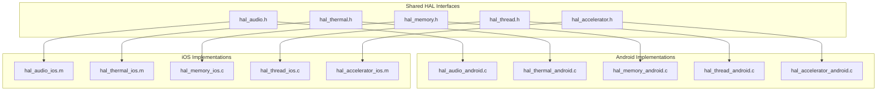
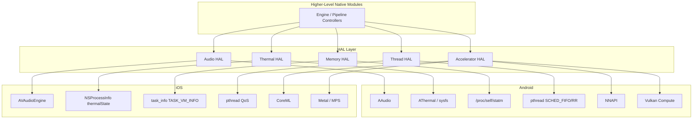
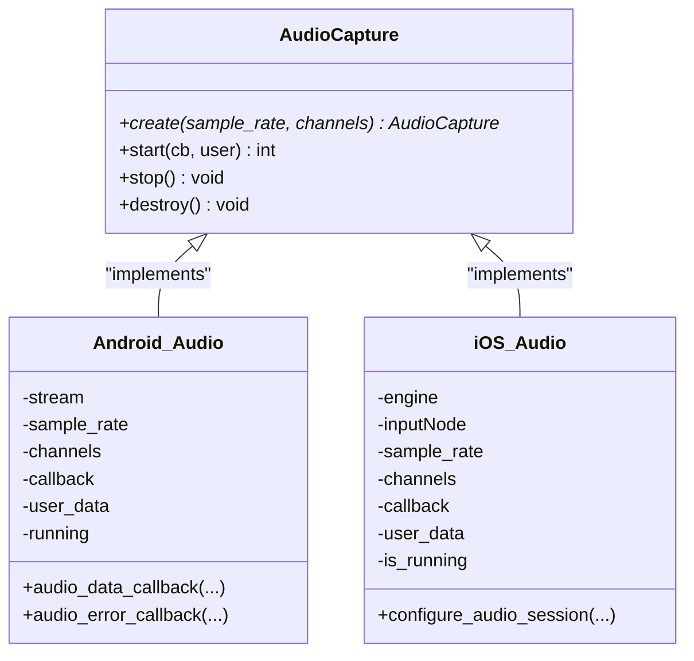
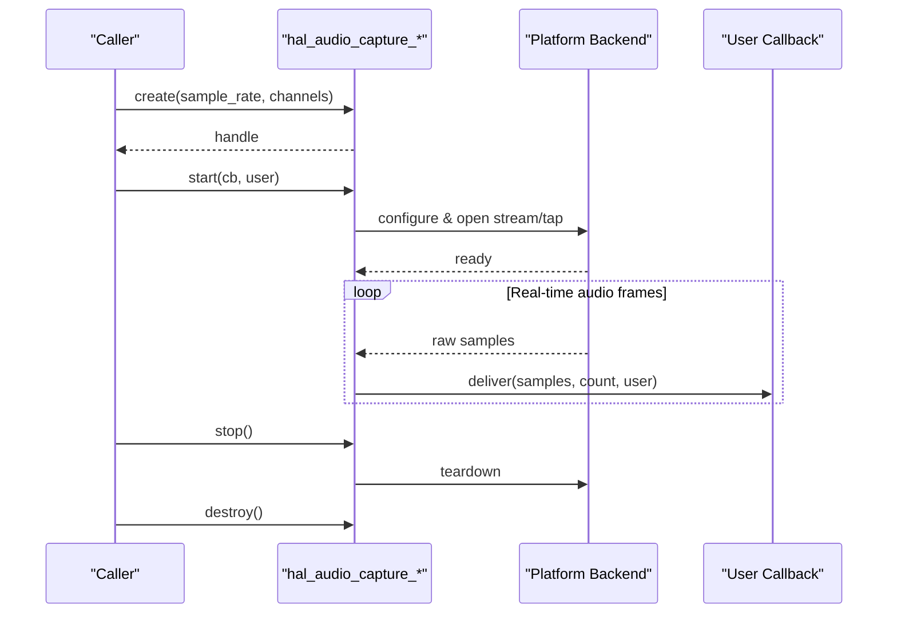
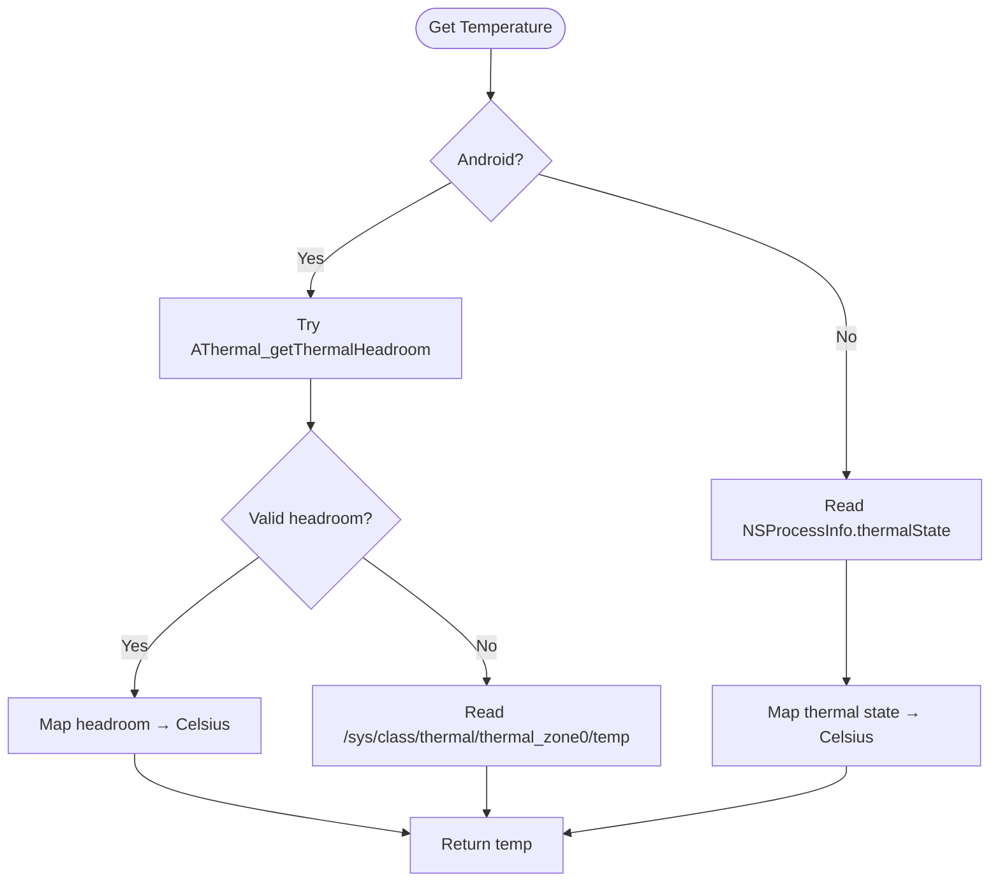
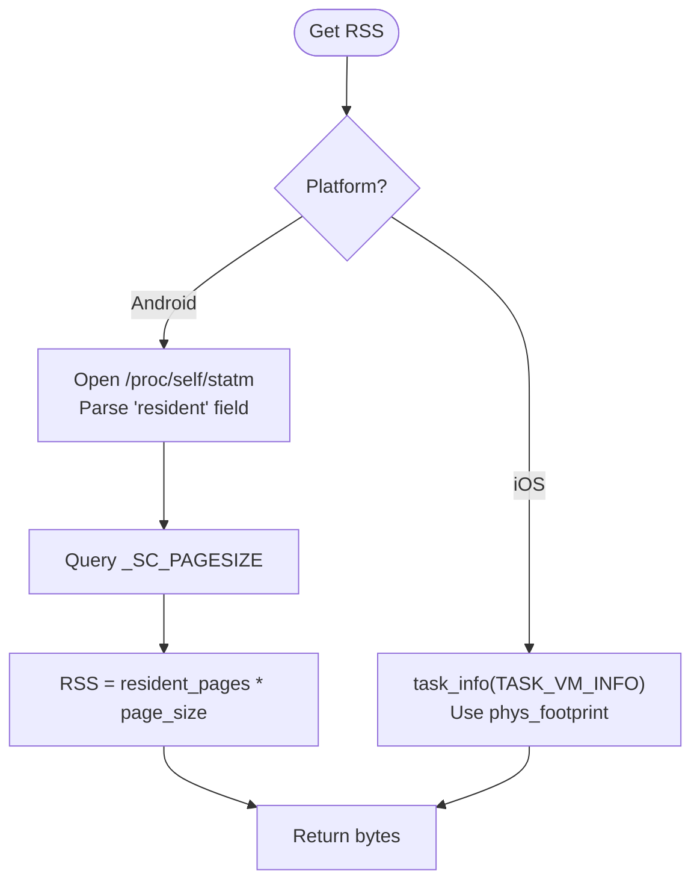
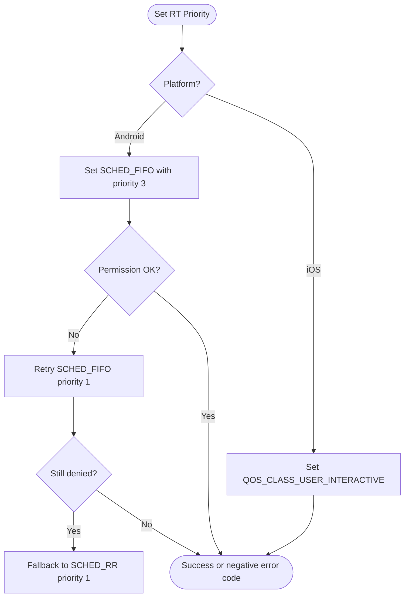
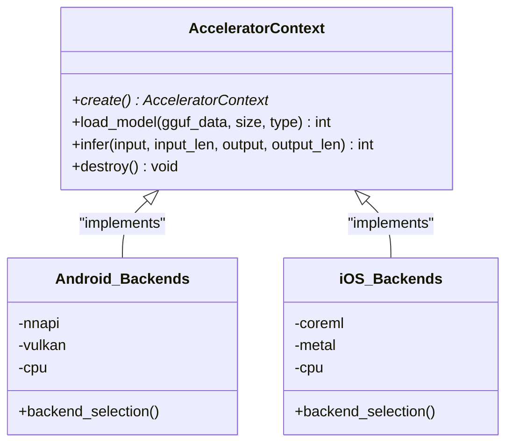
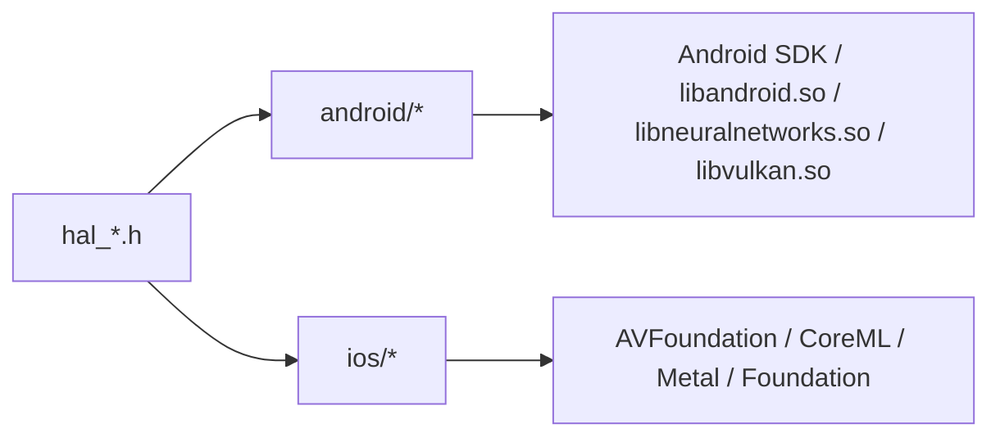

# Platform Abstraction Layer (HAL)

<cite>
**Referenced Files in This Document**
- [hal_audio.h](file://native/hal/hal_audio.h)
- [hal_thermal.h](file://native/hal/hal_thermal.h)
- [hal_memory.h](file://native/hal/hal_memory.h)
- [hal_thread.h](file://native/hal/hal_thread.h)
- [hal_accelerator.h](file://native/hal/hal_accelerator.h)
- [hal_audio_android.c](file://native/hal/android/hal_audio_android.c)
- [hal_audio_ios.m](file://native/hal/ios/hal_audio_ios.m)
- [hal_thermal_android.c](file://native/hal/android/hal_thermal_android.c)
- [hal_thermal_ios.m](file://native/hal/ios/hal_thermal_ios.m)
- [hal_memory_android.c](file://native/hal/android/hal_memory_android.c)
- [hal_memory_ios.c](file://native/hal/ios/hal_memory_ios.c)
- [hal_thread_android.c](file://native/hal/android/hal_thread_android.c)
- [hal_thread_ios.c](file://native/hal/ios/hal_thread_ios.c)
- [hal_accelerator_android.c](file://native/hal/android/hal_accelerator_android.c)
- [hal_accelerator_ios.m](file://native/hal/ios/hal_accelerator_ios.m)
</cite>

## Table of Contents
1. [Introduction](#introduction)
2. [Project Structure](#project-structure)
3. [Core Components](#core-components)
4. [Architecture Overview](#architecture-overview)
5. [Detailed Component Analysis](#detailed-component-analysis)
6. [Dependency Analysis](#dependency-analysis)
7. [Performance Considerations](#performance-considerations)
8. [Troubleshooting Guide](#troubleshooting-guide)
9. [Conclusion](#conclusion)
10. [Appendices](#appendices)

## Introduction
This document explains QwenEcho’s Platform Abstraction Layer (HAL), which provides cross-platform compatibility for Android and iOS. The HAL defines unified C interfaces that hide platform-specific details behind consistent APIs. It covers:
- Audio HAL: microphone capture using AAudio on Android and AVAudioEngine on iOS
- Thermal HAL: temperature monitoring via AThermal/sysfs on Android and ProcessInfo thermal state on iOS
- Memory HAL: RSS monitoring with platform limits and guidance for progressive mitigation
- Thread HAL: real-time priority management for low-latency audio threads
- Accelerator HAL: NPU/GPU inference backends with CPU fallback

The goal is to enable a single codebase to run efficiently across platforms while preserving predictable behavior and performance characteristics.

## Project Structure
The HAL layer is organized by feature with shared headers and per-platform implementations:
- Shared headers define the public API surface
- Android and iOS directories contain platform-specific implementations
- Higher-level native modules consume these HALs through stable interfaces

**Diagram sources**
- [hal_audio.h:1-78](file://native/hal/hal_audio.h#L1-L78)
- [hal_thermal.h:1-53](file://native/hal/hal_thermal.h#L1-L53)
- [hal_memory.h:1-44](file://native/hal/hal_memory.h#L1-L44)
- [hal_thread.h:1-35](file://native/hal/hal_thread.h#L1-L35)
- [hal_accelerator.h:1-81](file://native/hal/hal_accelerator.h#L1-L81)
- [hal_audio_android.c:1-214](file://native/hal/android/hal_audio_android.c#L1-L214)
- [hal_audio_ios.m:1-297](file://native/hal/ios/hal_audio_ios.m#L1-L297)
- [hal_thermal_android.c:1-207](file://native/hal/android/hal_thermal_android.c#L1-L207)
- [hal_thermal_ios.m:1-113](file://native/hal/ios/hal_thermal_ios.m#L1-L113)
- [hal_memory_android.c:1-83](file://native/hal/android/hal_memory_android.c#L1-L83)
- [hal_memory_ios.c:1-58](file://native/hal/ios/hal_memory_ios.c#L1-L58)
- [hal_thread_android.c:1-106](file://native/hal/android/hal_thread_android.c#L1-L106)
- [hal_thread_ios.c:1-46](file://native/hal/ios/hal_thread_ios.c#L1-L46)
- [hal_accelerator_android.c:1-496](file://native/hal/android/hal_accelerator_android.c#L1-L496)
- [hal_accelerator_ios.m:1-401](file://native/hal/ios/hal_accelerator_ios.m#L1-L401)

**Section sources**
- [hal_audio.h:1-78](file://native/hal/hal_audio.h#L1-L78)
- [hal_thermal.h:1-53](file://native/hal/hal_thermal.h#L1-L53)
- [hal_memory.h:1-44](file://native/hal/hal_memory.h#L1-L44)
- [hal_thread.h:1-35](file://native/hal/hal_thread.h#L1-L35)
- [hal_accelerator.h:1-81](file://native/hal/hal_accelerator.h#L1-L81)

## Core Components
- Audio HAL: Provides create/start/stop/destroy lifecycle for microphone capture, delivering PCM samples via callback from a real-time thread.
- Thermal HAL: Exposes polling and optional callback registration for thermal state changes; returns approximate Celsius values.
- Memory HAL: Returns process RSS and platform-specific memory budget limits.
- Thread HAL: Elevates calling thread to real-time or highest-priority class suitable for audio capture.
- Accelerator HAL: Loads GGUF models and runs inference via NNAPI/Vulkan/CPU on Android or CoreML/Metal/CPU on iOS, with automatic fallback.

Key design principles:
- Stable C ABI across platforms
- Minimal allocations in real-time paths
- Graceful degradation when hardware features are unavailable
- Clear error codes and logging for diagnostics

**Section sources**
- [hal_audio.h:1-78](file://native/hal/hal_audio.h#L1-L78)
- [hal_thermal.h:1-53](file://native/hal/hal_thermal.h#L1-L53)
- [hal_memory.h:1-44](file://native/hal/hal_memory.h#L1-L44)
- [hal_thread.h:1-35](file://native/hal/hal_thread.h#L1-L35)
- [hal_accelerator.h:1-81](file://native/hal/hal_accelerator.h#L1-L81)

## Architecture Overview
The HAL sits between platform SDKs and higher-level native modules. Each HAL abstracts platform differences behind a common interface.

**Diagram sources**
- [hal_audio.h:1-78](file://native/hal/hal_audio.h#L1-L78)
- [hal_thermal.h:1-53](file://native/hal/hal_thermal.h#L1-L53)
- [hal_memory.h:1-44](file://native/hal/hal_memory.h#L1-L44)
- [hal_thread.h:1-35](file://native/hal/hal_thread.h#L1-L35)
- [hal_accelerator.h:1-81](file://native/hal/hal_accelerator.h#L1-L81)
- [hal_audio_android.c:1-214](file://native/hal/android/hal_audio_android.c#L1-L214)
- [hal_audio_ios.m:1-297](file://native/hal/ios/hal_audio_ios.m#L1-L297)
- [hal_thermal_android.c:1-207](file://native/hal/android/hal_thermal_android.c#L1-L207)
- [hal_thermal_ios.m:1-113](file://native/hal/ios/hal_thermal_ios.m#L1-L113)
- [hal_memory_android.c:1-83](file://native/hal/android/hal_memory_android.c#L1-L83)
- [hal_memory_ios.c:1-58](file://native/hal/ios/hal_memory_ios.c#L1-L58)
- [hal_thread_android.c:1-106](file://native/hal/android/hal_thread_android.c#L1-L106)
- [hal_thread_ios.c:1-46](file://native/hal/ios/hal_thread_ios.c#L1-L46)
- [hal_accelerator_android.c:1-496](file://native/hal/android/hal_accelerator_android.c#L1-L496)
- [hal_accelerator_ios.m:1-401](file://native/hal/ios/hal_accelerator_ios.m#L1-L401)

## Detailed Component Analysis

### Audio HAL
Unified interface for microphone capture with platform-specific backends:
- Android: AAudio low-latency input stream with exclusive sharing and callback mode
- iOS: AVAudioEngine input node tap with session configuration for low latency

**Diagram sources**
- [hal_audio.h:1-78](file://native/hal/hal_audio.h#L1-L78)
- [hal_audio_android.c:1-214](file://native/hal/android/hal_audio_android.c#L1-L214)
- [hal_audio_ios.m:1-297](file://native/hal/ios/hal_audio_ios.m#L1-L297)

Key behaviors:
- Callback-based delivery of PCM samples from a real-time thread
- Strict constraints: avoid blocking or allocation in callbacks
- Error handling via return codes and logs

**Diagram sources**
- [hal_audio.h:1-78](file://native/hal/hal_audio.h#L1-L78)
- [hal_audio_android.c:1-214](file://native/hal/android/hal_audio_android.c#L1-L214)
- [hal_audio_ios.m:1-297](file://native/hal/ios/hal_audio_ios.m#L1-L297)

**Section sources**
- [hal_audio.h:1-78](file://native/hal/hal_audio.h#L1-L78)
- [hal_audio_android.c:1-214](file://native/hal/android/hal_audio_android.c#L1-L214)
- [hal_audio_ios.m:1-297](file://native/hal/ios/hal_audio_ios.m#L1-L297)

### Thermal HAL
Cross-platform temperature monitoring with approximate Celsius mapping:
- Android: AThermal headroom with sysfs fallback
- iOS: NSProcessInfo thermal state mapped to representative temperatures

**Diagram sources**
- [hal_thermal.h:1-53](file://native/hal/hal_thermal.h#L1-L53)
- [hal_thermal_android.c:1-207](file://native/hal/android/hal_thermal_android.c#L1-L207)
- [hal_thermal_ios.m:1-113](file://native/hal/ios/hal_thermal_ios.m#L1-L113)

Notes:
- Callback registration stores function pointer for upper layers to invoke during polling or reactive notifications
- Values are approximate but aligned with thresholds used by higher-level thermal policies

**Section sources**
- [hal_thermal.h:1-53](file://native/hal/hal_thermal.h#L1-L53)
- [hal_thermal_android.c:1-207](file://native/hal/android/hal_thermal_android.c#L1-L207)
- [hal_thermal_ios.m:1-113](file://native/hal/ios/hal_thermal_ios.m#L1-L113)

### Memory HAL
RSS monitoring and platform-specific budgets:
- Android: Reads resident pages from /proc/self/statm and multiplies by page size
- iOS: Uses task_info with phys_footprint as the recommended metric

**Diagram sources**
- [hal_memory.h:1-44](file://native/hal/hal_memory.h#L1-L44)
- [hal_memory_android.c:1-83](file://native/hal/android/hal_memory_android.c#L1-L83)
- [hal_memory_ios.c:1-58](file://native/hal/ios/hal_memory_ios.c#L1-L58)

Progressive mitigation strategies (guidance):
- Define thresholds relative to hal_memory_get_platform_limit()
- Level 1: Reduce model precision or batch sizes
- Level 2: Release non-essential caches and temporary buffers
- Level 3: Pause background tasks and lower inference frequency
- Level 4: Gracefully degrade features or prompt user to free resources

**Section sources**
- [hal_memory.h:1-44](file://native/hal/hal_memory.h#L1-L44)
- [hal_memory_android.c:1-83](file://native/hal/android/hal_memory_android.c#L1-L83)
- [hal_memory_ios.c:1-58](file://native/hal/ios/hal_memory_ios.c#L1-L58)

### Thread HAL
Real-time priority elevation for time-critical threads:
- Android: pthread_setschedparam with SCHED_FIFO and fallback to SCHED_RR if permissions deny
- iOS: pthread_set_qos_class_self_np with QOS_CLASS_USER_INTERACTIVE

**Diagram sources**
- [hal_thread.h:1-35](file://native/hal/hal_thread.h#L1-L35)
- [hal_thread_android.c:1-106](file://native/hal/android/hal_thread_android.c#L1-L106)
- [hal_thread_ios.c:1-46](file://native/hal/ios/hal_thread_ios.c#L1-L46)

**Section sources**
- [hal_thread.h:1-35](file://native/hal/hal_thread.h#L1-L35)
- [hal_thread_android.c:1-106](file://native/hal/android/hal_thread_android.c#L1-L106)
- [hal_thread_ios.c:1-46](file://native/hal/ios/hal_thread_ios.c#L1-L46)

### Accelerator HAL
Hardware-accelerated inference with automatic backend selection and CPU fallback:
- Android: NNAPI first, then Vulkan compute, finally CPU
- iOS: CoreML first, then Metal Performance Shaders, finally CPU

**Diagram sources**
- [hal_accelerator.h:1-81](file://native/hal/hal_accelerator.h#L1-L81)
- [hal_accelerator_android.c:1-496](file://native/hal/android/hal_accelerator_android.c#L1-L496)
- [hal_accelerator_ios.m:1-401](file://native/hal/ios/hal_accelerator_ios.m#L1-L401)

Backend selection flow:
- Create context and probe available backends
- Load model into selected backend; fall back if initialization fails
- Run inference on active backend; errors may trigger fallback at load time

**Section sources**
- [hal_accelerator.h:1-81](file://native/hal/hal_accelerator.h#L1-L81)
- [hal_accelerator_android.c:1-496](file://native/hal/android/hal_accelerator_android.c#L1-L496)
- [hal_accelerator_ios.m:1-401](file://native/hal/ios/hal_accelerator_ios.m#L1-L401)

## Dependency Analysis
The HAL layer minimizes coupling by exposing stable C functions. Platform-specific files depend only on their respective OS SDKs and the shared header.

**Diagram sources**
- [hal_audio.h:1-78](file://native/hal/hal_audio.h#L1-L78)
- [hal_thermal.h:1-53](file://native/hal/hal_thermal.h#L1-L53)
- [hal_memory.h:1-44](file://native/hal/hal_memory.h#L1-L44)
- [hal_thread.h:1-35](file://native/hal/hal_thread.h#L1-L35)
- [hal_accelerator.h:1-81](file://native/hal/hal_accelerator.h#L1-L81)
- [hal_audio_android.c:1-214](file://native/hal/android/hal_audio_android.c#L1-L214)
- [hal_audio_ios.m:1-297](file://native/hal/ios/hal_audio_ios.m#L1-L297)
- [hal_thermal_android.c:1-207](file://native/hal/android/hal_thermal_android.c#L1-L207)
- [hal_thermal_ios.m:1-113](file://native/hal/ios/hal_thermal_ios.m#L1-L113)
- [hal_memory_android.c:1-83](file://native/hal/android/hal_memory_android.c#L1-L83)
- [hal_memory_ios.c:1-58](file://native/hal/ios/hal_memory_ios.c#L1-L58)
- [hal_thread_android.c:1-106](file://native/hal/android/hal_thread_android.c#L1-L106)
- [hal_thread_ios.c:1-46](file://native/hal/ios/hal_thread_ios.c#L1-L46)
- [hal_accelerator_android.c:1-496](file://native/hal/android/hal_accelerator_android.c#L1-L496)
- [hal_accelerator_ios.m:1-401](file://native/hal/ios/hal_accelerator_ios.m#L1-L401)

**Section sources**
- [hal_audio.h:1-78](file://native/hal/hal_audio.h#L1-L78)
- [hal_accelerator_android.c:1-496](file://native/hal/android/hal_accelerator_android.c#L1-L496)
- [hal_accelerator_ios.m:1-401](file://native/hal/ios/hal_accelerator_ios.m#L1-L401)

## Performance Considerations
- Audio: Use low-latency modes and small buffer sizes where supported; avoid allocations in callbacks; ensure real-time thread priority
- Thermal: Polling interval should balance responsiveness and overhead; map approximate temperatures consistently
- Memory: Monitor RSS against platform limits; implement progressive mitigation before system pressure escalates
- Threads: Prefer SCHED_FIFO/QOS_CLASS_USER_INTERACTIVE for audio; handle permission failures gracefully
- Accelerator: Prefer NPU/CoreML; use GPU backends when available; keep CPU path functional for compatibility

[No sources needed since this section provides general guidance]

## Troubleshooting Guide
Common issues and remedies:
- Audio capture failure: Verify permissions, device availability, and session/stream configuration; check error codes returned by start
- Thermal readings not updating: Ensure callback registration succeeds; confirm polling loop invokes get_temperature regularly
- Memory limit exceeded: Compare RSS to hal_memory_get_platform_limit(); apply mitigation levels progressively
- Real-time priority denied: On Android, expect fallback to lower priorities or SCHED_RR; on iOS, verify entitlements and QoS usage
- Accelerator backend unavailable: Confirm dynamic library/framework availability; rely on automatic fallback to CPU

**Section sources**
- [hal_audio_android.c:1-214](file://native/hal/android/hal_audio_android.c#L1-L214)
- [hal_audio_ios.m:1-297](file://native/hal/ios/hal_audio_ios.m#L1-L297)
- [hal_thermal_android.c:1-207](file://native/hal/android/hal_thermal_android.c#L1-L207)
- [hal_thermal_ios.m:1-113](file://native/hal/ios/hal_thermal_ios.m#L1-L113)
- [hal_memory_android.c:1-83](file://native/hal/android/hal_memory_android.c#L1-L83)
- [hal_memory_ios.c:1-58](file://native/hal/ios/hal_memory_ios.c#L1-L58)
- [hal_thread_android.c:1-106](file://native/hal/android/hal_thread_android.c#L1-L106)
- [hal_thread_ios.c:1-46](file://native/hal/ios/hal_thread_ios.c#L1-L46)
- [hal_accelerator_android.c:1-496](file://native/hal/android/hal_accelerator_android.c#L1-L496)
- [hal_accelerator_ios.m:1-401](file://native/hal/ios/hal_accelerator_ios.m#L1-L401)

## Conclusion
QwenEcho’s HAL provides a robust, portable foundation for audio, thermal, memory, threading, and acceleration needs across Android and iOS. By adhering to stable interfaces, graceful fallbacks, and clear error reporting, it enables consistent behavior and performance while accommodating platform capabilities.

[No sources needed since this section summarizes without analyzing specific files]

## Appendices

### Adding a New Platform Implementation
Steps to add support for a new platform (e.g., Linux desktop):
- Create a new directory under native/hal/<platform>
- Implement each required function declared in the corresponding hal_*.h header
- Follow existing patterns:
  - Avoid allocations in real-time callbacks
  - Return negative error codes on failure
  - Log diagnostic information
- Update build configuration to include the new source files when targeting the platform
- Validate with unit tests and integration scenarios

[No sources needed since this section provides general guidance]

### Handling Platform Differences
- Use compile-time guards to select platform-specific code paths
- Normalize platform metrics (e.g., temperature mapping) to a common scale
- Provide sensible defaults when platform features are unavailable
- Keep the public API unchanged; encapsulate differences inside implementations

[No sources needed since this section provides general guidance]

### Testing Cross-Platform Compatibility
- Unit tests:
  - Validate return codes and basic functionality for each HAL function
  - Mock platform calls where possible to test error paths
- Integration tests:
  - Exercise full lifecycle: create → start → capture/infer → stop → destroy
  - Simulate resource pressure (memory, thermal) and verify mitigation behavior
- Device matrix:
  - Test on multiple devices and OS versions to cover capability variations
- CI automation:
  - Build and run tests on emulators/simulators for both platforms

[No sources needed since this section provides general guidance]