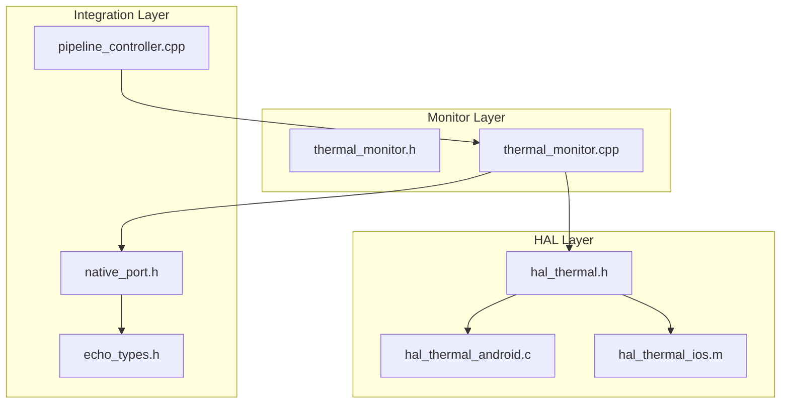
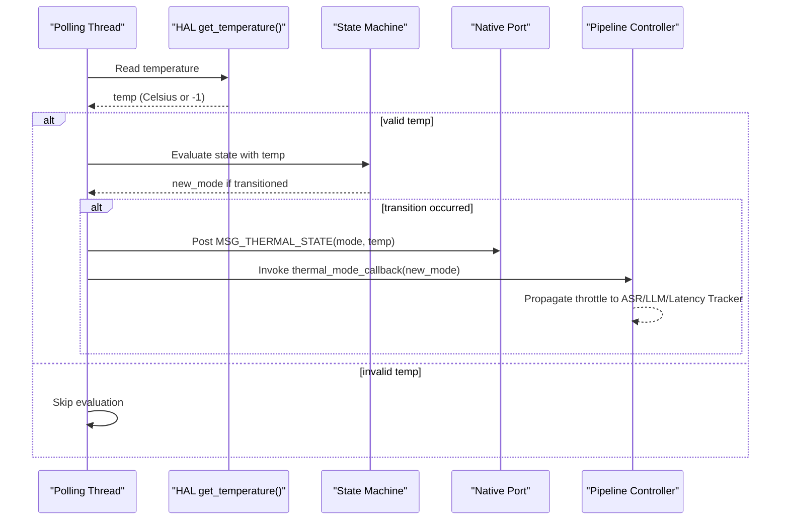
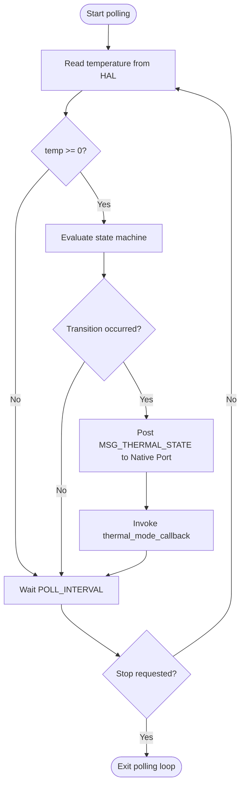
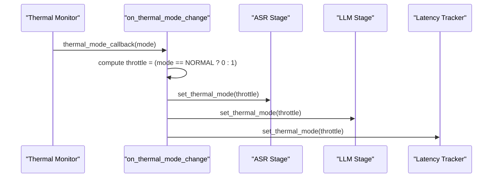
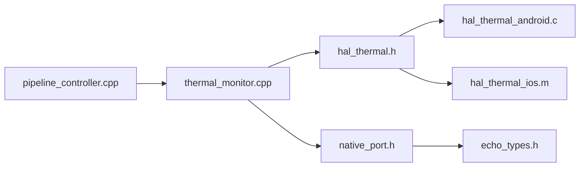

# Thermal HAL Implementation

<cite>
**Referenced Files in This Document**
- [hal_thermal.h](file://native/hal/hal_thermal.h)
- [hal_thermal_android.c](file://native/hal/android/hal_thermal_android.c)
- [hal_thermal_ios.m](file://native/hal/ios/hal_thermal_ios.m)
- [thermal_monitor.h](file://native/include/thermal_monitor.h)
- [thermal_monitor.cpp](file://native/src/thermal_monitor.cpp)
- [native_port.h](file://native/include/native_port.h)
- [echo_types.h](file://native/include/echo_types.h)
- [pipeline_controller.cpp](file://native/src/pipeline_controller.cpp)
</cite>

## Table of Contents
1. [Introduction](#introduction)
2. [Project Structure](#project-structure)
3. [Core Components](#core-components)
4. [Architecture Overview](#architecture-overview)
5. [Detailed Component Analysis](#detailed-component-analysis)
6. [Dependency Analysis](#dependency-analysis)
7. [Performance Considerations](#performance-considerations)
8. [Troubleshooting Guide](#troubleshooting-guide)
9. [Conclusion](#conclusion)

## Introduction
This document describes the Thermal HAL component for device temperature monitoring across Android and iOS platforms, including:
- The platform-agnostic HAL interface for reading temperatures and registering thermal callbacks
- Platform-specific implementations using AThermal/sysfs on Android and NSProcessInfo thermal state on iOS
- The thermal state machine with hysteresis thresholds and transitions
- Integration with the performance management system via a callback to the pipeline controller for adaptive throttling
- UI notifications through the native port message bus

The goal is to provide a clear understanding of how temperature data flows from hardware APIs into application-level adaptive behavior such as throttling ASR/LLM/TTS stages and latency tracking.

## Project Structure
The thermal subsystem spans three layers:
- HAL layer (platform abstraction): hal_thermal.h plus Android and iOS backends
- Monitor layer: thermal_monitor.h/.cpp implementing the state machine and polling loop
- Integration layer: native_port.h for UI notifications and pipeline_controller.cpp for adaptive throttling

**Diagram sources**
- [hal_thermal.h:1-53](file://native/hal/hal_thermal.h#L1-L53)
- [hal_thermal_android.c:1-207](file://native/hal/android/hal_thermal_android.c#L1-L207)
- [hal_thermal_ios.m:1-113](file://native/hal/ios/hal_thermal_ios.m#L1-L113)
- [thermal_monitor.h:1-109](file://native/include/thermal_monitor.h#L1-L109)
- [thermal_monitor.cpp:1-190](file://native/src/thermal_monitor.cpp#L1-L190)
- [native_port.h:148-153](file://native/include/native_port.h#L148-L153)
- [echo_types.h:30-42](file://native/include/echo_types.h#L30-L42)
- [pipeline_controller.cpp:140-160](file://native/src/pipeline_controller.cpp#L140-L160)

**Section sources**
- [hal_thermal.h:1-53](file://native/hal/hal_thermal.h#L1-L53)
- [thermal_monitor.h:1-109](file://native/include/thermal_monitor.h#L1-L109)
- [native_port.h:148-153](file://native/include/native_port.h#L148-L153)
- [echo_types.h:30-42](file://native/include/echo_types.h#L30-L42)
- [pipeline_controller.cpp:140-160](file://native/src/pipeline_controller.cpp#L140-L160)

## Core Components
- HAL Interface: Provides cross-platform functions to read temperature and register a callback for thermal changes.
- Android Backend: Uses AThermal API when available; falls back to sysfs thermal zones. Converts AThermal headroom to approximate Celsius.
- iOS Backend: Maps NSProcessInfo thermal states to representative Celsius values and supports reactive notifications via NSNotificationCenter.
- Thermal Monitor: Runs a low-priority thread that polls temperature every 5 seconds, evaluates a three-mode state machine with hysteresis, posts UI messages, and invokes an engine callback for adaptive throttling.
- Integration: Pipeline controller receives thermal mode changes and propagates throttle settings to ASR, LLM, and latency tracker components.

Key responsibilities:
- Temperature acquisition and normalization to Celsius
- State transitions with hysteresis to avoid oscillation
- Non-blocking notification to UI and engine
- Graceful fallbacks and error handling

**Section sources**
- [hal_thermal.h:17-46](file://native/hal/hal_thermal.h#L17-L46)
- [hal_thermal_android.c:31-52](file://native/hal/android/hal_thermal_android.c#L31-L52)
- [hal_thermal_ios.m:18-42](file://native/hal/ios/hal_thermal_ios.m#L18-L42)
- [thermal_monitor.h:26-41](file://native/include/thermal_monitor.h#L26-L41)
- [thermal_monitor.cpp:28-35](file://native/src/thermal_monitor.cpp#L28-L35)
- [pipeline_controller.cpp:140-160](file://native/src/pipeline_controller.cpp#L140-L160)

## Architecture Overview
The thermal subsystem follows a layered architecture:
- HAL abstracts platform differences behind a uniform C interface
- Monitor encapsulates polling, state machine logic, and side effects (UI and engine callbacks)
- Integration hooks allow the rest of the engine to adapt behavior based on thermal conditions

**Diagram sources**
- [thermal_monitor.cpp:99-128](file://native/src/thermal_monitor.cpp#L99-L128)
- [native_port.h:148-153](file://native/include/native_port.h#L148-L153)
- [echo_types.h:37-38](file://native/include/echo_types.h#L37-L38)
- [pipeline_controller.cpp:140-160](file://native/src/pipeline_controller.cpp#L140-L160)

## Detailed Component Analysis

### HAL Interface
The HAL defines:
- A function to poll current temperature in Celsius
- A callback registration mechanism for thermal events
- Clear semantics for error returns and units

Design notes:
- Callbacks are stored and invoked by higher layers rather than directly by HAL threads
- Temperature values are normalized to Celsius regardless of platform source

**Section sources**
- [hal_thermal.h:17-46](file://native/hal/hal_thermal.h#L17-L46)

### Android Backend
Implementation highlights:
- Dynamic loading of AThermal API from libandroid.so for API level 30+
- Conversion of AThermal headroom to approximate Celsius using a linear mapping clamped to a safe range
- Fallback to sysfs thermal zone file when AThermal is unavailable or returns errors
- Logging via Android log macros for diagnostics

Operational details:
- Headroom-to-Celsius conversion uses base and scale constants and clamps to minimum and maximum bounds
- Sysfs path reads millidegrees and converts to Celsius
- Callback registration stores user callback and context for use by the monitor’s polling loop

**Section sources**
- [hal_thermal_android.c:31-52](file://native/hal/android/hal_thermal_android.c#L31-L52)
- [hal_thermal_android.c:96-142](file://native/hal/android/hal_thermal_android.c#L96-L142)
- [hal_thermal_android.c:147-155](file://native/hal/android/hal_thermal_android.c#L147-L155)
- [hal_thermal_android.c:159-181](file://native/hal/android/hal_thermal_android.c#L159-L181)
- [hal_thermal_android.c:183-204](file://native/hal/android/hal_thermal_android.c#L183-L204)

### iOS Backend
Implementation highlights:
- Reads NSProcessInfo thermal state and maps it to representative Celsius values aligned with the state machine thresholds
- Registers for thermal state change notifications and invokes the registered callback when the OS reports a change
- Uses autorelease pools around Objective-C calls

Mapping rationale:
- Nominal → ~35°C
- Fair → ~41°C
- Serious → ~45°C (above throttle threshold)
- Critical → ~52°C (above critical threshold)

**Section sources**
- [hal_thermal_ios.m:18-42](file://native/hal/ios/hal_thermal_ios.m#L18-L42)
- [hal_thermal_ios.m:46-51](file://native/hal/ios/hal_thermal_ios.m#L46-L51)
- [hal_thermal_ios.m:81-110](file://native/hal/ios/hal_thermal_ios.m#L81-L110)

### Thermal Monitor and State Machine
Responsibilities:
- Polling loop runs at default priority, sleeping for a fixed interval between readings
- Evaluates a three-mode state machine with hysteresis thresholds
- On transitions:
  - Posts a thermal state message to the UI shell via Native Port
  - Invokes the user-supplied callback for engine adaptation

Thresholds and transitions:
- Normal → Throttle when temp > 43°C
- Throttle → Normal when temp ≤ 42°C
- Throttle → Critical when temp > 50°C
- Critical → Throttle when temp ≤ 45°C

Concurrency:
- Current mode is atomic for lock-free reads
- Stop signaling uses a condition variable to wake the polling thread promptly

**Diagram sources**
- [thermal_monitor.cpp:99-128](file://native/src/thermal_monitor.cpp#L99-L128)
- [thermal_monitor.cpp:59-92](file://native/src/thermal_monitor.cpp#L59-L92)

**Section sources**
- [thermal_monitor.h:26-41](file://native/include/thermal_monitor.h#L26-L41)
- [thermal_monitor.cpp:28-35](file://native/src/thermal_monitor.cpp#L28-L35)
- [thermal_monitor.cpp:59-92](file://native/src/thermal_monitor.cpp#L59-L92)
- [thermal_monitor.cpp:99-128](file://native/src/thermal_monitor.cpp#L99-L128)

### Integration with Performance Management
Adaptive throttling flow:
- The pipeline controller registers a thermal mode change callback
- On each transition, it sets a throttle flag (0 for normal, 1 for throttled)
- It propagates this setting to ASR stage, LLM stage, and latency tracker to adjust processing intensity

**Diagram sources**
- [pipeline_controller.cpp:140-160](file://native/src/pipeline_controller.cpp#L140-L160)

**Section sources**
- [pipeline_controller.cpp:140-160](file://native/src/pipeline_controller.cpp#L140-L160)

## Dependency Analysis
High-level dependencies:
- thermal_monitor depends on HAL interface and native port
- Android/iOS HAL backends depend on platform APIs (AThermal/sysfs and NSProcessInfo)
- pipeline_controller depends on thermal monitor callback and stage APIs

**Diagram sources**
- [thermal_monitor.cpp:18-20](file://native/src/thermal_monitor.cpp#L18-L20)
- [hal_thermal.h:1-53](file://native/hal/hal_thermal.h#L1-L53)
- [hal_thermal_android.c:1-207](file://native/hal/android/hal_thermal_android.c#L1-L207)
- [hal_thermal_ios.m:1-113](file://native/hal/ios/hal_thermal_ios.m#L1-L113)
- [native_port.h:148-153](file://native/include/native_port.h#L148-L153)
- [echo_types.h:30-42](file://native/include/echo_types.h#L30-L42)
- [pipeline_controller.cpp:140-160](file://native/src/pipeline_controller.cpp#L140-L160)

**Section sources**
- [thermal_monitor.cpp:18-20](file://native/src/thermal_monitor.cpp#L18-L20)
- [native_port.h:148-153](file://native/include/native_port.h#L148-L153)
- [echo_types.h:30-42](file://native/include/echo_types.h#L30-L42)

## Performance Considerations
- Polling interval: 5 seconds balances responsiveness and CPU usage
- Low-priority thread avoids contention with audio and model inference paths
- Atomic mode updates minimize locking overhead for readers
- Android AThermal provides a forecast-based estimate; fallback to sysfs ensures robustness
- iOS mapping aligns thermal states with thresholds to reduce unnecessary transitions

[No sources needed since this section provides general guidance]

## Troubleshooting Guide
Common issues and checks:
- Android AThermal not available:
  - Verify dynamic loading of libandroid.so and symbol resolution
  - Confirm sysfs thermal zone path exists and is readable
  - Check logs for warnings about missing APIs or NULL manager
- iOS thermal notifications:
  - Ensure observer registration succeeds and previous observers are removed
  - Validate that NSProcessInfoThermalStateDidChangeNotification is delivered
- Monitor not transitioning:
  - Confirm temperature readings are non-negative
  - Review hysteresis thresholds and ensure they match expected operating ranges
- UI not receiving thermal updates:
  - Verify Native Port is registered and post function is set
  - Confirm MSG_THERMAL_STATE is posted with correct payload types

**Section sources**
- [hal_thermal_android.c:96-142](file://native/hal/android/hal_thermal_android.c#L96-L142)
- [hal_thermal_android.c:159-181](file://native/hal/android/hal_thermal_android.c#L159-L181)
- [hal_thermal_ios.m:81-110](file://native/hal/ios/hal_thermal_ios.m#L81-L110)
- [thermal_monitor.cpp:99-128](file://native/src/thermal_monitor.cpp#L99-L128)
- [native_port.h:148-153](file://native/include/native_port.h#L148-L153)

## Conclusion
The Thermal HAL provides a clean abstraction over platform-specific temperature sources, enabling consistent thermal monitoring and adaptive throttling across Android and iOS. The monitor’s hysteresis-based state machine prevents oscillation, while integration points notify both the UI and the performance management system. Robust fallbacks and careful concurrency design ensure reliability under varying device conditions.