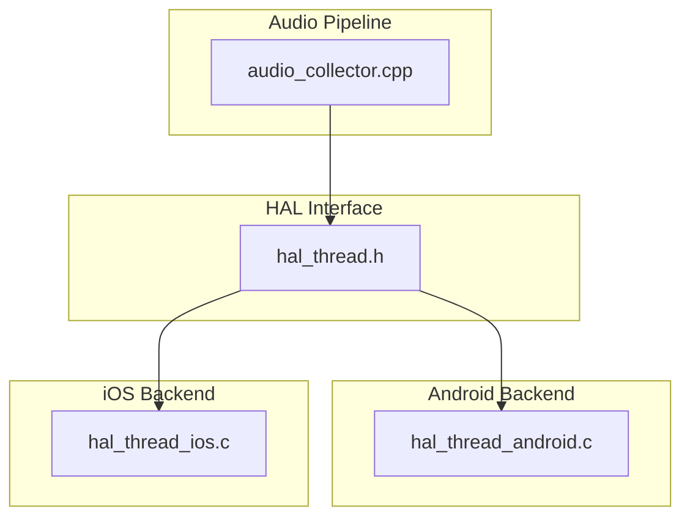
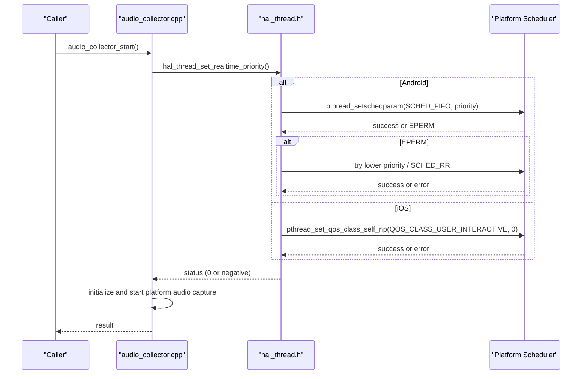
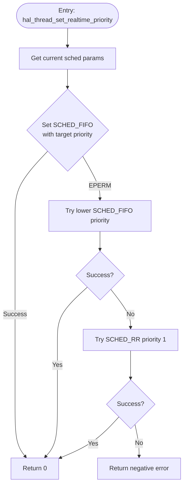
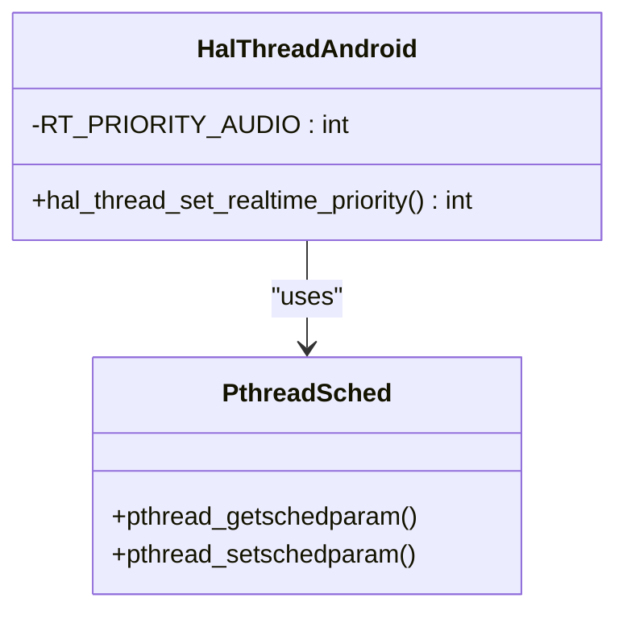
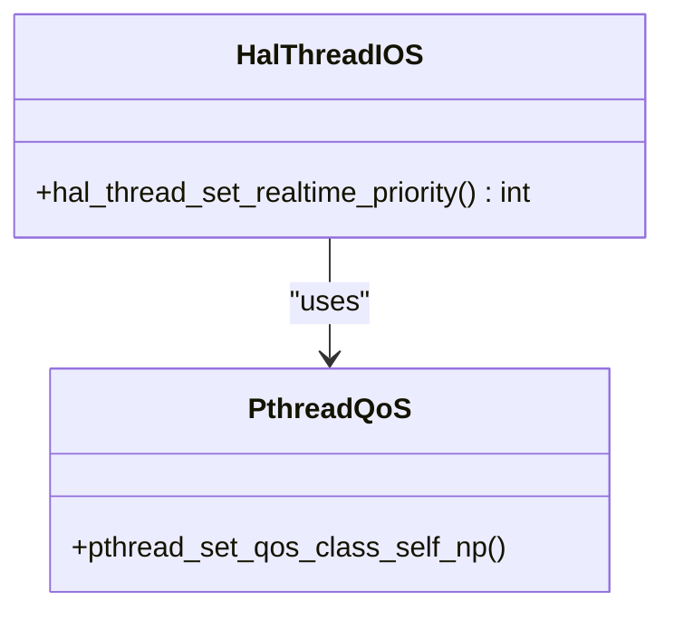
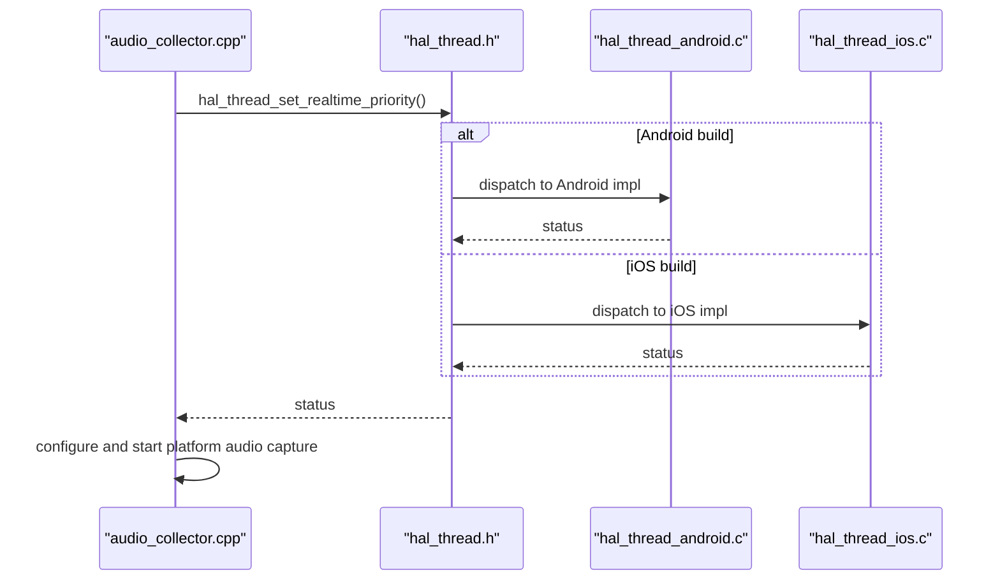
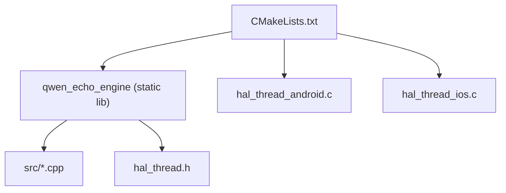

# Thread HAL Implementation

<cite>
**Referenced Files in This Document**
- [hal_thread.h](file://native/hal/hal_thread.h)
- [hal_thread_android.c](file://native/hal/android/hal_thread_android.c)
- [hal_thread_ios.c](file://native/hal/ios/hal_thread_ios.c)
- [audio_collector.cpp](file://native/src/audio_collector.cpp)
- [CMakeLists.txt](file://native/CMakeLists.txt)
</cite>

## Table of Contents
1. [Introduction](#introduction)
2. [Project Structure](#project-structure)
3. [Core Components](#core-components)
4. [Architecture Overview](#architecture-overview)
5. [Detailed Component Analysis](#detailed-component-analysis)
6. [Dependency Analysis](#dependency-analysis)
7. [Performance Considerations](#performance-considerations)
8. [Troubleshooting Guide](#troubleshooting-guide)
9. [Conclusion](#conclusion)

## Introduction
This document describes the Thread HAL component responsible for real-time thread management and priority control in QwenEcho. It focuses on:
- The cross-platform API to elevate a calling thread’s scheduling priority for real-time audio capture
- Android implementation using pthreads with SCHED_FIFO (and fallbacks)
- iOS implementation using pthread QoS with QOS_CLASS_USER_INTERACTIVE
- Integration points with the audio collector pipeline
- Best practices for real-time audio processing threads, including naming, stack sizing, and CPU affinity considerations

The goal is to provide both technical depth and practical guidance for ensuring deterministic, low-latency audio capture across Android and iOS.

## Project Structure
The Thread HAL is implemented as a small, platform-specific abstraction layer that exposes a single C function to set the calling thread to a high-priority scheduling class or policy. The audio collector calls this function at startup to ensure the capture context runs with elevated priority.

**Diagram sources**
- [hal_thread.h:1-35](file://native/hal/hal_thread.h#L1-L35)
- [hal_thread_android.c:1-106](file://native/hal/android/hal_thread_android.c#L1-L106)
- [hal_thread_ios.c:1-46](file://native/hal/ios/hal_thread_ios.c#L1-L46)
- [audio_collector.cpp:1-245](file://native/src/audio_collector.cpp#L1-L245)

**Section sources**
- [hal_thread.h:1-35](file://native/hal/hal_thread.h#L1-L35)
- [CMakeLists.txt:36-68](file://native/CMakeLists.txt#L36-L68)

## Core Components
- Cross-platform interface: hal_thread_set_realtime_priority(void)
  - Elevates the current thread’s scheduling priority to a real-time or highest-priority class suitable for audio capture
  - Returns 0 on success; negative error codes on failure (e.g., insufficient permissions)
- Android backend
  - Uses pthread_getschedparam/pthread_setschedparam with SCHED_FIFO
  - Attempts highest available priority, then falls back to lower priorities and finally to SCHED_RR if needed
- iOS backend
  - Uses pthread_set_qos_class_self_np with QOS_CLASS_USER_INTERACTIVE
  - Returns negative error code on failure

Integration point:
- audio_collector_start invokes hal_thread_set_realtime_priority before starting the platform audio capture, ensuring the caller’s thread has elevated priority.

**Section sources**
- [hal_thread.h:17-28](file://native/hal/hal_thread.h#L17-L28)
- [hal_thread_android.c:48-103](file://native/hal/android/hal_thread_android.c#L48-L103)
- [hal_thread_ios.c:20-43](file://native/hal/ios/hal_thread_ios.c#L20-L43)
- [audio_collector.cpp:167-171](file://native/src/audio_collector.cpp#L167-L171)

## Architecture Overview
The Thread HAL abstracts platform differences behind a single function. The audio collector elevates its own thread priority before initializing the platform audio subsystem. On Android, the backend attempts SCHED_FIFO with the highest allowed priority and gracefully degrades if denied. On iOS, it sets the highest user-facing QoS class.

**Diagram sources**
- [audio_collector.cpp:157-201](file://native/src/audio_collector.cpp#L157-L201)
- [hal_thread.h:17-28](file://native/hal/hal_thread.h#L17-L28)
- [hal_thread_android.c:48-103](file://native/hal/android/hal_thread_android.c#L48-L103)
- [hal_thread_ios.c:20-43](file://native/hal/ios/hal_thread_ios.c#L20-L43)

## Detailed Component Analysis

### Cross-Platform Interface: hal_thread_set_realtime_priority
- Purpose: Elevate the calling thread’s scheduling priority to a real-time or highest-priority class suitable for audio capture
- Behavior:
  - Android: Sets SCHED_FIFO with an elevated priority; includes robust fallbacks
  - iOS: Sets QOS_CLASS_USER_INTERACTIVE via pthread QoS APIs
- Return value: 0 on success; negative error code on failure

**Diagram sources**
- [hal_thread_android.c:48-103](file://native/hal/android/hal_thread_android.c#L48-L103)

**Section sources**
- [hal_thread.h:17-28](file://native/hal/hal_thread.h#L17-L28)

### Android Backend: SCHED_FIFO with Fallbacks
Key behaviors:
- Retrieves current scheduling parameters
- Attempts SCHED_FIFO with the highest non-root priority
- If permission denied (EPERM), tries a lower SCHED_FIFO priority
- As a final fallback, tries SCHED_RR with a modest priority
- Logs outcomes and returns appropriate status codes

**Diagram sources**
- [hal_thread_android.c:35-103](file://native/hal/android/hal_thread_android.c#L35-L103)

**Section sources**
- [hal_thread_android.c:35-103](file://native/hal/android/hal_thread_android.c#L35-L103)

### iOS Backend: QOS_CLASS_USER_INTERACTIVE
Key behaviors:
- Uses pthread_set_qos_class_self_np to set the highest user-facing QoS class
- Returns negative error code on failure (e.g., incompatible workgroup or missing entitlements)

**Diagram sources**
- [hal_thread_ios.c:20-43](file://native/hal/ios/hal_thread_ios.c#L20-L43)

**Section sources**
- [hal_thread_ios.c:20-43](file://native/hal/ios/hal_thread_ios.c#L20-L43)

### Integration with Audio Collector
The audio collector elevates its thread priority before starting the platform audio capture. This ensures the caller’s context is prioritized; the platform audio callback typically already runs on a real-time thread provided by the system.

**Diagram sources**
- [audio_collector.cpp:167-171](file://native/src/audio_collector.cpp#L167-L171)
- [hal_thread.h:17-28](file://native/hal/hal_thread.h#L17-L28)
- [hal_thread_android.c:48-103](file://native/hal/android/hal_thread_android.c#L48-L103)
- [hal_thread_ios.c:20-43](file://native/hal/ios/hal_thread_ios.c#L20-L43)

**Section sources**
- [audio_collector.cpp:157-201](file://native/src/audio_collector.cpp#L157-L201)

## Dependency Analysis
Build-time integration:
- The HAL sources are included conditionally based on the target platform
- Android builds link against required system libraries (AAudio, log)
- The engine library aggregates all source files and exposes the HAL interface

**Diagram sources**
- [CMakeLists.txt:36-68](file://native/CMakeLists.txt#L36-L68)

**Section sources**
- [CMakeLists.txt:36-68](file://native/CMakeLists.txt#L36-L68)

## Performance Considerations
- Real-time scheduling
  - Android: SCHED_FIFO provides deterministic, non-preemptible scheduling within the same priority level; higher than SCHED_OTHER. Fallbacks mitigate permission restrictions.
  - iOS: QOS_CLASS_USER_INTERACTIVE signals time-critical, user-facing work to the scheduler.
- Callback constraints
  - The audio capture callback must avoid blocking, memory allocation, and non-RT-safe operations. It writes to a lock-free ring buffer and updates atomic counters only.
- Error handling
  - The HAL returns negative error codes on failure; callers should handle these gracefully and continue operation without RT guarantees if necessary.

[No sources needed since this section provides general guidance]

## Troubleshooting Guide
Common issues and diagnostics:
- Permission denied on Android when setting SCHED_FIFO
  - The backend automatically retries with lower priority and then SCHED_RR. Check logs for warnings indicating fallback behavior.
- Failure to set QoS on iOS
  - May occur due to incompatible workgroups or missing entitlements. The function returns a negative error code; verify process entitlements and thread group membership.
- No improvement in latency
  - Ensure the call to hal_thread_set_realtime_priority occurs before starting the platform audio capture. Verify that the platform audio callback itself is running on a real-time thread provided by the system.

Operational checks:
- Confirm the return value of hal_thread_set_realtime_priority is 0 during normal operation
- Inspect platform logs for messages indicating successful or fallback scheduling configuration

**Section sources**
- [hal_thread_android.c:64-103](file://native/hal/android/hal_thread_android.c#L64-L103)
- [hal_thread_ios.c:32-43](file://native/hal/ios/hal_thread_ios.c#L32-L43)
- [audio_collector.cpp:167-171](file://native/src/audio_collector.cpp#L167-L171)

## Conclusion
The Thread HAL provides a concise, cross-platform mechanism to elevate thread priority for real-time audio capture. On Android, it leverages SCHED_FIFO with robust fallbacks; on iOS, it uses the highest user-facing QoS class. Integrated into the audio collector startup sequence, it helps ensure deterministic, low-latency performance while maintaining graceful degradation under permission constraints. For production systems, consider extending the HAL to support thread naming, explicit stack size configuration, and CPU affinity controls where supported by the platform.

[No sources needed since this section summarizes without analyzing specific files]