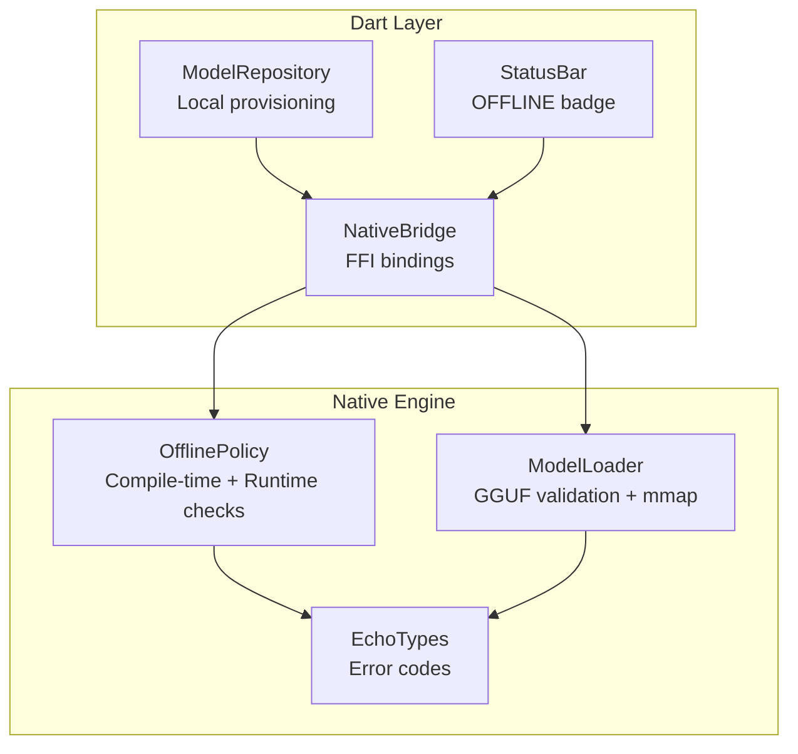
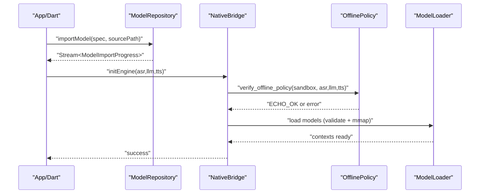
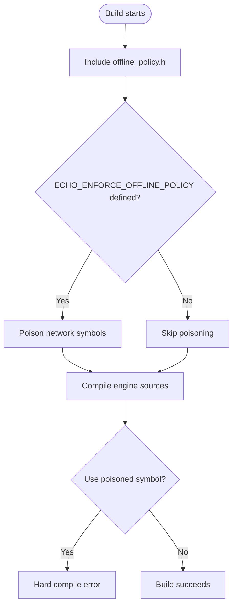
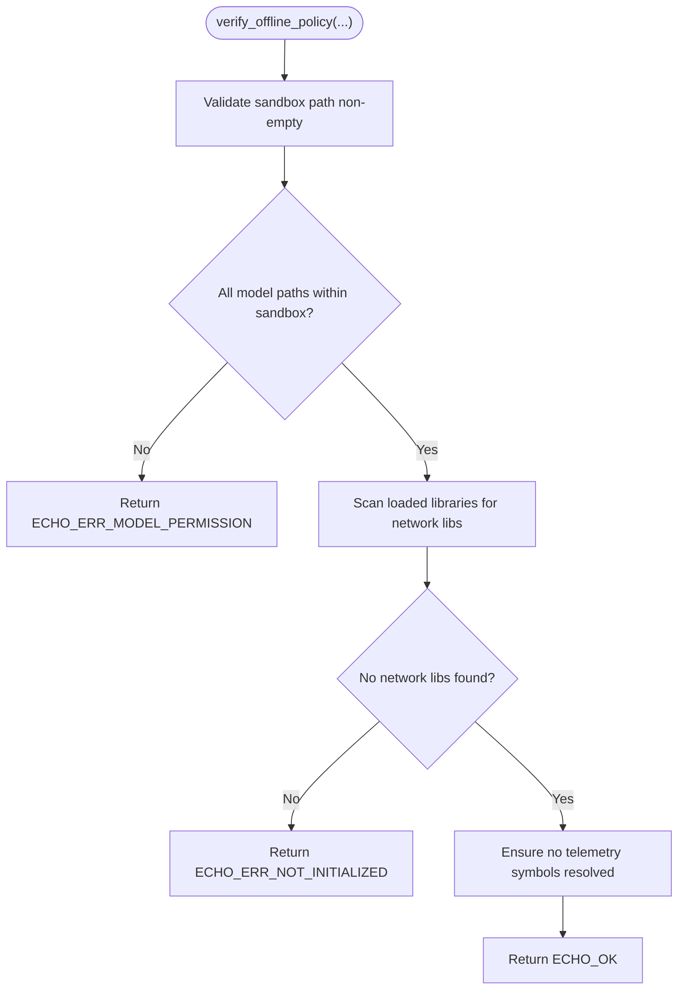
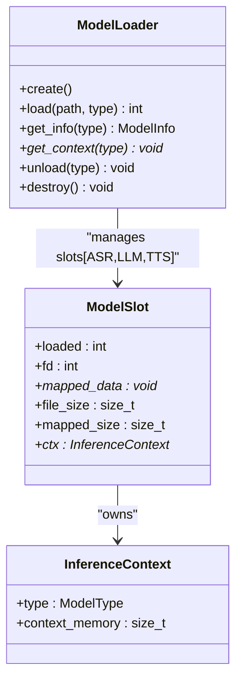
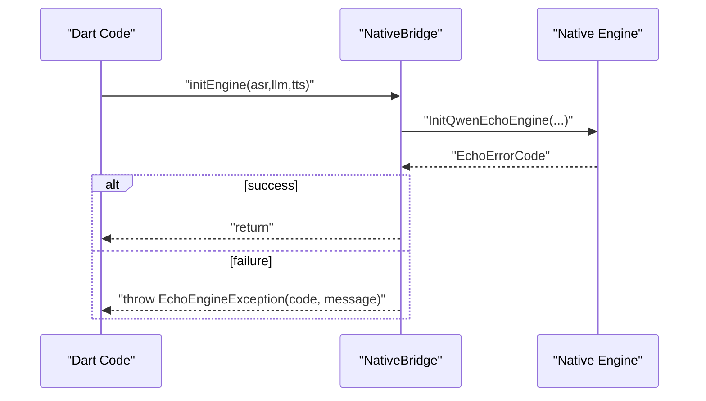
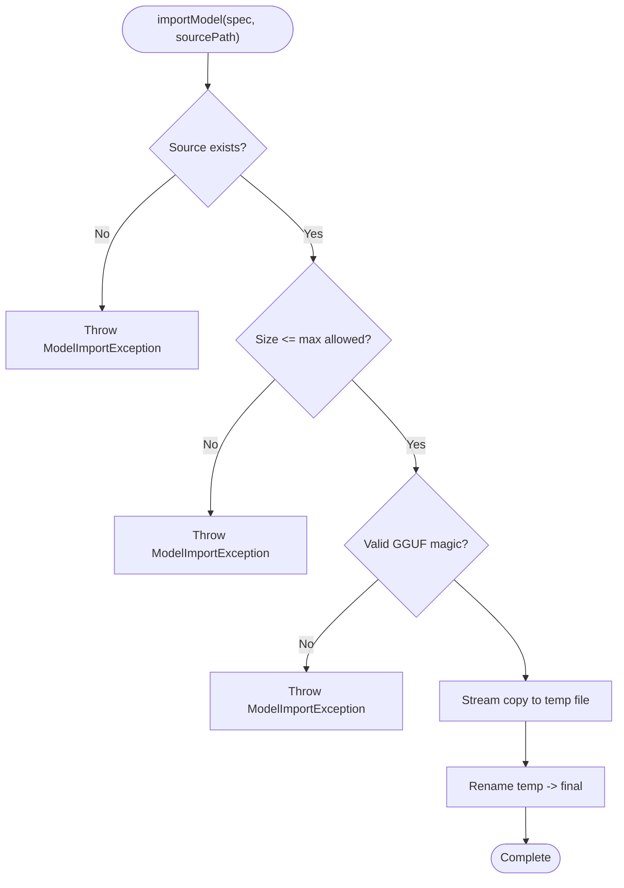
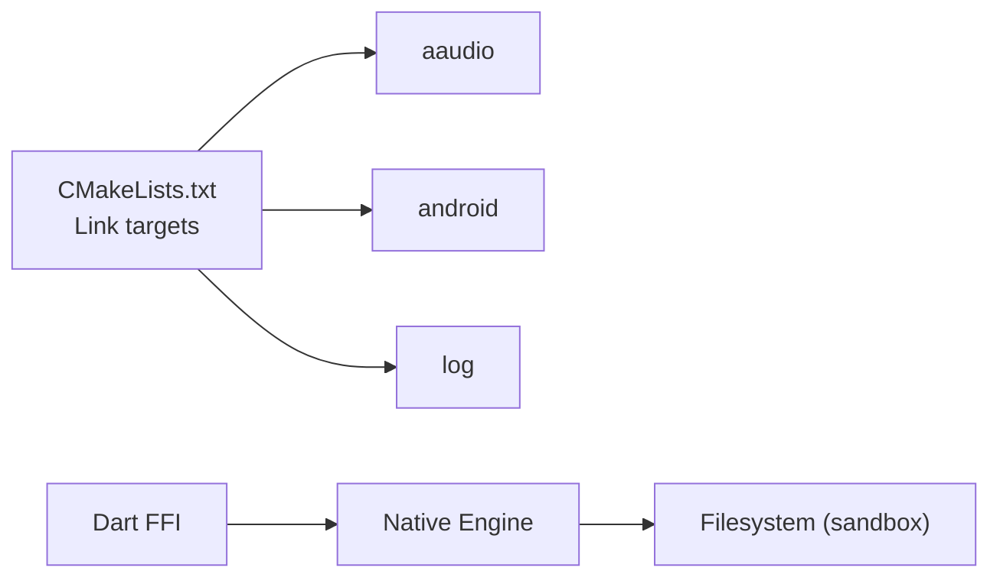

# Security and Privacy

<cite>
**Referenced Files in This Document**
- [offline_policy.h](file://native/include/offline_policy.h)
- [offline_policy.cpp](file://native/src/offline_policy.cpp)
- [model_loader.h](file://native/include/model_loader.h)
- [model_loader.cpp](file://native/src/model_loader.cpp)
- [echo_types.h](file://native/include/echo_types.h)
- [CMakeLists.txt](file://native/CMakeLists.txt)
- [README.md](file://README.md)
- [qwen_echo.dart](file://lib/qwen_echo.dart)
- [native_bridge.dart](file://lib/src/native_bridge.dart)
- [model_repository.dart](file://lib/src/model/model_repository.dart)
- [status_bar.dart](file://lib/src/ui/status_bar.dart)
</cite>

## Table of Contents
1. [Introduction](#introduction)
2. [Project Structure](#project-structure)
3. [Core Components](#core-components)
4. [Architecture Overview](#architecture-overview)
5. [Detailed Component Analysis](#detailed-component-analysis)
6. [Dependency Analysis](#dependency-analysis)
7. [Performance Considerations](#performance-considerations)
8. [Troubleshooting Guide](#troubleshooting-guide)
9. [Conclusion](#conclusion)
10. [Appendices](#appendices)

## Introduction
This document explains QwenEcho’s security and privacy model with a focus on air-gapped operation guarantees. It details:
- Offline policy enforcement at compile time (symbol poisoning) and runtime (library scanning and sandbox checks).
- Data isolation strategies ensuring all model files remain within the application sandbox.
- Zero-knowledge architecture guarantees: after model provisioning, no data leaves the device.
- Practical examples for verifying offline compliance, auditing network access attempts, and maintaining security boundaries in custom extensions.

QwenEcho is designed to run entirely on-device with zero network requests after models are provisioned locally.

## Project Structure
The security-relevant parts span native C/C++ code and Dart bindings:
- Native engine enforces offline policy and loads GGUF models from disk only.
- Dart layer provides FFI bindings and local model provisioning without any network I/O.
- UI components display an always-visible OFFLINE indicator.

**Diagram sources**
- [offline_policy.h:1-121](file://native/include/offline_policy.h#L1-L121)
- [offline_policy.cpp:1-219](file://native/src/offline_policy.cpp#L1-L219)
- [model_loader.h:1-142](file://native/include/model_loader.h#L1-L142)
- [model_loader.cpp:1-460](file://native/src/model_loader.cpp#L1-L460)
- [echo_types.h:1-136](file://native/include/echo_types.h#L1-L136)
- [native_bridge.dart:1-230](file://lib/src/native_bridge.dart#L1-L230)
- [model_repository.dart:1-256](file://lib/src/model/model_repository.dart#L1-L256)
- [status_bar.dart:1-181](file://lib/src/ui/status_bar.dart#L1-L181)

**Section sources**
- [README.md:17-93](file://README.md#L17-L93)
- [qwen_echo.dart:1-16](file://lib/qwen_echo.dart#L1-L16)

## Core Components
- Offline Policy Enforcement
  - Compile-time symbol poisoning prevents accidental use of networking APIs.
  - Runtime verification ensures model paths are inside the app sandbox and that no network libraries are loaded.
- Model Loader
  - Validates GGUF headers and quantization types.
  - Uses memory-mapped file access; no network calls.
- Dart FFI Bridge
  - Exposes four C-linkage entry points to Dart.
  - Throws typed exceptions for non-zero error codes.
- Local Model Repository
  - Copies GGUF files into the app sandbox and validates them.
  - Emits progress events; performs zero network I/O.
- UI Indicators
  - Persistent OFFLINE badge confirms air-gapped operation.

**Section sources**
- [offline_policy.h:1-121](file://native/include/offline_policy.h#L1-L121)
- [offline_policy.cpp:1-219](file://native/src/offline_policy.cpp#L1-L219)
- [model_loader.h:1-142](file://native/include/model_loader.h#L1-L142)
- [model_loader.cpp:1-460](file://native/src/model_loader.cpp#L1-L460)
- [native_bridge.dart:1-230](file://lib/src/native_bridge.dart#L1-L230)
- [model_repository.dart:1-256](file://lib/src/model/model_repository.dart#L1-L256)
- [status_bar.dart:1-181](file://lib/src/ui/status_bar.dart#L1-L181)

## Architecture Overview
The system enforces air-gapped operation through layered controls:
- Build-time constraints: minimal linking surface and compiler-level symbol poisoning.
- Runtime checks: sandbox path validation and absence of network libraries.
- Data isolation: models stored under the app support directory and accessed via mmap.
- UI transparency: persistent OFFLINE status visible to users.

**Diagram sources**
- [model_repository.dart:145-211](file://lib/src/model/model_repository.dart#L145-L211)
- [native_bridge.dart:132-150](file://lib/src/native_bridge.dart#L132-L150)
- [offline_policy.cpp:155-218](file://native/src/offline_policy.cpp#L155-L218)
- [model_loader.cpp:284-380](file://native/src/model_loader.cpp#L284-L380)

## Detailed Component Analysis

### Offline Policy: Compile-Time Symbol Poisoning
- Purpose: Prevent accidental inclusion or usage of networking symbols in engine code.
- Mechanism:
  - When the offline policy flag is enabled, known socket and HTTP client identifiers are poisoned at compile time, causing hard errors if used.
  - MSVC uses deprecation warnings as a softer guard.
- Scope: Applies to translation units including the policy header after standard includes.

**Diagram sources**
- [offline_policy.h:53-84](file://native/include/offline_policy.h#L53-L84)

**Section sources**
- [offline_policy.h:40-84](file://native/include/offline_policy.h#L40-L84)

### Offline Policy: Runtime Verification
- Checks performed at engine initialization:
  - Sandbox path must be non-empty.
  - All model paths must reside within the application sandbox prefix.
  - No network-related shared libraries should be loaded by the process.
  - Telemetry/analytics symbols must not be resolvable.
- Platform-specific behaviors:
  - Android/Linux: scans /proc/self/maps for known network library patterns.
  - iOS/macOS: resolves specific symbols via dynamic loader to detect network usage.
  - Other platforms: best-effort fallback assumes policy satisfied.

**Diagram sources**
- [offline_policy.cpp:155-218](file://native/src/offline_policy.cpp#L155-L218)

**Section sources**
- [offline_policy.cpp:44-149](file://native/src/offline_policy.cpp#L44-L149)
- [offline_policy.cpp:155-218](file://native/src/offline_policy.cpp#L155-L218)

### Model Loader: Validation and Isolation
- Responsibilities:
  - Verify GGUF magic bytes and accept INT4 quantization variants.
  - Memory-map model files for efficient OS page cache usage.
  - Provide per-model inference context handles and memory usage reporting.
- Error handling:
  - Distinguishes missing files, permission issues, invalid format, and memory errors.
- Data isolation:
  - Operates strictly on provided paths; no network access.

**Diagram sources**
- [model_loader.h:65-76](file://native/include/model_loader.h#L65-L76)
- [model_loader.cpp:24-42](file://native/src/model_loader.cpp#L24-L42)

**Section sources**
- [model_loader.h:1-142](file://native/include/model_loader.h#L1-L142)
- [model_loader.cpp:284-380](file://native/src/model_loader.cpp#L284-L380)

### Dart FFI Bridge: Safe Interop Surface
- Provides four C-linkage functions to Dart:
  - Initialize engine with model paths.
  - Start pipeline with language pair.
  - Stop pipeline.
  - Register message port for async messages.
- Error mapping:
  - Mirrors native error codes and throws typed exceptions with human-readable descriptions.

**Diagram sources**
- [native_bridge.dart:132-150](file://lib/src/native_bridge.dart#L132-L150)
- [native_bridge.dart:209-228](file://lib/src/native_bridge.dart#L209-L228)
- [echo_types.h:48-62](file://native/include/echo_types.h#L48-L62)

**Section sources**
- [native_bridge.dart:1-230](file://lib/src/native_bridge.dart#L1-L230)
- [echo_types.h:48-62](file://native/include/echo_types.h#L48-L62)

### Local Model Repository: Air-Gapped Provisioning
- Ensures models are copied into the app sandbox and validated before use.
- Performs streaming copy with progress events and atomic rename for integrity.
- Validates GGUF magic bytes early to avoid unnecessary large copies.
- Zero network I/O by design.

**Diagram sources**
- [model_repository.dart:145-211](file://lib/src/model/model_repository.dart#L145-L211)

**Section sources**
- [model_repository.dart:1-256](file://lib/src/model/model_repository.dart#L1-L256)

### UI: Persistent OFFLINE Indicator
- Displays an always-visible OFFLINE badge to confirm air-gapped operation.
- Integrates thermal state indicators and transient warning overlays.

**Section sources**
- [status_bar.dart:1-181](file://lib/src/ui/status_bar.dart#L1-L181)

## Dependency Analysis
- Build-time linkage constraints:
  - The native build links only against platform audio/system/logging libraries on Android.
  - No HTTP clients or crypto libraries are linked into the engine target.
- Dart-to-native boundary:
  - Only four entry points are exposed, minimizing attack surface.
- Data flow:
  - Models are provisioned locally and passed by path to the native engine.
  - The engine validates and memory-maps files; no outbound network calls.

**Diagram sources**
- [CMakeLists.txt:52-67](file://native/CMakeLists.txt#L52-L67)
- [native_bridge.dart:191-207](file://lib/src/native_bridge.dart#L191-L207)

**Section sources**
- [CMakeLists.txt:1-126](file://native/CMakeLists.txt#L1-L126)
- [native_bridge.dart:191-207](file://lib/src/native_bridge.dart#L191-L207)

## Performance Considerations
- Memory-mapped model files leverage OS page caching for efficient access.
- Minimal linking surface reduces binary size and potential overhead.
- Streamed model import avoids loading large weights into memory during provisioning.

## Troubleshooting Guide
Common offline policy violations and how to diagnose them:
- Model path outside sandbox:
  - Symptom: Initialization returns a model permission error.
  - Action: Ensure all model paths resolve within the app support directory.
- Network libraries detected at runtime:
  - Symptom: Initialization fails due to network library presence.
  - Action: Audit dependencies and remove HTTP clients or telemetry SDKs.
- Invalid GGUF model:
  - Symptom: Model load fails with invalid format.
  - Action: Re-provision correct GGUF/INT4 models and verify magic bytes.
- Missing model files:
  - Symptom: Initialization reports missing model.
  - Action: Complete local provisioning before starting the pipeline.

Operational guidance:
- Always call the offline policy verification before starting the pipeline.
- Keep the OFFLINE badge visible to reassure users of air-gapped operation.
- For custom extensions, avoid adding network stacks or telemetry; rely on the existing sandbox and policy checks.

**Section sources**
- [offline_policy.cpp:155-218](file://native/src/offline_policy.cpp#L155-L218)
- [model_loader.cpp:284-380](file://native/src/model_loader.cpp#L284-L380)
- [model_repository.dart:145-211](file://lib/src/model/model_repository.dart#L145-L211)
- [status_bar.dart:125-151](file://lib/src/ui/status_bar.dart#L125-L151)

## Conclusion
QwenEcho implements a robust, defense-in-depth strategy for air-gapped operation:
- Compile-time symbol poisoning blocks accidental network API usage.
- Runtime verification enforces sandbox-only model access and absence of network libraries.
- Local provisioning and memory-mapped reads ensure data remains on-device.
- UI transparency reinforces user trust with a persistent OFFLINE indicator.

These measures collectively deliver a zero-knowledge architecture where no data leaves the device after model provisioning.

## Appendices

### Verifying Offline Compliance
- Build-time:
  - Enable the offline policy flag to activate symbol poisoning.
  - Confirm the build links only against required platform libraries.
- Runtime:
  - Invoke the offline policy verification at engine startup.
  - Inspect returned error codes for sandbox or dependency violations.
- UI:
  - Ensure the OFFLINE badge is displayed continuously.

**Section sources**
- [offline_policy.h:53-84](file://native/include/offline_policy.h#L53-L84)
- [CMakeLists.txt:52-67](file://native/CMakeLists.txt#L52-L67)
- [offline_policy.cpp:155-218](file://native/src/offline_policy.cpp#L155-L218)
- [status_bar.dart:125-151](file://lib/src/ui/status_bar.dart#L125-L151)

### Auditing Network Access Attempts
- Static analysis:
  - Search for references to network symbols in engine sources.
  - Review third-party dependencies for hidden network capabilities.
- Dynamic checks:
  - Use the runtime verifier to detect loaded network libraries.
  - On Android/Linux, inspect process maps for known network modules.
  - On iOS/macOS, check for resolved network symbols.

**Section sources**
- [offline_policy.cpp:70-149](file://native/src/offline_policy.cpp#L70-L149)

### Maintaining Security Boundaries in Custom Extensions
- Do not introduce network stacks or telemetry into the engine.
- Keep all data operations within the app sandbox.
- Prefer passing absolute paths to the engine rather than external streams.
- Validate inputs and respect error codes returned by the bridge.

**Section sources**
- [model_repository.dart:1-256](file://lib/src/model/model_repository.dart#L1-L256)
- [native_bridge.dart:132-150](file://lib/src/native_bridge.dart#L132-L150)
- [echo_types.h:48-62](file://native/include/echo_types.h#L48-L62)