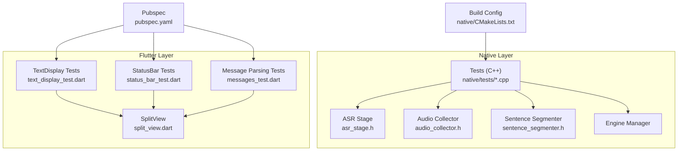
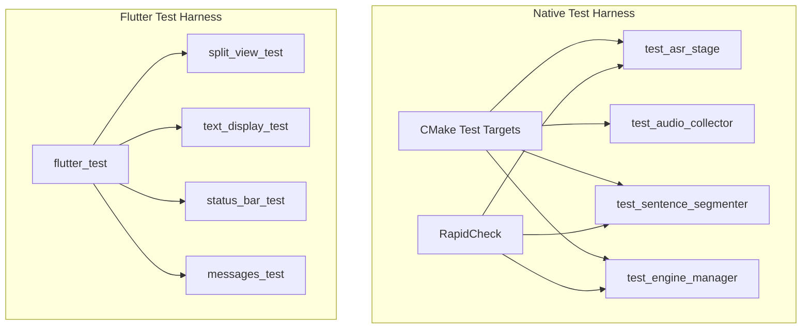
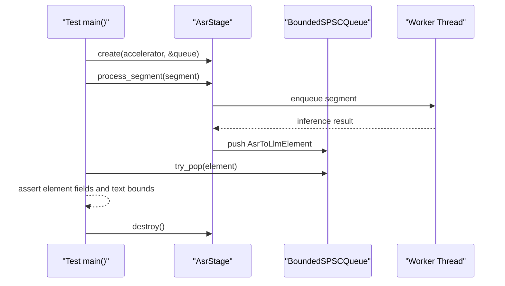
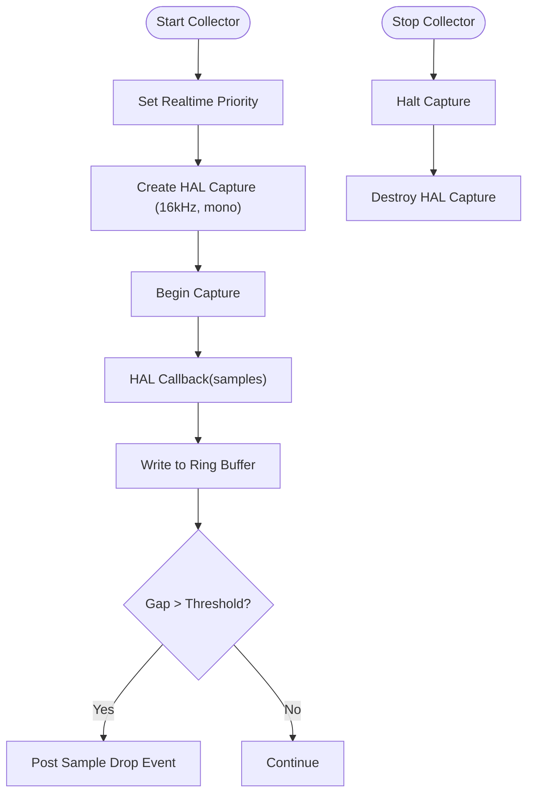
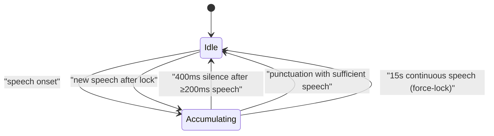
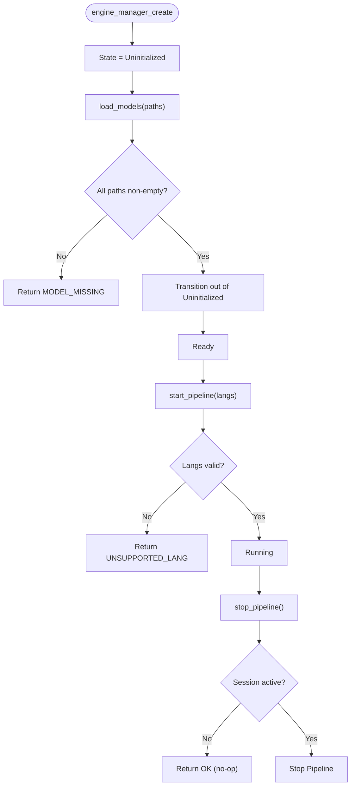
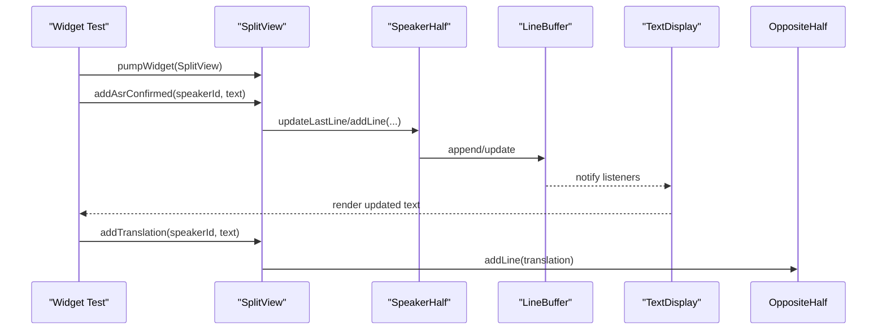
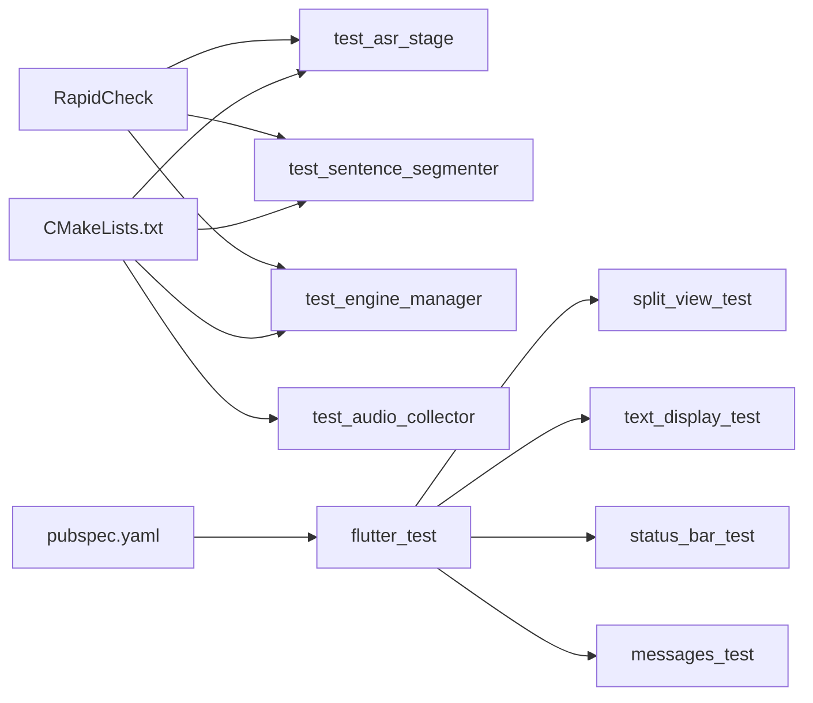

# Testing Strategy

<cite>
**Referenced Files in This Document**
- [native/CMakeLists.txt](file://native/CMakeLists.txt)
- [native/tests/test_asr_stage.cpp](file://native/tests/test_asr_stage.cpp)
- [native/tests/test_audio_collector.cpp](file://native/tests/test_audio_collector.cpp)
- [native/tests/test_engine_manager.cpp](file://native/tests/test_engine_manager.cpp)
- [native/tests/test_sentence_segmenter.cpp](file://native/tests/test_sentence_segmenter.cpp)
- [native/include/asr_stage.h](file://native/include/asr_stage.h)
- [native/include/audio_collector.h](file://native/include/audio_collector.h)
- [native/include/sentence_segmenter.h](file://native/include/sentence_segmenter.h)
- [test/split_view_test.dart](file://test/split_view_test.dart)
- [test/ui/text_display_test.dart](file://test/ui/text_display_test.dart)
- [test/ui/status_bar_test.dart](file://test/ui/status_bar_test.dart)
- [test/messages_test.dart](file://test/messages_test.dart)
- [lib/src/ui/split_view.dart](file://lib/src/ui/split_view.dart)
- [pubspec.yaml](file://pubspec.yaml)
</cite>

## Table of Contents
1. [Introduction](#introduction)
2. [Project Structure](#project-structure)
3. [Core Components](#core-components)
4. [Architecture Overview](#architecture-overview)
5. [Detailed Component Analysis](#detailed-component-analysis)
6. [Dependency Analysis](#dependency-analysis)
7. [Performance Considerations](#performance-considerations)
8. [Troubleshooting Guide](#troubleshooting-guide)
9. [Conclusion](#conclusion)
10. [Appendices](#appendices)

## Introduction
This document describes QwenEcho’s multi-layered testing strategy across native C++ and Flutter layers. It explains:
- Property-based testing for native components using RapidCheck, with automated test case generation to exercise edge cases and invariants.
- Unit testing strategies for core modules such as ASR stage, audio collector, sentence segmenter, and engine manager.
- Flutter widget tests for UI components including split view, text display, and status monitoring.
- Integration testing approaches for end-to-end pipeline validation and performance benchmarking for latency measurement.
- Practical guidance on writing effective tests, setting up test environments, and interpreting results across both native and Flutter layers.

## Project Structure
QwenEcho organizes tests alongside their corresponding implementations:
- Native tests under native/tests validate C++ modules and integrate with RapidCheck for property-based testing.
- Flutter tests under test cover UI widgets and message parsing logic.
- Build configuration centralizes test discovery and linking for native tests.

**Diagram sources**
- [native/CMakeLists.txt:70-126](file://native/CMakeLists.txt#L70-L126)
- [native/include/asr_stage.h:1-104](file://native/include/asr_stage.h#L1-L104)
- [native/include/audio_collector.h:1-95](file://native/include/audio_collector.h#L1-L95)
- [native/include/sentence_segmenter.h:1-142](file://native/include/sentence_segmenter.h#L1-L142)
- [test/split_view_test.dart:1-182](file://test/split_view_test.dart#L1-L182)
- [test/ui/text_display_test.dart:1-100](file://test/ui/text_display_test.dart#L1-L100)
- [test/ui/status_bar_test.dart:1-107](file://test/ui/status_bar_test.dart#L1-L107)
- [test/messages_test.dart:1-135](file://test/messages_test.dart#L1-L135)
- [pubspec.yaml:1-26](file://pubspec.yaml#L1-L26)

**Section sources**
- [native/CMakeLists.txt:70-126](file://native/CMakeLists.txt#L70-L126)
- [pubspec.yaml:1-26](file://pubspec.yaml#L1-L26)

## Core Components
This section summarizes the key testing targets and their responsibilities:
- ASR Stage: Validates segment processing, noise discard, throttle mode downsampling, output queue population, worker lifecycle, and null safety. Includes a RapidCheck property that randomizes segment durations and asserts valid output formatting.
- Audio Collector: Uses mock HAL implementations to verify real-time priority setup, 16kHz mono configuration, callback-driven ring buffer writes, sample drop detection, and lifecycle correctness.
- Sentence Segmenter: Exercises VAD + boundary detection state machine transitions, silence/punctuation/force-lock conditions, speaker ID propagation, reset behavior, and threshold configuration.
- Engine Manager: Verifies state machine guards and transitions (Uninitialized → Initializing → Ready → Running → Stopping → Ready), error codes for invalid calls, and idempotence constraints.
- Flutter UI: Split view layout and rotation, orientation locking, independent half updates, translation routing, line buffer limits, and color mapping; StatusBar thermal indicator updates; message parsing from raw lists.

**Section sources**
- [native/tests/test_asr_stage.cpp:1-419](file://native/tests/test_asr_stage.cpp#L1-L419)
- [native/tests/test_audio_collector.cpp:1-379](file://native/tests/test_audio_collector.cpp#L1-L379)
- [native/tests/test_sentence_segmenter.cpp:1-374](file://native/tests/test_sentence_segmenter.cpp#L1-L374)
- [native/tests/test_engine_manager.cpp:1-178](file://native/tests/test_engine_manager.cpp#L1-L178)
- [test/split_view_test.dart:1-182](file://test/split_view_test.dart#L1-L182)
- [test/ui/text_display_test.dart:1-100](file://test/ui/text_display_test.dart#L1-L100)
- [test/ui/status_bar_test.dart:1-107](file://test/ui/status_bar_test.dart#L1-L107)
- [test/messages_test.dart:1-135](file://test/messages_test.dart#L1-L135)

## Architecture Overview
The testing architecture spans two layers:
- Native layer: CMake builds individual test executables per test file, links RapidCheck, and optionally links the engine library when available. Some tests provide custom mocks for HAL/native_port to isolate behavior.
- Flutter layer: flutter_test drives widget interactions, verifies layout and state changes, and validates message parsing.

**Diagram sources**
- [native/CMakeLists.txt:70-126](file://native/CMakeLists.txt#L70-L126)
- [native/tests/test_asr_stage.cpp:1-419](file://native/tests/test_asr_stage.cpp#L1-L419)
- [native/tests/test_audio_collector.cpp:1-379](file://native/tests/test_audio_collector.cpp#L1-L379)
- [native/tests/test_sentence_segmenter.cpp:1-374](file://native/tests/test_sentence_segmenter.cpp#L1-L374)
- [native/tests/test_engine_manager.cpp:1-178](file://native/tests/test_engine_manager.cpp#L1-L178)
- [test/split_view_test.dart:1-182](file://test/split_view_test.dart#L1-L182)
- [test/ui/text_display_test.dart:1-100](file://test/ui/text_display_test.dart#L1-L100)
- [test/ui/status_bar_test.dart:1-107](file://test/ui/status_bar_test.dart#L1-L107)
- [test/messages_test.dart:1-135](file://test/messages_test.dart#L1-L135)

## Detailed Component Analysis

### ASR Stage Testing
- Unit tests cover creation/destruction, speech vs noise handling, throttle mode, ordering, empty/null inputs, safe destruction paths, and confirmed text format invariants.
- Property-based test uses RapidCheck to generate random segment durations and assert correct output presence and formatting.

**Diagram sources**
- [native/tests/test_asr_stage.cpp:359-419](file://native/tests/test_asr_stage.cpp#L359-L419)
- [native/include/asr_stage.h:52-97](file://native/include/asr_stage.h#L52-L97)

**Section sources**
- [native/tests/test_asr_stage.cpp:1-419](file://native/tests/test_asr_stage.cpp#L1-L419)
- [native/include/asr_stage.h:1-104](file://native/include/asr_stage.h#L1-L104)

### Audio Collector Testing
- Mock HAL functions replace platform-specific audio capture to verify configuration, real-time priority, callback delivery, ring buffer accumulation, stop semantics, and error paths.
- Sample drop detection is validated by asserting posted events when gaps exceed thresholds.

**Diagram sources**
- [native/tests/test_audio_collector.cpp:129-379](file://native/tests/test_audio_collector.cpp#L129-L379)
- [native/include/audio_collector.h:48-88](file://native/include/audio_collector.h#L48-L88)

**Section sources**
- [native/tests/test_audio_collector.cpp:1-379](file://native/tests/test_audio_collector.cpp#L1-L379)
- [native/include/audio_collector.h:1-95](file://native/include/audio_collector.h#L1-L95)

### Sentence Segmenter Testing
- Validates state machine transitions: Idle → Accumulating on speech onset; Lock on 400ms silence after ≥200ms speech; punctuation-triggered lock; force-lock at 15s; minimum speech requirement; immediate new segment after lock; speaker ID propagation; reset behavior; configurable thresholds; NULL safety; partial frame handling.

**Diagram sources**
- [native/include/sentence_segmenter.h:34-38](file://native/include/sentence_segmenter.h#L34-L38)
- [native/tests/test_sentence_segmenter.cpp:95-374](file://native/tests/test_sentence_segmenter.cpp#L95-L374)

**Section sources**
- [native/tests/test_sentence_segmenter.cpp:1-374](file://native/tests/test_sentence_segmenter.cpp#L1-L374)
- [native/include/sentence_segmenter.h:1-142](file://native/include/sentence_segmenter.h#L1-L142)

### Engine Manager Testing
- Guards and state transitions are verified via RapidCheck properties:
  - load_models returns specific errors for missing or empty paths and preserves Uninitialized state until transition occurs.
  - start_pipeline returns not-ready errors when not in Ready state.
  - stop_pipeline is a no-op when no session is active.
  - Duplicate initialization attempts return already-initialized error after first transition.

**Diagram sources**
- [native/tests/test_engine_manager.cpp:21-178](file://native/tests/test_engine_manager.cpp#L21-L178)

**Section sources**
- [native/tests/test_engine_manager.cpp:1-178](file://native/tests/test_engine_manager.cpp#L1-L178)

### Flutter UI Testing
- Split View:
  - Renders two halves in a Column with equal expansion.
  - Top half rotated 180 degrees.
  - Orientation locked to portrait on init.
  - Idle indicators shown when no text received.
  - Independent ASR text per half; translations appear in opposing half.
  - Full-duplex simultaneous messages supported.
- Text Display:
  - Renders partial lines in gray, confirmed lines in white, translation tokens in green.
  - Updates reactively when LineBuffer changes.
  - Color constants match spec values.
- Status Bar:
  - Displays persistent OFFLINE badge.
  - Shows default Normal thermal mode and updates on ThermalStateMessage.
  - Ignores non-thermal messages for indicator.
- Message Parsing:
  - Parses multiple EchoMessage types from raw lists and validates fields.

**Diagram sources**
- [test/split_view_test.dart:1-182](file://test/split_view_test.dart#L1-L182)
- [lib/src/ui/split_view.dart:1-118](file://lib/src/ui/split_view.dart#L1-L118)
- [test/ui/text_display_test.dart:1-100](file://test/ui/text_display_test.dart#L1-L100)
- [test/ui/status_bar_test.dart:1-107](file://test/ui/status_bar_test.dart#L1-L107)
- [test/messages_test.dart:1-135](file://test/messages_test.dart#L1-L135)

**Section sources**
- [test/split_view_test.dart:1-182](file://test/split_view_test.dart#L1-L182)
- [lib/src/ui/split_view.dart:1-118](file://lib/src/ui/split_view.dart#L1-L118)
- [test/ui/text_display_test.dart:1-100](file://test/ui/text_display_test.dart#L1-L100)
- [test/ui/status_bar_test.dart:1-107](file://test/ui/status_bar_test.dart#L1-L107)
- [test/messages_test.dart:1-135](file://test/messages_test.dart#L1-L135)

## Dependency Analysis
- Native tests depend on:
  - RapidCheck for property-based assertions.
  - Engine headers and implementation files (or specific source units for isolated tests).
  - Optional engine library link when built.
- Flutter tests depend on:
  - flutter_test framework.
  - Application UI components and message models.

**Diagram sources**
- [native/CMakeLists.txt:70-126](file://native/CMakeLists.txt#L70-L126)
- [pubspec.yaml:1-26](file://pubspec.yaml#L1-L26)

**Section sources**
- [native/CMakeLists.txt:70-126](file://native/CMakeLists.txt#L70-L126)
- [pubspec.yaml:1-26](file://pubspec.yaml#L1-L26)

## Performance Considerations
- Latency-sensitive stages (e.g., ASR) benefit from targeted unit tests that measure time between input and output, ensuring SLA compliance.
- Use short waits in tests to avoid flakiness while still exercising asynchronous processing.
- For end-to-end latency validation, instrument pipeline stages to report timing metrics and assert against budgets.
- Property-based tests can stress throughput by generating large sequences of segments or rapid callbacks to detect bottlenecks.

[No sources needed since this section provides general guidance]

## Troubleshooting Guide
- Interpreting Native Test Results:
  - RapidCheck failures include shrinking information to pinpoint minimal failing inputs; review generated parameters (e.g., segment duration) to reproduce issues.
  - Assertion helpers in tests print failure details with line numbers for quick diagnosis.
- Interpreting Flutter Test Results:
  - Widget tests use finders to locate widgets; failures often indicate unexpected layout or missing elements.
  - Stream-based UI tests should ensure proper pumpAndSettle to allow async updates to complete before assertions.
- Common Pitfalls:
  - Missing mocks for HAL/native_port in isolated tests lead to linkage or runtime errors; ensure appropriate mock implementations are linked.
  - Race conditions in asynchronous tests require careful synchronization or sleeps; prefer deterministic waits where possible.

**Section sources**
- [native/tests/test_asr_stage.cpp:67-86](file://native/tests/test_asr_stage.cpp#L67-L86)
- [native/tests/test_audio_collector.cpp:60-67](file://native/tests/test_audio_collector.cpp#L60-L67)

## Conclusion
QwenEcho employs a comprehensive, multi-layered testing strategy:
- RapidCheck-driven property tests uncover edge cases and invariants in native components.
- Targeted unit tests validate module behaviors, lifecycle, and error handling.
- Flutter widget tests ensure UI correctness, state updates, and message rendering.
- The build system integrates test discovery and linking, enabling consistent execution across layers.
Adopting these patterns improves reliability, accelerates debugging, and supports performance goals across the entire pipeline.

[No sources needed since this section summarizes without analyzing specific files]

## Appendices

### Writing Effective Tests
- Native:
  - Use RapidCheck to define properties over realistic input distributions (e.g., random segment durations).
  - Provide mocks for HAL/native_port to isolate behavior and control side effects.
  - Keep tests deterministic; minimize sleeps and use bounded waits.
- Flutter:
  - Use tester.pumpWidget and pumpAndSettle to drive UI state transitions.
  - Verify both structure (find.byType) and content (find.text) to catch regressions early.
  - Validate stream-driven components by injecting controlled streams and asserting reactive updates.

**Section sources**
- [native/tests/test_asr_stage.cpp:376-419](file://native/tests/test_asr_stage.cpp#L376-L419)
- [native/tests/test_audio_collector.cpp:197-251](file://native/tests/test_audio_collector.cpp#L197-L251)
- [test/split_view_test.dart:65-114](file://test/split_view_test.dart#L65-L114)
- [test/ui/text_display_test.dart:61-91](file://test/ui/text_display_test.dart#L61-L91)

### Setting Up Test Environments
- Native:
  - Enable tests via CMake option; RapidCheck is fetched automatically.
  - Individual test executables are created per test file; some link only specific sources to avoid full engine dependencies.
- Flutter:
  - Ensure dev_dependencies include flutter_test.
  - Run tests using Flutter’s standard test runner.

**Section sources**
- [native/CMakeLists.txt:70-126](file://native/CMakeLists.txt#L70-L126)
- [pubspec.yaml:19-22](file://pubspec.yaml#L19-L22)

### Interpreting Test Results Across Layers
- Native:
  - Look for RapidCheck shrinking outputs to identify minimal failing inputs.
  - Review assertion messages and counters for pass/fail breakdowns.
- Flutter:
  - Examine failed finders to understand missing or unexpected widgets.
  - Confirm stream emissions and UI reactions align with expectations.

**Section sources**
- [native/tests/test_asr_stage.cpp:359-419](file://native/tests/test_asr_stage.cpp#L359-L419)
- [test/ui/status_bar_test.dart:37-70](file://test/ui/status_bar_test.dart#L37-L70)